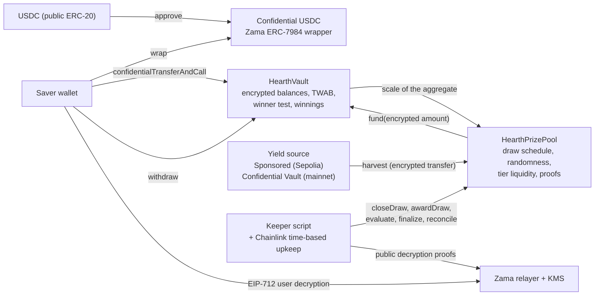
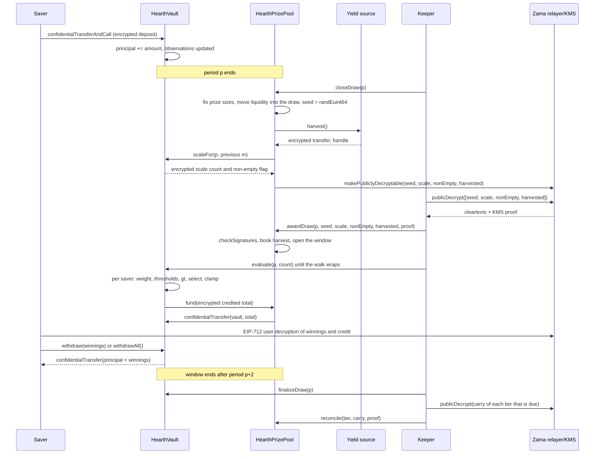
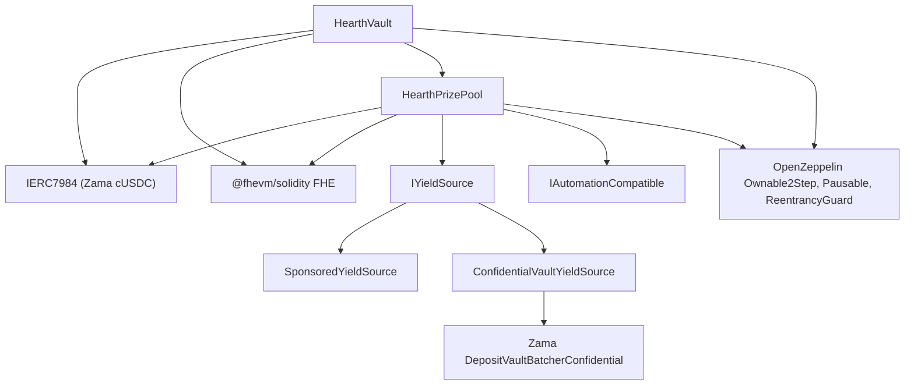

# Hearth architecture

Hearth is confidential no-loss prize savings on the Zama Protocol. Savers deposit
confidential USDC, their balances stay encrypted on chain, yield funds prizes, and a
periodic draw awards those prizes to savers with odds proportional to their
time-weighted balance. Principal is withdrawable at any time.

This document is the implementation specification. It follows PoolTogether V5's design
(time-weighted average balance, tiered prizes, per-saver winner test) and adapts each
part to encrypted arithmetic, with the deviations named in section 14. Revised 3
September 2026 after two adversarial design reviews.

## 1. System overview



Test token on Sepolia: Zama's mock USDC has a public `mint(address, uint256)` capped at one
million tokens per call; the app exposes it as one click, then shields into confidential
USDC through Zama's wrapper.

## 2. Periods, draws and windows

A period is `L` seconds long. Period 1 starts at `firstPeriodAt`, an immutable set at
deployment to a time at or before deployment. `period(ts) = (ts - firstPeriodAt) / L + 1`
for `ts >= firstPeriodAt`; `periodStart(p) = firstPeriodAt + (p - 1) * L`;
`periodEnd(p) = periodStart(p + 1)`. Draw `p` covers period `p` and is decided by balances
held during period `p`.

The window of draw `p` is periods `p+1` and `p+2`; `windowEndsAt(p) = periodEnd(p + 2)`.
Closing is allowed only in the first three quarters of the window
(`closeDeadline(p) = periodStart(p + 2) + L / 2`), so that the KMS round trip, the award
and every evaluation batch always have at least half a period left.

Draw lifecycle, all steps permissionless:

1. `closeDraw(p)`, before `closeDeadline(p)`. Fixes each tier's prize size and offered
   liquidity from the liquidity known at that moment (harvests booked by earlier awards
   plus reconciled remainders), moves that liquidity into the draw, draws a fresh encrypted
   random seed, asks the vault for the encrypted scale of period `p`'s aggregate weight,
   harvests yield as one encrypted transfer from the yield source. Four handles end up
   publicly decryptable: the pool marks the seed and the harvest, the vault marks the scale
   count and the non-empty flag inside `scaleFor`, since only the vault is allowed on them.
   Prize sizes are therefore fixed before any random value exists.
2. `awardDraw(p, seed, scaleCount, nonEmpty, harvested, proof)`, at any time after the close,
   with the KMS-signed cleartexts of the four handles in that order. Verifies the proof on
   chain, books the harvest to the tiers by shares, updates the scale, and then: inside the
   window, either opens the draw or marks it `Empty` (nobody held a balance in period `p`),
   returning the offered liquidity to the tiers; after the window, returns the offered
   liquidity and marks the draw `Skipped`. Either way no yield or liquidity is ever lost.
3. `evaluate(p, count)` on the vault, any number of times inside the window. Walks the
   saver list from a per-draw cursor that starts at `seed mod saverCount`, in list order,
   for up to `count` savers (at most `MAX_BATCH` that need encrypted work). The walk length
   is the saver count at the first evaluation of that draw; savers who join later are not in
   the walk and would have zero weight for that period anyway. Nobody chooses who is
   evaluated or in what order; a saver who wants their own result advances the same walk as
   the keeper does. Savers with no observation at or before period `p` are skipped
   in plaintext at no encrypted cost. Each evaluated saver's encrypted weight and credit are
   stored and allowed to that saver, and the encrypted total credited in the batch is
   pulled from the prize pool.
4. `finalizeDraw(p)`, after the window. The vault folds each tier's encrypted remainder
   into that tier's encrypted carry. Tiers reconcile on their own cadence: a tier is due at
   the finalization of every draw whose id is a multiple of `reconcileEvery[t]`, unless a
   publication is still pending. When due, the vault marks its carry publicly decryptable and
   records which draw published it; `reconcile(tier, carry, proof)` on the pool verifies the
   cleartext against that handle, books it into the tier's plaintext liquidity, and the vault
   subtracts it from the carry (which may have grown since) and clears the pending flag. A
   carry that is not pending is added to the tier's offered liquidity at every close; a
   pending carry waits.

Winner selection happens at the draw. From the moment `awardDraw` verifies the seed and
the scale, every saver's result for every tier is fixed: the thresholds are public
numbers anyone can recompute, and the comparison is against an encrypted weight that can
no longer change. Evaluation writes an already-decided result in a fixed order; the
keeper evaluates everyone right after the award; no saver transaction is needed to win.

A draw whose close never lands stays `None` and is skipped: its liquidity was never moved
and its harvest is collected by the next close. That period pays no prize.

## 3. Encrypted time-weighted average balance (TWAB)

Purpose: odds are proportional to the balance held over the whole period, so a deposit
made just before a draw earns only the fraction of the period it was present, and a
withdrawal right after a draw does not help. This is what stops the flash-deposit
capture that a balance-at-draw design allows.

Each saver has three observations, `current`, `previous` and `older`:

```
struct Observation { euint64 cum; euint64 balance; uint32 ts; }
```

`cum` is balance-seconds accumulated since the start of the period that contains `ts`.
Resetting at each period start bounds the accumulator by `balance * L`.

Bounds: the vault refuses any deposit whose amount, or whose resulting principal, exceeds
`maxPrincipal = (2^64 - 1) / L` (about 5 billion USDC at an hourly period, about 213
million USDC at a daily period), so a saver's `cum` never exceeds 64 bits and the
addition that checks the cap cannot wrap. The total observation uses a 128-bit `cum`, so
the aggregate never overflows for any supply the wrapper can mint.

On a balance change at time `now` in period `q` to `newBalance`:

- First ever observation: `current = { cum: 0, balance: newBalance, ts: now }`.
- Same period as `current`: `current.cum += current.balance * (now - current.ts)`, then
  set `balance` and `ts`. The observation is overwritten in place.
- Later period than `current`: `older = previous`, `previous = current`, then
  `current = { cum: current.balance * (now - periodStart(q)), balance: newBalance, ts: now }`.

Weight of a saver for period `p` (with `E = periodEnd(p)`), read from the newest
observation at or before period `p`:

- If that observation is in period `p`: `obs.cum + obs.balance * (E - obs.ts)`.
- If it is before `p`: `obs.balance * L`.
- If no observation is at or before `p`: zero, decided in plaintext from the timestamps,
  with no encrypted work.

Rule: `k` observations support a window of `k - 1` periods, because a slot is pushed at
most once per period. Three slots cover the two-period window. If history is ever
missing inside the window, that saver's weight is treated as zero rather than reverting
the batch.

The vault keeps the same three observations for the total balance. Any exit records an
observation whether or not principal changed; that is harmless, because slots shift only
when a new period has started. Winnings never count toward odds: the weight is principal
only.

## 4. The scale of the aggregate, and the winner test

The aggregate weight `W` of a period is never published. Publishing it exactly would let
an observer recover a lone mover's deposit from two consecutive aggregates and the
public timestamp of their own transaction. Instead the vault publishes the scale of `W`:
the smallest power of two at or above it, `M = 2^m`, tracked incrementally. At close the
vault compares `W` under encryption against `2^(m-2) .. 2^(m+2)` around the previous
draw's `m`, sums those five results into one small encrypted count, and separately
compares `W` against zero for the non-empty flag; both are marked publicly decryptable.
The pool sets the new `m` to `m - 2 + count`, clamped to the range 1 to 120, so the bracket moves
down by at most two steps or up by at most three per draw and catches up over a few draws
if the pool jumps more than that. An observer learns only when the pool crosses a power of
two.

Inputs fixed per draw after `awardDraw`: the public seed `R`, the public range `M`, and
for each tier `t` the prize size `prize[t]`, the prize count `count[t]`, the odds
`odds[t]` as a fraction and the offered liquidity.

PoolTogether V5 gives each saver `count[t]` independent chances per tier, each won with
probability `min(1, twab * odds[t] / W)`. Hearth reproduces that expectation, scaled by
`W / M`, with one uniform draw per tier and nested thresholds:

```
prn    = keccak256(abi.encode(R, p, u, t))
r      = prn mod M                                          // M is a power of two, so no bias
for k in 0 .. count[t]-1:
    threshold_k = floor((r + k * M) * oddsDen[t] / (oddsNum[t] * count[t]))   // plaintext
    won_k       = threshold_k < 2^64 - 1 ? FHE.gt(twab, uint64(threshold_k)) : false
    tierPay    += FHE.select(won_k, prize[t], 0)
pay[t]          = FHE.min(remaining[p][t], tierPay)
remaining[p][t] = FHE.sub(remaining[p][t], pay[t])
credit         += pay[t]
```

`won_k` is true exactly when `twab * odds * count > r + k * M`. The thresholds are nested,
so a saver wins prizes `0 .. j-1` for some `j`, and the expected number of prizes is
`min(count, twab * odds * count / M)`, linear in the saver's weight. Splitting a balance
across wallets changes nothing in expectation. Because `M` is between `W` and `2W`, a
tier pays between half and all of its nominal `count * odds` prizes per draw; what is not
paid stays in the tier's carry and is offered again.

Over-subscription: each prize is half of the tier's plaintext liquidity at close divided by
the prize count (V5's 50 percent utilisation), and the encrypted carry only adds capacity, so a tier pays twice its expected number of
prizes before the clamp bites. When it bites, the last winner in walk order receives the
remainder and later winners of that tier receive nothing. The walk order is fixed by the
seed, so nobody can buy a better place. Hearth has no reserve tier, unlike V5. The clamp
bites in about two percent of draws for the frequent tier (count 4, odds 1) and a
negligible fraction for the mid and grand tiers.

The only plaintext branch is on the public threshold exceeding 64 bits, which happens
for low-odds tiers when `M` is very large; in that case no 64-bit weight can exceed it, so
the answer is false without a comparison. Thresholds only rise with `k`, so the tier loop
stops at the first such threshold. Nothing branches on a secret.

A pure view `thresholdOf(drawId, saver, tier, k)` exposes the same arithmetic, so a judge,
the app's verify page and the tests share one implementation. `evaluate` reverts for a
draw that is `Empty`, `Skipped` or not yet awarded.

## 5. Money flow, ACL grants and invariants

- Deposits arrive through the ERC-7984 receive hook with the actually transferred
  encrypted amount. The hook refuses any caller but the configured asset. A deposit whose
  amount or resulting principal exceeds `maxPrincipal` returns an encrypted false, and the
  token refunds it in the same transaction. Principal, the saver's observations and the
  total observations are updated in the same transaction. The hook cannot see the amount,
  so any address that triggers it joins the saver list, even with an encrypted zero; such
  a saver has zero weight and can never win, and the list is never pruned. The cost of
  padding the list falls on evaluation gas only.
- `withdraw(amount)` and `withdrawAll()` are the only exits. They pay from winnings first,
  then principal, and clamp to the smaller of what the saver holds and what the vault
  holds, read from the vault's own confidential balance handle, because an ERC-7984
  transfer moves the whole amount or nothing. Every exit is one confidential transfer and
  one event, whether or not it contains a prize.
- After each evaluation batch the vault gives the prize pool a transient allowance on the
  encrypted batch total; the pool gives the token a transient allowance and transfers that
  amount to the vault. The token allows the vault on the transferred handle, so the vault
  adds any difference to one global encrypted unfunded counter, never reset, whose current
  handle is published at every finalization. With verified harvests it is always zero.
- Yield is never booked from a number the source reports. The source transfers an
  encrypted amount to the pool; the pool, allowed on that handle as the recipient, makes it
  publicly decryptable and books the KMS-verified cleartext at award time. A source that
  reverts does not stop a close: the harvest handle is then a trivial zero and a
  `HarvestFailed` event is emitted.
- Pause stops deposits and draw closing only. Withdrawals, evaluation, award, finalize and
  reconcile are never pausable.
- ACL grants, per hand-off: the vault computes the scale count and marks it publicly
  decryptable itself; the vault grants the pool a transient allowance on the batch total;
  the pool grants the token a transient allowance before `confidentialTransfer`; after
  every batch the vault re-allows itself on every remaining-liquidity and carry handle and
  allows itself and the saver on the saver's winnings, weight and credit; the hook's
  encrypted acceptance is allowed to the token for the transaction.
- Invariants, checked in tests: vault token balance equals total principal plus total
  unclaimed winnings; pool token balance equals plaintext liquidity plus every encrypted
  carry plus liquidity offered and not yet finalized; every tier's remainder is between
  zero and what was offered; paid equals credited; nobody withdraws more than principal
  plus winnings.
- Public decryption proofs are bound to handle order: `[seed, scaleCount, nonEmpty,
  harvested]` for the award and one carry handle per reconciliation. The draw state
  machine is the replay guard: each step succeeds once per draw and per tier.

## 6. Prize liquidity

Harvests are booked at award, by shares, with the integer remainder of each split going
to the grand tier, into a plaintext `liquidity[t]`. At close, for each tier:
`offered[t] = liquidity[t]` (plaintext, moved into the draw) plus the tier's encrypted
`carry[t]`, and `prize[t] = liquidity[t] * UTILISATION / count[t]` from the plaintext part
only, so prize sizes stay public and the encrypted carry only ever adds capacity.

Tiers reconcile on their own cadence. The frequent tier reconciles every draw. The mid
and grand tiers reconcile every 6 and every 24 draws respectively, so the count of prizes
they paid becomes public only over a span in which nearly every saver was eligible at
some point, rather than naming a jackpot winner out of the two percent of savers eligible
in one draw. The plaintext jackpot shown in the app is the booked liquidity; the encrypted
carry is the part it does not yet show.

Grand-tier odds are measured over one period. V5 measures them over the tier's whole
accrual window, so a large holder who joins for a single period takes a full proportional
shot at the accumulated pot. This is a stated deviation; the cheap fix, an accumulator of
balance-seconds since the last grand payout, is noted for a later version.

Tier parameters (count, odds, shares, reconcile cadence) are constructor arguments.
Sepolia, at a one-hour period: grand count 1, odds 1/24, shares 40, reconcile every 24;
mid count 1, odds 1/6, shares 20, reconcile every 6; frequent count 4, odds 1, shares
40, reconcile every draw. With a harvest of H per period the grand prize settles near
10 H and pays about daily; the frequent tier pays up to four prizes near 0.1 H each draw.

## 7. Yield source

```solidity
interface IYieldSource {
    function harvest() external returns (euint64 transferred); // confidential transfer to the recipient
    function harvestable() external view returns (uint64);      // display only
}
```

`harvest` is synchronous on purpose: it moves whatever the source holds ready at that
moment. Sources that earn asynchronously prepare that amount ahead of time.

- `SponsoredYieldSource` (Sepolia): sponsors wrap public USDC into confidential USDC held by
  the source through its own `sponsor` function; it books exactly what the wrapper minted,
  drips at `ratePerSecond`, and `harvest` transfers the accrued amount to the pool. Sponsor
  amounts, the rate and harvests are public, as yield amounts are in PoolTogether. A
  sponsorship is a donation to the prize pool and cannot be withdrawn; only the owner can
  change the rate. Yield that accrues while the pool has no savers is paid to the first
  draws that have any.
- `ConfidentialVaultYieldSource` (mainnet path): the pool's confidential USDC is joined
  into Zama's Confidential Vault deposit batcher and held as confidential shares. The
  keeper periodically requests a redemption of the growth through the redeem batcher
  (join, dispatch, finalize, claim, each permissionless), so that by the next `harvest`
  the redeemed confidential USDC is already sitting in the adapter; `harvest` then
  transfers it. On Sepolia the staging vault is idle, so the adapter is documented and
  tested against the batcher interface, not wired to the live pool.

## 8. Randomness and verifiability

`FHE.randEuint64()` is generated inside the coprocessor from a public seed under the FHE
key; nobody can predict or re-roll it, and `closeDraw` runs once per draw. Prize sizes are
fixed before the seed exists, so nothing anyone does after seeing the seed can change what
a win is worth. The draw publishes `R`, the scale count, the non-empty flag and the
harvest once the period is over, verified on chain through `FHE.checkSignatures`. Anyone
can recompute every threshold from `R` and `M`; a saver can check their own outcome
against their decrypted weight.

Once `R` and `M` are public, whoever would call `awardDraw` can compute their own outcome.
Awarding is permissionless and the app offers it to anyone, so a keeper that declines to
award a draw it lost cannot make the draw disappear; the residual is stated in the threat
model.

## 9. Automation and the keeper

`HearthPrizePool` implements Chainlink's `checkUpkeep` and `performUpkeep` for the close
step, which needs no off-chain data. The keeper script performs every step, in this
order for draw `p`: close early in period `p+1`; fetch the four public decryptions;
award; evaluate by advancing the walk in batches of `MAX_BATCH` until the cursor wraps;
after the window, finalize, and for each tier that is due fetch the carry decryption and
reconcile. Every step is callable by anyone, so a saver can always advance a draw
themselves. The keeper's spend per draw is its own policy; nothing on chain caps
evaluation.

## 10. What stays encrypted, what is public

Encrypted, decryptable only by the saver: principal, unclaimed winnings, the weight and
the credit of every evaluated draw, and therefore whether they won a given draw.

Public by design: the list of saver addresses and when each deposited, withdrew or was
evaluated, and in which batch; the per-draw seed, the scale of the aggregate (its power
of two), the harvest, each tier's prize size and offered liquidity; how many prizes the
frequent tier paid, once per draw, and how many the mid and grand tiers paid, once per
6 and per 24 draws; sponsor amounts; the amount wrapped into or unwrapped out of
confidential USDC, which is a public ERC-20 movement at the token layer.

Inferable, and named as such: a saver whose balance an observer can pin, for example
because they wrapped exactly what they deposited seconds earlier, has a public outcome
in every draw, because thresholds are public; the app keeps wrap and deposit as separate
steps and offers round wrap amounts for this reason. Cumulative winnings become a public
lower bound for an address that wraps in and unwraps out in full. A balance that never
changes is narrowed slowly by the published prize counts over many draws. When the
grand tier pays, the winner is one of the savers eligible for it during the reconcile
span, roughly the whole pool over a day, not one saver out of a draw.

Anonymity set: with one saver the scale of the aggregate is that saver's weight to
within a factor of two; with two, each can bound the other. The app states this below
three savers.

Token layer: Zama's confidential USDC is an upgradeable wrapper whose owner can appoint
observers able to decrypt every amount that moves through the token, including deposit
and payout amounts, retroactively, and can pause or deny-list addresses. Hearth's own
ledger (principal, winnings, weights, credits) is never readable by the token or an
observer.

Residual behavioural leak: a saver who withdraws immediately after every draw they won
gives an observer a statistical hint. No winner-only transaction type exists on chain; a
claim is an ordinary withdraw of the winnings amount, and evaluation cannot be aimed at
oneself.

## 11. Main sequence: one draw end to end



## 12. Contract dependency graph



## 13. Events, views and constructors

Events. Vault: `Deposited(saver)`, `Withdrawn(saver)`, `Evaluated(saver, drawId)`,
`DrawFinalized(drawId, unfunded)`, `CarryPublished(drawId, tier, carryHandle)`,
`PrizePoolSet(prizePool)`, plus OpenZeppelin's `Paused`, `Unpaused`,
`OwnershipTransferStarted`, `OwnershipTransferred`. Pool: `DrawClosed(drawId, seedHandle,
scaleHandle, nonEmptyHandle, harvestHandle, prize[3], offered[3])` where `offered` is the
plaintext part moved into the draw, `DrawAwarded(drawId,
seed, scaleBits, harvested)`, `DrawEmpty(drawId, harvested)`, `DrawSkipped(drawId,
harvested)`, `TierReconciled(drawId, tier, carry)`, `HarvestFailed(drawId)`,
`YieldSourceSet(yieldSource)`, `Funded(amount)`. Source: `Sponsored(from, amount,
balance)`, `RateChanged(rate)`, `Harvested(amount, balance)`.

Views the app and keeper read. Vault: `confidentialBalanceOf(saver)`,
`confidentialWinningsOf(saver)`, `weightHandle(drawId, saver)`, `creditHandle(drawId,
saver)`, `thresholdOf(drawId, saver, tier, k)`, `observationOf(saver, slot)`,
`evaluated(drawId, saver)`, `evaluatedCount(drawId)`, `cursorOf(drawId)`,
`saverCount()`, `saverAt(i)`, `isSaver(a)`, `firstObservationAt(saver)`,
`remainingHandles(drawId)`, `carryHandle(tier)`, `finalized(drawId)`,
`unfundedHandle()`, `currentPeriod()`, `periodOf(ts)`, `periodEnd(p)`,
`windowEndsAt(p)`, `maxPrincipal()`, `paused()`. Pool: `drawOf(drawId)`,
`drawParams(drawId)`, `tierOf(t)`, `liquidity(t)`, `scaleBits()`, `canClose()`,
`closableDraw()`, `closeDeadline(p)`, `currentPeriod()`, `yieldSource()`, `paused()`.
Source: `harvestable()`, `balance()`, `ratePerSecond()`.

Constructors and deploy order:

```
HearthVault(IERC7984 asset, uint256 periodLength, uint256 firstPeriodAt, address owner)
HearthPrizePool(IHearthVault vault, IERC7984 asset, Tier[3] tiers, uint8 initialScaleBits, address owner)
    Tier = { uint32 prizeCount; uint64 oddsNumerator; uint64 oddsDenominator; uint16 shares; uint16 reconcileEvery }
SponsoredYieldSource(IERC7984ERC20Wrapper asset, address recipient, uint64 ratePerSecond, address owner)
```

Deploy the vault, then the pool, then `vault.setPrizePool(pool)`, then the source with the
pool as recipient, then `pool.setYieldSource(source)`, then sponsor it. `initialScaleBits`
is the expected first-period aggregate's bit length; the scale tracker corrects it by up
to three bits per draw.

## 14. Deviations from PoolTogether V5, and review history

Deviations: no reserve tier; grand odds per period rather than over the accrual window;
one uniform draw per tier with nested thresholds instead of one per prize index; the
draw range is the aggregate's power-of-two bracket rather than the exact aggregate, so a
tier pays between half and all of its nominal prizes per draw; prizes are held as an
encrypted winnings balance until withdrawn rather than transferred at claim.

Resolved in the 2 September review of the first draft: folded prize counts, unverified
harvests, a one-period window, wrong overflow claims, undefined evaluation semantics,
missing events and views, the claim presentation.

Resolved in the 3 September review of the second draft: the exact aggregate leak
(replaced by the scale), prize sizes fixed after the seed (moved to close), a last-block
close stranding a draw (close deadline plus returned liquidity), self-evaluation as a
winner tell (fixed walk order), jackpot winners identifiable from per-draw counts (tier
reconcile cadence), withdrawals assuming a clamping token (clamp to the vault balance),
the cap check wrapping, a reverting yield source stalling closes, unbounded tier
configuration, and the missing threshold view.

Accepted and documented: evaluation order decides ties in an over-subscribed tier; a
saver not evaluated inside the window forfeits that draw, as an unclaimed V5 prize
expires; privacy below three savers; a pinned balance has a public outcome; the token
operator's observer power; slow narrowing of static balances.
