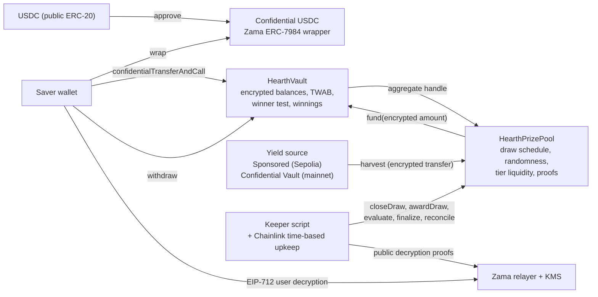
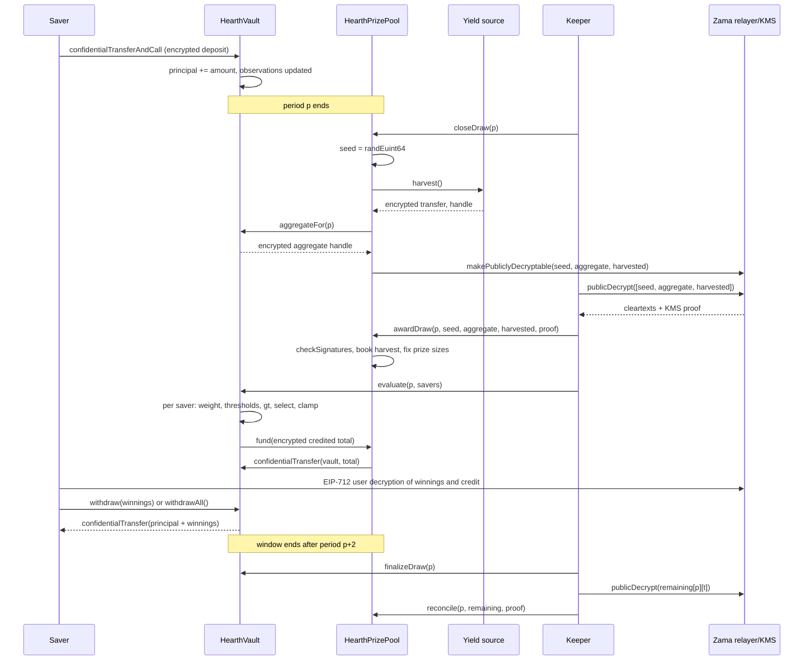
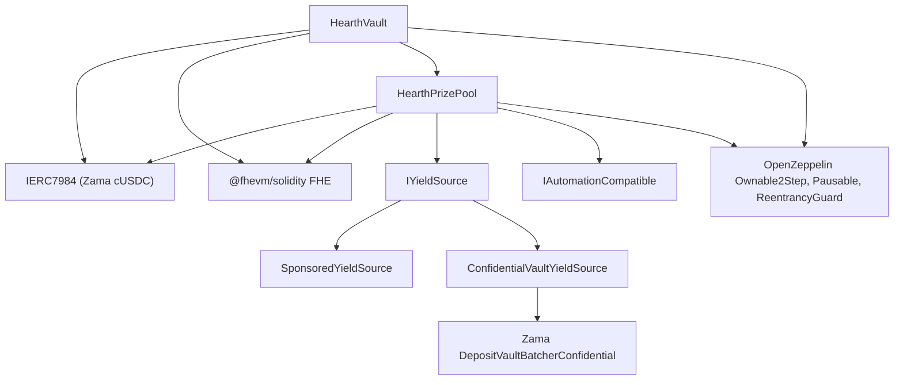

# Hearth architecture

Hearth is confidential no-loss prize savings on the Zama Protocol. Savers deposit
confidential USDC, their balances stay encrypted on chain, yield funds prizes, and a
periodic draw awards those prizes to savers with odds proportional to their
time-weighted balance. Principal is withdrawable at any time.

This document is the implementation specification. It follows PoolTogether V5's design
(time-weighted average balance, tiered prizes, per-saver winner test) and adapts each
part to encrypted arithmetic. Revised 3 September 2026 after an adversarial design review;
the review's findings and their resolutions are listed in section 14.

## 1. System overview



Test token on Sepolia: Zama's mock USDC has a public `mint(address, uint256)` capped at one
million tokens per call; the app exposes it as one click, then shields into confidential
USDC through Zama's wrapper.

## 2. Periods, draws and windows

A period is `L` seconds long. Period 1 starts at `firstPeriodAt`, an immutable set at
deployment to a time at or before deployment. `period(ts) = (ts - firstPeriodAt) / L + 1`
for `ts >= firstPeriodAt`; `periodStart(p) = firstPeriodAt + (p - 1) * L`;
`periodEnd(p) = periodStart(p + 1)`. Draw `p` covers period `p` and is decided by balances
held during period `p`.

The window of draw `p` is periods `p+1` and `p+2`. Every step of draw `p` must land
inside its window; `windowEndsAt(p) = periodEnd(p + 2)`.

Draw lifecycle, all steps permissionless:

1. `closeDraw(p)`, inside the window. Draws a fresh encrypted random seed, snapshots the
   encrypted aggregate weight of period `p`, harvests yield as one encrypted transfer from
   the yield source, and marks all three handles publicly decryptable.
2. `awardDraw(p, seed, aggregate, harvested, proof)`, inside the window, with the KMS-signed
   cleartexts of the three handles in that order. Verifies the proof on chain, credits the
   verified harvest to the tiers by shares, then either opens the draw (fixes each tier's
   prize size and offered liquidity) or marks it `Empty` when the aggregate is zero or no
   tier has liquidity. If the window has already closed, the harvest is still credited and
   the draw is marked `Skipped`, so no yield is ever lost.
3. `evaluate(p, savers[])` on the vault, any number of times inside the window, at most
   `MAX_BATCH` savers per call. Runs the winner test for each saver over encrypted values,
   credits encrypted winnings, stores the saver's encrypted weight and credit for that
   draw, and pulls the encrypted total credited from the prize pool. A saver is evaluated
   once per draw; repeats and unknown addresses are skipped without reverting.
4. `finalizeDraw(p)`, after the window. The vault marks each tier's encrypted remaining
   liquidity and its unfunded counter publicly decryptable. `reconcile(p, remaining[],
   proof)` on the pool returns unpaid liquidity to the tiers.

Winner selection happens at the draw. From the moment `awardDraw` verifies the seed and the
aggregate, every saver's result for every tier is fixed: the thresholds are public numbers
anyone can recompute, and the comparison is against an encrypted weight that can no longer
change. Evaluation writes an already-decided result. The keeper evaluates everyone in
saver-list order right after the award; any saver can evaluate themselves or anyone else
from the app; no saver transaction is needed to win.

A draw whose close or award never lands stays `None` or `Closed` and is skipped: its
liquidity, if it was never offered, stays in the tiers, and its harvest is booked by the
late award. Nothing is lost; that period pays no prize.

## 3. Encrypted time-weighted average balance (TWAB)

Purpose: odds are proportional to the balance held over the whole period, so a deposit
made just before a draw earns only the fraction of the period it was present, and a
withdrawal right after a draw does not help. This is what stops the flash-deposit
capture that a balance-at-draw design allows.

Each saver has three observations, `current`, `previous` and `older`:

```
struct Observation { euint64 cum; euint64 balance; uint32 ts; }
```

`cum` is balance-seconds accumulated since the start of the period that contains `ts`.
Resetting at each period start bounds the accumulator by `balance * L`.

Bounds: the vault refuses any deposit that would put a saver above
`maxPrincipal = (2^64 - 1) / L` (about 10 billion USDC at a 30-minute period, about 213
million USDC at a daily period), so a saver's `cum` never exceeds 64 bits. The total
observation uses a 128-bit `cum`, so the aggregate never overflows for any supply the
wrapper can mint.

On a balance change at time `now` in period `q` to `newBalance`:

- First ever observation: `current = { cum: 0, balance: newBalance, ts: now }`.
- Same period as `current`: `current.cum += current.balance * (now - current.ts)`, then
  set `balance` and `ts`. The observation is overwritten in place.
- Later period than `current`: `older = previous`, `previous = current`, then
  `current = { cum: current.balance * (now - periodStart(q)), balance: newBalance, ts: now }`.

Weight of a saver for period `p` (with `E = periodEnd(p)`), read from the newest
observation at or before period `p`:

- If that observation is in period `p`: `obs.cum + obs.balance * (E - obs.ts)`.
- If it is before `p`: `obs.balance * L`.
- If no observation is at or before `p`: zero, decided in plaintext from the timestamps,
  with no encrypted work.

Inside the window (periods `p+1` and `p+2`) the newest observation at or before `p` is
always one of the three slots: at most two later periods have started, so at most two
newer observations have been pushed. The vault keeps the same three observations for the
total balance, so the aggregate weight of a period is computed the same way and is valid
for the same window.

Every encrypted operation here is one multiply by a public number and one add.

## 4. Winner test

Inputs fixed per draw after `awardDraw`: the public seed `R`, the public aggregate weight
`W`, and for each tier `t` the prize size `prize[t]`, the prize count `count[t]`, the odds
`odds[t]` as a fraction and the offered liquidity `offered[t]`.

PoolTogether V5 gives each saver `count[t]` independent chances per tier, each won with
probability `min(1, twab * odds[t] / W)`. Hearth reproduces that expectation with one
uniform draw per tier and nested thresholds, so that the number of prizes a saver wins in
tier `t` is `floor(z)` or `ceil(z)` with `z = twab * odds[t] * count[t] / W`, capped at
`count[t]`:

```
prn    = keccak256(abi.encode(R, p, u, t))
r      = uniform(prn, W)                                   // rejection sampling, plaintext
for k in 0 .. count[t]-1:
    threshold_k = floor((r + k * W) * oddsDen[t] / (oddsNum[t] * count[t]))   // plaintext
    won_k       = threshold_k < 2^64 ? FHE.gt(twab, uint64(threshold_k)) : false
    tierPay    += FHE.select(won_k, prize[t], 0)
pay[t]          = FHE.min(remaining[p][t], tierPay)
remaining[p][t] = FHE.sub(remaining[p][t], pay[t])
credit         += pay[t]
```

`won_k` is true exactly when `twab * odds * count > r + k * W`. The thresholds are nested,
so a saver wins prizes `0 .. j-1` for some `j`, and the expected number of prizes is
exactly `min(count, z)`, linear in the saver's share. Splitting a balance across wallets
changes nothing in expectation, and a large holder's expected prizes equal V5's.

Over-subscription: each prize is half of the tier's liquidity divided by the prize count
(V5's 50 percent utilisation), so a tier pays twice its expected number of prizes before
the clamp bites. When it bites, the last winner receives the remainder and later winners
of that tier receive nothing, in evaluation order. Hearth has no reserve tier, unlike V5,
which tops up an over-subscribed tier from its reserve. How often the clamp bites depends
on the tier's expected number of prizes: about two percent of draws for the frequent tier
(count 4, odds 1, expected four prizes, capacity eight), six to eight percent for a tier
that expects one prize per draw, and a negligible fraction for the mid tier (one prize
every six draws) and the grand tier (one in 48). It is documented, and a saver can
evaluate themselves early.

`evaluate` reverts for a draw that is `Empty`, `Skipped` or not yet awarded. Winnings
never count toward odds: the weight is principal only.

The only plaintext branch is on the public threshold exceeding 64 bits, which happens
for low-odds tiers when the aggregate is very large; in that case no 64-bit weight can
exceed it, so the answer is false without a comparison. Nothing branches on a secret.

The vault stores, per draw and saver, the encrypted weight and the encrypted credit, both
decryptable by that saver only, so the app can show "you won X in draw p" and let the
saver verify the comparison against the published thresholds.

## 5. Money flow, ACL grants and invariants

- Deposits arrive through the ERC-7984 receive hook with the actually transferred
  encrypted amount. The hook refuses any caller but the configured asset. A deposit that
  would exceed `maxPrincipal` returns an encrypted false, and the token refunds it in the
  same transaction. Principal, the saver's observations and the total observations are
  updated in the same transaction. The hook cannot see the amount, so any address that
  triggers it joins the saver list, even with an encrypted zero; such a saver has zero
  weight and can never win, and the list is never pruned. The cost of padding the list
  falls on the keeper's evaluation gas only.
- Any exit records an observation, whether or not principal changed. That is harmless:
  observations shift only when a new period has started, so the newest observation at or
  before period `p` stays available for the whole two-period window.
- Pause stops deposits and draw closing only. Withdrawals, evaluation, award, finalize and
  reconcile are never pausable, which is what keeps "withdraw at any time" true.
- `withdraw(amount)` and `withdrawAll()` are the only exits. They pay from winnings first,
  then principal, clamp to what is available, and re-credit any shortfall the token
  reports into winnings, so principal accounting stays exact. Every exit is one
  confidential transfer and one event, whether or not it contains a prize.
- After each evaluation batch the vault gives the prize pool a transient allowance on the
  encrypted batch total; the pool gives the token a transient allowance and transfers that
  amount to the vault. The token allows the vault on the transferred handle, so the vault
  adds any shortfall to one global encrypted unfunded counter, whose current handle is
  published at every finalization. With verified harvests the counter is always zero.
- Yield is never booked from a number the source reports. The source transfers an
  encrypted amount to the pool; the pool, allowed on that handle as the recipient, makes it
  publicly decryptable and books the KMS-verified cleartext at award time.
- ACL grants, per hand-off: the vault computes the aggregate and marks it publicly
  decryptable itself; the vault grants the pool a transient allowance on the batch total;
  the pool grants the token a transient allowance before `confidentialTransfer`; after every
  batch the vault re-allows itself on every remaining-liquidity handle and allows itself and
  the saver on the saver's winnings, weight and credit; the hook's encrypted acceptance is
  allowed to the token for the transaction.
- Invariants, checked in tests: vault token balance equals total principal plus total
  unclaimed winnings; pool token balance equals total tier liquidity plus liquidity offered
  and not yet reconciled; every tier's remainder is between zero and what was offered;
  paid equals credited; nobody withdraws more than principal plus winnings.
- Public decryption proofs are bound to handle order: `[seed, aggregate, harvested]` for
  the award and the three remainders in tier order for reconciliation. The draw state
  machine is the replay guard: each step succeeds once per draw.

## 6. Prize liquidity (plaintext)

Harvests and reconciled remainders accumulate in `liquidity[t]` by shares, with the
integer remainder of each split going to the grand tier. At award time, for each tier:
`prize[t] = liquidity[t] * UTILISATION / count[t]`, `offered[t] = liquidity[t]`, and the
tier's liquidity is zero until reconciliation returns what was not paid. A remainder
reconciled after the next award is offered one draw later; nothing is lost. The grand
tier has low odds, so its liquidity accumulates across draws and pays rarely and large.

Grand-tier odds are measured over one period. V5 measures them over the tier's whole
accrual window, so a large holder who joins for a single period takes a full proportional
shot at the accumulated pot. This is a stated deviation; the cheap fix, an accumulator of
balance-seconds since the last grand payout, is noted for a later version.

Tier parameters (count, odds, shares) are constructor arguments chosen with V5's odds
formula in the deploy config. Sepolia, at a 30-minute period: grand count 1, odds 1/48,
shares 40; mid count 1, odds 1/6, shares 20; frequent count 4, odds 1, shares 40. With a
harvest of H per period the grand prize settles near 19 H and pays about daily; the
frequent tier pays four prizes near 0.1 H each draw.

## 7. Yield source

```solidity
interface IYieldSource {
    function harvest() external returns (euint64 transferred); // confidential transfer to the recipient
    function harvestable() external view returns (uint64);      // display only
}
```

`harvest` is synchronous on purpose: it moves whatever the source holds ready at that
moment. Sources that earn asynchronously prepare that amount ahead of time.

- `SponsoredYieldSource` (Sepolia): sponsors wrap public USDC into confidential USDC held by
  the source through its own `sponsor` function; it books exactly what the wrapper minted,
  drips at `ratePerSecond`, and `harvest` transfers the accrued amount to the pool. Sponsor
  amounts, the rate and harvests are public, as yield amounts are in PoolTogether. A
  sponsorship is a donation to the prize pool and cannot be withdrawn; only the owner can
  change the rate. Yield that accrues while the pool has no savers is paid to the first
  draws that have any.
- `ConfidentialVaultYieldSource` (mainnet path): the pool's confidential USDC is joined
  into Zama's Confidential Vault deposit batcher and held as confidential shares. The
  keeper periodically requests a redemption of the growth through the redeem batcher
  (join, dispatch, finalize, claim, each permissionless), so that by the next `harvest`
  the redeemed confidential USDC is already sitting in the adapter; `harvest` then
  transfers it. On Sepolia the staging vault is idle, so the adapter is documented and
  tested against the batcher interface, not wired to the live pool.

## 8. Randomness and verifiability

`FHE.randEuint64()` is generated inside the coprocessor from a public seed under the FHE
key; nobody can predict or re-roll it, and `closeDraw` runs once per draw. The draw
publishes `R`, `W` and the harvest once the period is over, verified on chain through
`FHE.checkSignatures`. Anyone can recompute every threshold; a saver can check their own
outcome against their decrypted weight. The bias of `uniform` is removed by rejection
sampling.

Once `R` and `W` are public, whoever would call `awardDraw` can compute their own outcome.
Awarding is permissionless and the app offers it to anyone, so a keeper that declines to
award a draw it lost cannot make the draw disappear; the residual is stated in the threat
model.

## 9. Automation and the keeper

`HearthPrizePool` implements Chainlink's `checkUpkeep` and `performUpkeep` for the close
step, which needs no off-chain data. The keeper script performs every step, in this
order for draw `p`: close; fetch the three public decryptions; award; evaluate savers in
saver-list order in batches of `MAX_BATCH`, skipping savers whose first observation is
after period `p`; after the window, finalize, fetch the remainder decryptions, reconcile;
and it reconciles `p` before awarding `p+1` whenever possible. Every step is callable by
anyone, so a saver can always advance a draw themselves. The keeper's spend per draw is
its own policy; nothing on chain caps evaluation.

## 10. What stays encrypted, what is public

Encrypted, decryptable only by the saver: principal, unclaimed winnings, the weight and
the credit of every evaluated draw, and therefore whether they won a given draw.

Public by design: the list of saver addresses and when each deposited, withdrew or was
evaluated, and in which batch; the per-draw seed, aggregate weight and harvest; each
tier's prize size and how many prizes it paid, learned once per draw from the reconciled
remainder; sponsor amounts; the amount wrapped into or unwrapped out of confidential USDC,
which is a public ERC-20 movement at the token layer.

Anonymity set: with one saver the published aggregate is that saver's weight; with two,
each can subtract the other. The app states this below three savers.

Token layer: Zama's confidential USDC is an upgradeable wrapper whose owner can appoint
observers able to decrypt every amount that moves through the token, including deposit
and payout amounts, and can pause or deny-list addresses. Hearth's own ledger (principal,
winnings, weights, credits) is never readable by the token or an observer.

Residual behavioural leak: a saver who withdraws immediately after every draw they won
gives an observer a statistical hint. No winner-only transaction type exists on chain; a
claim is an ordinary withdraw of the winnings amount.

## 11. Main sequence: one draw end to end



## 12. Contract dependency graph



## 13. Events and views

Events. Vault: `Deposited(saver)`, `Withdrawn(saver)`, `Evaluated(saver, drawId)`,
`DrawFinalized(drawId, remaining[3], unfunded)`, `PrizePoolSet(prizePool)`, plus
OpenZeppelin's `Paused`, `Unpaused`, `OwnershipTransferStarted`, `OwnershipTransferred`.
Pool: `DrawClosed(drawId, seedHandle, aggregateHandle, harvestHandle)`,
`DrawAwarded(drawId, seed, aggregate, harvested, prize[3], offered[3])`,
`DrawEmpty(drawId, aggregate, harvested)`, `DrawSkipped(drawId, harvested)`,
`DrawReconciled(drawId, paid[3], returned[3])`, `YieldSourceSet(yieldSource)`,
`Funded(amount)`. Source: `Sponsored(from, amount, balance)`, `RateChanged(rate)`,
`Harvested(amount, balance)`.

Views the app and keeper read. Vault: `confidentialBalanceOf(saver)`,
`confidentialWinningsOf(saver)`, `weightHandle(drawId, saver)`, `creditHandle(drawId,
saver)`, `observationOf(saver, slot)`, `evaluated(drawId, saver)`,
`evaluatedCount(drawId)`, `saverCount()`, `saverAt(i)`, `isSaver(a)`,
`firstObservationAt(saver)`, `aggregateHandle(period)`, `remainingHandles(drawId)`,
`finalized(drawId)`, `unfundedHandle()`, `currentPeriod()`, `periodOf(ts)`,
`periodEnd(p)`, `windowEndsAt(p)`, `maxPrincipal()`, `paused()`. Pool: `drawOf(drawId)`,
`drawParams(drawId)`, `tierOf(t)`, `liquidity(t)`, `canClose()`, `closableDraw()`,
`currentPeriod()`, `yieldSource()`, `paused()`. Source: `harvestable()`, `balance()`,
`ratePerSecond()`.

Constructors and deploy order:

```
HearthVault(IERC7984 asset, uint256 periodLength, uint256 firstPeriodAt, address owner)
HearthPrizePool(IHearthVault vault, IERC7984 asset, Tier[3] tiers, address owner)
    Tier = { uint32 prizeCount; uint64 oddsNumerator; uint64 oddsDenominator; uint16 shares }
SponsoredYieldSource(IERC7984ERC20Wrapper asset, address recipient, uint64 ratePerSecond, address owner)
```

Deploy the vault, then the pool, then `vault.setPrizePool(pool)`, then the source with the
pool as recipient, then `pool.setYieldSource(source)`, then sponsor it.

The exact reads and writes per screen are listed in the app section of the docs once
the contracts are deployed; the addresses and ABI go in the README.

## 14. Review findings and resolutions

From the 2 September review of the first draft:

- Folding the prize count into the winning zone broke proportionality for large holders
  and rewarded wallet splitting. Resolved: nested thresholds, section 4.
- Harvested yield was booked from the source's own report. Resolved: the pool decrypts
  and verifies the transferred amount, sections 2 and 5.
- A one-period window was fragile at 30-minute periods. Resolved: three observations and a
  two-period window, sections 2 and 3.
- The 64-bit accumulator claim was wrong. Resolved: per-saver cap and a 128-bit total,
  section 3.
- Double evaluation, uninitialised remainders, empty aggregates, missing events and views,
  keeper ordering and the claim presentation were undefined. Resolved in sections 2, 4, 9
  and 13.
- Accepted as documented limitations: no reserve tier; grand odds per period; evaluation
  order decides ties in an over-subscribed tier; a saver not evaluated inside the window
  forfeits that draw, as an unclaimed V5 prize expires; privacy below three savers.
