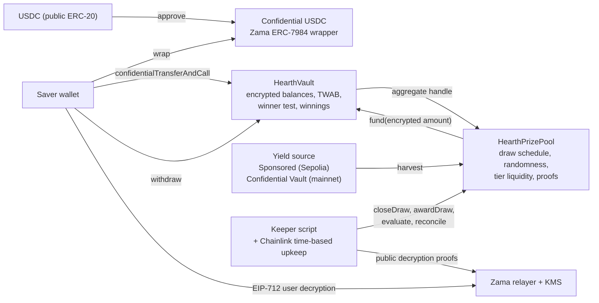
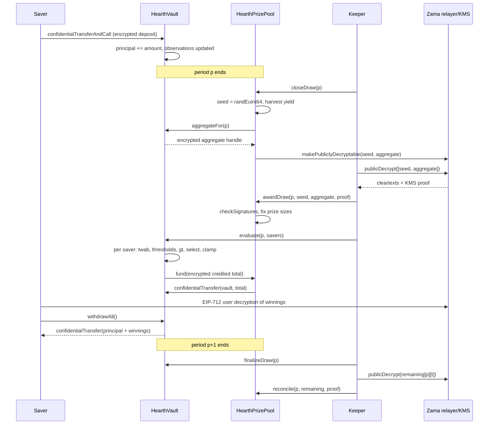
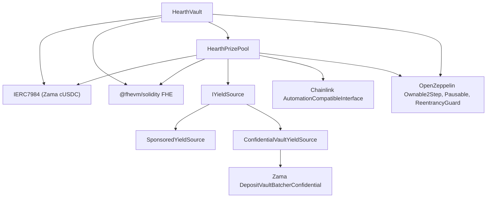

# Hearth architecture

Hearth is confidential no-loss prize savings on the Zama Protocol. Savers deposit
confidential USDC, their balances stay encrypted on chain, yield funds prizes, and a
periodic draw awards those prizes to savers with odds proportional to their
time-weighted balance. Principal is withdrawable at any time.

This document is the implementation specification. It follows PoolTogether V5's design
(time-weighted average balance, tiered prizes, per-saver winner test) and adapts each
part to encrypted arithmetic.

## 1. System overview



## 2. Periods and draws

A period is `L` seconds long. Period 1 starts at `firstPeriodAt`, an immutable set at
deployment. `period(ts) = (ts - firstPeriodAt) / L + 1` for `ts >= firstPeriodAt`.
Draw `p` covers period `p` and is decided by balances held during period `p`.

Draw lifecycle, all steps permissionless:

1. `closeDraw(p)`, once period `p` has ended and while period `p+1` is running. Draws a
   fresh encrypted random seed, snapshots the encrypted aggregate weight of period `p`,
   marks both publicly decryptable, harvests yield into the tier liquidity.
2. `awardDraw(p, seed, aggregate, proof)`, with the KMS-signed cleartexts of both handles.
   Verifies the proof on chain, fixes the prize size of each tier for this draw, and opens
   the evaluation window, which lasts until period `p+1` ends.
3. `evaluate(p, savers[])` on the vault, any number of times during the window, at most
   `MAX_BATCH` savers per call. Runs the winner test for each saver over encrypted
   values, credits encrypted winnings, and pulls the encrypted total credited from the
   prize pool.
4. `finalizeDraw(p)`, after the window. The vault marks each tier's encrypted remaining
   liquidity publicly decryptable. `reconcile(p, remaining[], proof)` on the pool returns
   unpaid liquidity to the tiers for the next draw.

If `closeDraw` or `awardDraw` is missed for a whole period, the draw is skipped and its
liquidity rolls into the next one. Nothing is lost; the period simply pays no prize.

## 3. Encrypted time-weighted average balance (TWAB)

Purpose: odds are proportional to the balance held over the whole period, so a deposit
made just before a draw earns only the fraction of the period it was present, and a
withdrawal right after a draw does not help. This is what stops the flash-deposit
capture that a balance-at-draw design allows.

Each saver has two observations, `current` and `previous`:

```
struct Observation { euint64 cum; euint64 balance; uint32 ts; }
```

`cum` is balance-seconds accumulated since the start of the period that contains `ts`.
Resetting at each period start keeps the accumulator far inside 64 bits: even the whole
wrapper supply held for a day is below 2^61.

On a balance change at time `now` in period `q` to `newBalance`:

- First ever observation: `current = { cum: 0, balance: newBalance, ts: now }`.
- Same period as `current`: `current.cum += current.balance * (now - current.ts)`, then
  set `balance` and `ts`. The observation is overwritten in place.
- Later period than `current`: `previous = current`, then
  `current = { cum: current.balance * (now - periodStart(q)), balance: newBalance, ts: now }`.

TWAB of saver for period `p` (with `E = periodEnd(p)`, valid while period `p+1` runs):

- If `current` is in period `p`: `current.cum + current.balance * (E - current.ts)`.
- If `current` is before `p`: `current.balance * L`.
- If `current` is after `p`: use `previous` the same way; `previous` is always at or before
  `p` while period `p+1` runs, because `current` was written during `p+1` and `previous`
  holds the last observation of an earlier period.
- If the saver has no observation at or before `p`: zero.

The vault keeps the same pair of observations for the total balance, so the aggregate
weight of a period is computed the same way. Every encrypted operation here is one
multiply by a public number and one add.

## 4. Winner test

Inputs fixed per draw after `awardDraw`: the public seed `R`, the public aggregate weight
`W`, and for each tier `t` the prize size `prize[t]`, the prize count `count[t]` and the
odds `odds[t]` as a fraction.

For saver `u` and tier `t`:

```
prn       = keccak256(abi.encode(R, p, u, t))
r         = uniform(prn, W)                      // PoolTogether's rejection sampler, plaintext
threshold = floor(r / (odds[t] * count[t]))      // plaintext, uint256
won       = threshold < 2^64 ? FHE.gt(twab, uint64(threshold)) : false
```

This is PoolTogether V5's rule `uniform(prn, W) < twab * odds * count`, rearranged so the
encrypted side is a single comparison against a public number. Folding the prize count
into the zone means a saver can win at most one prize per tier per draw; the expected
number of winners per tier per draw stays `count[t] * odds[t]`, exactly as in V5. A saver
whose zone exceeds the whole aggregate wins that tier with certainty, which is also V5's
behaviour for large holders.

Payout with the over-subscription clamp:

```
pay[t]         = FHE.select(won, FHE.min(remaining[p][t], prize[t]), 0)
remaining[p][t] = FHE.sub(remaining[p][t], pay[t])
credit         = pay[0] + pay[1] + pay[2]
winnings[u]   += credit
batchTotal    += credit
```

`remaining[p][t]` starts at the tier's whole liquidity, and each prize is half of that
liquidity divided by the prize count (V5's 50 percent utilisation rate), so a tier can pay
twice its expected number of winners before the clamp bites. When it bites, the last
winner receives the remainder and later winners of that tier receive nothing, as in V5.

Nothing in this test branches on a secret. The only plaintext branch is on the public
threshold overflowing 64 bits, which happens when the aggregate is tiny.

## 5. Money flow and invariants

- Deposits arrive through the ERC-7984 receive hook with the actually transferred
  encrypted amount. Principal, the saver's observations and the total observations are
  updated in the same transaction.
- `withdraw(amount)` and `withdrawAll()` are the only exits. They pay from winnings first,
  then principal, clamp to what is available, and re-credit any shortfall the token
  reports. Every exit is one confidential transfer and one event, whether or not it
  contains a prize.
- After each evaluation batch the vault asks the prize pool for the encrypted total it
  just credited; the pool transfers that amount confidentially. The plaintext tier
  accounting guarantees the pool holds at least the liquidity offered in the open window.
- Invariant, checked in tests: vault token balance equals total principal plus total
  unclaimed winnings; pool token balance equals total tier liquidity plus liquidity
  offered but not yet reconciled.

## 6. Prize liquidity (plaintext)

Harvested yield is split across tiers by shares. At award time, for each tier:
`prize[t] = liquidity[t] * UTILISATION / count[t]`, `offered[t] = liquidity[t]`, and the
tier's liquidity is zero until reconciliation returns what was not paid. The grand tier
has low odds, so its liquidity accumulates across draws and pays out rarely and large.
Tier parameters (count, odds, shares) are constructor arguments, chosen with V5's odds
formula in the deploy config and documented in the README.

## 7. Yield source

```solidity
interface IYieldSource {
    function harvestable() external view returns (uint64);
    function harvest() external returns (uint64 amount); // transfers cUSDC to msg.sender
}
```

- `SponsoredYieldSource` (Sepolia): sponsors wrap USDC into confidential USDC held by the
  source; it drips at `ratePerSecond` and `harvest` transfers the accrued amount to the
  pool. Amounts are public, as yield amounts are in PoolTogether.
- `ConfidentialVaultYieldSource` (mainnet path): joins Zama's Confidential Vault deposit
  batcher with the pool's confidential USDC, holds confidential shares, and redeems
  growth through the redeem batcher. On Sepolia the staging vault is idle, so the adapter
  is documented and tested against the batcher interface, not wired to the live pool.

## 8. Randomness and verifiability

`FHE.randEuint64()` is generated inside the coprocessor from a public seed under the FHE
key; nobody can predict or re-roll it. The draw publishes `R` and `W` once the period is
over, verified on chain through `FHE.checkSignatures`. Anyone can recompute every
threshold; a saver can check their own outcome against their decrypted TWAB. The bias of
`uniform` is removed by rejection sampling.

## 9. Automation

`HearthPrizePool` implements Chainlink's `checkUpkeep` and `performUpkeep` for the close
step, which needs no off-chain data. The keeper script performs every step: close, fetch
the two public decryptions, award, evaluate savers in batches ordered by most recent
deposit, finalize, fetch the remaining-liquidity decryptions, reconcile. Every step is
callable by anyone, so a saver can always advance a draw themselves.

## 10. What stays encrypted, what is public

Encrypted, decryptable only by the saver: principal, unclaimed winnings, TWAB, whether
they won a given draw and tier.

Public by design: the list of saver addresses and when each deposited, withdrew or was
evaluated; the per-draw seed and aggregate weight; each tier's prize size and how many
prizes it paid, learned once per draw from the reconciled remainder; sponsor amounts and
harvests; the amount wrapped into or unwrapped out of confidential USDC, which is a
public ERC-20 movement at the token layer.

Residual behavioural leak: a saver who withdraws immediately after every draw they won
gives an observer a statistical hint. The app never prompts a winner-only action.

## 11. Main sequence: one draw end to end



## 12. Contract dependency graph



## 13. Interface for the app

Written here once the contracts are deployed: addresses, ABI, and the exact reads and
writes each screen makes.
