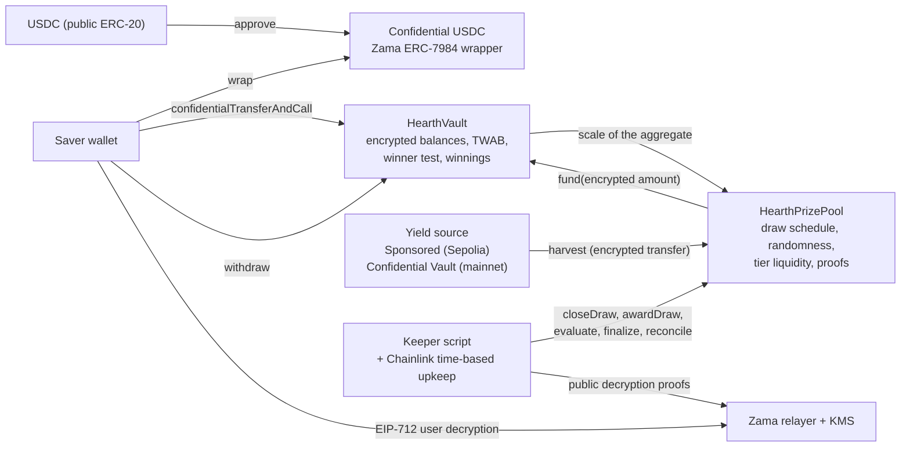
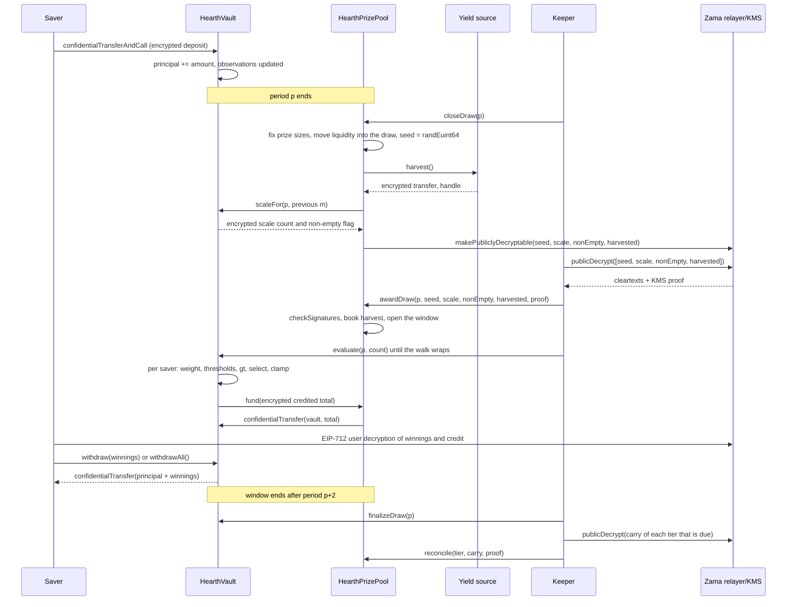
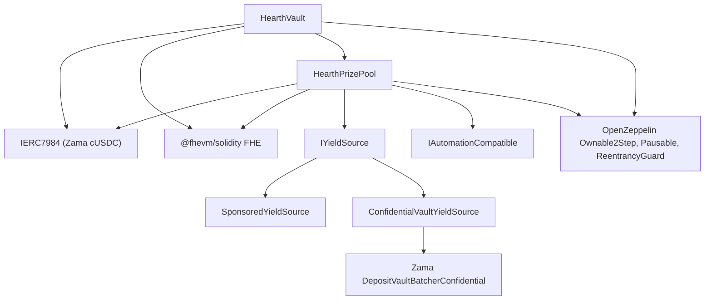

<!-- logo -->

# Hearth

**Confidential no-loss prize savings on the Zama Protocol.** You deposit confidential
USDC, your balance stays encrypted on chain, the yield the pool earns is handed out as
prizes every period, and your principal is withdrawable at any time. Nobody, including
us, can read what you saved or what you won. Anybody can check that the draw was honest.

[Live app]({{APP_URL}}) · [Documentation]({{DOCS_URL}}) · [Contracts on Etherscan](https://sepolia.etherscan.io/address/0x0F93e5db6027b4FB1C76566d24aA2D2E417fAF52#code) · [Demo video]({{VIDEO_URL}}) · [X thread]({{X_POST_URL}})

Built for the Zama Developer Program, Mainnet Season 4, bounty "Build the Confidential
PoolTogether App".

---

## Live deployments

Ethereum Sepolia, chain id 11155111. Period length one hour.

| Network | Contract | Address | Verified |
| --- | --- | --- | --- |
| Sepolia | HearthVault | `0x0F93e5db6027b4FB1C76566d24aA2D2E417fAF52` | [Etherscan](https://sepolia.etherscan.io/address/0x0F93e5db6027b4FB1C76566d24aA2D2E417fAF52#code) |
| Sepolia | HearthPrizePool | `0xA0785AacF30B6FE46EDc53CD8A9db1d94FeF5Df2` | [Etherscan](https://sepolia.etherscan.io/address/0xA0785AacF30B6FE46EDc53CD8A9db1d94FeF5Df2#code) |
| Sepolia | SponsoredYieldSource | `0xCC49DF69eAB6884fD8DD9260902B8A0Abc9D6b91` | [Etherscan](https://sepolia.etherscan.io/address/0xCC49DF69eAB6884fD8DD9260902B8A0Abc9D6b91#code) |
| Sepolia | Confidential USDC (Zama's, not ours) | `0x7c5BF43B851c1dff1a4feE8dB225b87f2C223639` | [Etherscan](https://sepolia.etherscan.io/address/0x7c5BF43B851c1dff1a4feE8dB225b87f2C223639#code) |
| Sepolia | Mock USDC with an open `mint` (Zama's) | `0x9b5Cd13b8eFbB58Dc25A05CF411D8056058aDFfF` | [Etherscan](https://sepolia.etherscan.io/address/0x9b5Cd13b8eFbB58Dc25A05CF411D8056058aDFfF#code) |

Deployment block `11622398`. First period starts at `1788386400 (2 September 2026, 22:00:00 UTC)`.
Chainlink Automation upkeep: not registered yet, the keeper alone runs the demo pool.

---

## Overview

PoolTogether invented a good product: a savings pool where you cannot lose your money and
you might win a prize. Everybody's deposits earn yield together, and every period that
yield is handed to a few savers instead of being split into dust. Your chance of winning
is proportional to how much you saved and how long you saved it.

On an ordinary blockchain the whole thing is public. Anyone can read how much every saver
holds, work out each wallet's odds, and see who won every draw. That publishes people's
wealth and paints a target on anyone large. It is the reason a serious saver does not use
a public prize pool for a meaningful amount of money.

Hearth runs the same product over encrypted numbers. Fully homomorphic encryption, usually
shortened to FHE, means arithmetic performed directly on encrypted values without ever
decrypting them. Zama's Protocol brings that to Ethereum, so a Solidity contract can add,
compare and choose between numbers it cannot read. Your balance lives on chain as
ciphertext, which is data that is unreadable without a key, and the contract still runs
the winner test on it.

The part that is easy to get wrong is keeping the draw checkable while the balances stay
secret. Hearth publishes the random seed and a rough scale of the pool, both carrying a
proof the contract verifies on chain, and every threshold any address had to beat follows
from those two numbers by public arithmetic. The rule is public. Only the input is
private.

### Against the status quo

The middle column is the shape most confidential lottery attempts take, and it is the
shape our own first version took. We audited that version and executed the attacks against
it on 2 September 2026, which is where those numbers come from.

| | PoolTogether on a public chain | A scan-based confidential lottery | Hearth |
| --- | --- | --- | --- |
| Your balance | Public | Encrypted | Encrypted |
| Your odds | Public | Encrypted, but taken from your balance at the instant of the draw | Encrypted, taken from your average balance across the whole period |
| Who won a draw | Public | Named by the claim transaction, which only a winner sends | No claim transaction exists to send |
| Flash a large balance in, win, withdraw | Blocked by time-weighted odds | Works. Executed: 19 wins in 20 draws, whole cycle in one transaction | Blocked by time-weighted odds |
| Can a stranger check the draw | Yes, everything is public | No, nothing is published | Yes, the seed and the pool's scale are published with a proof |
| Cost of one draw | One transaction | One chained transaction per group of savers, so one saver can stall everybody | Close in one transaction, then independent batches of `4` savers, in any order |
| How many savers the pool supports | Unlimited | Often capped at 32 addresses | Unlimited. Only the batch size is capped |
| Principal | Withdrawable any time | Withdrawable | Withdrawable any time, including in the middle of a draw |
| Prize money | Real yield | Usually an admin-funded reserve | Sponsored on Sepolia, real yield through Zama's Confidential Vault on mainnet |

### Delete the encryption and there is no product

| Piece of Hearth | Without FHE |
| --- | --- |
| Your balance | A public number. Anyone can price your savings and your odds. |
| The winner test | A public comparison, visible the instant it runs. |
| Who won a draw | Public, because a credit landing in a balance is a visible number. |
| The random seed | Either a public number somebody sees coming, or an off-chain number somebody picks. |
| Prize credits | Public transfers to identified winners. |

What is left is PoolTogether, which already exists and works. The product Hearth sells is
the one a transparent chain cannot offer. Full argument in
[docs/concepts/why-zama.md](docs/concepts/why-zama.md).

---

## Features

### Save privately

- Deposit confidential USDC in one transaction. The amount travels as a ciphertext handle,
  which is a pointer to an encrypted value rather than the value itself.
- Principal, unclaimed winnings, your time-weighted weight for each draw and your credit
  for each draw are all encrypted, and only your address is granted access to them.
- Reading your own numbers is an EIP-712 signature, a typed off-chain signature that
  proves you control the address. It is not a transaction. No gas, no trace.
- Wrapping public USDC into confidential USDC and depositing are deliberately two separate
  steps, because doing both in one click publishes your deposit amount. The app explains
  why at the point where it costs you something.

### Win fairly

- Odds come from your average balance across the whole period, measured in USDC-seconds,
  not from your balance when the draw happens. Depositing five minutes before a one-hour
  period closes buys one twelfth of the odds of having held the same amount all period.
- The random seed comes from `FHE.randEuint64`, generated inside Zama's coprocessor under
  the network key. Nobody sees it when it is drawn and closing a draw succeeds exactly
  once, so nobody can re-roll it.
- Prize sizes are fixed earlier in the same transaction, before the seed exists. Nobody
  can read a seed, work out that they won, and then make the win bigger.
- Three prize tiers: a rare large one, a middle one, and four small prizes every draw.
- Expected prizes are exactly proportional to your weight, so splitting your money across
  six wallets gains nothing but gas.

### Verify anything

- The seed and the pool's power-of-two scale are published after the period ends, each
  with a signature from Zama's key management service that the contract checks on chain
  with `FHE.checkSignatures`.
- From those two numbers anyone recomputes the exact threshold any address had to beat, in
  any tier. The vault exposes the same arithmetic as a view, `thresholdOf`, so the app,
  the test suite and a judge with a block explorer read one implementation.
- A saver can go further: decrypt your own weight and your own credit for a draw and check
  the two against each other.
- Every unpaid unit of prize money is accounted for. The unfunded counter is published at
  every finalization and is zero whenever the pool is solvent.

### Leave any time

- `withdraw` and `withdrawAll` are the only exits. They pay winnings first, then principal.
- There is no claim function. Prizes are credited to a separate encrypted winnings balance
  during evaluation, so the app's claim button, which carries the amount, sends an ordinary
  withdrawal that looks exactly like every other withdrawal.
- Principal is never locked. Deposits and withdrawals keep working while a draw is running
  and while the contracts are paused.

### Run without us

- Every step of a draw is callable by anyone: close, award, evaluate, finalize, reconcile.
  The app exposes all of them.
- `evaluate` takes a count, never a list of addresses. The walk starts at a point that
  draw's seed decides, so nobody can pick themselves, and pressing the button says nothing
  about whether you won.
- A keeper script runs the whole cycle, and Chainlink Automation covers the close step,
  which is the only step needing no off-chain data and the only one with a deadline.
- A stalled keeper costs the pool a draw, never money. Liquidity that was never offered
  stays in its tier, and a late award still books the yield.

---

## How the pool and draws work

Time is cut into equal periods. On Sepolia a period is one hour, so a visitor sees a full
cycle in one sitting. On mainnet a real deployment would use a day, which is what
PoolTogether V5 uses. The period is a constructor argument, so the same code serves both.

Draw `p` covers period `p` and is decided entirely by balances held during period `p`.
Every step of it happens during the two periods that follow, which is the window. Closing
has a tighter deadline of its own, half a period before the window ends, so the round trip
to Zama's key management service always has room to land.

**1. Close.** In one transaction the pool fixes each tier's prize size and the liquidity it
is putting up, moves that liquidity into the draw, draws the encrypted seed, asks the vault
where the pool's total weight sits, and harvests the yield source. Four values are then
marked publicly decryptable: the seed, the scale count, a flag saying whether anybody held
a balance at all, and the harvest. That flag on Zama's access control list is one-way and
cannot be revoked, which is what commits the pool to the number the world later sees.

The pool's exact total weight is never published. Publishing it exactly would let anyone
subtract two consecutive totals and recover a lone saver's deposit amount, to the base
unit, from the public timestamp of their own transaction. What the vault publishes instead
is the bracket: the smallest power of two at or above the total, tracked under encryption
by five comparisons per draw. An observer learns one thing per draw, which is whether the
pool crossed a power of two.

**2. Award.** Anyone fetches the four cleartexts from Zama's relayer, which returns them
with a signature from the key management service, the group of parties holding the
network's decryption key. The contract verifies that signature on chain before it believes
a number. Then it books the harvest into the tiers and opens the draw. **This is the moment
the winners are decided.** The seed is now a public number, the bracket is a public number,
and no saver's weight for that period can change any more.

**3. Evaluate.** The vault walks the saver list from a cursor that starts at
`seed mod saverCount`, in list order, doing as many savers as the caller asks for and at
most `4` that need encrypted work. For each one it reads their encrypted
weight, runs the winner test against the public thresholds, and adds the result to their
encrypted winnings. Evaluation decides nothing. It writes down a result that already
exists.

**4. Finalize.** After the window, whatever each tier offered and did not pay is folded
into that tier's encrypted carry, which is added back to the tier's offer at every close.

**5. Reconcile.** Every tier publishes its carry at the finalize of every draw, and the
verified cleartext goes back into that tier's public liquidity, so the pot accumulates
where everyone can see it. Publishing a carry is also what makes that tier's prize count
public, one draw later. The cadence is a per-tier constructor argument: raising it hides
the count for that many draws, at the cost of the money nobody won sitting encrypted and
the public prize dropping to one draw's share until the next reconcile. This deployment
chose the visible jackpot, and says so in [limitations](docs/limitations.md).

The winner test itself, for saver `u` in tier `t` of draw `p`, is public arithmetic:

```
prn         = keccak256(abi.encode(R, p, u, t))
r           = prn mod M                                        // M = 2^scaleBits, so no modulo bias
threshold_k = floor((r + k * M) * oddsDen[t] / (oddsNum[t] * count[t]))
```

The saver wins prize `k` when their encrypted weight is strictly greater than
`threshold_k`. The thresholds rise with `k`, so a saver wins prizes `0` through `j-1` for
some `j`. The expected number of prizes is `weight * odds * count / M`, linear in the
saver's share. The only encrypted operation is that comparison, and its result feeds an
encrypted select rather than an if statement, so a winner's transaction and a loser's are
identical.

Full detail: [how a draw works](docs/concepts/how-a-draw-works.md),
[time-weighted balance](docs/concepts/time-weighted-balance.md),
[winner selection](docs/concepts/winner-selection.md),
[prizes and tiers](docs/concepts/prizes-and-tiers.md).

### System overview



### One draw, end to end



### Contract dependencies



---

## The confidentiality design

The judging criteria ask what stays encrypted, whether the draw is provably fair and
deposit-weighted, and whether any leakage is minimal and documented. Our position is that
naming every seam ourselves is worth more than a claim nobody can check.

### Encrypted versus public

| Value | State | Who can read it |
| --- | --- | --- |
| Your principal | Encrypted | You only, by EIP-712 signature |
| Your unclaimed winnings | Encrypted | You only |
| Your time-weighted weight, per draw | Encrypted | You only |
| Your credit, per draw, and therefore whether you won | Encrypted | You only |
| The amount you deposit | Encrypted end to end | You only |
| The amount you withdraw | Encrypted end to end | You only |
| **The pool's total weight for a period** | **Encrypted, never published** | **Nobody** |
| Each tier's carry between reconciliations | Encrypted | Nobody |
| The bracket the pool's total fell in, a power of two | Public once the period ends | Everyone |
| Whether anybody held a balance at all in the period | Public once the period ends | Everyone |
| The random seed for each draw | Public once the period ends | Everyone |
| The yield harvested each draw | Public once the period ends | Everyone |
| Each tier's prize size and offered plaintext liquidity | Public from the close | Everyone |
| How many prizes the frequent tier paid | Public one draw later | Everyone |
| How many prizes the mid tier paid | Public one draw later | Everyone |
| How many prizes the grand tier paid | Public one draw later | Everyone |
| The list of saver addresses | Public | Everyone |
| When you deposited, withdrew, or were evaluated, and in which batch | Public | Everyone |
| The unfunded counter | Public at finalization | Everyone |
| Sponsor amounts and the drip rate | Public | Everyone |
| The amount you wrap into, or unwrap out of, confidential USDC | Public | Everyone |
| Every threshold any address had to beat, in any tier | Publicly computable | Everyone |

The left column of secrets is exactly the per-person information, plus the two pool-wide
totals that turned out to be per-person information in disguise. The right column is what
an outsider needs in order to check that the draw was honest. That split is the design.

### The leaks, named

1. **Below three savers there is no anonymity set.** With one saver the published bracket
   is that saver's weight to within a factor of two. With two, each can bound the other.
   The app says so whenever the pool is that small.
2. **A balance an observer can pin has no draw privacy at all.** Thresholds are public,
   because they are what makes the draw checkable, and the winner test is a deterministic
   function of one secret and otherwise public data. So anyone who knows your balance
   computes your result in every tier of every draw with no decryption at all. Even a loose
   upper bound proves a definite loss in any tier whose threshold sits above it.
3. **The wrap seam is how a balance gets pinned.** Turning public USDC into confidential
   USDC is a public ERC-20 movement. We measured the correlation on our own earlier
   deployment: reading Sepolia blocks 11528000 to 11618500, three of five deposits sat two
   to four blocks after a public wrap of exactly 100 USDC by the same address. Hearth keeps
   wrap and deposit as separate steps, offers round wrap amounts, and warns at the step
   where it matters. It cannot remove the seam.
4. **Round-tripping through the wrapper publishes a lower bound on lifetime winnings.**
   For an address whose only confidential USDC counterparty is Hearth, the public unwrapped
   total minus the public wrapped total is a lower bound on everything ever won, and it
   becomes exact once that address has emptied out. Unwrapping to a fresh address does not
   help, because the confidential transfer to it is itself the link.
5. **The published prize counts are a slow measurement.** Each count is a constraint of the
   form "how many of these savers had a weight above their own published threshold", and
   constraints accumulate against a balance that never changes. The tier reconcile cadence
   is the dial that would damp it, and this deployment set it to one. Publishing a tier's
   carry every draw is the same step that hands unwon money back to the public pot, so a
   slower cadence would hide the count and the growing jackpot together. We kept the
   jackpot visible and state the count as a residual.
6. **The token layer is Zama's, not ours.** Confidential USDC is an upgradeable wrapper
   whose owner can appoint observers able to decrypt every amount that moves through the
   token, retroactively, and can deny-list addresses. That covers deposit amounts,
   withdrawal payouts and the one prize-funding transfer per evaluation batch. Live state
   on 2 September 2026: `observerCount()` was 0 and `observers()` was empty. What it does
   not reach is Hearth's own ledger: principal, winnings, weights and credits live in the
   vault, and the token holds no access rights on any of them.
7. **The behavioural residual.** There is no winner-shaped transaction on chain, but a
   saver who withdraws immediately after every draw they won, and never otherwise, hands an
   observer a statistical hint over many draws. It is weak and it is entirely under the
   saver's control. No contract can fix it.

Nothing above is network-level privacy. Your IP address, your RPC provider and your
relayer request are outside the chain and outside this analysis.

Full pages: [what stays private](docs/security/what-stays-private.md),
[threat model](docs/security/threat-model.md),
[randomness and verification](docs/security/randomness-and-verification.md).

---

## The yield source

Prizes are yield. Nobody's principal is ever paid out as a prize, which is what makes the
pool no-loss. Every source implements two functions:

```solidity
interface IYieldSource {
    function harvest() external returns (euint64 transferred); // confidential transfer to the recipient
    function harvestable() external view returns (uint64);      // display only
}
```

`harvest` is synchronous on purpose: it moves whatever the source has ready at that moment.
A source that earns asynchronously prepares the amount ahead of time. Swapping the source
is one owner call, `setYieldSource`, and nothing else in the system knows or cares which
one is attached. A source that reverts does not stop a draw: the harvest is booked as a
trivial encrypted zero, `HarvestFailed` is emitted, and the close succeeds.

### On Sepolia: a sponsored source

`SponsoredYieldSource` holds confidential USDC that a sponsor wrapped into it, and releases
it at `ratePerSecond`, currently `5,555 base units a second, which is 19.998 USDC a period`. A sponsorship is a donation: there is
no path to take it back, and only the owner can change the rate. Sponsor amounts, the rate
and every harvest are public, exactly as the yield a PoolTogether vault contributes is
public. What is confidential in Hearth is who saved how much and who won, never how much
money the pool made.

The bounty allows a mock source as long as the README explains it, and we looked for a real
one first. There is no venue on Sepolia that pays yield on Zama's mock USDC: Aave refuses
those deposits because the supply cap is exceeded, Compound wants Circle's own USDC, and
Zama's own Sepolia vault is idle-only with no yield adapter, which is Zama's own
description of it.

So the source of the money is a mock. The plumbing is not. Every unit of prize money on the
live pool was really wrapped, really transferred to the pool as an encrypted transfer, and
really verified by a KMS-signed decryption before it was credited.

### The pool never books a number the source reports

The source performs an encrypted transfer to the pool. The pool, as the recipient, is
allowed on that ciphertext, so it marks the transferred amount publicly decryptable itself
and credits the tiers only after `FHE.checkSignatures` verifies the cleartext. A source
that lies about how much it sent gets nowhere.

This is not theoretical caution. In our previous design the pool booked reserve top-ups
from the amount the caller passed in, while the wrapper mints `amount / rate()`. On the
live deployment `rate()` happened to be 1, so the two agreed and the bug was latent. We
executed it on 2 September 2026 against a test token with 18 decimals, where the wrapper
rate is a million million, and watched the pool believe in a million million times more
prize money than existed. Phantom prize liquidity in a no-loss pool eventually gets paid
out of somebody's principal, which is the one promise the product cannot break.

### On mainnet: Zama's Confidential Vault

Zama ships a protocol whose whole job is earning yield on confidential balances, and it is
the natural mainnet source. `ConfidentialVaultYieldSource` is the adapter. A batcher sits
between confidential tokens and an ordinary ERC-4626 yield vault: it pools many encrypted
deposits, decrypts only the sum, makes one public deposit, and hands confidential shares
back. The adapter joins the deposit batcher with the pool's confidential USDC and holds
shares. The keeper walks a redemption through the redeem batcher's four stages ahead of
time, so that by the next `harvest` the redeemed confidential USDC is already sitting in
the adapter. Every one of those four stages is permissionless.

Because Sepolia's vault is idle, the adapter is documented and tested against the batcher
interface rather than wired to the live pool. Saying it is live when it earns nothing would
be a claim a judge could check in a minute. What Hearth would inherit on mainnet, stated
plainly: vault risk in full from the third-party ERC-4626 vault, batch confidentiality
rather than pool confidentiality, and the batcher owner's bounded powers over batch age and
pausing. Detail and addresses: [yield source](docs/concepts/yield-source.md).

---

## The two-minute judge path

Nothing here needs us to be online. Every step of a draw is permissionless.

1. Open {{APP_URL}}, follow **The pool** in the header to `/app`, and connect a wallet on
   Sepolia.
2. In the **Deposit** panel, click **Get test USDC**. That calls `mint` on Zama's mock USDC,
   which has no owner check and a cap of one million tokens per call. A wallet that already
   holds some sees the same button as **Get a million more**.
3. Type an amount and click **Wrap**, then type an amount under **Deposit into the pool** and
   click **Deposit**. The two steps are separate on purpose. The deposit amount is encrypted
   before it leaves your browser. That first button reads **Approve** until the wrapper's
   allowance covers the amount you typed.
4. In **What you hold**, click **Reveal** and sign the message. Your principal appears in the
   browser only. That signature is not a transaction.
5. In the **Run the draw** panel, press **Close**, then **Award**, to close and award the last
   finished period yourself, or watch the keeper do it. Award fetches the four decryption
   proofs in the browser and sends the signed cleartexts back to the pool.
6. Press **Advance** once. Then, on that draw's card under **Your draws**, press **Reveal my
   result**. Your weight and credit for that draw appear, and the balance you opened in step
   4 stays open; the one signature serves both.
7. Open `/verify`. The public seed and bracket are there, **Thresholds for an address**
   recomputes your thresholds in front of you, and the comparison matches what the contract
   credited.
8. On the draw card, click the claim button, which carries the amount, such as **Claim 1.00
   USDC**, to withdraw your winnings. Or use **All of it** in the **Withdraw** panel to take
   principal and winnings back in one transfer.

### The prove-it command

```bash
npm run prove:sepolia -w @hearth/contracts
```

It runs from one saver's account against the live deployment and prints nine numbered steps.
Every step is a real transaction or a real decryption: deposit 500 USDC; decrypt your own
principal and check it moved by exactly that; ask for the same handle from a fresh wallet and
show the refusal; drive any pending draw and pick the newest awarded draw the saver holds a
weight in; decrypt your own weight and credit for it; recompute the outcome from the public
seed and bracket through the vault's `thresholdOf` view, and fail if the chain paid more than
the thresholds allow; withdraw exactly the stake plus the winnings through an encrypted amount;
and check the wallet grew by exactly that while the principal is back at its baseline. It
never waits for a period, it leaves the pool as it found it, and it can be run any number of
times.

The run below is from 3 September 2026 and took 260 seconds, almost all of it waiting on the
relayer. The lines that say a KMS share did not reconstruct are Zama's key management
service serving one bad share for a given transport key; the command recovers by
regenerating the key and asking again, and every decryption below succeeded.

```
Proving Hearth on sepolia from 0x913446bEb36a56dBDb7b2562bE6b674d1B39Ef2f. Every line below is a real transaction or a real decryption.
  a KMS share did not reconstruct, asking again under a fresh transport key (try 1)
  a KMS share did not reconstruct, asking again under a fresh transport key (try 2)
  a KMS share did not reconstruct, asking again under a fresh transport key (try 3)
  a KMS share did not reconstruct, asking again under a fresh transport key (try 4)
  a KMS share did not reconstruct, asking again under a fresh transport key (try 1)
  a KMS share did not reconstruct, asking again under a fresh transport key (try 2)
  a KMS share did not reconstruct, asking again under a fresh transport key (try 3)
  a KMS share did not reconstruct, asking again under a fresh transport key (try 4)
  minted 500.00 USDC to 0x913446bEb36a56dBDb7b2562bE6b674d1B39Ef2f (tx 0x5d521754e36c479f3b281e8c7bea29c9bd2dbb1d0bcd837a4adb382554a73171, gas 51,756)
  approved the wrapper to take 500.00 USDC from 0x913446bEb36a56dBDb7b2562bE6b674d1B39Ef2f (tx 0x3b8c872fab620b61ff287e94e58799927ec81920813d9e16dd99a2c0e314812c, gas 46,353)
  wrapped 500.00 USDC into confidential USDC for 0x913446bEb36a56dBDb7b2562bE6b674d1B39Ef2f (tx 0x9144936d44c74283375b1a20972f14cc06ece1f78bab2a2099caa86ffd9f4136, gas 342,157)
  deposited an encrypted amount into the vault for 0x913446bEb36a56dBDb7b2562bE6b674d1B39Ef2f (tx 0xbebc1772c2c5388bf1eb77ed34b0ed092625683fe9ca2aa322d37395d196abc5, gas 1,427,319)
1. I took 500.00 of test USDC, wrapped it into confidential USDC and deposited it in period 3 (113.5s)
  a KMS share did not reconstruct, asking again under a fresh transport key (try 1)
  a KMS share did not reconstruct, asking again under a fresh transport key (try 2)
  a KMS share did not reconstruct, asking again under a fresh transport key (try 3)
  a KMS share did not reconstruct, asking again under a fresh transport key (try 4)
  a KMS share did not reconstruct, asking again under a fresh transport key (try 5)
  a KMS share did not reconstruct, asking again under a fresh transport key (try 6)
  a KMS share did not reconstruct, asking again under a fresh transport key (try 7)
  a KMS share did not reconstruct, asking again under a fresh transport key (try 8)
2. I signed an EIP-712 request and decrypted my own principal: 575.00 USDC, up by exactly what I deposited (167.6s)
3. a fresh wallet 0x3d67500910adaE196986eD3729B0B3dcDD9D3769 asked for the same handle and was refused: NotEntitledError: the access control list does not allow 0x3d67500910adaE196986eD3729B0B3dcDD9D3769 to decrypt 0x579371175db8f645ea33ec42678563598b0051d410ff0000000000aa36a70500 on 0x0F93e5db6027b4FB1C76566d24aA2D2E417fAF52 (168.1s)
nothing is closable in period 3, so this pass awards and evaluates what is already open
4. I drove every pending draw from the keeper account and picked draw 2, the newest awarded draw I hold a weight in (173.7s)
5. draw 2 was closed, awarded against a KMS-signed seed and evaluated for every saver, and the 500.00 USDC I just deposited counts from period 3 onward, weighted by the part of that period that was still to run (173.7s)
  a KMS share did not reconstruct, asking again under a fresh transport key (try 1)
  a KMS share did not reconstruct, asking again under a fresh transport key (try 1)
  a KMS share did not reconstruct, asking again under a fresh transport key (try 2)
  a KMS share did not reconstruct, asking again under a fresh transport key (try 3)
6. I decrypted my own weight for that draw, 270,000,000,000 balance-seconds, and my credit, 0.00 USDC (192.7s)
7. I recomputed my own outcome from the public thresholds: 0.00 USDC against the 0.00 credited, which matches to the unit (194.4s)
  a KMS share did not reconstruct, asking again under a fresh transport key (try 1)
  a KMS share did not reconstruct, asking again under a fresh transport key (try 2)
  a KMS share did not reconstruct, asking again under a fresh transport key (try 3)
  a KMS share did not reconstruct, asking again under a fresh transport key (try 4)
  a KMS share did not reconstruct, asking again under a fresh transport key (try 1)
8. I withdrew exactly the 500.00 I deposited plus 0.00 of winnings, in one confidential transfer that looks the same whether or not I won, leaving my 75.00 of seeded principal in the pool (246.2s, gas 1,031,770)
  a KMS share did not reconstruct, asking again under a fresh transport key (try 1)
  a KMS share did not reconstruct, asking again under a fresh transport key (try 2)
  a KMS share did not reconstruct, asking again under a fresh transport key (try 3)
9. my confidential wallet went from 0.00 to 500.00 USDC, up by the 500.00 I put in plus 0.00 of winnings (260.0s)
Every step above happened on chain on sepolia: the deposit, the draw, the KMS-signed seed, the evaluation and the withdrawal. Nothing was mocked and no number came from this script.
```

Executed attack outputs from the self-audit are committed under `docs/security/attacks`.

---

## Quick start

Node 20 or newer. The repository is one npm workspace, so every command runs from the root.

```bash
git clone {{REPO_URL}}
cd hearth
npm install
```

### Contracts

```bash
npm run fhe:test                        # pin @fhevm/solidity 0.11.1, the version the local simulator needs
npm run compile                         # hardhat compile, then typechain
npm test                                # the full suite on Zama's mock coprocessor
npm run lint                            # solhint, zero warnings allowed
npm run fhe:ship                        # pin the version the Sepolia build needs, before deploying
npm run deploy:sepolia -w @hearth/contracts
```

`npm run fhe:test` and `npm run fhe:ship` switch the `@fhevm/solidity` version in place.
The local Hardhat plugin pins one version and the live network needs another, so run the
matching one before compiling for that target.

### Keeper

```bash
npm run build -w @hearth/keeper
npm run plan -w @hearth/keeper          # one pass, sends nothing, prints what it would send
npm run once -w @hearth/keeper          # one pass, live
npm run start -w @hearth/keeper         # forever, in the foreground
npm test -w @hearth/keeper              # the keeper's own suite, no network
```

Settings, the pm2 setup for a demo, and the Chainlink Automation registration are in
[packages/keeper/README.md](packages/keeper/README.md).

### App

```bash
npm run dev -w @hearth/web              # http://localhost:3000
npm run build -w @hearth/web
npm run typecheck -w @hearth/web
npm run lint -w @hearth/web
```

### Operator scripts

Every command named in this README and in the docs exists in `packages/contracts/package.json`.
The deploy is `deploy:sepolia`, the demo pool is filled by `seed:sepolia`, one draw is driven by
`draw:sepolia`, the live state is printed by `status:sepolia`, the prove-it command is
`prove:sepolia`, and the executed attack scripts behind the threat model are `audit:sepolia`,
which writes its transcript under `docs/security/attacks`. Each has a `:local` twin that runs
against `hardhat node`.

### Secrets

Nothing sensitive is hardcoded. `packages/contracts/.env.example` lists every key with a
comment on where its value comes from. The deployer's key and the keeper's key are
different accounts derived from the same seed phrase, so the keeper's hot key holds no
owner powers. Sepolia ETH comes from any public faucet; the Google Cloud, Alchemy and Chainlink faucets
each pay out enough for the judge path in one request.

---

## Contract reference

Three contracts, listed in the order a draw uses them. Signatures are from the deployed
source, not from the specification.

### HearthVault

Holds every saver's encrypted principal and winnings, keeps the record of how long each
balance was held, runs the winner test, and pays out.

| Function | Who may call | What it does |
| --- | --- | --- |
| `onConfidentialTransferReceived(address, from, amount, bytes)` | The confidential USDC token only, inside `confidentialTransferAndCall` | Credits the amount the token actually moved. Refuses with an encrypted false when the amount or the resulting principal is above `maxPrincipal`, and the token refunds it in the same transaction. Registers the address as a saver. Blocked while paused |
| `openDraw(drawId, offered[3])` | The prize pool only, once per draw | Moves each tier's plaintext offer plus its encrypted carry into the draw's encrypted remaining liquidity |
| `scaleFor(period, scaleBits)` | The prize pool only, after the period ends | Compares the period's aggregate weight against the five powers of two around `scaleBits` and separately against zero, marks both results publicly decryptable, and returns them |
| `evaluate(drawId, count)` | Anyone, any number of times, inside the two-period window | Advances the draw's walk by up to `count` savers and at most `MAX_BATCH` needing encrypted work, credits each one, and pulls the encrypted batch total from the pool |
| `thresholdOf(drawId, saver, tier, index)` | Anyone, view | The public threshold that prize, in that tier, set for that address, plus a flag saying the threshold is beyond 64 bits so no weight can pass it |
| `weightHandle(drawId, saver)` / `creditHandle(drawId, saver)` | Anyone, view | The handles of that saver's weight and credit. Only the saver can decrypt them |
| `confidentialBalanceOf(saver)` / `confidentialWinningsOf(saver)` | Anyone, view | The handles of principal and unclaimed winnings. Only the saver can decrypt them |
| `withdraw(encryptedAmount, inputProof)` | Any saver | Pays winnings first, then principal, clamped to what the saver holds and to what the vault holds. An oversized request returns everything rather than reverting |
| `withdrawAll()` | Any saver | The same, for the whole balance, with no encrypted input |
| `finalizeDraw(drawId)` | Anyone, once, after the window | Folds each tier's unpaid remainder into that tier's carry, publishes the carry of every tier whose cadence is due, and publishes the unfunded counter |
| `abandonDraw(drawId, offered[3])` | The prize pool only | Hands an empty or skipped draw back: the plaintext part to the pool, the encrypted part to the carry |
| `consumeCarry(tier, amount)` | The prize pool only, while that tier's carry is pending | Subtracts the reconciled amount from the carry and clears the publication |
| `setPrizePool(pool)` | Owner, once ever | Wires the pool. A second call reverts |
| `pause()` / `unpause()` | Owner | Stops deposits only. Withdrawals, evaluation and finalization are never pausable |
| `rescueERC20(token, to)` | Owner | Returns a stray public ERC-20. Cannot touch saver balances, which are not ERC-20 |
| `renounceOwnership()` | Disabled | Reverts, so the vault always has an owner able to pause in an incident |

Views the app and the keeper read: `saverCount`, `saverAt`, `isSaver`,
`firstObservationAt`, `evaluated`, `evaluatedCount`, `cursorOf`, `walkOf`, `opened`,
`finalized`, `remainingHandles`, `carryHandle`, `publishedCarry`, `scaleHandles`,
`observationOf`, `unfundedHandle`, `currentPeriod`, `periodOf`, `periodEnd`,
`windowEndsAt`, `maxPrincipal`, `periodLength`, `firstPeriodAt`, `paused`.

Events: `Deposited(saver)`, `Withdrawn(saver)`, `Evaluated(saver, drawId)`,
`DrawFinalized(drawId, unfunded)`, `CarryPublished(drawId, tier, carryHandle)`,
`PrizePoolSet(prizePool)`.

### HearthPrizePool

Runs the clock, the randomness, the prize liquidity and the proofs. All of its accounting
is plaintext: prize sizes are public, winners are not.

| Function | Who may call | What it does |
| --- | --- | --- |
| `closeDraw(drawId)` | Anyone, once per draw, from the start of period `drawId + 1` until `closeDeadline(drawId)` | Fixes every tier's prize size and offer, moves that liquidity into the draw, draws the encrypted seed, asks the vault for the scale, harvests the yield source, and marks the seed and harvest publicly decryptable. Blocked while paused |
| `closeDraw()` | Anyone | The same, for whatever `closableDraw()` names. This is the overload Chainlink Automation calls |
| `checkUpkeep(bytes)` / `performUpkeep(bytes)` | Chainlink Automation, or anyone | The close step only. Every other step needs off-chain data, so automating it on chain would be theatre |
| `awardDraw(drawId, seed, scaleCount, nonEmpty, harvested, proof)` | Anyone, once per draw | Verifies the KMS signature over the four handles in the fixed order `[seed, scale, nonEmpty, harvest]`, books the harvest into the tiers by shares, moves the tracked scale, then opens the draw, marks it `Empty` if nobody held a balance, or marks it `Skipped` if the window has passed. All three paths keep the money |
| `fund(amount)` | The vault only | Transfers the encrypted batch total to the vault and returns what actually moved |
| `reconcile(tier, carry, proof)` | Anyone, while that tier has a published carry | Verifies the KMS signature over the carry handle and books the number back into the tier's plaintext liquidity |
| `drawParams(drawId)` | Anyone, view | Everything the winner test needs: status, seed, `scaleBits`, prize sizes, offers, prize counts and the odds as `zoneMul` and `zoneDiv` |
| `setYieldSource(source)` | Owner | Points the pool at a source. The zero address disables harvesting. Cannot affect any existing balance |
| `pause()` / `unpause()` | Owner | Stops draw closing only. Award, evaluation, finalization and reconciliation continue |
| `rescueERC20(token, to)` | Owner | Reverts for the prize asset, so prize liquidity can never be swept |
| `renounceOwnership()` | Disabled | Reverts |

Views: `drawOf`, `tierOf`, `liquidity`, `scaleBits`, `lastClosedDraw`, `reconcileEvery`,
`closableDraw`, `canClose`, `closeDeadline`, `windowEndsAt`, `currentPeriod`,
`yieldSource`, `periodLength`, `firstPeriodAt`, `UTILISATION_BPS`, `MAX_SCALE_BITS`,
`paused`.

Events: `DrawClosed(drawId, seedHandle, scaleHandle, nonEmptyHandle, harvestHandle,
prize[3], offered[3])`, `DrawAwarded(drawId, seed, scaleBits, harvested)`,
`DrawEmpty(drawId, harvested)`, `DrawSkipped(drawId, harvested)`,
`TierReconciled(drawId, tier, carry)`, `HarvestFailed(drawId)`,
`YieldSourceSet(yieldSource)`, `Funded(amount)`.

### SponsoredYieldSource

| Function | Who may call | What it does |
| --- | --- | --- |
| `sponsor(amount)` | Anyone | Pulls public USDC rounded down to a multiple of the wrapper rate, wraps it, and books exactly the units the wrapper minted. Cannot be undone |
| `harvest()` | The recipient pool only | Moves everything accrued as one confidential transfer and returns the encrypted amount the token says moved. Returns an encrypted zero rather than reverting when nothing has accrued |
| `harvestable()` | Anyone, view | What `harvest` would move right now. For display. The pool never uses it for accounting |
| `setRate(ratePerSecond)` | Owner | Settles accrual to now at the old rate, then changes it |
| `renounceOwnership()` | Disabled | Reverts, because a source with no owner could never change its rate again |

Views: `balance`, `accrued`, `lastAccrualAt`, `ratePerSecond`, `asset`, `underlying`,
`recipient`. Events: `Sponsored(from, amount, balance)`, `RateChanged(ratePerSecond)`,
`Harvested(amount, balance)`.

### Deploy order and constructors

```
HearthVault(IERC7984 asset, uint256 periodLength, uint256 firstPeriodAt, address owner)
HearthPrizePool(IHearthVault vault, IERC7984 asset, Tier[3] tiers, uint8 initialScaleBits, address owner)
    Tier = { uint32 prizeCount; uint64 oddsNumerator; uint64 oddsDenominator; uint16 shares; uint16 reconcileEvery }
SponsoredYieldSource(IERC7984ERC20Wrapper asset, address recipient, uint64 ratePerSecond, address owner)
```

Deploy the vault, then the pool, then `vault.setPrizePool(pool)`, then the source with the
pool as recipient, then `pool.setYieldSource(source)`, then sponsor it. The Sepolia tier
set is grand count 1 at odds 1/24 with 40 shares, mid count 1 at odds 1/6 with 20 shares,
and frequent count 4 at odds 1 with 40 shares, and all three reconcile every draw.
Utilisation is fixed at 50 percent, following PoolTogether V5. Full
parameter meanings and a candidate mainnet set: [deploying](docs/operations/deploying.md).

---

## Tests

```
{{TEST_OUTPUT}}
```

The suite runs against Zama's mock coprocessor through the Hardhat plugin, so every
encrypted operation, every access control grant and every KMS-signed decryption is really
performed rather than stubbed out. What it covers, one line per test:

- One full cycle with the books balanced: deposit, close, award, evaluate, finalize,
  reconcile, withdraw.
- Prize sizes are fixed at the close, before the seed exists, and the award leaves them
  alone.
- The evaluation walk starts at the seed, runs in fixed batches, and reaches each saver
  exactly once. A batch stops at the coprocessor budget and the next call resumes from the
  cursor.
- A saver who joined after the draw's period is skipped with no encrypted work at all.
- The published scale climbs to the aggregate from far below and comes down from far above.
- A period nobody held a balance in hands its liquidity back and keeps the carry.
- An award that missed its window still books the harvest and still hands the liquidity
  back.
- A close after the deadline is refused, and a close at the start of the last period is
  allowed.
- Each tier publishes its carry on its own cadence and it is booked back exactly once.
- Every threshold matches an off-chain mirror, and what is paid matches what the mirror
  says.
- A saver reads their own weight and credit; a stranger is refused.
- A reverting yield source does not stop a close, and a pool with no source books a zero.
- A mid-period deposit is weighted by the fraction of the period it was present.
- Three observations are enough to weigh a draw two periods later.
- A deposit above the per-saver cap is refused by refunding it.
- Pause stops deposits and closing and never stops withdrawals.
- The Chainlink upkeep reports the closable draw and closes exactly that one.
- A forged award proof is rejected, and a tier configuration or a scale the pool cannot run
  is refused at deployment.
- The period arithmetic and the sponsored source have their own files.

Not covered. The property and invariant tests are milestone 2 in `PLAN.md` and are not
written yet: conservation of funds as a property rather than as one worked example, no
withdrawal above principal plus winnings, tier payouts never above liquidity, and the
distribution of winners per tier over many draws against the stated odds. Nor does this
suite touch the live relayer, the live key management service, real gas, real coprocessor
prices, nonce behaviour under a reorg, or anything Zama's own contracts do internally.
Those belong to the Sepolia deployment and the prove-it command. The keeper has its own
suite, described in [packages/keeper/README.md](packages/keeper/README.md), which touches
no network at all.

---

## What it costs

Figures are live Sepolia receipts at 1 gwei, the Sepolia base fee at deployment, quoted for a pool of
5 savers.

| What a user does | Gas | In plain words |
| --- | --- | --- |
| Wrap USDC into confidential USDC | Zama's wrapper, not ours | Two calls, an approve and a wrap |
| Deposit | `{{GAS_DEPOSIT}}` | One transaction, carrying an encrypted amount and its proof |
| Reveal your balance or winnings | None | An off-chain signature. No transaction |
| Withdraw, whether or not it includes a prize | `1,031,770` | One confidential transfer |

| What a draw costs | Transactions | Gas each |
| --- | --- | --- |
| Close | 1 | `{{GAS_CLOSE}}` |
| Award | 1 | `{{GAS_AWARD}}` |
| Evaluate | `ceil(savers / 4)` | `{{GAS_EVALUATE_BATCH}}` |
| Finalize | 1 | `{{GAS_FINALIZE}}` |
| Reconcile | 0 to 3, depending on which tiers are due | `{{GAS_RECONCILE}}` |

A whole draw is `{{GAS_PER_DRAW}}` gas, about `{{ETH_PER_DRAW}}`. At a one-hour period that
is 24 draws a day and `{{ETH_PER_DAY}}`; at the daily period a mainnet deployment would use
it is `{{ETH_PER_DAY_MAINNET}}`. Whoever sends the transactions pays. Nothing on chain
caps evaluation, so the keeper caps its own spend, and any saver can push the walk further
from the app.

Evaluating one saver is `{{GAS_EVALUATE}}` gas and `{{HCU_EVALUATE}}` homomorphic compute
units. Zama caps one transaction on Sepolia at 20,000,000 compute units with 5,000,000 of
sequential depth. The batch size was measured against the coprocessor's price table on the
Sepolia tier set at 748,032 units of fixed cost per call plus 3,674,128 per saver, which
puts four savers at 15,444,544 units and five at 19,118,672. Hearth budgets 18,000,000 and
4,500,000 so a heavier tier set still fits, so the constant is `4`. `evaluate`
accepts any count, so if Zama reprices an operation the keeper drops to a smaller batch
with no redeploy.

---

## Project structure

```
hearth/
├── packages/
│   ├── contracts/        Solidity, Hardhat, tests, deploy scripts and tasks
│   │   ├── contracts/    HearthVault, HearthPrizePool, SponsoredYieldSource,
│   │   │                 interfaces, the Periods library, mocks
│   │   ├── deploy/       repeatable deployment
│   │   ├── test/         the mock-coprocessor suite
│   │   └── scripts/      one-off chain reads
│   ├── web/              the Next.js app and the documentation site it serves
│   └── keeper/           the script that drives draws, with its own suite and pm2 config
├── docs/                 the written record: getting started, concepts, security, operations
├── submission/           video script, X post draft, Vercel settings
├── ARCHITECTURE.md       the implementation specification, with the three diagrams
├── DECISIONS.md          one line per design decision, with the reason
├── PLAN.md               milestones, each ending in a proof gate
├── STATE.md              what is done, what is next, what is waiting on a human
└── README.md
```

---

## Tech stack

| Layer | What | Version |
| --- | --- | --- |
| Encrypted computation | `@fhevm/solidity` | 0.11.1 for the local simulator, switched to 0.13.2 for the Sepolia build by `npm run fhe:ship` |
| Confidential token | `@openzeppelin/confidential-contracts` (ERC-7984) | 0.5.3 |
| Base libraries | `@openzeppelin/contracts` (Ownable2Step, Pausable, ReentrancyGuard, SafeERC20) | ^5.6.1 |
| Language | Solidity | 0.8.27 |
| Contract tooling | Hardhat, `@fhevm/hardhat-plugin`, `@fhevm/mock-utils`, hardhat-deploy, TypeChain, solhint | 2.28.6, 0.4.2, 0.4.2, 0.11.45, 8.3.2, 6.2.1 |
| Local FHE mock | `@zama-fhe/relayer-sdk`, required by the Hardhat plugin and used only by the local simulator | 0.4.4 |
| Encryption and decryption client | `@zama-fhe/sdk` in the operator tasks, the keeper and the app | 3.5.1 |
| App | Next.js App Router, React, Tailwind, wagmi, viem | 16.3.4, 19.2.8, 3.4.17, 3.7.7, 2.56.3 |
| App motion | Framer Motion, React Three Fiber, drei, postprocessing, Lenis | 13.2.0, 9.7.0, 10.7.8, 3.1.1, 1.3.26 |
| Keeper | Node 20 with its own test runner, ethers 6.16.0, run under pm2 for a demo | No framework |
| Automation | Chainlink time-based upkeep, interface declared locally | Two selectors, no package |

---

## Security

Hearth has not been audited by a third party. It is self-audited, and the honest substitute
is written down rather than claimed.

**Two adversarial design reviews.** The first, on 2 September 2026, found folded prize
counts, unverified harvests, a one-period evaluation window that a slow relayer could lose
a draw to, a wrong overflow claim, undefined evaluation semantics, and missing events and
views. The second, on 3 September 2026, found seven more, each of which changed the design:
publishing the pool's exact aggregate weight recovers a lone mover's deposit exactly, prize
sizes fixed after the seed can be resized by whoever reads it first, a last-block close
strands a draw forever, self-evaluation is a winner tell as loud as a claim function,
per-draw jackpot counts identify a winner out of the small set eligible that hour,
withdrawals assumed a token that clamps, and the deposit cap check could itself wrap.
`ARCHITECTURE.md` section 14 lists every one and what replaced it.

**An executed audit of the previous design.** Before this rebuild, Hearth was a single
contract that weighted savers by their balance at the instant of the draw. We attacked it
rather than reasoning about it, and six of the eight findings were reproduced in running
code: a flash deposit won 19 of 20 draws and drained a 5,000 USDC reserve with the whole
cycle fitting in one transaction at 2,189,992 gas; winner and loser claims cost an
identical 391,944 gas but only a winner had a reason to send one; a house ticket's
winnings handle was republished as publicly decryptable every draw; the pool's total was
never published, so no outsider could check a draw at all; reserve top-ups were booked from
a reported number; registration griefing was free; the wrap seam was unmitigated and
measurably so; and the live pool sat 26 hours with an openable draw because permissionless
is not the same as automated. Every one of those is closed by construction in this design,
and the table of what closed each is in the
[threat model](docs/security/threat-model.md).

**Owner powers, in full.** A pause that stops deposits and draw closing and never stops
withdrawals, evaluation, award, finalization or reconciliation. A yield-source setter that
cannot affect any existing balance. A rescue path for stray public tokens that reverts for
the prize asset. Two-step ownership transfer with renouncing disabled. The owner cannot
read any saver's principal, winnings, weight or credit, cannot change a draw's outcome,
cannot move anyone's money, and cannot upgrade the contracts, because there is no upgrade
path and no proxy.

**Threat model:** [docs/security/threat-model.md](docs/security/threat-model.md). Nine
attackers, what each wants, what stops them, and what does not, with the last column being
the one worth reading. Executed attack outputs land under `docs/security/attacks`.

**Static analysis:** [docs/security/static-analysis.md](docs/security/static-analysis.md).
slither reports 85 results on these contracts and solhint none; the page gives the one reason
behind each family and names the two results that deserved a second look.

### Limitations

The full numbered list is [docs/limitations.md](docs/limitations.md). In short:

1. Evaluation is batched at `4` savers needing encrypted work per transaction.
   Participation is not capped; only the batch is.
2. A saver the evaluation walk does not reach inside the two-period window forfeits that
   draw, as an unclaimed PoolTogether V5 prize expires.
3. One saver cannot hold more than `(2^64 - 1) / periodLength`, about 5 billion USDC at an
   hourly period and about 213 million at a daily one.
4. No reserve tier. The 50 percent utilisation rate is the only cushion for an
   over-subscribed tier.
5. Grand-tier odds are measured over one period, so a large holder who joins for one period
   takes a full proportional shot at a pot that took 24 periods to build.
6. Privacy needs three or more savers. Below that the published bracket pins a weight to
   within a factor of two.
7. The token layer is Zama's wrapper, and its observer, deny-list and upgrade powers apply
   to amounts crossing it.
8. Draws depend on somebody sending transactions. Nothing on chain fires by itself.
9. Yield on Sepolia is sponsored, not earned.
10. The wrap seam, and what a pinned balance costs in every later draw.
11. The walk order decides who is short in an over-subscribed tier.
12. The draw runs against a bracket, so a tier pays between half and all of its nominal
    prize count each draw and prize sizes settle correspondingly higher.
13. Cumulative winnings become public if you round-trip through the wrapper in full.
14. A balance that never changes is narrowed slowly by the published prize counts.

---

## Licence

MIT. See [LICENSE](LICENSE).

## Acknowledgments

- **Zama**, for the Protocol this is built on: the FHEVM Solidity library and its encrypted
  integers, `FHE.randEuint64` for randomness generated inside the coprocessor, the on-chain
  access control list, EIP-712 user decryption and KMS-signed public decryption verified on
  chain with `FHE.checkSignatures`, the relayer, and the confidential USDC ERC-7984 wrapper
  that Hearth uses as its asset rather than minting one of its own.
- **OpenZeppelin**, for the confidential contracts implementing ERC-7984 and for the base
  libraries this builds on rather than hand-rolling.
- **PoolTogether V5**, as the design reference. The time-weighted average balance, the
  tiered prizes, the per-saver winner test and the 50 percent utilisation rate are theirs.
  Every place Hearth deviates is named in
  [prizes and tiers](docs/concepts/prizes-and-tiers.md) and in `ARCHITECTURE.md` section 14.
  No PoolTogether code is used: their implementation is GPL-3 and this repository is MIT,
  so every line here is written fresh.
- **Chainlink**, for the Automation interface that covers the close step.
