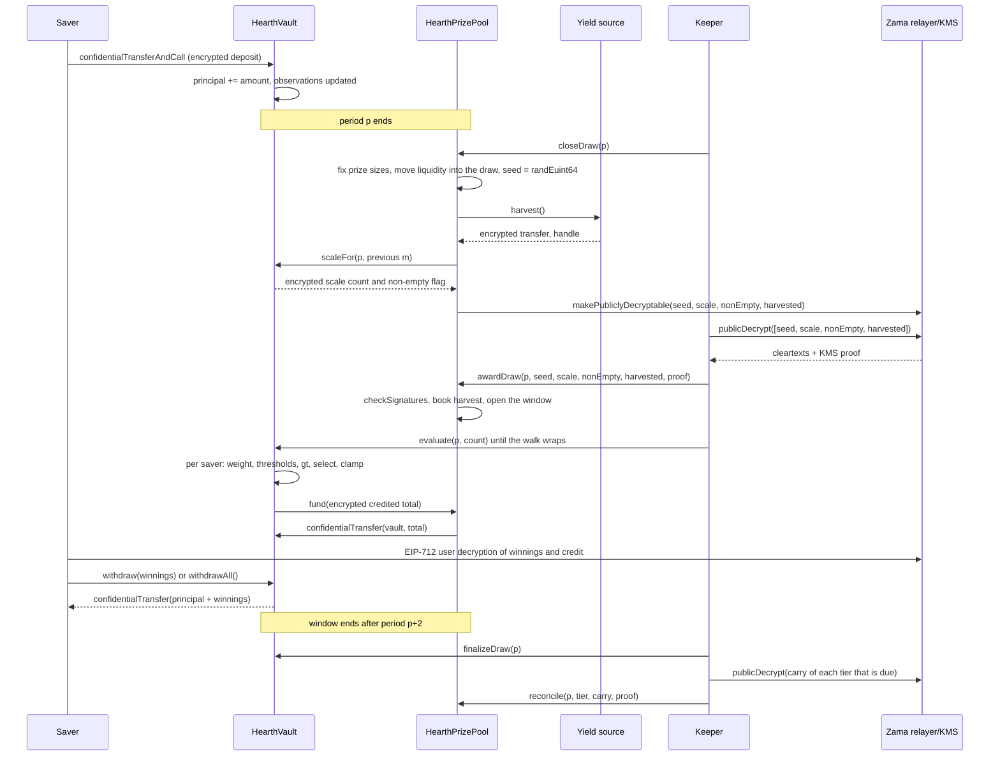

# How a draw works

A draw is the moment the pool's yield turns into prizes. This page walks the whole thing
in plain words, then shows the same story as a diagram.

## Periods

Time is cut into equal periods of `L` seconds. Period 1 starts at `firstPeriodAt`, a
timestamp fixed at deployment and never changed afterwards. From there the arithmetic is
just division:

```
period(t)      = (t - firstPeriodAt) / L + 1
periodStart(p) = firstPeriodAt + (p - 1) * L
periodEnd(p)   = periodStart(p + 1)
```

On Sepolia `L` is one hour, so a visitor sees a full cycle inside one sitting. On mainnet
a real deployment would use a day, which is what PoolTogether V5 uses. The period is a
constructor argument, so the same code serves both.

Draw `p` covers period `p`. It is decided entirely by balances held during period `p`.
Nothing that happens after period `p` ends can change its outcome.

## The window, and the deadline for closing

Every step of draw `p` happens during periods `p+1` and `p+2`. That is the window, and it
ends at `periodEnd(p + 2)`. On Sepolia that gives two hours.

Closing has a tighter deadline than the rest of the window:

```
closeDeadline(p) = periodStart(p + 2) + L / 2
```

That is the middle of the window's second period, three quarters of the way through the
window. A close after that is refused.

The reason is that closing and awarding cannot share a block. Closing marks values
decryptable on chain, the cleartexts come back from Zama's relayer off chain, and awarding
verifies them on chain. A close in the last seconds of the window would leave that round
trip nowhere to land, and the draw would be stuck forever in `Closed`. The deadline
guarantees at least half a period for the round trip, the award and every evaluation
batch.

The window also bounds how far back the vault has to remember balances, which is what
keeps three saved observations per saver sufficient. See
[time-weighted balance](time-weighted-balance.md).

## The five steps

Every step is permissionless. Anyone can call any of them, including a saver from the
app. The keeper is just the address that usually gets there first.

### 1. Close

`closeDraw(p)`, once period `p` has ended and before `closeDeadline(p)`.

Five things happen in this one transaction, in this order:

- **Prize sizes are fixed.** Each tier's prize size and the liquidity it is putting up for
  this draw are computed from the money that tier holds right now, and that liquidity
  moves into the draw. This happens before the random seed exists.
- **The seed is drawn.** `FHE.randEuint64()` runs inside Zama's coprocessor, so the number
  exists only as ciphertext and nobody has seen it.
- **The vault reports where the period's aggregate weight sits**, as one small encrypted
  count plus an encrypted flag saying whether anybody held a balance at all. Not the
  aggregate itself, and not yet in the clear. See the next section.
- **The yield source is harvested**, as one encrypted transfer to the pool. If the source
  reverts, the close still succeeds: the harvest is treated as a trivial encrypted zero
  and a `HarvestFailed` event is emitted. A broken yield source cannot stop the clock.
- **Four handles are marked publicly decryptable:** the seed, the scale count, the
  non-empty flag and the harvest. That is a one-way flag on Zama's access control list.
  From that moment anyone can ask the relayer for their plaintext, and the flag cannot be
  revoked. Nothing else about the draw is ever marked this way.

The draw state moves to `Closed`. Closing succeeds exactly once, which is why nobody can
re-roll the seed.

The order inside the transaction is the point. Prize sizes are fixed before the seed
exists, so nobody can watch a seed appear, work out that they won, and then rearrange the
pool's money to make that win worth more.

### What the vault publishes instead of the total

The pool's total time-weighted balance for the period, written `W`, is never published.
Publishing it exactly was the design until 3 September 2026 and a review broke it: with
`W` public for two consecutive periods, and the public timestamp of a saver's own deposit
or withdrawal, a saver who was the only one to move money in a period has their exact
amount recovered by arithmetic. Not bounded, recovered. That is described in
[what stays private](../security/what-stays-private.md).

What is published now is the bracket `W` falls in: the smallest power of two at or above
it, written `M = 2^m`. The vault tracks it under encryption. At each close it compares `W`
against the five powers of two around the previous draw's `m`, adds up the results into
one small encrypted count, and marks that count publicly decryptable. The pool works out
the new `m` from the verified count. A separate encrypted comparison against 1 gives the
non-empty flag, which says whether anybody held a balance at all.

So an observer learns one thing per draw: whether the pool crossed a power of two. Between
crossings they learn nothing new. Every draw runs against `M` rather than `W`, which is
what makes the prize counts described below add up the way they do.

### 2. Award

`awardDraw(p, seed, scaleCount, nonEmpty, harvested, proof)`.

Whoever calls it fetches the four cleartexts from Zama's relayer, which returns them with
a signature from the key management service (KMS), the set of parties that holds the
network's decryption key. The contract verifies that signature on chain with
`FHE.checkSignatures` before it believes a single number. The proof is bound to the
handles in a fixed order, `[seed, scaleCount, nonEmpty, harvested]`, so the four values
cannot be shuffled or replayed against another draw.

Then:

- The verified harvest is credited to the tiers by their share weights. This is the only
  way prize money enters, and it lands in the tiers rather than in this draw, so it is
  offered at the next close. The pool never books an amount the yield source reported
  about itself.
- If the non-empty flag says nobody held a balance in period `p`, the draw is marked
  `Empty` and the liquidity it was offering goes straight back to the tiers.
- Otherwise the draw opens. The seed and the bracket `M` are now public numbers.
- If the window has already closed by the time somebody awards, the harvest is still
  credited, the offered liquidity still goes back to the tiers, and the draw is marked
  `Skipped`. That period pays no prize, and no yield or liquidity is lost.

The five draw states are `None`, `Closed`, `Awarded`, `Empty` and `Skipped`.

**This is the moment the winners are decided.** From here the seed is a public number, the
bracket is a public number, and every saver's weight for period `p` can no longer change.
The thresholds each saver has to beat are arithmetic on public inputs. Evaluation, next,
does not decide anything. It writes down a result that already exists.

### 3. Evaluate

`evaluate(p, count)` on the vault, as many times as needed, while the window is open.

The caller says how many savers to advance. They do not say which. The vault walks the
saver list from a per-draw cursor that starts at `seed mod saverCount` and moves forward
in list order, doing up to `count` savers and at most `{{MAX_BATCH}}` that need encrypted
work. Savers with no observation at or before period `p` have a weight of zero, and they
are skipped from their plaintext timestamps at no encrypted cost at all.

For each saver the walk reaches, the vault reads their encrypted weight for period `p`,
runs the winner test against the public thresholds, and adds the result to their encrypted
winnings. It stores that saver's encrypted weight and encrypted credit for the draw, both
readable by that saver alone, so the app can show "you won X in draw p" and let them check
the comparison. Then it pulls the encrypted total credited by that batch from the prize
pool.

Nobody chooses who is evaluated or in what order. A saver who wants their own result
advances the same walk everybody else advances, so sending an evaluate transaction says
nothing about whether you won. The starting point moves every draw, because it comes from
that draw's seed, so no address is permanently last in the queue.

`evaluate` reverts for a draw that is `Empty`, `Skipped`, or not yet awarded.

### 4. Finalize

`finalizeDraw(p)`, once the window has closed.

Whatever each tier offered and did not pay out is folded into that tier's encrypted carry.
The carry is a running total that stays encrypted and rides along from draw to draw. It is
added to that tier's offered liquidity at every close, so unpaid money is back in play
immediately even though its size is still secret.

Finalizing also publishes the current handle of one global encrypted counter of anything
the pool failed to fund. With verified harvests it is always zero.

### 5. Reconcile

`reconcile(p, tier, carry, proof)` on the pool, one tier at a time, and only when that
tier is due.

Each tier reconciles on its own cadence, set at deployment as `reconcileEvery[t]` draws.
On Sepolia the frequent tier reconciles every draw, the mid tier every 6 draws and the
grand tier every 24. When a tier is due, `finalizeDraw` marks its carry publicly
decryptable and emits `CarryPublished`. Anyone fetches the cleartext, calls `reconcile`
with the KMS proof, and the verified number is booked back into that tier's plaintext
liquidity. The carry resets to zero and `TierReconciled` is emitted.

Reconciling is what makes the prize count for that tier public, because the carry is the
part of what was offered that nobody won. The cadence is why the grand tier's count
becomes public once a day rather than once an hour: a jackpot is then attributed to
everybody who was eligible across a whole day, not to the handful eligible in one draw.
Nothing evaporates either way. You never learn who won.

## What happens if a step never lands

- **Close never lands.** The draw stays `None` and is skipped. Its liquidity was never
  moved, so it stays in the tiers and is offered next draw. The harvest is collected by
  the next close.
- **Award never lands inside the window.** A late award still books the harvest, still
  returns the offered liquidity to the tiers, and marks the draw `Skipped`.
- **Nobody evaluates.** Every tier's whole offer folds into its carry at finalization and
  comes back at the next reconcile.

Nothing is stranded and nothing is lost. A stalled keeper costs the pool a draw, not
money. See [the keeper page](../operations/keeper.md).

## Money never moves on a report

Two rules make the accounting hard to fool.

Yield is never taken on trust. The source performs an encrypted transfer to the pool, the
pool is the recipient and is therefore allowed on that ciphertext, and only then does the
pool publish it and book the KMS-verified plaintext. A buggy or hostile yield source can
send less than it claims; it cannot make the pool believe in prize money that never
arrived. This matters because phantom prize liquidity would eventually be paid out of
someone's principal.

Payouts are pulled, not pushed. After each evaluation batch the vault grants the pool a
short-lived allowance on the encrypted batch total, the pool grants the token the same,
and the token moves exactly that amount from the pool to the vault. If the pool comes up
short, the vault records the gap in the global encrypted unfunded counter, which is
published at finalization for anyone to check. With verified harvests that counter is
always zero.

## The whole draw, end to end



## What this page does not cover

It does not cover how a saver's weight is built up over a period, which is
[time-weighted balance](time-weighted-balance.md), nor the arithmetic of the winner test,
which is [winner selection](winner-selection.md), nor how big each prize is, which is
[prizes and tiers](prizes-and-tiers.md).
