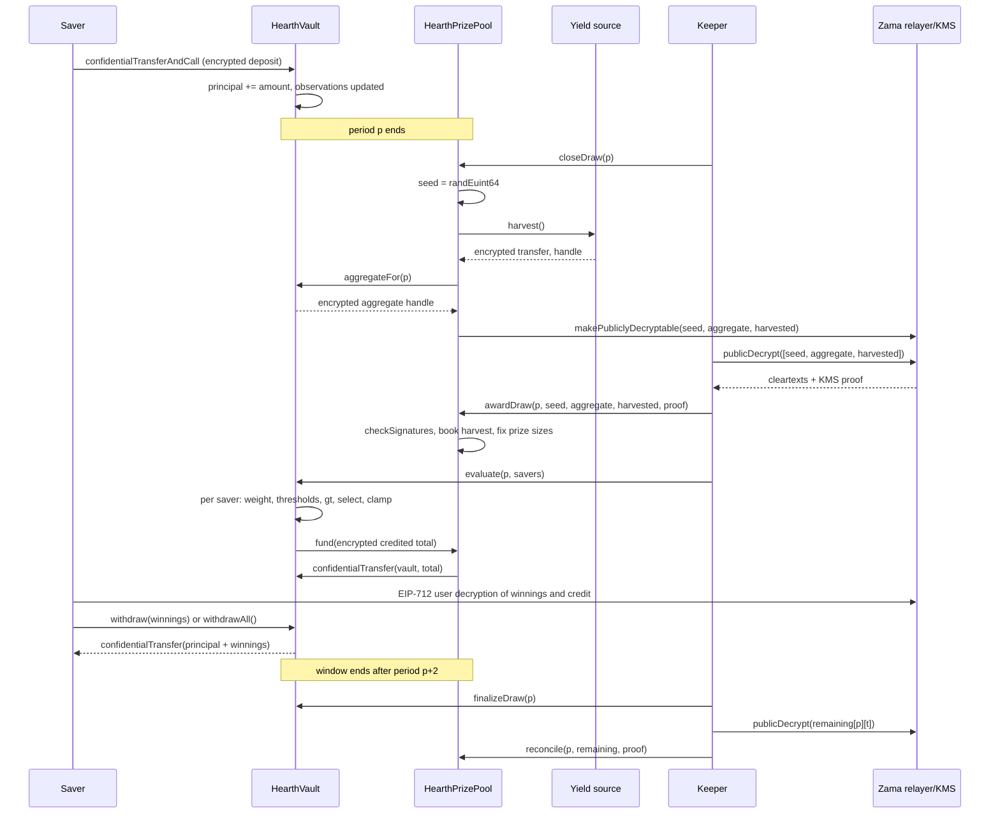

# How a draw works

A draw is the moment the pool's yield turns into prizes. This page walks the whole thing
in plain words, then shows the same story as a diagram.

## Periods

Time is cut into equal periods of `L` seconds. Period 1 starts at `firstPeriodAt`, a
timestamp fixed at deployment and never changed afterwards. From there the arithmetic is
just division:

```
period(t)      = (t - firstPeriodAt) / L + 1
periodStart(p) = firstPeriodAt + (p - 1) * L
periodEnd(p)   = periodStart(p + 1)
```

On Sepolia `L` is 30 minutes, so a visitor sees a full cycle inside one sitting. On
mainnet a real deployment would use a day, which is what PoolTogether V5 uses. The period
is a constructor argument, so the same code serves both.

Draw `p` covers period `p`. It is decided entirely by balances held during period `p`.
Nothing that happens after period `p` ends can change its outcome.

## The window

Every step of draw `p` must happen during periods `p+1` and `p+2`. That is the window,
and it ends at `periodEnd(p + 2)`. On Sepolia that gives one hour to close, award and
evaluate a draw.

The window exists for two reasons. It gives the keeper room to survive a slow relayer or
a failed transaction, which a one-period window did not at 30-minute periods. And it
bounds how far back the vault has to remember balances, which is what keeps three saved
observations per saver sufficient. See
[time-weighted balance](time-weighted-balance.md).

## The five steps

Every step is permissionless. Anyone can call any of them, including a saver from the
app. The keeper is just the address that usually gets there first.

### 1. Close

`closeDraw(p)`, once period `p` has ended and while the window is open.

Three things happen in this one transaction:

- The pool draws a fresh encrypted random seed with `FHE.randEuint64()`. This runs inside
  Zama's coprocessor, so the number exists only as ciphertext and nobody has seen it.
- The pool asks the vault for the encrypted aggregate weight of period `p`: every saver's
  time-weighted balance for that period, added together, still encrypted.
- The pool harvests the yield source, which sends the pool an encrypted transfer.

All three values are then marked publicly decryptable. That is a one-way flag on Zama's
access control list: from that moment anyone can ask the relayer for their plaintext, and
the flag cannot be revoked. Nothing else about the draw is ever marked this way.

The draw state moves to `Closed`. Closing succeeds exactly once, which is why nobody can
re-roll the seed.

### 2. Award

`awardDraw(p, seed, aggregate, harvested, proof)`, while the window is open.

Whoever calls it fetches the three cleartexts from Zama's relayer, which returns them
with a signature from the key management service (KMS), the set of parties that holds the
network's decryption key. The contract verifies that signature on chain with
`FHE.checkSignatures` before it believes a single number. The proof is bound to the
handles in a fixed order, `[seed, aggregate, harvested]`, so the three values cannot be
shuffled or replayed against another draw.

Then:

- The verified harvest is credited to the tiers by their share weights. This is the only
  way prize money enters. The pool never books an amount the yield source reported about
  itself.
- If the aggregate is zero, or no tier has any liquidity, the draw is marked `Empty` and
  pays nothing. The harvest still lands in the tiers, so it funds a later draw.
- Otherwise the draw opens: each tier's prize size and offered liquidity are fixed for
  this draw and never move again.
- If the window has already closed by the time somebody awards, the harvest is still
  credited and the draw is marked `Skipped`. That period pays no prize, and no yield is
  lost.

**This is the moment the winners are decided.** From here the seed is a public number,
the total weight is a public number, and every saver's weight for period `p` can no
longer change. The thresholds each saver has to beat are arithmetic on public inputs.
Evaluation, next, does not decide anything. It writes down a result that already exists.

### 3. Evaluate

`evaluate(p, savers[])` on the vault, as many times as needed, while the window is open,
with at most `{{MAX_BATCH}}` savers per call.

For each saver in the batch the vault reads their encrypted weight for period `p`, runs
the winner test against the public thresholds, and adds the result to their encrypted
winnings. It stores that saver's encrypted weight and encrypted credit for the draw, both
readable by that saver alone, so the app can show "you won X in draw p" and let them
check the comparison. Then it pulls the encrypted total credited by that batch from the
prize pool.

A saver is evaluated once per draw. A repeat, or an address that is not a saver, is
skipped without reverting, so a batch never fails because of one bad entry.

Nobody has to send a transaction to win. The keeper evaluates everyone in saver-list
order. If it does not, any saver can evaluate themselves, or anyone else, from the app.

### 4. Finalize

`finalizeDraw(p)`, once the window has closed.

The vault marks each tier's encrypted remaining liquidity, and an encrypted counter of
anything the pool failed to fund, as publicly decryptable. Three tiers means three
numbers.

### 5. Reconcile

`reconcile(p, remaining[], proof)` on the pool, with the KMS-signed cleartexts of those
three remainders in tier order.

Whatever a tier offered and did not pay out goes back into that tier's liquidity, ready
for a later draw. Nothing evaporates. The reconciled numbers are also what make the
per-tier prize count public: subtract the remainder from what was offered, divide by the
prize size, and you know how many prizes that tier paid. You never learn to whom.

## What happens if a step never lands

A draw whose close or award never happens stays in `None` or `Closed` and gets skipped.

- Liquidity that was never offered stays in the tiers. It is offered again next draw.
- The harvest gets booked by whoever awards late, so no yield disappears.
- That period simply pays no prize.

Nothing is stranded and nothing is lost. A stalled keeper costs the pool a draw, not
money. See [the keeper page](../operations/keeper.md).

## Money never moves on a report

Two rules make the accounting hard to fool.

Yield is never taken on trust. The source performs an encrypted transfer to the pool, the
pool is the recipient and is therefore allowed on that ciphertext, and only then does the
pool publish it and book the KMS-verified plaintext. A buggy or hostile yield source can
send less than it claims; it cannot make the pool believe in prize money that never
arrived. This matters because phantom prize liquidity would eventually be paid out of
someone's principal.

Payouts are pulled, not pushed. After each evaluation batch the vault grants the pool a
short-lived allowance on the encrypted batch total, the pool grants the token the same,
and the token moves exactly that amount from the pool to the vault. If the pool comes up
short, the vault records the gap in an encrypted unfunded counter, which is published at
finalization for anyone to check. With verified harvests that counter is always zero.

## The whole draw, end to end



## What this page does not cover

It does not cover how a saver's weight is built up over a period, which is
[time-weighted balance](time-weighted-balance.md), nor the arithmetic of the winner test,
which is [winner selection](winner-selection.md), nor how big each prize is, which is
[prizes and tiers](prizes-and-tiers.md).
