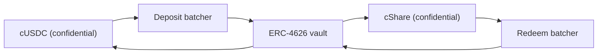

# Where the prize money comes from

Prizes are yield. Nobody's principal is ever paid out as a prize, which is what makes the
pool no-loss. This page covers the one interface every source implements, the source that
runs on Sepolia today, why the pool refuses to take a source's word for anything, and how
Zama's own Confidential Vault plugs in on mainnet.

## The interface

```solidity
interface IYieldSource {
    function harvest() external returns (euint64 transferred); // confidential transfer to the recipient
    function harvestable() external view returns (uint64);      // display only
}
```

Two functions. `harvest` moves the accrued yield to the prize pool as a confidential
transfer and returns the encrypted amount that actually moved. `harvestable` is for the
app's display and the pool never uses it for accounting.

`harvest` is synchronous on purpose. It moves whatever the source has ready at that
moment, and a source that earns asynchronously is expected to have prepared that amount
ahead of time rather than making the pool wait.

Swapping the source is a single owner call on the pool, `setYieldSource`, and it emits
`YieldSourceSet`. Nothing else in the system knows or cares which source is attached.

A source that reverts does not stop a draw. The pool catches the failure, treats that
draw's harvest as a trivial encrypted zero, and emits `HarvestFailed`. The close succeeds,
the draw runs on the liquidity the tiers already hold, and the yield that failed to move
is collected by a later harvest. A broken or mis-wired source starves the prize side; it
cannot stop the clock.

When a harvest does land, it is booked at the award of that draw and offered at the next
close. So the yield of period `p` funds the prizes of draw `p+1`, not of draw `p`. That is
what lets prize sizes be fixed before the seed exists.

## Sepolia: the sponsored source

`SponsoredYieldSource` is what runs on the live deployment at `0xCC49DF69eAB6884fD8DD9260902B8A0Abc9D6b91`.

A sponsor calls the source's own `sponsor` function with public USDC. The source wraps it
into confidential USDC and books exactly what the wrapper minted, not what the sponsor
asked for. From there the balance drips at `ratePerSecond`, currently `5,555 base units a second, which is 19.998 USDC a period`,
and `harvest` sends whatever has accrued to the pool.

A sponsorship is a donation. There is no path for a sponsor to take it back, and only the
source's owner can change the drip rate, which emits `RateChanged`.

Sponsor amounts, the drip rate and every harvest are public. That is not a compromise: in
PoolTogether the amount of yield a vault contributes is public too, and every prize size
follows from it. What is confidential in Hearth is who saved how much and who won, never
how much money the pool made.

If the pool has no savers for a while, the yield still accrues and is paid to the first
draws that do have savers. Nothing is stranded in an empty pool.

### Why a mock at all

The bounty explicitly allows a mock yield source on Sepolia, as long as the docs explain
how it works and how a real one plugs in. We looked for a real one first and there is not
one on Sepolia that pays yield on Zama's mock USDC:

| Venue | Why not |
| --- | --- |
| Aave | Refuses USDC deposits on Sepolia, supply cap exceeded |
| Compound | Wants Circle's own USDC, not Zama's mock |
| Zama's Confidential Vault | The Sepolia vault is an idle-only VaultV2 with no yield adapter, which is Zama's own description of it |

So the honest options were a fake number that goes up, or a sponsor-funded balance that
really exists on chain and really drips. We took the second. Every unit of prize money on
the live pool was really wrapped, really transferred and really verified.

## The pool never books a reported number

This is the rule that keeps the sponsored source from being a soft spot.

The source performs an encrypted transfer to the pool. The pool, as the recipient, is
allowed on that ciphertext, so it can mark the transferred amount publicly decryptable
itself. Only at award time, after `FHE.checkSignatures` verifies the key management
service's signature over the cleartext, does the pool credit anything to the tiers.

A source that lies about how much it sent gets nowhere. The pool books the amount that
arrived, because that is the only amount it ever looks at.

This is not theoretical caution. In our previous design the pool booked reserve top-ups
from the amount the caller passed in, while the wrapper mints `amount / rate()`. On the
live deployment `rate()` happened to be 1 so the two agreed and the bug was latent. On an
18-decimal underlying, where the wrapper's rate is a million million, the pool would have
believed in a million million times more prize money than existed. We executed that on 2
September 2026 against a test token with 18 decimals and watched it happen. Phantom prize
liquidity in a no-loss pool eventually gets paid out of somebody's principal, which is
the one promise the product cannot break. Verifying the transfer removes the whole class.

## Mainnet: Zama's Confidential Vault

Zama ships a protocol whose entire job is earning yield on confidential balances, and it
is the natural mainnet source. `ConfidentialVaultYieldSource` is the adapter.

The design is a batcher sitting between confidential tokens and an ordinary ERC-4626
yield vault. An ERC-4626 vault only accepts public transfers, so a lone depositor would
publish their exact amount. The batcher instead pools many encrypted deposits, decrypts
only the sum, makes one public deposit into the vault, and hands confidential shares back
out. Zama's own wording: "Observers see who participated, but not how much anyone
contributed."



The adapter joins the deposit batcher with the pool's confidential USDC and holds
confidential shares. Redemption runs on its own schedule, ahead of the harvest: the keeper
periodically asks the redeem batcher for the growth and walks that request through its four
stages, so that by the time the pool next calls `harvest`, the redeemed confidential USDC
is already sitting in the adapter and the harvest is a single transfer like any other.
That is how an asynchronous venue meets a synchronous interface. Every one of the four
stages is permissionless, so nobody has to wait on Zama's operator to run them.

### The addresses

From Zama's own address reference, fetched 2 September 2026.

**Ethereum mainnet, chain id 1.** Underlying asset USDC. Yield source: Morpho
"Steakhouse Confidential Prime USDC" VaultV2, gated so the deposit batcher is the vault's
only depositor.

| Contract | Address |
| --- | --- |
| Deposit batcher | `0x324EA89FD3784036673BfE6Ffee2334A088F40Cc` |
| Redeem batcher | `0x96Cd3Faa7483783Ac2Eb715f6333361500F1eec9` |
| cUSDC wrapper | `0xe978F22157048E5DB8E5d07971376e86671672B2` |
| cShare wrapper | `0x66Bf74E96900D1a19c7070D939D124f2F565C458` |
| ERC-4626 vault | `0xbEEF00A59B577423653A1526c7009bdE103F542B` |
| USDC | `0xA0b86991c6218b36c1d19D4a2e9Eb0cE3606eB48` |

**Sepolia, chain id 11155111.** A staging environment: the USDC is a mock with a public
`mint` and the vault is idle-only with no yield adapter.

| Contract | Address |
| --- | --- |
| Deposit batcher | `0x48758559c14d4d92b4C74A99660B6a8dbe85F53b` |
| Redeem batcher | `0xe94E9afdDd43a19C2914739e9279cb6Fe287BEb0` |
| cUSDC wrapper | `0x7c5BF43B851c1dff1a4feE8dB225b87f2C223639` |
| cShare wrapper | `0x7E93d5c150A2178B1fCde0278582Acf59478eA5f` |
| ERC-4626 vault (idle) | `0x6AB54988261AEC573a2CA13cF802d3B1114f864C` |
| Mock USDC | `0x9b5Cd13b8eFbB58Dc25A05CF411D8056058aDFfF` |

Because the Sepolia vault is idle, the adapter is documented and tested against the
batcher interface rather than wired to the live pool. Saying it is live when it earns
nothing would be a lie a judge could check in a minute.

### What plugging it in means in practice

The batcher moves in four stages: join, dispatch, finalize, claim. A batch waits until it
reaches a minimum age, then its total is decrypted, then the vault settles, then
participants claim. Every one of those stages is permissionless, so the pool is never
stuck waiting for Zama's operator, and claims never expire.

That rhythm is slower than the sponsored source's instant drip, which is why the keeper
runs the redemption ahead of time rather than inside `harvest`. The pool's contract never
waits: it asks the adapter for whatever has already been claimed back. What remains as
real work in taking this live is the keeper side of it, deciding how often to start a
redemption and how much of the position to redeem, and that is a policy choice with no
on-chain consequence if it is late.

### What Hearth would inherit

Naming this properly is part of being trustworthy about it.

- **Vault risk, in full.** The batcher forwards money into a third-party ERC-4626 vault.
  If that vault loses value, the pool's yield-bearing balance loses value with it. This
  is the one place where "no loss" would depend on somebody else's contract, and it is
  why a mainnet deployment should hold only the yield-bearing portion there.
- **Batch confidentiality, not pool confidentiality.** The batcher hides amounts among
  co-participants and decrypts the sum. If Hearth were the only participant in a batch,
  its deposit amount would be public. That costs us nothing, because Hearth's harvests
  are published anyway, but it is worth knowing before assuming the batcher hides more
  than it does.
- **Bounded owner powers.** The batcher owner can change the minimum batch age (capped at
  7 days), the callback deadline (capped at 30 days), the deposit slippage tolerance, and
  can pause joins and dispatches. Zama's documentation states the owner cannot move or
  freeze user funds, cannot censor an outcome, cannot decrypt anyone's amounts, and
  cannot upgrade the contract. Redemption slippage protection is hardcoded off so exits
  work even during a vault drawdown.

## What this page does not cover

It does not cover the yield source's effect on the leakage table, which is in
[what stays private](../security/what-stays-private.md). It does not benchmark the Morpho
vault's yield, which is somebody else's number and changes daily. And it does not claim
the adapter is running: on Sepolia the sponsored source is what is attached, and the
pool panel on `/app` names it.
