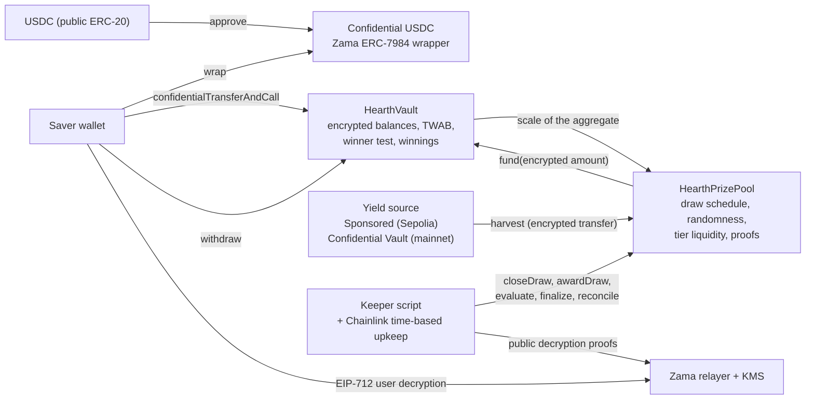

# What Hearth is

Hearth is a savings pool where you cannot lose your money and you might win a prize.

You put confidential USDC in. The pool puts that money to work and earns yield. Every
period the yield the pool earned is handed out as prizes, and your chance of winning is
proportional to how much you held and how long you held it. You can take your principal
back at any time, in full. That is the "no-loss lottery" idea PoolTogether invented, and
Hearth is a confidential version of it.

The difference from PoolTogether is that on an ordinary blockchain everything is public.
Anyone can read how much every saver has, what each wallet's odds are, and who won each
draw. That publishes people's wealth and paints a target on anyone large. Hearth runs the
whole thing over encrypted numbers using Zama's Protocol, so the chain holds your balance
as ciphertext (data that is unreadable without a key) and the contract still does the
arithmetic on it. Your balance is a number nobody has ever seen, including us, and the
draw is still checkable by a stranger.

## The system in one picture

Two contracts do the work. `HearthVault` holds every saver's encrypted principal, their
encrypted winnings, the record of how long they held what, and it runs the winner test.
`HearthPrizePool` runs the clock, draws the random seed, collects the yield and keeps the
prize money in tiers. A keeper script pushes the draw along, and every step it takes can
be taken by anyone else instead.

## The four moves

A saver makes four moves. Here is what each one does and what it gives away.

### 1. Deposit

You send confidential USDC to the vault with one transaction. The amount travels as a
ciphertext handle, which is a pointer to an encrypted value rather than the value itself.
The vault adds it to your encrypted principal and updates the record of your balance over
time, all without decrypting anything.

- Hidden: the amount, your running balance, and therefore your share of the pool.
- Public: your address, the block you did it in, and the fact that a deposit happened.

There is one seam. Turning ordinary public USDC into confidential USDC is a public
ERC-20 transfer, so the wrapped amount is visible. If you wrap 5,000 USDC and deposit two
blocks later, an observer has a very good guess. Hearth keeps wrapping and depositing as
two separate steps precisely so you can put distance between them. See
[the wrap seam](../security/what-stays-private.md).

### 2. Draw

At the end of every period the pool closes the draw for that period. In one transaction it
fixes each tier's prize size, then draws an encrypted random seed inside Zama's
coprocessor, then asks the vault how big the pool was, then collects the period's yield.
The order matters: prizes are sized before the random number exists, so nobody can see a
seed and then rearrange what winning is worth.

"How big the pool was" is deliberately vague, and that is the design. The vault does not
publish the total time-weighted balance of every saver added together. It publishes only
the power-of-two bracket that total falls in, so what the world learns is roughly the size
of the pool rather than its exact size. Publishing the exact number would let somebody
subtract two consecutive draws and read a lone saver's deposit off the difference.

Four small values then go out with a proof signed by Zama's key management service, so
anyone can check them: the seed, the bracket, whether anybody was in the pool at all, and
the yield collected. Every saver's result for that draw is fixed the moment those numbers
are verified.

- Hidden: every individual saver's weight, the pool's exact total, and every individual
  result.
- Public: the seed, the bracket, the yield collected, each tier's prize size, and, when a
  tier reconciles, how many prizes it paid.

### 3. Claim

There is no claim transaction, and that is the point. The app does have a "Claim prize"
button: it is an ordinary withdrawal of the winnings you just revealed, and on chain it
looks exactly like any other withdrawal.

Winnings are credited to a separate encrypted balance inside the vault while the draw is
being evaluated. Nothing you do makes that happen and nothing you do reveals it. To find
out whether you won, you sign an EIP-712 message, a typed off-chain signature that proves
you control your address, and Zama's relayer returns the plaintext of your own winnings
to your browser. That signature never touches the chain, so it costs nothing and it
leaves no trace.

- Hidden: everything. Reading your own winnings is an off-chain operation.
- Public: nothing.

In most prize protocols the winner has to send a claim transaction and the loser has no
reason to, so the transaction list quietly names the winners. Hearth has no such
transaction to send. The transaction that credits prizes, `evaluate`, cannot be aimed at
yourself: it walks the saver list from a point the draw's own seed decides, and the caller
says only how far to advance it.

### 4. Withdraw

One function takes money out: `withdraw`. It pays from your winnings first, then from your
principal, and clamps to the smaller of what you hold and what the vault holds. Whether
you are collecting a prize, taking your savings home, or both at once, it is the same call
with the same shape, the same event and an encrypted amount.

The second half of that clamp is there because a confidential transfer moves the whole
amount or nothing at all. It never sends part of what was asked for. So the vault works
out what it can actually pay before it asks the token to pay it, rather than trying to
repair a shortfall afterwards.

- Hidden: the amount, and whether any of it was prize money.
- Public: your address, the block, and the fact that a withdrawal happened.

Your principal is never locked. Deposits and withdrawals stay open while a draw is
running, which is not true of several other designs in this field.

## What makes it fair

Two things, and both are checkable by a stranger with no special access.

The random seed comes from `FHE.randEuint64`, generated inside Zama's coprocessor from a
public seed under the network's FHE key. Nobody can predict it and nobody can draw it
twice: closing a draw succeeds exactly once. Once the period is over the pool publishes
that seed together with the bracket the pool's total fell in, both carrying a proof the
contract verifies on chain.

From those two public numbers, anyone can recompute the exact threshold that any address
had to beat in any tier, and the vault exposes the same arithmetic as a view so nobody has
to trust a reimplementation. What they cannot do is see the encrypted weight it was
compared against. So the rule is public and auditable, and only the input is private.
Details in [randomness and verification](../security/randomness-and-verification.md).

## What Hearth does not hide

Short version, in full in [what stays private](../security/what-stays-private.md):

- Who the savers are, and when each of them deposited, withdrew or was evaluated.
- The bracket the pool's total fell in each period, the seed, and the yield collected.
- Each tier's prize size, and how many prizes it paid, on that tier's own cadence.
- The amount you wrapped into or out of confidential USDC.
- With one saver, the published bracket is that saver's weight to within a factor of two.
  With two, each can bound the other. Privacy here needs three or more savers and the app
  says so.
- Thresholds are public, so anyone who can pin your balance can compute your result in
  every draw. The usual way that happens is wrapping and then depositing the same amount
  minutes later, which is why the app keeps the two apart.
- Wrapping in and unwrapping out in full publishes a lower bound on everything you have
  ever won, because both movements are public at the token layer.
- A saver who withdraws immediately after every draw they won leaks a statistical hint
  through their own behaviour. No contract can fix that one.
