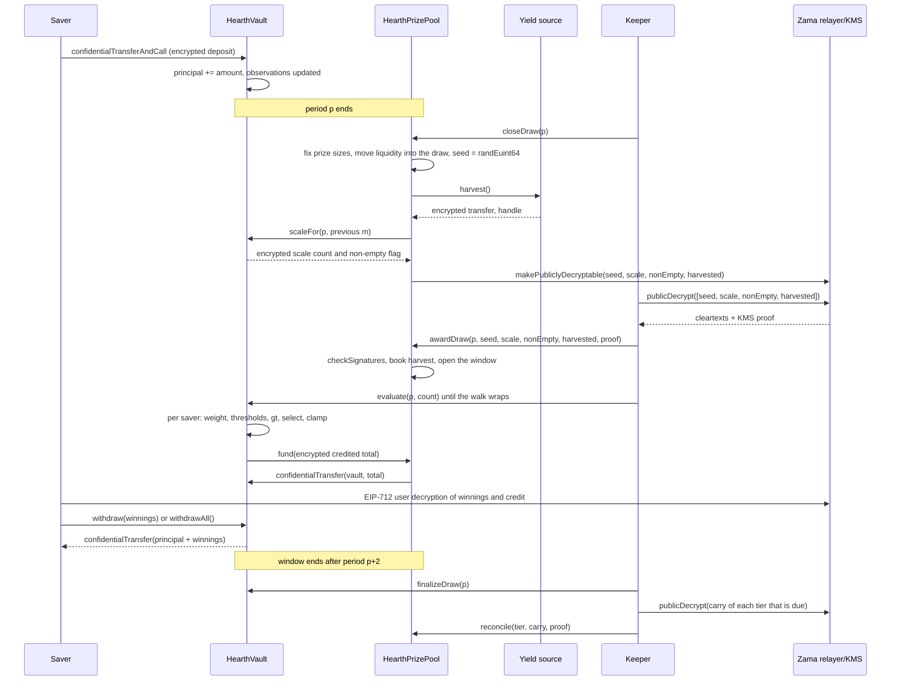

# كيف تجري القرعة

القرعة هي اللحظة التي يتحول فيها عائد المجمّع إلى جوائز. تمشي هذه الصفحة في العملية كلها
بكلام بسيط، ثم تعرض القصة نفسها كرسم بياني.

## الفترات

يُقطَّع الزمن إلى فترات متساوية طول كل منها `L` ثانية. تبدأ الفترة 1 عند `firstPeriodAt`،
وهي طابع زمني يُثبَّت عند النشر ولا يتغير بعده أبداً. ومن هناك الحساب مجرد قسمة:

```
period(t)      = (t - firstPeriodAt) / L + 1
periodStart(p) = firstPeriodAt + (p - 1) * L
periodEnd(p)   = periodStart(p + 1)
```

لكل مجمّع قيمة `L` خاصة به. وعلى Sepolia يعمل مجمّع USDC بساعة واحدة والستة الباقون بست
ساعات، فيرى الزائر دورة كاملة في جلسة واحدة. أما على الشبكة الرئيسية فنشر حقيقي سيستخدم
يوماً، وهو ما يستخدمه PoolTogether V5. والفترة معامل مُنشئ، فالشيفرة نفسها تخدم الثلاثة،
وتُضبط فئات كل مجمّع مقابل فترته هو. انظر [المجمّعات والتوكنات](pools-and-tokens.md).

القرعة `p` تغطي الفترة `p`. وتُحسم كلياً بالأرصدة المحتفظ بها خلال الفترة `p`. ولا شيء يقع
بعد انتهاء الفترة `p` يستطيع تغيير نتيجتها.

## النافذة، والموعد النهائي للإغلاق

كل خطوة من القرعة `p` تقع خلال الفترتين `p+1` و`p+2`. تلك هي النافذة، وتنتهي عند
`periodEnd(p + 2)`. أي ساعتان في مجمّع USDC ونصف يوم في الباقين.

وللإغلاق موعد نهائي أضيق من بقية النافذة:

```
closeDeadline(p) = periodStart(p + 2) + L / 2
```

أي منتصف الفترة الثانية من النافذة، عند ثلاثة أرباع النافذة. والإغلاق بعد ذلك مرفوض.

والسبب أن الإغلاق والمنح لا يمكن أن يتشاركا كتلة واحدة. فالإغلاق يضع قيماً في وضع قابل لفكّ
التشفير على السلسلة، وتعود النصوص الصريحة من مُرحِّل Zama خارج السلسلة، ثم يتحقق المنح منها
على السلسلة. والإغلاق في ثواني النافذة الأخيرة كان سيترك تلك الرحلة بلا مكان تهبط فيه،
وتعلق القرعة إلى الأبد في حالة `Closed`. أما الموعد النهائي فيضمن نصف فترة على الأقل للرحلة
وللمنح ولكل دفعة تقييم.

كما تحدّ النافذة إلى أي مدى ماضٍ على الخزنة أن تتذكر الأرصدة، وهو ما يجعل ثلاث رصدات محفوظة
لكل مدّخر كافية. انظر [الرصيد المرجّح زمنياً](time-weighted-balance.md).

## الخطوات الخمس

كل خطوة بلا إذن. يستطيع أي شخص استدعاء أي منها، بمن فيهم مدّخر من التطبيق. والحارس ليس إلا
العنوان الذي يصل عادةً أولاً.

### 1. الإغلاق

‏`closeDraw(p)`، بعد انتهاء الفترة `p` وقبل `closeDeadline(p)`.

تحدث خمسة أمور في هذه المعاملة الواحدة، بهذا الترتيب:

- **تُثبَّت أحجام الجوائز.** يُحسب حجم جائزة كل فئة والسيولة التي تقدّمها لهذه القرعة من
  المال الذي تحمله تلك الفئة في تلك اللحظة، وتنتقل تلك السيولة إلى القرعة. ويحدث هذا قبل
  وجود البذرة العشوائية.
- **تُسحب البذرة.** يعمل `FHE.randEuint64()` داخل معالج Zama المساعد، فيوجد الرقم كنص مشفّر
  فقط ولا يكون أحد قد رآه.
- **تبلّغ الخزنة عن موقع الوزن الإجمالي للفترة**، على شكل عدّاد مشفّر صغير واحد مع راية
  مشفّرة تقول هل احتفظ أحد برصيد أصلاً. لا الإجمالي نفسه، ولا بعد في الصريح. انظر القسم
  التالي.
- **يُحصد مصدر العائد**، كتحويل مشفّر واحد إلى المجمّع. وإن فشل المصدر، ينجح الإغلاق رغم
  ذلك: يُعامَل الحصاد كصفر مشفّر بديهي ويُصدَر الحدث `HarvestFailed`. فمصدر عائد معطوب لا
  يستطيع إيقاف الساعة.
- **تُوسم أربعة مقابض كقابلة لفكّ التشفير علناً:** البذرة، وعدّاد المقياس، وراية عدم الخلوّ،
  والحصاد. وتلك راية باتجاه واحد على قائمة التحكم بالوصول لدى Zama. ومن تلك اللحظة يستطيع
  أي شخص طلب نصّها الصريح من المُرحِّل، ولا يمكن سحب الراية. ولا يوسَم أي شيء آخر عن القرعة
  بهذه الطريقة أبداً.

تنتقل حالة القرعة إلى `Closed`. والإغلاق ينجح مرة واحدة بالضبط، ولهذا لا يستطيع أحد إعادة
رمي البذرة.

الترتيب داخل المعاملة هو المقصود. تُثبَّت أحجام الجوائز قبل وجود البذرة، فلا يستطيع أحد أن
يشاهد بذرة تظهر، ويحسب أنه ربح، ثم يعيد ترتيب مال المجمّع ليجعل ذلك الفوز أثمن.

### ما الذي تنشره الخزنة بدل الإجمالي

إجمالي الرصيد المرجّح زمنياً للمجمّع في الفترة، ويُكتب `W`، لا يُنشر أبداً. كان نشره بدقة
هو التصميم حتى 3 سبتمبر 2026 حين كسرته مراجعة: مع `W` علنية لفترتين متتاليتين، ومع الطابع
الزمني العلني لإيداع مدّخر أو سحبه، يمكن استرجاع المبلغ الدقيق لمدّخر كان الوحيد الذي حرّك
مالاً في تلك الفترة، بالحساب وحده. لا تحديد نطاق، بل استرجاع. وهذا موصوف في
[ما الذي يبقى خاصاً](../security/what-stays-private.md).

ما يُنشر الآن هو الشريحة التي تقع فيها `W`: أصغر قوة للعدد اثنين تساويها أو تعلوها، وتُكتب
`M = 2^m`. تتعقبها الخزنة تحت التشفير. وعند كل إغلاق تقارن `W` بقوى العدد اثنين الخمس
المحيطة بقيمة `m` من القرعة السابقة، وتجمع النتائج في عدّاد مشفّر صغير واحد، وتوسم ذلك
العدّاد كقابل لفكّ التشفير علناً. ثم يستنتج المجمّع قيمة `m` الجديدة من العدّاد المتحقَّق
منه. ومقارنة مشفّرة منفصلة مع الرقم 1 تعطي راية عدم الخلوّ، التي تقول هل احتفظ أحد برصيد
أصلاً.

فيتعلم المراقب شيئاً واحداً في كل قرعة: هل عبر المجمّع قوة للعدد اثنين. وبين العبورين لا
يتعلم شيئاً جديداً. وتجري كل قرعة مقابل `M` لا مقابل `W`، وهذا ما يجعل أعداد الجوائز
الموصوفة أدناه تتّسق على النحو الذي تتّسق به.

### 2. المنح

‏`awardDraw(p, seed, scaleCount, nonEmpty, harvested, proof)`.

يجلب من يستدعيها النصوص الصريحة الأربعة من مُرحِّل Zama، الذي يعيدها مع توقيع من خدمة إدارة
المفاتيح (KMS)، وهي مجموعة الأطراف التي تحمل مفتاح فك تشفير الشبكة. ويتحقق العقد من ذلك
التوقيع على السلسلة بـ `FHE.checkSignatures` قبل أن يصدّق رقماً واحداً. والإثبات مربوط
بالمقابض بترتيب ثابت، `[seed, scaleCount, nonEmpty, harvested]`، فلا يمكن خلط القيم الأربع
ولا إعادة استخدامها في قرعة أخرى.

ثم:

- يُقيَّد الحصاد المتحقَّق منه للفئات بحسب أوزان حصصها. وهذا هو الطريق الوحيد لدخول مال
  الجوائز، وهو يهبط في الفئات لا في هذه القرعة، فيُعرض عند الإغلاق التالي. ولا يسجّل المجمّع
  أبداً مبلغاً أبلغ عنه مصدر العائد عن نفسه.
- إن قالت راية عدم الخلوّ إن أحداً لم يحتفظ برصيد في الفترة `p`، تُوسم القرعة `Empty` وتعود
  السيولة التي كانت تعرضها إلى الفئات مباشرة.
- وإلا تُفتح القرعة. وتصبح البذرة والشريحة `M` رقمين علنيين.
- وإن كانت النافذة قد أُغلقت أصلاً حين يمنحها أحدهم، فالحصاد يُقيَّد رغم ذلك، والسيولة
  المعروضة تعود إلى الفئات، وتُوسم القرعة `Skipped`. فلا تدفع تلك الفترة جائزة، ولا يضيع
  عائد ولا سيولة.

حالات القرعة الخمس هي `None` و`Closed` و`Awarded` و`Empty` و`Skipped`.

**هذه هي اللحظة التي يُحسم فيها الفائزون.** فمن هنا تصبح البذرة رقماً علنياً، وتصبح الشريحة
رقماً علنياً، ولا يمكن لوزن أي مدّخر في الفترة `p` أن يتغير بعدها. والعتبات التي على كل
مدّخر تجاوزها هي حساب على مُدخلات علنية. أما التقييم، التالي، فلا يحسم شيئاً. إنه يدوّن
نتيجة موجودة أصلاً.

### 3. التقييم

‏`evaluate(p, count)` على الخزنة، بقدر ما يلزم من المرات، ما دامت النافذة مفتوحة.

يقول المستدعي كم مدّخراً يتقدم. ولا يقول أيّهم. تمشي الخزنة في قائمة المدّخرين من مؤشر خاص
بكل قرعة يبدأ عند `seed mod saverCount` ويتقدم بترتيب القائمة، فتنجز حتى `count` مدّخراً
وبحد أقصى `4` ممن يحتاجون عملاً مشفّراً. والمدّخرون الذين لا رصدة لهم عند الفترة `p` أو
قبلها وزنهم صفر، ويُتخطَّون من طوابعهم الزمنية الصريحة بلا أي كلفة تشفير إطلاقاً.

ولكل مدّخر تبلغه الجولة، تقرأ الخزنة وزنه المشفّر للفترة `p`، وتُجري اختبار الفوز مقابل
العتبات العلنية، وتضيف النتيجة إلى مكاسبه المشفّرة. وتخزّن وزن ذلك المدّخر المشفّر ومبلغه
المقيَّد المشفّر لتلك القرعة، وكلاهما مقروء لذلك المدّخر وحده، فيستطيع التطبيق أن يعرض
"ربحت X في القرعة p" ويتيح له فحص المقارنة. ثم تسحب المجموع المشفّر الذي قيّدته تلك الدفعة
من مجمّع الجوائز.

لا أحد يختار من يُقيَّم ولا بأي ترتيب. فالمدّخر الذي يريد نتيجته هو يقدّم الجولة نفسها التي
يقدّمها الجميع، فإرسال معاملة تقييم لا يقول شيئاً عمّا إذا كنت قد ربحت. ونقطة البداية تتحرك
في كل قرعة، لأنها تأتي من بذرة تلك القرعة، فلا يبقى عنوان أخيراً في الطابور بشكل دائم.

وتفشل `evaluate` لقرعة حالتها `Empty` أو `Skipped` أو لم تُمنح بعد.

### 4. الإنهاء

‏`finalizeDraw(p)`، بعد إغلاق النافذة.

كل ما عرضته كل فئة ولم تدفعه يُطوى داخل الرصيد المدوَّر المشفّر لتلك الفئة. والمدوَّر مجموع
جارٍ يبقى مشفّراً ويسافر من قرعة إلى قرعة. ويُضاف إلى السيولة التي تعرضها تلك الفئة عند كل
إغلاق، فيعود المال غير المدفوع إلى اللعب فوراً وإن ظلّ حجمه سرّاً.

كما ينشر الإنهاء المقبض الحالي لعدّاد مشفّر عالمي واحد لكل ما عجز المجمّع عن تمويله. ومع
حصادات متحقَّق منها يكون صفراً دائماً.

### 5. التسوية

‏`reconcile(tier, carry, proof)` على المجمّع، فئة واحدة في كل مرة، وفقط حين يحين موعد تلك
الفئة.

تُسوّى كل فئة على الإيقاع المضبوط عند النشر بوصفه `reconcileEvery[t]` قرعة. وعلى Sepolia
موعد كل فئة يحين في كل قرعة. وحين يحين موعد فئة، تَسِم `finalizeDraw` رصيدها المدوَّر
كقابل لفكّ التشفير علناً وتُصدر الحدث `CarryPublished`. فيجلب أي شخص النص الصريح، ويستدعي
`reconcile` مع إثبات KMS، ويُسجَّل الرقم المتحقَّق منه عائداً في السيولة الصريحة لتلك الفئة.
وتطرح الخزنة الرقم نفسه من المدوَّر، الذي قد يكون نما في الأثناء، ويُصدَر الحدث
`TierReconciled`.

والتسوية هي ما يجعل عدد جوائز تلك الفئة علنياً، لأن المدوَّر هو الجزء من المعروض الذي لم
يربحه أحد. وعند إيقاع قدره واحد، يصبح عدد كل فئة علنياً بعد قرعة واحدة من القرعة التي يخصها،
ويعود كامل وعاء كل فئة إلى العلن حيث يستطيع التطبيق عرضه وهو ينمو. أما رفع الإيقاع فيخفي
العدد لذلك العدد من القرعات ويخفي معه الوعاء النامي، وتلك هي المقايضة المشروحة في
[الجوائز والفئات](prizes-and-tiers.md). ولا شيء يتبخر في الحالتين، وعند أي إيقاع لا تعرف
أبداً من ربح.

## ماذا يحدث إن لم تهبط خطوة أبداً

- **الإغلاق لا يهبط أبداً.** تبقى القرعة `None` وتُتخطّى. ولم تتحرك سيولتها أصلاً، فتبقى في
  الفئات وتُعرض في القرعة التالية. ويجمع الإغلاق التالي الحصاد.
- **المنح لا يهبط داخل النافذة.** المنح المتأخر يظل يسجّل الحصاد، ويظل يعيد السيولة المعروضة
  إلى الفئات، ويوسم القرعة `Skipped`.
- **لا أحد يقيّم.** يُطوى كامل عرض كل فئة داخل مدوَّرها عند الإنهاء ويعود عند التسوية
  التالية.

لا شيء يعلق ولا شيء يضيع. والحارس المتعثّر يكلّف المجمّع قرعة لا مالاً. انظر
[صفحة الحارس](../operations/keeper.md).

## المال لا يتحرك أبداً بناءً على تقرير

قاعدتان تجعلان المحاسبة صعبة الخداع.

العائد لا يُؤخذ ثقةً أبداً. يُجري المصدر تحويلاً مشفّراً إلى المجمّع، والمجمّع هو المستلم
وبالتالي مسموح له على ذلك النص المشفّر، وعندها فقط ينشره المجمّع ويسجّل النص الصريح
المتحقَّق منه بـ KMS. فمصدر عائد معطوب أو عدائي يستطيع أن يرسل أقل مما يدّعي؛ ولا يستطيع أن
يجعل المجمّع يؤمن بمال جوائز لم يصل. وهذا مهم لأن سيولة جوائز وهمية ستُدفع في النهاية من
رأس مال أحدهم.

والمدفوعات تُسحب لا تُدفع. فبعد كل دفعة تقييم تمنح الخزنة المجمّع تفويضاً قصير الأجل على
المجموع المشفّر للدفعة، ويمنح المجمّع التوكن المثل، فينقل التوكن ذلك المبلغ بالضبط من
المجمّع إلى الخزنة. وإن قصّر المجمّع، تسجّل الخزنة الفجوة في العدّاد المشفّر العالمي لغير
المموَّل، الذي يُنشر عند الإنهاء ليفحصه أي شخص. ومع حصادات متحقَّق منها يكون ذلك العدّاد
صفراً دائماً.

## القرعة كاملة، من طرف إلى طرف



## ما لا تغطيه هذه الصفحة

لا تغطي كيف يُبنى وزن المدّخر عبر الفترة، وذلك في
[الرصيد المرجّح زمنياً](time-weighted-balance.md)، ولا حساب اختبار الفوز، وذلك في
[اختيار الفائزين](winner-selection.md)، ولا حجم كل جائزة، وذلك في
[الجوائز والفئات](prizes-and-tiers.md).
