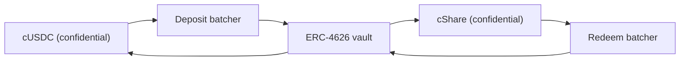

# من أين يأتي مال الجوائز

الجوائز عائد. ولا يُدفع رأس مال أحد أبداً كجائزة، وهذا ما يجعل المجمّع بلا خسارة. تغطي هذه
الصفحة الواجهة الوحيدة التي ينفّذها كل مصدر، والمصدر الذي يعمل على Sepolia اليوم، ولماذا
يرفض المجمّع تصديق كلام المصدر في أي شيء، وكيف تتصل خزنة Zama السرّية على الشبكة الرئيسية.

## الواجهة

```solidity
interface IYieldSource {
    function harvest() external returns (euint64 transferred); // confidential transfer to the recipient
    function harvestable() external view returns (uint64);      // display only
}
```

دالتان. تنقل `harvest` العائد المتراكم إلى مجمّع الجوائز كتحويل سرّي وتعيد المبلغ المشفّر
الذي انتقل فعلاً. أما `harvestable` فللعرض في التطبيق ولا يستخدمها المجمّع في المحاسبة أبداً.

و`harvest` متزامنة عن قصد. تنقل ما لدى المصدر جاهزاً في تلك اللحظة، ويُتوقّع من مصدر يكسب
لا تزامنياً أن يكون قد جهّز ذلك المبلغ سلفاً بدل أن يجعل المجمّع ينتظر.

وتبديل المصدر نداء مالك واحد على المجمّع، `setYieldSource`، ويُصدر `YieldSourceSet`. ولا شيء
آخر في النظام يعرف أو يهتم بأي مصدر متصل.

والمصدر الذي يفشل لا يوقف قرعة. يلتقط المجمّع الإخفاق، ويعامل حصاد تلك القرعة كصفر مشفّر
بديهي، ويُصدر `HarvestFailed`. فينجح الإغلاق، وتجري القرعة على السيولة التي تحملها الفئات
أصلاً، ويجمع حصاد لاحق العائد الذي أخفق في الانتقال. فالمصدر المعطوب أو الموصول خطأً يجوّع
جانب الجوائز؛ ولا يستطيع إيقاف الساعة.

وحين يهبط حصاد فعلاً، يُسجَّل عند منح تلك القرعة ويُعرض عند الإغلاق التالي. فعائد الفترة `p`
يموّل جوائز القرعة `p+1` لا جوائز القرعة `p`. وهذا ما يتيح تثبيت أحجام الجوائز قبل وجود
البذرة.

## Sepolia: المصدر المموّل بالرعاية

‏`SponsoredYieldSource` هو ما يعمل على كل مجمّع حي، نسخة واحدة لكل واحد، فالمصادر السبعة سبعة
أرصدة منفصلة لسبعة توكنات مختلفة. مصدر مجمّع USDC على
`0xCC49DF69eAB6884fD8DD9260902B8A0Abc9D6b91`؛ والستة الباقون في
[المجمّعات والتوكنات](pools-and-tokens.md).

يستدعي الراعي دالة `sponsor` في المصدر بالتوكن العلني الخاص بالمجمّع. فيغلّفه المصدر إلى
السرّي ويسجّل ما سكّه الغلاف بالضبط، لا ما طلبه الراعي. ومن هناك يقطر الرصيد بمعدّل
`ratePerSecond`، وهو على مجمّع USDC
`5,555 base units a second, which is 19.998 USDC a period`،
وترسل `harvest` ما تراكم إلى المجمّع. ويُضبط معدّل كل مجمّع بتوكنات كاملة في الساعة حتى
يمكن مقارنة مجمّعين على ساعتين مختلفتين بنظرة واحدة، وكل رعاية مقدَّرة لتغطي أكثر من ثمانين
قرعة.

والرعاية تبرّع. لا سبيل للراعي لاستردادها، ولا يستطيع تغيير معدّل التقطير إلا مالك المصدر،
وذلك يُصدر `RateChanged`.

ومبالغ الرعاية ومعدّل التقطير وكل حصاد كلها علنية. وهذا ليس تنازلاً: ففي PoolTogether مقدار
العائد الذي تساهم به الخزنة علني أيضاً، وكل حجم جائزة يتبع منه. أما ما هو سرّي في Hearth
فهو من ادّخر كم ومن ربح، لا كم من المال جناه المجمّع.

وإن بقي المجمّع بلا مدّخرين مدة، يظل العائد يتراكم ويُدفع لأوائل القرعات التي فيها مدّخرون.
فلا شيء يعلق في مجمّع فارغ.

### لماذا نموذج تجريبي أصلاً

لأن المصدر التجريبي لا يكون أميناً إلا إن قال التوثيق كيف يعمل وكيف يتصل مصدر حقيقي مكانه،
وكلاهما أدناه. بحثنا عن مصدر حقيقي أولاً ولا يوجد على Sepolia مصدر يدفع عائداً على توكنات
Zama التجريبية:

| المكان | لماذا لا |
| --- | --- |
| Aave | يرفض إيداعات USDC على Sepolia، فقد تجاوز سقف التوريد |
| Compound | يريد USDC من Circle نفسها، لا نسخة Zama التجريبية |
| خزنة Zama السرّية | خزنة Sepolia هي VaultV2 خاملة فقط بلا محوّل عائد، وذلك وصف Zama نفسها لها |

فكانت الخيارات الأمينة إما رقماً وهمياً يرتفع، وإما رصيداً ممولاً برعاية موجوداً فعلاً على
السلسلة ويقطر فعلاً. أخذنا الثاني. كل وحدة من مال الجوائز على كل واحد من المجمّعات السبعة
الحية غُلّفت فعلاً، ونُقلت فعلاً، وتُحقّق منها فعلاً.

## المجمّع لا يسجّل رقماً مُبلَّغاً عنه أبداً

هذه هي القاعدة التي تمنع المصدر المموّل بالرعاية من أن يكون نقطة ضعف.

يجري المصدر تحويلاً مشفّراً إلى المجمّع. والمجمّع، بصفته المستلم، مسموح له على ذلك النص
المشفّر، فيستطيع أن يَسِم المبلغ المنقول كقابل لفكّ التشفير علناً بنفسه. ولا يقيّد المجمّع
شيئاً للفئات إلا وقت المنح، بعد أن يتحقق `FHE.checkSignatures` من توقيع خدمة إدارة المفاتيح
على النص الصريح.

والمصدر الذي يكذب بشأن ما أرسله لا يصل إلى شيء. فالمجمّع يسجّل المبلغ الذي وصل، لأنه المبلغ
الوحيد الذي ينظر إليه أصلاً.

وهذا ليس حذراً نظرياً. ففي تصميمنا السابق كان المجمّع يسجّل تعبئة الاحتياطي من المبلغ الذي
مرّره المستدعي، بينما يسكّ الغلاف `amount / rate()`. وعلى النشر الحي صادف أن `rate()` كانت 1
فاتفق الرقمان وظلّ الخلل كامناً. أما على أصل بـ 18 منزلة عشرية، حيث معدّل الغلاف مليون
مليون، فكان المجمّع سيؤمن بمال جوائز أكبر مليون مليون مرة مما هو موجود. نفّذنا ذلك في 2
سبتمبر 2026 على توكن اختبار بـ 18 منزلة وشاهدناه يحدث. وسيولة الجوائز الوهمية في مجمّع بلا
خسارة تُدفع في النهاية من رأس مال أحدهم، وهو الوعد الوحيد الذي لا يستطيع المنتج نقضه.
والتحقق من التحويل يزيل الصنف كله.

## الشبكة الرئيسية: خزنة Zama السرّية

تشحن Zama بروتوكولاً وظيفته كلها كسب عائد على أرصدة سرّية، وهو المصدر الطبيعي على الشبكة
الرئيسية. و`ConfidentialVaultYieldSource` هو المحوّل في ذلك التصميم. وما يلي مواصفته، لا عقد
في هذا المستودع.

وهو محوّل واحد لكل مجمّع، كسائر ما هنا، ويحتاج كل واحد إلى مجمِّع دفعات وخزنة عائد لتوكنه.
ونشر Zama على الشبكة الرئيسية يغطي USDC اليوم، فنشر Hearth على الشبكة الرئيسية سيفتح مجمّع
USDC على الخزنة السرّية وأي توكن آخر على أي مصدر يوجد له، أو على لا شيء.

والتصميم مجمِّع دفعات يجلس بين التوكنات السرّية وخزنة عائد ERC-4626 عادية. فخزنة ERC-4626 لا
تقبل إلا التحويلات العلنية، ومودع وحيد سينشر مبلغه بالضبط. أما المجمِّع فيجمّع إيداعات
مشفّرة كثيرة، ولا يفكّ تشفير إلا المجموع، ويقوم بإيداع علني واحد في الخزنة، ويعيد حصصاً
سرّية. وبكلمات Zama نفسها: "يرى المراقبون من شارك، لا كم ساهم كل واحد."



يربط المحوّل مجمِّع الإيداع بالتوكن السرّي للمجمّع ويحمل حصصاً سرّية. ويجري الاسترداد على
جدوله الخاص، سابقاً للحصاد: يسأل الحارس دورياً مجمِّع الاسترداد عن النمو ويمشي بذلك الطلب
عبر مراحله الأربع، فبحلول استدعاء المجمّع التالي لـ `harvest` يكون USDC السرّي المسترد جالساً
في المحوّل أصلاً ويكون الحصاد تحويلاً واحداً كأي تحويل. وهكذا يلتقي مكان لا تزامني بواجهة
متزامنة. وكل مرحلة من المراحل الأربع بلا إذن، فلا يضطر أحد إلى انتظار مشغّل Zama لتشغيلها.

### العناوين

من مرجع عناوين Zama نفسه، مجلوباً في 2 سبتمبر 2026.

**الشبكة الرئيسية لإيثيريوم، معرّف السلسلة 1.** الأصل الأساسي USDC. مصدر العائد: خزنة
VaultV2 من Morpho باسم "Steakhouse Confidential Prime USDC"، مقيَّدة بحيث يكون مجمِّع
الإيداع هو المودع الوحيد فيها.

| العقد | العنوان |
| --- | --- |
| مجمِّع الإيداع | `0x324EA89FD3784036673BfE6Ffee2334A088F40Cc` |
| مجمِّع الاسترداد | `0x96Cd3Faa7483783Ac2Eb715f6333361500F1eec9` |
| غلاف cUSDC | `0xe978F22157048E5DB8E5d07971376e86671672B2` |
| غلاف cShare | `0x66Bf74E96900D1a19c7070D939D124f2F565C458` |
| خزنة ERC-4626 | `0xbEEF00A59B577423653A1526c7009bdE103F542B` |
| USDC | `0xA0b86991c6218b36c1d19D4a2e9Eb0cE3606eB48` |

**Sepolia، معرّف السلسلة 11155111.** بيئة تجهيز: الـ USDC نموذج تجريبي بدالة `mint` علنية
والخزنة خاملة فقط بلا محوّل عائد.

| العقد | العنوان |
| --- | --- |
| مجمِّع الإيداع | `0x48758559c14d4d92b4C74A99660B6a8dbe85F53b` |
| مجمِّع الاسترداد | `0xe94E9afdDd43a19C2914739e9279cb6Fe287BEb0` |
| غلاف cUSDC | `0x7c5BF43B851c1dff1a4feE8dB225b87f2C223639` |
| غلاف cShare | `0x7E93d5c150A2178B1fCde0278582Acf59478eA5f` |
| خزنة ERC-4626 (خاملة) | `0x6AB54988261AEC573a2CA13cF802d3B1114f864C` |
| Mock USDC | `0x9b5Cd13b8eFbB58Dc25A05CF411D8056058aDFfF` |

ولأن خزنة Sepolia خاملة، فالمحوّل موصوف هنا مقابل واجهة المجمِّع التي نشرتها Zama ولم يُكتب
بعد. والقول إنه حيّ بينما لا يكسب شيئاً كذبة يستطيع أي أحد كشفها في دقيقة.

### ماذا يعني توصيله عملياً

يتحرك المجمِّع في أربع مراحل: الانضمام، والإرسال، والإنهاء، والمطالبة. تنتظر الدفعة حتى تبلغ
عمراً أدنى، ثم يُفكّ تشفير مجموعها، ثم تسوّي الخزنة، ثم يطالب المشاركون. وكل مرحلة من تلك
بلا إذن، فلا يعلق المجمّع منتظراً مشغّل Zama أبداً، ولا تنتهي صلاحية المطالبات.

وذلك الإيقاع أبطأ من التقطير الفوري للمصدر المموّل بالرعاية، ولهذا يشغّل الحارس الاسترداد
سلفاً بدل تشغيله داخل `harvest`. فعقد المجمّع لا ينتظر أبداً: إنه يسأل المحوّل عمّا استُردّ
أصلاً. وما يبقى عملاً حقيقياً في تشغيل هذا هو عقد المحوّل نفسه، الذي يصفه هذا المستودع ولا
ينفّذه، والجانب الخاص بالحارس منه، أي تحديد كم مرة يبدأ استرداداً وكم من المركز يسترد، وهو
خيار سياسة لا أثر له على السلسلة إن تأخّر.

### ماذا سيرث Hearth

تسمية هذا بدقة جزء من كوننا جديرين بالثقة بشأنه.

- **مخاطر الخزنة، كاملة.** يمرّر المجمِّع المال إلى خزنة ERC-4626 تابعة لطرف ثالث. وإن خسرت
  تلك الخزنة قيمة، خسر رصيد المجمّع المدرّ للعائد قيمة معها. وهذا هو الموضع الوحيد الذي
  يعتمد فيه وعد "بلا خسارة" على عقد شخص آخر، ولهذا ينبغي لنشر على الشبكة الرئيسية أن يحتفظ
  هناك بالجزء المدرّ للعائد فقط.
- **سرّية الدفعة لا سرّية المجمّع.** يخفي المجمِّع المبالغ بين المشاركين معه ويفكّ تشفير
  المجموع. ولو كان Hearth المشارك الوحيد في دفعة، لصار مبلغ إيداعه علنياً. وذلك لا يكلّفنا
  شيئاً، لأن حصادات Hearth منشورة على أي حال، لكنه يستحق المعرفة قبل افتراض أن المجمِّع يخفي
  أكثر مما يخفي.
- **صلاحيات مالك محدودة.** يستطيع مالك المجمِّع تغيير الحد الأدنى لعمر الدفعة (بسقف 7 أيام)،
  والموعد النهائي لنداء العودة (بسقف 30 يوماً)، وحدّ تحمّل انزلاق الإيداع، ويستطيع إيقاف
  الانضمام والإرسال مؤقتاً. ويذكر توثيق Zama أن المالك لا يستطيع نقل أموال المستخدمين ولا
  تجميدها، ولا يستطيع حجب نتيجة، ولا فكّ تشفير مبالغ أحد، ولا ترقية العقد. وحماية انزلاق
  الاسترداد مطفأة برمجياً حتى تعمل عمليات الخروج حتى أثناء تراجع الخزنة.

## ما لا تغطيه هذه الصفحة

لا تغطي أثر مصدر العائد على جدول التسريبات، وذلك في
[ما الذي يبقى خاصاً](../security/what-stays-private.md). ولا تقيس عائد خزنة Morpho، فذلك رقم
شخص آخر ويتغير يومياً. ولا تدّعي أن المحوّل يعمل: فعلى Sepolia المصدر المموّل بالرعاية هو
المتصل، وبطاقة "المجمّع الآن" على لوحة التحكم تسمّيه.
