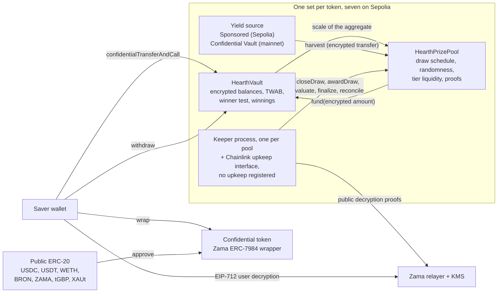

# ما هو Hearth

‏Hearth مجمّع ادخار لا يمكنك أن تخسر فيه مالك، وقد تربح فيه جائزة. سبعة منها تعمل على
‏Sepolia، واحد لكل توكن سرّي، وتختار التوكن كما تختار حساب توفير.

تضع فيه توكناً سرّياً: USDC أو USDT أو WETH أو BRON أو ZAMA أو tGBP أو XAUt. يشغّل المجمّع
هذا المال ويجني عائداً. وفي كل فترة يُوزَّع العائد الذي جناه المجمّع على شكل جوائز، وفرصتك
في الفوز تتناسب مع حجم ما احتفظت به ومدة احتفاظك به. يمكنك استرداد رأس مالك كاملاً في أي
وقت. تلك هي فكرة "اليانصيب بلا خسارة" التي ابتكرها PoolTogether، وHearth نسخة سرّية منها.

الفارق عن PoolTogether أن كل شيء على سلسلة عادية يكون علنياً. يستطيع أي شخص أن يقرأ كم
يملك كل مدّخر، وما احتمالات كل محفظة، ومن فاز في كل قرعة. هذا ينشر ثروات الناس ويرسم هدفاً
على ظهر كل صاحب رصيد كبير. يشغّل Hearth العملية كلها فوق أرقام مشفّرة باستخدام بروتوكول
‏Zama، فتحتفظ السلسلة برصيدك كنص مشفّر (بيانات لا تُقرأ من دون مفتاح) بينما يواصل العقد
إجراء الحساب عليه. رصيدك رقم لم يره أحد قط، ونحن منهم، وتبقى القرعة قابلة للفحص من غريب.

## النظام في صورة واحدة

عقدان يقومان بالعمل. يحتفظ `HearthVault` برأس المال المشفّر لكل مدّخر، وبمكاسبه المشفّرة،
وبسجل مدة احتفاظه بما احتفظ به، وهو الذي يجري اختبار الفوز. أما `HearthPrizePool` فيدير
الساعة، ويسحب البذرة العشوائية، ويجمع العائد، ويحتفظ بمال الجوائز موزعاً على فئات. تدفع
عملية حارس القرعة إلى الأمام، وكل خطوة يقوم بها يستطيع أي شخص آخر أن يقوم بها بدلاً منه.

الصندوق في الوسط هو مجمّع توكن واحد. هناك سبعة منها ولا تتشارك شيئاً: مركزك في USDC ومركزك
في WETH مدّخران منفصلان في خزنتين منفصلتين، وسكون أحد المجمّعات يترك البقية تعمل. المجمّع
الذي تنظر إليه هو الجزء الأول من شريط العنوان، `/app/usdc` أو `/app/weth`. القائمة الكاملة،
مع العناوين، في [المجمّعات والتوكنات](../concepts/pools-and-tokens.md).

## الحركات الأربع

يقوم المدّخر بأربع حركات. وهذا ما تفعله كل واحدة وما تكشفه.

### 1. الإيداع

ترسل التوكن السرّي الخاص بذلك المجمّع إلى خزنته بمعاملة واحدة. ينتقل المبلغ على شكل مقبض
نص مشفّر، وهو مؤشر إلى قيمة مشفّرة لا القيمة نفسها. تضيفه الخزنة إلى رأس مالك المشفّر
وتحدّث سجل رصيدك عبر الزمن، كل ذلك من دون فك تشفير أي شيء.

- مخفي: المبلغ، ورصيدك الجاري، وبالتالي حصتك من المجمّع.
- علني: عنوانك، والكتلة التي أودعت فيها، وحقيقة أن إيداعاً قد حدث.

هناك شقّ واحد. تحويل التوكن العلني العادي إلى التوكن السرّي هو تحويل ERC-20 علني، فيكون
المبلغ المغلَّف مرئياً. إن غلّفت 5,000 USDC وأودعت بعد كتلتين، فلدى المراقب تخمين جيد جداً.
يبقي Hearth التغليف والإيداع خطوتين منفصلتين لهذا السبب بالذات، حتى تستطيع أن تباعد بينهما.
انظر [شقّ التغليف](../security/what-stays-private.md).

### 2. القرعة

في نهاية كل فترة يغلق المجمّع قرعة تلك الفترة. في معاملة واحدة يثبّت حجم جائزة كل فئة، ثم
يسحب بذرة عشوائية مشفّرة داخل معالج Zama المساعد، ثم يسأل الخزنة عن حجم المجمّع، ثم يجمع
عائد الفترة. الترتيب مهم: تُحدَّد أحجام الجوائز قبل أن يوجد الرقم العشوائي، فلا يستطيع أحد
أن يرى بذرة ثم يعيد ترتيب قيمة الفوز.

عبارة "حجم المجمّع" مبهمة عن قصد، وهذا هو التصميم. لا تنشر الخزنة إجمالي الرصيد المرجّح
زمنياً لكل المدّخرين مجموعاً. تنشر فقط شريحة قوى العدد اثنين التي يقع فيها ذلك الإجمالي،
فما يعرفه العالم هو حجم المجمّع تقريباً لا حجمه بالضبط. نشر الرقم الدقيق كان سيسمح لأحدهم
بطرح قرعتين متتاليتين وقراءة إيداع مدّخر وحيد من الفرق.

ثم تخرج أربع قيم صغيرة مع إثبات موقّع بمفتاح خدمة إدارة المفاتيح لدى Zama، فيستطيع أي شخص
فحصها: البذرة، والشريحة، وهل كان في المجمّع أحد أصلاً، والعائد المجموع. تتثبّت نتيجة كل
مدّخر في تلك القرعة لحظة التحقق من تلك الأرقام.

- مخفي: وزن كل مدّخر على حدة، وإجمالي المجمّع الدقيق، وكل نتيجة فردية.
- علني: البذرة، والشريحة، والعائد المجموع، وحجم جائزة كل فئة، وبعد قرعة واحدة حين تُسوّى
  الفئة، كم جائزة دفعت.

### 3. المطالبة

لا توجد معاملة مطالبة، وهذا هو المقصود. التطبيق فيه زر مطالبة، على بطاقة تلك القرعة في
"قرعاتي"، وهو يحمل المبلغ: إنه سحب عادي للمكاسب التي فتحتها للتو، وعلى السلسلة يبدو تماماً
مثل أي سحب آخر.

تُقيَّد المكاسب في رصيد مشفّر منفصل داخل الخزنة أثناء تقييم القرعة. لا شيء تفعله يجعل ذلك
يحدث، ولا شيء تفعله يكشفه. لتعرف إن كنت قد ربحت، توقّع رسالة EIP-712، وهي توقيع مصنّف خارج
السلسلة يثبت أنك تتحكم بعنوانك، فيعيد مُرحِّل Zama النص الصريح لمكاسبك أنت إلى متصفحك. ذلك
التوقيع لا يمسّ السلسلة أبداً، فلا يكلّف شيئاً ولا يترك أثراً. رصيدك على لوحة التحكم ونتيجة
قرعة ما لكل منهما عينه الخاصة، ويمكن أن يكونا مفتوحين معاً، وتوقيع الأول يخدم الثاني.

- مخفي: كل شيء. قراءة مكاسبك عملية خارج السلسلة.
- علني: لا شيء.

في معظم بروتوكولات الجوائز يضطر الفائز إلى إرسال معاملة مطالبة ولا سبب للخاسر أن يفعل، فتسمّي
قائمة المعاملات الفائزين بهدوء. في Hearth لا توجد معاملة كهذه تُرسل. أما المعاملة التي تقيّد
الجوائز، `evaluate`، فلا يمكن توجيهها إلى نفسك: فهي تمشي في قائمة المدّخرين من نقطة تحدّدها
بذرة القرعة نفسها، ولا يقول المستدعي إلا إلى أي مدى يقدّمها.

### 4. السحب

دالة واحدة تُخرج المال: `withdraw`. تدفع من مكاسبك أولاً ثم من رأس مالك، وتُحصر عند الأصغر
من بين ما تملكه وما تملكه الخزنة. سواء كنت تقبض جائزة أو تأخذ مدّخراتك إلى بيتك أو الاثنين
معاً، فهو النداء نفسه بالشكل نفسه والحدث نفسه ومبلغ مشفّر.

النصف الثاني من ذلك الحصر موجود لأن التحويل السرّي ينقل المبلغ كله أو لا شيء البتة. ولا
يرسل أبداً جزءاً مما طُلب. لذلك تحسب الخزنة ما تستطيع دفعه فعلاً قبل أن تطلب من التوكن أن
يدفعه، بدل محاولة إصلاح نقص بعد وقوعه.

- مخفي: المبلغ، وهل كان أي جزء منه مال جوائز.
- علني: عنوانك، والكتلة، وحقيقة أن سحباً قد حدث.

رأس مالك ليس مقفلاً أبداً. تبقى الإيداعات والسحوبات مفتوحة أثناء جريان قرعة، وهذا غير صحيح
في عدة تصاميم أخرى في هذا المجال.

## ما الذي يجعله عادلاً

أمران، وكلاهما قابل للفحص من غريب بلا أي صلاحية خاصة.

تأتي البذرة العشوائية من `FHE.randEuint64`، وتُولَّد داخل معالج Zama المساعد من بذرة علنية
تحت مفتاح التشفير المتماثل الخاص بالشبكة. لا أحد يستطيع التنبؤ بها ولا أحد يستطيع سحبها
مرتين: إغلاق القرعة ينجح مرة واحدة بالضبط. وما إن تنتهي الفترة حتى ينشر المجمّع تلك البذرة
مع الشريحة التي وقع فيها إجمالي المجمّع، وكلاهما يحمل إثباتاً يتحقق منه العقد على السلسلة.

من هذين الرقمين العلنيين يستطيع أي شخص أن يعيد حساب العتبة الدقيقة التي كان على أي عنوان
تجاوزها في أي فئة، وتكشف الخزنة الحساب نفسه كدالة عرض حتى لا يضطر أحد إلى الوثوق بإعادة
تنفيذ. ما لا يستطيعونه هو رؤية الوزن المشفّر الذي قُورن به. فالقاعدة علنية وقابلة للتدقيق،
والمُدخل وحده هو الخاص. التفاصيل في [العشوائية والتحقق](../security/randomness-and-verification.md).

## ما الذي لا يخفيه Hearth

النسخة القصيرة، وكاملةً في [ما الذي يبقى خاصاً](../security/what-stays-private.md):

- من هم المدّخرون، ومتى أودع كل منهم أو سحب أو جرى تقييمه.
- الشريحة التي وقع فيها إجمالي المجمّع في كل فترة، والبذرة، والعائد المجموع.
- حجم جائزة كل فئة، وكم جائزة دفعت، ويُنشران بعد قرعة واحدة.
- المبلغ الذي غلّفته داخل التوكن السرّي أو أخرجته منه.
- مع مدّخر واحد، تكون الشريحة المنشورة هي وزن ذلك المدّخر في حدود ضعف واحد. ومع اثنين،
  يستطيع كل منهما تحديد نطاق الآخر. الخصوصية هنا تحتاج ثلاثة مدّخرين أو أكثر، والتطبيق يقول ذلك.
- العتبات علنية، فمن يستطيع تثبيت رصيدك يستطيع حساب نتيجتك في كل قرعة. الطريقة المعتادة
  لحدوث ذلك هي التغليف ثم إيداع المبلغ نفسه بعد دقائق، ولهذا يبقي التطبيق الخطوتين متباعدتين.
- التغليف الكامل ثم فك التغليف الكامل ينشر حداً أدنى لكل ما ربحته في حياتك، لأن الحركتين
  علنيتان عند طبقة التوكن.
- المدّخر الذي يسحب فوراً بعد كل قرعة ربحها يسرّب تلميحاً إحصائياً عبر سلوكه هو. لا عقد
  يستطيع إصلاح تلك.
