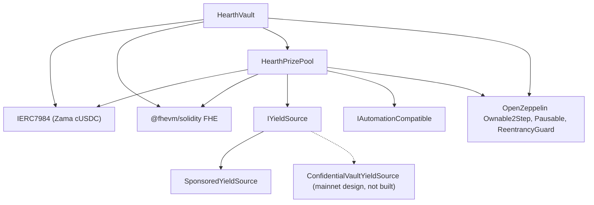

# النشر

سكربت واحد قابل للتكرار، لا نقر يدوي أبداً. وهذه الصفحة هي الترتيب والمعاملات ومعنى كل واحد
منها، حتى يستطيع المراجع قراءة معاملات المُنشئ المنشورة ويعرف أنها مطابقة.

ينشر Hearth مجمّعاً واحداً لكل توكن سرّي: خزنة ومجمّع جوائز ومصدر عائد لكل توكن، لا يتشارك
شيئاً مع أي مجمّع آخر. والتشغيل الواحد يفتح مجمّعاً واحداً، لأن رقم ناشر واحد يشغّل نشراً
واحداً، ويُختار التوكن بـ `HEARTH_TOKEN`. وكل مهمة بعد ذلك تأخذ `--token`:

```
cd packages/contracts
HEARTH_TOKEN=weth npx hardhat deploy --network sepolia
npx hardhat hearth:verify  --network sepolia --token weth
npx hardhat hearth:seed    --network sepolia --token weth
npx hardhat hearth:status  --network sepolia --token weth
```

اتركهما معاً وستحصل على `usdc`، وهو التوكن الافتراضي للشبكة. والمعرّف المجهول يفشل مع قائمة
المجمّعات التي تملكها تلك الشبكة فعلاً. ومعاملات كل مجمّع تعيش في ملف واحد،
`packages/contracts/hearth.config.ts`: زوج الأصول، والفترة، ومجموعة الفئات، والشريحة
الابتدائية، ومعدّل التقطير، والرعاية، وحصص المدّخرين التجريبيين الخمسة، ومؤشر الحساب الذي
يوقّع منه حارسه. اقرأ ذلك الملف إلى جانب الجداول أدناه؛ فهو الأرقام نفسها.

ويعيد النشر استخدام أي عقد له نشر محفوظ أصلاً بدل استبداله، فالتشغيل الثاني بلا أثر. والمجمّع
الحي الذي يحمل مال المدّخرين وأياماً من تاريخ القرعات لا يمكن نقله إلى عنوان جديد بإعادة
تشغيل السكربت أبداً. ولاستبدال واحد عن قصد، احذف ملفه تحت `deployments/<network>/` أولاً.

ويكتب النشر `deployments/sepolia/hearth.<slug>.json`، وهو ما يُوجَّه إليه الحارس بـ
`HEARTH_ADDRESSES_FILE` وما تُولَّد منه قائمة مجمّعات التطبيق.

## ما الذي يعتمد على ماذا



الحواف المتصلة عقود في هذا المستودع. والعقدة المنقّطة هي مسار العائد على الشبكة الرئيسية:
المحوّل موصوف مقابل واجهة المجمِّع التي نشرتها Zama ولا يُكتب هنا أي عقد محوّل، فلا يُنشر
أدناه إلا `SponsoredYieldSource`.

وتحتاج الخزنة والمجمّع كلٌّ منهما الآخر، فيُصنع أحد الرابطين بعد النشر لا في المُنشئ. ولهذا
هناك خمس خطوات أدناه لا ثلاث.

## الترتيب

| الخطوة | الإجراء | لماذا هنا |
| --- | --- | --- |
| 1 | انشر `HearthVault` | يحمل مال المدّخرين ولا يحتاج لوجوده إلا التوكن. |
| 2 | انشر `HearthPrizePool` موجَّهاً إلى الخزنة | يقرأ المجمّع ساعة الخزنة وعدّاد مقياسها، ويدفع للخزنة. |
| 3 | الربط: `vault.setPrizePool(pool)` | يُصدر `PrizePoolSet`. ولن تقبل الخزنة تمويلاً إلا من هذا العنوان. |
| 4 | انشر مصدر العائد موجَّهاً إلى المجمّع كمستلم | عليه أن يعرف إلى أين يرسل الحصادات. |
| 5 | الربط: `pool.setYieldSource(source)` | يُصدر `YieldSourceSet`. وحتى يهبط هذا، لا يحصد الإغلاق شيئاً ويُصدر `HarvestFailed`. |

وبعد الخطوة 5، ازرع المجمّع: `hearth:seed --token <slug>` يموّل مصدر العائد بالرعاية فتوجد
جوائز، ويضع خمسة مدّخرين تجريبيين بأحجام مختلفة من الحسابات 2 إلى 6، فيهبط أول زائر على مجمّع
مأهول لا فارغ. وكل خطوة منه تفحص السلسلة لمعرفة ما تمّ أصلاً، فالزرع الذي قطعته فَواق من
المُرحِّل آمن لإعادة تشغيله.

ويحتاج حارس ذلك المجمّع أيضاً إلى ETH خاص به على Sepolia، وكذلك المدّخرون التجريبيون الخمسة:

```
npx hardhat hearth:spread-gas --network sepolia --token weth
npx hardhat hearth:spread-gas --network sepolia --keepers 10,11,12,13,14,15 --savers false
```

الأول يموّل حارس مجمّع واحد والمدّخرين؛ والثاني يموّل عدة حسابات حراسة في مرّة واحدة، وهو ما
يحتاجه فتح ستة مجمّعات دفعة واحدة.

ثم وجّه التطبيق إلى ما نُشر:

```
cd ../web
node scripts/sync-pools.mjs
```

## المعاملات

```
HearthVault(IERC7984 asset, uint256 periodLength, uint256 firstPeriodAt, address owner)
HearthPrizePool(IHearthVault vault, IERC7984 asset, Tier[3] tiers, uint8 initialScaleBits, address owner)
    Tier = { uint32 prizeCount; uint64 oddsNumerator; uint64 oddsDenominator; uint16 shares; uint16 reconcileEvery }
SponsoredYieldSource(IERC7984ERC20Wrapper asset, address recipient, uint64 ratePerSecond, address owner)
```

### HearthVault

| المعامل | المعنى | ماذا لو أخطأت فيه |
| --- | --- | --- |
| `asset` | توكن ERC-7984 السرّي الذي يودعه المدّخرون، واحد من توكنات Zama السبعة. | كل غلاف يقرأ ست منازل عشرية، والنشر يرفض المتابعة إن خالفت السلسلة الإعداد. والمعدّل إلى التوكن العلني تحته ليس 1 في كل مجمّع: فعلى نموذج WETH التجريبي بـ 18 منزلة هو مليون مليون، فكل ما يقرأ التوكن العلني عليه تطبيقه. |
| `periodLength` (`L`) | ثواني الفترة. غير قابل للتغيير. | يضبط أيضاً سقف المدّخر الواحد، `(2^64 - 1) / L`. فـ `L` صغيرة جداً تعني سقفاً ضخماً وقرعات مشوّشة؛ وكبيرة جداً تعني سقفاً ضيقاً. |
| `firstPeriodAt` | الطابع الزمني الذي تبدأ عنده الفترة 1. غير قابل للتغيير، ويجب أن يكون عند النشر أو قبله. | القيمة المستقبلية تجعل `period(now)` غير معرَّفة حتى تمرّ. |
| `owner` | مالك على خطوتين. والتنازل معطَّل. | الصلاحيات مذكورة في [نموذج التهديد](../security/threat-model.md). |

و`maxPrincipal` مشتق من `periodLength` لا مضبوط. وعند ساعة هو نحو 5 مليارات توكن، وعند ست
ساعات نحو 854 مليوناً، وعند يوم نحو 213 مليوناً.

والخزنة تملك الساعة. ويأخذ المجمّع عنوان الخزنة ويقرأ الفترات منها، فلا سبيل لأن يختلف العقدان
على أي فترة نحن فيها.

### HearthPrizePool

| المعامل | المعنى |
| --- | --- |
| `vault` | الخزنة التي يخدمها هذا المجمّع، والساعة التي يقرؤها. |
| `asset` | التوكن السرّي نفسه الذي تستخدمه الخزنة. ويجب أن يتطابقا. |
| `prizeCount[t]` | الجوائز في القرعة في الفئة `t`. |
| `oddsNumerator[t]` و`oddsDenominator[t]` | احتمالات الفئة ككسر، قرعة واحدة من `oddsDenominator / oddsNumerator`. |
| `shares[t]` | شريحة الفئة من كل حصاد. والحصص نسبية، فـ 40/20/40 و2/1/2 تعنيان الشيء نفسه. |
| `reconcileEvery[t]` | كم قرعة تمرّ بين نشرة وأخرى للرصيد المدوَّر لتلك الفئة. |
| `initialScaleBits` | طول البتات المتوقع للوزن الإجمالي لأول فترة، وهو التخمين الابتدائي لمتعقّب الشريحة. |
| `owner` | كما أعلاه. |

و`UTILISATION` ثابت لا معامل: 50 بالمئة، اتّباعاً لـ PoolTogether V5. وهو نسبة السيولة
الصريحة للفئة المستخدمة في تحديد حجم كل جائزة.

واثنان منها يستحقان كلمة.

`reconcileEvery` إعداد خصوصية لا إعداد غاز، وهو يقايض شكل وعاء الجوائز. فنشر الرصيد المدوَّر
لفئة يجعل عدد جوائز تلك الفئة علنياً، والعدد على قرعة واحدة يشير إلى المجموعة الصغيرة من
المدّخرين المؤهلين في تلك القرعة. ورفعه يوزّع العدد على مدى كان فيه الجميع تقريباً مؤهلين في
لحظة ما. وما يكلّفه هو الجائزة الكبرى المرئية: فالإغلاق ينقل كل السيولة العلنية لفئة إلى
القرعة ولا تعود إلا عند تسوية، فالفئة عند إيقاع 24 تنشر جائزة محدَّدة من حصة قرعة واحدة من
الحصاد في 23 قرعة من كل 24، ولا يظهر الوعاء المتراكم في العلن إلا في قرعة التسوية. والمال
معروض وقابل للربح طوال الوقت داخل الرصيد المدوَّر المشفّر؛ لكنه غير مرئي فحسب. وتشغّل Sepolia
الفئات الثلاث كلها عند 1 لذلك السبب وتذكر العدد لكل قرعة كأثر متبقٍّ. انظر القيد 14.

و`initialScaleBits` يكفي أن يكون قريباً. فالمتعقّب يقارن الإجمالي الحقيقي بخمس قوى للعدد
اثنين حول التخمين الحالي عند كل إغلاق ويصحّح نفسه بثلاث بتات على الأكثر في كل قرعة، فالتخمين
البعيد ببضع بتات يكلّف قرعة أو قرعتين باحتمالات مائلة قليلاً ثم يستقر.

### SponsoredYieldSource

| المعامل | المعنى |
| --- | --- |
| `asset` | غلاف ERC-7984 الذي يحمله ويرسله. والتوكن العلني الذي يدفع به الرعاة هو أصل الغلاف نفسه، فهو ليس معاملاً منفصلاً. |
| `recipient` | مجمّع الجوائز الذي يتلقى الحصادات. |
| `ratePerSecond` | بأي سرعة يقطر الرصيد المموَّل بالرعاية كعائد. |
| `owner` | يضبط المعدّل، مُصدراً `RateChanged`. |

والرعاية نداء منفصل بعد النشر لا معامل مُنشئ. وهي تسجّل ما سكّه الغلاف بالضبط لا ما طلبه
الراعي، ولا يمكن التراجع عنها.

## ثلاث مجموعات معاملات

تشغّل Sepolia اثنتين منها، لأن المجمّعات تعمل على ساعتين.

| الإعداد | Sepolia `usdc` | Sepolia، الستة الأخرى | الشبكة الرئيسية، مرشَّح |
| --- | --- | --- | --- |
| طول الفترة | ساعة | 6 ساعات | يوم |
| النافذة | ساعتان (فترتان) | 12 ساعة | يومان |
| الموعد النهائي للإغلاق | ساعة و30 دقيقة بعد انتهاء الفترة | 9 ساعات بعدها | يوم و12 ساعة بعدها |
| سقف المدّخر الواحد | نحو 5 مليارات توكن | نحو 854 مليوناً | نحو 213 مليوناً |
| الفئة الكبرى | العدد 1، الاحتمال 1/24، الحصص 40، تسوية كل قرعة | العدد 1، الاحتمال 1/4، الحصص 40، تسوية كل قرعة | العدد 1، الاحتمال 1/30، الحصص 50، تسوية كل قرعة |
| الفئة الوسطى | العدد 1، الاحتمال 1/6، الحصص 20، تسوية كل قرعة | العدد 1، الاحتمال 1/2، الحصص 20، تسوية كل قرعة | العدد 1، الاحتمال 1/7، الحصص 25، تسوية كل قرعة |
| الفئة المتكررة | العدد 4، الاحتمال 1، الحصص 40، تسوية كل قرعة | العدد 4، الاحتمال 1، الحصص 40، تسوية كل قرعة | العدد 4، الاحتمال 1، الحصص 25، تسوية كل قرعة |
| الاستخدام | 50 بالمئة | 50 بالمئة | 50 بالمئة |
| مصدر العائد | `SponsoredYieldSource` | `SponsoredYieldSource` | `ConfidentialVaultYieldSource` فوق مجمِّع Zama |
| إطلاق الجائزة الكبرى | مرة يومياً تقريباً | مرة يومياً تقريباً | بحسب الاحتمالات المختارة |

وأرقام Sepolia موجودة ليرى الزائر دورة كاملة في جلسة واحدة: أربع جوائز صغيرة في كل قرعة
وجائزة كبرى يومياً تقريباً على أي من الساعتين. وهي ليست ما سيستخدمه نشر حقيقي.

ولماذا ساعتان. القرعة عند خمسة مدّخرين تكلّف `8,456,388` من الغاز، فسبعة مجمّعات تجري قرعة كل
ساعة ستنفق نحو `1.43 ETH` يومياً على Sepolia، وهو ما لا تستطيع الصنابير العامة مجاراته. وست
ساعات تقلّص ذلك إلى أربع قرعات يومياً لكل مجمّع، أي نحو `0.41 ETH` يومياً للسبعة كلها. وتُضبط
الاحتمالات مقابل فترة كل مجمّع لا مُنقولة من غيره، ولهذا يقرأ العمود الأوسط 1/4 و1/2 حيث يقرأ
الأول 1/24 و1/6، ولهذا تظل الجائزة الكبرى تهبط مرة يومياً تقريباً في الاثنين. واحتفظ مجمّع
USDC بساعته الساعيّة لأنه نُشر أولاً ولأن تاريخ قرعاته محفوظ تحتها.

وعمود الشبكة الرئيسية مرشَّح لا نشر. وقاعدة ملئه هي القاعدة نفسها التي أنتجت عمود Sepolia:
اختر كم قرعة تريد بين جائزة كبرى وأخرى واضبط احتمالات الفئة الكبرى على واحد على ذلك العدد،
ثم اضبط الحصص حتى تقرأ أحجام الجوائز الناتجة قراءة معقولة مقابل العائد الذي يكسبه المصدر
فعلاً، ثم قرّر إيقاع تسوية كل فئة بموازنة عدد جوائز لا يسمّي أحداً مقابل وعاء يستطيع
المدّخرون مشاهدته يتراكم. أخذت Sepolia الثاني؛ وقد يأخذ نشر على الشبكة الرئيسية الأول،
والفقرة أعلاه تقول ماذا يكلّف كل جانب. والفترة اليومية باحتمال كبرى 1 من 365 تعطي جائزة كبرى
سنوية، وهو الشكل الذي يستخدمه V5.

## العناوين المنشورة

سبعة مجمّعات على Sepolia، وكل عقد موثّق على Etherscan. وزوج التوكنات الذي يحمله كل واحد هو
زوج Zama وهو مذكور في [المجمّعات والتوكنات](../concepts/pools-and-tokens.md)، مع الحصص
المزروعة ومعدّل التقطير لكل مجمّع.

| المجمّع | HearthVault | HearthPrizePool | SponsoredYieldSource | نُشر في الكتلة |
| --- | --- | --- | --- | --- |
| `usdc` | `0x0F93e5db6027b4FB1C76566d24aA2D2E417fAF52` | `0xA0785AacF30B6FE46EDc53CD8A9db1d94FeF5Df2` | `0xCC49DF69eAB6884fD8DD9260902B8A0Abc9D6b91` | `11622398` |
| `usdt` | `0xe54F44dE64F8A7abc0647eaae547dD59ce0EFfac` | `0x6a83Beb2Dc3f258107Cad5e17BC57657fAd4fbd1` | `0x5bb1Cd5380Cb9f2B15569030fF0dB7a445cF54cA` | `11641314` |
| `weth` | `0x3D1A182782B68fE270A66294C9adaC7F005c4f14` | `0x1a11e7C689F244fA8Dd5f4abA8F2F3131090cc1C` | `0x40DF298f15c6136294eC651aD7b0c1C6F221DE8F` | `11641366` |
| `bron` | `0x18086DC8271f8A73c5Ea985fd519527Dbb991279` | `0x2Ed982979CD184494B947a1E38E597494a38ACe4` | `0x0cD1155D752bD81b3a437a6f0B3965CAA2A1C8e9` | `11641408` |
| `zama` | `0xEEC26386F273c6678cA538AcA18e1d9384eA9F09` | `0x873B285404199D46325a294Aa0EC7a79C30A7fF7` | `0xdD352D70311E834ab75307f53d5C276060081d23` | `11641447` |
| `tgbp` | `0xCe95dAa01f5354aA8887A5952E403D26d452c323` | `0xC531D54ee2c695e0eBfe8b8258e9Fd80fd507095` | `0xDEa2BD6351072F735B6ea83c357bF157d83c01af` | `11641484` |
| `xaut` | `0x77f701101d66FbD522A3bFdC2c00DB09a4F57daE` | `0x9a2888aca42c707A3BC0D561FdF6ff8Abfda5201` | `0x03fDdAA7C4323C53CE511CC49D4c33B26B492af7` | `11641523` |

بداية الفترة الأولى: `1788386400 (2 September 2026, 22:00:00 UTC)` لـ `usdc`، و
`1788620400 (5 September 2026, 15:00:00 UTC)` لـ `usdt`، و
`1788624000 (5 September 2026, 16:00:00 UTC)` للخمسة الباقية. و`firstPeriodAt` غير قابل
للتغيير ويجب أن يكون عند كتلة النشر أو قبلها، فيقرأ النشر ساعة السلسلة نفسها ويقرّب نزولاً
إلى رأس الساعة، لا ساعة الجهاز أبداً.

## التحقق

التحقق جزء من النشر لا شيء لاحق له. فالمراجع الذي لا يستطيع قراءة المصدر المنشور مضطر إلى
تصديق كلامنا في هذا التوثيق كله.

1. وثّق عقود ذلك المجمّع الثلاثة كلها على Etherscan بمعاملات المُنشئ التي سجّلها سكربت النشر:
   `hearth:verify --token <slug>` يفعلها، عقداً عقداً، ويقول أيها كان موثّقاً أصلاً.
2. تحقق أن معاملات المُنشئ الموثّقة تطابق جداول المعاملات أعلاه. وبخاصة أن المجمّع أُعطي خزنته
   هو والأصل `asset` نفسه، وأن مجموعة الفئات تطابق عمود ساعة ذلك المجمّع.
3. تحقق أن `vault.prizePool()` هو مجمّع جوائز ذلك المجمّع وأن `pool.yieldSource()` هو مصدر
   ذلك المجمّع، وأن أياً منهما لا يشير إلى عقود مجمّع آخر.
4. افحص التوكن: ينبغي أن يكون `asset` هو الغلاف السرّي لذلك المجمّع من قائمة Zama المنشورة لـ
   Sepolia، وأن يكون `underlying()` هو النموذج التجريبي العلني تحته. ومعدّل الغلاف `rate()`
   يساوي 1 فقط حيث يقرأ التوكن العلني أيضاً ست منازل؛ وعلى مجمّع WETH هو مليون مليون، والمعدّل
   غير 1 يغيّر معنى الوحدة الأساسية لكل ما يمسّ التوكن العلني.
5. اقرأ `pool.scaleBits()` بعد بضع قرعات وتحقق أنه استقر قرب طول البتات الذي يوحي به حجم
   المجمّع الحقيقي. فالمتعقّب العالق بعيداً عن ذلك سيعني أن التخمين الابتدائي كان بعيداً جداً
   وأن التصحيح لم يلحق به.

## الأسرار

لا شيء حساس مكتوب في الشيفرة أبداً. يقرأ النشر من ملف `.env`، ويسرد `.env.example` كل مفتاح
مع تعليق عن مصدر قيمته. ومفتاح الناشر ومفتاح الحارس حسابان منفصلان، فمفتاح الحارس الساخن لا
صلاحيات مالك له.

## استضافة التطبيق

التطبيق حزمة مساحة عمل Next.js، لا جذر المستودع، وهذا هو الإعداد الوحيد الذي تخطئ فيه معظم
الاستضافات.

| الإعداد | القيمة | لماذا |
| --- | --- | --- |
| إعداد إطار العمل | Next.js | يُكتشف من `packages/web/package.json` |
| المجلد الجذر | `packages/web` | التطبيق يعيش في مساحة عمل npm |
| تضمين ملفات المصدر خارج المجلد الجذر | مفعّل | التبعيات مرفوعة إلى جذر المستودع، والبناء يحتاج `package.json` وملف القفل في الجذر |
| أمر التثبيت | الافتراضي، `npm install` | يعمل في جذر المستودع ويثبّت مساحة العمل كلها |
| أمر البناء | الافتراضي، `next build` | مع ضبط المجلد الجذر، يعمل داخل `packages/web` |
| مجلد الإخراج | الافتراضي، `.next` | انظر التحذير أدناه |
| نسخة Node | 20 أو أحدث | يضبط `package.json` في الجذر `engines.node` |

لا تضبط `NEXT_DIST_DIR` في بيئة مستضافة. فـ `packages/web/next.config.ts` يقرؤه وينقل ناتج
البناء حين يكون موجوداً. وهو موجود حتى لا يتنازع بناء تحقق محلي مع خادم تطوير عامل على مجلد
`.next` نفسه. وفي بناء مستضاف سينقل الناتج بعيداً عن حيث تبحث الاستضافة، وسيفشل النشر بلا شيء
واضح يشار إليه.

### متغيرات البيئة

| المتغير | علني في المتصفح | من أين تأتي قيمته |
| --- | --- | --- |
| `SEPOLIA_RPC_URL` | لا | نقطة Sepolia الخاصة بك. تقرأ صفحة الهبوط ومسار `/api/activity` السلسلة على الخادم، فهذا لا يصل متصفحاً أبداً. واستعلامات السجلات تحتاجه، لأن العقدة العامة المجانية تحدّ مدى `eth_getLogs` بأقل بكثير من يوم من الكتل |
| `NEXT_PUBLIC_SEPOLIA_RPC_URL` | نعم | اختياري. تستخدمه قراءات المحفظة وتعود إلى `https://ethereum-sepolia-rpc.publicnode.com` حين لا يُضبط. وهو مرئي في الحزمة، فيجب أن يكون واحداً يسرّك نشره |
| `NEXT_PUBLIC_CHAIN_ID` | نعم | `11155111` لـ Ethereum Sepolia. ويعود إليه التطبيق افتراضياً إن لم يُضبط |
| `NEXT_PUBLIC_WALLETCONNECT_PROJECT_ID` | نعم | اختياري، ومجاني من لوحة Reown على https://dashboard.reown.com. اضبطه فتعرض كل شاشة ربط "امسح بهاتف" إلى جانب امتداد المتصفح، وهكذا تدخل محفظة الهاتف وجهاز لا امتداد فيه. واتركه فارغاً فلا يُبنى الموصل أصلاً، فلا يُعرض على أحد زر يفشل لحظة المسح |

ولم يعد أي عنوان عقد متغير بيئة. فالتطبيق يقرأ كل مجمّع من
`packages/web/src/lib/chain/pools.json`، الذي يولّده `node scripts/sync-pools.mjs` من ملفات
العناوين التي كتبها سكربت النشر، فيمكن دائماً تتبّع أي عنوان يعرضه التطبيق إلى سجل نشر لا إلى
شيء كتبه أحد. شغّل ذلك السكربت بعد كل نشر واحفظ النتيجة في المستودع. أما المتغيرات العلنية
الثلاثة التي كانت تحمل عناوين خزنة مجمّع واحد ومجمّع جوائزه ومصدر عائده فقد زالت؛ احذفها من
أي بيئة ما زالت تضبطها، لأن لا شيء يقرؤها.

والأصل السرّي وتوكن ERC-20 تحته يُقرآن أيضاً من الخزنة ومن الغلاف على السلسلة، فلا يستطيع
التطبيق مخاطبة توكن سترفضه الخزنة.

### بعد أول نشر

1. افتح رابط الإنتاج على هاتف. كل صفحة يجب أن تعمل بعرض 375 بكسل.
2. اربط محفظة على Sepolia وامشِ مسار الدقيقتين من README مقابل الموقع المنشور لا مقابل
   localhost.
3. افتح `/verify?pool=<slug>` والصق عنوان مدّخر. العتبات تأتي من نداء عقد، فإن ظهرت فالتطبيق
   المنشور يخاطب خزنة ذلك المجمّع المنشورة.
4. افتح منتقي المجمّعات وتحقق أن كل معرّف يحمّل لوحة تحكمه، وأن التوكن المقيَّد يعرض صفحة
   رفضه لا شاشة مكسورة.

---

## ما لا تغطيه هذه الصفحة

لا تغطي تشغيل المجمّعات بعد النشر، وذلك [الحارس](keeper.md)، وعملية حارس واحدة لكل مجمّع جزء
من تلك الصفحة. ولا تغطي جاهزية التشغيل على الشبكة الرئيسية: فمحوّل الخزنة السرّية موصوف مقابل
واجهة المجمِّع التي نشرتها Zama وغير منفَّذ في هذا المستودع، وتشغيله موصوف في
[مصدر العائد](../concepts/yield-source.md).
