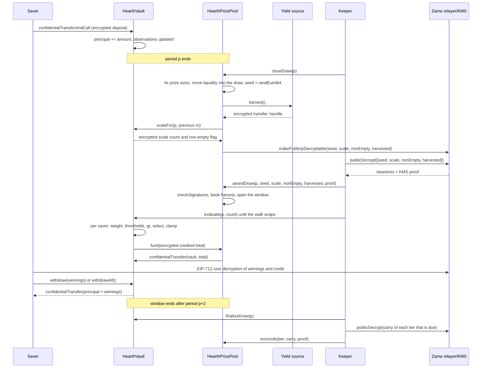

# Wie eine Ziehung abläuft

Eine Ziehung ist der Moment, in dem aus der Rendite des Pools Preise werden. Diese Seite
geht das Ganze in einfachen Worten durch und zeigt dieselbe Geschichte danach als
Diagramm.

## Perioden

Die Zeit ist in gleich lange Perioden von `L` Sekunden geschnitten. Periode 1 beginnt bei
`firstPeriodAt`, einem Zeitstempel, der beim Deployment festgelegt und danach nie geändert
wird. Von da an ist die Rechnung reine Division:

```
period(t)      = (t - firstPeriodAt) / L + 1
periodStart(p) = firstPeriodAt + (p - 1) * L
periodEnd(p)   = periodStart(p + 1)
```

Jeder Pool hat sein eigenes `L`. Auf Sepolia läuft der USDC-Pool mit einer Stunde und die
anderen sechs mit sechs Stunden, sodass ein Besucher einen ganzen Zyklus in einer Sitzung
sieht. Auf dem Mainnet würde ein echtes Deployment einen Tag nehmen, was PoolTogether V5
nutzt. Die Periode ist ein Konstruktor-Argument, derselbe Code bedient also alle drei, und
die Stufenchancen jedes Pools werden gegen seine eigene Periode gesetzt. Siehe
[Pools und Token](pools-and-tokens.md).

Ziehung `p` deckt Periode `p` ab. Sie wird ausschließlich von den Guthaben während Periode
`p` entschieden. Nichts, was nach dem Ende von Periode `p` geschieht, kann ihr Ergebnis
ändern.

## Das Fenster und die Frist für den Abschluss

Jeder Schritt der Ziehung `p` findet während der Perioden `p+1` und `p+2` statt. Das ist
das Fenster, und es endet bei `periodEnd(p + 2)`. Das sind zwei Stunden im USDC-Pool und
ein halber Tag in den anderen.

Der Abschluss hat eine engere Frist als der Rest des Fensters:

```
closeDeadline(p) = periodStart(p + 2) + L / 2
```

Das ist die Mitte der zweiten Periode des Fensters, drei Viertel durch das Fenster. Ein
Abschluss danach wird abgelehnt.

Der Grund ist, dass Abschluss und Zuteilung sich keinen Block teilen können. Der Abschluss
markiert Werte auf der Blockchain als entschlüsselbar, die Klartexte kommen außerhalb der
Blockchain vom Relayer von Zama zurück, und die Zuteilung prüft sie auf der Blockchain. Ein
Abschluss in den letzten Sekunden des Fensters ließe diesem Rundlauf keinen Platz zum
Landen, und die Ziehung bliebe für immer in `Closed` stecken. Die Frist garantiert
mindestens eine halbe Periode für den Rundlauf, die Zuteilung und jeden
Auswertungs-Batch.

Das Fenster begrenzt außerdem, wie weit zurück der Vault Guthaben erinnern muss, und genau
das macht drei gespeicherte Beobachtungen je Sparer ausreichend. Siehe
[zeitgewichtetes Guthaben](time-weighted-balance.md).

## Die fünf Schritte

Jeder Schritt ist erlaubnisfrei. Jeder kann jeden davon aufrufen, auch ein Sparer aus der
App. Der Keeper ist nur die Adresse, die üblicherweise zuerst da ist.

### 1. Abschließen

`closeDraw(p)`, sobald Periode `p` vorbei ist und vor `closeDeadline(p)`.

In dieser einen Transaktion passieren fünf Dinge, in dieser Reihenfolge:

- **Die Preisgrößen werden festgelegt.** Die Preisgröße jeder Stufe und die Liquidität,
  die sie für diese Ziehung stellt, werden aus dem Geld berechnet, das diese Stufe gerade
  jetzt hält, und diese Liquidität wandert in die Ziehung. Das geschieht, bevor der
  zufällige Seed existiert.
- **Der Seed wird gezogen.** `FHE.randEuint64()` läuft im Koprozessor von Zama, die Zahl
  existiert also nur als Chiffrat und niemand hat sie gesehen.
- **Der Vault meldet, wo das Gesamtgewicht der Periode liegt**, als eine kleine
  verschlüsselte Zahl plus ein verschlüsseltes Kennzeichen, ob überhaupt jemand ein
  Guthaben hielt. Nicht die Summe selbst, und noch nicht im Klartext. Siehe den nächsten
  Abschnitt.
- **Die Renditequelle wird geerntet**, als ein verschlüsselter Transfer an den Pool. Weist
  die Quelle zurück, gelingt der Abschluss trotzdem: Die Ernte wird als triviale
  verschlüsselte Null behandelt und ein `HarvestFailed`-Ereignis wird geworfen. Eine kaputte
  Renditequelle kann die Uhr nicht anhalten.
- **Vier Handles werden als öffentlich entschlüsselbar markiert:** der Seed, die Skalenzahl,
  das Nichtleer-Kennzeichen und die Ernte. Das ist ein Einbahn-Kennzeichen auf Zamas
  Zugriffsliste. Von diesem Moment an kann jeder den Relayer nach ihrem Klartext fragen,
  und das Kennzeichen lässt sich nicht zurücknehmen. Nichts sonst an einer Ziehung wird je
  so markiert.

Der Ziehungszustand wechselt auf `Closed`. Der Abschluss gelingt genau einmal, und deshalb
kann niemand den Seed neu würfeln.

Die Reihenfolge innerhalb der Transaktion ist der springende Punkt. Preisgrößen werden
festgelegt, bevor der Seed existiert, sodass niemand einen Seed auftauchen sehen,
ausrechnen kann, dass er gewonnen hat, und dann das Geld des Pools umschichten kann, damit
dieser Gewinn mehr wert ist.

### Was der Vault statt der Summe veröffentlicht

Das gesamte zeitgewichtete Guthaben des Pools für die Periode, geschrieben `W`, wird nie
veröffentlicht. Es genau zu veröffentlichen war das Design bis zum 3. September 2026, und
eine Prüfung hat es gebrochen: Mit öffentlichem `W` für zwei aufeinanderfolgende Perioden
und dem öffentlichen Zeitstempel der eigenen Ein- oder Auszahlung eines Sparers lässt sich
der genaue Betrag eines Sparers, der als Einziger in einer Periode Geld bewegt hat, durch
Rechnung wiederherstellen. Nicht eingegrenzt, wiederhergestellt. Das steht unter
[was privat bleibt](../security/what-stays-private.md).

Veröffentlicht wird jetzt die Größenklasse, in die `W` fällt: die kleinste Zweierpotenz bei
oder über `W`, geschrieben `M = 2^m`. Der Vault verfolgt sie unter Verschlüsselung. Bei
jedem Abschluss vergleicht er `W` mit den fünf Zweierpotenzen rund um das `m` der letzten
Ziehung, addiert die Ergebnisse zu einer kleinen verschlüsselten Zahl und markiert diese
Zahl als öffentlich entschlüsselbar. Der Pool ermittelt aus der geprüften Zahl das neue
`m`. Ein separater verschlüsselter Vergleich gegen 1 liefert das Nichtleer-Kennzeichen, das
sagt, ob überhaupt jemand ein Guthaben hielt.

Ein Beobachter erfährt also eine Sache je Ziehung: ob der Pool eine Zweierpotenz überquert
hat. Zwischen den Überquerungen erfährt er nichts Neues. Jede Ziehung läuft gegen `M` statt
gegen `W`, und das ist es, was die unten beschriebenen Preiszahlen so aufgehen lässt, wie
sie aufgehen.

### 2. Zuteilen

`awardDraw(p, seed, scaleCount, nonEmpty, harvested, proof)`.

Wer es aufruft, holt die vier Klartexte vom Relayer von Zama, der sie mit einer Signatur
des Schlüsselverwaltungsdienstes (KMS) zurückgibt, also der Gruppe von Parteien, die den
Entschlüsselungsschlüssel des Netzwerks hält. Der Vertrag prüft diese Signatur auf der
Blockchain mit `FHE.checkSignatures`, bevor er einer einzigen Zahl glaubt. Der Beweis ist
in fester Reihenfolge an die Handles gebunden, `[seed, scaleCount, nonEmpty, harvested]`,
sodass die vier Werte weder vertauscht noch gegen eine andere Ziehung wiedereingespielt
werden können.

Dann:

- Die geprüfte Ernte wird den Stufen nach ihren Anteilsgewichten gutgeschrieben. Das ist
  der einzige Weg, auf dem Preisgeld hereinkommt, und es landet in den Stufen statt in
  dieser Ziehung, wird also beim nächsten Abschluss angeboten. Der Pool verbucht nie einen
  Betrag, den die Renditequelle über sich selbst gemeldet hat.
- Sagt das Nichtleer-Kennzeichen, dass in Periode `p` niemand ein Guthaben hielt, wird die
  Ziehung als `Empty` markiert und die angebotene Liquidität geht direkt an die Stufen
  zurück.
- Andernfalls öffnet sich die Ziehung. Der Seed und die Größenklasse `M` sind jetzt
  öffentliche Zahlen.
- Ist das Fenster schon zu, wenn jemand zuteilt, wird die Ernte trotzdem gutgeschrieben,
  die angebotene Liquidität geht trotzdem an die Stufen zurück, und die Ziehung wird als
  `Skipped` markiert. Diese Periode zahlt keinen Preis, und weder Rendite noch Liquidität
  gehen verloren.

Die fünf Ziehungszustände sind `None`, `Closed`, `Awarded`, `Empty` und `Skipped`.

**Das ist der Moment, in dem die Gewinner feststehen.** Ab hier ist der Seed eine
öffentliche Zahl, die Größenklasse ist eine öffentliche Zahl, und das Gewicht jedes Sparers
für Periode `p` kann sich nicht mehr ändern. Die Schwellenwerte, die jeder Sparer
übertreffen muss, sind Rechnung auf öffentlichen Eingaben. Die Auswertung, als Nächstes,
entscheidet nichts. Sie schreibt ein Ergebnis auf, das bereits besteht.

### 3. Auswerten

`evaluate(p, count)` auf dem Vault, so oft wie nötig, solange das Fenster offen ist.

Der Aufrufer sagt, wie viele Sparer voranzuschreiten sind. Er sagt nicht, welche. Der Vault
läuft die Sparerliste ab einem Cursor je Ziehung ab, der bei `seed mod saverCount` beginnt
und in Listenreihenfolge weiterwandert, und erledigt bis zu `count` Sparer und höchstens
`4`, die verschlüsselte Arbeit benötigen. Sparer ohne Beobachtung bei oder vor Periode `p`
haben ein Gewicht von null und werden anhand ihrer Klartext-Zeitstempel ganz ohne
verschlüsselten Aufwand übersprungen.

Für jeden Sparer, den der Durchlauf erreicht, liest der Vault dessen verschlüsseltes
Gewicht für Periode `p`, führt den Gewinntest gegen die öffentlichen Schwellenwerte aus und
addiert das Ergebnis zu dessen verschlüsselten Gewinnen. Er speichert das verschlüsselte
Gewicht und die verschlüsselte Gutschrift dieses Sparers für die Ziehung, beide allein von
diesem Sparer lesbar, sodass die App "Sie haben X in Ziehung p gewonnen" anzeigen und ihn
den Vergleich prüfen lassen kann. Dann zieht er die verschlüsselte Gesamtgutschrift dieses
Batches beim Preispool ein.

Niemand wählt aus, wer ausgewertet wird oder in welcher Reihenfolge. Ein Sparer, der sein
eigenes Ergebnis will, treibt denselben Durchlauf voran, den alle anderen vorantreiben, das
Senden einer evaluate-Transaktion sagt also nichts darüber aus, ob Sie gewonnen haben. Der
Startpunkt wandert bei jeder Ziehung, weil er aus dem Seed dieser Ziehung stammt, keine
Adresse ist also dauerhaft die letzte in der Schlange.

`evaluate` weist eine Ziehung zurück, die `Empty` oder `Skipped` oder noch nicht zugeteilt
ist.

### 4. Finalisieren

`finalizeDraw(p)`, sobald das Fenster geschlossen ist.

Was jede Stufe angeboten und nicht ausgezahlt hat, wird in den verschlüsselten Übertrag
dieser Stufe eingefaltet. Der Übertrag ist eine laufende Summe, die verschlüsselt bleibt
und von Ziehung zu Ziehung mitreist. Er wird bei jedem Abschluss zur angebotenen Liquidität
dieser Stufe addiert, ungewonnenes Geld ist also sofort wieder im Spiel, obwohl seine Höhe
weiter geheim ist.

Das Finalisieren veröffentlicht außerdem das aktuelle Handle eines globalen
verschlüsselten Zählers für alles, was der Pool nicht finanzieren konnte. Mit geprüften
Ernten ist er immer null.

### 5. Abgleichen

`reconcile(tier, carry, proof)` auf dem Pool, eine Stufe nach der anderen, und nur wenn
diese Stufe fällig ist.

Jede Stufe gleicht in dem Takt ab, der beim Deployment als `reconcileEvery[t]` Ziehungen
festgelegt wurde. Auf Sepolia ist jede Stufe bei jeder Ziehung fällig. Ist eine Stufe
fällig, markiert `finalizeDraw` ihren Übertrag als öffentlich entschlüsselbar und wirft
`CarryPublished`. Jemand holt den Klartext, ruft `reconcile` mit dem KMS-Beweis auf, und
die geprüfte Zahl wird zurück in die Klartext-Liquidität dieser Stufe verbucht. Der Vault
zieht dieselbe Zahl vom Übertrag ab, der inzwischen gewachsen sein kann, und
`TierReconciled` wird geworfen.

Der Abgleich ist es, was die Preiszahl dieser Stufe öffentlich macht, denn der Übertrag ist
genau der Teil des Angebots, den niemand gewonnen hat. Bei einem Takt von eins wird die
Zahl jeder Stufe eine Ziehung nach der zugehörigen Ziehung öffentlich, und der gesamte Topf
jeder Stufe liegt wieder offen, wo die App ihn wachsen zeigen kann. Den Takt zu erhöhen
verbirgt die Zahl für so viele Ziehungen und verbirgt den wachsenden Topf gleich mit, was
der Handel ist, den [Preise und Stufen](prizes-and-tiers.md) darlegt. So oder so verpufft
nichts, und bei keinem Takt erfahren Sie, wer gewonnen hat.

## Was passiert, wenn ein Schritt nie landet

- **Der Abschluss landet nie.** Die Ziehung bleibt `None` und wird übersprungen. Ihre
  Liquidität wurde nie bewegt, sie bleibt also in den Stufen und wird bei der nächsten
  Ziehung angeboten. Die Ernte holt der nächste Abschluss ein.
- **Die Zuteilung landet nicht innerhalb des Fensters.** Eine späte Zuteilung verbucht die
  Ernte trotzdem, gibt die angebotene Liquidität trotzdem an die Stufen zurück und
  markiert die Ziehung als `Skipped`.
- **Niemand wertet aus.** Das gesamte Angebot jeder Stufe faltet sich beim Finalisieren in
  ihren Übertrag und kommt beim nächsten Abgleich zurück.

Nichts strandet und nichts geht verloren. Ein stehen gebliebener Keeper kostet den Pool
eine Ziehung, kein Geld. Siehe [die Keeper-Seite](../operations/keeper.md).

## Geld bewegt sich nie auf eine Meldung hin

Zwei Regeln machen die Buchhaltung schwer zu täuschen.

Rendite wird nie auf Vertrauen genommen. Die Quelle führt einen verschlüsselten Transfer an
den Pool aus, der Pool ist der Empfänger und damit auf diesem Chiffrat berechtigt, und erst
dann veröffentlicht der Pool ihn und verbucht den KMS-geprüften Klartext. Eine fehlerhafte
oder feindselige Renditequelle kann weniger senden, als sie behauptet; sie kann den Pool
nicht an Preisgeld glauben lassen, das nie ankam. Das zählt, weil Scheinliquidität für
Preise irgendwann aus jemandes Einlage gezahlt würde.

Auszahlungen werden gezogen, nicht geschoben. Nach jedem Auswertungs-Batch gewährt der
Vault dem Pool eine kurzlebige Erlaubnis über die verschlüsselte Batch-Summe, der Pool
gewährt dem Token dieselbe, und der Token bewegt genau diesen Betrag vom Pool zum Vault.
Kommt der Pool zu kurz, hält der Vault die Lücke im globalen verschlüsselten Zähler für
Nichtfinanziertes fest, der beim Finalisieren für jeden nachprüfbar veröffentlicht wird.
Mit geprüften Ernten ist dieser Zähler immer null.

## Die ganze Ziehung, von Anfang bis Ende



## Was diese Seite nicht abdeckt

Sie deckt nicht ab, wie sich das Gewicht eines Sparers über eine Periode aufbaut, das ist
[zeitgewichtetes Guthaben](time-weighted-balance.md), auch nicht die Rechnung des
Gewinntests, das ist [Gewinnerermittlung](winner-selection.md), und auch nicht, wie groß
jeder Preis ist, das ist [Preise und Stufen](prizes-and-tiers.md).
