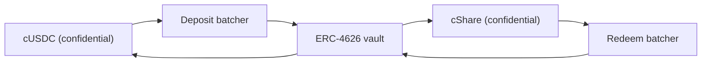

# Woher das Preisgeld kommt

Preise sind Rendite. Niemandes Einlage wird je als Preis ausgezahlt, und genau das macht
den Pool verlustfrei. Diese Seite behandelt die eine Schnittstelle, die jede Quelle
implementiert, die Quelle, die heute auf Sepolia läuft, warum der Pool einer Quelle nichts
aufs Wort glaubt, und wie sich Zamas eigener Confidential Vault auf dem Mainnet einklinkt.

## Die Schnittstelle

```solidity
interface IYieldSource {
    function harvest() external returns (euint64 transferred); // confidential transfer to the recipient
    function harvestable() external view returns (uint64);      // display only
}
```

Zwei Funktionen. `harvest` bewegt die aufgelaufene Rendite als vertraulichen Transfer zum
Preispool und gibt den verschlüsselten Betrag zurück, der tatsächlich geflossen ist.
`harvestable` ist für die Anzeige in der App, und der Pool nutzt es nie für die Buchhaltung.

`harvest` ist bewusst synchron. Es bewegt, was die Quelle in diesem Moment bereit hat, und
von einer Quelle, die asynchron verdient, wird erwartet, dass sie diesen Betrag vorab
bereitgelegt hat, statt den Pool warten zu lassen.

Die Quelle zu tauschen ist ein einziger Eigentümeraufruf auf dem Pool, `setYieldSource`,
und er wirft `YieldSourceSet`. Nichts sonst im System weiß oder kümmert sich darum, welche
Quelle angeschlossen ist.

Eine Quelle, die zurückweist, hält keine Ziehung auf. Der Pool fängt den Fehlschlag ab,
behandelt die Ernte dieser Ziehung als triviale verschlüsselte Null und wirft
`HarvestFailed`. Der Abschluss gelingt, die Ziehung läuft auf der Liquidität, die die
Stufen bereits halten, und die Rendite, die nicht floss, holt eine spätere Ernte ein. Eine
kaputte oder falsch verdrahtete Quelle hungert die Preisseite aus; die Uhr anhalten kann
sie nicht.

Landet eine Ernte, wird sie bei der Zuteilung dieser Ziehung verbucht und beim nächsten
Abschluss angeboten. Die Rendite der Periode `p` finanziert also die Preise der Ziehung
`p+1`, nicht die der Ziehung `p`. Das ist es, was es erlaubt, die Preisgrößen festzulegen,
bevor der Seed existiert.

## Sepolia: die gesponserte Quelle

`SponsoredYieldSource` ist das, was auf jedem Live-Pool läuft, je eine Instanz, die sieben
Quellen sind also sieben getrennte Guthaben von sieben verschiedenen Token. Die des
USDC-Pools liegt unter `0xCC49DF69eAB6884fD8DD9260902B8A0Abc9D6b91`; die anderen sechs
stehen unter [Pools und Token](pools-and-tokens.md).

Ein Sponsor ruft die eigene Funktion `sponsor` der Quelle mit dem öffentlichen Token des
Pools auf. Die Quelle wrappt ihn in den vertraulichen und verbucht genau das, was der
Wrapper geprägt hat, nicht das, was der Sponsor verlangt hat. Von da an tröpfelt das
Guthaben mit `ratePerSecond`, was im USDC-Pool
`5,555 base units a second, which is 19.998 USDC a period` sind,
und `harvest` schickt dem Pool, was aufgelaufen ist. Die Rate jedes Pools ist in ganzen
Token je Stunde gesetzt, damit sich zwei Pools auf verschiedenen Uhren auf einen Blick
vergleichen lassen, und jedes Sponsoring ist so bemessen, dass es mehr als achtzig
Ziehungen deckt.

Ein Sponsoring ist eine Spende. Es gibt keinen Weg für einen Sponsor, es zurückzuholen, und
nur der Eigentümer der Quelle kann die Tröpfelrate ändern, was `RateChanged` wirft.

Sponsorbeträge, die Tröpfelrate und jede Ernte sind öffentlich. Das ist kein Kompromiss:
Bei PoolTogether ist der Renditebetrag, den ein Vault beisteuert, ebenfalls öffentlich, und
jede Preisgröße folgt daraus. Vertraulich ist bei Hearth, wer wie viel gespart und wer
gewonnen hat, nie, wie viel Geld der Pool verdient hat.

Hat der Pool eine Weile keine Sparer, läuft die Rendite trotzdem auf und wird an die ersten
Ziehungen gezahlt, die Sparer haben. In einem leeren Pool strandet nichts.

### Warum überhaupt ein Mock

Weil eine Mock-Quelle nur dann ehrlich ist, wenn die Dokumentation sagt, wie sie
funktioniert und wie sich eine echte einklinkt, steht beides unten. Wir haben zuerst nach
einer echten gesucht, und es gibt auf Sepolia keine, die Rendite auf Zamas Mock-Token zahlt:

| Ort | Warum nicht |
| --- | --- |
| Aave | Lehnt USDC-Einzahlungen auf Sepolia ab, Angebotsobergrenze überschritten |
| Compound | Will Circles eigenes USDC, nicht Zamas Mock |
| Zamas Confidential Vault | Der Sepolia-Vault ist ein reiner Leerlauf-VaultV2 ohne Rendite-Adapter, so beschreibt Zama ihn selbst |

Die ehrlichen Möglichkeiten waren also eine erfundene Zahl, die steigt, oder ein vom
Sponsor finanziertes Guthaben, das wirklich auf der Blockchain existiert und wirklich
tröpfelt. Wir haben das zweite genommen. Jede Einheit Preisgeld auf jedem der sieben
Live-Pools wurde wirklich gewrappt, wirklich transferiert und wirklich geprüft.

## Der Pool verbucht nie eine gemeldete Zahl

Das ist die Regel, die verhindert, dass die gesponserte Quelle eine Schwachstelle ist.

Die Quelle führt einen verschlüsselten Transfer an den Pool aus. Der Pool ist als Empfänger
auf diesem Chiffrat berechtigt und kann den transferierten Betrag deshalb selbst als
öffentlich entschlüsselbar markieren. Erst zum Zeitpunkt der Zuteilung, nachdem
`FHE.checkSignatures` die Signatur des Schlüsselverwaltungsdienstes über den Klartext
geprüft hat, schreibt der Pool den Stufen etwas gut.

Eine Quelle, die über die gesendete Menge lügt, kommt nicht weit. Der Pool verbucht den
Betrag, der ankam, denn das ist der einzige Betrag, den er je ansieht.

Das ist keine theoretische Vorsicht. In unserem früheren Design verbuchte der Pool
Reserve-Aufstockungen aus dem Betrag, den der Aufrufer übergab, während der Wrapper
`amount / rate()` prägt. Im Live-Deployment war `rate()` zufällig 1, die beiden stimmten
also überein und der Fehler war latent. Bei einem Basiswert mit 18 Nachkommastellen, wo die
Rate des Wrappers eine Billion ist, hätte der Pool an eine Billion Mal mehr Preisgeld
geglaubt, als es gab. Wir haben das am 2. September 2026 gegen einen Testtoken mit 18
Nachkommastellen ausgeführt und zugesehen, wie es passierte. Scheinliquidität für Preise
wird in einem verlustfreien Pool irgendwann aus jemandes Einlage gezahlt, und das ist das
eine Versprechen, das das Produkt nicht brechen darf. Den Transfer zu prüfen räumt die
ganze Klasse aus.

## Mainnet: Zamas Confidential Vault

Zama liefert ein Protokoll, dessen ganze Aufgabe es ist, mit vertraulichen Guthaben Rendite
zu erwirtschaften, und es ist die natürliche Mainnet-Quelle.
`ConfidentialVaultYieldSource` ist der Adapter in diesem Entwurf. Was folgt, ist seine
Spezifikation, kein Vertrag in diesem Repository.

Es ist ein Adapter je Pool, wie alles hier, und jeder braucht einen Batcher und einen
Rendite-Vault für seinen eigenen Token. Zamas Mainnet-Deployment deckt heute USDC ab, ein
Mainnet-Hearth würde also den USDC-Pool auf dem Confidential Vault eröffnen und jeden
anderen Token auf der Quelle, die es dafür gibt, oder auf gar keiner.

Der Entwurf sieht einen Batcher zwischen vertraulichen Token und einem gewöhnlichen
ERC-4626-Rendite-Vault vor. Ein ERC-4626-Vault nimmt nur öffentliche Transfers an, ein
einzelner Einzahler würde also seinen genauen Betrag veröffentlichen. Der Batcher bündelt
stattdessen viele verschlüsselte Einzahlungen, entschlüsselt nur die Summe, macht eine
öffentliche Einzahlung in den Vault und gibt vertrauliche Anteile zurück. Zamas eigene
Formulierung: "Beobachter sehen, wer teilgenommen hat, aber nicht, wie viel jemand
beigesteuert hat."



Der Adapter verbindet den Einzahlungs-Batcher mit dem vertraulichen Token des Pools und
hält vertrauliche Anteile. Die Rücknahme läuft nach ihrem eigenen Zeitplan, vor der Ernte:
Der Keeper fragt den Rücknahme-Batcher regelmäßig nach dem Zuwachs und führt diese Anfrage
durch ihre vier Stufen, sodass das zurückgenommene vertrauliche USDC schon im Adapter
liegt, wenn der Pool das nächste Mal `harvest` aufruft, und die Ernte ein einzelner
Transfer ist wie jeder andere. So trifft ein asynchroner Ort auf eine synchrone
Schnittstelle. Jede der vier Stufen ist erlaubnisfrei, niemand muss also darauf warten,
dass Zamas Betreiber sie ausführt.

### Die Adressen

Aus Zamas eigener Adressreferenz, abgerufen am 2. September 2026.

**Ethereum Mainnet, Chain-ID 1.** Basiswert USDC. Renditequelle: Morphos
"Steakhouse Confidential Prime USDC" VaultV2, so abgeriegelt, dass der Einzahlungs-Batcher
der einzige Einzahler des Vaults ist.

| Vertrag | Adresse |
| --- | --- |
| Einzahlungs-Batcher | `0x324EA89FD3784036673BfE6Ffee2334A088F40Cc` |
| Rücknahme-Batcher | `0x96Cd3Faa7483783Ac2Eb715f6333361500F1eec9` |
| cUSDC-Wrapper | `0xe978F22157048E5DB8E5d07971376e86671672B2` |
| cShare-Wrapper | `0x66Bf74E96900D1a19c7070D939D124f2F565C458` |
| ERC-4626-Vault | `0xbEEF00A59B577423653A1526c7009bdE103F542B` |
| USDC | `0xA0b86991c6218b36c1d19D4a2e9Eb0cE3606eB48` |

**Sepolia, Chain-ID 11155111.** Eine Staging-Umgebung: Das USDC ist ein Mock mit
öffentlichem `mint` und der Vault ist reiner Leerlauf ohne Rendite-Adapter.

| Vertrag | Adresse |
| --- | --- |
| Einzahlungs-Batcher | `0x48758559c14d4d92b4C74A99660B6a8dbe85F53b` |
| Rücknahme-Batcher | `0xe94E9afdDd43a19C2914739e9279cb6Fe287BEb0` |
| cUSDC-Wrapper | `0x7c5BF43B851c1dff1a4feE8dB225b87f2C223639` |
| cShare-Wrapper | `0x7E93d5c150A2178B1fCde0278582Acf59478eA5f` |
| ERC-4626-Vault (Leerlauf) | `0x6AB54988261AEC573a2CA13cF802d3B1114f864C` |
| Mock USDC | `0x9b5Cd13b8eFbB58Dc25A05CF411D8056058aDFfF` |

Weil der Sepolia-Vault im Leerlauf ist, ist der Adapter hier gegen Zamas veröffentlichte
Batcher-Schnittstelle spezifiziert und noch nicht geschrieben. Zu sagen, er sei live,
während er nichts verdient, wäre eine Lüge, die jeder in einer Minute prüfen könnte.

### Was das Einklinken in der Praxis heißt

Der Batcher bewegt sich in vier Stufen: beitreten, versenden, abschließen, abholen. Ein
Batch wartet, bis er ein Mindestalter erreicht, dann wird seine Summe entschlüsselt, dann
rechnet der Vault ab, dann holen die Teilnehmer ab. Jede dieser Stufen ist erlaubnisfrei,
der Pool hängt also nie an Zamas Betreiber fest, und Abholungen verfallen nie.

Dieser Rhythmus ist langsamer als das sofortige Tröpfeln der gesponserten Quelle, weshalb
der Keeper die Rücknahme im Voraus laufen lässt statt innerhalb von `harvest`. Der Vertrag
des Pools wartet nie: Er fragt den Adapter nach dem, was bereits zurückgeholt wurde. Was an
echter Arbeit bleibt, um das live zu nehmen, ist der Adapter-Vertrag selbst, den dieses
Repository spezifiziert, aber nicht implementiert, und die Keeper-Seite davon, also die
Entscheidung, wie oft eine Rücknahme zu starten ist und wie viel der Position
zurückgenommen wird, was eine Richtlinienfrage ohne Folgen auf der Blockchain ist, wenn sie
spät kommt.

### Was Hearth erben würde

Das sauber zu benennen gehört dazu, wenn man dabei vertrauenswürdig sein will.

- **Vault-Risiko, in vollem Umfang.** Der Batcher leitet Geld in einen fremden
  ERC-4626-Vault weiter. Verliert dieser Vault an Wert, verliert das renditetragende
  Guthaben des Pools mit ihm. Das ist die eine Stelle, an der "kein Verlust" vom Vertrag
  eines anderen abhinge, und deshalb sollte ein Mainnet-Deployment dort nur den
  renditetragenden Anteil halten.
- **Batch-Vertraulichkeit, nicht Pool-Vertraulichkeit.** Der Batcher verbirgt Beträge
  zwischen Mit-Teilnehmern und entschlüsselt die Summe. Wäre Hearth der einzige Teilnehmer
  eines Batches, wäre sein Einzahlungsbetrag öffentlich. Das kostet uns nichts, weil
  Hearths Ernten ohnehin veröffentlicht werden, aber man sollte es wissen, bevor man
  annimmt, der Batcher verberge mehr, als er es tut.
- **Begrenzte Eigentümermacht.** Der Eigentümer des Batchers kann das Mindestalter eines
  Batches ändern (gedeckelt bei 7 Tagen), die Rückruffrist (gedeckelt bei 30 Tagen), die
  Slippage-Toleranz bei Einzahlungen, und er kann Beitritte und Versendungen pausieren.
  Zamas Dokumentation stellt fest, dass der Eigentümer Nutzergelder weder bewegen noch
  einfrieren kann, kein Ergebnis zensieren kann, niemandes Beträge entschlüsseln kann und
  den Vertrag nicht upgraden kann. Der Slippage-Schutz bei Rücknahmen ist fest
  ausgeschaltet, damit Ausstiege auch während eines Vault-Einbruchs funktionieren.

## Was diese Seite nicht abdeckt

Sie deckt nicht die Wirkung der Renditequelle auf die Lecktabelle ab, die steht unter
[was privat bleibt](../security/what-stays-private.md). Sie vergleicht nicht die Rendite
des Morpho-Vaults, das ist die Zahl eines anderen und sie ändert sich täglich. Und sie
behauptet nicht, dass der Adapter läuft: Auf Sepolia ist die gesponserte Quelle
angeschlossen, und die Karte "Der Pool gerade jetzt" auf dem Dashboard benennt sie.
