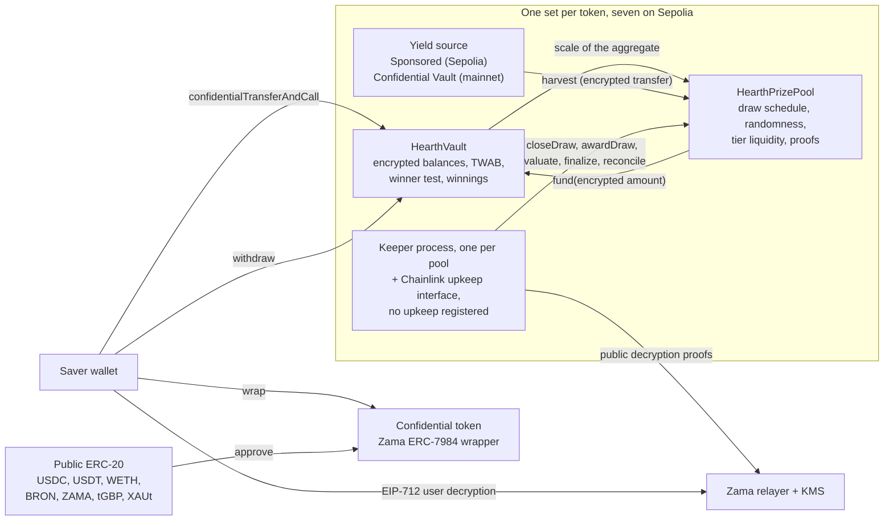

# Was Hearth ist

Hearth ist ein Sparpool, in dem Sie Ihr Geld nicht verlieren können und einen Preis
gewinnen könnten. Sieben davon laufen auf Sepolia, einer je vertraulichem Token, und Sie
wählen einen Token so aus, wie Sie ein Sparkonto auswählen würden.

Sie zahlen einen vertraulichen Token ein: USDC, USDT, WETH, BRON, ZAMA, tGBP oder XAUt.
Der Pool legt dieses Geld an und erwirtschaftet Rendite. In jeder
Periode wird die erwirtschaftete Rendite als Preise ausgeschüttet, und Ihre Gewinnchance
richtet sich danach, wie viel Sie gehalten haben und wie lange. Ihre Einlage bekommen Sie
jederzeit vollständig zurück. Das ist die Idee der verlustfreien Lotterie, die
PoolTogether erfunden hat, und Hearth ist die vertrauliche Fassung davon.

Der Unterschied zu PoolTogether: Auf einer gewöhnlichen Blockchain ist alles öffentlich.
Jeder kann nachlesen, wie viel jeder Sparer hat, wie die Chancen jeder Wallet stehen und
wer jede Ziehung gewonnen hat. Das veröffentlicht das Vermögen der Leute und malt jedem
Großen eine Zielscheibe auf den Rücken. Hearth rechnet die ganze Sache über verschlüsselte
Zahlen mit dem Zama Protocol, sodass die Blockchain Ihr Guthaben als Chiffrat hält (Daten,
die ohne Schlüssel unlesbar sind) und der Vertrag trotzdem damit rechnet. Ihr Guthaben ist
eine Zahl, die niemand je gesehen hat, wir eingeschlossen, und die Ziehung bleibt für
Fremde nachprüfbar.

## Das System in einem Bild

Zwei Verträge erledigen die Arbeit. `HearthVault` hält die verschlüsselte Einlage jedes
Sparers, seine verschlüsselten Gewinne, die Aufzeichnung darüber, wie lange er was
gehalten hat, und führt den Gewinntest aus. `HearthPrizePool` führt die Uhr, zieht den
zufälligen Seed, sammelt die Rendite ein und hält das Preisgeld in Stufen. Ein
Keeper-Prozess schiebt die Ziehung voran, und jeden seiner Schritte kann stattdessen auch
jeder andere ausführen.

Der Kasten in der Mitte ist der Pool eines Tokens. Es gibt sieben davon und sie teilen
sich nichts: Ihre USDC-Position und Ihre WETH-Position sind getrennte Sparer in getrennten
Vaults, und wenn ein Pool stillsteht, laufen die übrigen weiter. Welchen Pool Sie gerade
ansehen, steht ganz vorn in der Adresszeile, `/app/usdc` oder `/app/weth`. Die vollständige
Liste mit Adressen finden Sie unter [Pools und Token](../concepts/pools-and-tokens.md).

## Die vier Schritte

Ein Sparer macht vier Schritte. Hier steht, was jeder davon tut und was er preisgibt.

### 1. Einzahlen

Sie schicken den vertraulichen Token dieses Pools mit einer Transaktion an seinen Vault.
Der Betrag reist als
Chiffrat-Handle, also als Zeiger auf einen verschlüsselten Wert statt als Wert selbst. Der
Vault addiert ihn zu Ihrer verschlüsselten Einlage und aktualisiert die Aufzeichnung Ihres
Guthabens über die Zeit, ohne irgendetwas zu entschlüsseln.

- Verborgen: der Betrag, Ihr laufendes Guthaben und damit Ihr Anteil am Pool.
- Öffentlich: Ihre Adresse, der Block, in dem Sie es getan haben, und die Tatsache, dass
  eine Einzahlung stattfand.

Es gibt eine Naht. Den gewöhnlichen öffentlichen Token in den vertraulichen zu verwandeln
ist ein öffentlicher ERC-20-Transfer, der gewrappte Betrag ist also sichtbar. Wenn Sie
5.000 USDC wrappen und zwei Blöcke später einzahlen, hat ein Beobachter eine sehr gute
Vermutung. Hearth hält Wrappen und Einzahlen genau deshalb als zwei getrennte Schritte
auseinander, damit Sie Abstand dazwischen legen können. Siehe
[die Wrapping-Naht](../security/what-stays-private.md).

### 2. Ziehung

Am Ende jeder Periode schließt der Pool die Ziehung dieser Periode ab. In einer
Transaktion legt er die Preisgröße jeder Stufe fest, zieht dann einen verschlüsselten
Zufalls-Seed im Koprozessor von Zama, fragt dann den Vault, wie groß der Pool war, und
sammelt dann die Rendite der Periode ein. Die Reihenfolge ist entscheidend: Die Preise
werden bemessen, bevor die Zufallszahl existiert, sodass niemand erst einen Seed sehen und
dann umsortieren kann, was ein Gewinn wert ist.

"Wie groß der Pool war" ist absichtlich unscharf, und das ist Design. Der Vault
veröffentlicht nicht das gesamte zeitgewichtete Guthaben aller Sparer zusammen. Er
veröffentlicht nur die Zweierpotenz-Größenklasse, in die diese Summe fällt. Die Welt
erfährt also ungefähr die Größe des Pools statt seiner genauen Größe. Die exakte Zahl zu
veröffentlichen würde es jemandem erlauben, zwei aufeinanderfolgende Ziehungen voneinander
abzuziehen und aus der Differenz die Einzahlung eines einzelnen Sparers abzulesen.

Vier kleine Werte gehen dann mit einem Beweis hinaus, der vom
Schlüsselverwaltungsdienst von Zama signiert ist, sodass jeder sie prüfen kann: der Seed,
die Größenklasse, ob überhaupt jemand im Pool war, und die eingesammelte Rendite. Das
Ergebnis jedes Sparers für diese Ziehung steht in dem Moment fest, in dem diese Zahlen
geprüft sind.

- Verborgen: das Gewicht jedes einzelnen Sparers, die genaue Summe des Pools und jedes
  einzelne Ergebnis.
- Öffentlich: der Seed, die Größenklasse, die eingesammelte Rendite, die Preisgröße jeder
  Stufe, und, eine Ziehung später beim Abgleich der Stufe, wie viele Preise sie ausgezahlt
  hat.

### 3. Einlösen

Es gibt keine Einlöse-Transaktion, und genau darum geht es. Die App hat durchaus einen
Einlöse-Button, auf der Karte dieser Ziehung unter "Meine Ziehungen", und er trägt den
Betrag: Er ist eine gewöhnliche Abhebung der gerade aufgedeckten Gewinne, und auf der
Blockchain sieht er aus wie jede andere Abhebung.

Gewinne werden während der Auswertung einem getrennten verschlüsselten Guthaben im Vault
gutgeschrieben. Nichts, was Sie tun, löst das aus, und nichts, was Sie tun, deckt es auf.
Um zu erfahren, ob Sie gewonnen haben, signieren Sie eine EIP-712-Nachricht, eine
typisierte Signatur außerhalb der Blockchain, die beweist, dass Sie Ihre Adresse
kontrollieren, und der Relayer von Zama liefert den Klartext Ihrer eigenen Gewinne an
Ihren Browser. Diese Signatur berührt die Blockchain nie, kostet also nichts und
hinterlässt keine Spur. Ihr Guthaben im Dashboard und das Ergebnis einer Ziehung haben
jeweils ihr eigenes Auge, beide können gleichzeitig offen sein, und die Signatur des
ersten gilt auch für das zweite.

- Verborgen: alles. Die eigenen Gewinne zu lesen ist ein Vorgang außerhalb der Blockchain.
- Öffentlich: nichts.

In den meisten Preisprotokollen muss der Gewinner eine Einlöse-Transaktion senden und der
Verlierer hat keinen Grund dazu, sodass die Transaktionsliste stillschweigend die Gewinner
benennt. Bei Hearth gibt es keine solche Transaktion zu senden. Die Transaktion, die
Preise gutschreibt, `evaluate`, lässt sich nicht auf einen selbst richten: Sie läuft die
Sparerliste ab einem Punkt ab, den der Seed der Ziehung bestimmt, und der Aufrufer sagt
nur, wie weit sie voranschreiten soll.

### 4. Abheben

Eine Funktion holt Geld heraus: `withdraw`. Sie zahlt zuerst aus Ihren Gewinnen, dann aus
Ihrer Einlage, und begrenzt auf den kleineren Wert von dem, was Sie halten, und dem, was
der Vault hält. Ob Sie einen Preis abholen, Ihre Ersparnisse nach Hause tragen oder beides
auf einmal: Es ist derselbe Aufruf mit derselben Form, demselben Ereignis und einem
verschlüsselten Betrag.

Die zweite Hälfte dieser Begrenzung gibt es, weil ein vertraulicher Transfer den ganzen
Betrag oder gar nichts bewegt. Er schickt nie einen Teil dessen, was verlangt wurde. Also
rechnet der Vault aus, was er tatsächlich zahlen kann, bevor er den Token um die Zahlung
bittet, statt hinterher eine Lücke zu flicken.

- Verborgen: der Betrag, und ob etwas davon Preisgeld war.
- Öffentlich: Ihre Adresse, der Block, und die Tatsache, dass eine Abhebung stattfand.

Ihre Einlage ist nie gesperrt. Einzahlungen und Abhebungen bleiben während einer laufenden
Ziehung offen, was auf einige andere Entwürfe in diesem Feld nicht zutrifft.

## Was das Ganze fair macht

Zwei Dinge, und beide sind für einen Fremden ohne besonderen Zugang nachprüfbar.

Der zufällige Seed stammt aus `FHE.randEuint64`, erzeugt im Koprozessor von Zama aus einem
öffentlichen Ausgangswert unter dem FHE-Schlüssel des Netzwerks. Niemand kann ihn
vorhersagen und niemand kann ihn zweimal ziehen: Das Abschließen einer Ziehung gelingt
genau einmal. Ist die Periode vorbei, veröffentlicht der Pool diesen Seed zusammen mit der
Größenklasse, in die die Summe des Pools fiel, beide mit einem Beweis, den der Vertrag auf
der Blockchain prüft.

Aus diesen zwei öffentlichen Zahlen kann jeder den genauen Schwellenwert nachrechnen, den
eine beliebige Adresse in einer beliebigen Stufe übertreffen musste, und der Vault stellt
dieselbe Rechnung als View bereit, sodass niemand einer Nachimplementierung vertrauen
muss. Was niemand kann, ist das verschlüsselte Gewicht sehen, gegen das verglichen wurde.
Die Regel ist also öffentlich und prüfbar, und nur die Eingabe ist privat. Einzelheiten
unter [Zufall und Nachprüfbarkeit](../security/randomness-and-verification.md).

## Was Hearth nicht verbirgt

Die Kurzfassung, ausführlich unter [was privat bleibt](../security/what-stays-private.md):

- Wer die Sparer sind, und wann jeder von ihnen eingezahlt, abgehoben oder ausgewertet
  wurde.
- Die Größenklasse, in die die Summe des Pools in jeder Periode fiel, der Seed und die
  eingesammelte Rendite.
- Die Preisgröße jeder Stufe, und wie viele Preise sie ausgezahlt hat, eine Ziehung
  später veröffentlicht.
- Den Betrag, den Sie in den vertraulichen Token hinein oder aus ihm heraus gewrappt
  haben.
- Bei einem einzigen Sparer ist die veröffentlichte Größenklasse das Gewicht dieses
  Sparers auf den Faktor zwei genau. Bei zweien kann jeder den anderen eingrenzen.
  Privatsphäre braucht hier drei oder mehr Sparer, und die App sagt das.
- Schwellenwerte sind öffentlich, also kann jeder, der Ihr Guthaben festnageln kann, Ihr
  Ergebnis in jeder Ziehung berechnen. Das passiert üblicherweise, indem jemand denselben
  Betrag wrappt und Minuten später einzahlt, weshalb die App die beiden Schritte
  auseinanderhält.
- Vollständig hinein zu wrappen und wieder heraus veröffentlicht eine Untergrenze für
  alles, was Sie je gewonnen haben, weil beide Bewegungen auf der Token-Ebene öffentlich
  sind.
- Ein Sparer, der nach jeder gewonnenen Ziehung sofort abhebt, verrät durch sein eigenes
  Verhalten einen statistischen Hinweis. Diesen kann kein Vertrag beheben.
