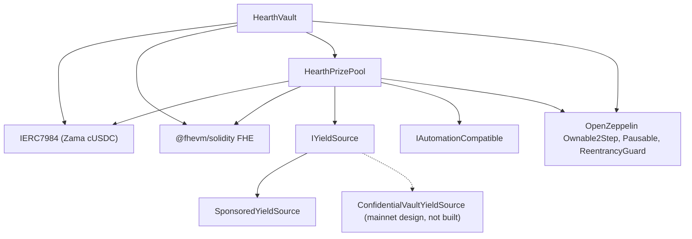

# Deployment

Ein wiederholbares Skript, nie manuelles Klicken. Diese Seite ist die Reihenfolge, die
Parameter und was jeder davon bedeutet, damit ein Prüfer die ausgerollten
Konstruktor-Argumente lesen und wissen kann, dass sie passen.

Hearth rollt einen Pool je vertraulichem Token aus: einen Vault, einen Preispool und eine
Renditequelle je Token, die mit keinem anderen Pool etwas teilen. Ein Lauf eröffnet einen
Pool, denn eine Deployer-Nonce führt ein Deployment aus, und der Token wird mit
`HEARTH_TOKEN` gewählt. Jede Task danach nimmt `--token`:

```
cd packages/contracts
HEARTH_TOKEN=weth npx hardhat deploy --network sepolia
npx hardhat hearth:verify  --network sepolia --token weth
npx hardhat hearth:seed    --network sepolia --token weth
npx hardhat hearth:status  --network sepolia --token weth
```

Lassen Sie beides weg, bekommen Sie `usdc`, den Standardtoken des Netzwerks. Ein unbekanntes
Kürzel scheitert mit der Liste der Pools, die dieses Netzwerk hat. Die Parameter jedes Pools
liegen in einer Datei, `packages/contracts/hearth.config.ts`: das Wertpaar, die Periode, der
Stufensatz, die Anfangsgrößenklasse, die Tröpfelrate, das Sponsoring, die fünf Demo-Einsätze
und der Konto-Index, aus dem sein Keeper signiert. Lesen Sie diese Datei neben den Tabellen
unten; es sind dieselben Zahlen.

Das Deployment verwendet jeden Vertrag wieder, der bereits eine gespeicherte Ausrollung hat,
statt ihn zu ersetzen, ein zweiter Lauf bewirkt also nichts. Ein Live-Pool, der Geld von
Sparern und Tage an Ziehungshistorie hält, kann durch erneutes Ausführen des Skripts nie auf
eine frische Adresse wandern. Um einen absichtlich zu ersetzen, löschen Sie zuerst seine
Datei unter `deployments/<network>/`.

Es schreibt `deployments/sepolia/hearth.<slug>.json`, worauf ein Keeper mit
`HEARTH_ADDRESSES_FILE` gerichtet wird und woraus die Poolliste der App erzeugt wird.

## Was wovon abhängt



Durchgezogene Kanten sind Verträge in diesem Repository. Der gestrichelte Knoten ist der
Mainnet-Renditepfad: Der Adapter ist gegen Zamas veröffentlichte Batcher-Schnittstelle
spezifiziert und hier ist kein Adapter-Vertrag geschrieben, unten wird also nur
`SponsoredYieldSource` ausgerollt.

Der Vault und der Pool brauchen einander, eine der beiden Verbindungen wird deshalb nach dem
Ausrollen hergestellt statt in einem Konstruktor. Deshalb gibt es unten fünf Schritte und
nicht drei.

## Die Reihenfolge

| Schritt | Aktion | Warum hier |
| --- | --- | --- |
| 1 | `HearthVault` ausrollen | Er hält das Geld der Sparer und braucht nichts außer dem Token. |
| 2 | `HearthPrizePool` ausrollen, auf den Vault zeigend | Der Pool liest die Uhr des Vaults und seine Skalenzahl und zahlt an den Vault. |
| 3 | Verdrahten: `vault.setPrizePool(pool)` | Wirft `PrizePoolSet`. Der Vault nimmt Finanzierung nur von dieser Adresse an. |
| 4 | Die Renditequelle ausrollen, mit dem Pool als Empfänger | Sie muss wissen, wohin sie Ernten schickt. |
| 5 | Verdrahten: `pool.setYieldSource(source)` | Wirft `YieldSourceSet`. Bis das landet, erntet ein Abschluss nichts und wirft `HarvestFailed`. |

Nach Schritt 5 den Pool bestücken: `hearth:seed --token <slug>` sponsert die Renditequelle,
damit es Preise gibt, und setzt fünf Demo-Sparer verschiedener Größe aus den Konten 2 bis 6
hinein, damit ein Erstbesucher auf einem belebten statt auf einem leeren Pool landet. Jeder
Schritt davon prüft auf der Blockchain, was bereits erledigt ist, ein von einem
Relayer-Schluckauf unterbrochenes Bestücken lässt sich also gefahrlos erneut ausführen.

Der Keeper dieses Pools braucht ebenfalls sein eigenes Sepolia-ETH, und die fünf Demo-Sparer
auch:

```
npx hardhat hearth:spread-gas --network sepolia --token weth
npx hardhat hearth:spread-gas --network sepolia --keepers 10,11,12,13,14,15 --savers false
```

Das erste finanziert den Keeper eines Pools und die Sparer; das zweite finanziert mehrere
Keeper-Konten in einem Durchgang, was es braucht, um sechs Pools auf einmal zu eröffnen.

Dann die App auf das Ausgerollte richten:

```
cd ../web
node scripts/sync-pools.mjs
```

## Die Parameter

```
HearthVault(IERC7984 asset, uint256 periodLength, uint256 firstPeriodAt, address owner)
HearthPrizePool(IHearthVault vault, IERC7984 asset, Tier[3] tiers, uint8 initialScaleBits, address owner)
    Tier = { uint32 prizeCount; uint64 oddsNumerator; uint64 oddsDenominator; uint16 shares; uint16 reconcileEvery }
SponsoredYieldSource(IERC7984ERC20Wrapper asset, address recipient, uint64 ratePerSecond, address owner)
```

### HearthVault

| Parameter | Bedeutung | Wenn man es falsch setzt |
| --- | --- | --- |
| `asset` | Der vertrauliche ERC-7984-Token, den Sparer einzahlen, einer von Zamas sieben. | Jeder Wrapper meldet sechs Nachkommastellen, und das Deployment bricht ab, wenn die Blockchain der Konfiguration widerspricht. Die Rate zum öffentlichen Token darunter ist nicht in jedem Pool 1: Beim WETH-Mock mit 18 Nachkommastellen ist sie eine Billion, alles, was den öffentlichen Token liest, muss sie also anwenden. |
| `periodLength` (`L`) | Sekunden einer Periode. Unveränderlich. | Setzt auch die Obergrenze je Sparer, `(2^64 - 1) / L`. Ein zu kleines `L` und die Obergrenze ist riesig, aber die Ziehungen sind unruhig; ein zu großes und die Obergrenze wird eng. |
| `firstPeriodAt` | Zeitstempel, zu dem Periode 1 beginnt. Unveränderlich und muss bei oder vor dem Ausrollen liegen. | Ein Wert in der Zukunft macht `period(now)` undefiniert, bis er erreicht ist. |
| `owner` | Zweistufiger Eigentümer. Verzicht ist deaktiviert. | Die Befugnisse stehen im [Bedrohungsmodell](../security/threat-model.md). |

`maxPrincipal` wird aus `periodLength` abgeleitet, nicht gesetzt. Bei einer Stunde sind es
etwa 5 Milliarden Token, bei sechs Stunden etwa 854 Millionen und bei einem Tag etwa 213
Millionen.

Der Vault führt die Uhr. Der Pool nimmt die Vault-Adresse und liest die Perioden von ihm, es
gibt also keine Möglichkeit, dass die beiden Verträge sich über die laufende Periode uneinig
sind.

### HearthPrizePool

| Parameter | Bedeutung |
| --- | --- |
| `vault` | Der Vault, den dieser Pool bedient, und die Uhr, die er liest. |
| `asset` | Derselbe vertrauliche Token, den der Vault nutzt. Sie müssen übereinstimmen. |
| `prizeCount[t]` | Preise je Ziehung in Stufe `t`. |
| `oddsNumerator[t]`, `oddsDenominator[t]` | Die Chancen der Stufe als Bruch, eine Ziehung in `oddsDenominator / oddsNumerator`. |
| `shares[t]` | Der Anteil der Stufe an jeder Ernte. Anteile sind relativ, 40/20/40 und 2/1/2 bedeuten also dasselbe. |
| `reconcileEvery[t]` | Wie viele Ziehungen zwischen den Veröffentlichungen des Übertrags dieser Stufe liegen. |
| `initialScaleBits` | Die erwartete Bitlänge des Gesamtgewichts der ersten Periode, die Startvermutung für den Größenklassen-Verfolger. |
| `owner` | Wie oben. |

`UTILISATION` ist eine Konstante statt eines Arguments: 50 Prozent, nach PoolTogether V5. Es
ist der Anteil der Klartext-Liquidität einer Stufe, aus dem jeder Preis bemessen wird.

Zwei davon verdienen ein Wort.

`reconcileEvery` ist eine Datenschutz-Einstellung, keine Gas-Einstellung, und sie steht im
Handel mit dem Aussehen des Preistopfs. Den Übertrag einer Stufe zu veröffentlichen macht die
Preiszahl dieser Stufe öffentlich, und eine Zahl über eine Ziehung zeigt auf die kleine Menge
der in dieser Ziehung berechtigten Sparer. Höher zu setzen verteilt die Zahl über eine Spanne,
in der fast jeder irgendwann berechtigt war. Was das kostet, ist der sichtbare Jackpot: Ein
Abschluss holt die gesamte öffentliche Liquidität einer Stufe in die Ziehung und sie kommt
erst bei einem Abgleich zurück, eine Stufe mit einem Takt von 24 veröffentlicht also in 23 von
24 Ziehungen einen Preis, der aus dem Ernteanteil einer Ziehung bemessen ist, wobei der
angesammelte Topf offen nur bei der Abgleichziehung erscheint. Das Geld ist die ganze Zeit
angeboten und zu gewinnen, im verschlüsselten Übertrag; es ist nur unsichtbar. Sepolia lässt
aus diesem Grund alle drei Stufen auf 1 laufen und erklärt die Zahl je Ziehung zum Rest. Siehe
Grenze 14.

`initialScaleBits` muss nur nahe dran sein. Der Verfolger vergleicht die echte Summe bei jedem
Abschluss mit fünf Zweierpotenzen rund um die aktuelle Vermutung und korrigiert sich um bis zu
drei Bit je Ziehung, eine Vermutung, die ein paar Bit danebenliegt, kostet also ein bis zwei
Ziehungen mit leicht falsch skalierten Chancen und pendelt sich dann ein.

### SponsoredYieldSource

| Parameter | Bedeutung |
| --- | --- |
| `asset` | Der ERC-7984-Wrapper, den sie hält und sendet. Der öffentliche Token, in dem Sponsoren zahlen, ist der Basiswert des Wrappers, also kein eigenes Argument. |
| `recipient` | Der Preispool, der Ernten erhält. |
| `ratePerSecond` | Wie schnell das gesponserte Guthaben als Rendite auströpfelt. |
| `owner` | Setzt die Rate, wirft `RateChanged`. |

Das Sponsern ist ein eigener Aufruf nach dem Ausrollen, kein Konstruktor-Argument. Es
verbucht genau das, was der Wrapper geprägt hat, statt dessen, was der Sponsor verlangt hat,
und es lässt sich nicht rückgängig machen.

## Drei Parametersätze

Sepolia fährt zwei davon, weil die Pools auf zwei Uhren laufen.

| Einstellung | Sepolia `usdc` | Sepolia, die anderen sechs | Mainnet, Kandidat |
| --- | --- | --- | --- |
| Periodenlänge | 1 Stunde | 6 Stunden | 1 Tag |
| Fenster | 2 Stunden (zwei Perioden) | 12 Stunden | 2 Tage |
| Abschlussfrist | 1 Stunde 30 Minuten nach Ende der Periode | 9 Stunden danach | 1 Tag 12 Stunden danach |
| Obergrenze je Sparer | Etwa 5 Milliarden Token | Etwa 854 Millionen | Etwa 213 Millionen |
| Hauptpreis-Stufe | Anzahl 1, Chance 1/24, Anteile 40, Abgleich jede Ziehung | Anzahl 1, Chance 1/4, Anteile 40, Abgleich jede Ziehung | Anzahl 1, Chance 1/30, Anteile 50, Abgleich jede Ziehung |
| Mittlere Stufe | Anzahl 1, Chance 1/6, Anteile 20, Abgleich jede Ziehung | Anzahl 1, Chance 1/2, Anteile 20, Abgleich jede Ziehung | Anzahl 1, Chance 1/7, Anteile 25, Abgleich jede Ziehung |
| Häufige Stufe | Anzahl 4, Chance 1, Anteile 40, Abgleich jede Ziehung | Anzahl 4, Chance 1, Anteile 40, Abgleich jede Ziehung | Anzahl 4, Chance 1, Anteile 25, Abgleich jede Ziehung |
| Auslastung | 50 Prozent | 50 Prozent | 50 Prozent |
| Renditequelle | `SponsoredYieldSource` | `SponsoredYieldSource` | `ConfidentialVaultYieldSource` über Zamas Batcher |
| Hauptpreis fällt | Etwa einmal am Tag | Etwa einmal am Tag | Durch die gewählten Chancen bestimmt |

Die Sepolia-Zahlen gibt es, damit ein Besucher in einer Sitzung einen vollen Zyklus sieht:
vier kleine Preise in jeder Ziehung und ein Hauptpreis etwa täglich auf beiden Uhren. Sie sind
nicht das, was ein echtes Deployment nehmen würde.

Warum zwei Uhren. Eine Ziehung bei fünf Sparern kostet `8,456,388` Gas, sieben stündlich
ziehende Pools würden auf Sepolia also etwa `1.43 ETH` am Tag ausgeben, womit öffentliche
Faucets nicht mithalten können. Sechs Stunden senken das auf vier Ziehungen am Tag je Pool,
etwa `0.41 ETH` am Tag für alle sieben. Die Chancen werden gegen die eigene Periode jedes
Pools gesetzt statt übernommen, deshalb liest die mittlere Spalte 1/4 und 1/2, wo die erste
1/24 und 1/6 liest, und deshalb fällt der Hauptpreis in beiden etwa einmal am Tag. Der
USDC-Pool behielt seine stündliche Uhr, weil er zuerst ausgerollt wurde und seine
Ziehungshistorie darunter abgelegt ist.

Die Mainnet-Spalte ist ein Kandidat, kein Deployment. Die Regel zum Ausfüllen ist dieselbe,
die die Sepolia-Spalte ergeben hat: Wählen Sie, wie viele Ziehungen zwischen Hauptpreisen
liegen sollen, und setzen Sie die Chancen der Hauptpreis-Stufe auf eins durch diese Zahl,
setzen Sie dann die Anteile so, dass sich die entstehenden Preisgrößen gegen die Rendite, die
die Quelle wirklich verdient, sinnvoll lesen, und entscheiden Sie dann den Abgleichtakt jeder
Stufe, indem Sie eine Preiszahl, die niemanden benennt, gegen einen Topf abwägen, dem Sparer
beim Wachsen zusehen können. Sepolia hat das Zweite genommen; ein Mainnet-Deployment nimmt
vielleicht das Erste, und der Absatz oben sagt, was jede Seite kostet. Eine Tagesperiode
mit Hauptpreis-Chancen von 1 zu 365 ergibt einen Jahres-Hauptpreis, was die Form ist, die V5
nutzt.

## Ausgerollte Adressen

Sieben Pools auf Sepolia, jeder Vertrag auf Etherscan verifiziert. Das Tokenpaar, das jeder
hält, ist Zamas und steht unter [Pools und Token](../concepts/pools-and-tokens.md), zusammen
mit den bestückten Einsätzen und der Tröpfelrate je Pool.

| Pool | HearthVault | HearthPrizePool | SponsoredYieldSource | Ausgerollt in Block |
| --- | --- | --- | --- | --- |
| `usdc` | `0x0F93e5db6027b4FB1C76566d24aA2D2E417fAF52` | `0xA0785AacF30B6FE46EDc53CD8A9db1d94FeF5Df2` | `0xCC49DF69eAB6884fD8DD9260902B8A0Abc9D6b91` | `11622398` |
| `usdt` | `0xe54F44dE64F8A7abc0647eaae547dD59ce0EFfac` | `0x6a83Beb2Dc3f258107Cad5e17BC57657fAd4fbd1` | `0x5bb1Cd5380Cb9f2B15569030fF0dB7a445cF54cA` | `11641314` |
| `weth` | `0x3D1A182782B68fE270A66294C9adaC7F005c4f14` | `0x1a11e7C689F244fA8Dd5f4abA8F2F3131090cc1C` | `0x40DF298f15c6136294eC651aD7b0c1C6F221DE8F` | `11641366` |
| `bron` | `0x18086DC8271f8A73c5Ea985fd519527Dbb991279` | `0x2Ed982979CD184494B947a1E38E597494a38ACe4` | `0x0cD1155D752bD81b3a437a6f0B3965CAA2A1C8e9` | `11641408` |
| `zama` | `0xEEC26386F273c6678cA538AcA18e1d9384eA9F09` | `0x873B285404199D46325a294Aa0EC7a79C30A7fF7` | `0xdD352D70311E834ab75307f53d5C276060081d23` | `11641447` |
| `tgbp` | `0xCe95dAa01f5354aA8887A5952E403D26d452c323` | `0xC531D54ee2c695e0eBfe8b8258e9Fd80fd507095` | `0xDEa2BD6351072F735B6ea83c357bF157d83c01af` | `11641484` |
| `xaut` | `0x77f701101d66FbD522A3bFdC2c00DB09a4F57daE` | `0x9a2888aca42c707A3BC0D561FdF6ff8Abfda5201` | `0x03fDdAA7C4323C53CE511CC49D4c33B26B492af7` | `11641523` |

Beginn der ersten Periode: `1788386400 (2 September 2026, 22:00:00 UTC)` für `usdc`,
`1788620400 (5 September 2026, 15:00:00 UTC)` für `usdt` und
`1788624000 (5 September 2026, 16:00:00 UTC)` für die übrigen fünf. `firstPeriodAt` ist
unveränderlich und muss bei oder vor dem Ausroll-Block liegen, das Deployment liest deshalb
die Uhr der Blockchain selbst und rundet auf die volle Stunde ab, nie die Uhr des Rechners.

## Verifikation

Die Verifikation ist Teil des Deployments, kein Nachgedanke. Ein Prüfer, der den ausgerollten
Quelltext nicht lesen kann, muss uns diese ganze Dokumentation glauben.

1. Alle drei Verträge dieses Pools auf Etherscan mit den vom Deployment-Skript
   aufgezeichneten Konstruktor-Argumenten verifizieren: `hearth:verify --token <slug>` macht
   das, Vertrag für Vertrag, und sagt, welche schon verifiziert waren.
2. Prüfen, dass die verifizierten Konstruktor-Argumente zu den Parametertabellen oben passen.
   Insbesondere, dass der Pool seinen eigenen Vault und dasselbe `asset` bekommen hat, und dass
   der Stufensatz zur Spalte für die Uhr dieses Pools passt.
3. Prüfen, dass `vault.prizePool()` der Preispool dieses Pools ist und `pool.yieldSource()`
   die Quelle dieses Pools, und dass keines auf die Verträge eines anderen Pools zeigt.
4. Den Token prüfen: `asset` sollte der vertrauliche Wrapper dieses Pools aus Zamas
   veröffentlichter Sepolia-Liste sein und `underlying()` der öffentliche Mock darunter. Die
   `rate()` des Wrappers ist nur dort 1, wo der öffentliche Token ebenfalls sechs
   Nachkommastellen meldet; im WETH-Pool ist sie eine Billion, und eine Rate ungleich 1 ändert,
   was eine Basiseinheit für alles bedeutet, was den öffentlichen Token anfasst.
5. `pool.scaleBits()` nach ein paar Ziehungen lesen und prüfen, dass es sich nahe der
   Bitlänge eingependelt hat, die die echte Größe des Pools nahelegt. Ein Verfolger, der weit
   davon feststeckt, hieße, dass die Anfangsvermutung völlig daneben lag und die Korrektur noch
   nicht aufgeholt hat.

## Geheimnisse

Nichts Sensibles steht je fest im Code. Das Deployment liest aus einer `.env`-Datei, und
`.env.example` führt jeden Schlüssel mit einem Kommentar auf, woher sein Wert kommt. Der
Schlüssel des Deployers und der des Keepers sind getrennte Konten, der heiße Schlüssel des
Keepers hat also keine Eigentümerbefugnisse.

## Die App hosten

Die App ist ein Next.js-Workspace-Paket, nicht das Wurzelverzeichnis des Repositorys, und das
ist die eine Einstellung, die die meisten Hoster falsch machen.

| Einstellung | Wert | Warum |
| --- | --- | --- |
| Framework-Voreinstellung | Next.js | Aus `packages/web/package.json` erkannt |
| Wurzelverzeichnis | `packages/web` | Die App liegt in einem npm-Workspace |
| Quelldateien außerhalb des Wurzelverzeichnisses einbeziehen | An | Abhängigkeiten liegen im Wurzelverzeichnis des Repositorys, und der Build braucht die dortige `package.json` und die Lockfile |
| Installationsbefehl | der Standard, `npm install` | Läuft im Wurzelverzeichnis des Repositorys und installiert den ganzen Workspace |
| Build-Befehl | der Standard, `next build` | Mit gesetztem Wurzelverzeichnis läuft er in `packages/web` |
| Ausgabeverzeichnis | der Standard, `.next` | Siehe die Warnung unten |
| Node-Version | 20 oder neuer | Die `package.json` im Wurzelverzeichnis setzt `engines.node` |

Setzen Sie `NEXT_DIST_DIR` in einer gehosteten Umgebung nicht. `packages/web/next.config.ts`
liest es und verschiebt die Build-Ausgabe, wenn es vorhanden ist. Es existiert, damit ein
lokaler Verifikations-Build nicht mit einem laufenden Dev-Server um dasselbe
`.next`-Verzeichnis streitet. In einem gehosteten Build würde es die Ausgabe dorthin
verschieben, wo der Hoster nicht sucht, und das Deployment würde scheitern, ohne dass etwas
Offensichtliches darauf zeigt.

### Umgebungsvariablen

| Variable | Im Browser öffentlich | Woher der Wert kommt |
| --- | --- | --- |
| `SEPOLIA_RPC_URL` | Nein | Ihr eigener Sepolia-Endpunkt. Die Landing Page und die Route `/api/activity` lesen die Blockchain auf dem Server, dieser hier erreicht also nie einen Browser. Log-Abfragen brauchen ihn, denn der kostenlose öffentliche Node deckelt `eth_getLogs`-Bereiche weit unter einem Tag an Blöcken |
| `NEXT_PUBLIC_SEPOLIA_RPC_URL` | Ja | Optional. Die Wallet-Lesezugriffe nutzen ihn und fallen auf `https://ethereum-sepolia-rpc.publicnode.com` zurück, wenn er nicht gesetzt ist. Im Bundle sichtbar, es muss also einer sein, den Sie veröffentlichen möchten |
| `NEXT_PUBLIC_CHAIN_ID` | Ja | `11155111` für Ethereum Sepolia. Die App nimmt das als Standard, wenn nichts gesetzt ist |
| `NEXT_PUBLIC_WALLETCONNECT_PROJECT_ID` | Ja | Optional, und kostenlos im Dashboard von Reown unter https://dashboard.reown.com. Setzen Sie ihn, und jeder Verbindungsbildschirm bietet neben der Browser-Erweiterung "Mit dem Handy scannen" an, und genau so kommen eine Handy-Wallet und eine Maschine ohne Erweiterung herein. Bleibt er leer, wird der Connector gar nicht erst gebaut, niemandem wird also ein Knopf angeboten, der im Moment des Scannens versagt |

Keine Vertragsadresse ist noch eine Umgebungsvariable. Die App liest jeden Pool aus
`packages/web/src/lib/chain/pools.json`, das `node scripts/sync-pools.mjs` aus den
Adressdateien erzeugt, die das Deployment-Skript geschrieben hat, eine Adresse, die die App
zeigt, lässt sich also immer zu einem Deployment-Eintrag zurückverfolgen statt zu etwas, das
jemand getippt hat. Führen Sie dieses Skript nach jedem Deployment aus und committen Sie das
Ergebnis. Die drei öffentlichen Variablen, die früher Vault, Preispool und Renditequelle eines
Pools hielten, gibt es nicht mehr; löschen Sie sie aus jeder Umgebung, die sie noch setzt,
denn nichts liest sie.

Der vertrauliche Wert und sein zugrunde liegender ERC-20 werden ebenfalls vom Vault und vom
Wrapper auf der Blockchain gelesen, die App kann also nicht mit einem Token sprechen, den der
Vault ablehnen würde.

### Nach dem ersten Deployment

1. Die Produktions-URL auf einem Telefon öffnen. Jede Seite muss bei 375 Pixeln Breite
   funktionieren.
2. Eine Wallet auf Sepolia verbinden und den Zwei-Minuten-Weg aus dem README gegen die
   ausgerollte Seite gehen statt gegen localhost.
3. `/verify?pool=<slug>` öffnen und die Adresse eines Sparers einfügen. Die Schwellenwerte
   kommen aus einem Vertragsaufruf, wenn sie also erscheinen, spricht die ausgerollte App mit
   dem ausgerollten Vault dieses Pools.
4. Die Poolauswahl öffnen und prüfen, dass jedes Kürzel sein eigenes Dashboard lädt und dass
   der beschränkte Token seine Ablehnungsseite zeigt statt eines kaputten Bildschirms.

---

## Was diese Seite nicht abdeckt

Sie deckt nicht den Betrieb der Pools nach dem Ausrollen ab, das ist
[der Keeper](keeper.md), und ein Keeper-Prozess je Pool gehört zu dieser Seite. Sie deckt
nicht die Mainnet-Betriebsbereitschaft ab: Der Adapter für den Confidential Vault ist gegen
Zamas veröffentlichte Batcher-Schnittstelle spezifiziert und in diesem Repository nicht
implementiert, und wie er live geht, steht unter
[Renditequelle](../concepts/yield-source.md).
