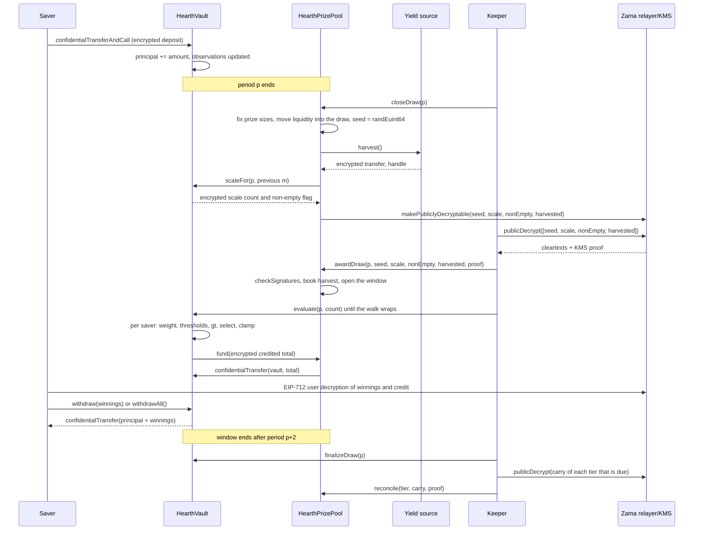

# Cómo funciona un sorteo

Un sorteo es el momento en el que el rendimiento del pool se convierte en premios. Esta
página recorre todo el proceso en palabras llanas y después cuenta la misma historia como
diagrama.

## Periodos

El tiempo se corta en periodos iguales de `L` segundos. El periodo 1 empieza en
`firstPeriodAt`, una marca de tiempo fijada en el despliegue y que no se cambia nunca
después. A partir de ahí la aritmética es una simple división:

```
period(t)      = (t - firstPeriodAt) / L + 1
periodStart(p) = firstPeriodAt + (p - 1) * L
periodEnd(p)   = periodStart(p + 1)
```

Cada pool tiene su propia `L`. En Sepolia, el pool de USDC va a una hora y los otros seis a
seis horas, de modo que un visitante ve un ciclo completo sin levantarse de la silla. En
mainnet, un despliegue real usaría un día, que es lo que usa PoolTogether V5. El periodo es un
argumento del constructor, así que el mismo código sirve para los tres, y las probabilidades
de los niveles de cada pool se fijan contra su propio periodo. Ver
[pools y tokens](pools-and-tokens.md).

El sorteo `p` cubre el periodo `p`. Lo deciden por completo los saldos mantenidos durante el
periodo `p`. Nada de lo que pase después de que termine el periodo `p` puede cambiar su
resultado.

## La ventana, y el plazo para cerrar

Todos los pasos del sorteo `p` ocurren durante los periodos `p+1` y `p+2`. Esa es la ventana,
y termina en `periodEnd(p + 2)`. Son dos horas en el pool de USDC y medio día en los demás.

El cierre tiene un plazo más estrecho que el resto de la ventana:

```
closeDeadline(p) = periodStart(p + 2) + L / 2
```

Es la mitad del segundo periodo de la ventana, tres cuartas partes del camino. Un cierre
posterior a eso se rechaza.

El motivo es que el cierre y la adjudicación no pueden compartir bloque. El cierre marca unos
valores como descifrables en la cadena, los textos en claro vuelven del relayer de Zama fuera
de la cadena, y la adjudicación los verifica en la cadena. Un cierre en los últimos segundos
de la ventana dejaría ese viaje de ida y vuelta sin sitio donde aterrizar, y el sorteo se
quedaría atascado para siempre en `Closed`. El plazo garantiza al menos medio periodo para el
viaje, la adjudicación y todos los lotes de evaluación.

La ventana también acota cuánto tiempo atrás tiene que recordar saldos la bóveda, que es lo
que hace que basten tres observaciones guardadas por ahorrador. Ver
[saldo ponderado por tiempo](time-weighted-balance.md).

## Los cinco pasos

Todos los pasos son sin permisos. Cualquiera puede llamar a cualquiera de ellos, incluido un
ahorrador desde la aplicación. El keeper es simplemente la dirección que suele llegar
primero.

### 1. Cerrar

`closeDraw(p)`, una vez terminado el periodo `p` y antes de `closeDeadline(p)`.

En esta única transacción pasan cinco cosas, en este orden:

- **Se fijan los tamaños de los premios.** El tamaño del premio de cada nivel y la liquidez
  que ese nivel aporta a este sorteo se calculan a partir del dinero que el nivel tiene ahora
  mismo, y esa liquidez se mueve al sorteo. Esto ocurre antes de que exista la semilla
  aleatoria.
- **Se saca la semilla.** `FHE.randEuint64()` se ejecuta dentro del coprocesador de Zama, así
  que el número existe solo como texto cifrado y nadie lo ha visto.
- **La bóveda informa de dónde se sitúa el peso agregado del periodo**, como un pequeño
  recuento cifrado más una bandera cifrada que dice si alguien tenía saldo. No el agregado en
  sí, y todavía no en claro. Ver la sección siguiente.
- **Se cosecha la fuente de rendimiento**, como una transferencia cifrada al pool. Si la
  fuente revierte, el cierre sigue funcionando: la cosecha se trata como un cero cifrado
  trivial y se emite un evento `HarvestFailed`. Una fuente de rendimiento rota no puede parar
  el reloj.
- **Cuatro handles se marcan como públicamente descifrables:** la semilla, el recuento de
  escala, la bandera de no vacío y la cosecha. Es una bandera de un solo sentido en la lista
  de control de acceso de Zama. Desde ese momento cualquiera puede pedirle al relayer su texto
  en claro, y la bandera no se puede revocar. Nada más del sorteo se marca nunca así.

El estado del sorteo pasa a `Closed`. El cierre funciona exactamente una vez, y por eso nadie
puede volver a tirar la semilla.

Lo importante es el orden dentro de la transacción. Los tamaños de los premios se fijan antes
de que exista la semilla, así que nadie puede ver aparecer una semilla, deducir que ha ganado
y luego reordenar el dinero del pool para que esa victoria valga más.

### Qué publica la bóveda en lugar del total

El saldo total ponderado por tiempo del pool para el periodo, escrito `W`, no se publica
nunca. Publicarlo exacto fue el diseño hasta el 3 de septiembre de 2026 y una revisión lo
rompió: con `W` público durante dos periodos consecutivos, y la marca de tiempo pública del
depósito o el retiro de un ahorrador, un ahorrador que fue el único en mover dinero en un
periodo ve recuperada su cantidad exacta por aritmética. No acotada: recuperada. Está descrito
en [qué permanece privado](../security/what-stays-private.md).

Lo que se publica ahora es la franja en la que cae `W`: la menor potencia de dos igual o
superior a él, escrita `M = 2^m`. La bóveda la sigue bajo cifrado. En cada cierre compara `W`
contra las cinco potencias de dos alrededor de la `m` del sorteo anterior, suma los resultados
en un único recuento cifrado pequeño y marca ese recuento como públicamente descifrable. El
pool deduce la nueva `m` a partir del recuento verificado. Una comparación cifrada aparte
contra 1 da la bandera de no vacío, que dice si alguien tenía saldo.

Así que un observador aprende una cosa por sorteo: si el pool cruzó una potencia de dos. Entre
cruces no aprende nada nuevo. Todos los sorteos se ejecutan contra `M` y no contra `W`, que es
lo que hace que los recuentos de premios descritos más abajo cuadren como cuadran.

### 2. Adjudicar

`awardDraw(p, seed, scaleCount, nonEmpty, harvested, proof)`.

Quien la llama trae los cuatro textos en claro del relayer de Zama, que los devuelve con una
firma del servicio de gestión de claves (KMS), el conjunto de partes que custodia la clave de
descifrado de la red. El contrato verifica esa firma en la cadena con `FHE.checkSignatures`
antes de creerse un solo número. La prueba está ligada a los handles en un orden fijo,
`[seed, scaleCount, nonEmpty, harvested]`, así que los cuatro valores no se pueden barajar ni
reutilizar contra otro sorteo.

Después:

- La cosecha verificada se abona a los niveles según sus pesos de participación. Esta es la
  única vía por la que entra dinero de premios, y aterriza en los niveles y no en este sorteo,
  así que se ofrece en el cierre siguiente. El pool nunca anota una cantidad que la fuente de
  rendimiento haya declarado sobre sí misma.
- Si la bandera de no vacío dice que nadie tenía saldo en el periodo `p`, el sorteo se marca
  `Empty` y la liquidez que estaba ofreciendo vuelve directamente a los niveles.
- Si no, el sorteo se abre. La semilla y la franja `M` son ya números públicos.
- Si la ventana ya se ha cerrado para cuando alguien adjudica, la cosecha se abona igualmente,
  la liquidez ofrecida vuelve igualmente a los niveles, y el sorteo se marca `Skipped`. Ese
  periodo no paga premio, y no se pierde ni rendimiento ni liquidez.

Los cinco estados de un sorteo son `None`, `Closed`, `Awarded`, `Empty` y `Skipped`.

**Este es el momento en el que se deciden los ganadores.** A partir de aquí la semilla es un
número público, la franja es un número público, y el peso de cada ahorrador para el periodo
`p` ya no puede cambiar. Los umbrales que cada ahorrador tiene que superar son aritmética
sobre entradas públicas. La evaluación, que viene después, no decide nada. Pone por escrito un
resultado que ya existe.

### 3. Evaluar

`evaluate(p, count)` sobre la bóveda, tantas veces como haga falta, mientras la ventana esté
abierta.

Quien llama dice a cuántos ahorradores avanzar. No dice a cuáles. La bóveda recorre la lista
de ahorradores desde un cursor propio de cada sorteo que empieza en `seed mod saverCount` y
avanza en el orden de la lista, tratando hasta `count` ahorradores y como mucho `4` que
requieran trabajo cifrado. Los ahorradores sin ninguna observación en el periodo `p` o antes
tienen peso cero, y se saltan a partir de sus marcas de tiempo en claro, sin ningún coste
cifrado.

Para cada ahorrador al que llega el recorrido, la bóveda lee su peso cifrado del periodo `p`,
ejecuta la prueba del ganador contra los umbrales públicos y suma el resultado a sus ganancias
cifradas. Guarda el peso cifrado y el crédito cifrado de ese ahorrador para el sorteo, ambos
legibles solo por ese ahorrador, para que la aplicación pueda mostrar "ganaste X en el sorteo
p" y dejarle comprobar la comparación. Después tira del total cifrado abonado por ese lote
desde el fondo de premios.

Nadie elige a quién se evalúa ni en qué orden. Un ahorrador que quiere su propio resultado
avanza el mismo recorrido que avanza todo el mundo, así que enviar una transacción de
evaluación no dice nada sobre si ganaste. El punto de partida se mueve en cada sorteo, porque
viene de la semilla de ese sorteo, así que ninguna dirección es la última de la cola de forma
permanente.

`evaluate` revierte en un sorteo que esté `Empty`, `Skipped` o todavía sin adjudicar.

### 4. Finalizar

`finalizeDraw(p)`, una vez cerrada la ventana.

Todo lo que cada nivel ofreció y no pagó se pliega dentro del arrastre cifrado de ese nivel.
El arrastre es un total acumulado que sigue cifrado y viaja de sorteo en sorteo. Se suma a la
liquidez ofrecida por ese nivel en cada cierre, así que el dinero no pagado vuelve al juego
inmediatamente aunque su tamaño siga siendo secreto.

Finalizar también publica el handle actual de un contador cifrado global de todo lo que el
pool no pudo financiar. Con cosechas verificadas siempre vale cero.

### 5. Conciliar

`reconcile(tier, carry, proof)` sobre el pool, un nivel cada vez, y solo cuando a ese nivel le
toca.

Cada nivel se concilia con la cadencia fijada en el despliegue como `reconcileEvery[t]`
sorteos. En Sepolia a todos los niveles les toca en cada sorteo. Cuando a un nivel le toca,
`finalizeDraw` marca su arrastre como públicamente descifrable y emite `CarryPublished`.
Cualquiera trae el texto en claro, llama a `reconcile` con la prueba del KMS, y el número
verificado se anota de vuelta en la liquidez en claro de ese nivel. La bóveda resta ese mismo
número del arrastre, que puede haber crecido mientras tanto, y se emite `TierReconciled`.

Conciliar es lo que hace público el recuento de premios de ese nivel, porque el arrastre es la
parte de lo ofrecido que nadie ganó. Con una cadencia de uno, el recuento de cada nivel se
hace público un sorteo después del sorteo al que pertenece, y todo el bote de cada nivel
vuelve a estar a la vista, donde la aplicación puede mostrarlo creciendo. Subir la cadencia
esconde el recuento durante esos sorteos y esconde con él el bote creciente, que es el
compromiso que se plantea en [premios y niveles](prizes-and-tiers.md). En ningún caso se
evapora nada, y con cualquier cadencia nunca sabes quién ganó.

## Qué pasa si un paso no llega nunca

- **El cierre no llega nunca.** El sorteo se queda en `None` y se salta. Su liquidez nunca se
  movió, así que se queda en los niveles y se ofrece en el sorteo siguiente. La cosecha la
  recoge el cierre siguiente.
- **La adjudicación no llega dentro de la ventana.** Una adjudicación tardía sigue anotando la
  cosecha, sigue devolviendo la liquidez ofrecida a los niveles y marca el sorteo `Skipped`.
- **Nadie evalúa.** Toda la oferta de cada nivel se pliega en su arrastre al finalizar y vuelve
  en la conciliación siguiente.

Nada queda varado y nada se pierde. Un keeper atascado le cuesta al pool un sorteo, no dinero.
Ver [la página del keeper](../operations/keeper.md).

## El dinero no se mueve nunca por un informe

Dos reglas hacen que la contabilidad sea difícil de engañar.

El rendimiento no se toma nunca por confianza. La fuente hace una transferencia cifrada al
pool, el pool es el destinatario y por tanto tiene permiso sobre ese texto cifrado, y solo
entonces el pool lo publica y anota el texto en claro verificado por el KMS. Una fuente de
rendimiento con fallos u hostil puede enviar menos de lo que dice; lo que no puede es hacer
que el pool crea en dinero de premios que nunca llegó. Esto importa porque una liquidez de
premios fantasma acabaría saliendo del principal de alguien.

Los pagos se tiran, no se empujan. Después de cada lote de evaluación la bóveda concede al
pool una autorización de vida corta sobre el total cifrado del lote, el pool concede lo mismo
al token, y el token mueve exactamente esa cantidad del pool a la bóveda. Si el pool se queda
corto, la bóveda registra la diferencia en el contador cifrado global de no financiado, que se
publica al finalizar para que cualquiera lo compruebe. Con cosechas verificadas ese contador
vale siempre cero.

## El sorteo entero, de principio a fin



## Qué no cubre esta página

No cubre cómo se forma el peso de un ahorrador a lo largo de un periodo, que es
[saldo ponderado por tiempo](time-weighted-balance.md), ni la aritmética de la prueba del
ganador, que es [selección del ganador](winner-selection.md), ni cuánto vale cada premio, que
es [premios y niveles](prizes-and-tiers.md).
