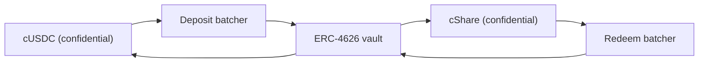

# De dónde sale el dinero de los premios

Los premios son rendimiento. El principal de nadie se paga nunca como premio, que es lo que
hace que el pool sea sin pérdidas. Esta página cubre la única interfaz que implementa toda
fuente, la fuente que funciona hoy en Sepolia, por qué el pool se niega a creerse nada de lo
que diga una fuente, y cómo encaja en mainnet la propia Confidential Vault de Zama.

## La interfaz

```solidity
interface IYieldSource {
    function harvest() external returns (euint64 transferred); // confidential transfer to the recipient
    function harvestable() external view returns (uint64);      // display only
}
```

Dos funciones. `harvest` mueve el rendimiento acumulado al fondo de premios como una
transferencia confidencial y devuelve la cantidad cifrada que se movió de verdad.
`harvestable` es para lo que muestra la aplicación, y el pool nunca la usa para contabilidad.

`harvest` es síncrona a propósito. Mueve lo que la fuente tenga listo en ese momento, y se
espera que una fuente que gana de forma asíncrona haya preparado esa cantidad de antemano en
lugar de hacer esperar al pool.

Cambiar la fuente es una sola llamada del propietario sobre el pool, `setYieldSource`, y emite
`YieldSourceSet`. Nada más en el sistema sabe ni le importa qué fuente está conectada.

Una fuente que revierte no detiene un sorteo. El pool captura el fallo, trata la cosecha de ese
sorteo como un cero cifrado trivial y emite `HarvestFailed`. El cierre funciona, el sorteo se
ejecuta sobre la liquidez que los niveles ya tienen, y el rendimiento que no se movió lo recoge
una cosecha posterior. Una fuente rota o mal conectada deja sin comer al lado de los premios;
no puede parar el reloj.

Cuando una cosecha sí llega, se anota en la adjudicación de ese sorteo y se ofrece en el cierre
siguiente. Así que el rendimiento del periodo `p` financia los premios del sorteo `p+1`, no los
del sorteo `p`. Eso es lo que permite fijar los tamaños de los premios antes de que exista la
semilla.

## Sepolia: la fuente patrocinada

`SponsoredYieldSource` es lo que funciona en todos los pools reales, una instancia por cada
uno, así que las siete fuentes son siete saldos separados de siete tokens distintos. La del
pool de USDC está en `0xCC49DF69eAB6884fD8DD9260902B8A0Abc9D6b91`; las otras seis están en
[pools y tokens](pools-and-tokens.md).

Un patrocinador llama a la función `sponsor` de la propia fuente con el token público del pool.
La fuente lo envuelve en el confidencial y anota exactamente lo que acuñó el envoltorio, no lo
que pidió el patrocinador. A partir de ahí el saldo gotea a `ratePerSecond`, que en el pool de
USDC es `5,555 base units a second, which is 19.998 USDC a period`, y `harvest` envía al pool
lo que se haya acumulado. La tasa de cada pool se fija en tokens enteros por hora para que dos
pools con relojes distintos se puedan comparar de un vistazo, y cada patrocinio está
dimensionado para cubrir más de ochenta sorteos.

Un patrocinio es una donación. No hay ninguna vía para que un patrocinador lo recupere, y solo
el propietario de la fuente puede cambiar la tasa de goteo, cosa que emite `RateChanged`.

Las cantidades patrocinadas, la tasa de goteo y todas las cosechas son públicas. Eso no es una
concesión: en PoolTogether la cantidad de rendimiento que aporta una bóveda también es pública,
y todos los tamaños de los premios se derivan de ella. Lo confidencial en Hearth es quién
ahorró cuánto y quién ganó, nunca cuánto dinero ganó el pool.

Si el pool se queda sin ahorradores un tiempo, el rendimiento se sigue acumulando y se paga a
los primeros sorteos que sí tengan ahorradores. Nada queda varado en un pool vacío.

### Por qué un mock, para empezar

Como una fuente simulada solo es honesta si la documentación dice cómo funciona y cómo se
conecta una real, aquí están las dos cosas. Buscamos primero una real y en Sepolia no hay
ninguna que pague rendimiento sobre los tokens mock de Zama:

| Sitio | Por qué no |
| --- | --- |
| Aave | Rechaza depósitos de USDC en Sepolia, tope de suministro superado |
| Compound | Quiere el USDC propio de Circle, no el mock de Zama |
| Confidential Vault de Zama | La bóveda de Sepolia es una VaultV2 solo de reposo sin adaptador de rendimiento, que es la descripción que hace de ella la propia Zama |

Así que las opciones honestas eran un número falso que sube, o un saldo financiado por un
patrocinador que existe de verdad en la cadena y gotea de verdad. Elegimos la segunda. Cada
unidad de dinero de premios de cada uno de los siete pools reales se envolvió de verdad, se
transfirió de verdad y se verificó de verdad.

## El pool no anota nunca un número declarado

Esta es la regla que impide que la fuente patrocinada sea un punto débil.

La fuente hace una transferencia cifrada al pool. El pool, como destinatario, tiene permiso
sobre ese texto cifrado, así que puede marcar él mismo la cantidad transferida como
públicamente descifrable. Solo en el momento de la adjudicación, después de que
`FHE.checkSignatures` verifique la firma del servicio de gestión de claves sobre el texto en
claro, el pool abona algo a los niveles.

Una fuente que mienta sobre cuánto envió no llega a ninguna parte. El pool anota la cantidad
que llegó, porque es la única cantidad que mira.

Esto no es prudencia teórica. En nuestro diseño anterior el pool anotaba las recargas de la
reserva a partir de la cantidad que pasaba quien llamaba, mientras que el envoltorio acuña
`amount / rate()`. En el despliegue real `rate()` resultaba ser 1, así que las dos coincidían y
el fallo estaba latente. Con un subyacente de 18 decimales, donde la tasa del envoltorio es un
millón de millones, el pool habría creído en un millón de millones de veces más dinero de
premios del que existía. Lo ejecutamos el 2 de septiembre de 2026 contra un token de prueba con
18 decimales y lo vimos pasar. Una liquidez de premios fantasma en un pool sin pérdidas acaba
saliendo del principal de alguien, que es la única promesa que el producto no puede romper.
Verificar la transferencia elimina la clase entera.

## Mainnet: la Confidential Vault de Zama

Zama publica un protocolo cuyo trabajo entero es ganar rendimiento sobre saldos confidenciales,
y es la fuente natural en mainnet. `ConfidentialVaultYieldSource` es el adaptador en ese
diseño. Lo que sigue es su especificación, no un contrato de este repositorio.

Es un adaptador por pool, como todo lo demás aquí, y cada uno necesita un agrupador y una
bóveda de rendimiento para su propio token. El despliegue de Zama en mainnet cubre hoy USDC,
así que un Hearth en mainnet abriría el pool de USDC sobre la Confidential Vault y cualquier
otro token sobre la fuente que exista para él, o sobre ninguna.

El diseño es un agrupador situado entre tokens confidenciales y una bóveda de rendimiento
ERC-4626 corriente. Una bóveda ERC-4626 solo acepta transferencias públicas, así que un
depositante solitario publicaría su cantidad exacta. El agrupador, en cambio, junta muchos
depósitos cifrados, descifra solo la suma, hace un único depósito público en la bóveda y
devuelve participaciones confidenciales. En palabras de la propia Zama: "Los observadores ven
quién participó, pero no cuánto aportó cada uno".



El adaptador se une al agrupador de depósitos con el token confidencial del pool y guarda
participaciones confidenciales. El rescate va con su propio calendario, por delante de la
cosecha: el keeper pide periódicamente al agrupador de rescates el crecimiento y lleva esa
petición por sus cuatro fases, de modo que cuando el pool vuelva a llamar a `harvest`, el USDC
confidencial rescatado ya está en el adaptador y la cosecha es una única transferencia como
cualquier otra. Así es como un sitio asíncrono se encuentra con una interfaz síncrona.
Cualquiera puede ejecutar las cuatro fases, así que nadie tiene que esperar al operador de Zama.

### Las direcciones

De la propia referencia de direcciones de Zama, consultada el 2 de septiembre de 2026.

**Mainnet de Ethereum, chain id 1.** Activo subyacente USDC. Fuente de rendimiento: la VaultV2
de Morpho "Steakhouse Confidential Prime USDC", cerrada para que el agrupador de depósitos sea
el único depositante de la bóveda.

| Contrato | Dirección |
| --- | --- |
| Agrupador de depósitos | `0x324EA89FD3784036673BfE6Ffee2334A088F40Cc` |
| Agrupador de rescates | `0x96Cd3Faa7483783Ac2Eb715f6333361500F1eec9` |
| Envoltorio cUSDC | `0xe978F22157048E5DB8E5d07971376e86671672B2` |
| Envoltorio cShare | `0x66Bf74E96900D1a19c7070D939D124f2F565C458` |
| Bóveda ERC-4626 | `0xbEEF00A59B577423653A1526c7009bdE103F542B` |
| USDC | `0xA0b86991c6218b36c1d19D4a2e9Eb0cE3606eB48` |

**Sepolia, chain id 11155111.** Un entorno de pruebas: el USDC es un mock con un `mint` público
y la bóveda es solo de reposo, sin adaptador de rendimiento.

| Contrato | Dirección |
| --- | --- |
| Agrupador de depósitos | `0x48758559c14d4d92b4C74A99660B6a8dbe85F53b` |
| Agrupador de rescates | `0xe94E9afdDd43a19C2914739e9279cb6Fe287BEb0` |
| Envoltorio cUSDC | `0x7c5BF43B851c1dff1a4feE8dB225b87f2C223639` |
| Envoltorio cShare | `0x7E93d5c150A2178B1fCde0278582Acf59478eA5f` |
| Bóveda ERC-4626 (en reposo) | `0x6AB54988261AEC573a2CA13cF802d3B1114f864C` |
| Mock USDC | `0x9b5Cd13b8eFbB58Dc25A05CF411D8056058aDFfF` |

Como la bóveda de Sepolia está en reposo, el adaptador se especifica aquí contra la interfaz de
agrupador que Zama publica y todavía no está escrito. Decir que está en marcha cuando no gana
nada sería una mentira que cualquiera podría comprobar en un minuto.

### Qué significa conectarlo, en la práctica

El agrupador avanza en cuatro fases: unirse, despachar, finalizar y reclamar. Un lote espera
hasta alcanzar una edad mínima, después se descifra su total, después la bóveda liquida, y
después los participantes reclaman. Cualquiera puede ejecutar todas esas fases, así que el pool
nunca se queda atascado esperando al operador de Zama, y las reclamaciones no caducan.

Ese ritmo es más lento que el goteo instantáneo de la fuente patrocinada, y por eso el keeper
ejecuta el rescate por adelantado en lugar de dentro de `harvest`. El contrato del pool no
espera nunca: le pide al adaptador lo que ya se haya reclamado de vuelta. Lo que queda como
trabajo real para llevar esto a producción es el contrato adaptador en sí, que este repositorio
especifica pero no implementa, y la parte del keeper: decidir cada cuánto empezar un rescate y
qué parte de la posición rescatar, que es una decisión de política sin consecuencias en la
cadena si llega tarde.

### Qué heredaría Hearth

Nombrar esto como toca es parte de ser digno de confianza al respecto.

- **Riesgo de bóveda, íntegro.** El agrupador manda el dinero a una bóveda ERC-4626 de un
  tercero. Si esa bóveda pierde valor, el saldo generador de rendimiento del pool pierde valor
  con ella. Este es el único punto en el que "sin pérdidas" dependería del contrato de otra
  persona, y por eso un despliegue en mainnet debería tener allí solo la parte que genera
  rendimiento.
- **Confidencialidad de lote, no del pool.** El agrupador esconde cantidades entre
  coparticipantes y descifra la suma. Si Hearth fuera el único participante de un lote, su
  cantidad depositada sería pública. Eso no nos cuesta nada, porque las cosechas de Hearth se
  publican igualmente, pero conviene saberlo antes de suponer que el agrupador esconde más de
  lo que esconde.
- **Poderes acotados del propietario.** El propietario del agrupador puede cambiar la edad
  mínima del lote (con tope de 7 días), el plazo de la retrollamada (con tope de 30 días) y la
  tolerancia de deslizamiento en el depósito, y puede pausar las uniones y los despachos. La
  documentación de Zama afirma que el propietario no puede mover ni congelar fondos de
  usuarios, no puede censurar un resultado, no puede descifrar las cantidades de nadie y no
  puede actualizar el contrato. La protección de deslizamiento en el rescate está desactivada
  por código para que las salidas funcionen incluso durante una caída de la bóveda.

## Qué no cubre esta página

No cubre el efecto de la fuente de rendimiento sobre la tabla de filtraciones, que está en
[qué permanece privado](../security/what-stays-private.md). No hace un análisis del rendimiento
de la bóveda de Morpho, que es un número de otra gente y cambia a diario. Y no afirma que el
adaptador esté funcionando: en Sepolia lo que está conectado es la fuente patrocinada, y la
tarjeta "El pool ahora mismo" del panel la nombra.
