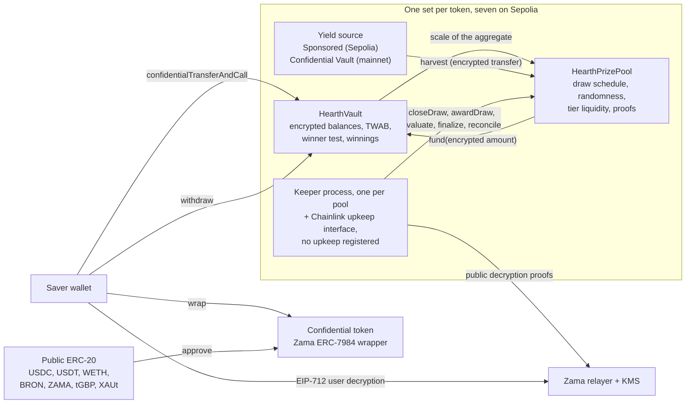

# Qué es Hearth

Hearth es un pool de ahorro donde no puedes perder tu dinero y sí puedes ganar un premio. En
Sepolia funcionan siete, uno por cada token confidencial, y eliges un token igual que
elegirías una cuenta de ahorro.

Pones un token confidencial: USDC, USDT, WETH, BRON, ZAMA, tGBP o XAUt. El pool pone ese
dinero a trabajar y gana rendimiento. Cada periodo, el rendimiento que ganó el pool se
reparte como premios, y tu probabilidad de ganar es proporcional a cuánto tenías y cuánto
tiempo lo tuviste. Puedes recuperar tu principal cuando quieras, íntegro. Esa es la idea de
la "lotería sin pérdidas" que inventó PoolTogether, y Hearth es una versión confidencial de
ella.

La diferencia con PoolTogether es que en una cadena de bloques normal todo es público.
Cualquiera puede leer cuánto tiene cada ahorrador, cuáles son las probabilidades de cada
cartera y quién ganó cada sorteo. Eso publica el patrimonio de la gente y pinta una diana
sobre quien tiene mucho. Hearth ejecuta todo el proceso sobre números cifrados usando el
Protocolo de Zama, así que la cadena guarda tu saldo como texto cifrado (datos ilegibles sin
una clave) y el contrato sigue haciendo la aritmética sobre él. Tu saldo es un número que
nadie ha visto nunca, nosotros incluidos, y el sorteo sigue siendo comprobable por un
desconocido.

## El sistema en una imagen

El trabajo lo hacen dos contratos. `HearthVault` guarda el principal cifrado de cada
ahorrador, sus ganancias cifradas y el registro de cuánto tiempo tuvo cada cantidad, y
además ejecuta la prueba del ganador. `HearthPrizePool` lleva el reloj, saca la semilla
aleatoria, recoge el rendimiento y mantiene el dinero de los premios repartido en niveles.
Un proceso keeper empuja el sorteo hacia adelante, y cualquier otra persona puede dar
cualquiera de esos pasos en su lugar.

La caja del centro es el pool de un token. Hay siete y no comparten nada: tu posición en
USDC y tu posición en WETH son ahorradores distintos en bóvedas distintas, y que un pool se
quede en silencio no afecta a los demás. El pool que estás mirando es la primera parte de la
barra de direcciones, `/app/usdc` o `/app/weth`. La lista completa, con direcciones, está en
[pools y tokens](../concepts/pools-and-tokens.md).

## Los cuatro movimientos

Un ahorrador hace cuatro movimientos. Esto es lo que hace cada uno y lo que deja ver.

### 1. Depositar

Envías el token confidencial de ese pool a su bóveda con una sola transacción. La cantidad
viaja como un handle de texto cifrado, que es un puntero a un valor cifrado y no el valor en
sí. La bóveda lo suma a tu principal cifrado y actualiza el registro de tu saldo a lo largo
del tiempo, todo sin descifrar nada.

- Oculto: la cantidad, tu saldo acumulado y, por tanto, tu parte del pool.
- Público: tu dirección, el bloque en el que lo hiciste y el hecho de que hubo un depósito.

Hay una costura. Convertir el token público normal en el confidencial es una transferencia
ERC-20 pública, así que la cantidad envuelta se ve. Si envuelves 5.000 USDC y depositas dos
bloques después, un observador tiene una conjetura muy buena. Hearth mantiene envolver y
depositar como dos pasos separados precisamente para que puedas poner distancia entre ellos.
Ver [la costura del envoltorio](../security/what-stays-private.md).

### 2. Sorteo

Al final de cada periodo, el pool cierra el sorteo de ese periodo. En una sola transacción
fija el tamaño del premio de cada nivel, luego saca una semilla aleatoria cifrada dentro del
coprocesador de Zama, luego pregunta a la bóveda cuál era el tamaño del pool y luego recoge
el rendimiento del periodo. El orden importa: los premios se dimensionan antes de que exista
el número aleatorio, así que nadie puede ver una semilla y después reordenar cuánto vale
ganar.

"Cuál era el tamaño del pool" es deliberadamente vago, y ese es el diseño. La bóveda no
publica el saldo total ponderado por tiempo de todos los ahorradores sumados. Solo publica la
franja de potencia de dos en la que cae ese total, así que lo que el mundo aprende es
aproximadamente el tamaño del pool y no su tamaño exacto. Publicar el número exacto
permitiría restar dos sorteos consecutivos y leer en la diferencia el depósito de un
ahorrador solitario.

Después salen cuatro valores pequeños con una prueba firmada por el servicio de gestión de
claves de Zama, de modo que cualquiera puede comprobarlos: la semilla, la franja, si había
alguien en el pool y el rendimiento recogido. El resultado de cada ahorrador para ese sorteo
queda fijado en el momento en que se verifican esos números.

- Oculto: el peso de cada ahorrador, el total exacto del pool y cada resultado individual.
- Público: la semilla, la franja, el rendimiento recogido, el tamaño del premio de cada
  nivel y, un sorteo después, cuando el nivel se concilia, cuántos premios pagó.

### 3. Cobrar

No hay transacción de cobro, y esa es la gracia. La aplicación sí tiene un botón para
cobrar, en la tarjeta de ese sorteo dentro de "Mis sorteos", y lleva la cantidad: es un
retiro corriente de las ganancias que acabas de abrir, y en la cadena se ve exactamente como
cualquier otro retiro.

Las ganancias se abonan a un saldo cifrado aparte dentro de la bóveda mientras se evalúa el
sorteo. Nada de lo que hagas provoca eso y nada de lo que hagas lo revela. Para saber si
ganaste, firmas un mensaje EIP-712, una firma tipada fuera de la cadena que demuestra que
controlas tu dirección, y el relayer de Zama devuelve el texto en claro de tus propias
ganancias a tu navegador. Esa firma no toca nunca la cadena, así que no cuesta nada y no deja
rastro. Tu saldo en el panel y el resultado de un sorteo tienen cada uno su propio ojo, los
dos pueden estar abiertos a la vez, y la firma del primero sirve para el segundo.

- Oculto: todo. Leer tus propias ganancias es una operación fuera de la cadena.
- Público: nada.

En la mayoría de los protocolos de premios el ganador tiene que enviar una transacción de
cobro y el perdedor no tiene motivo para hacerlo, así que la lista de transacciones va
nombrando en silencio a los ganadores. En Hearth no hay tal transacción que enviar. La
transacción que abona los premios, `evaluate`, no se puede apuntar hacia uno mismo: recorre
la lista de ahorradores desde un punto que decide la propia semilla del sorteo, y quien la
llama solo dice cuánto avanzarla.

### 4. Retirar

Una sola función saca dinero: `withdraw`. Paga primero de tus ganancias y después de tu
principal, y se limita a la menor de dos cifras: lo que tienes y lo que tiene la bóveda. Ya
estés cobrando un premio, llevándote tus ahorros a casa o las dos cosas a la vez, es la
misma llamada con la misma forma, el mismo evento y una cantidad cifrada.

La segunda mitad de ese límite existe porque una transferencia confidencial mueve la cantidad
entera o nada. Nunca envía una parte de lo pedido. Así que la bóveda calcula lo que
realmente puede pagar antes de pedirle al token que lo pague, en lugar de intentar reparar
un faltante después.

- Oculto: la cantidad y si algo de ella era dinero de premio.
- Público: tu dirección, el bloque y el hecho de que hubo un retiro.

Tu principal nunca queda bloqueado. Los depósitos y los retiros siguen abiertos mientras un
sorteo está en marcha, cosa que no ocurre en varios otros diseños de este campo.

## Qué lo hace justo

Dos cosas, y las dos las puede comprobar un desconocido sin ningún acceso especial.

La semilla aleatoria viene de `FHE.randEuint64`, generada dentro del coprocesador de Zama a
partir de una semilla pública bajo la clave FHE de la red. Nadie puede predecirla y nadie
puede sacarla dos veces: cerrar un sorteo funciona exactamente una vez. Una vez terminado el
periodo, el pool publica esa semilla junto con la franja en la que cayó el total del pool, y
ambas llevan una prueba que el contrato verifica en la cadena.

Con esos dos números públicos, cualquiera puede recalcular el umbral exacto que tenía que
superar cualquier dirección en cualquier nivel, y la bóveda expone la misma aritmética como
función de solo lectura para que nadie tenga que fiarse de una reimplementación. Lo que no
pueden hacer es ver el peso cifrado contra el que se comparó. Así que la regla es pública y
auditable, y solo la entrada es privada. Los detalles están en
[aleatoriedad y verificación](../security/randomness-and-verification.md).

## Qué no oculta Hearth

La versión corta, y completa en [qué permanece privado](../security/what-stays-private.md):

- Quiénes son los ahorradores, y cuándo depositó, retiró o fue evaluado cada uno.
- La franja en la que cayó el total del pool cada periodo, la semilla y el rendimiento
  recogido.
- El tamaño del premio de cada nivel y cuántos premios pagó, publicado un sorteo después.
- La cantidad que envolviste hacia el token confidencial o desde él.
- Con un solo ahorrador, la franja publicada es el peso de ese ahorrador con un margen de un
  factor dos. Con dos, cada uno puede acotar al otro. La privacidad aquí necesita tres o más
  ahorradores, y la aplicación lo dice.
- Los umbrales son públicos, así que cualquiera que pueda identificar tu saldo puede calcular
  tu resultado en todos los sorteos. La forma habitual de que eso pase es envolver y luego
  depositar la misma cantidad minutos después, y por eso la aplicación separa las dos cosas.
- Envolver a la entrada y desenvolver a la salida por completo publica una cota inferior de
  todo lo que has ganado, porque ambos movimientos son públicos en la capa del token.
- Un ahorrador que retira inmediatamente después de cada sorteo que gana filtra una pista
  estadística a través de su propio comportamiento. Ningún contrato puede arreglar esa.
