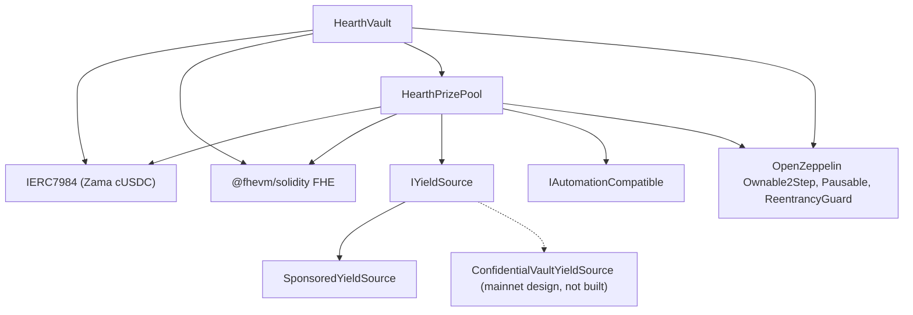

# Despliegue

Un único script repetible, nunca clics a mano. Esta página es el orden, los parámetros y qué
significa cada uno, para que un revisor pueda leer los argumentos de constructor desplegados y
saber que cuadran.

Hearth despliega un pool por token confidencial: una bóveda, un fondo de premios y una fuente de
rendimiento por token, sin compartir nada con ningún otro pool. Una ejecución abre un pool, porque
un nonce de desplegador ejecuta un despliegue, y el token se elige con `HEARTH_TOKEN`. Todas las
tareas posteriores llevan `--token`:

```
cd packages/contracts
HEARTH_TOKEN=weth npx hardhat deploy --network sepolia
npx hardhat hearth:verify  --network sepolia --token weth
npx hardhat hearth:seed    --network sepolia --token weth
npx hardhat hearth:status  --network sepolia --token weth
```

Si los omites los dos obtienes `usdc`, el token por defecto de la red. Un slug desconocido falla
con la lista de pools que esa red sí tiene. Los parámetros de cada pool viven en un solo archivo,
`packages/contracts/hearth.config.ts`: el par de activos, el periodo, el juego de niveles, la
franja inicial, la tasa de goteo, el patrocinio, las cinco posiciones de demostración y el índice
de cuenta con el que firma su keeper. Lee ese archivo junto a las tablas de abajo; son los mismos
números.

El despliegue reutiliza cualquier contrato que ya tenga un despliegue guardado en lugar de
sustituirlo, así que una segunda ejecución no hace nada. Un pool real que tiene el dinero de sus
ahorradores y días de historial de sorteos no se puede mover nunca a una dirección nueva volviendo
a ejecutar el script. Para sustituir uno a propósito, borra antes su archivo bajo
`deployments/<network>/`.

Escribe `deployments/sepolia/hearth.<slug>.json`, que es a lo que se apunta un keeper con
`HEARTH_ADDRESSES_FILE` y a partir de lo que se genera la lista de pools de la aplicación.

## Qué depende de qué



Las aristas continuas son contratos de este repositorio. El nodo punteado es la vía de rendimiento
en mainnet: el adaptador está especificado contra la interfaz de agrupador que Zama publica y aquí
no hay ningún contrato adaptador escrito, así que abajo solo se despliega `SponsoredYieldSource`.

La bóveda y el pool se necesitan mutuamente, así que uno de los dos enlaces se hace después del
despliegue y no en un constructor. Por eso abajo hay cinco pasos y no tres.

## El orden

| Paso | Acción | Por qué aquí |
| --- | --- | --- |
| 1 | Desplegar `HearthVault` | Guarda el dinero de los ahorradores y no necesita más que el token para existir. |
| 2 | Desplegar `HearthPrizePool`, apuntando a la bóveda | El pool lee el reloj de la bóveda y su recuento de escala, y paga a la bóveda. |
| 3 | Conectar: `vault.setPrizePool(pool)` | Emite `PrizePoolSet`. La bóveda solo aceptará financiación de esta dirección. |
| 4 | Desplegar la fuente de rendimiento, apuntando al pool como destinatario | Tiene que saber adónde mandar las cosechas. |
| 5 | Conectar: `pool.setYieldSource(source)` | Emite `YieldSourceSet`. Hasta que esto llega, un cierre no cosecha nada y emite `HarvestFailed`. |

Después del paso 5, siembra el pool: `hearth:seed --token <slug>` patrocina la fuente de
rendimiento para que existan premios y mete cinco ahorradores de demostración de tamaños distintos
desde las cuentas 2 a 6, para que un primer visitante aterrice en un pool poblado y no en uno
vacío. Cada paso comprueba en la cadena lo que ya está hecho, así que una siembra interrumpida por
un tropiezo del relayer se puede volver a ejecutar sin riesgo.

El keeper de ese pool necesita también su propio ETH de Sepolia, y los cinco ahorradores de
demostración también:

```
npx hardhat hearth:spread-gas --network sepolia --token weth
npx hardhat hearth:spread-gas --network sepolia --keepers 10,11,12,13,14,15 --savers false
```

El primero financia el keeper de un pool y los ahorradores; el segundo financia varias cuentas
keeper de una pasada, que es lo que hace falta para abrir seis pools a la vez.

Después apunta la aplicación a lo desplegado:

```
cd ../web
node scripts/sync-pools.mjs
```

## Los parámetros

```
HearthVault(IERC7984 asset, uint256 periodLength, uint256 firstPeriodAt, address owner)
HearthPrizePool(IHearthVault vault, IERC7984 asset, Tier[3] tiers, uint8 initialScaleBits, address owner)
    Tier = { uint32 prizeCount; uint64 oddsNumerator; uint64 oddsDenominator; uint16 shares; uint16 reconcileEvery }
SponsoredYieldSource(IERC7984ERC20Wrapper asset, address recipient, uint64 ratePerSecond, address owner)
```

### HearthVault

| Parámetro | Significado | Si te equivocas |
| --- | --- | --- |
| `asset` | El token confidencial ERC-7984 que depositan los ahorradores, uno de los siete de Zama. | Todos los envoltorios declaran seis decimales, y el despliegue se niega a continuar si la cadena no coincide con la configuración. La tasa hacia el token público de debajo no es 1 en todos los pools: en el mock de WETH, de 18 decimales, es un millón de millones, así que cualquier cosa que lea el token público tiene que aplicarla. |
| `periodLength` (`L`) | Segundos de un periodo. Inmutable. | Fija también el tope por ahorrador, `(2^64 - 1) / L`. Una `L` demasiado pequeña da un tope enorme pero sorteos ruidosos; demasiado grande y el tope se estrecha. |
| `firstPeriodAt` | Marca de tiempo en la que empieza el periodo 1. Inmutable, y tiene que ser igual o anterior al despliegue. | Un valor futuro deja `period(now)` sin definir hasta que pase. |
| `owner` | Propietario en dos pasos. La renuncia está desactivada. | Los poderes están listados en el [modelo de amenazas](../security/threat-model.md). |

`maxPrincipal` se deriva de `periodLength`, no se fija. Con una hora son unos 5.000 millones de
tokens, con seis horas unos 854 millones y con un día unos 213 millones.

La bóveda es dueña del reloj. El pool toma la dirección de la bóveda y le lee los periodos, así
que no hay forma de que los dos contratos discrepen sobre en qué periodo estamos.

### HearthPrizePool

| Parámetro | Significado |
| --- | --- |
| `vault` | La bóveda a la que sirve este pool, y el reloj que lee. |
| `asset` | El mismo token confidencial que usa la bóveda. Tienen que coincidir. |
| `prizeCount[t]` | Premios por sorteo en el nivel `t`. |
| `oddsNumerator[t]`, `oddsDenominator[t]` | Las probabilidades del nivel como fracción, un sorteo de cada `oddsDenominator / oddsNumerator`. |
| `shares[t]` | La porción del nivel en cada cosecha. Las participaciones son relativas, así que 40/20/40 y 2/1/2 significan lo mismo. |
| `reconcileEvery[t]` | Cuántos sorteos pasan entre publicaciones del arrastre de ese nivel. |
| `initialScaleBits` | La longitud en bits esperada del peso total del primer periodo, la conjetura inicial del seguidor de la franja. |
| `owner` | Como arriba. |

`UTILISATION` es una constante y no un argumento: el 50 por ciento, siguiendo a PoolTogether V5.
Es la fracción de la liquidez en claro de un nivel que se usa para dimensionar cada premio.

Dos de ellos merecen un comentario.

`reconcileEvery` es un ajuste de privacidad, no de gas, y se compensa con el aspecto que tiene el
bote. Publicar el arrastre de un nivel hace público el recuento de premios de ese nivel, y un
recuento sobre un solo sorteo apunta al pequeño conjunto de ahorradores elegibles en ese sorteo.
Subirlo reparte el recuento sobre un tramo en el que casi todo el mundo fue elegible en algún
momento. Lo que eso cuesta es el bote visible: un cierre mueve toda la liquidez pública de un
nivel al sorteo y solo vuelve en una conciliación, así que un nivel con cadencia 24 publica un
premio dimensionado sobre la parte de la cosecha de un solo sorteo en 23 de cada 24 sorteos, y el
bote acumulado se ve solo en el sorteo de la conciliación. El dinero se ofrece y se puede ganar
todo el tiempo dentro del arrastre cifrado; simplemente es invisible. Sepolia pone los tres
niveles en 1 por ese motivo y declara el recuento por sorteo como residuo. Ver la limitación 14.

`initialScaleBits` solo tiene que aproximarse. El seguidor compara el total real contra cinco
potencias de dos alrededor de la conjetura actual en cada cierre y se corrige a sí mismo hasta
tres bits por sorteo, así que una conjetura desviada unos pocos bits cuesta uno o dos sorteos con
probabilidades algo mal escaladas y después se asienta.

### SponsoredYieldSource

| Parámetro | Significado |
| --- | --- |
| `asset` | El envoltorio ERC-7984 que guarda y envía. El token público con el que pagan los patrocinadores es el subyacente del propio envoltorio, así que no es un argumento aparte. |
| `recipient` | El fondo de premios que recibe las cosechas. |
| `ratePerSecond` | A qué velocidad gotea el saldo patrocinado como rendimiento. |
| `owner` | Fija la tasa, emitiendo `RateChanged`. |

Patrocinar es una llamada aparte después del despliegue, no un argumento de constructor. Anota
exactamente lo que acuñó el envoltorio en lugar de lo que pidió el patrocinador, y no se puede
deshacer.

## Tres juegos de parámetros

Sepolia usa dos de ellos, porque los pools corren con dos relojes.

| Ajuste | Sepolia `usdc` | Sepolia, los otros seis | Mainnet, candidato |
| --- | --- | --- | --- |
| Duración del periodo | 1 hora | 6 horas | 1 día |
| Ventana | 2 horas (dos periodos) | 12 horas | 2 días |
| Plazo de cierre | 1 hora y 30 minutos después de terminar el periodo | 9 horas después | 1 día y 12 horas después |
| Tope por ahorrador | Unos 5.000 millones de tokens | Unos 854 millones | Unos 213 millones |
| Nivel mayor | cantidad 1, probabilidad 1/24, participaciones 40, concilia cada sorteo | cantidad 1, probabilidad 1/4, participaciones 40, concilia cada sorteo | cantidad 1, probabilidad 1/30, participaciones 50, concilia cada sorteo |
| Nivel medio | cantidad 1, probabilidad 1/6, participaciones 20, concilia cada sorteo | cantidad 1, probabilidad 1/2, participaciones 20, concilia cada sorteo | cantidad 1, probabilidad 1/7, participaciones 25, concilia cada sorteo |
| Nivel frecuente | cantidad 4, probabilidad 1, participaciones 40, concilia cada sorteo | cantidad 4, probabilidad 1, participaciones 40, concilia cada sorteo | cantidad 4, probabilidad 1, participaciones 25, concilia cada sorteo |
| Utilización | 50 por ciento | 50 por ciento | 50 por ciento |
| Fuente de rendimiento | `SponsoredYieldSource` | `SponsoredYieldSource` | `ConfidentialVaultYieldSource` sobre el agrupador de Zama |
| El premio mayor cae | Una vez al día aproximadamente | Una vez al día aproximadamente | Según las probabilidades elegidas |

Los números de Sepolia existen para que un visitante vea un ciclo completo sin levantarse: cuatro
premios pequeños en cada sorteo y un premio mayor una vez al día con cualquiera de los dos
relojes. No son los que usaría un despliegue real.

Por qué dos relojes. Un sorteo con cinco ahorradores cuesta `8,456,388` de gas, así que siete
pools sorteando cada hora gastarían alrededor de `1.43 ETH` al día en Sepolia, y los faucets
públicos no dan para eso. Seis horas lo reduce a cuatro sorteos al día por pool, unos `0.41 ETH`
al día para los siete. Las probabilidades se fijan contra el periodo propio de cada pool en lugar
de arrastrarse, y por eso la columna del medio dice 1/4 y 1/2 donde la primera dice 1/24 y 1/6, y
por eso el premio mayor sigue cayendo una vez al día aproximadamente en las dos. El pool de USDC
conservó su reloj horario porque se desplegó primero y su historial de sorteos está archivado con
él.

La columna de mainnet es un candidato, no un despliegue. La regla para rellenarla es la misma que
produjo la columna de Sepolia: elige cuántos sorteos quieres entre premios mayores y pon las
probabilidades del nivel mayor en uno partido por ese número, después ajusta las participaciones
para que los tamaños de premio resultantes se lean con sentido frente al rendimiento que la fuente
gana de verdad, y después decide la cadencia de conciliación de cada nivel sopesando un recuento
de premios que no nombra a nadie frente a un bote que los ahorradores pueden ver acumularse.
Sepolia eligió lo segundo; un despliegue en mainnet puede elegir lo primero, y el párrafo de
arriba dice lo que cuesta cada lado. Un periodo diario con probabilidades del nivel mayor de 1
entre 365 da un premio mayor anual, que es la forma que usa V5.

## Direcciones desplegadas

Siete pools en Sepolia, todos los contratos verificados en Etherscan. El par de tokens que tiene
cada uno es de Zama y está listado en [pools y tokens](../concepts/pools-and-tokens.md), junto con
las posiciones sembradas y la tasa de goteo de cada pool.

| Pool | HearthVault | HearthPrizePool | SponsoredYieldSource | Desplegado en el bloque |
| --- | --- | --- | --- | --- |
| `usdc` | `0x0F93e5db6027b4FB1C76566d24aA2D2E417fAF52` | `0xA0785AacF30B6FE46EDc53CD8A9db1d94FeF5Df2` | `0xCC49DF69eAB6884fD8DD9260902B8A0Abc9D6b91` | `11622398` |
| `usdt` | `0xe54F44dE64F8A7abc0647eaae547dD59ce0EFfac` | `0x6a83Beb2Dc3f258107Cad5e17BC57657fAd4fbd1` | `0x5bb1Cd5380Cb9f2B15569030fF0dB7a445cF54cA` | `11641314` |
| `weth` | `0x3D1A182782B68fE270A66294C9adaC7F005c4f14` | `0x1a11e7C689F244fA8Dd5f4abA8F2F3131090cc1C` | `0x40DF298f15c6136294eC651aD7b0c1C6F221DE8F` | `11641366` |
| `bron` | `0x18086DC8271f8A73c5Ea985fd519527Dbb991279` | `0x2Ed982979CD184494B947a1E38E597494a38ACe4` | `0x0cD1155D752bD81b3a437a6f0B3965CAA2A1C8e9` | `11641408` |
| `zama` | `0xEEC26386F273c6678cA538AcA18e1d9384eA9F09` | `0x873B285404199D46325a294Aa0EC7a79C30A7fF7` | `0xdD352D70311E834ab75307f53d5C276060081d23` | `11641447` |
| `tgbp` | `0xCe95dAa01f5354aA8887A5952E403D26d452c323` | `0xC531D54ee2c695e0eBfe8b8258e9Fd80fd507095` | `0xDEa2BD6351072F735B6ea83c357bF157d83c01af` | `11641484` |
| `xaut` | `0x77f701101d66FbD522A3bFdC2c00DB09a4F57daE` | `0x9a2888aca42c707A3BC0D561FdF6ff8Abfda5201` | `0x03fDdAA7C4323C53CE511CC49D4c33B26B492af7` | `11641523` |

Inicio del primer periodo: `1788386400 (2 September 2026, 22:00:00 UTC)` para `usdc`,
`1788620400 (5 September 2026, 15:00:00 UTC)` para `usdt`, y
`1788624000 (5 September 2026, 16:00:00 UTC)` para los cinco restantes. `firstPeriodAt` es
inmutable y tiene que ser igual o anterior al bloque del despliegue, así que el despliegue lee el
reloj de la propia cadena y redondea hacia abajo a la hora en punto, nunca el reloj de la máquina.

## Verificación

La verificación es parte del despliegue, no algo posterior. Un revisor que no puede leer el código
desplegado tiene que creerse toda esta documentación por nuestra palabra.

1. Verifica los tres contratos de ese pool en Etherscan con los argumentos de constructor que
   registró el script de despliegue: `hearth:verify --token <slug>` lo hace, contrato por
   contrato, y dice cuáles ya estaban verificados.
2. Comprueba que los argumentos de constructor verificados cuadran con las tablas de parámetros de
   arriba. En particular, que al pool se le dio su propia bóveda y el mismo `asset`, y que el
   juego de niveles cuadra con la columna del reloj de ese pool.
3. Comprueba que `vault.prizePool()` es el fondo de premios de ese pool y que `pool.yieldSource()`
   es la fuente de ese pool, y que ninguno apunta a contratos de otro pool.
4. Comprueba el token: `asset` debería ser el envoltorio confidencial de ese pool de la lista
   publicada por Zama para Sepolia, y `underlying()` debería ser el mock público que hay debajo.
   El `rate()` del envoltorio es 1 solo donde el token público también declara seis decimales; en
   el pool de WETH es un millón de millones, y una tasa distinta de 1 cambia lo que significa una
   unidad base para cualquier cosa que toque el token público.
5. Lee `pool.scaleBits()` después de unos cuantos sorteos y comprueba que se ha asentado cerca de
   la longitud en bits que implica el tamaño real del pool. Un seguidor atascado lejos de eso
   significaría que la conjetura inicial estaba muy desviada y que la corrección no ha llegado.

## Secretos

Nada sensible está nunca escrito en el código. El despliegue lee de un archivo `.env`, y
`.env.example` lista cada clave con un comentario sobre de dónde sale su valor. La clave del
desplegador y la clave del keeper son cuentas separadas, así que la clave caliente del keeper no
tiene poderes de propietario.

## Alojar la aplicación

La aplicación es un paquete de espacio de trabajo de Next.js, no la raíz del repositorio, que es
el ajuste que la mayoría de los alojamientos se equivocan.

| Ajuste | Valor | Por qué |
| --- | --- | --- |
| Preajuste de framework | Next.js | Se detecta a partir de `packages/web/package.json` |
| Directorio raíz | `packages/web` | La aplicación vive en un espacio de trabajo de npm |
| Incluir archivos fuente fuera del directorio raíz | Activado | Las dependencias se elevan a la raíz del repositorio, y la compilación necesita el `package.json` y el lockfile de la raíz |
| Comando de instalación | el de por defecto, `npm install` | Corre en la raíz del repositorio e instala todo el espacio de trabajo |
| Comando de compilación | el de por defecto, `next build` | Con el directorio raíz fijado, corre dentro de `packages/web` |
| Directorio de salida | el de por defecto, `.next` | Ver el aviso de abajo |
| Versión de Node | 20 o superior | El `package.json` de la raíz fija `engines.node` |

No pongas `NEXT_DIST_DIR` en un entorno alojado. `packages/web/next.config.ts` lo lee y mueve la
salida de la compilación cuando está presente. Existe para que una compilación local de
verificación no se pelee con un servidor de desarrollo en marcha por el mismo directorio `.next`.
En una compilación alojada movería la salida lejos de donde el alojamiento la busca, y el
despliegue fallaría sin nada evidente a lo que apuntar.

### Variables de entorno

| Variable | Pública en el navegador | De dónde sale su valor |
| --- | --- | --- |
| `SEPOLIA_RPC_URL` | No | Tu propio punto de acceso de Sepolia. La página de inicio y la ruta `/api/activity` leen la cadena en el servidor, así que esta nunca llega a un navegador. Las consultas de registros la necesitan, porque el nodo público gratuito limita los rangos de `eth_getLogs` muy por debajo de un día de bloques |
| `NEXT_PUBLIC_SEPOLIA_RPC_URL` | Sí | Opcional. Las lecturas de la cartera la usan y recurren a `https://ethereum-sepolia-rpc.publicnode.com` cuando no está definida. Es visible en el paquete, así que tiene que ser una que no te importe publicar |
| `NEXT_PUBLIC_CHAIN_ID` | Sí | `11155111` para Ethereum Sepolia. La aplicación lo usa por defecto si no está definida |

Ninguna dirección de contrato es ya una variable de entorno. La aplicación lee todos los pools de
`packages/web/src/lib/chain/pools.json`, que `node scripts/sync-pools.mjs` genera a partir de los
archivos de direcciones que escribió el script de despliegue, así que una dirección que muestre la
aplicación siempre se puede rastrear hasta un registro de despliegue y no hasta algo que escribió
alguien. Ejecuta ese script después de cada despliegue y confirma el resultado. Las tres variables
públicas que antes guardaban la bóveda, el fondo de premios y la fuente de rendimiento de un único
pool ya no existen; bórralas de cualquier entorno que las siga definiendo, porque nada las lee.

El activo confidencial y su ERC-20 subyacente también se leen de la bóveda y del envoltorio en la
cadena, así que la aplicación no puede hablar con un token que la bóveda rechazaría.

### Después del primer despliegue

1. Abre la URL de producción en un teléfono. Todas las páginas tienen que funcionar a 375 píxeles
   de ancho.
2. Conecta una cartera en Sepolia y recorre el camino de dos minutos del README contra el sitio
   desplegado y no contra localhost.
3. Abre `/verify?pool=<slug>` y pega la dirección de un ahorrador. Los umbrales vienen de una
   llamada al contrato, así que si se muestran, la aplicación desplegada está hablando con la
   bóveda desplegada de ese pool.
4. Abre el selector de pools y comprueba que cada slug carga su propio panel, y que el token
   restringido muestra su página de rechazo y no una pantalla rota.

---

## Qué no cubre esta página

No cubre cómo se hacen funcionar los pools después del despliegue, que es
[el keeper](keeper.md), y un proceso keeper por pool forma parte de esa página. No cubre la
preparación operativa para mainnet: el adaptador de la Confidential Vault está especificado contra
la interfaz de agrupador que Zama publica y no está implementado en este repositorio, y llevarlo a
producción se describe en [fuente de rendimiento](../concepts/yield-source.md).
