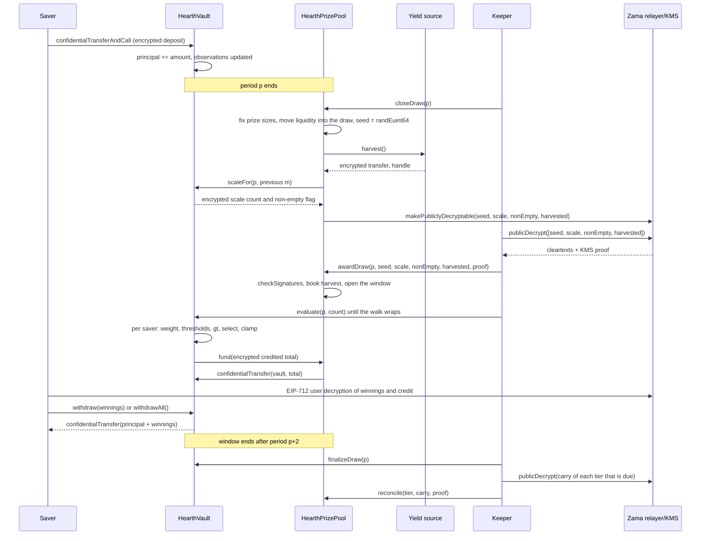

# Comment se déroule un tirage

Un tirage est le moment où le rendement du pool se transforme en lots. Cette page raconte le
tout en mots simples, puis montre la même histoire sous forme de diagramme.

## Les périodes

Le temps est découpé en périodes égales de `L` secondes. La période 1 commence à
`firstPeriodAt`, un horodatage fixé au déploiement et jamais modifié ensuite. À partir de
là, l'arithmétique n'est qu'une division :

```
period(t)      = (t - firstPeriodAt) / L + 1
periodStart(p) = firstPeriodAt + (p - 1) * L
periodEnd(p)   = periodStart(p + 1)
```

Chaque pool a son propre `L`. Sur Sepolia, le pool USDC tourne à une heure et les six autres
à six heures, pour qu'un visiteur voie un cycle complet en une seule session. Sur le réseau
principal, un vrai déploiement utiliserait un jour, ce qu'utilise PoolTogether V5. La
période est un argument de constructeur, donc le même code sert les trois cas, et les
chances de chaque palier sont calées sur la période du pool. Voir
[pools et jetons](pools-and-tokens.md).

Le tirage `p` couvre la période `p`. Il est décidé entièrement par les soldes détenus
pendant la période `p`. Rien de ce qui arrive après la fin de la période `p` ne peut en
changer l'issue.

## La fenêtre, et l'échéance de clôture

Chaque étape du tirage `p` a lieu pendant les périodes `p+1` et `p+2`. C'est la fenêtre, et
elle se termine à `periodEnd(p + 2)`. Cela fait deux heures dans le pool USDC et une
demi-journée dans les autres.

La clôture a une échéance plus serrée que le reste de la fenêtre :

```
closeDeadline(p) = periodStart(p + 2) + L / 2
```

C'est le milieu de la seconde période de la fenêtre, aux trois quarts de la fenêtre. Une
clôture après cet instant est refusée.

La raison est que la clôture et l'attribution ne peuvent pas partager un bloc. La clôture
marque des valeurs comme déchiffrables sur la chaîne, les textes clairs reviennent du
relayer de Zama hors chaîne, et l'attribution les vérifie sur la chaîne. Une clôture dans
les dernières secondes de la fenêtre ne laisserait nulle part où atterrir à cet
aller-retour, et le tirage resterait bloqué pour toujours en état `Closed`. L'échéance
garantit au moins une demi-période pour l'aller-retour, l'attribution et chaque lot
d'évaluation.

La fenêtre borne aussi jusqu'où le coffre doit se souvenir des soldes, ce qui est la raison
pour laquelle trois observations enregistrées par épargnant suffisent. Voir
[solde pondéré par le temps](time-weighted-balance.md).

## Les cinq étapes

Chaque étape est ouverte à tous. N'importe qui peut appeler n'importe laquelle, y compris un
épargnant depuis l'application. Le keeper n'est que l'adresse qui arrive d'habitude la
première.

### 1. Clôture

`closeDraw(p)`, une fois la période `p` terminée et avant `closeDeadline(p)`.

Cinq choses se produisent dans cette seule transaction, dans cet ordre :

- **La taille des lots est fixée.** La taille du lot de chaque palier et la liquidité qu'il
  engage pour ce tirage sont calculées à partir de l'argent que ce palier détient à cet
  instant, et cette liquidité passe dans le tirage. Cela arrive avant que la graine
  aléatoire n'existe.
- **La graine est tirée.** `FHE.randEuint64()` s'exécute dans le coprocesseur de Zama, donc
  le nombre n'existe que sous forme chiffrée et personne ne l'a vu.
- **Le coffre indique où se situe le poids agrégé de la période**, sous la forme d'un petit
  compteur chiffré assorti d'un drapeau chiffré disant si quelqu'un détenait un solde. Pas
  l'agrégat lui-même, et pas encore en clair. Voir la section suivante.
- **La source de rendement est récoltée**, en un seul transfert chiffré vers la cagnotte. Si
  la source échoue, la clôture réussit quand même : la récolte est traitée comme un zéro
  chiffré trivial et un événement `HarvestFailed` est émis. Une source de rendement cassée
  ne peut pas arrêter l'horloge.
- **Quatre handles sont marqués publiquement déchiffrables :** la graine, le compteur
  d'échelle, le drapeau de non-vacuité et la récolte. C'est un drapeau à sens unique sur la
  liste de contrôle d'accès de Zama. À partir de cet instant, n'importe qui peut demander
  leur texte clair au relayer, et le drapeau ne peut pas être retiré. Rien d'autre à propos
  du tirage n'est jamais marqué ainsi.

L'état du tirage passe à `Closed`. La clôture réussit exactement une fois, et c'est
pourquoi personne ne peut retirer la graine une seconde fois.

L'ordre à l'intérieur de la transaction est tout le sujet. La taille des lots est fixée
avant que la graine n'existe, donc personne ne peut voir une graine apparaître, comprendre
qu'il a gagné, puis réorganiser l'argent du pool pour rendre ce gain plus gros.

### Ce que le coffre publie à la place du total

Le solde total pondéré par le temps du pool sur la période, noté `W`, n'est jamais publié.
Le publier exactement était la conception jusqu'au 3 septembre 2026, et une revue l'a
cassée : avec `W` public sur deux périodes consécutives, et l'horodatage public du dépôt ou
du retrait d'un épargnant, un épargnant qui a été le seul à bouger de l'argent sur une
période voit son montant exact retrouvé par arithmétique. Pas borné, retrouvé. C'est décrit
dans [ce qui reste privé](../security/what-stays-private.md).

Ce qui est publié maintenant, c'est la tranche dans laquelle `W` tombe : la plus petite
puissance de deux supérieure ou égale, notée `M = 2^m`. Le coffre la suit sous chiffrement.
À chaque clôture, il compare `W` aux cinq puissances de deux autour du `m` du tirage
précédent, additionne les résultats en un seul petit compteur chiffré, et marque ce compteur
publiquement déchiffrable. La cagnotte déduit le nouveau `m` du compteur vérifié. Une
comparaison chiffrée séparée avec 1 donne le drapeau de non-vacuité, qui dit si quelqu'un
détenait un solde.

Un observateur apprend donc une seule chose par tirage : si le pool a franchi une puissance
de deux. Entre deux franchissements, il n'apprend rien de neuf. Chaque tirage tourne contre
`M` plutôt que contre `W`, et c'est ce qui fait que les comptes de lots décrits plus bas
tombent juste comme ils tombent.

### 2. Attribution

`awardDraw(p, seed, scaleCount, nonEmpty, harvested, proof)`.

Celui qui l'appelle récupère les quatre textes clairs auprès du relayer de Zama, qui les
renvoie avec une signature du service de gestion des clés (KMS), l'ensemble des parties qui
détient la clé de déchiffrement du réseau. Le contrat vérifie cette signature sur la chaîne
avec `FHE.checkSignatures` avant de croire le moindre nombre. La preuve est liée aux handles
dans un ordre fixe, `[seed, scaleCount, nonEmpty, harvested]`, de sorte que les quatre
valeurs ne peuvent être ni mélangées ni rejouées contre un autre tirage.

Ensuite :

- La récolte vérifiée est créditée aux paliers selon leurs parts. C'est la seule voie
  d'entrée de l'argent des lots, et il atterrit dans les paliers plutôt que dans ce tirage :
  il est donc offert à la clôture suivante. La cagnotte ne comptabilise jamais un montant
  que la source de rendement a déclaré sur elle-même.
- Si le drapeau de non-vacuité dit que personne ne détenait de solde pendant la période `p`,
  le tirage est marqué `Empty` et la liquidité qu'il offrait retourne directement aux
  paliers.
- Sinon, le tirage s'ouvre. La graine et la tranche `M` sont désormais des nombres publics.
- Si la fenêtre est déjà fermée au moment où quelqu'un attribue, la récolte est quand même
  comptabilisée, la liquidité offerte retourne quand même aux paliers, et le tirage est
  marqué `Skipped`. Cette période ne paie aucun lot, et aucun rendement ni aucune liquidité
  n'est perdu.

Les cinq états d'un tirage sont `None`, `Closed`, `Awarded`, `Empty` et `Skipped`.

**C'est le moment où les gagnants sont décidés.** À partir de là, la graine est un nombre
public, la tranche est un nombre public, et le poids de chaque épargnant pour la période `p`
ne peut plus changer. Les seuils que chaque épargnant doit battre sont de l'arithmétique sur
des entrées publiques. L'évaluation, qui vient ensuite, ne décide rien. Elle écrit un
résultat qui existe déjà.

### 3. Évaluation

`evaluate(p, count)` sur le coffre, autant de fois qu'il le faut, tant que la fenêtre est
ouverte.

L'appelant dit combien d'épargnants faire avancer. Il ne dit pas lesquels. Le coffre
parcourt la liste des épargnants depuis un curseur propre au tirage, qui démarre à
`seed mod saverCount` et avance dans l'ordre de la liste, en traitant jusqu'à `count`
épargnants et au plus `4` demandant du travail chiffré. Les épargnants sans observation à la
période `p` ou avant ont un poids nul, et ils sont sautés à partir de leurs horodatages en
clair, sans le moindre coût chiffré.

Pour chaque épargnant que le parcours atteint, le coffre lit son poids chiffré pour la
période `p`, exécute le test du gagnant face aux seuils publics, et ajoute le résultat à ses
gains chiffrés. Il stocke le poids chiffré et le crédit chiffré de cet épargnant pour le
tirage, tous deux lisibles par lui seul, pour que l'application puisse afficher « vous avez
gagné X au tirage p » et lui permettre de vérifier la comparaison. Il tire ensuite le total
chiffré crédité par ce lot depuis la cagnotte.

Personne ne choisit qui est évalué ni dans quel ordre. Un épargnant qui veut son propre
résultat fait avancer le même parcours que tout le monde : envoyer une transaction
d'évaluation ne dit donc rien sur le fait d'avoir gagné ou non. Le point de départ change à
chaque tirage, puisqu'il vient de la graine de ce tirage, si bien qu'aucune adresse n'est
définitivement dernière dans la file.

`evaluate` échoue pour un tirage `Empty`, `Skipped`, ou pas encore attribué.

### 4. Finalisation

`finalizeDraw(p)`, une fois la fenêtre fermée.

Tout ce que chaque palier a offert et n'a pas payé est versé dans le report chiffré de ce
palier. Le report est un cumul qui reste chiffré et voyage de tirage en tirage. Il est
ajouté à la liquidité offerte par ce palier à chaque clôture, si bien que l'argent non payé
est remis en jeu immédiatement même si son montant reste secret.

La finalisation publie aussi le handle courant d'un compteur chiffré global de tout ce que
la cagnotte n'a pas réussi à financer. Avec des récoltes vérifiées, il vaut toujours zéro.

### 5. Réconciliation

`reconcile(tier, carry, proof)` sur la cagnotte, un palier à la fois, et seulement quand ce
palier est dû.

Chaque palier se réconcilie à la cadence fixée au déploiement par `reconcileEvery[t]`
tirages. Sur Sepolia, chaque palier est dû à chaque tirage. Quand un palier est dû,
`finalizeDraw` marque son report publiquement déchiffrable et émet `CarryPublished`.
N'importe qui récupère le texte clair, appelle `reconcile` avec la preuve du KMS, et le
nombre vérifié est réinscrit dans la liquidité en clair de ce palier. Le coffre soustrait ce
même nombre du report, qui a pu grandir entre-temps, et `TierReconciled` est émis.

La réconciliation est ce qui rend public le nombre de lots de ce palier, parce que le report
est exactement la part de ce qui avait été offert que personne n'a gagnée. À une cadence de
un, le compte de chaque palier devient public un tirage après celui auquel il appartient, et
la cagnotte entière de chaque palier est de nouveau à découvert, là où l'application peut la
montrer grandir. Augmenter la cadence cache le compte pendant ce nombre de tirages et cache
la cagnotte qui grandit avec lui, ce qui est l'arbitrage exposé dans
[lots et paliers](prizes-and-tiers.md). Rien ne s'évapore dans un cas comme dans l'autre, et
à aucune cadence vous n'apprenez qui a gagné.

## Ce qui se passe si une étape n'arrive jamais

- **La clôture n'arrive jamais.** Le tirage reste en `None` et est sauté. Sa liquidité n'a
  jamais bougé, donc elle reste dans les paliers et est offerte au tirage suivant. La récolte
  est collectée par la clôture suivante.
- **L'attribution n'arrive jamais dans la fenêtre.** Une attribution tardive comptabilise
  quand même la récolte, rend quand même la liquidité offerte aux paliers, et marque le
  tirage `Skipped`.
- **Personne n'évalue.** L'offre entière de chaque palier bascule dans son report à la
  finalisation et revient à la réconciliation suivante.

Rien n'est bloqué et rien n'est perdu. Un keeper à l'arrêt coûte un tirage au pool, pas de
l'argent. Voir [la page du keeper](../operations/keeper.md).

## L'argent ne bouge jamais sur déclaration

Deux règles rendent la comptabilité difficile à tromper.

Le rendement n'est jamais pris sur parole. La source effectue un transfert chiffré vers la
cagnotte, la cagnotte est la destinataire et a donc les droits sur ce chiffré, et c'est
seulement alors qu'elle le publie et comptabilise le texte clair vérifié par le KMS. Une
source de rendement boguée ou hostile peut envoyer moins qu'elle ne le prétend ; elle ne
peut pas faire croire à la cagnotte à de l'argent de lots qui n'est jamais arrivé. Cela
compte parce qu'une liquidité de lots fantôme finirait par être payée sur le principal de
quelqu'un.

Les paiements sont tirés, pas poussés. Après chaque lot d'évaluation, le coffre accorde à la
cagnotte une autorisation de courte durée sur le total chiffré du lot, la cagnotte accorde
la même chose au jeton, et le jeton déplace exactement ce montant de la cagnotte vers le
coffre. Si la cagnotte est à court, le coffre enregistre l'écart dans le compteur global
chiffré de non-financement, publié à la finalisation pour que chacun puisse le vérifier.
Avec des récoltes vérifiées, ce compteur vaut toujours zéro.

## Le tirage entier, de bout en bout



## Ce que cette page ne couvre pas

Elle ne couvre pas la façon dont le poids d'un épargnant se construit sur une période, qui
est le [solde pondéré par le temps](time-weighted-balance.md), ni l'arithmétique du test du
gagnant, qui est la [désignation des gagnants](winner-selection.md), ni la taille de chaque
lot, qui est dans [lots et paliers](prizes-and-tiers.md).
