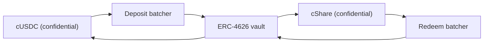

# D'où vient l'argent des lots

Les lots sont du rendement. Le principal de personne n'est jamais payé sous forme de lot, et
c'est ce qui rend le pool sans perte. Cette page couvre l'unique interface que toute source
implémente, la source qui tourne aujourd'hui sur Sepolia, pourquoi la cagnotte refuse de
croire une source sur parole, et comment le Confidential Vault de Zama se branche sur le
réseau principal.

## L'interface

```solidity
interface IYieldSource {
    function harvest() external returns (euint64 transferred); // confidential transfer to the recipient
    function harvestable() external view returns (uint64);      // display only
}
```

Deux fonctions. `harvest` déplace le rendement accumulé vers la cagnotte sous forme de
transfert confidentiel et renvoie le montant chiffré réellement déplacé. `harvestable` sert
à l'affichage de l'application et la cagnotte ne s'en sert jamais pour sa comptabilité.

`harvest` est synchrone à dessein. Elle déplace ce que la source a de prêt à cet instant, et
une source qui produit du rendement de façon asynchrone est censée avoir préparé ce montant
à l'avance plutôt que de faire attendre la cagnotte.

Changer de source est un seul appel du propriétaire sur la cagnotte, `setYieldSource`, et
cela émet `YieldSourceSet`. Rien d'autre dans le système ne sait ni ne se soucie de quelle
source est attachée.

Une source qui échoue n'arrête pas un tirage. La cagnotte attrape l'échec, traite la récolte
de ce tirage comme un zéro chiffré trivial, et émet `HarvestFailed`. La clôture réussit, le
tirage tourne sur la liquidité que les paliers détiennent déjà, et le rendement qui n'a pas
pu bouger est collecté par une récolte ultérieure. Une source cassée ou mal branchée affame
le côté lots ; elle ne peut pas arrêter l'horloge.

Quand une récolte arrive bien, elle est comptabilisée à l'attribution de ce tirage et
offerte à la clôture suivante. Le rendement de la période `p` finance donc les lots du
tirage `p+1`, pas ceux du tirage `p`. C'est ce qui permet de fixer la taille des lots avant
que la graine n'existe.

## Sepolia : la source sponsorisée

`SponsoredYieldSource` est ce qui tourne sur chaque pool en ligne, une instance chacun : les
sept sources sont donc sept soldes distincts de sept jetons différents. Celle du pool USDC
est à `0xCC49DF69eAB6884fD8DD9260902B8A0Abc9D6b91` ; les six autres sont dans
[pools et jetons](pools-and-tokens.md).

Un sponsor appelle la fonction `sponsor` de la source avec le jeton public du pool. La
source l'enveloppe dans le jeton confidentiel et comptabilise exactement ce que le wrapper a
émis, pas ce que le sponsor a demandé. À partir de là, le solde s'écoule au rythme de
`ratePerSecond`, qui sur le pool USDC vaut
`5,555 base units a second, which is 19.998 USDC a period`, et `harvest` envoie à la
cagnotte tout ce qui s'est accumulé. Le débit de chaque pool est réglé en jetons entiers par
heure pour que deux pools sur des horloges différentes se comparent d'un coup d'œil, et
chaque dotation est dimensionnée pour couvrir plus de quatre-vingts tirages.

Une dotation est un don. Il n'existe aucun chemin pour qu'un sponsor la reprenne, et seul le
propriétaire de la source peut changer le débit, ce qui émet `RateChanged`.

Les montants sponsorisés, le débit et chaque récolte sont publics. Ce n'est pas un
compromis : chez PoolTogether, le rendement qu'un coffre apporte est public lui aussi, et
toute taille de lot en découle. Ce qui est confidentiel chez Hearth, c'est qui a épargné
combien et qui a gagné, jamais combien le pool a rapporté.

Si le pool n'a pas d'épargnant pendant un moment, le rendement s'accumule quand même et est
payé aux premiers tirages qui ont des épargnants. Rien n'est bloqué dans un pool vide.

### Pourquoi une simulation

Parce qu'une source simulée n'est honnête que si la documentation dit comment elle
fonctionne et comment une vraie se branche : les deux sont ci-dessous. Nous en avons d'abord
cherché une vraie et il n'en existe pas sur Sepolia qui paie du rendement sur les jetons
simulés de Zama :

| Lieu | Pourquoi non |
| --- | --- |
| Aave | Refuse les dépôts USDC sur Sepolia, plafond d'offre dépassé |
| Compound | Veut l'USDC de Circle, pas la simulation de Zama |
| Le Confidential Vault de Zama | Le coffre Sepolia est un VaultV2 inerte sans adaptateur de rendement, ce qui est la description qu'en donne Zama |

Les options honnêtes étaient donc un nombre fictif qui monte, ou un solde financé par un
sponsor qui existe réellement sur la chaîne et s'écoule réellement. Nous avons pris la
seconde. Chaque unité d'argent de lots sur chacun des sept pools en ligne a réellement été
enveloppée, réellement transférée et réellement vérifiée.

## La cagnotte ne comptabilise jamais un nombre déclaré

C'est la règle qui empêche la source sponsorisée d'être un point faible.

La source effectue un transfert chiffré vers la cagnotte. La cagnotte, en tant que
destinataire, a les droits sur ce chiffré : elle peut donc marquer elle-même le montant
transféré comme publiquement déchiffrable. C'est seulement au moment de l'attribution, après
que `FHE.checkSignatures` a vérifié la signature du service de gestion des clés sur le texte
clair, que la cagnotte crédite quoi que ce soit aux paliers.

Une source qui ment sur ce qu'elle a envoyé n'arrive à rien. La cagnotte comptabilise le
montant arrivé, parce que c'est le seul montant qu'elle regarde.

Ce n'est pas une prudence théorique. Dans notre conception précédente, la cagnotte
comptabilisait les recharges de réserve à partir du montant passé par l'appelant, alors que
le wrapper émet `amount / rate()`. Sur le déploiement réel, `rate()` valait justement 1, les
deux concordaient et le bogue restait latent. Sur un sous-jacent à 18 décimales, où le taux
du wrapper vaut mille milliards, la cagnotte aurait cru à mille milliards de fois plus
d'argent de lots qu'il n'en existait. Nous l'avons exécuté le 2 septembre 2026 contre un
jeton de test à 18 décimales et nous l'avons vu se produire. Une liquidité de lots fantôme
dans un pool sans perte finit par être payée sur le principal de quelqu'un, ce qui est la
seule promesse que le produit ne peut pas rompre. Vérifier le transfert supprime toute cette
classe de problèmes.

## Réseau principal : le Confidential Vault de Zama

Zama publie un protocole dont le travail entier est de produire du rendement sur des soldes
confidentiels, et c'est la source naturelle sur le réseau principal.
`ConfidentialVaultYieldSource` est l'adaptateur de cette conception. Ce qui suit est sa
spécification, pas un contrat de ce dépôt.

C'est un adaptateur par pool, comme tout le reste ici, et chacun a besoin d'un batcher et
d'un coffre de rendement pour son propre jeton. Le déploiement de Zama sur le réseau
principal couvre l'USDC aujourd'hui : un Hearth sur le réseau principal ouvrirait donc le
pool USDC sur le Confidential Vault et tout autre jeton sur la source qui existe pour lui,
ou sur aucune.

La conception est un batcher placé entre les jetons confidentiels et un coffre de rendement
ERC-4626 ordinaire. Un coffre ERC-4626 n'accepte que des transferts publics, donc un
déposant isolé publierait son montant exact. Le batcher met plutôt en commun de nombreux
dépôts chiffrés, ne déchiffre que la somme, effectue un seul dépôt public dans le coffre, et
redistribue des parts confidentielles. Les mots de Zama : « Les observateurs voient qui a
participé, mais pas combien chacun a apporté. »



L'adaptateur rejoint le batcher de dépôt avec le jeton confidentiel du pool et détient des
parts confidentielles. Le rachat suit son propre calendrier, en avance sur la récolte : le
keeper demande périodiquement la croissance au batcher de rachat et fait passer cette
demande par ses quatre étapes, si bien qu'au moment où la cagnotte appelle `harvest`, l'USDC
confidentiel racheté est déjà dans l'adaptateur et la récolte est un simple transfert comme
un autre. C'est ainsi qu'un lieu asynchrone rencontre une interface synchrone. Chacune des
quatre étapes est ouverte à tous, personne n'a donc à attendre l'opérateur de Zama pour les
exécuter.

### Les adresses

D'après le répertoire d'adresses de Zama, consulté le 2 septembre 2026.

**Réseau principal Ethereum, chain id 1.** Actif sous-jacent USDC. Source de rendement :
VaultV2 Morpho « Steakhouse Confidential Prime USDC », restreint pour que le batcher de
dépôt soit le seul déposant du coffre.

| Contrat | Adresse |
| --- | --- |
| Batcher de dépôt | `0x324EA89FD3784036673BfE6Ffee2334A088F40Cc` |
| Batcher de rachat | `0x96Cd3Faa7483783Ac2Eb715f6333361500F1eec9` |
| Wrapper cUSDC | `0xe978F22157048E5DB8E5d07971376e86671672B2` |
| Wrapper cShare | `0x66Bf74E96900D1a19c7070D939D124f2F565C458` |
| Coffre ERC-4626 | `0xbEEF00A59B577423653A1526c7009bdE103F542B` |
| USDC | `0xA0b86991c6218b36c1d19D4a2e9Eb0cE3606eB48` |

**Sepolia, chain id 11155111.** Un environnement de préproduction : l'USDC est une
simulation avec un `mint` public et le coffre est inerte, sans adaptateur de rendement.

| Contrat | Adresse |
| --- | --- |
| Batcher de dépôt | `0x48758559c14d4d92b4C74A99660B6a8dbe85F53b` |
| Batcher de rachat | `0xe94E9afdDd43a19C2914739e9279cb6Fe287BEb0` |
| Wrapper cUSDC | `0x7c5BF43B851c1dff1a4feE8dB225b87f2C223639` |
| Wrapper cShare | `0x7E93d5c150A2178B1fCde0278582Acf59478eA5f` |
| Coffre ERC-4626 (inerte) | `0x6AB54988261AEC573a2CA13cF802d3B1114f864C` |
| Mock USDC | `0x9b5Cd13b8eFbB58Dc25A05CF411D8056058aDFfF` |

Comme le coffre Sepolia est inerte, l'adaptateur est spécifié ici contre l'interface de
batcher publiée par Zama et n'est pas encore écrit. Dire qu'il est en service alors qu'il ne
rapporte rien serait un mensonge que n'importe qui pourrait vérifier en une minute.

### Ce que le brancher signifie en pratique

Le batcher avance en quatre étapes : rejoindre, répartir, finaliser, réclamer. Un lot attend
d'atteindre un âge minimal, puis son total est déchiffré, puis le coffre règle, puis les
participants réclament. Chacune de ces étapes est ouverte à tous : la cagnotte n'attend donc
jamais l'opérateur de Zama, et les réclamations n'expirent jamais.

Ce rythme est plus lent que l'écoulement instantané de la source sponsorisée, raison pour
laquelle le keeper lance le rachat à l'avance plutôt qu'à l'intérieur de `harvest`. Le
contrat de la cagnotte n'attend jamais : il demande à l'adaptateur ce qui a déjà été
récupéré. Ce qui reste comme vrai travail pour passer en production, c'est le contrat
d'adaptateur lui-même, que ce dépôt spécifie mais n'implémente pas, et la partie keeper qui
va avec, à savoir décider à quelle fréquence lancer un rachat et quelle part de la position
racheter, ce qui est un choix de politique sans conséquence sur la chaîne s'il est tardif.

### Ce dont Hearth hériterait

Le nommer correctement fait partie du fait d'être digne de confiance là-dessus.

- **Le risque du coffre, en entier.** Le batcher envoie l'argent dans un coffre ERC-4626
  tiers. Si ce coffre perd de la valeur, le solde porteur de rendement du pool en perd avec
  lui. C'est le seul endroit où le « sans perte » dépendrait du contrat de quelqu'un
  d'autre, et c'est pourquoi un déploiement sur le réseau principal ne devrait y placer que
  la portion porteuse de rendement.
- **Une confidentialité de lot, pas une confidentialité de pool.** Le batcher cache les
  montants parmi les co-participants et déchiffre la somme. Si Hearth était le seul
  participant d'un lot, son montant de dépôt serait public. Cela ne nous coûte rien, puisque
  les récoltes de Hearth sont publiées de toute façon, mais il vaut la peine de le savoir
  avant de supposer que le batcher cache plus qu'il ne cache.
- **Des pouvoirs de propriétaire bornés.** Le propriétaire du batcher peut changer l'âge
  minimal d'un lot (plafonné à 7 jours), l'échéance de rappel (plafonnée à 30 jours), la
  tolérance de dérapage au dépôt, et peut mettre en pause les entrées et les répartitions.
  La documentation de Zama indique que le propriétaire ne peut ni déplacer ni geler les
  fonds des utilisateurs, ne peut pas censurer une issue, ne peut déchiffrer les montants de
  personne, et ne peut pas mettre à jour le contrat. La protection contre le dérapage au
  rachat est désactivée en dur pour que les sorties fonctionnent même pendant une baisse du
  coffre.

## Ce que cette page ne couvre pas

Elle ne couvre pas l'effet de la source de rendement sur le tableau des fuites, qui est dans
[ce qui reste privé](../security/what-stays-private.md). Elle n'évalue pas le rendement du
coffre Morpho, qui est un chiffre appartenant à quelqu'un d'autre et qui change tous les
jours. Et elle ne prétend pas que l'adaptateur tourne : sur Sepolia, c'est la source
sponsorisée qui est attachée, et la carte « Le pool en ce moment » du tableau de bord la
nomme.
