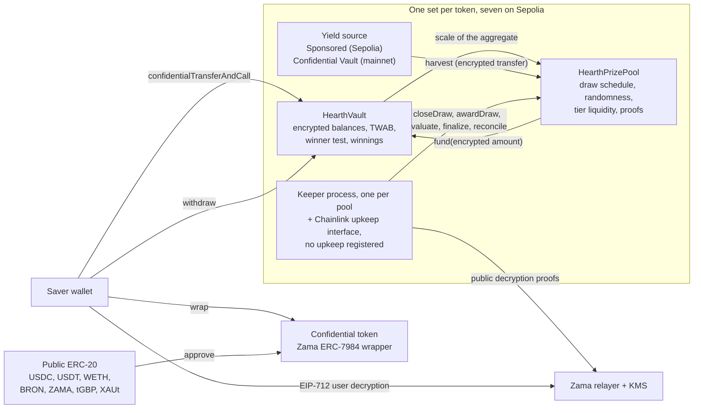

# Ce qu'est Hearth

Hearth est un pool d'épargne où vous ne pouvez pas perdre votre argent et où vous pouvez
gagner un lot. Sept pools tournent sur Sepolia, un par jeton confidentiel, et vous
choisissez un jeton comme vous choisiriez un livret d'épargne.

Vous y placez un jeton confidentiel : USDC, USDT, WETH, BRON, ZAMA, tGBP ou XAUt. Le pool
met cet argent au travail et produit du rendement. À chaque période, le rendement produit
est distribué sous forme de lots, et votre chance de gagner est proportionnelle à combien
vous déteniez et pendant combien de temps. Vous pouvez récupérer votre principal à tout
moment, en totalité. C'est l'idée de « loterie sans perte » inventée par PoolTogether, et
Hearth en est une version confidentielle.

La différence avec PoolTogether, c'est que sur une blockchain ordinaire tout est public.
N'importe qui peut lire combien détient chaque épargnant, quelles sont les chances de
chaque portefeuille, et qui a gagné chaque tirage. Cela publie la fortune des gens et met
une cible dans le dos des plus gros. Hearth fait tourner l'ensemble sur des nombres chiffrés
grâce au protocole de Zama : la chaîne conserve votre solde sous forme de texte chiffré
(des données illisibles sans clé) et le contrat continue à faire les calculs dessus. Votre
solde est un nombre que personne n'a jamais vu, nous compris, et le tirage reste vérifiable
par un inconnu.

## Le système en une image

Deux contrats font le travail. `HearthVault` détient le principal chiffré de chaque
épargnant, ses gains chiffrés, la trace de ce qu'il a détenu et pendant combien de temps,
et c'est lui qui exécute le test du gagnant. `HearthPrizePool` fait tourner l'horloge, tire
la graine aléatoire, collecte le rendement et garde l'argent des lots réparti en paliers. Un
processus keeper pousse le tirage étape par étape, et chacune de ces étapes peut être
exécutée par n'importe qui d'autre à sa place.

Le cadre du milieu, c'est le pool d'un seul jeton. Il y en a sept et ils ne partagent rien :
votre position en USDC et votre position en WETH sont deux épargnants distincts dans deux
coffres distincts, et un pool qui s'arrête laisse les autres tourner. Le pool que vous
regardez est indiqué par la première partie de la barre d'adresse, `/app/usdc` ou
`/app/weth`. La liste complète, avec les adresses, est dans
[pools et jetons](../concepts/pools-and-tokens.md).

## Les quatre gestes

Un épargnant fait quatre gestes. Voici ce que chacun fait et ce qu'il laisse voir.

### 1. Déposer

Vous envoyez le jeton confidentiel de ce pool à son coffre en une transaction. Le montant
voyage sous forme de handle, c'est-à-dire un pointeur vers une valeur chiffrée plutôt que la
valeur elle-même. Le coffre l'ajoute à votre principal chiffré et met à jour la trace de
votre solde dans le temps, sans jamais rien déchiffrer.

- Caché : le montant, votre solde courant, et donc votre part du pool.
- Public : votre adresse, le bloc dans lequel vous l'avez fait, et le fait qu'un dépôt a eu
  lieu.

Il reste un point de fuite. Transformer le jeton public ordinaire en jeton confidentiel est
un transfert ERC-20 public, donc le montant enveloppé est visible. Si vous enveloppez
5,000 USDC et que vous déposez deux blocs plus tard, un observateur a une très bonne
estimation. Hearth garde l'enveloppement et le dépôt comme deux étapes distinctes,
précisément pour que vous puissiez mettre de la distance entre les deux. Voir
[le point de fuite de l'enveloppement](../security/what-stays-private.md).

### 2. Tirer

À la fin de chaque période, le pool clôture le tirage de cette période. En une transaction,
il fixe la taille du lot de chaque palier, puis tire une graine aléatoire chiffrée dans le
coprocesseur de Zama, puis demande au coffre quelle était la taille du pool, puis collecte
le rendement de la période. L'ordre compte : les lots sont dimensionnés avant que le nombre
aléatoire n'existe, donc personne ne peut voir une graine puis réorganiser ce que gagner
rapporte.

« Quelle était la taille du pool » est délibérément flou, et c'est bien le principe. Le
coffre ne publie pas le solde total pondéré par le temps de tous les épargnants additionnés.
Il ne publie que la tranche en puissance de deux dans laquelle ce total tombe : le monde
apprend donc l'ordre de grandeur du pool plutôt que sa taille exacte. Publier le nombre
exact permettrait à quelqu'un de soustraire deux tirages consécutifs et de lire le dépôt
d'un épargnant isolé dans la différence.

Quatre petites valeurs sortent ensuite accompagnées d'une preuve signée par le service de
gestion des clés de Zama, pour que n'importe qui puisse les vérifier : la graine, la
tranche, le fait qu'il y ait eu ou non quelqu'un dans le pool, et le rendement collecté. Le
résultat de chaque épargnant pour ce tirage est fixé dès l'instant où ces nombres sont
vérifiés.

- Caché : le poids de chaque épargnant, le total exact du pool, et chaque résultat
  individuel.
- Public : la graine, la tranche, le rendement collecté, la taille du lot de chaque palier,
  et, un tirage plus tard quand le palier se réconcilie, combien de lots il a payés.

### 3. Réclamer

Il n'y a pas de transaction de réclamation, et c'est tout l'intérêt. L'application a bien un
bouton de réclamation, sur la carte de ce tirage dans « Mes tirages », et il porte le
montant : c'est un retrait ordinaire des gains que vous venez d'ouvrir, et sur la chaîne il
ressemble exactement à n'importe quel autre retrait.

Les gains sont crédités sur un solde chiffré distinct à l'intérieur du coffre pendant
l'évaluation du tirage. Rien de ce que vous faites ne le déclenche et rien de ce que vous
faites ne le révèle. Pour savoir si vous avez gagné, vous signez un message EIP-712, une
signature typée hors chaîne qui prouve que vous contrôlez votre adresse, et le relayer de
Zama renvoie le texte clair de vos propres gains dans votre navigateur. Cette signature ne
touche jamais la chaîne : elle ne coûte rien et ne laisse aucune trace. Votre solde sur le
tableau de bord et le résultat d'un tirage ont chacun leur œil, les deux peuvent être
ouverts en même temps, et la signature du premier sert au second.

- Caché : tout. Lire ses propres gains est une opération hors chaîne.
- Public : rien.

Dans la plupart des protocoles à lots, le gagnant doit envoyer une transaction de
réclamation et le perdant n'a aucune raison de le faire : la liste des transactions nomme
donc discrètement les gagnants. Chez Hearth, il n'y a pas de transaction de ce genre à
envoyer. La transaction qui crédite les lots, `evaluate`, ne peut pas être dirigée vers
soi-même : elle parcourt la liste des épargnants à partir d'un point décidé par la graine du
tirage lui-même, et l'appelant dit seulement de combien la faire avancer.

### 4. Retirer

Une seule fonction sort l'argent : `withdraw`. Elle paie d'abord sur vos gains, ensuite sur
votre principal, et se limite au plus petit des deux montants entre ce que vous détenez et
ce que le coffre détient. Que vous encaissiez un lot, que vous rameniez votre épargne chez
vous, ou les deux à la fois, c'est le même appel, de la même forme, avec le même événement
et un montant chiffré.

La seconde moitié de cette limite existe parce qu'un transfert confidentiel déplace tout le
montant ou rien du tout. Il n'envoie jamais une partie de ce qui a été demandé. Le coffre
calcule donc ce qu'il peut réellement payer avant de demander au jeton de le payer, plutôt
que d'essayer de réparer un manque après coup.

- Caché : le montant, et le fait qu'une partie soit ou non de l'argent gagné.
- Public : votre adresse, le bloc, et le fait qu'un retrait a eu lieu.

Votre principal n'est jamais bloqué. Les dépôts et les retraits restent ouverts pendant
qu'un tirage se déroule, ce qui n'est pas le cas de plusieurs autres conceptions dans ce
domaine.

## Ce qui le rend équitable

Deux choses, et toutes les deux sont vérifiables par un inconnu sans aucun accès
particulier.

La graine aléatoire vient de `FHE.randEuint64`, générée dans le coprocesseur de Zama à
partir d'une graine publique sous la clé FHE du réseau. Personne ne peut la prédire et
personne ne peut la tirer deux fois : clôturer un tirage réussit exactement une fois. Une
fois la période terminée, le pool publie cette graine avec la tranche dans laquelle le total
du pool est tombé, les deux accompagnées d'une preuve que le contrat vérifie sur la chaîne.

À partir de ces deux nombres publics, n'importe qui peut recalculer le seuil exact que
n'importe quelle adresse devait battre dans n'importe quel palier, et le coffre expose la
même arithmétique sous forme de vue pour que personne n'ait à faire confiance à une
réimplémentation. Ce qu'ils ne peuvent pas faire, c'est voir le poids chiffré auquel ce
seuil a été comparé. La règle est donc publique et auditable, et seule l'entrée est privée.
Les détails sont dans
[aléa et vérification](../security/randomness-and-verification.md).

## Ce que Hearth ne cache pas

Version courte, et en entier dans [ce qui reste privé](../security/what-stays-private.md) :

- Qui sont les épargnants, et quand chacun a déposé, retiré ou été évalué.
- La tranche dans laquelle le total du pool est tombé à chaque période, la graine, et le
  rendement collecté.
- La taille du lot de chaque palier, et combien de lots il a payés, publié un tirage plus
  tard.
- Le montant que vous avez enveloppé dans le jeton confidentiel ou désenveloppé.
- Avec un seul épargnant, la tranche publiée donne le poids de cet épargnant à un facteur
  deux près. Avec deux, chacun peut borner l'autre. La confidentialité demande ici trois
  épargnants ou plus, et l'application le dit.
- Les seuils sont publics : quiconque peut identifier votre solde peut donc calculer votre
  résultat à chaque tirage. Cela arrive le plus souvent quand on enveloppe puis qu'on dépose
  le même montant quelques minutes plus tard, et c'est pour cela que l'application sépare
  les deux.
- Envelopper à l'entrée puis désenvelopper entièrement à la sortie publie une borne
  inférieure sur tout ce que vous avez jamais gagné, parce que les deux mouvements sont
  publics au niveau du jeton.
- Un épargnant qui retire juste après chaque tirage qu'il a gagné laisse fuir un indice
  statistique par son propre comportement. Aucun contrat ne peut corriger celui-là.
