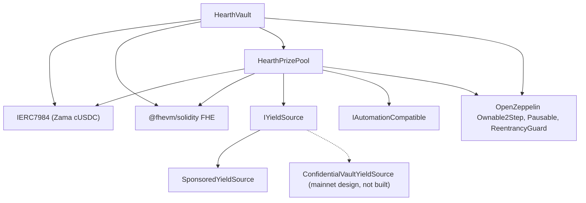

# Déploiement

Un script reproductible, jamais des clics manuels. Cette page donne l'ordre, les paramètres
et ce que chacun signifie, pour qu'un relecteur puisse lire les arguments de constructeur
déployés et savoir qu'ils correspondent.

Hearth déploie un pool par jeton confidentiel : un coffre, une cagnotte et une source de
rendement par jeton, ne partageant rien avec un autre pool. Une exécution ouvre un pool,
parce qu'un nonce de déployeur exécute un déploiement, et le jeton est choisi avec
`HEARTH_TOKEN`. Chaque tâche ensuite prend `--token` :

```
cd packages/contracts
HEARTH_TOKEN=weth npx hardhat deploy --network sepolia
npx hardhat hearth:verify  --network sepolia --token weth
npx hardhat hearth:seed    --network sepolia --token weth
npx hardhat hearth:status  --network sepolia --token weth
```

Omettez les deux et vous obtenez `usdc`, le jeton par défaut du réseau. Un identifiant
inconnu échoue en affichant la liste des pools que ce réseau possède réellement. Les
paramètres de chaque pool vivent dans un seul fichier,
`packages/contracts/hearth.config.ts` : la paire d'actifs, la période, le jeu de paliers, la
tranche initiale, le débit, la dotation, les cinq mises de démonstration et l'indice de
compte avec lequel son keeper signe. Lisez ce fichier à côté des tableaux ci-dessous ; ce
sont les mêmes nombres.

Le déploiement réutilise tout contrat qui a déjà un déploiement enregistré plutôt que de le
remplacer, donc une seconde exécution ne fait rien. Un pool en service détenant l'argent
d'épargnants et des jours d'historique de tirages ne peut jamais être déplacé vers une
adresse neuve en relançant le script. Pour en remplacer un délibérément, supprimez d'abord
son fichier sous `deployments/<network>/`.

Il écrit `deployments/sepolia/hearth.<slug>.json`, qui est ce sur quoi on pointe un keeper
avec `HEARTH_ADDRESSES_FILE` et ce à partir de quoi la liste des pools de l'application est
générée.

## Ce qui dépend de quoi



Les arêtes pleines sont des contrats de ce dépôt. Le nœud en pointillés est la voie de
rendement du réseau principal : l'adaptateur est spécifié contre l'interface de batcher
publiée par Zama et aucun contrat d'adaptateur n'est écrit ici, donc seul
`SponsoredYieldSource` est déployé ci-dessous.

Le coffre et la cagnotte ont chacun besoin de l'autre, donc l'un des deux liens est fait
après le déploiement plutôt que dans un constructeur. C'est pourquoi il y a cinq étapes
ci-dessous et non trois.

## L'ordre

| Étape | Action | Pourquoi ici |
| --- | --- | --- |
| 1 | Déployer `HearthVault` | Il détient l'argent des épargnants et n'a besoin que du jeton pour exister. |
| 2 | Déployer `HearthPrizePool`, pointé sur le coffre | La cagnotte lit l'horloge du coffre et son compteur d'échelle, et paie le coffre. |
| 3 | Relier : `vault.setPrizePool(pool)` | Émet `PrizePoolSet`. Le coffre n'acceptera de financement que de cette adresse. |
| 4 | Déployer la source de rendement, pointée sur la cagnotte comme destinataire | Elle doit savoir où envoyer les récoltes. |
| 5 | Relier : `pool.setYieldSource(source)` | Émet `YieldSourceSet`. Tant que cela n'a pas eu lieu, une clôture ne récolte rien et émet `HarvestFailed`. |

Après l'étape 5, dotez le pool : `hearth:seed --token <slug>` sponsorise la source de
rendement pour que des lots existent et met cinq épargnants de démonstration de tailles
différentes depuis les comptes 2 à 6, pour qu'un premier visiteur arrive sur un pool peuplé
plutôt que vide. Chaque étape vérifie sur la chaîne ce qui est déjà fait, donc une dotation
interrompue par un hoquet du relayer peut être relancée sans risque.

Le keeper de ce pool a besoin de son propre ETH Sepolia, et les cinq épargnants de
démonstration aussi :

```
npx hardhat hearth:spread-gas --network sepolia --token weth
npx hardhat hearth:spread-gas --network sepolia --keepers 10,11,12,13,14,15 --savers false
```

La première commande finance le keeper d'un pool et les épargnants ; la seconde finance
plusieurs comptes keeper en une passe, ce qu'il faut pour ouvrir six pools d'un coup.

Pointez ensuite l'application sur ce qui a été déployé :

```
cd ../web
node scripts/sync-pools.mjs
```

## Les paramètres

```
HearthVault(IERC7984 asset, uint256 periodLength, uint256 firstPeriodAt, address owner)
HearthPrizePool(IHearthVault vault, IERC7984 asset, Tier[3] tiers, uint8 initialScaleBits, address owner)
    Tier = { uint32 prizeCount; uint64 oddsNumerator; uint64 oddsDenominator; uint16 shares; uint16 reconcileEvery }
SponsoredYieldSource(IERC7984ERC20Wrapper asset, address recipient, uint64 ratePerSecond, address owner)
```

### HearthVault

| Paramètre | Signification | Se tromper dessus |
| --- | --- | --- |
| `asset` | Le jeton confidentiel ERC-7984 que les épargnants déposent, l'un des sept de Zama. | Chaque wrapper affiche six décimales, et le déploiement refuse de continuer si la chaîne contredit la configuration. Le taux vers le jeton public en dessous ne vaut pas 1 sur tous les pools : sur la simulation WETH à 18 décimales il vaut mille milliards, donc tout ce qui lit le jeton public doit l'appliquer. |
| `periodLength` (`L`) | Secondes dans une période. Immuable. | Fixe aussi le plafond par épargnant, `(2^64 - 1) / L`. Un `L` trop petit et le plafond est énorme mais les tirages sont bruités ; trop grand et le plafond se resserre. |
| `firstPeriodAt` | Horodatage où commence la période 1. Immuable, et doit être antérieur ou égal au déploiement. | Une valeur future rend `period(now)` indéfini jusqu'à ce qu'elle soit passée. |
| `owner` | Propriétaire en deux temps. La renonciation est désactivée. | Les pouvoirs sont listés dans le [modèle de menaces](../security/threat-model.md). |

`maxPrincipal` est dérivé de `periodLength`, pas réglé. À une heure il vaut environ
5 milliards de jetons, à six heures environ 854 millions, et à un jour environ 213 millions.

Le coffre possède l'horloge. La cagnotte prend l'adresse du coffre et y lit les périodes, il
n'y a donc aucun moyen pour les deux contrats d'être en désaccord sur la période courante.

### HearthPrizePool

| Paramètre | Signification |
| --- | --- |
| `vault` | Le coffre que cette cagnotte sert, et l'horloge qu'elle lit. |
| `asset` | Le même jeton confidentiel que celui du coffre. Ils doivent correspondre. |
| `prizeCount[t]` | Lots par tirage dans le palier `t`. |
| `oddsNumerator[t]`, `oddsDenominator[t]` | Les chances du palier sous forme de fraction, un tirage sur `oddsDenominator / oddsNumerator`. |
| `shares[t]` | La part du palier dans chaque récolte. Les parts sont relatives, donc 40/20/40 et 2/1/2 veulent dire la même chose. |
| `reconcileEvery[t]` | Combien de tirages passent entre deux publications du report de ce palier. |
| `initialScaleBits` | La longueur en bits attendue du poids total de la première période, la supposition de départ du suivi de tranche. |
| `owner` | Comme ci-dessus. |

`UTILISATION` est une constante plutôt qu'un argument : 50 pour cent, à la suite de
PoolTogether V5. C'est la fraction de la liquidité en clair d'un palier utilisée pour
dimensionner chaque lot.

Deux d'entre eux méritent un mot.

`reconcileEvery` est un réglage de confidentialité, pas un réglage de gaz, et il s'arbitre
contre l'apparence de la réserve de lots. Publier le report d'un palier rend public le nombre
de lots de ce palier, et un compte portant sur un seul tirage désigne le petit ensemble des
épargnants éligibles à ce tirage. Le régler plus haut étale le compte sur un intervalle où
presque tout le monde a été éligible à un moment. Ce que cela coûte, c'est le gros lot
visible : une clôture déplace toute la liquidité publique d'un palier dans le tirage et elle
ne revient qu'à une réconciliation, donc un palier à une cadence de 24 publie un lot
dimensionné sur la part de récolte d'un seul tirage sur 23 tirages sur 24, la réserve
accumulée n'apparaissant à découvert que lors du tirage de réconciliation. L'argent est
offert et gagnable pendant tout ce temps à l'intérieur du report chiffré ; il est simplement
invisible. Sepolia fait tourner les trois paliers à 1 pour cette raison et énonce le compte
par tirage comme un résidu. Voir la limite 14.

`initialScaleBits` n'a besoin que d'être proche. Le suivi compare le vrai total à cinq
puissances de deux autour de la supposition courante à chaque clôture et se corrige de trois
bits par tirage au plus, donc une supposition à quelques bits près coûte un tirage ou deux
de chances légèrement mal calibrées puis se stabilise.

### SponsoredYieldSource

| Paramètre | Signification |
| --- | --- |
| `asset` | Le wrapper ERC-7984 qu'elle détient et envoie. Le jeton public que les sponsors versent est le sous-jacent de ce wrapper, ce n'est donc pas un argument séparé. |
| `recipient` | La cagnotte qui reçoit les récoltes. |
| `ratePerSecond` | À quelle vitesse le solde sponsorisé s'écoule sous forme de rendement. |
| `owner` | Règle le débit, en émettant `RateChanged`. |

Sponsoriser est un appel séparé après le déploiement, pas un argument de constructeur. Cela
comptabilise exactement ce que le wrapper a émis plutôt que ce que le sponsor a demandé, et
c'est irréversible.

## Trois jeux de paramètres

Sepolia en fait tourner deux, parce que les pools tournent sur deux horloges.

| Réglage | Sepolia `usdc` | Sepolia, les six autres | Réseau principal, candidat |
| --- | --- | --- | --- |
| Longueur de période | 1 heure | 6 heures | 1 jour |
| Fenêtre | 2 heures (deux périodes) | 12 heures | 2 jours |
| Échéance de clôture | 1 heure 30 après la fin de la période | 9 heures après | 1 jour 12 heures après |
| Plafond par épargnant | Environ 5 milliards de jetons | Environ 854 millions | Environ 213 millions |
| Palier gros lot | nombre 1, chances 1/24, parts 40, réconcilie chaque tirage | nombre 1, chances 1/4, parts 40, réconcilie chaque tirage | nombre 1, chances 1/30, parts 50, réconcilie chaque tirage |
| Palier intermédiaire | nombre 1, chances 1/6, parts 20, réconcilie chaque tirage | nombre 1, chances 1/2, parts 20, réconcilie chaque tirage | nombre 1, chances 1/7, parts 25, réconcilie chaque tirage |
| Palier fréquent | nombre 4, chances 1, parts 40, réconcilie chaque tirage | nombre 4, chances 1, parts 40, réconcilie chaque tirage | nombre 4, chances 1, parts 25, réconcilie chaque tirage |
| Utilisation | 50 pour cent | 50 pour cent | 50 pour cent |
| Source de rendement | `SponsoredYieldSource` | `SponsoredYieldSource` | `ConfidentialVaultYieldSource` sur le batcher de Zama |
| Le gros lot tombe | Environ une fois par jour | Environ une fois par jour | Fixé par les chances choisies |

Les nombres de Sepolia existent pour qu'un visiteur voie un cycle complet en une session :
quatre petits lots à chaque tirage et un gros lot environ quotidien sur l'une comme sur
l'autre horloge. Ce ne sont pas ceux qu'un vrai déploiement utiliserait.

Pourquoi deux horloges. Un tirage à cinq épargnants coûte `8,456,388` de gaz, donc sept pools
tirant toutes les heures dépenseraient environ `1.43 ETH` par jour sur Sepolia, ce que les
faucets publics ne peuvent pas suivre. Six heures ramène cela à quatre tirages par jour et
par pool, environ `0.41 ETH` par jour pour les sept. Les chances sont calées sur la période
propre à chaque pool plutôt que reprises telles quelles, ce qui explique pourquoi la colonne
du milieu affiche 1/4 et 1/2 là où la première affiche 1/24 et 1/6, et pourquoi le gros lot
tombe quand même environ une fois par jour dans les deux cas. Le pool USDC a gardé son
horloge horaire parce qu'il a été déployé le premier et que son historique de tirages y est
classé.

La colonne du réseau principal est une candidate, pas un déploiement. La règle pour la
remplir est celle qui a produit la colonne Sepolia : choisissez combien de tirages vous
voulez entre deux gros lots et réglez les chances du palier gros lot à un sur ce nombre, puis
réglez les parts pour que la taille de lot résultante ait du sens face au rendement que la
source produit réellement, puis décidez la cadence de réconciliation de chaque palier en
pesant un compte de lots qui ne désigne personne contre une réserve que les épargnants
peuvent regarder s'accumuler. Sepolia a pris la seconde ; un déploiement sur le réseau
principal peut prendre la première, et le paragraphe ci-dessus dit ce que chaque côté coûte.
Une période d'un jour avec des chances de gros lot de 1 sur 365 donne un gros lot annuel, qui
est la forme qu'utilise V5.

## Adresses déployées

Sept pools sur Sepolia, chaque contrat vérifié sur Etherscan. La paire de jetons que chacun
détient est celle de Zama et elle est listée dans
[pools et jetons](../concepts/pools-and-tokens.md), avec les mises de départ et le débit par
pool.

| Pool | HearthVault | HearthPrizePool | SponsoredYieldSource | Déployé dans le bloc |
| --- | --- | --- | --- | --- |
| `usdc` | `0x0F93e5db6027b4FB1C76566d24aA2D2E417fAF52` | `0xA0785AacF30B6FE46EDc53CD8A9db1d94FeF5Df2` | `0xCC49DF69eAB6884fD8DD9260902B8A0Abc9D6b91` | `11622398` |
| `usdt` | `0xe54F44dE64F8A7abc0647eaae547dD59ce0EFfac` | `0x6a83Beb2Dc3f258107Cad5e17BC57657fAd4fbd1` | `0x5bb1Cd5380Cb9f2B15569030fF0dB7a445cF54cA` | `11641314` |
| `weth` | `0x3D1A182782B68fE270A66294C9adaC7F005c4f14` | `0x1a11e7C689F244fA8Dd5f4abA8F2F3131090cc1C` | `0x40DF298f15c6136294eC651aD7b0c1C6F221DE8F` | `11641366` |
| `bron` | `0x18086DC8271f8A73c5Ea985fd519527Dbb991279` | `0x2Ed982979CD184494B947a1E38E597494a38ACe4` | `0x0cD1155D752bD81b3a437a6f0B3965CAA2A1C8e9` | `11641408` |
| `zama` | `0xEEC26386F273c6678cA538AcA18e1d9384eA9F09` | `0x873B285404199D46325a294Aa0EC7a79C30A7fF7` | `0xdD352D70311E834ab75307f53d5C276060081d23` | `11641447` |
| `tgbp` | `0xCe95dAa01f5354aA8887A5952E403D26d452c323` | `0xC531D54ee2c695e0eBfe8b8258e9Fd80fd507095` | `0xDEa2BD6351072F735B6ea83c357bF157d83c01af` | `11641484` |
| `xaut` | `0x77f701101d66FbD522A3bFdC2c00DB09a4F57daE` | `0x9a2888aca42c707A3BC0D561FdF6ff8Abfda5201` | `0x03fDdAA7C4323C53CE511CC49D4c33B26B492af7` | `11641523` |

Début de la première période : `1788386400 (2 September 2026, 22:00:00 UTC)` pour `usdc`,
`1788620400 (5 September 2026, 15:00:00 UTC)` pour `usdt`, et
`1788624000 (5 September 2026, 16:00:00 UTC)` pour les cinq restants. `firstPeriodAt` est
immuable et doit être antérieur ou égal au bloc de déploiement, donc le déploiement lit
l'horloge de la chaîne elle-même et arrondit à l'heure inférieure, jamais l'horloge de la
machine.

## Vérification

La vérification fait partie du déploiement, pas d'un après-coup. Un relecteur qui ne peut pas
lire le source déployé doit nous croire sur parole pour toute cette documentation.

1. Vérifiez les trois contrats de ce pool sur Etherscan avec les arguments de constructeur
   enregistrés par le script de déploiement : `hearth:verify --token <slug>` le fait, contrat
   par contrat, et indique lesquels étaient déjà vérifiés.
2. Vérifiez que les arguments de constructeur vérifiés correspondent aux tableaux de
   paramètres ci-dessus. En particulier que la cagnotte a bien reçu son propre coffre et le
   même `asset`, et que le jeu de paliers correspond à la colonne de l'horloge de ce pool.
3. Vérifiez que `vault.prizePool()` est bien la cagnotte de ce pool et que
   `pool.yieldSource()` est bien la source de ce pool, et qu'aucun des deux ne pointe vers
   les contrats d'un autre pool.
4. Vérifiez le jeton : `asset` doit être le wrapper confidentiel de ce pool issu de la liste
   Sepolia publiée par Zama, et `underlying()` doit être la simulation publique en dessous.
   Le `rate()` du wrapper vaut 1 uniquement là où le jeton public affiche lui aussi six
   décimales ; sur le pool WETH il vaut mille milliards, et un taux différent de 1 change ce
   que signifie une unité de base pour tout ce qui touche au jeton public.
5. Lisez `pool.scaleBits()` après quelques tirages et vérifiez qu'il s'est stabilisé près de
   la longueur en bits qu'implique la taille réelle du pool. Un suivi bloqué loin de là
   signifierait que la supposition initiale était très fausse et que la correction n'a pas
   rattrapé.

## Secrets

Rien de sensible n'est jamais codé en dur. Le déploiement lit un fichier `.env`, et
`.env.example` liste chaque clé avec un commentaire indiquant d'où vient sa valeur. La clé du
déployeur et la clé du keeper sont des comptes séparés, donc la clé chaude du keeper n'a
aucun pouvoir de propriétaire.

## Héberger l'application

L'application est un paquet de l'espace de travail Next.js, pas la racine du dépôt, ce qui
est le seul réglage que la plupart des hébergeurs ratent.

| Réglage | Valeur | Pourquoi |
| --- | --- | --- |
| Préréglage de framework | Next.js | Détecté depuis `packages/web/package.json` |
| Répertoire racine | `packages/web` | L'application vit dans un espace de travail npm |
| Inclure les fichiers source hors du répertoire racine | Activé | Les dépendances sont remontées à la racine du dépôt, et la compilation a besoin du `package.json` et du fichier de verrouillage de la racine |
| Commande d'installation | la valeur par défaut, `npm install` | S'exécute à la racine du dépôt et installe tout l'espace de travail |
| Commande de compilation | la valeur par défaut, `next build` | Avec le répertoire racine réglé, elle s'exécute dans `packages/web` |
| Répertoire de sortie | la valeur par défaut, `.next` | Voir l'avertissement ci-dessous |
| Version de Node | 20 ou plus récente | Le `package.json` de la racine fixe `engines.node` |

Ne réglez pas `NEXT_DIST_DIR` dans un environnement hébergé. `packages/web/next.config.ts` le
lit et déplace la sortie de compilation quand il est présent. Il existe pour qu'une
compilation de vérification locale ne se dispute pas le même répertoire `.next` qu'un serveur
de développement en cours. Dans une compilation hébergée, il déplacerait la sortie loin de
l'endroit où l'hébergeur la cherche, et le déploiement échouerait sans rien d'évident à
montrer.

### Variables d'environnement

| Variable | Publique dans le navigateur | D'où vient sa valeur |
| --- | --- | --- |
| `SEPOLIA_RPC_URL` | Non | Votre propre point d'accès Sepolia. La page d'accueil et la route `/api/activity` lisent la chaîne côté serveur, donc celle-ci n'atteint jamais un navigateur. Les requêtes de journaux en ont besoin, parce que le nœud public gratuit plafonne les plages d'`eth_getLogs` bien en dessous d'une journée de blocs |
| `NEXT_PUBLIC_SEPOLIA_RPC_URL` | Oui | Facultative. Les lectures du portefeuille l'utilisent et se rabattent sur `https://ethereum-sepolia-rpc.publicnode.com` quand elle n'est pas définie. Visible dans le bundle, donc il faut que ce soit un point d'accès que vous acceptez de publier |
| `NEXT_PUBLIC_CHAIN_ID` | Oui | `11155111` pour Ethereum Sepolia. L'application s'y rabat si elle n'est pas définie |

Aucune adresse de contrat n'est plus une variable d'environnement. L'application lit chaque
pool dans `packages/web/src/lib/chain/pools.json`, que `node scripts/sync-pools.mjs` génère à
partir des fichiers d'adresses écrits par le script de déploiement : une adresse affichée par
l'application peut donc toujours être remontée à un enregistrement de déploiement plutôt qu'à
quelque chose que quelqu'un a tapé. Lancez ce script après chaque déploiement et versionnez
le résultat. Les trois variables publiques qui portaient autrefois les adresses de coffre, de
cagnotte et de source de rendement d'un pool unique ont disparu ; supprimez-les de tout
environnement qui les définit encore, parce que plus rien ne les lit.

L'actif confidentiel et son ERC-20 sous-jacent sont eux aussi lus depuis le coffre et le
wrapper sur la chaîne, si bien que l'application ne peut pas dialoguer avec un jeton que le
coffre refuserait.

### Après le premier déploiement

1. Ouvrez l'URL de production sur un téléphone. Chaque page doit fonctionner à 375 pixels de
   large.
2. Connectez un portefeuille sur Sepolia et parcourez le chemin de deux minutes du README
   contre le site déployé plutôt que contre localhost.
3. Ouvrez `/verify?pool=<slug>` et collez l'adresse d'un épargnant. Les seuils viennent d'un
   appel de contrat, donc s'ils s'affichent, l'application déployée parle bien au coffre
   déployé de ce pool.
4. Ouvrez le sélecteur de pools et vérifiez que chaque identifiant charge son propre tableau
   de bord, et que le jeton restreint affiche sa page de refus plutôt qu'un écran cassé.

---

## Ce que cette page ne couvre pas

Elle ne couvre pas la conduite des pools après le déploiement, ce qui est
[le keeper](keeper.md), et un processus keeper par pool fait partie de cette page. Elle ne
couvre pas la préparation opérationnelle du réseau principal : l'adaptateur du Confidential
Vault est spécifié contre l'interface de batcher publiée par Zama et n'est pas implémenté
dans ce dépôt, et le passage en production est décrit dans
[source de rendement](../concepts/yield-source.md).
</content>
