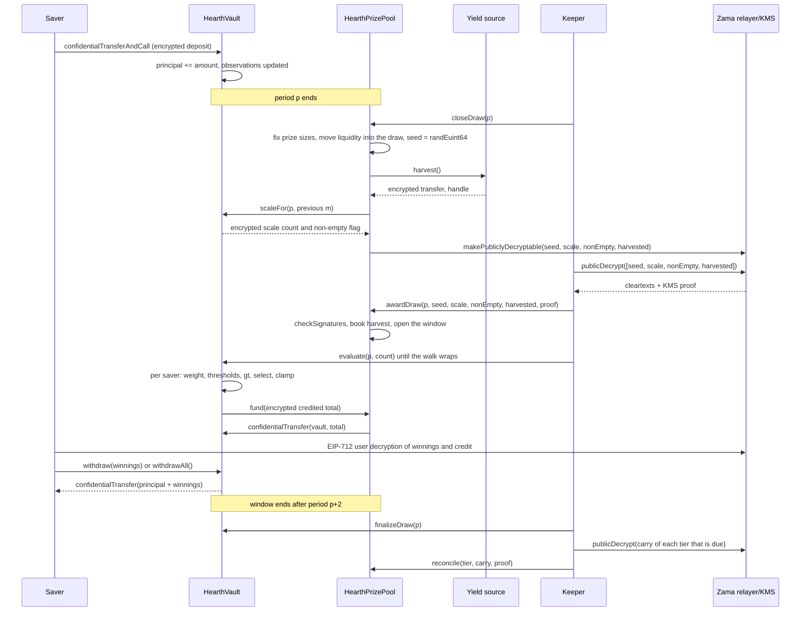

# ड्रॉ कैसे काम करता है

ड्रॉ वह पल है जब पूल की यील्ड इनाम में बदल जाती है। यह पेज पूरी बात सीधे शब्दों में बताता है, फिर वही
कहानी एक डायग्राम के रूप में दिखाता है।

## पीरियड

समय को `L` सेकंड के बराबर पीरियड में काटा जाता है। पीरियड 1 `firstPeriodAt` पर शुरू होता है, यह एक
टाइमस्टैम्प है जो डिप्लॉयमेंट के समय तय होता है और उसके बाद कभी बदला नहीं जाता। उसके आगे का गणित बस
भाग है:

```
period(t)      = (t - firstPeriodAt) / L + 1
periodStart(p) = firstPeriodAt + (p - 1) * L
periodEnd(p)   = periodStart(p + 1)
```

हर पूल का अपना `L` है। Sepolia पर USDC पूल एक घंटे पर चलता है और बाकी छह छह घंटे पर, ताकि एक
विज़िटर एक ही बैठक में पूरा चक्र देख ले। मेननेट पर एक असली डिप्लॉयमेंट एक दिन इस्तेमाल करेगा, जो
PoolTogether V5 इस्तेमाल करता है। पीरियड एक कंस्ट्रक्टर आर्ग्युमेंट है, इसलिए वही कोड तीनों के काम आता है,
और हर पूल की टियर संभावनाएँ उसकी अपनी पीरियड के हिसाब से तय होती हैं।
[पूल और टोकन](pools-and-tokens.md) देखें।

ड्रॉ `p` पीरियड `p` को कवर करता है। यह पूरी तरह उन बैलेंस से तय होता है जो पीरियड `p` के दौरान रखे गए
थे। पीरियड `p` ख़त्म होने के बाद जो कुछ भी होता है वह उसका नतीजा नहीं बदल सकता।

## विंडो, और क्लोज़ करने की आख़िरी समय-सीमा

ड्रॉ `p` का हर स्टेप पीरियड `p+1` और `p+2` के दौरान होता है। यही विंडो है, और यह `periodEnd(p + 2)`
पर ख़त्म होती है। USDC पूल में यह दो घंटे है और बाकी में आधा दिन।

क्लोज़ करने की समय-सीमा बाकी विंडो से ज़्यादा सख़्त है:

```
closeDeadline(p) = periodStart(p + 2) + L / 2
```

यह विंडो के दूसरे पीरियड का बीच है, यानी विंडो का तीन चौथाई हिस्सा बीत जाने पर। उसके बाद किया गया क्लोज़
मना कर दिया जाता है।

वजह यह है कि क्लोज़ और अवॉर्ड एक ही ब्लॉक साझा नहीं कर सकते। क्लोज़ चेन पर वैल्यू को डिक्रिप्ट होने लायक
चिह्नित करता है, प्लेनटेक्स्ट Zama के रिलेयर से ऑफ़ चेन वापस आते हैं, और अवॉर्ड उन्हें चेन पर वेरिफ़ाई करता
है। विंडो के आख़िरी सेकंडों में किया गया क्लोज़ इस आने-जाने के लिए कोई जगह नहीं छोड़ेगा, और ड्रॉ हमेशा के
लिए `Closed` में अटक जाएगा। यह समय-सीमा इस आने-जाने, अवॉर्ड और हर मूल्यांकन बैच के लिए कम से कम
आधा पीरियड की गारंटी देती है।

विंडो यह भी तय करती है कि वॉल्ट को बैलेंस कितने पीछे तक याद रखने हैं, और यही वजह है कि हर बचतकर्ता के
तीन सेव किए गए ऑब्ज़र्वेशन काफ़ी होते हैं।
[समय-भारित बैलेंस](time-weighted-balance.md) देखें।

## पाँच स्टेप

हर स्टेप बिना अनुमति के है। कोई भी इनमें से कोई भी कॉल कर सकता है, ऐप से कोई बचतकर्ता भी। कीपर बस वह
अड्रेस है जो आमतौर पर सबसे पहले पहुँच जाता है।

### 1. क्लोज़

`closeDraw(p)`, पीरियड `p` ख़त्म होने के बाद और `closeDeadline(p)` से पहले।

इस एक ट्रांज़ैक्शन में पाँच चीज़ें होती हैं, इसी क्रम में:

- **इनाम के आकार तय हो जाते हैं।** हर टियर के इनाम का आकार और इस ड्रॉ के लिए वह जितनी लिक्विडिटी
  लगा रहा है, दोनों उस पैसे से निकाले जाते हैं जो उस टियर के पास अभी है, और वह लिक्विडिटी ड्रॉ में चली जाती
  है। यह रैंडम सीड के अस्तित्व में आने से पहले होता है।
- **सीड निकाला जाता है।** `FHE.randEuint64()` Zama के कोप्रोसेसर के अंदर चलता है, इसलिए वह संख्या
  सिर्फ़ सिफरटेक्स्ट के रूप में मौजूद है और उसे किसी ने देखा नहीं है।
- **वॉल्ट बताता है कि पीरियड का कुल भार कहाँ बैठता है**, एक छोटी एन्क्रिप्टेड गिनती और एक एन्क्रिप्टेड फ़्लैग
  के रूप में जो कहता है कि किसी ने कोई बैलेंस रखा भी था या नहीं। कुल भार खुद नहीं, और अभी खुले में भी नहीं।
  अगला सेक्शन देखें।
- **यील्ड सोर्स हार्वेस्ट किया जाता है**, पूल को एक एन्क्रिप्टेड ट्रांसफ़र के रूप में। अगर सोर्स रिवर्ट हो जाए, तो
  भी क्लोज़ सफल होता है: हार्वेस्ट को एक मामूली एन्क्रिप्टेड शून्य माना जाता है और एक `HarvestFailed` इवेंट
  निकलता है। एक ख़राब यील्ड सोर्स घड़ी नहीं रोक सकता।
- **चार हैंडल सार्वजनिक रूप से डिक्रिप्ट होने लायक चिह्नित होते हैं:** सीड, स्केल काउंट, नॉन-एम्प्टी फ़्लैग और
  हार्वेस्ट। यह Zama की ऐक्सेस कंट्रोल लिस्ट पर एकतरफ़ा फ़्लैग है। उस पल से कोई भी रिलेयर से उनका
  प्लेनटेक्स्ट माँग सकता है, और यह फ़्लैग वापस नहीं लिया जा सकता। ड्रॉ के बारे में और कुछ भी कभी इस तरह
  चिह्नित नहीं होता।

ड्रॉ की स्थिति `Closed` पर चली जाती है। क्लोज़ ठीक एक बार सफल होता है, इसीलिए कोई सीड दोबारा नहीं
निकाल सकता।

ट्रांज़ैक्शन के अंदर का क्रम ही असली बात है। इनाम के आकार सीड के अस्तित्व में आने से पहले तय हो जाते हैं,
इसलिए कोई सीड को आते देखकर, यह समझकर कि वह जीत गया, फिर पूल का पैसा इधर-उधर करके उस जीत को
बड़ा नहीं बना सकता।

### टोटल की जगह वॉल्ट क्या प्रकाशित करता है

पीरियड के लिए पूल का कुल समय-भारित बैलेंस, जिसे `W` लिखा जाता है, कभी प्रकाशित नहीं होता। 3 सितंबर
2026 तक डिज़ाइन यही था कि उसे ठीक-ठीक प्रकाशित किया जाए, और एक समीक्षा ने उसे तोड़ दिया: लगातार दो
पीरियड के लिए `W` सार्वजनिक हो, और किसी बचतकर्ता के अपने डिपॉज़िट या निकासी का सार्वजनिक टाइमस्टैम्प
हो, तो जिस बचतकर्ता ने अकेले उस पीरियड में पैसा हिलाया, उसकी ठीक रकम गणित से निकाल ली जाती है।
अंदाज़ा नहीं, ठीक रकम। यह [क्या निजी रहता है](../security/what-stays-private.md) में लिखा है।

अब जो प्रकाशित होता है वह वह ब्रैकेट है जिसमें `W` गिरता है: उसके बराबर या उससे ऊपर की सबसे छोटी दो की
घात, जिसे `M = 2^m` लिखा जाता है। वॉल्ट इसे एन्क्रिप्शन के नीचे ट्रैक करता है। हर क्लोज़ पर वह `W` की
तुलना पिछले ड्रॉ के `m` के आसपास की पाँच दो-की-घातों से करता है, नतीजों को जोड़कर एक छोटी एन्क्रिप्टेड
गिनती बनाता है, और उस गिनती को सार्वजनिक रूप से डिक्रिप्ट होने लायक चिह्नित करता है। पूल वेरिफ़ाई की गई
गिनती से नया `m` निकाल लेता है। 1 के मुक़ाबले एक अलग एन्क्रिप्टेड तुलना नॉन-एम्प्टी फ़्लैग देती है, जो
बताता है कि किसी ने कोई बैलेंस रखा भी था या नहीं।

तो एक देखने वाला हर ड्रॉ पर एक ही बात सीखता है: पूल ने दो की कोई घात पार की या नहीं। दो पार करने के बीच
वह कुछ नया नहीं सीखता। हर ड्रॉ `W` के बजाय `M` के मुक़ाबले चलता है, और यही वजह है कि नीचे बताई गई
इनाम गिनतियाँ उस तरह जुड़ती हैं जैसे वे जुड़ती हैं।

### 2. अवॉर्ड

`awardDraw(p, seed, scaleCount, nonEmpty, harvested, proof)`।

जो भी इसे कॉल करता है वह चारों प्लेनटेक्स्ट Zama के रिलेयर से लाता है, जो उन्हें की मैनेजमेंट सर्विस (KMS)
के हस्ताक्षर के साथ लौटाता है, यानी उन पक्षों का समूह जो नेटवर्क की डिक्रिप्शन की रखता है। कॉन्ट्रैक्ट एक भी
संख्या पर भरोसा करने से पहले उस हस्ताक्षर को चेन पर `FHE.checkSignatures` से वेरिफ़ाई करता है। प्रूफ़
हैंडल से एक तय क्रम में बँधा होता है, `[seed, scaleCount, nonEmpty, harvested]`, इसलिए चारों वैल्यू
न आपस में बदली जा सकती हैं और न किसी दूसरे ड्रॉ पर दोबारा चलाई जा सकती हैं।

फिर:

- वेरिफ़ाई किया गया हार्वेस्ट टियरों को उनके शेयर भार के हिसाब से क्रेडिट किया जाता है। इनाम का पैसा सिर्फ़
  इसी रास्ते से आता है, और वह इस ड्रॉ के बजाय टियरों में जाकर बैठता है, इसलिए वह अगले क्लोज़ पर पेश
  होता है। पूल कभी वह रकम दर्ज नहीं करता जो यील्ड सोर्स ने अपने बारे में बताई हो।
- अगर नॉन-एम्प्टी फ़्लैग कहता है कि पीरियड `p` में किसी ने कोई बैलेंस नहीं रखा, तो ड्रॉ `Empty` चिह्नित
  होता है और जो लिक्विडिटी वह पेश कर रहा था वह सीधे टियरों में लौट जाती है।
- वरना ड्रॉ खुल जाता है। सीड और ब्रैकेट `M` अब सार्वजनिक संख्याएँ हैं।
- अगर कोई अवॉर्ड करते समय विंडो पहले ही बंद हो चुकी है, तो हार्वेस्ट फिर भी क्रेडिट होता है, पेश की गई
  लिक्विडिटी फिर भी टियरों में लौट जाती है, और ड्रॉ `Skipped` चिह्नित होता है। उस पीरियड में कोई इनाम
  नहीं मिलता, और कोई यील्ड या लिक्विडिटी नहीं खोती।

ड्रॉ की पाँच स्थितियाँ हैं `None`, `Closed`, `Awarded`, `Empty` और `Skipped`।

**यही वह पल है जब विजेता तय हो जाते हैं।** यहाँ से सीड एक सार्वजनिक संख्या है, ब्रैकेट एक सार्वजनिक
संख्या है, और पीरियड `p` के लिए हर बचतकर्ता का भार अब बदल नहीं सकता। हर बचतकर्ता को जो थ्रेशोल्ड
पार करने हैं वे सार्वजनिक इनपुट पर किया गया गणित हैं। आगे आने वाला मूल्यांकन कुछ भी तय नहीं करता। वह
सिर्फ़ उस नतीजे को लिखता है जो पहले से मौजूद है।

### 3. इवैल्युएट

वॉल्ट पर `evaluate(p, count)`, जितनी बार ज़रूरत हो, जब तक विंडो खुली है।

कॉलर बताता है कि कितने बचतकर्ता आगे बढ़ाने हैं। वह यह नहीं बताता कि कौन से। वॉल्ट बचतकर्ताओं की सूची में
हर ड्रॉ के अपने कर्सर से चलता है जो `seed mod saverCount` पर शुरू होता है और सूची के क्रम में आगे बढ़ता
है, ज़्यादा से ज़्यादा `count` बचतकर्ता करता है और उनमें से ज़्यादा से ज़्यादा `4` जिन्हें एन्क्रिप्टेड काम
चाहिए। जिन बचतकर्ताओं का पीरियड `p` पर या उससे पहले कोई ऑब्ज़र्वेशन नहीं है उनका भार शून्य है, और उन्हें
उनके प्लेनटेक्स्ट टाइमस्टैम्प से बिना किसी एन्क्रिप्टेड लागत के छोड़ दिया जाता है।

वॉक जिस भी बचतकर्ता तक पहुँचती है, उसके लिए वॉल्ट पीरियड `p` का उसका एन्क्रिप्टेड भार पढ़ता है,
सार्वजनिक थ्रेशोल्ड के मुक़ाबले विजेता टेस्ट चलाता है, और नतीजे को उसकी एन्क्रिप्टेड जीत की रकम में जोड़ देता
है। वह उस ड्रॉ के लिए उस बचतकर्ता का एन्क्रिप्टेड भार और एन्क्रिप्टेड क्रेडिट सहेजता है, दोनों सिर्फ़ उसी
बचतकर्ता के पढ़ने लायक, ताकि ऐप दिखा सके "आपने ड्रॉ p में X जीता" और वह ख़ुद तुलना जाँच सके। फिर वह
प्राइज़ पूल से उस बैच का क्रेडिट किया गया एन्क्रिप्टेड कुल खींच लेता है।

कोई नहीं चुनता कि किसका मूल्यांकन हो और किस क्रम में हो। जो बचतकर्ता अपना नतीजा चाहता है वह वही वॉक
आगे बढ़ाता है जो बाकी सब आगे बढ़ाते हैं, इसलिए इवैल्युएट ट्रांज़ैक्शन भेजने से यह पता नहीं चलता कि आप जीते
या नहीं। शुरुआती बिंदु हर ड्रॉ पर बदलता है, क्योंकि वह उस ड्रॉ के सीड से आता है, इसलिए कोई अड्रेस हमेशा
कतार में आख़िरी नहीं रहता।

`evaluate` उस ड्रॉ पर रिवर्ट हो जाता है जो `Empty` है, `Skipped` है, या जिसे अभी अवॉर्ड नहीं किया गया है।

### 4. फ़ाइनलाइज़

`finalizeDraw(p)`, विंडो बंद हो जाने के बाद।

हर टियर ने जो पेश किया था और जो चुकाया नहीं गया, वह उस टियर के एन्क्रिप्टेड कैरी में मोड़ दिया जाता है।
कैरी एक चलता हुआ जोड़ है जो एन्क्रिप्टेड ही रहता है और एक ड्रॉ से दूसरे ड्रॉ तक साथ चलता है। इसे हर क्लोज़ पर
उस टियर की पेश की गई लिक्विडिटी में जोड़ा जाता है, इसलिए बिना चुकाया पैसा तुरंत फिर खेल में आ जाता है,
भले ही उसका आकार अब भी गुप्त हो।

फ़ाइनलाइज़ करना एक ग्लोबल एन्क्रिप्टेड काउंटर का मौजूदा हैंडल भी प्रकाशित करता है, जो बताता है कि पूल
कितना फंड नहीं कर पाया। वेरिफ़ाई किए गए हार्वेस्ट के साथ यह हमेशा शून्य रहता है।

### 5. रिकंसाइल

पूल पर `reconcile(tier, carry, proof)`, एक बार में एक टियर, और सिर्फ़ तब जब उस टियर की बारी हो।

हर टियर उस कैडेंस पर रिकंसाइल करता है जो डिप्लॉयमेंट के समय `reconcileEvery[t]` ड्रॉ के रूप में तय हुई
थी। Sepolia पर हर टियर की बारी हर ड्रॉ पर आती है। जब किसी टियर की बारी होती है, तो `finalizeDraw`
उसके कैरी को सार्वजनिक रूप से डिक्रिप्ट होने लायक चिह्नित करता है और `CarryPublished` निकालता है। कोई
भी प्लेनटेक्स्ट ला सकता है, KMS प्रूफ़ के साथ `reconcile` कॉल कर सकता है, और वेरिफ़ाई की गई संख्या उस
टियर की प्लेनटेक्स्ट लिक्विडिटी में वापस दर्ज हो जाती है। वॉल्ट उसी संख्या को कैरी में से घटा देता है, जो
इस बीच बढ़ चुका हो सकता है, और `TierReconciled` निकलता है।

रिकंसाइल करना ही उस टियर की इनाम गिनती को सार्वजनिक बनाता है, क्योंकि कैरी वही हिस्सा है जो पेश किया
गया था और जिसे कोई नहीं जीता। एक की कैडेंस पर, हर टियर की गिनती उस ड्रॉ के एक ड्रॉ बाद सार्वजनिक हो
जाती है जिससे वह जुड़ी है, और हर टियर का पूरा पॉट फिर खुले में आ जाता है जहाँ ऐप उसे बढ़ता हुआ दिखा सके।
कैडेंस बढ़ाने से वह गिनती उतने ड्रॉ तक छिपी रहती है और उसके साथ बढ़ता हुआ पॉट भी छिपा रहता है, यही सौदा
[इनाम और टियर](prizes-and-tiers.md) में रखा गया है। किसी भी तरह कुछ भी हवा नहीं होता, और किसी भी
कैडेंस पर आपको कभी पता नहीं चलता कि कौन जीता।

## अगर कोई स्टेप कभी न हो तो क्या होता है

- **क्लोज़ कभी नहीं होता।** ड्रॉ `None` ही रहता है और छोड़ दिया जाता है। उसकी लिक्विडिटी कभी हिली ही
  नहीं, इसलिए वह टियरों में ही रहती है और अगले ड्रॉ पर पेश होती है। हार्वेस्ट अगले क्लोज़ पर इकट्ठा हो जाता है।
- **अवॉर्ड विंडो के अंदर कभी नहीं होता।** देर से किया गया अवॉर्ड फिर भी हार्वेस्ट दर्ज करता है, पेश की गई
  लिक्विडिटी टियरों में लौटाता है, और ड्रॉ को `Skipped` चिह्नित करता है।
- **कोई इवैल्युएट नहीं करता।** हर टियर की पूरी पेशकश फ़ाइनलाइज़ेशन पर उसके कैरी में मुड़ जाती है और
  अगले रिकंसाइल पर वापस आ जाती है।

कुछ भी फँसता नहीं और कुछ भी खोता नहीं। अटका हुआ कीपर पूल को एक ड्रॉ का नुक़सान देता है, पैसे का नहीं।
[कीपर वाला पेज](../operations/keeper.md) देखें।

## पैसा कभी किसी रिपोर्ट के भरोसे नहीं हिलता

दो नियम हिसाब-किताब को धोखा देना मुश्किल बना देते हैं।

यील्ड कभी भरोसे पर नहीं ली जाती। सोर्स पूल को एक एन्क्रिप्टेड ट्रांसफ़र करता है, पूल उसका पाने वाला है और
इसलिए उस सिफरटेक्स्ट पर उसे अनुमति है, और तभी पूल उसे प्रकाशित करता है और KMS से वेरिफ़ाई किया गया
प्लेनटेक्स्ट दर्ज करता है। एक बग वाला या दुश्मन यील्ड सोर्स अपने दावे से कम भेज सकता है; वह पूल को ऐसे
इनाम के पैसे पर यक़ीन नहीं करा सकता जो कभी आया ही नहीं। यह इसलिए मायने रखता है क्योंकि नक़ली इनाम
लिक्विडिटी आख़िरकार किसी न किसी के मूलधन में से चुकानी पड़ती।

भुगतान खींचे जाते हैं, धकेले नहीं जाते। हर मूल्यांकन बैच के बाद वॉल्ट पूल को एन्क्रिप्टेड बैच कुल पर थोड़ी देर
की अनुमति देता है, पूल टोकन को वही अनुमति देता है, और टोकन ठीक उतनी रकम पूल से वॉल्ट में ले जाता है।
अगर पूल के पास कम पड़ जाए, तो वॉल्ट उस कमी को ग्लोबल एन्क्रिप्टेड अनफंडेड काउंटर में दर्ज कर देता है, जो
फ़ाइनलाइज़ेशन पर सबके जाँचने के लिए प्रकाशित होता है। वेरिफ़ाई किए गए हार्वेस्ट के साथ वह काउंटर हमेशा
शून्य रहता है।

## पूरा ड्रॉ, शुरू से आख़िर तक



## यह पेज क्या नहीं बताता

यह नहीं बताता कि किसी बचतकर्ता का भार एक पीरियड में कैसे बनता है, वह
[समय-भारित बैलेंस](time-weighted-balance.md) है, न ही विजेता टेस्ट का गणित, वह
[विजेता चुनाव](winner-selection.md) है, न ही हर इनाम कितना बड़ा है, वह
[इनाम और टियर](prizes-and-tiers.md) है।
