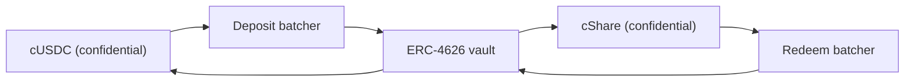

# इनाम का पैसा कहाँ से आता है

इनाम यील्ड से आते हैं। किसी का मूलधन कभी इनाम के तौर पर नहीं दिया जाता, और यही बात पूल को नो-लॉस
बनाती है। यह पेज बताता है: वह एक इंटरफ़ेस जिसे हर सोर्स लागू करता है, वह सोर्स जो आज Sepolia पर
चल रहा है, पूल किसी सोर्स की कही बात पर भरोसा क्यों नहीं करता, और मेननेट पर Zama का अपना
Confidential Vault कैसे जुड़ता है।

## इंटरफ़ेस

```solidity
interface IYieldSource {
    function harvest() external returns (euint64 transferred); // confidential transfer to the recipient
    function harvestable() external view returns (uint64);      // display only
}
```

दो फ़ंक्शन। `harvest` जमा हुई यील्ड को गोपनीय ट्रांसफ़र के रूप में प्राइज़ पूल में भेजता है और
जितनी रकम सच में गई, उसका एन्क्रिप्टेड मान लौटाता है। `harvestable` सिर्फ़ ऐप में दिखाने के लिए
है, पूल इसे हिसाब-किताब के लिए कभी इस्तेमाल नहीं करता।

`harvest` जानबूझकर सिंक्रोनस है। यह उस पल में सोर्स के पास जो तैयार है उसे भेज देता है, और जो
सोर्स एसिंक्रोनस तरीके से कमाता है उससे उम्मीद है कि वह रकम पहले से तैयार रखे, न कि पूल को
इंतज़ार कराए।

सोर्स बदलना पूल पर ओनर की एक ही कॉल है, `setYieldSource`, और यह `YieldSourceSet` इवेंट निकालती
है। सिस्टम के बाकी किसी हिस्से को यह न पता होता है न फ़र्क पड़ता है कि कौन सा सोर्स जुड़ा है।

जो सोर्स रिवर्ट हो जाता है वह ड्रॉ को नहीं रोकता। पूल उस नाकामी को पकड़ता है, उस ड्रॉ के हार्वेस्ट
को एक मामूली एन्क्रिप्टेड शून्य मान लेता है, और `HarvestFailed` इवेंट निकालता है। क्लोज़ सफल होता
है, ड्रॉ उसी लिक्विडिटी पर चलता है जो टियर पहले से रखे हैं, और जो यील्ड नहीं जा पाई वह बाद के किसी
हार्वेस्ट में आ जाती है। टूटा हुआ या ग़लत जुड़ा सोर्स इनाम वाले हिस्से को भूखा रखता है, घड़ी को रोक
नहीं सकता।

जब कोई हार्वेस्ट पहुँचता है, तो वह उस ड्रॉ के अवॉर्ड पर दर्ज होता है और अगले क्लोज़ पर पेश किया
जाता है। यानी पीरियड `p` की यील्ड ड्रॉ `p+1` के इनामों को फंड करती है, ड्रॉ `p` के नहीं। यही वजह
है कि सीड बनने से पहले ही इनामों का आकार तय हो सकता है।

## Sepolia: स्पॉन्सर्ड सोर्स

हर लाइव पूल पर `SponsoredYieldSource` ही चलता है, हर पूल पर एक इंस्टेंस, इसलिए सात सोर्स सात
अलग टोकन के सात अलग बैलेंस हैं। USDC पूल वाला
`0xCC49DF69eAB6884fD8DD9260902B8A0Abc9D6b91` पर है, बाकी छह
[पूल और टोकन](pools-and-tokens.md) में हैं।

स्पॉन्सर पूल के सार्वजनिक टोकन के साथ सोर्स का अपना `sponsor` फ़ंक्शन कॉल करता है। सोर्स उसे
गोपनीय टोकन में रैप करता है और ठीक उतना ही दर्ज करता है जितना रैपर ने मिंट किया, न कि जितना
स्पॉन्सर ने माँगा। वहाँ से बैलेंस `ratePerSecond` की रफ़्तार से टपकता है, जो USDC पूल पर
`5,555 base units a second, which is 19.998 USDC a period` है,
और `harvest` जो कुछ जमा हुआ है उसे पूल को भेज देता है। हर पूल की दर पूरे टोकन प्रति घंटे में तय
की गई है ताकि अलग-अलग घड़ियों पर चलने वाले दो पूल एक नज़र में तुलना किए जा सकें, और हर स्पॉन्सरशिप
अस्सी से ज़्यादा ड्रॉ चलाने लायक रखी गई है।

स्पॉन्सरशिप एक दान है। स्पॉन्सर के पास उसे वापस लेने का कोई रास्ता नहीं है, और ड्रिप रेट सिर्फ़
सोर्स का ओनर बदल सकता है, जिस पर `RateChanged` इवेंट निकलता है।

स्पॉन्सर की रकम, ड्रिप रेट और हर हार्वेस्ट सार्वजनिक हैं। यह कोई समझौता नहीं है: PoolTogether में
भी वॉल्ट कितनी यील्ड देता है यह सार्वजनिक होता है, और हर इनाम का आकार उसी से निकलता है। Hearth
में गोपनीय यह है कि किसने कितनी बचत की और कौन जीता, यह कभी नहीं कि पूल ने कितना पैसा कमाया।

अगर पूल में कुछ समय तक कोई बचतकर्ता न हो, तब भी यील्ड जमा होती रहती है और उन पहले ड्रॉ को दी जाती
है जिनमें बचतकर्ता होते हैं। खाली पूल में कुछ भी फँसा नहीं रहता।

### आख़िर मॉक ही क्यों

क्योंकि मॉक सोर्स तभी ईमानदार है जब डॉक्स बताएँ कि वह कैसे काम करता है और असली सोर्स कैसे जुड़ता
है, दोनों नीचे हैं। हमने पहले असली सोर्स ढूँढा और Sepolia पर ऐसा कोई नहीं है जो Zama के मॉक टोकन
पर यील्ड देता हो:

| जगह | क्यों नहीं |
| --- | --- |
| Aave | Sepolia पर USDC डिपॉज़िट नहीं लेता, सप्लाई कैप पार हो चुका है |
| Compound | Circle का अपना USDC चाहता है, Zama का मॉक नहीं |
| Zama का Confidential Vault | Sepolia वाला वॉल्ट सिर्फ़ आइडल रहने वाला VaultV2 है जिसमें कोई यील्ड अडैप्टर नहीं, और यह Zama का अपना विवरण है |

तो ईमानदार विकल्प दो थे: एक नकली नंबर जो बढ़ता जाए, या स्पॉन्सर से फंड किया गया बैलेंस जो सच में
चेन पर मौजूद है और सच में टपकता है। हमने दूसरा चुना। सातों लाइव पूल पर इनाम के पैसे की हर इकाई सच
में रैप हुई, सच में ट्रांसफ़र हुई और सच में वेरिफ़ाई हुई।

## पूल कभी बताई गई रकम दर्ज नहीं करता

यही वह नियम है जो स्पॉन्सर्ड सोर्स को कमज़ोर कड़ी बनने से रोकता है।

सोर्स पूल को एक एन्क्रिप्टेड ट्रांसफ़र करता है। पूल, पाने वाला होने के नाते, उस सिफरटेक्स्ट पर
अनुमति रखता है, इसलिए वह ट्रांसफ़र हुई रकम को ख़ुद सार्वजनिक रूप से डिक्रिप्ट होने लायक चिह्नित कर
सकता है। पूल टियर में कुछ भी सिर्फ़ अवॉर्ड के समय क्रेडिट करता है, तब जब `FHE.checkSignatures`
प्लेनटेक्स्ट पर की मैनेजमेंट सर्विस के हस्ताक्षर की जाँच कर लेता है।

जो सोर्स झूठ बोले कि उसने कितना भेजा, उसे कुछ हासिल नहीं होता। पूल वही रकम दर्ज करता है जो पहुँची,
क्योंकि वही एकमात्र रकम है जिसे वह कभी देखता है।

यह कोई सैद्धांतिक सावधानी नहीं है। हमारे पिछले डिज़ाइन में पूल रिज़र्व टॉप-अप को उस रकम से दर्ज
करता था जो कॉल करने वाले ने दी थी, जबकि रैपर `amount / rate()` मिंट करता है। लाइव डिप्लॉयमेंट पर
`rate()` संयोग से 1 था इसलिए दोनों बराबर निकले और बग छिपा रहा। 18 दशमलव वाले अंतर्निहित टोकन पर,
जहाँ रैपर की दर एक लाख करोड़ होती है, पूल असल से एक लाख करोड़ गुना ज़्यादा इनामी पैसा मान लेता। हमने
2 सितंबर 2026 को 18 दशमलव वाले एक टेस्ट टोकन पर यह चलाकर देखा और ऐसा ही होते देखा। नो-लॉस पूल में
भूतिया इनामी लिक्विडिटी आख़िरकार किसी न किसी के मूलधन से चुकाई जाती है, और यही वह एक वादा है जिसे
यह प्रोडक्ट तोड़ नहीं सकता। ट्रांसफ़र की जाँच करना इस पूरी श्रेणी को ख़त्म कर देती है।

## मेननेट: Zama का Confidential Vault

Zama एक ऐसा प्रोटोकॉल देता है जिसका पूरा काम गोपनीय बैलेंस पर यील्ड कमाना है, और मेननेट के लिए वही
स्वाभाविक सोर्स है। उस डिज़ाइन में अडैप्टर `ConfidentialVaultYieldSource` है। आगे जो है वह उसका
स्पेसिफिकेशन है, इस रिपॉज़िटरी का कोई कॉन्ट्रैक्ट नहीं।

यहाँ बाकी हर चीज़ की तरह, हर पूल के लिए एक अडैप्टर होता है, और हर एक को अपने टोकन के लिए एक बैचर
और एक यील्ड वॉल्ट चाहिए। Zama का मेननेट डिप्लॉयमेंट आज USDC को कवर करता है, इसलिए मेननेट वाला
Hearth USDC पूल Confidential Vault पर खोलेगा और बाकी कोई भी टोकन उस सोर्स पर जो उसके लिए मौजूद
हो, या किसी पर नहीं।

डिज़ाइन यह है कि गोपनीय टोकन और एक साधारण ERC-4626 यील्ड वॉल्ट के बीच एक बैचर बैठता है। ERC-4626
वॉल्ट सिर्फ़ सार्वजनिक ट्रांसफ़र लेता है, इसलिए अकेला डिपॉज़िट करने वाला अपनी ठीक-ठीक रकम सार्वजनिक
कर देता। इसके बजाय बैचर कई एन्क्रिप्टेड डिपॉज़िट को एक साथ जोड़ता है, सिर्फ़ जोड़ को डिक्रिप्ट करता
है, वॉल्ट में एक सार्वजनिक डिपॉज़िट करता है, और बदले में गोपनीय शेयर लौटाता है। Zama के अपने
शब्दों में: "देखने वालों को पता चलता है कि कौन शामिल हुआ, यह नहीं कि किसने कितना दिया।"



अडैप्टर पूल के गोपनीय टोकन के साथ डिपॉज़िट बैचर में शामिल होता है और गोपनीय शेयर रखता है।
रिडेम्पशन अपनी अलग रफ़्तार से चलता है, हार्वेस्ट से पहले: कीपर समय-समय पर रिडीम बैचर से बढ़ी हुई
रकम माँगता है और उस अनुरोध को उसके चारों चरणों से गुज़ारता है, ताकि जब तक पूल अगली बार `harvest`
कॉल करे, रिडीम किया हुआ गोपनीय USDC पहले से अडैप्टर में पड़ा हो और हार्वेस्ट बाकी किसी की तरह एक
अकेला ट्रांसफ़र भर रह जाए। इसी तरह एक एसिंक्रोनस जगह एक सिंक्रोनस इंटरफ़ेस से मिलती है। चारों
चरणों में से हर एक बिना अनुमति के चलाया जा सकता है, इसलिए उन्हें चलाने के लिए किसी को Zama के
ऑपरेटर का इंतज़ार नहीं करना पड़ता।

### पते

Zama के अपने एड्रेस रेफ़रेंस से, 2 सितंबर 2026 को लिया गया।

**Ethereum मेननेट, chain id 1.** अंतर्निहित संपत्ति USDC। यील्ड सोर्स: Morpho
"Steakhouse Confidential Prime USDC" VaultV2, इस तरह सीमित कि डिपॉज़िट बैचर ही वॉल्ट का इकलौता
डिपॉज़िटर है।

| कॉन्ट्रैक्ट | पता |
| --- | --- |
| डिपॉज़िट बैचर | `0x324EA89FD3784036673BfE6Ffee2334A088F40Cc` |
| रिडीम बैचर | `0x96Cd3Faa7483783Ac2Eb715f6333361500F1eec9` |
| cUSDC रैपर | `0xe978F22157048E5DB8E5d07971376e86671672B2` |
| cShare रैपर | `0x66Bf74E96900D1a19c7070D939D124f2F565C458` |
| ERC-4626 वॉल्ट | `0xbEEF00A59B577423653A1526c7009bdE103F542B` |
| USDC | `0xA0b86991c6218b36c1d19D4a2e9Eb0cE3606eB48` |

**Sepolia, chain id 11155111.** यह एक स्टेजिंग माहौल है: USDC एक मॉक है जिसमें सार्वजनिक `mint`
है और वॉल्ट सिर्फ़ आइडल रहता है, उसमें कोई यील्ड अडैप्टर नहीं है।

| कॉन्ट्रैक्ट | पता |
| --- | --- |
| डिपॉज़िट बैचर | `0x48758559c14d4d92b4C74A99660B6a8dbe85F53b` |
| रिडीम बैचर | `0xe94E9afdDd43a19C2914739e9279cb6Fe287BEb0` |
| cUSDC रैपर | `0x7c5BF43B851c1dff1a4feE8dB225b87f2C223639` |
| cShare रैपर | `0x7E93d5c150A2178B1fCde0278582Acf59478eA5f` |
| ERC-4626 वॉल्ट (आइडल) | `0x6AB54988261AEC573a2CA13cF802d3B1114f864C` |
| मॉक USDC | `0x9b5Cd13b8eFbB58Dc25A05CF411D8056058aDFfF` |

चूँकि Sepolia वाला वॉल्ट आइडल है, इसलिए अडैप्टर यहाँ Zama के प्रकाशित बैचर इंटरफ़ेस के हिसाब से
सिर्फ़ लिखकर बताया गया है, कोड अभी नहीं लिखा गया। जब वह कुछ कमाता ही नहीं, तब उसे लाइव कहना ऐसा
झूठ होता जिसे कोई भी एक मिनट में पकड़ लेता।

### इसे जोड़ने का व्यवहार में क्या मतलब है

बैचर चार चरणों में चलता है: join, dispatch, finalize, claim। एक बैच तब तक रुकता है जब तक वह एक
न्यूनतम उम्र तक न पहुँच जाए, फिर उसका कुल डिक्रिप्ट होता है, फिर वॉल्ट सेटल होता है, फिर हिस्सा
लेने वाले क्लेम करते हैं। इनमें से हर चरण बिना अनुमति के चलाया जा सकता है, इसलिए पूल कभी Zama के
ऑपरेटर के इंतज़ार में नहीं अटकता, और क्लेम कभी ख़त्म नहीं होते।

यह लय स्पॉन्सर्ड सोर्स की तुरंत टपकने वाली रफ़्तार से धीमी है, इसीलिए कीपर रिडेम्पशन को `harvest`
के अंदर नहीं, बल्कि पहले ही चला देता है। पूल का कॉन्ट्रैक्ट कभी इंतज़ार नहीं करता: वह अडैप्टर से बस
वही माँगता है जो पहले ही क्लेम होकर वापस आ चुका है। इसे लाइव करने में असली काम बचता है अडैप्टर
कॉन्ट्रैक्ट ख़ुद, जिसका ब्यौरा यह रिपॉज़िटरी देती है पर उसे लागू नहीं करती, और उसका कीपर वाला
हिस्सा, यानी यह तय करना कि रिडेम्पशन कितनी बार शुरू करें और पोज़िशन का कितना हिस्सा रिडीम करें, जो
एक नीतिगत चुनाव है और देर हो जाए तो चेन पर उसका कोई असर नहीं पड़ता।

### Hearth को क्या विरासत में मिलेगा

इसे ठीक-ठीक नाम देकर बताना भी इस पर भरोसेमंद होने का हिस्सा है।

- **वॉल्ट का पूरा जोखिम।** बैचर पैसे को किसी तीसरे पक्ष के ERC-4626 वॉल्ट में आगे भेजता है। अगर उस
  वॉल्ट की कीमत गिरती है, तो पूल का यील्ड कमाने वाला बैलेंस भी उसके साथ गिरता है। यही वह इकलौती
  जगह है जहाँ "नो लॉस" किसी और के कॉन्ट्रैक्ट पर निर्भर हो जाता, और इसीलिए मेननेट डिप्लॉयमेंट में
  वहाँ सिर्फ़ यील्ड कमाने वाला हिस्सा रखना चाहिए।
- **बैच की गोपनीयता, पूल की नहीं।** बैचर रकम को साथ के भागीदारों के बीच छिपाता है और जोड़ को
  डिक्रिप्ट कर देता है। अगर किसी बैच में Hearth अकेला भागीदार होता, तो उसकी डिपॉज़िट रकम सार्वजनिक
  हो जाती। इससे हमें कोई नुकसान नहीं, क्योंकि Hearth के हार्वेस्ट वैसे भी प्रकाशित होते हैं, पर यह
  मान बैठने से पहले जान लेना ठीक है कि बैचर असल से ज़्यादा नहीं छिपाता।
- **ओनर की सीमित शक्तियाँ।** बैचर का ओनर न्यूनतम बैच उम्र (अधिकतम 7 दिन), कॉलबैक की समय-सीमा
  (अधिकतम 30 दिन) और डिपॉज़िट की स्लिपेज सहनशीलता बदल सकता है, और join तथा dispatch को रोक सकता
  है। Zama के दस्तावेज़ कहते हैं कि ओनर उपयोगकर्ता का पैसा न हटा सकता है न फ़्रीज़ कर सकता है, किसी
  नतीजे को रोक नहीं सकता, किसी की रकम डिक्रिप्ट नहीं कर सकता, और कॉन्ट्रैक्ट को अपग्रेड नहीं कर
  सकता। रिडेम्पशन की स्लिपेज सुरक्षा कोड में ही बंद रखी गई है ताकि वॉल्ट में गिरावट के दौरान भी
  बाहर निकलना चलता रहे।

## यह पेज क्या कवर नहीं करता

यह लीक की तालिका पर यील्ड सोर्स के असर को कवर नहीं करता, वह
[क्या गोपनीय रहता है](../security/what-stays-private.md) में है। यह Morpho वॉल्ट की यील्ड को
नापता नहीं, वह किसी और का आँकड़ा है और रोज़ बदलता है। और यह दावा नहीं करता कि अडैप्टर चल रहा है:
Sepolia पर स्पॉन्सर्ड सोर्स ही जुड़ा है, और डैशबोर्ड पर "The pool right now" कार्ड उसी का नाम
बताता है।
