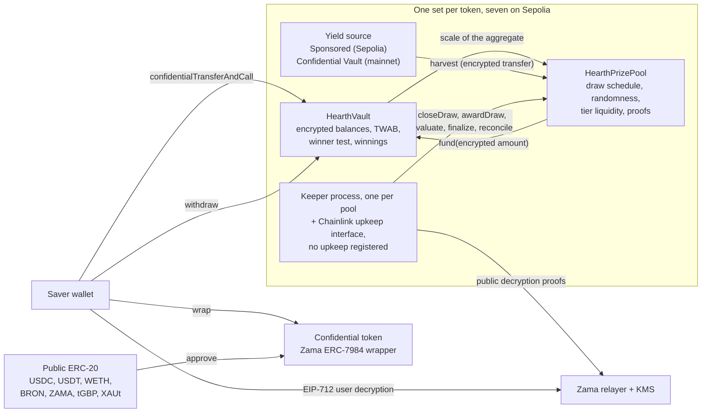

# Hearth क्या है

Hearth एक ऐसा बचत पूल है जिसमें आपका पैसा डूब नहीं सकता और आप इनाम जीत सकते हैं। ऐसे सात पूल
Sepolia पर चलते हैं, हर गोपनीय टोकन के लिए एक, और आप टोकन उसी तरह चुनते हैं जैसे कोई बचत खाता
चुनता है।

आप एक गोपनीय टोकन डालते हैं: USDC, USDT, WETH, BRON, ZAMA, tGBP या XAUt। पूल उस पैसे को
काम पर लगाता है और यील्ड कमाता है। हर
पीरियड में पूल की कमाई हुई यील्ड इनाम के रूप में बाँटी जाती है, और आपके जीतने की संभावना इस बात के
अनुपात में होती है कि आपने कितना रखा और कितने समय तक रखा। आप अपना मूलधन कभी भी, पूरा का पूरा,
वापस ले सकते हैं। यही वह "नो-लॉस लॉटरी" वाला विचार है जो PoolTogether ने शुरू किया था, और
Hearth उसका गोपनीय रूप है।

PoolTogether से फ़र्क़ यह है कि किसी आम ब्लॉकचेन पर सब कुछ सार्वजनिक होता है। कोई भी पढ़ सकता है
कि हर बचतकर्ता के पास कितना है, किस वॉलेट के जीतने की कितनी संभावना है, और हर ड्रॉ कौन जीता। इससे
लोगों की दौलत सबके सामने आ जाती है और जो बड़ा है वह निशाने पर आ जाता है। Hearth पूरा काम
एन्क्रिप्टेड नंबरों पर, Zama के Protocol के ज़रिए करता है, इसलिए चेन आपका बैलेंस सिफरटेक्स्ट के रूप में
रखती है (ऐसा डेटा जो बिना की के पढ़ा नहीं जा सकता) और कॉन्ट्रैक्ट फिर भी उस पर हिसाब करता रहता है।
आपका बैलेंस एक ऐसा नंबर है जिसे किसी ने कभी देखा ही नहीं, हमने भी नहीं, और ड्रॉ फिर भी कोई अजनबी
जाँच सकता है।

## पूरा सिस्टम एक तस्वीर में

काम दो कॉन्ट्रैक्ट करते हैं। `HearthVault` हर बचतकर्ता का एन्क्रिप्टेड मूलधन, उसकी एन्क्रिप्टेड जीत की रकम,
और यह रिकॉर्ड रखता है कि किसने कितने समय तक क्या रखा, और विजेता का टेस्ट भी यही चलाता है।
`HearthPrizePool` घड़ी चलाता है, रैंडम सीड निकालता है, यील्ड इकट्ठा करता है और इनाम का पैसा टियरों में
रखता है। एक कीपर प्रोसेस ड्रॉ को आगे बढ़ाती है, और वह जो भी कदम उठाती है उसे कोई और भी उठा सकता है।

बीच वाला डिब्बा एक टोकन का पूल है। ऐसे सात हैं और उनके बीच कुछ भी साझा नहीं है: आपकी USDC पोज़िशन
और आपकी WETH पोज़िशन अलग-अलग वॉल्ट में अलग-अलग बचतकर्ता हैं, और एक पूल शांत पड़ जाए तो बाकी
चलते रहते हैं। आप किस पूल को देख रहे हैं, यह पते की पट्टी के पहले हिस्से में दिखता है, `/app/usdc` या
`/app/weth`। पूरी सूची, पतों के साथ, यहाँ है:
[पूल और टोकन](../concepts/pools-and-tokens.md)।

## चार कदम

एक बचतकर्ता चार कदम उठाता है। यहाँ लिखा है कि हर कदम क्या करता है और क्या ज़ाहिर कर देता है।

### 1. डिपॉज़िट

आप उस पूल का गोपनीय टोकन एक ट्रांज़ैक्शन में उसके वॉल्ट को भेजते हैं। रकम एक सिफरटेक्स्ट हैंडल के रूप में
जाती है, यानी एन्क्रिप्टेड वैल्यू की तरफ़ इशारा करने वाला पॉइंटर, न कि वैल्यू खुद। वॉल्ट उसे आपके
एन्क्रिप्टेड मूलधन में जोड़ देता है और समय के साथ आपके बैलेंस का रिकॉर्ड अपडेट कर देता है, और यह सब बिना
कुछ भी डिक्रिप्ट किए।

- छिपा हुआ: रकम, आपका चलता हुआ बैलेंस, और इसलिए पूल में आपका हिस्सा।
- सार्वजनिक: आपका पता, जिस ब्लॉक में आपने यह किया, और यह बात कि एक डिपॉज़िट हुआ।

एक सीवन बची रहती है। आम सार्वजनिक टोकन को गोपनीय टोकन में बदलना एक सार्वजनिक ERC-20 ट्रांसफ़र है,
इसलिए रैप की गई रकम दिखती है। अगर आप 5,000 USDC रैप करें और दो ब्लॉक बाद डिपॉज़िट कर दें, तो
देखने वाला बहुत अच्छा अंदाज़ा लगा लेगा। Hearth रैप करने और डिपॉज़िट करने को जान-बूझकर दो अलग कदम
रखता है ताकि आप उनके बीच फ़ासला डाल सकें। देखें
[रैप की सीवन](../security/what-stays-private.md)।

### 2. ड्रॉ

हर पीरियड के आख़िर में पूल उस पीरियड का ड्रॉ बंद करता है। एक ही ट्रांज़ैक्शन में वह हर टियर के इनाम का
आकार तय करता है, फिर Zama के कोप्रोसेसर के अंदर एक एन्क्रिप्टेड रैंडम सीड निकालता है, फिर वॉल्ट से पूछता
है कि पूल कितना बड़ा था, फिर उस पीरियड की यील्ड इकट्ठा करता है। यह क्रम मायने रखता है: इनामों का
आकार रैंडम नंबर के बनने से पहले तय हो जाता है, इसलिए कोई सीड देखकर फिर यह नहीं बदल सकता कि जीत
की कीमत कितनी होगी।

"पूल कितना बड़ा था" जान-बूझकर धुँधला रखा गया है, और यही डिज़ाइन है। वॉल्ट सारे बचतकर्ताओं का जोड़ा
हुआ कुल समय-भारित बैलेंस प्रकाशित नहीं करता। वह सिर्फ़ वह दो-की-घात वाला ब्रैकेट प्रकाशित करता है
जिसमें वह कुल आता है, इसलिए दुनिया को पूल का सही आकार नहीं, बस मोटा-मोटा आकार पता चलता है। सही
संख्या प्रकाशित करने से कोई लगातार दो ड्रॉ घटाकर उनके अंतर से एक अकेले बचतकर्ता का डिपॉज़िट पढ़ लेता।

फिर चार छोटी वैल्यू Zama की की मैनेजमेंट सर्विस से हस्ताक्षरित एक प्रूफ़ के साथ बाहर जाती हैं, ताकि कोई भी
उन्हें जाँच सके: सीड, ब्रैकेट, पूल में कोई था भी या नहीं, और इकट्ठा हुई यील्ड। उस ड्रॉ में हर बचतकर्ता का
नतीजा उसी पल तय हो जाता है जब ये नंबर सत्यापित हो जाते हैं।

- छिपा हुआ: हर बचतकर्ता का अपना भार, पूल का सही कुल, और हर एक का नतीजा।
- सार्वजनिक: सीड, ब्रैकेट, इकट्ठा हुई यील्ड, हर टियर के इनाम का आकार, और एक ड्रॉ बाद जब टियर
  रिकंसाइल होता है, तब यह कि उसने कितने इनाम दिए।

### 3. क्लेम

कोई क्लेम ट्रांज़ैक्शन नहीं है, और यही पूरी बात है। ऐप में क्लेम बटन ज़रूर है, "मेरे ड्रॉ" पर उस ड्रॉ के कार्ड
पर, और उस पर रकम भी लिखी होती है: यह उसी जीत की रकम की एक आम निकासी है जो आपने अभी खोली है,
और चेन पर यह बिल्कुल किसी और निकासी जैसी ही दिखती है।

ड्रॉ का मूल्यांकन होते समय जीत की रकम वॉल्ट के अंदर एक अलग एन्क्रिप्टेड बैलेंस में क्रेडिट कर दी जाती है।
इसके लिए आपको कुछ नहीं करना पड़ता और आपका कोई काम इसे ज़ाहिर भी नहीं करता। यह जानने के लिए कि
आप जीते या नहीं, आप एक EIP-712 मैसेज पर हस्ताक्षर करते हैं, यानी एक टाइप्ड ऑफ़-चेन सिग्नेचर जो साबित
करता है कि पता आपके नियंत्रण में है, और Zama का रिलेयर आपकी अपनी जीत की रकम का प्लेनटेक्स्ट आपके
ब्राउज़र को लौटा देता है। वह सिग्नेचर चेन को छूता तक नहीं, इसलिए उसका कोई खर्च नहीं है और कोई निशान भी
नहीं छूटता। डैशबोर्ड पर आपका बैलेंस और किसी ड्रॉ का नतीजा, दोनों की अपनी-अपनी आँख है, दोनों एक साथ
खुली रह सकती हैं, और पहली वाली का सिग्नेचर दूसरी के भी काम आ जाता है।

- छिपा हुआ: सब कुछ। अपनी जीत की रकम पढ़ना एक ऑफ़-चेन काम है।
- सार्वजनिक: कुछ भी नहीं।

ज़्यादातर प्राइज़ प्रोटोकॉल में विजेता को एक क्लेम ट्रांज़ैक्शन भेजनी पड़ती है और हारने वाले के पास ऐसा करने
की कोई वजह नहीं होती, इसलिए ट्रांज़ैक्शन की सूची चुपचाप विजेताओं के नाम बता देती है। Hearth में भेजने के
लिए ऐसी कोई ट्रांज़ैक्शन ही नहीं है। जो ट्रांज़ैक्शन इनाम क्रेडिट करती है, `evaluate`, उसे अपनी तरफ़ मोड़ा नहीं
जा सकता: वह बचतकर्ताओं की सूची पर उस जगह से चलती है जो उस ड्रॉ की अपनी सीड तय करती है, और
कॉल करने वाला सिर्फ़ इतना बताता है कि उसे कितना आगे बढ़ाना है।

### 4. निकासी

पैसा बाहर निकालने का एक ही फ़ंक्शन है: `withdraw`। यह पहले आपकी जीत की रकम से भुगतान करता है, फिर
आपके मूलधन से, और जो आपके पास है और जो वॉल्ट के पास है, उनमें से जो कम हो उस पर रुक जाता है। आप
इनाम ले रहे हों, अपनी बचत घर ला रहे हों, या दोनों एक साथ, कॉल वही है, आकार वही, इवेंट वही और रकम
एन्क्रिप्टेड।

उस सीमा का दूसरा हिस्सा इसलिए है क्योंकि गोपनीय ट्रांसफ़र या तो पूरी रकम भेजता है या कुछ भी नहीं। वह
माँगी गई रकम का कुछ हिस्सा कभी नहीं भेजता। इसलिए वॉल्ट टोकन से भुगतान कराने से पहले ही हिसाब लगा
लेता है कि वह असल में कितना दे सकता है, बजाय इसके कि बाद में कमी सुधारने की कोशिश करे।

- छिपा हुआ: रकम, और यह भी कि उसमें इनाम का पैसा था या नहीं।
- सार्वजनिक: आपका पता, ब्लॉक, और यह बात कि एक निकासी हुई।

आपका मूलधन कभी लॉक नहीं होता। ड्रॉ चलते हुए भी डिपॉज़िट और निकासी खुले रहते हैं, जो इस क्षेत्र के कई
दूसरे डिज़ाइनों में सच नहीं है।

## यह निष्पक्ष किस वजह से है

दो चीज़ों से, और दोनों को कोई भी अजनबी बिना किसी ख़ास पहुँच के जाँच सकता है।

रैंडम सीड `FHE.randEuint64` से आती है, जो Zama के कोप्रोसेसर के अंदर, नेटवर्क की FHE की के तहत एक
सार्वजनिक सीड से बनती है। न कोई इसका अंदाज़ा लगा सकता है और न कोई इसे दो बार निकाल सकता है: ड्रॉ
बंद करना ठीक एक ही बार सफल होता है। पीरियड ख़त्म होते ही पूल वह सीड और वह ब्रैकेट, जिसमें पूल का
कुल आया, दोनों प्रकाशित कर देता है, और दोनों के साथ एक प्रूफ़ होता है जिसे कॉन्ट्रैक्ट चेन पर जाँचता है।

इन दो सार्वजनिक नंबरों से कोई भी वह सही थ्रेशोल्ड दोबारा गिन सकता है जो किसी भी पते को किसी भी टियर
में पार करना था, और वॉल्ट वही गणित एक व्यू के रूप में भी देता है ताकि किसी को किसी दोबारा लिखे गए
कोड पर भरोसा न करना पड़े। जो वे नहीं कर सकते, वह है उस एन्क्रिप्टेड भार को देखना जिससे तुलना की गई थी।
यानी नियम सार्वजनिक और जाँचने लायक है, और सिर्फ़ इनपुट निजी है। ब्योरा
[रैंडमनेस और सत्यापन](../security/randomness-and-verification.md) में है।

## Hearth क्या नहीं छिपाता

छोटा जवाब यहाँ, पूरा [क्या निजी रहता है](../security/what-stays-private.md) में:

- बचतकर्ता कौन हैं, और उनमें से हर एक ने कब डिपॉज़िट किया, कब निकाला या कब उसका मूल्यांकन हुआ।
- हर पीरियड में पूल का कुल जिस ब्रैकेट में आया, सीड, और इकट्ठा हुई यील्ड।
- हर टियर के इनाम का आकार, और उसने कितने इनाम दिए, जो एक ड्रॉ बाद प्रकाशित होता है।
- आपने गोपनीय टोकन में कितनी रकम रैप की या उससे बाहर निकाली।
- अगर सिर्फ़ एक बचतकर्ता हो, तो प्रकाशित ब्रैकेट दोगुने के फ़र्क़ के भीतर उसी बचतकर्ता का भार है।
  दो हों, तो हर एक दूसरे की सीमा बाँध सकता है। यहाँ निजता के लिए तीन या उससे ज़्यादा बचतकर्ता चाहिए
  और ऐप यह बात कहता है।
- थ्रेशोल्ड सार्वजनिक हैं, इसलिए जो कोई आपका बैलेंस पिन कर ले, वह हर ड्रॉ में आपका नतीजा गिन सकता है।
  ऐसा आम तौर पर तब होता है जब आप रैप करने के कुछ ही मिनट बाद उतनी ही रकम डिपॉज़िट कर देते हैं,
  और इसीलिए ऐप इन दोनों को अलग रखता है।
- पूरा पैसा रैप करके अंदर लाना और पूरा अनरैप करके बाहर ले जाना आपकी अब तक की सारी जीत की एक
  न्यूनतम सीमा प्रकाशित कर देता है, क्योंकि टोकन की परत पर दोनों हलचलें सार्वजनिक हैं।
- जो बचतकर्ता हर जीते हुए ड्रॉ के तुरंत बाद पैसा निकाल लेता है, वह अपने ही व्यवहार से एक आँकड़ों वाला
  संकेत छोड़ जाता है। इसे कोई कॉन्ट्रैक्ट ठीक नहीं कर सकता।
