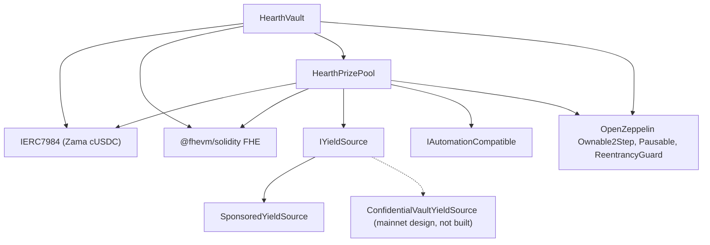

# डिप्लॉय करना

एक ही दोहराने लायक स्क्रिप्ट, हाथ से क्लिक करना कभी नहीं। यह पेज वही क्रम, वही पैरामीटर और
हर पैरामीटर का मतलब बताता है, ताकि कोई समीक्षक डिप्लॉय किए गए कंस्ट्रक्टर आर्ग्युमेंट पढ़कर
जान सके कि वे मेल खाते हैं।

Hearth हर गोपनीय टोकन के लिए एक पूल डिप्लॉय करता है: हर टोकन के लिए एक वॉल्ट, एक प्राइज़ पूल
और एक यील्ड सोर्स, जो किसी दूसरे पूल के साथ कुछ भी साझा नहीं करते। एक रन एक ही पूल खोलता है,
क्योंकि एक डिप्लॉयर नॉन्स एक ही डिप्लॉय चलाता है, और टोकन `HEARTH_TOKEN` से चुना जाता है।
इसके बाद हर टास्क `--token` लेता है:

```
cd packages/contracts
HEARTH_TOKEN=weth npx hardhat deploy --network sepolia
npx hardhat hearth:verify  --network sepolia --token weth
npx hardhat hearth:seed    --network sepolia --token weth
npx hardhat hearth:status  --network sepolia --token weth
```

दोनों छोड़ दें तो आपको `usdc` मिलता है, नेटवर्क का डिफ़ॉल्ट टोकन। कोई अनजान स्लग दिया जाए तो
वह उस नेटवर्क पर मौजूद पूलों की सूची के साथ फेल होता है। हर पूल के पैरामीटर एक ही फ़ाइल में
रहते हैं, `packages/contracts/hearth.config.ts`: एसेट जोड़ी, पीरियड, टियर सेट, शुरुआती
ब्रैकेट, ड्रिप रेट, स्पॉन्सरशिप, पाँच डेमो स्टेक और वह अकाउंट इंडेक्स जिससे इसका कीपर साइन
करता है। उस फ़ाइल को नीचे दी गई टेबलों के साथ रखकर पढ़ें; संख्याएँ वही हैं।

डिप्लॉय किसी भी ऐसे कॉन्ट्रैक्ट को बदलने के बजाय दोबारा इस्तेमाल करता है जिसका डिप्लॉयमेंट
पहले से सेव है, इसलिए दूसरा रन कुछ नहीं करता। कोई जीवित पूल जिसमें बचतकर्ताओं का पैसा और कई
दिनों का ड्रॉ इतिहास हो, स्क्रिप्ट दोबारा चलाने से कभी नए पते पर नहीं जा सकता। किसी को
जानबूझकर बदलना हो तो पहले `deployments/<network>/` के नीचे उसकी फ़ाइल मिटाएँ।

यह `deployments/sepolia/hearth.<slug>.json` लिखता है, और यही वह फ़ाइल है जिस पर किसी कीपर को
`HEARTH_ADDRESSES_FILE` से टिकाया जाता है और जिससे ऐप की पूल सूची बनती है।

## किस पर क्या निर्भर है



ठोस रेखाएँ इसी रिपॉज़िटरी के कॉन्ट्रैक्ट हैं। बिंदुओं वाला नोड मेननेट का यील्ड रास्ता है:
वह अडैप्टर Zama के प्रकाशित बैचर इंटरफ़ेस के सामने तय किया गया है और यहाँ कोई अडैप्टर
कॉन्ट्रैक्ट लिखा नहीं गया है, इसलिए नीचे सिर्फ़ `SponsoredYieldSource` डिप्लॉय होता है।

वॉल्ट और पूल दोनों को एक दूसरे की ज़रूरत है, इसलिए दोनों में से एक कड़ी कंस्ट्रक्टर के बजाय
डिप्लॉयमेंट के बाद जोड़ी जाती है। इसीलिए नीचे तीन नहीं, पाँच स्टेप हैं।

## क्रम

| स्टेप | कार्रवाई | यहीं क्यों |
| --- | --- | --- |
| 1 | `HearthVault` डिप्लॉय करें | यह बचतकर्ताओं का पैसा रखता है और अस्तित्व में आने के लिए टोकन के सिवा कुछ नहीं चाहिए। |
| 2 | `HearthPrizePool` डिप्लॉय करें, वॉल्ट की ओर इशारा करते हुए | पूल वॉल्ट की घड़ी और उसका स्केल काउंट पढ़ता है, और वॉल्ट को भुगतान करता है। |
| 3 | जोड़ें: `vault.setPrizePool(pool)` | `PrizePoolSet` एमिट करता है। वॉल्ट सिर्फ़ इसी पते से फंडिंग स्वीकार करेगा। |
| 4 | यील्ड सोर्स डिप्लॉय करें, पूल को प्राप्तकर्ता बताते हुए | उसे पता होना चाहिए कि हार्वेस्ट कहाँ भेजनी है। |
| 5 | जोड़ें: `pool.setYieldSource(source)` | `YieldSourceSet` एमिट करता है। जब तक यह नहीं होता, क्लोज़ कुछ भी हार्वेस्ट नहीं करता और `HarvestFailed` एमिट करता है। |

स्टेप 5 के बाद पूल में सीड डालें: `hearth:seed --token <slug>` यील्ड सोर्स को स्पॉन्सर करता
है ताकि इनाम मौजूद हों, और अलग-अलग आकार के पाँच डेमो बचतकर्ताओं को अकाउंट 2 से 6 तक से अंदर
डालता है, ताकि पहला आने वाला व्यक्ति खाली पूल के बजाय भरे हुए पूल पर पहुँचे। इसका हर स्टेप
चेन से देखता है कि क्या पहले ही हो चुका है, इसलिए रिलेयर की किसी अड़चन से बीच में रुका हुआ
सीड दोबारा चलाना सुरक्षित है।

उस पूल के कीपर को भी अपनी Sepolia ETH चाहिए, और पाँचों डेमो बचतकर्ताओं को भी:

```
npx hardhat hearth:spread-gas --network sepolia --token weth
npx hardhat hearth:spread-gas --network sepolia --keepers 10,11,12,13,14,15 --savers false
```

पहला एक पूल के कीपर और बचतकर्ताओं को फंड करता है; दूसरा एक ही बार में कई कीपर अकाउंट फंड
करता है, और एक साथ छह पूल खोलने के लिए यही चाहिए।

फिर ऐप को जो डिप्लॉय हुआ है उसकी ओर मोड़ें:

```
cd ../web
node scripts/sync-pools.mjs
```

## पैरामीटर

```
HearthVault(IERC7984 asset, uint256 periodLength, uint256 firstPeriodAt, address owner)
HearthPrizePool(IHearthVault vault, IERC7984 asset, Tier[3] tiers, uint8 initialScaleBits, address owner)
    Tier = { uint32 prizeCount; uint64 oddsNumerator; uint64 oddsDenominator; uint16 shares; uint16 reconcileEvery }
SponsoredYieldSource(IERC7984ERC20Wrapper asset, address recipient, uint64 ratePerSecond, address owner)
```

### HearthVault

| पैरामीटर | मतलब | गलत होने पर |
| --- | --- | --- |
| `asset` | वह ERC-7984 गोपनीय टोकन जो बचतकर्ता डिपॉज़िट करते हैं, Zama के सात में से एक। | हर रैपर छह डेसिमल पढ़ता है, और अगर चेन कॉन्फ़िग से असहमत हो तो डिप्लॉय आगे बढ़ने से मना कर देता है। नीचे के सार्वजनिक टोकन से रेट हर पूल पर 1 नहीं है: 18 डेसिमल वाले WETH मॉक पर यह दस लाख गुना दस लाख है, इसलिए सार्वजनिक टोकन को पढ़ने वाली हर चीज़ को इसे लागू करना होगा। |
| `periodLength` (`L`) | एक पीरियड में सेकंड। अपरिवर्तनीय। | यह हर बचतकर्ता की सीमा भी तय करता है, `(2^64 - 1) / L`। `L` बहुत छोटा हो तो सीमा बहुत बड़ी हो जाती है पर ड्रॉ में शोर बढ़ता है; बहुत बड़ा हो तो सीमा कस जाती है। |
| `firstPeriodAt` | वह टाइमस्टैम्प जब पीरियड 1 शुरू होता है। अपरिवर्तनीय, और डिप्लॉयमेंट पर या उससे पहले का होना चाहिए। | भविष्य का कोई मान `period(now)` को तब तक अपरिभाषित रखता है जब तक वह समय बीत न जाए। |
| `owner` | दो चरणों वाला मालिक। मालिकाना छोड़ना बंद है। | अधिकारों की सूची [थ्रेट मॉडल](../security/threat-model.md) में है। |

`maxPrincipal` सेट नहीं किया जाता, वह `periodLength` से निकलता है। एक घंटे पर यह करीब 5 अरब
टोकन है, छह घंटे पर करीब 854 मिलियन, और एक दिन पर करीब 213 मिलियन।

घड़ी वॉल्ट के पास है। पूल वॉल्ट का पता लेता है और पीरियड उसी से पढ़ता है, इसलिए दोनों
कॉन्ट्रैक्ट इस बात पर असहमत हो ही नहीं सकते कि अभी कौन सा पीरियड है।

### HearthPrizePool

| पैरामीटर | मतलब |
| --- | --- |
| `vault` | वह वॉल्ट जिसकी यह पूल सेवा करता है, और वही घड़ी जिसे यह पढ़ता है। |
| `asset` | वही गोपनीय टोकन जो वॉल्ट इस्तेमाल करता है। दोनों का मेल होना ज़रूरी है। |
| `prizeCount[t]` | टियर `t` में हर ड्रॉ के इनाम। |
| `oddsNumerator[t]`, `oddsDenominator[t]` | उस टियर की जीतने की संभावना एक भिन्न के रूप में, `oddsDenominator / oddsNumerator` ड्रॉ में एक बार। |
| `shares[t]` | हर हार्वेस्ट में उस टियर का हिस्सा। हिस्से सापेक्ष हैं, इसलिए 40/20/40 और 2/1/2 का मतलब एक ही है। |
| `reconcileEvery[t]` | उस टियर का कैरी प्रकाशित होने के बीच कितने ड्रॉ बीतते हैं। |
| `initialScaleBits` | पहले पीरियड के कुल वज़न की अपेक्षित बिट लंबाई, ब्रैकेट ट्रैकर का शुरुआती अनुमान। |
| `owner` | ऊपर जैसा ही। |

`UTILISATION` कोई आर्ग्युमेंट नहीं, एक स्थिरांक है: 50 प्रतिशत, PoolTogether V5 के अनुसार।
यह किसी टियर की प्लेनटेक्स्ट तरलता का वह हिस्सा है जिससे हर इनाम का आकार तय होता है।

इनमें से दो पर एक बात कहनी ज़रूरी है।

`reconcileEvery` गैस की नहीं, निजता की सेटिंग है, और यह इस बात से सौदा करती है कि प्राइज़ पॉट
कैसा दिखता है। किसी टियर का कैरी प्रकाशित करने से उस टियर के इनामों की गिनती सार्वजनिक हो
जाती है, और एक ड्रॉ पर की गई गिनती उस ड्रॉ में पात्र रहे छोटे से बचतकर्ता समूह की ओर इशारा
करती है। इसे ज़्यादा रखने से गिनती एक ऐसे अंतराल पर फैल जाती है जिसमें लगभग हर कोई किसी न
किसी समय पात्र था। इसकी कीमत दिखने वाला जैकपॉट है: एक क्लोज़ उस टियर की सारी सार्वजनिक तरलता
ड्रॉ में ले जाता है और वह सिर्फ़ रिकंसाइल पर लौटती है, इसलिए 24 की गति वाला टियर 24 में से 23
ड्रॉ पर एक ड्रॉ के हार्वेस्ट हिस्से से नापा गया इनाम प्रकाशित करता है, और जमा हुआ पॉट खुले
में सिर्फ़ रिकंसाइल वाले ड्रॉ पर दिखता है। पैसा पूरे समय एन्क्रिप्टेड कैरी के अंदर पेश किया
जाता रहता है और जीता जा सकता है; वह बस अदृश्य है। इसी वजह से Sepolia तीनों टियर 1 पर चलाता
है और हर ड्रॉ की गिनती को एक शेष के रूप में बताता है। सीमा 14 देखें।

`initialScaleBits` को बस पास होना चाहिए। ट्रैकर हर क्लोज़ पर असली कुल की तुलना मौजूदा अनुमान
के आसपास दो की पाँच घातों से करता है और हर ड्रॉ में खुद को तीन बिट तक सुधारता है, इसलिए कुछ
बिट दूर का अनुमान एक या दो ड्रॉ की थोड़ी गलत नापी गई संभावनाओं की कीमत लेता है और फिर बैठ
जाता है।

### SponsoredYieldSource

| पैरामीटर | मतलब |
| --- | --- |
| `asset` | वह ERC-7984 रैपर जिसे यह रखता और भेजता है। स्पॉन्सर जिस सार्वजनिक टोकन में भुगतान करते हैं वह इसी रैपर का अंतर्निहित टोकन है, इसलिए वह अलग आर्ग्युमेंट नहीं है। |
| `recipient` | वह प्राइज़ पूल जो हार्वेस्ट पाता है। |
| `ratePerSecond` | स्पॉन्सर किया गया बैलेंस कितनी तेज़ी से यील्ड बनकर टपकता है। |
| `owner` | रेट सेट करता है और `RateChanged` एमिट करता है। |

स्पॉन्सर करना डिप्लॉयमेंट के बाद की एक अलग कॉल है, कंस्ट्रक्टर आर्ग्युमेंट नहीं। यह वही दर्ज
करता है जो रैपर ने असल में मिंट किया, न कि जो स्पॉन्सर ने माँगा था, और इसे पलटा नहीं जा सकता।

## तीन पैरामीटर सेट

Sepolia इनमें से दो चलाता है, क्योंकि पूल दो घड़ियों पर चलते हैं।

| सेटिंग | Sepolia `usdc` | Sepolia, बाकी छह | मेननेट, संभावित |
| --- | --- | --- | --- |
| पीरियड की लंबाई | 1 घंटा | 6 घंटे | 1 दिन |
| विंडो | 2 घंटे (दो पीरियड) | 12 घंटे | 2 दिन |
| क्लोज़ की समयसीमा | पीरियड खत्म होने के 1 घंटा 30 मिनट बाद | 9 घंटे बाद | 1 दिन 12 घंटे बाद |
| हर बचतकर्ता की सीमा | करीब 5 अरब टोकन | करीब 854 मिलियन | करीब 213 मिलियन |
| ग्रैंड टियर | गिनती 1, संभावना 1/24, शेयर 40, हर ड्रॉ पर रिकंसाइल | गिनती 1, संभावना 1/4, शेयर 40, हर ड्रॉ पर रिकंसाइल | गिनती 1, संभावना 1/30, शेयर 50, हर ड्रॉ पर रिकंसाइल |
| मिड टियर | गिनती 1, संभावना 1/6, शेयर 20, हर ड्रॉ पर रिकंसाइल | गिनती 1, संभावना 1/2, शेयर 20, हर ड्रॉ पर रिकंसाइल | गिनती 1, संभावना 1/7, शेयर 25, हर ड्रॉ पर रिकंसाइल |
| फ़्रीक्वेंट टियर | गिनती 4, संभावना 1, शेयर 40, हर ड्रॉ पर रिकंसाइल | गिनती 4, संभावना 1, शेयर 40, हर ड्रॉ पर रिकंसाइल | गिनती 4, संभावना 1, शेयर 25, हर ड्रॉ पर रिकंसाइल |
| उपयोग | 50 प्रतिशत | 50 प्रतिशत | 50 प्रतिशत |
| यील्ड सोर्स | `SponsoredYieldSource` | `SponsoredYieldSource` | Zama के बैचर के ऊपर `ConfidentialVaultYieldSource` |
| ग्रैंड इनाम कब निकलता है | करीब दिन में एक बार | करीब दिन में एक बार | चुनी गई संभावना से तय |

Sepolia की संख्याएँ इसलिए हैं कि कोई आने वाला एक ही बैठक में पूरा चक्र देख ले: हर ड्रॉ में
चार छोटे इनाम और दोनों में से किसी भी घड़ी पर करीब रोज़ाना एक ग्रैंड इनाम। असली डिप्लॉयमेंट
इन संख्याओं का इस्तेमाल नहीं करेगा।

दो घड़ियाँ क्यों। पाँच बचतकर्ताओं पर एक ड्रॉ की लागत `8,456,388` गैस है, इसलिए हर घंटे ड्रॉ
करने वाले सात पूल Sepolia पर दिन में करीब `1.43 ETH` खर्च करते, जिसे सार्वजनिक फ़ॉसेट पूरा
नहीं कर सकते। छह घंटे इसे घटाकर हर पूल के लिए दिन में चार ड्रॉ कर देते हैं, सातों के लिए दिन
में करीब `0.41 ETH`। संभावनाएँ आगे बढ़ाई नहीं जातीं, हर पूल के अपने पीरियड के हिसाब से तय की
जाती हैं, इसीलिए बीच का कॉलम 1/4 और 1/2 पढ़ता है जहाँ पहला 1/24 और 1/6 पढ़ता है, और इसीलिए
ग्रैंड इनाम दोनों में करीब दिन में एक बार ही आता है। USDC पूल ने अपनी घंटे वाली घड़ी इसलिए
रखी क्योंकि वह सबसे पहले डिप्लॉय हुआ था और उसका ड्रॉ इतिहास उसी के तहत दर्ज है।

मेननेट वाला कॉलम एक संभावना है, कोई डिप्लॉयमेंट नहीं। इसे भरने का नियम वही है जिसने Sepolia
का कॉलम बनाया: तय करें कि दो ग्रैंड इनामों के बीच कितने ड्रॉ चाहिए और ग्रैंड टियर की संभावना
उस संख्या के एक बटा के बराबर रखें, फिर शेयर ऐसे रखें कि बनने वाले इनामों के आकार उस यील्ड के
सामने समझदार लगें जो सोर्स असल में कमाता है, फिर हर टियर की रिकंसाइल गति यह तौलकर तय करें कि
एक तरफ़ ऐसी इनाम गिनती है जो किसी का नाम नहीं लेती और दूसरी तरफ़ ऐसा पॉट जिसे बचतकर्ता जमा
होते देख सकते हैं। Sepolia ने दूसरा चुना; कोई मेननेट डिप्लॉयमेंट पहला चुन सकता है, और ऊपर का
पैराग्राफ़ बताता है कि हर पक्ष की कीमत क्या है। एक दिन के पीरियड पर 365 में 1 की ग्रैंड
संभावना सालाना ग्रैंड इनाम देती है, और यही आकार V5 इस्तेमाल करता है।

## डिप्लॉय किए गए पते

Sepolia पर सात पूल, हर कॉन्ट्रैक्ट Etherscan पर वेरिफ़ाई किया हुआ। हर पूल जो टोकन जोड़ी रखता
है वह Zama की है और [पूल और टोकन](../concepts/pools-and-tokens.md) में दर्ज है, साथ में हर
पूल के सीड किए गए स्टेक और ड्रिप रेट भी।

| पूल | HearthVault | HearthPrizePool | SponsoredYieldSource | किस ब्लॉक में डिप्लॉय हुआ |
| --- | --- | --- | --- | --- |
| `usdc` | `0x0F93e5db6027b4FB1C76566d24aA2D2E417fAF52` | `0xA0785AacF30B6FE46EDc53CD8A9db1d94FeF5Df2` | `0xCC49DF69eAB6884fD8DD9260902B8A0Abc9D6b91` | `11622398` |
| `usdt` | `0xe54F44dE64F8A7abc0647eaae547dD59ce0EFfac` | `0x6a83Beb2Dc3f258107Cad5e17BC57657fAd4fbd1` | `0x5bb1Cd5380Cb9f2B15569030fF0dB7a445cF54cA` | `11641314` |
| `weth` | `0x3D1A182782B68fE270A66294C9adaC7F005c4f14` | `0x1a11e7C689F244fA8Dd5f4abA8F2F3131090cc1C` | `0x40DF298f15c6136294eC651aD7b0c1C6F221DE8F` | `11641366` |
| `bron` | `0x18086DC8271f8A73c5Ea985fd519527Dbb991279` | `0x2Ed982979CD184494B947a1E38E597494a38ACe4` | `0x0cD1155D752bD81b3a437a6f0B3965CAA2A1C8e9` | `11641408` |
| `zama` | `0xEEC26386F273c6678cA538AcA18e1d9384eA9F09` | `0x873B285404199D46325a294Aa0EC7a79C30A7fF7` | `0xdD352D70311E834ab75307f53d5C276060081d23` | `11641447` |
| `tgbp` | `0xCe95dAa01f5354aA8887A5952E403D26d452c323` | `0xC531D54ee2c695e0eBfe8b8258e9Fd80fd507095` | `0xDEa2BD6351072F735B6ea83c357bF157d83c01af` | `11641484` |
| `xaut` | `0x77f701101d66FbD522A3bFdC2c00DB09a4F57daE` | `0x9a2888aca42c707A3BC0D561FdF6ff8Abfda5201` | `0x03fDdAA7C4323C53CE511CC49D4c33B26B492af7` | `11641523` |

पहले पीरियड की शुरुआत: `usdc` के लिए `1788386400 (2 September 2026, 22:00:00 UTC)`,
`usdt` के लिए `1788620400 (5 September 2026, 15:00:00 UTC)`, और बाकी पाँच के लिए
`1788624000 (5 September 2026, 16:00:00 UTC)`। `firstPeriodAt` अपरिवर्तनीय है और डिप्लॉयमेंट
ब्लॉक पर या उससे पहले का होना चाहिए, इसलिए डिप्लॉय मशीन की घड़ी नहीं, चेन की अपनी घड़ी पढ़ता
है और घंटे की शुरुआत तक नीचे गोल कर देता है।

## वेरिफ़िकेशन

वेरिफ़िकेशन डिप्लॉय का हिस्सा है, बाद में सोची जाने वाली चीज़ नहीं। जो समीक्षक डिप्लॉय किया
गया सोर्स नहीं पढ़ सकता, उसे इस पूरे दस्तावेज़ के लिए हमारी बात पर भरोसा करना पड़ेगा।

1. उस पूल के तीनों कॉन्ट्रैक्ट Etherscan पर उन कंस्ट्रक्टर आर्ग्युमेंट के साथ वेरिफ़ाई करें
   जो डिप्लॉय स्क्रिप्ट ने दर्ज किए: `hearth:verify --token <slug>` यह एक-एक कॉन्ट्रैक्ट
   करके करता है, और बताता है कि कौन से पहले से वेरिफ़ाई थे।
2. जाँचें कि वेरिफ़ाई किए गए कंस्ट्रक्टर आर्ग्युमेंट ऊपर की पैरामीटर टेबलों से मेल खाते हैं।
   खासकर यह कि पूल को उसका अपना वॉल्ट और वही `asset` दिया गया, और टियर सेट उस पूल की घड़ी
   वाले कॉलम से मेल खाता है।
3. जाँचें कि `vault.prizePool()` उसी पूल का प्राइज़ पूल है और `pool.yieldSource()` उसी पूल का
   सोर्स है, और दोनों में से कोई किसी दूसरे पूल के कॉन्ट्रैक्ट की ओर इशारा नहीं करता।
4. टोकन जाँचें: `asset` उस पूल के लिए Zama की प्रकाशित Sepolia सूची वाला गोपनीय रैपर होना
   चाहिए, और `underlying()` उसके नीचे का सार्वजनिक मॉक होना चाहिए। रैपर का `rate()` सिर्फ़
   वहीं 1 है जहाँ सार्वजनिक टोकन भी छह डेसिमल पढ़ता है; WETH पूल पर यह दस लाख गुना दस लाख है,
   और 1 के अलावा कोई भी रेट सार्वजनिक टोकन को छूने वाली हर चीज़ के लिए एक बेस यूनिट का मतलब
   बदल देता है।
5. कुछ ड्रॉ के बाद `pool.scaleBits()` पढ़ें और जाँचें कि वह उस बिट लंबाई के पास बैठ गया है जो
   पूल का असली आकार बताता है। उससे बहुत दूर अटका ट्रैकर यह बताएगा कि शुरुआती अनुमान बहुत गलत
   था और सुधार अब तक पकड़ नहीं पाया है।

## सीक्रेट

संवेदनशील कुछ भी कभी हार्डकोड नहीं होता। डिप्लॉय एक `.env` फ़ाइल से पढ़ता है, और
`.env.example` हर की को एक टिप्पणी के साथ सूचीबद्ध करता है कि उसका मान कहाँ से आता है।
डिप्लॉयर की की और कीपर की की अलग-अलग अकाउंट हैं, इसलिए कीपर की गरम की के पास मालिक वाले कोई
अधिकार नहीं हैं।

## ऐप की होस्टिंग

ऐप एक Next.js वर्कस्पेस पैकेज है, रिपॉज़िटरी की जड़ नहीं, और यही एक सेटिंग है जो ज़्यादातर
होस्ट गलत कर देते हैं।

| सेटिंग | मान | क्यों |
| --- | --- | --- |
| फ़्रेमवर्क प्रीसेट | Next.js | `packages/web/package.json` से पहचाना जाता है |
| रूट डायरेक्टरी | `packages/web` | ऐप एक npm वर्कस्पेस में रहता है |
| रूट डायरेक्टरी के बाहर के सोर्स फ़ाइल शामिल करें | चालू | डिपेंडेंसी रिपॉज़िटरी की जड़ पर उठा दी जाती हैं, और बिल्ड को जड़ वाली `package.json` और लॉकफ़ाइल चाहिए |
| इंस्टॉल कमांड | डिफ़ॉल्ट, `npm install` | रिपॉज़िटरी की जड़ पर चलता है और पूरा वर्कस्पेस इंस्टॉल करता है |
| बिल्ड कमांड | डिफ़ॉल्ट, `next build` | रूट डायरेक्टरी सेट होने पर यह `packages/web` के अंदर चलता है |
| आउटपुट डायरेक्टरी | डिफ़ॉल्ट, `.next` | नीचे दी गई चेतावनी देखें |
| Node वर्ज़न | 20 या नया | जड़ वाली `package.json` `engines.node` तय करती है |

होस्ट किए गए माहौल में `NEXT_DIST_DIR` सेट न करें। `packages/web/next.config.ts` इसे पढ़ता है
और मौजूद होने पर बिल्ड आउटपुट हटा देता है। यह इसलिए है कि स्थानीय वेरिफ़िकेशन बिल्ड चल रहे
डेव सर्वर से उसी `.next` डायरेक्टरी पर न भिड़े। होस्ट किए गए बिल्ड में यह आउटपुट को वहाँ से
हटा देगा जहाँ होस्ट उसे ढूँढता है, और डिप्लॉय बिना किसी साफ़ इशारे के फेल हो जाएगा।

### एनवायरनमेंट वेरिएबल

| वेरिएबल | ब्राउज़र में सार्वजनिक | मान कहाँ से आता है |
| --- | --- | --- |
| `SEPOLIA_RPC_URL` | नहीं | आपका अपना Sepolia एंडपॉइंट। लैंडिंग पेज और `/api/activity` रूट चेन को सर्वर पर पढ़ते हैं, इसलिए यह कभी किसी ब्राउज़र तक नहीं पहुँचता। लॉग क्वेरी को इसकी ज़रूरत है, क्योंकि मुफ़्त सार्वजनिक नोड `eth_getLogs` की रेंज एक दिन के ब्लॉक से कहीं नीचे सीमित कर देता है |
| `NEXT_PUBLIC_SEPOLIA_RPC_URL` | हाँ | वैकल्पिक। वॉलेट के रीड इसका इस्तेमाल करते हैं और सेट न होने पर `https://ethereum-sepolia-rpc.publicnode.com` पर लौट जाते हैं। बंडल में दिखता है, इसलिए वही होना चाहिए जिसे प्रकाशित करने में आपको कोई दिक्कत न हो |
| `NEXT_PUBLIC_CHAIN_ID` | हाँ | Ethereum Sepolia के लिए `11155111`। सेट न होने पर ऐप इसी पर लौटता है |

अब कोई भी कॉन्ट्रैक्ट पता एनवायरनमेंट वेरिएबल नहीं है। ऐप हर पूल
`packages/web/src/lib/chain/pools.json` से पढ़ता है, जिसे `node scripts/sync-pools.mjs` उन
पता फ़ाइलों से बनाता है जो डिप्लॉय स्क्रिप्ट ने लिखी थीं, इसलिए ऐप जो पता दिखाता है उसे हमेशा
किसी डिप्लॉयमेंट रिकॉर्ड तक खोजा जा सकता है, न कि किसी के टाइप किए हुए तक। हर डिप्लॉय के बाद
वह स्क्रिप्ट चलाएँ और नतीजा कमिट करें। वे तीन सार्वजनिक वेरिएबल जो पहले एक पूल का वॉल्ट,
प्राइज़ पूल और यील्ड सोर्स पता रखते थे, अब नहीं हैं; जिस भी माहौल में वे अब भी सेट हैं वहाँ से
उन्हें हटा दें, क्योंकि उन्हें कोई नहीं पढ़ता।

गोपनीय एसेट और उसका अंतर्निहित ERC-20 भी वॉल्ट और रैपर से चेन पर पढ़े जाते हैं, इसलिए ऐप किसी
ऐसे टोकन से बात कर ही नहीं सकता जिसे वॉल्ट मना कर देगा।

### पहले डिप्लॉय के बाद

1. प्रोडक्शन URL फ़ोन पर खोलें। हर पेज को 375 पिक्सल चौड़ाई पर काम करना चाहिए।
2. Sepolia पर वॉलेट जोड़ें और README वाला दो मिनट का रास्ता localhost पर नहीं, डिप्लॉय की गई
   साइट पर चलकर देखें।
3. `/verify?pool=<slug>` खोलें और किसी बचतकर्ता का पता चिपकाएँ। थ्रेशोल्ड एक कॉन्ट्रैक्ट कॉल
   से आते हैं, इसलिए अगर वे दिखते हैं तो डिप्लॉय किया गया ऐप उस पूल के डिप्लॉय किए गए वॉल्ट
   से बात कर रहा है।
4. पूल पिकर खोलें और जाँचें कि हर स्लग अपना खुद का डैशबोर्ड लोड करता है, और प्रतिबंधित टोकन
   टूटी हुई स्क्रीन के बजाय अपना इनकार वाला पेज दिखाता है।

---

## यह पेज क्या नहीं बताता

यह डिप्लॉयमेंट के बाद पूल चलाने की बात नहीं बताता, वह [कीपर](keeper.md) है, और हर पूल के लिए
एक कीपर प्रोसेस उसी पेज का हिस्सा है। यह मेननेट की परिचालन तैयारी भी नहीं बताता: Confidential
Vault अडैप्टर Zama के प्रकाशित बैचर इंटरफ़ेस के सामने तय किया गया है और इस रिपॉज़िटरी में
लागू नहीं है, और उसे लाइव करने की बात [यील्ड सोर्स](../concepts/yield-source.md) में लिखी है।
