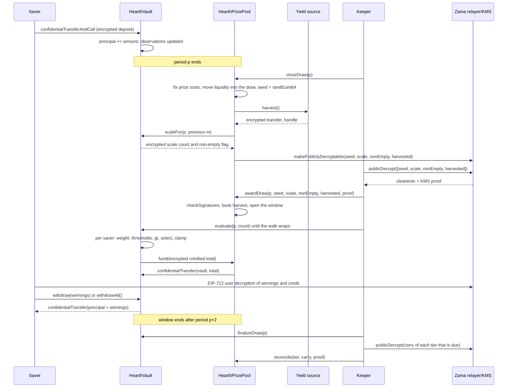

# Cara sebuah undian berjalan

Undian adalah saat imbal hasil pool berubah menjadi hadiah. Halaman ini menelusuri
keseluruhannya dengan kata-kata biasa, lalu menampilkan cerita yang sama sebagai diagram.

## Periode

Waktu dipotong menjadi periode-periode sama panjang selama `L` detik. Periode 1 dimulai pada
`firstPeriodAt`, sebuah stempel waktu yang ditetapkan saat deployment dan tidak pernah diubah
sesudahnya. Dari sana aritmetikanya hanyalah pembagian:

```
period(t)      = (t - firstPeriodAt) / L + 1
periodStart(p) = firstPeriodAt + (p - 1) * L
periodEnd(p)   = periodStart(p + 1)
```

Tiap pool punya `L` sendiri. Di Sepolia pool USDC berjalan satu jam dan enam lainnya enam jam,
sehingga pengunjung menyaksikan satu siklus penuh dalam satu duduk. Di mainnet, deployment
sungguhan akan memakai satu hari, yang juga dipakai PoolTogether V5. Periode adalah argumen
konstruktor, jadi kode yang sama melayani ketiganya, dan peluang tier tiap pool ditetapkan
terhadap periodenya sendiri. Lihat [pool dan token](pools-and-tokens.md).

Undian `p` mencakup periode `p`. Ia ditentukan sepenuhnya oleh saldo yang dipegang selama
periode `p`. Tidak ada yang terjadi setelah periode `p` berakhir yang bisa mengubah hasilnya.

## Jendela, dan tenggat untuk menutup

Setiap langkah undian `p` terjadi selama periode `p+1` dan `p+2`. Itulah jendelanya, dan ia
berakhir pada `periodEnd(p + 2)`. Itu dua jam di pool USDC dan setengah hari di pool lainnya.

Penutupan punya tenggat yang lebih ketat daripada sisa jendela:

```
closeDeadline(p) = periodStart(p + 2) + L / 2
```

Itu tengah dari periode kedua jendela, tiga perempat perjalanan jendela. Penutupan setelah itu
ditolak.

Alasannya adalah menutup dan menetapkan hadiah tidak bisa berbagi satu blok. Menutup menandai
nilai-nilai sebagai bisa didekripsi di on-chain, teks terangnya kembali dari relayer Zama di
luar rantai, dan penetapan hadiah memverifikasinya di on-chain. Penutupan pada detik terakhir
jendela akan membuat perjalanan bolak-balik itu tak punya tempat mendarat, dan undiannya akan
tersangkut selamanya di status `Closed`. Tenggat itu menjamin setidaknya setengah periode untuk
perjalanan bolak-balik, penetapan hadiah dan tiap batch evaluasi.

Jendela itu juga membatasi seberapa jauh ke belakang vault harus mengingat saldo, dan itulah
yang membuat tiga observasi tersimpan per penabung sudah cukup. Lihat
[saldo tertimbang waktu](time-weighted-balance.md).

## Lima langkah

Setiap langkah bersifat tanpa izin. Siapa pun bisa memanggil mana pun, termasuk seorang
penabung dari aplikasi. Keeper hanyalah alamat yang biasanya sampai lebih dulu.

### 1. Close

`closeDraw(p)`, setelah periode `p` berakhir dan sebelum `closeDeadline(p)`.

Lima hal terjadi dalam satu transaksi ini, dalam urutan berikut:

- **Besar hadiah ditetapkan.** Besar hadiah tiap tier dan likuiditas yang disediakannya untuk
  undian ini dihitung dari uang yang dipegang tier itu saat ini, dan likuiditas itu berpindah
  ke dalam undian. Ini terjadi sebelum seed acak ada.
- **Seed ditarik.** `FHE.randEuint64()` berjalan di dalam koprosesor Zama, jadi angkanya hanya
  ada sebagai ciphertext dan tidak ada yang pernah melihatnya.
- **Vault melaporkan di mana bobot agregat periode itu berada**, sebagai satu hitungan kecil
  terenkripsi ditambah satu bendera terenkripsi yang menyatakan apakah ada orang yang memegang
  saldo sama sekali. Bukan agregatnya sendiri, dan belum dalam bentuk terang. Lihat bagian
  berikutnya.
- **Sumber imbal hasil dipanen**, sebagai satu transfer terenkripsi ke pool. Kalau sumbernya
  gagal, penutupan tetap berhasil: panennya diperlakukan sebagai nol terenkripsi trivial dan
  event `HarvestFailed` dipancarkan. Sumber imbal hasil yang rusak tidak bisa menghentikan jam.
- **Empat handle ditandai bisa didekripsi publik:** seed, hitungan skala, bendera tidak-kosong
  dan panennya. Itu adalah bendera satu arah pada daftar kontrol akses Zama. Sejak saat itu
  siapa pun bisa meminta teks terangnya ke relayer, dan benderanya tidak bisa dicabut. Tidak
  ada hal lain tentang undian yang pernah ditandai begini.

Status undian berpindah ke `Closed`. Penutupan berhasil tepat satu kali, yang membuat tidak ada
yang bisa mengulang undian seed-nya.

Urutan di dalam transaksi itulah intinya. Besar hadiah ditetapkan sebelum seed ada, jadi tidak
ada yang bisa mengamati seed muncul, menghitung bahwa dia menang, lalu menata ulang uang pool
supaya kemenangan itu bernilai lebih besar.

### Apa yang dipublikasikan vault sebagai ganti totalnya

Total saldo tertimbang waktu pool untuk periode itu, ditulis `W`, tidak pernah dipublikasikan.
Mempublikasikannya secara persis adalah desain sampai 3 September 2026 dan sebuah tinjauan
mematahkannya: dengan `W` publik untuk dua periode berurutan, ditambah stempel waktu publik
dari setoran atau penarikan penabung itu sendiri, penabung yang satu-satunya memindahkan uang
dalam satu periode akan terbongkar jumlah persisnya lewat aritmetika. Bukan terbatasi,
terbongkar. Itu dijelaskan di [apa yang tetap privat](../security/what-stays-private.md).

Yang dipublikasikan sekarang adalah bracket tempat `W` jatuh: pangkat dua terkecil pada atau di
atasnya, ditulis `M = 2^m`. Vault melacaknya di bawah enkripsi. Pada tiap penutupan ia
membandingkan `W` terhadap lima pangkat dua di sekitar `m` undian sebelumnya, menjumlahkan
hasilnya menjadi satu hitungan kecil terenkripsi, dan menandai hitungan itu bisa didekripsi
publik. Pool menghitung `m` baru dari hitungan yang sudah terverifikasi. Perbandingan
terenkripsi terpisah terhadap 1 menghasilkan bendera tidak-kosong, yang menyatakan apakah ada
orang yang memegang saldo sama sekali.

Jadi seorang pengamat mempelajari satu hal per undian: apakah pool melewati sebuah pangkat dua.
Di antara perlintasan itu mereka tidak mempelajari apa pun yang baru. Setiap undian berjalan
terhadap `M` alih-alih `W`, dan itulah yang membuat hitungan hadiah yang dijelaskan di bawah
berjumlah sebagaimana adanya.

### 2. Award

`awardDraw(p, seed, scaleCount, nonEmpty, harvested, proof)`.

Siapa pun yang memanggilnya mengambil empat teks terang itu dari relayer Zama, yang
mengembalikannya bersama tanda tangan dari layanan pengelolaan kunci (KMS), yaitu himpunan
pihak yang memegang kunci dekripsi jaringan. Kontrak memverifikasi tanda tangan itu di on-chain
dengan `FHE.checkSignatures` sebelum ia memercayai satu angka pun. Buktinya terikat pada
handle-handle itu dalam urutan tetap, `[seed, scaleCount, nonEmpty, harvested]`, jadi keempat
nilai itu tidak bisa diacak atau diputar ulang terhadap undian lain.

Lalu:

- Panen yang terverifikasi dikreditkan ke tier-tier menurut bobot share mereka. Ini satu-satunya
  jalan masuk uang hadiah, dan ia mendarat di tier-tier alih-alih di undian ini, jadi ia
  ditawarkan pada penutupan berikutnya. Pool tidak pernah membukukan jumlah yang dilaporkan
  sumber imbal hasil tentang dirinya sendiri.
- Kalau bendera tidak-kosong menyatakan tak seorang pun memegang saldo di periode `p`, undian
  ditandai `Empty` dan likuiditas yang ditawarkannya langsung kembali ke tier-tier.
- Kalau tidak, undian dibuka. Seed dan bracket `M` sekarang menjadi angka publik.
- Kalau jendelanya sudah tertutup saat seseorang menetapkan hadiah, panen tetap dikreditkan,
  likuiditas yang ditawarkan tetap kembali ke tier-tier, dan undiannya ditandai `Skipped`.
  Periode itu tidak membayar hadiah, dan tidak ada imbal hasil atau likuiditas yang hilang.

Lima status undian adalah `None`, `Closed`, `Awarded`, `Empty` dan `Skipped`.

**Inilah saat para pemenang ditentukan.** Sejak sini seed adalah angka publik, bracket adalah
angka publik, dan bobot tiap penabung untuk periode `p` tidak bisa berubah lagi. Ambang batas
yang harus dilewati tiap penabung adalah aritmetika atas masukan publik. Evaluasi, berikutnya,
tidak menentukan apa pun. Ia menuliskan hasil yang sudah ada.

### 3. Evaluate

`evaluate(p, count)` pada vault, sebanyak yang diperlukan, selagi jendela terbuka.

Pemanggil menyebut berapa banyak penabung yang dimajukan. Mereka tidak menyebut yang mana.
Vault menelusuri daftar penabung dari kursor per undian yang dimulai pada `seed mod saverCount`
dan bergerak maju dalam urutan daftar, mengerjakan sampai `count` penabung dan paling banyak
`4` yang membutuhkan kerja terenkripsi. Penabung tanpa observasi pada atau sebelum periode `p`
punya bobot nol, dan mereka dilewati berdasarkan stempel waktu terangnya tanpa biaya
terenkripsi sama sekali.

Untuk tiap penabung yang dicapai penelusuran, vault membaca bobot terenkripsi mereka untuk
periode `p`, menjalankan uji pemenang terhadap ambang batas publik, dan menambahkan hasilnya ke
kemenangan terenkripsi mereka. Ia menyimpan bobot terenkripsi dan kredit terenkripsi penabung
itu untuk undian tersebut, keduanya hanya bisa dibaca penabung itu sendiri, sehingga aplikasi
bisa menampilkan "Anda menang X di undian p" dan membiarkan mereka memeriksa perbandingannya.
Lalu ia menarik total terenkripsi yang dikreditkan batch itu dari prize pool.

Tidak ada yang memilih siapa yang dievaluasi atau dalam urutan apa. Penabung yang menginginkan
hasilnya sendiri memajukan penelusuran yang sama yang dimajukan semua orang, jadi mengirim
transaksi evaluate tidak mengatakan apa pun tentang apakah Anda menang. Titik awalnya berpindah
tiap undian, karena datang dari seed undian itu, jadi tidak ada alamat yang selamanya berada di
akhir antrean.

`evaluate` gagal untuk undian yang berstatus `Empty`, `Skipped`, atau belum ditetapkan
hadiahnya.

### 4. Finalize

`finalizeDraw(p)`, setelah jendela tertutup.

Apa pun yang ditawarkan tiap tier dan tidak dibayarkan dilipat ke dalam carry terenkripsi tier
itu. Carry adalah total berjalan yang tetap terenkripsi dan ikut berpindah dari undian ke
undian. Ia ditambahkan ke likuiditas yang ditawarkan tier itu pada tiap penutupan, jadi uang
yang tidak terbayarkan langsung kembali bermain meski besarnya masih rahasia.

Finalisasi juga mempublikasikan handle terkini dari satu penghitung terenkripsi global untuk
apa pun yang gagal didanai pool. Dengan panen yang terverifikasi, angkanya selalu nol.

### 5. Reconcile

`reconcile(tier, carry, proof)` pada pool, satu tier per panggilan, dan hanya ketika tier itu
jatuh tempo.

Tiap tier direkonsiliasi pada irama yang ditetapkan saat deployment sebagai `reconcileEvery[t]`
undian. Di Sepolia setiap tier jatuh tempo tiap undian. Ketika sebuah tier jatuh tempo,
`finalizeDraw` menandai carry-nya bisa didekripsi publik dan memancarkan `CarryPublished`.
Siapa pun mengambil teks terangnya, memanggil `reconcile` dengan bukti KMS, dan angka yang
terverifikasi dibukukan kembali ke likuiditas terang tier itu. Vault mengurangkan angka yang
sama dari carry, yang mungkin sudah bertambah sementara itu, dan `TierReconciled` dipancarkan.

Rekonsiliasi adalah yang membuat hitungan hadiah tier itu menjadi publik, karena carry adalah
bagian dari yang ditawarkan yang tidak dimenangkan siapa pun. Pada irama satu, hitungan tiap
tier menjadi publik satu undian setelah undian yang menjadi asalnya, dan seluruh pot tiap tier
kembali terbuka di tempat aplikasi bisa menampilkannya bertumbuh. Menaikkan iramanya
menyembunyikan hitungan itu selama sekian undian dan menyembunyikan pot yang bertumbuh
bersamanya, yang merupakan pertukaran yang diuraikan di
[hadiah dan tier](prizes-and-tiers.md). Tidak ada yang menguap dengan cara apa pun, dan pada
irama berapa pun Anda tidak pernah tahu siapa yang menang.

## Apa yang terjadi kalau sebuah langkah tidak pernah mendarat

- **Close tidak pernah mendarat.** Undian tetap `None` dan dilewati. Likuiditasnya tidak pernah
  dipindahkan, jadi ia tetap di tier-tier dan ditawarkan pada undian berikutnya. Panennya
  dikumpulkan oleh penutupan berikutnya.
- **Award tidak pernah mendarat di dalam jendela.** Penetapan hadiah yang terlambat tetap
  membukukan panennya, tetap mengembalikan likuiditas yang ditawarkan ke tier-tier, dan menandai
  undiannya `Skipped`.
- **Tidak ada yang mengevaluasi.** Seluruh tawaran tiap tier dilipat ke dalam carry-nya saat
  finalisasi dan kembali pada rekonsiliasi berikutnya.

Tidak ada yang terdampar dan tidak ada yang hilang. Keeper yang macet membuat pool kehilangan
undian, bukan uang. Lihat [halaman keeper](../operations/keeper.md).

## Uang tidak pernah bergerak berdasarkan laporan

Dua aturan membuat pembukuannya sulit ditipu.

Imbal hasil tidak pernah diterima atas dasar percaya. Sumbernya melakukan transfer terenkripsi
ke pool, pool adalah penerimanya dan karenanya diizinkan atas ciphertext itu, dan baru setelah
itu pool mempublikasikannya dan membukukan teks terang yang terverifikasi KMS. Sumber imbal
hasil yang bermasalah atau bermusuhan bisa mengirim kurang dari yang diklaimnya; ia tidak bisa
membuat pool percaya pada uang hadiah yang tidak pernah tiba. Ini penting karena likuiditas
hadiah fiktif pada akhirnya akan dibayar dari dana pokok seseorang.

Pembayaran ditarik, bukan didorong. Setelah tiap batch evaluasi, vault memberi pool izin
berumur pendek atas total batch terenkripsi itu, pool memberi token izin yang sama, dan token
memindahkan persis jumlah itu dari pool ke vault. Kalau pool kurang, vault mencatat selisihnya
di penghitung global terenkripsi untuk dana yang tidak terpenuhi, yang dipublikasikan saat
finalisasi agar siapa pun bisa memeriksanya. Dengan panen yang terverifikasi, penghitung itu
selalu nol.

## Seluruh undian, dari ujung ke ujung



## Apa yang tidak dibahas halaman ini

Halaman ini tidak membahas bagaimana bobot seorang penabung terbentuk sepanjang periode, yang
ada di [saldo tertimbang waktu](time-weighted-balance.md), tidak pula aritmetika uji pemenang,
yang ada di [pemilihan pemenang](winner-selection.md), tidak pula seberapa besar tiap hadiah,
yang ada di [hadiah dan tier](prizes-and-tiers.md).
