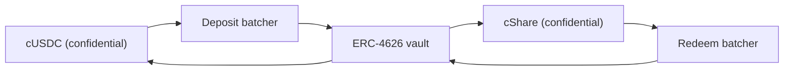

# Dari mana uang hadiah berasal

Hadiah adalah imbal hasil. Dana pokok siapa pun tidak pernah dibayarkan sebagai hadiah, dan
itulah yang membuat pool ini tanpa kehilangan modal. Halaman ini membahas satu antarmuka yang
diimplementasikan tiap sumber, sumber yang berjalan di Sepolia hari ini, mengapa pool menolak
memercayai perkataan sebuah sumber tentang apa pun, dan bagaimana Confidential Vault milik Zama
tersambung di mainnet.

## Antarmukanya

```solidity
interface IYieldSource {
    function harvest() external returns (euint64 transferred); // confidential transfer to the recipient
    function harvestable() external view returns (uint64);      // display only
}
```

Dua fungsi. `harvest` memindahkan imbal hasil yang terakru ke prize pool sebagai transfer rahasia
dan mengembalikan jumlah terenkripsi yang benar-benar berpindah. `harvestable` untuk tampilan
aplikasi dan pool tidak pernah memakainya untuk pembukuan.

`harvest` bersifat sinkron dengan sengaja. Ia memindahkan apa pun yang sudah siap di sumber pada
saat itu, dan sumber yang menghasilkan secara asinkron diharapkan sudah menyiapkan jumlah itu
sebelumnya alih-alih membuat pool menunggu.

Mengganti sumber adalah satu panggilan pemilik pada pool, `setYieldSource`, dan ia memancarkan
`YieldSourceSet`. Tidak ada bagian lain di sistem ini yang tahu atau peduli sumber mana yang
terpasang.

Sumber yang gagal tidak menghentikan undian. Pool menangkap kegagalannya, memperlakukan panen
undian itu sebagai nol terenkripsi trivial, dan memancarkan `HarvestFailed`. Penutupan berhasil,
undian berjalan di atas likuiditas yang sudah dipegang tier-tier, dan imbal hasil yang gagal
berpindah dikumpulkan oleh panen berikutnya. Sumber yang rusak atau salah pasang membuat sisi
hadiah kelaparan; ia tidak bisa menghentikan jam.

Ketika sebuah panen memang mendarat, ia dibukukan pada penetapan hadiah undian itu dan ditawarkan
pada penutupan berikutnya. Jadi imbal hasil periode `p` mendanai hadiah undian `p+1`, bukan
undian `p`. Itulah yang memungkinkan besar hadiah ditetapkan sebelum seed ada.

## Sepolia: sumber bersponsor

`SponsoredYieldSource` adalah yang berjalan di tiap pool yang hidup, satu instansi masing-masing,
jadi tujuh sumber itu adalah tujuh saldo terpisah dari tujuh token berbeda. Milik pool USDC ada
di `0xCC49DF69eAB6884fD8DD9260902B8A0Abc9D6b91`; enam lainnya ada di
[pool dan token](pools-and-tokens.md).

Seorang sponsor memanggil fungsi `sponsor` milik sumber itu dengan token publik pool. Sumber
membungkusnya menjadi yang rahasia dan membukukan persis apa yang dicetak wrapper, bukan apa yang
diminta sponsor. Dari sana saldonya menetes pada `ratePerSecond`, yang di pool USDC adalah
`5,555 base units a second, which is 19.998 USDC a period`,
dan `harvest` mengirim apa pun yang sudah terakru ke pool. Laju tiap pool disetel dalam token
bulat per jam supaya dua pool dengan jam berbeda bisa dibandingkan sekilas, dan tiap sponsorship
diukur untuk menutup lebih dari delapan puluh undian.

Sponsorship adalah donasi. Tidak ada jalan bagi sponsor untuk mengambilnya kembali, dan hanya
pemilik sumber yang bisa mengubah laju tetesan, yang memancarkan `RateChanged`.

Jumlah sponsor, laju tetesan dan tiap panen bersifat publik. Itu bukan kompromi: di PoolTogether,
jumlah imbal hasil yang disumbangkan sebuah vault juga publik, dan tiap besar hadiah mengikuti
darinya. Yang rahasia di Hearth adalah siapa menabung berapa dan siapa yang menang, tidak pernah
berapa uang yang dihasilkan pool.

Kalau pool tidak punya penabung untuk sementara, imbal hasil tetap terakru dan dibayarkan ke
undian pertama yang memang punya penabung. Tidak ada yang terdampar di pool kosong.

### Mengapa memakai mock sama sekali

Karena sumber mock hanya jujur kalau dokumennya menjelaskan cara kerjanya dan bagaimana sumber
sungguhan tersambung, keduanya ada di bawah. Kami mencari yang sungguhan lebih dulu dan tidak ada
satu pun di Sepolia yang membayar imbal hasil atas token mock milik Zama:

| Tempat | Mengapa tidak |
| --- | --- |
| Aave | Menolak setoran USDC di Sepolia, batas pasokan terlampaui |
| Compound | Menginginkan USDC milik Circle sendiri, bukan mock milik Zama |
| Confidential Vault milik Zama | Vault Sepolia adalah VaultV2 yang hanya idle tanpa adapter imbal hasil, yang merupakan deskripsi Zama sendiri tentangnya |

Jadi pilihan yang jujur adalah angka palsu yang naik, atau saldo yang didanai sponsor yang
benar-benar ada di rantai dan benar-benar menetes. Kami mengambil yang kedua. Setiap unit uang
hadiah di setiap satu dari tujuh pool yang hidup benar-benar dibungkus, benar-benar
ditransfer dan benar-benar diverifikasi.

## Pool tidak pernah membukukan angka yang dilaporkan

Ini aturan yang menjaga sumber bersponsor tidak menjadi titik lemah.

Sumber melakukan transfer terenkripsi ke pool. Pool, sebagai penerima, diizinkan atas ciphertext
itu, jadi ia bisa menandai sendiri jumlah yang ditransfer sebagai bisa didekripsi publik. Baru
pada waktu penetapan hadiah, setelah `FHE.checkSignatures` memverifikasi tanda tangan layanan
pengelolaan kunci atas teks terangnya, pool mengkreditkan apa pun ke tier-tier.

Sumber yang berbohong soal berapa yang dikirimnya tidak akan berhasil. Pool membukukan jumlah
yang tiba, karena hanya jumlah itulah yang pernah dilihatnya.

Ini bukan kehati-hatian teoretis. Di desain kami sebelumnya, pool membukukan penambahan cadangan
dari jumlah yang dioper pemanggil, sementara wrapper mencetak `amount / rate()`. Di deployment
yang hidup, `rate()` kebetulan bernilai 1 sehingga keduanya sepakat dan bug-nya laten. Pada token
dasar 18 desimal, di mana rate wrapper-nya sejuta juta, pool akan percaya pada uang hadiah
sejuta juta kali lipat dari yang benar-benar ada. Kami mengeksekusi itu pada 2 September 2026
terhadap token uji berdesimal 18 dan menyaksikannya terjadi. Likuiditas hadiah fiktif di pool
tanpa kehilangan modal pada akhirnya dibayar dari dana pokok seseorang, dan itulah satu janji
yang tidak boleh dilanggar produk ini. Memverifikasi transfernya menghapus seluruh kelas masalah
itu.

## Mainnet: Confidential Vault milik Zama

Zama mengirimkan sebuah protokol yang seluruh tugasnya adalah menghasilkan imbal hasil atas saldo
rahasia, dan itu sumber mainnet yang paling alami. `ConfidentialVaultYieldSource` adalah adapter
dalam desain itu. Yang menyusul adalah spesifikasinya, bukan kontrak di repositori ini.

Ia satu adapter per pool, seperti semua hal lain di sini, dan masing-masing butuh sebuah batcher
dan sebuah yield vault untuk tokennya sendiri. Deployment mainnet Zama mencakup USDC hari ini,
jadi Hearth di mainnet akan membuka pool USDC di atas Confidential Vault dan token lain di atas
sumber apa pun yang ada untuknya, atau tidak sama sekali.

Desainnya adalah sebuah batcher yang duduk di antara token rahasia dan yield vault ERC-4626
biasa. Vault ERC-4626 hanya menerima transfer publik, jadi seorang penyetor tunggal akan
mempublikasikan jumlah persisnya. Batcher justru mengumpulkan banyak setoran terenkripsi,
mendekripsi hanya jumlah totalnya, membuat satu setoran publik ke vault, dan membagikan kembali
share rahasia. Kata-kata Zama sendiri: "Observers see who participated, but not how much anyone
contributed."



Adapter menyambungkan deposit batcher dengan token rahasia pool dan memegang share rahasia.
Penebusan berjalan pada jadwalnya sendiri, mendahului panen: keeper secara berkala meminta
pertumbuhannya ke redeem batcher dan menjalankan permintaan itu melalui empat tahapnya, sehingga
pada saat pool memanggil `harvest` berikutnya, confidential USDC yang sudah ditebus sudah duduk
di adapter dan panennya menjadi satu transfer biasa seperti yang lain. Begitulah tempat asinkron
bertemu antarmuka sinkron. Setiap satu dari empat tahap itu tanpa izin, jadi tidak ada yang perlu
menunggu operator Zama menjalankannya.

### Alamat-alamatnya

Dari rujukan alamat Zama sendiri, diambil 2 September 2026.

**Ethereum mainnet, chain id 1.** Aset dasar USDC. Sumber imbal hasil: VaultV2 Morpho
"Steakhouse Confidential Prime USDC", digerbang sehingga deposit batcher adalah satu-satunya
penyetor vault itu.

| Kontrak | Alamat |
| --- | --- |
| Deposit batcher | `0x324EA89FD3784036673BfE6Ffee2334A088F40Cc` |
| Redeem batcher | `0x96Cd3Faa7483783Ac2Eb715f6333361500F1eec9` |
| Wrapper cUSDC | `0xe978F22157048E5DB8E5d07971376e86671672B2` |
| Wrapper cShare | `0x66Bf74E96900D1a19c7070D939D124f2F565C458` |
| Vault ERC-4626 | `0xbEEF00A59B577423653A1526c7009bdE103F542B` |
| USDC | `0xA0b86991c6218b36c1d19D4a2e9Eb0cE3606eB48` |

**Sepolia, chain id 11155111.** Lingkungan staging: USDC-nya mock dengan `mint` publik dan
vault-nya hanya idle tanpa adapter imbal hasil.

| Kontrak | Alamat |
| --- | --- |
| Deposit batcher | `0x48758559c14d4d92b4C74A99660B6a8dbe85F53b` |
| Redeem batcher | `0xe94E9afdDd43a19C2914739e9279cb6Fe287BEb0` |
| Wrapper cUSDC | `0x7c5BF43B851c1dff1a4feE8dB225b87f2C223639` |
| Wrapper cShare | `0x7E93d5c150A2178B1fCde0278582Acf59478eA5f` |
| Vault ERC-4626 (idle) | `0x6AB54988261AEC573a2CA13cF802d3B1114f864C` |
| Mock USDC | `0x9b5Cd13b8eFbB58Dc25A05CF411D8056058aDFfF` |

Karena vault Sepolia hanya idle, adapternya dispesifikasikan di sini terhadap antarmuka batcher
yang diterbitkan Zama dan belum ditulis. Mengatakan ia hidup padahal tidak menghasilkan apa-apa
adalah kebohongan yang bisa dicek siapa pun dalam semenit.

### Apa artinya menyambungkannya dalam praktik

Batcher bergerak dalam empat tahap: join, dispatch, finalize, claim. Sebuah batch menunggu sampai
mencapai umur minimum, lalu totalnya didekripsi, lalu vault menyelesaikan, lalu para peserta
mengklaim. Setiap satu dari tahap itu tanpa izin, jadi pool tidak pernah tersangkut menunggu
operator Zama, dan klaim tidak pernah kedaluwarsa.

Irama itu lebih lambat daripada tetesan instan sumber bersponsor, dan itulah sebabnya keeper
menjalankan penebusan lebih awal alih-alih di dalam `harvest`. Kontrak pool tidak pernah
menunggu: ia meminta ke adapter apa pun yang sudah diklaim kembali. Yang tersisa sebagai kerja
nyata untuk membawa ini hidup adalah kontrak adapternya sendiri, yang dispesifikasikan repositori
ini tetapi tidak diimplementasikan, dan sisi keeper-nya, yaitu memutuskan seberapa sering memulai
penebusan dan seberapa besar posisi yang ditebus, yang merupakan pilihan kebijakan tanpa
konsekuensi on-chain kalau terlambat.

### Apa yang akan diwarisi Hearth

Menyebut ini dengan benar adalah bagian dari bersikap layak dipercaya soal itu.

- **Risiko vault, sepenuhnya.** Batcher meneruskan uang ke vault ERC-4626 pihak ketiga. Kalau
  vault itu kehilangan nilai, saldo penghasil imbal hasil pool kehilangan nilai bersamanya. Ini
  satu-satunya tempat di mana "tanpa kehilangan modal" akan bergantung pada kontrak orang lain,
  dan itulah sebabnya deployment mainnet sebaiknya hanya menaruh porsi penghasil imbal hasilnya
  di sana.
- **Kerahasiaan batch, bukan kerahasiaan pool.** Batcher menyembunyikan jumlah di antara sesama
  peserta dan mendekripsi totalnya. Kalau Hearth adalah satu-satunya peserta dalam sebuah batch,
  jumlah setorannya akan publik. Itu tidak merugikan kami, karena panen Hearth toh sudah
  dipublikasikan, tetapi ada baiknya diketahui sebelum mengira batcher menyembunyikan lebih
  banyak daripada yang sebenarnya.
- **Kuasa pemilik yang terbatas.** Pemilik batcher bisa mengubah umur batch minimum (dibatasi 7
  hari), tenggat callback (dibatasi 30 hari), toleransi selip setoran, dan bisa menjeda join dan
  dispatch. Dokumentasi Zama menyatakan pemilik tidak bisa memindahkan atau membekukan dana
  pengguna, tidak bisa menyensor sebuah hasil, tidak bisa mendekripsi jumlah siapa pun, dan tidak
  bisa meningkatkan kontraknya. Perlindungan selip penebusan dimatikan secara permanen sehingga
  jalan keluar tetap bekerja bahkan saat vault sedang merosot.

## Apa yang tidak dibahas halaman ini

Halaman ini tidak membahas efek sumber imbal hasil terhadap tabel kebocoran, yang ada di
[apa yang tetap privat](../security/what-stays-private.md). Halaman ini tidak menakar imbal hasil
vault Morpho, yang merupakan angka orang lain dan berubah tiap hari. Dan halaman ini tidak
mengklaim adapternya sedang berjalan: di Sepolia yang terpasang adalah sumber bersponsor, dan
kartu "The pool right now" di dasbor menyebut namanya.
