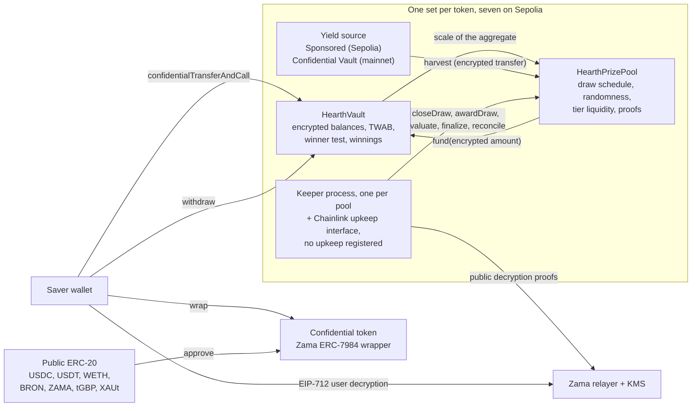

# Apa itu Hearth

Hearth adalah pool tabungan di mana uang Anda tidak bisa hilang dan Anda mungkin memenangkan
hadiah. Ada tujuh pool berjalan di Sepolia, satu untuk tiap token rahasia, dan Anda memilih
token seperti memilih sebuah rekening tabungan.

Anda memasukkan token rahasia: USDC, USDT, WETH, BRON, ZAMA, tGBP atau XAUt. Pool
memutar uang itu dan memperoleh imbal hasil. Setiap
periode, imbal hasil yang diperoleh pool dibagikan sebagai hadiah, dan peluang Anda menang
sebanding dengan berapa banyak yang Anda pegang dan berapa lama Anda memegangnya. Dana pokok
Anda bisa diambil kembali kapan saja, seluruhnya. Itulah gagasan "lotre tanpa kehilangan
modal" yang ditemukan PoolTogether, dan Hearth adalah versi rahasianya.

Bedanya dengan PoolTogether: di blockchain biasa semuanya publik. Siapa pun bisa membaca
berapa yang dipegang tiap penabung, berapa peluang tiap dompet, dan siapa yang menang di
tiap undian. Itu mempublikasikan kekayaan orang dan menempelkan target pada siapa pun yang
besar. Hearth menjalankan seluruh prosesnya di atas angka terenkripsi memakai Protocol milik
Zama, jadi rantai menyimpan saldo Anda sebagai ciphertext (data yang tak terbaca tanpa
kunci) dan kontraknya tetap bisa berhitung di atasnya. Saldo Anda adalah angka yang belum
pernah dilihat siapa pun, termasuk kami, dan undiannya tetap bisa diperiksa orang asing.

## Sistemnya dalam satu gambar

Dua kontrak yang mengerjakan semuanya. `HearthVault` menyimpan dana pokok terenkripsi tiap
penabung, kemenangan terenkripsi mereka, catatan berapa lama mereka memegang berapa, dan ia
menjalankan uji pemenang. `HearthPrizePool` menjalankan jam, menarik seed acak, mengumpulkan
imbal hasil dan menyimpan uang hadiah dalam tier. Sebuah proses keeper mendorong undian maju,
dan setiap langkah yang diambilnya bisa diambil orang lain.

Kotak di tengah adalah pool satu token. Ada tujuh dan mereka tidak berbagi apa pun: posisi
USDC Anda dan posisi WETH Anda adalah dua penabung terpisah di vault terpisah, dan satu pool
yang diam meninggalkan sisanya tetap berjalan. Pool mana yang sedang Anda lihat adalah bagian
pertama dari alamat URL, `/app/usdc` atau `/app/weth`. Daftar lengkapnya, dengan alamat, ada
di [pool dan token](../concepts/pools-and-tokens.md).

## Empat langkah

Seorang penabung melakukan empat langkah. Berikut apa yang dilakukan masing-masing dan apa
yang dibocorkannya.

### 1. Setor

Anda mengirim token rahasia pool itu ke vault-nya dengan satu transaksi. Jumlahnya berjalan
sebagai handle ciphertext, yaitu penunjuk ke sebuah nilai terenkripsi, bukan nilainya
sendiri. Vault menambahkannya ke dana pokok terenkripsi Anda dan memperbarui catatan saldo
Anda sepanjang waktu, semuanya tanpa mendekripsi apa pun.

- Tersembunyi: jumlahnya, saldo berjalan Anda, dan karenanya porsi Anda atas pool.
- Publik: alamat Anda, blok tempat Anda melakukannya, dan fakta bahwa ada setoran.

Ada satu celah. Mengubah token publik biasa menjadi token rahasia adalah transfer ERC-20
publik, jadi jumlah yang dibungkus terlihat. Kalau Anda membungkus 5.000 USDC dan menyetor
dua blok kemudian, seorang pengamat punya tebakan yang sangat bagus. Hearth sengaja menjaga
pembungkusan dan penyetoran sebagai dua langkah terpisah supaya Anda bisa memberi jarak di
antara keduanya. Lihat [celah pembungkusan](../security/what-stays-private.md).

### 2. Undian

Di akhir tiap periode, pool menutup undian untuk periode itu. Dalam satu transaksi ia
menetapkan besar hadiah tiap tier, lalu menarik seed acak terenkripsi di dalam koprosesor
Zama, lalu bertanya ke vault seberapa besar pool-nya, lalu mengumpulkan imbal hasil periode
itu. Urutannya penting: hadiah ditetapkan besarnya sebelum angka acak itu ada, jadi tidak ada
yang bisa melihat sebuah seed lalu menata ulang nilai sebuah kemenangan.

"Seberapa besar pool-nya" sengaja dibuat kabur, dan itulah desainnya. Vault tidak
mempublikasikan total saldo tertimbang waktu seluruh penabung yang dijumlahkan. Ia hanya
mempublikasikan bracket pangkat dua tempat total itu jatuh, jadi yang dipelajari dunia adalah
kira-kira ukuran pool, bukan ukuran persisnya. Mempublikasikan angka persisnya akan membuat
seseorang bisa mengurangkan dua undian berurutan dan membaca setoran seorang penabung tunggal
dari selisihnya.

Empat nilai kecil lalu keluar dengan bukti yang ditandatangani layanan pengelolaan kunci
milik Zama, sehingga siapa pun bisa memeriksanya: seed, bracket, apakah ada orang di pool
sama sekali, dan imbal hasil yang terkumpul. Hasil tiap penabung untuk undian itu terkunci
begitu angka-angka tersebut diverifikasi.

- Tersembunyi: bobot tiap penabung, total persis pool, dan tiap hasil perorangan.
- Publik: seed, bracket, imbal hasil yang terkumpul, besar hadiah tiap tier, dan, satu undian
  kemudian ketika tier direkonsiliasi, berapa hadiah yang dibayarkannya.

### 3. Klaim

Tidak ada transaksi klaim, dan justru itulah intinya. Aplikasi memang punya tombol klaim, di
kartu undian itu pada halaman "Undian saya", dan tombol itu memuat jumlahnya: ia adalah
penarikan biasa atas kemenangan yang baru saja Anda buka, dan di on-chain bentuknya persis
sama dengan penarikan lain mana pun.

Kemenangan dikreditkan ke saldo terenkripsi terpisah di dalam vault selagi undian dievaluasi.
Tidak ada tindakan Anda yang membuat itu terjadi dan tidak ada tindakan Anda yang
mengungkapnya. Untuk tahu apakah Anda menang, Anda menandatangani pesan EIP-712, yaitu tanda
tangan bertipe di luar rantai yang membuktikan Anda menguasai alamat Anda, lalu relayer Zama
mengembalikan teks terang kemenangan Anda sendiri ke browser Anda. Tanda tangan itu tidak
pernah menyentuh rantai, jadi biayanya nol dan ia tidak meninggalkan jejak. Saldo Anda di
dasbor dan hasil sebuah undian masing-masing punya mata sendiri, keduanya bisa terbuka
bersamaan, dan tanda tangan dari yang pertama melayani yang kedua.

- Tersembunyi: semuanya. Membaca kemenangan Anda sendiri adalah operasi di luar rantai.
- Publik: tidak ada.

Di kebanyakan protokol hadiah, pemenang harus mengirim transaksi klaim dan yang kalah tidak
punya alasan untuk itu, jadi daftar transaksi diam-diam menyebut para pemenang. Hearth tidak
punya transaksi semacam itu untuk dikirim. Transaksi yang mengkreditkan hadiah, `evaluate`,
tidak bisa diarahkan ke diri sendiri: ia menelusuri daftar penabung dari titik yang ditentukan
seed undian itu sendiri, dan pemanggilnya hanya menyebut seberapa jauh penelusuran maju.

### 4. Tarik

Satu fungsi mengeluarkan uang: `withdraw`. Ia membayar dari kemenangan Anda dulu, baru dari
dana pokok Anda, dan membatasi ke angka yang lebih kecil antara yang Anda pegang dan yang
dipegang vault. Entah Anda sedang mengambil hadiah, membawa pulang tabungan, atau keduanya
sekaligus, itu panggilan yang sama dengan bentuk yang sama, event yang sama dan jumlah yang
terenkripsi.

Paruh kedua dari pembatasan itu ada karena transfer rahasia memindahkan seluruh jumlah atau
tidak sama sekali. Ia tidak pernah mengirim sebagian dari yang diminta. Jadi vault menghitung
dulu berapa yang benar-benar bisa dibayarkan sebelum meminta token membayarnya, alih-alih
mencoba menambal kekurangan sesudahnya.

- Tersembunyi: jumlahnya, dan apakah sebagiannya uang hadiah.
- Publik: alamat Anda, bloknya, dan fakta bahwa ada penarikan.

Dana pokok Anda tidak pernah dikunci. Setoran dan penarikan tetap terbuka selagi undian
berjalan, yang tidak berlaku pada beberapa desain lain di bidang ini.

## Apa yang membuatnya adil

Dua hal, dan keduanya bisa diperiksa orang asing tanpa akses istimewa.

Seed acak datang dari `FHE.randEuint64`, dihasilkan di dalam koprosesor Zama dari sebuah seed
publik di bawah kunci FHE jaringan. Tidak ada yang bisa menebaknya dan tidak ada yang bisa
menariknya dua kali: menutup sebuah undian berhasil tepat satu kali. Begitu periode berakhir,
pool mempublikasikan seed itu bersama bracket tempat total pool jatuh, keduanya membawa bukti
yang diverifikasi kontrak di on-chain.

Dari dua angka publik itu, siapa pun bisa menghitung ulang ambang batas persis yang harus
dilewati alamat mana pun di tier mana pun, dan vault mengekspos aritmetika yang sama sebagai
view sehingga tidak ada yang perlu memercayai implementasi ulang. Yang tidak bisa mereka
lakukan adalah melihat bobot terenkripsi yang dibandingkan. Jadi aturannya publik dan bisa
diaudit, dan hanya masukannya yang privat. Rinciannya di
[keacakan dan verifikasi](../security/randomness-and-verification.md).

## Apa yang tidak disembunyikan Hearth

Versi ringkasnya, lengkapnya di [apa yang tetap privat](../security/what-stays-private.md):

- Siapa saja penabungnya, dan kapan masing-masing menyetor, menarik atau dievaluasi.
- Bracket tempat total pool jatuh tiap periode, seed-nya, dan imbal hasil yang terkumpul.
- Besar hadiah tiap tier, dan berapa hadiah yang dibayarkannya, dipublikasikan satu undian
  kemudian.
- Jumlah yang Anda bungkus masuk ke atau keluar dari token rahasia.
- Dengan satu penabung, bracket yang dipublikasikan adalah bobot penabung itu dalam rentang
  faktor dua. Dengan dua, masing-masing bisa membatasi yang lain. Privasi di sini butuh tiga
  penabung atau lebih dan aplikasi mengatakannya.
- Ambang batas bersifat publik, jadi siapa pun yang bisa mematok saldo Anda dapat menghitung
  hasil Anda di tiap undian. Cara itu biasanya terjadi lewat membungkus lalu menyetor jumlah
  yang sama beberapa menit kemudian, yang karenanya aplikasi memisahkan keduanya.
- Membungkus masuk dan membuka bungkus keluar sepenuhnya mempublikasikan batas bawah atas
  segala yang pernah Anda menangkan, karena kedua pergerakan itu publik di lapisan token.
- Penabung yang menarik dananya segera setelah tiap undian yang dimenangkannya membocorkan
  petunjuk statistik lewat perilakunya sendiri. Tidak ada kontrak yang bisa memperbaiki itu.
