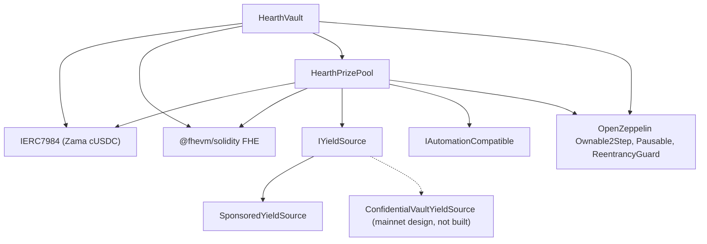

# Deployment

Satu skrip yang bisa diulang, tidak pernah klik manual. Halaman ini berisi urutannya, parameternya dan
arti masing-masing, sehingga seorang peninjau bisa membaca argumen konstruktor yang di-deploy dan tahu
bahwa keduanya cocok.

Hearth men-deploy satu pool per token rahasia: satu vault, satu prize pool dan satu sumber imbal hasil
per token, tanpa berbagi apa pun dengan pool lain. Satu kali jalan membuka satu pool, karena satu nonce
deployer menjalankan satu deploy, dan tokennya dipilih dengan `HEARTH_TOKEN`. Tiap task sesudahnya
menerima `--token`:

```
cd packages/contracts
HEARTH_TOKEN=weth npx hardhat deploy --network sepolia
npx hardhat hearth:verify  --network sepolia --token weth
npx hardhat hearth:seed    --network sepolia --token weth
npx hardhat hearth:status  --network sepolia --token weth
```

Kosongkan keduanya dan Anda mendapat `usdc`, token bawaan jaringan itu. Slug yang tidak dikenal gagal
sambil menampilkan daftar pool yang memang dimiliki jaringan tersebut. Parameter tiap pool tinggal di
satu berkas, `packages/contracts/hearth.config.ts`: pasangan asetnya, periodenya, set tier-nya, bracket
awalnya, laju tetesannya, sponsorship-nya, lima taruhan demonya dan indeks akun tempat keeper-nya
menandatangani. Baca berkas itu berdampingan dengan tabel di bawah; angkanya sama.

Deploy memakai ulang kontrak mana pun yang sudah punya deployment tersimpan alih-alih menggantinya, jadi
menjalankannya kedua kali tidak melakukan apa-apa. Pool yang hidup dan memegang uang penabung serta
riwayat undian berhari-hari tidak akan pernah bisa dipindahkan ke alamat baru dengan menjalankan ulang
skripnya. Untuk menggantinya dengan sengaja, hapus dulu berkasnya di bawah `deployments/<network>/`.

Ia menulis `deployments/sepolia/hearth.<slug>.json`, yaitu berkas yang menjadi arah sebuah keeper lewat
`HEARTH_ADDRESSES_FILE` dan berkas yang menjadi sumber daftar pool aplikasi.

## Apa bergantung pada apa



Garis penuh adalah kontrak di repositori ini. Simpul bergaris putus-putus adalah jalur imbal hasil
mainnet: adapternya dispesifikasikan terhadap antarmuka batcher yang diterbitkan Zama dan tidak ada
kontrak adapter yang ditulis di sini, jadi hanya `SponsoredYieldSource` yang di-deploy di bawah.

Vault dan pool masing-masing membutuhkan yang lain, jadi satu dari dua tautan itu dibuat setelah
deployment alih-alih di dalam konstruktor. Itulah sebabnya ada lima langkah di bawah dan bukan tiga.

## Urutannya

| Langkah | Tindakan | Mengapa di sini |
| --- | --- | --- |
| 1 | Deploy `HearthVault` | Ia memegang uang penabung dan tidak butuh apa pun selain tokennya ada. |
| 2 | Deploy `HearthPrizePool`, mengarah ke vault | Pool membaca jam vault dan hitungan skalanya, dan membayar vault. |
| 3 | Sambungkan: `vault.setPrizePool(pool)` | Memancarkan `PrizePoolSet`. Vault hanya akan menerima pendanaan dari alamat ini. |
| 4 | Deploy sumber imbal hasil, mengarah ke pool sebagai penerima | Ia harus tahu ke mana mengirim panennya. |
| 5 | Sambungkan: `pool.setYieldSource(source)` | Memancarkan `YieldSourceSet`. Sampai ini mendarat, sebuah penutupan tidak memanen apa pun dan memancarkan `HarvestFailed`. |

Setelah langkah 5, isi pool-nya: `hearth:seed --token <slug>` mensponsori sumber imbal hasil supaya
hadiah ada dan memasukkan lima penabung demo berukuran berbeda dari akun 2 sampai 6, sehingga pengunjung
pertama mendarat di pool yang berisi alih-alih kosong. Tiap langkahnya memeriksa rantai untuk apa yang
sudah selesai, jadi seed yang terputus karena gangguan relayer aman dijalankan ulang.

Keeper untuk pool itu juga butuh ETH Sepolia-nya sendiri, begitu juga lima penabung demonya:

```
npx hardhat hearth:spread-gas --network sepolia --token weth
npx hardhat hearth:spread-gas --network sepolia --keepers 10,11,12,13,14,15 --savers false
```

Yang pertama mendanai keeper satu pool dan para penabungnya; yang kedua mendanai beberapa akun keeper
dalam satu jalan, yang dibutuhkan saat membuka enam pool sekaligus.

Lalu arahkan aplikasi ke apa yang sudah di-deploy:

```
cd ../web
node scripts/sync-pools.mjs
```

## Parameternya

```
HearthVault(IERC7984 asset, uint256 periodLength, uint256 firstPeriodAt, address owner)
HearthPrizePool(IHearthVault vault, IERC7984 asset, Tier[3] tiers, uint8 initialScaleBits, address owner)
    Tier = { uint32 prizeCount; uint64 oddsNumerator; uint64 oddsDenominator; uint16 shares; uint16 reconcileEvery }
SponsoredYieldSource(IERC7984ERC20Wrapper asset, address recipient, uint64 ratePerSecond, address owner)
```

### HearthVault

| Parameter | Artinya | Kalau salah |
| --- | --- | --- |
| `asset` | Token rahasia ERC-7984 yang disetor penabung, satu dari tujuh milik Zama. | Tiap wrapper membaca enam desimal, dan deploy menolak melanjutkan kalau rantai tidak sepakat dengan konfigurasinya. Rate ke token publik di bawahnya tidak 1 di tiap pool: pada mock WETH berdesimal 18 rate-nya sejuta juta, jadi apa pun yang membaca token publik harus menerapkannya. |
| `periodLength` (`L`) | Detik dalam satu periode. Tidak bisa diubah. | Ia juga menetapkan batas per penabung, `(2^64 - 1) / L`. `L` yang terlalu kecil membuat batasnya besar tetapi undiannya berisik; terlalu besar dan batasnya mengetat. |
| `firstPeriodAt` | Stempel waktu saat periode 1 dimulai. Tidak bisa diubah, dan harus pada atau sebelum deployment. | Nilai di masa depan membuat `period(now)` tak terdefinisi sampai waktunya lewat. |
| `owner` | Pemilik dua langkah. Pelepasan dinonaktifkan. | Kuasanya terdaftar di [model ancaman](../security/threat-model.md). |

`maxPrincipal` diturunkan dari `periodLength`, bukan disetel. Pada satu jam ia kira-kira 5 miliar token,
pada enam jam kira-kira 854 juta, dan pada satu hari kira-kira 213 juta.

Vault memegang jamnya. Pool mengambil alamat vault dan membaca periode darinya, jadi tidak ada cara bagi
kedua kontrak itu untuk berselisih soal periode mana yang sedang berjalan.

### HearthPrizePool

| Parameter | Artinya |
| --- | --- |
| `vault` | Vault yang dilayani pool ini, dan jam yang dibacanya. |
| `asset` | Token rahasia yang sama dengan yang dipakai vault. Keduanya harus cocok. |
| `prizeCount[t]` | Hadiah per undian di tier `t`. |
| `oddsNumerator[t]`, `oddsDenominator[t]` | Peluang tier itu sebagai pecahan, satu undian dari `oddsDenominator / oddsNumerator`. |
| `shares[t]` | Irisan tier itu atas tiap panen. Share bersifat relatif, jadi 40/20/40 dan 2/1/2 berarti sama. |
| `reconcileEvery[t]` | Berapa undian yang berlalu di antara publikasi carry tier itu. |
| `initialScaleBits` | Perkiraan panjang bit bobot total periode pertama, tebakan awal untuk pelacak bracket. |
| `owner` | Seperti di atas. |

`UTILISATION` adalah konstanta alih-alih argumen: 50 persen, mengikuti PoolTogether V5. Ia adalah
pecahan likuiditas terang sebuah tier yang dipakai untuk menentukan besar tiap hadiah.

Dua di antaranya layak dibahas sepatah kata.

`reconcileEvery` adalah setelan privasi, bukan setelan gas, dan ia bertukar dengan bagaimana pot hadiah
terlihat. Mempublikasikan carry sebuah tier membuat jumlah hadiah tier itu menjadi publik, dan hitungan
atas satu undian menunjuk ke himpunan kecil penabung yang berhak di undian itu. Menyetelnya lebih tinggi
menyebarkan hitungan itu ke rentang di mana hampir semua orang berhak pada suatu titik. Harganya adalah
jackpot yang terlihat: sebuah penutupan memindahkan seluruh likuiditas publik tier ke dalam undian dan
ia hanya kembali pada sebuah rekonsiliasi, jadi tier pada irama 24 mempublikasikan hadiah yang
ditentukan dari porsi panen satu undian pada 23 dari 24 undian, dengan pot yang menumpuk baru terlihat
terbuka pada undian rekonsiliasi. Uangnya ditawarkan dan bisa dimenangkan sepanjang waktu di dalam carry
terenkripsi; ia hanya tidak terlihat. Sepolia menjalankan ketiga tier pada 1 karena alasan itu dan
menyatakan hitungan per undian sebagai sisa risiko. Lihat batasan 14.

`initialScaleBits` hanya perlu mendekati. Pelacaknya membandingkan total sungguhan terhadap lima pangkat
dua di sekitar tebakan saat ini pada tiap penutupan dan mengoreksi dirinya sampai tiga bit per undian,
jadi tebakan yang meleset beberapa bit memakan biaya satu atau dua undian dengan skala peluang yang
sedikit meleset lalu mengendap.

### SponsoredYieldSource

| Parameter | Artinya |
| --- | --- |
| `asset` | Wrapper ERC-7984 yang dipegang dan dikirimnya. Token publik yang dibayarkan sponsor adalah token dasar wrapper itu sendiri, jadi ia bukan argumen terpisah. |
| `recipient` | Prize pool yang menerima panennya. |
| `ratePerSecond` | Seberapa cepat saldo bersponsor menetes keluar sebagai imbal hasil. |
| `owner` | Menyetel lajunya, memancarkan `RateChanged`. |

Mensponsori adalah panggilan terpisah setelah deployment, bukan argumen konstruktor. Ia membukukan
persis apa yang dicetak wrapper alih-alih apa yang diminta sponsor, dan ia tidak bisa dibatalkan.

## Tiga set parameter

Sepolia menjalankan dua di antaranya, karena pool-nya berjalan pada dua jam yang berbeda.

| Setelan | Sepolia `usdc` | Sepolia, enam lainnya | Mainnet, kandidat |
| --- | --- | --- | --- |
| Panjang periode | 1 jam | 6 jam | 1 hari |
| Jendela | 2 jam (dua periode) | 12 jam | 2 hari |
| Tenggat penutupan | 1 jam 30 menit setelah periodenya berakhir | 9 jam setelahnya | 1 hari 12 jam setelahnya |
| Batas per penabung | Sekitar 5 miliar token | Sekitar 854 juta | Sekitar 213 juta |
| Tier utama | count 1, peluang 1/24, shares 40, rekonsiliasi tiap undian | count 1, peluang 1/4, shares 40, rekonsiliasi tiap undian | count 1, peluang 1/30, shares 50, rekonsiliasi tiap undian |
| Tier menengah | count 1, peluang 1/6, shares 20, rekonsiliasi tiap undian | count 1, peluang 1/2, shares 20, rekonsiliasi tiap undian | count 1, peluang 1/7, shares 25, rekonsiliasi tiap undian |
| Tier sering | count 4, peluang 1, shares 40, rekonsiliasi tiap undian | count 4, peluang 1, shares 40, rekonsiliasi tiap undian | count 4, peluang 1, shares 25, rekonsiliasi tiap undian |
| Utilisasi | 50 persen | 50 persen | 50 persen |
| Sumber imbal hasil | `SponsoredYieldSource` | `SponsoredYieldSource` | `ConfidentialVaultYieldSource` di atas batcher milik Zama |
| Hadiah utama cair | Sekitar sekali sehari | Sekitar sekali sehari | Ditentukan peluang yang dipilih |

Angka Sepolia ada supaya pengunjung melihat satu siklus penuh dalam satu duduk: empat hadiah kecil tiap
undian dan satu hadiah utama kira-kira harian pada kedua jam. Angka itu bukan yang akan dipakai
deployment sungguhan.

Mengapa dua jam yang berbeda. Satu undian pada lima penabung memakan `8,456,388` gas, jadi tujuh pool
yang mengundi tiap jam akan menghabiskan sekitar `1.43 ETH` sehari di Sepolia, yang tidak bisa diimbangi
faucet publik. Enam jam memangkasnya menjadi empat undian sehari per pool, sekitar `0.41 ETH` sehari
untuk ketujuhnya. Peluangnya ditetapkan terhadap periode tiap pool sendiri alih-alih dibawa apa adanya,
yang menjadi alasan kolom tengah membaca 1/4 dan 1/2 di tempat kolom pertama membaca 1/24 dan 1/6, dan
alasan hadiah utama tetap mendarat kira-kira sekali sehari di keduanya. Pool USDC mempertahankan jam per
jamnya karena ia di-deploy pertama dan riwayat undiannya terarsip di bawahnya.

Kolom mainnet adalah kandidat, bukan deployment. Aturan mengisinya sama dengan yang menghasilkan kolom
Sepolia: pilih berapa undian yang Anda inginkan di antara hadiah utama lalu setel peluang tier utama ke
satu per angka itu, lalu setel share sehingga besar hadiah yang dihasilkan terbaca masuk akal terhadap
imbal hasil yang benar-benar diperoleh sumbernya, lalu putuskan irama rekonsiliasi tiap tier dengan
menimbang antara hitungan hadiah yang tidak menyebut siapa pun dan pot yang bisa ditonton menumpuk para
penabung. Sepolia mengambil yang kedua; deployment mainnet boleh mengambil yang pertama, dan paragraf di
atas menyebut berapa harga masing-masing sisi. Periode harian dengan peluang tier utama 1 dari 365
memberi hadiah utama tahunan, yang merupakan bentuk yang dipakai V5.

## Alamat yang di-deploy

Tujuh pool di Sepolia, tiap kontrak terverifikasi di Etherscan. Pasangan token yang dipegang
masing-masing adalah milik Zama dan terdaftar di [pool dan token](../concepts/pools-and-tokens.md),
bersama taruhan awal dan laju tetesan per pool.

| Pool | HearthVault | HearthPrizePool | SponsoredYieldSource | Di-deploy di blok |
| --- | --- | --- | --- | --- |
| `usdc` | `0x0F93e5db6027b4FB1C76566d24aA2D2E417fAF52` | `0xA0785AacF30B6FE46EDc53CD8A9db1d94FeF5Df2` | `0xCC49DF69eAB6884fD8DD9260902B8A0Abc9D6b91` | `11622398` |
| `usdt` | `0xe54F44dE64F8A7abc0647eaae547dD59ce0EFfac` | `0x6a83Beb2Dc3f258107Cad5e17BC57657fAd4fbd1` | `0x5bb1Cd5380Cb9f2B15569030fF0dB7a445cF54cA` | `11641314` |
| `weth` | `0x3D1A182782B68fE270A66294C9adaC7F005c4f14` | `0x1a11e7C689F244fA8Dd5f4abA8F2F3131090cc1C` | `0x40DF298f15c6136294eC651aD7b0c1C6F221DE8F` | `11641366` |
| `bron` | `0x18086DC8271f8A73c5Ea985fd519527Dbb991279` | `0x2Ed982979CD184494B947a1E38E597494a38ACe4` | `0x0cD1155D752bD81b3a437a6f0B3965CAA2A1C8e9` | `11641408` |
| `zama` | `0xEEC26386F273c6678cA538AcA18e1d9384eA9F09` | `0x873B285404199D46325a294Aa0EC7a79C30A7fF7` | `0xdD352D70311E834ab75307f53d5C276060081d23` | `11641447` |
| `tgbp` | `0xCe95dAa01f5354aA8887A5952E403D26d452c323` | `0xC531D54ee2c695e0eBfe8b8258e9Fd80fd507095` | `0xDEa2BD6351072F735B6ea83c357bF157d83c01af` | `11641484` |
| `xaut` | `0x77f701101d66FbD522A3bFdC2c00DB09a4F57daE` | `0x9a2888aca42c707A3BC0D561FdF6ff8Abfda5201` | `0x03fDdAA7C4323C53CE511CC49D4c33B26B492af7` | `11641523` |

Awal periode pertama: `1788386400 (2 September 2026, 22:00:00 UTC)` untuk `usdc`,
`1788620400 (5 September 2026, 15:00:00 UTC)` untuk `usdt`, dan
`1788624000 (5 September 2026, 16:00:00 UTC)` untuk lima sisanya. `firstPeriodAt` tidak bisa diubah dan
harus pada atau sebelum blok deployment, jadi deploy membaca jam rantai itu sendiri dan membulatkan ke
bawah ke awal jam, tidak pernah jam mesin.

## Verifikasi

Verifikasi adalah bagian dari deploy, bukan renungan belakangan. Peninjau yang tidak bisa membaca sumber
yang di-deploy harus memercayai perkataan kami atas seluruh dokumentasi ini.

1. Verifikasi ketiga kontrak pool itu di Etherscan dengan argumen konstruktor yang dicatat skrip deploy:
   `hearth:verify --token <slug>` melakukannya, kontrak demi kontrak, dan menyebutkan mana yang sudah
   terverifikasi.
2. Periksa bahwa argumen konstruktor yang terverifikasi cocok dengan tabel parameter di atas. Terutama
   bahwa pool diberi vault-nya sendiri dan `asset` yang sama, dan bahwa set tier-nya cocok dengan kolom
   untuk jam pool itu.
3. Periksa bahwa `vault.prizePool()` adalah prize pool pool itu dan `pool.yieldSource()` adalah sumber
   pool itu, dan bahwa keduanya tidak mengarah ke kontrak pool lain.
4. Periksa tokennya: `asset` seharusnya adalah wrapper rahasia untuk pool itu dari daftar Sepolia yang
   diterbitkan Zama, dan `underlying()` seharusnya adalah mock publik di bawahnya. `rate()` wrapper
   bernilai 1 hanya di tempat token publiknya juga membaca enam desimal; di pool WETH ia sejuta juta,
   dan rate selain 1 mengubah arti satu unit dasar bagi apa pun yang menyentuh token publik.
5. Baca `pool.scaleBits()` setelah beberapa undian dan periksa apakah ia sudah mengendap dekat panjang
   bit yang disiratkan ukuran sungguhan pool. Pelacak yang macet jauh dari sana berarti tebakan awalnya
   meleset sangat jauh dan koreksinya belum menyusul.

## Rahasia

Tidak ada yang sensitif yang pernah ditulis langsung di kode. Deploy membaca dari berkas `.env`, dan
`.env.example` mendaftar tiap kunci dengan komentar tentang dari mana nilainya berasal. Kunci deployer
dan kunci keeper adalah akun terpisah, jadi kunci panas keeper tidak punya kuasa pemilik.

## Meng-hosting aplikasi

Aplikasi adalah paket workspace Next.js, bukan akar repositori, dan itulah setelan yang paling sering
disalahpahami kebanyakan host.

| Setelan | Nilai | Mengapa |
| --- | --- | --- |
| Framework preset | Next.js | Terdeteksi dari `packages/web/package.json` |
| Root directory | `packages/web` | Aplikasinya tinggal di sebuah workspace npm |
| Sertakan berkas sumber di luar root directory | Aktif | Dependensi diangkat ke akar repositori, dan build butuh `package.json` dan lockfile akar |
| Install command | bawaannya, `npm install` | Berjalan di akar repositori dan memasang seluruh workspace |
| Build command | bawaannya, `next build` | Dengan root directory tersetel, ia berjalan di dalam `packages/web` |
| Output directory | bawaannya, `.next` | Lihat peringatan di bawah |
| Versi Node | 20 atau lebih baru | `package.json` akar menyetel `engines.node` |

Jangan setel `NEXT_DIST_DIR` di lingkungan yang di-hosting. `packages/web/next.config.ts` membacanya dan
memindahkan hasil build ketika ia ada. Ia ada supaya build verifikasi lokal tidak berebut direktori
`.next` yang sama dengan dev server yang berjalan. Di build yang di-hosting ia akan memindahkan hasilnya
menjauh dari tempat host mencarinya, dan deploy-nya akan gagal tanpa petunjuk yang jelas.

### Variabel lingkungan

| Variabel | Publik di browser | Dari mana nilainya berasal |
| --- | --- | --- |
| `SEPOLIA_RPC_URL` | Tidak | Endpoint Sepolia Anda sendiri. Halaman muka dan rute `/api/activity` membaca rantai di server, jadi yang ini tidak pernah sampai ke browser. Kueri log membutuhkannya, karena node publik gratis membatasi rentang `eth_getLogs` jauh di bawah satu hari blok |
| `NEXT_PUBLIC_SEPOLIA_RPC_URL` | Ya | Opsional. Pembacaan dompet memakainya dan jatuh kembali ke `https://ethereum-sepolia-rpc.publicnode.com` ketika tidak disetel. Terlihat di bundel, jadi ia harus yang Anda rela publikasikan |
| `NEXT_PUBLIC_CHAIN_ID` | Ya | `11155111` untuk Ethereum Sepolia. Aplikasi memakainya sebagai bawaan kalau tidak disetel |
| `NEXT_PUBLIC_WALLETCONNECT_PROJECT_ID` | Ya | Opsional, dan gratis dari dasbor Reown di https://dashboard.reown.com. Setel dia dan setiap layar koneksi menawarkan "Scan with a phone" di samping ekstensi peramban, itulah jalan masuk bagi dompet ponsel dan mesin yang tidak bisa dipasangi ekstensi. Dibiarkan kosong, konektornya tidak dibangun sama sekali, jadi tidak ada yang ditawari tombol yang gagal tepat saat mereka memindai |

Tidak ada alamat kontrak yang menjadi variabel lingkungan lagi. Aplikasi membaca tiap pool dari
`packages/web/src/lib/chain/pools.json`, yang dihasilkan `node scripts/sync-pools.mjs` dari berkas alamat
yang ditulis skrip deploy, sehingga alamat yang ditampilkan aplikasi selalu bisa dilacak ke catatan
deployment alih-alih ke sesuatu yang diketik orang. Jalankan skrip itu setelah tiap deploy dan commit
hasilnya. Tiga variabel publik yang dulu menyimpan alamat vault, prize pool dan sumber imbal hasil satu
pool sudah tidak ada; hapus dari lingkungan mana pun yang masih menyetelnya, karena tidak ada yang
membacanya.

Aset rahasia dan ERC-20 dasarnya juga dibaca dari vault dan wrapper di rantai, jadi aplikasi tidak bisa
berbicara dengan token yang akan ditolak vault.

### Setelah deploy pertama

1. Buka URL produksinya di ponsel. Tiap halaman harus bekerja pada lebar 375 piksel.
2. Sambungkan dompet di Sepolia dan jalani jalur dua menit dari README terhadap situs yang di-deploy
   alih-alih localhost.
3. Buka `/verify?pool=<slug>` dan tempelkan alamat seorang penabung. Ambang batasnya datang dari
   panggilan kontrak, jadi kalau ia tampil, aplikasi yang di-deploy sedang berbicara dengan vault pool
   itu yang di-deploy.
4. Buka pemilih pool dan periksa tiap slug memuat dasbornya sendiri, dan bahwa token yang dibatasi
   menampilkan halaman penolakannya alih-alih layar yang rusak.

---

## Apa yang tidak dibahas halaman ini

Halaman ini tidak membahas menjalankan pool setelah deployment, yang ada di [keeper](keeper.md), dan satu
proses keeper per pool adalah bagian dari halaman itu. Halaman ini tidak membahas kesiapan operasional
mainnet: adapter Confidential Vault dispesifikasikan terhadap antarmuka batcher yang diterbitkan Zama dan
tidak diimplementasikan di repositori ini, dan membawanya hidup dijelaskan di
[sumber imbal hasil](../concepts/yield-source.md).
