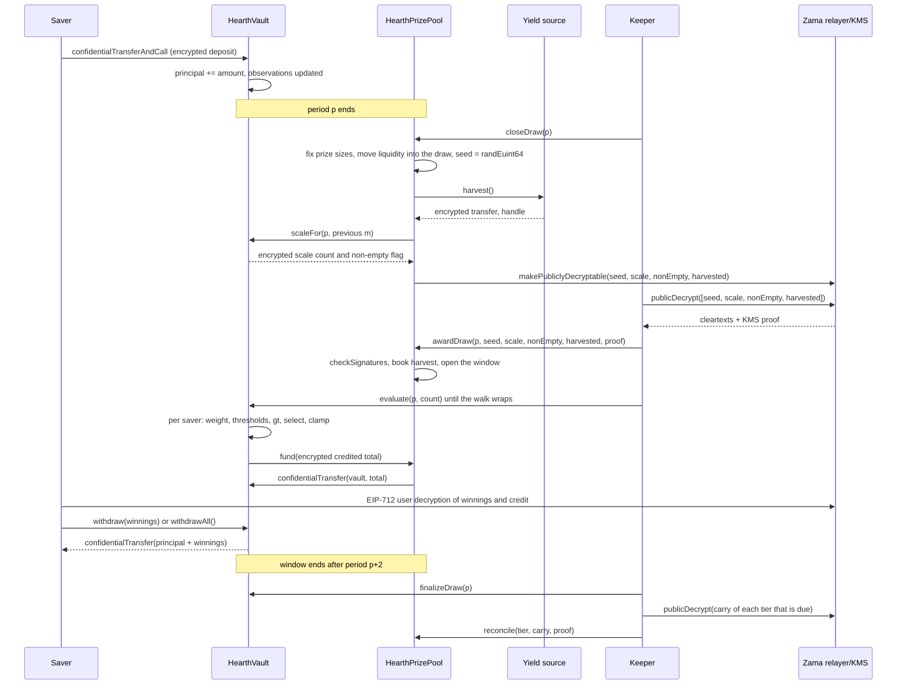

# 抽選の仕組み

抽選は、プールの利回りが賞金に変わる瞬間です。このページでは、その全体をまず言葉で説明し、次に同じ話を
図で示します。

## 期間

時間は `L` 秒ずつの等しい期間に区切られます。期間 1 は `firstPeriodAt` から始まります。これはデプロイ時に
固定され、以後変更されないタイムスタンプです。そこから先は単なる割り算です。

```
period(t)      = (t - firstPeriodAt) / L + 1
periodStart(p) = firstPeriodAt + (p - 1) * L
periodEnd(p)   = periodStart(p + 1)
```

プールごとに `L` が異なります。Sepolia では USDC プールが 1 時間、他の 6 つが 6 時間なので、訪問者は 1 回
座っている間に一巡を見られます。メインネットの実運用なら 1 日を使うでしょう。PoolTogether V5 がそうして
います。期間はコンストラクタの引数なので、同じコードが 3 通りすべてに対応し、各プールのティア確率はその
プール自身の期間に対して設定されます。[プールとトークン](pools-and-tokens.md)を参照してください。

抽選 `p` は期間 `p` を対象とします。結果は期間 `p` の間に保有された残高だけで決まります。期間 `p` が終わった
あとに起きることは、その結果を変えません。

## ウィンドウと、クローズの期限

抽選 `p` の各ステップは期間 `p+1` と `p+2` の間に行われます。それがウィンドウで、`periodEnd(p + 2)` で
終わります。USDC プールでは 2 時間、他では半日です。

クローズにはウィンドウ全体より厳しい期限があります。

```
closeDeadline(p) = periodStart(p + 2) + L / 2
```

これはウィンドウの 2 つ目の期間の中間点、ウィンドウ全体の 4 分の 3 の地点です。それ以降のクローズは拒否
されます。

理由は、クローズと授与が同じブロックに入れないからです。クローズはチェーン上で値を復号可能にし、平文は
Zama のリレイヤーからオフチェーンで戻り、授与はそれをチェーン上で検証します。ウィンドウの最後の数秒で
クローズすると、この往復の着地点がなくなり、抽選は `Closed` のまま永久に止まってしまいます。この期限が、
往復と授与と各評価バッチのために少なくとも半期間を確保します。

ウィンドウは、ボールトがどれだけ過去の残高を覚えておく必要があるかも決めており、それが預入者あたり 3 件
の観測値で足りる理由になっています。[時間加重残高](time-weighted-balance.md)を参照してください。

## 5 つのステップ

どのステップもパーミッションレスです。誰でもどれでも呼べます。アプリからの預入者も含めてです。キーパーは
たいてい先に着くアドレスというだけです。

### 1. クローズ

`closeDraw(p)` を、期間 `p` が終わったあと、`closeDeadline(p)` より前に呼びます。

この 1 回のトランザクションの中で、次の順に 5 つのことが起きます。

- **賞金額が確定します。** 各ティアの賞金額と、この抽選に差し出す流動性が、そのティアがいま保有している
  額から計算され、その流動性が抽選に移ります。これは乱数シードが存在する前に起きます。
- **シードが引かれます。** `FHE.randEuint64()` が Zama のコプロセッサ内部で実行されるので、その数値は
  暗号文としてしか存在せず、誰も見ていません。
- **ボールトが、その期間の合計ウェイトがどこにあるかを報告します。** 小さな暗号化されたカウント 1 つと、
  そもそも誰かが残高を保有していたかを示す暗号化されたフラグとしてです。合計そのものではありませんし、
  この時点ではまだ平文でもありません。次の節を参照してください。
- **イールドソースがハーベストされます。** プールへの暗号化送金 1 回としてです。ソースが失敗しても
  クローズは成功します。ハーベストは自明な暗号化ゼロとして扱われ、`HarvestFailed` イベントが出ます。
  壊れたイールドソースが時計を止めることはできません。
- **4 つのハンドルが公開復号可能になります。** シード、スケールカウント、非空フラグ、ハーベストです。これは
  Zama のアクセス制御リスト上の一方向のフラグです。その瞬間から誰でもリレイヤーに平文を要求でき、フラグを
  取り消すことはできません。抽選に関する他のものがこの印を付けられることはありません。

抽選の状態は `Closed` に移ります。クローズはちょうど 1 回しか成功しません。だから誰もシードを引き直せません。

このトランザクション内部の順序が要点です。賞金額はシードが存在する前に確定するので、シードが現れるのを見て、
自分が当たったと分かってから、プールのお金を動かして当選額を大きくすることは誰にもできません。

### ボールトが合計の代わりに公開するもの

その期間のプールの合計時間加重残高、`W` と書きます、は決して公開されません。正確に公開することが 2026 年
9 月 3 日までの設計でしたが、レビューがそれを破りました。`W` が連続する 2 期間について公開されており、
かつ預入者自身の預け入れや引き出しの公開タイムスタンプがあれば、その期間にお金を動かしたのが自分だけだった
預入者は、計算だけで正確な金額を復元されます。範囲を絞られるのではなく、復元されます。詳しくは
[何が秘密のままか](../security/what-stays-private.md)にあります。

いま公開されるのは `W` が入る区分、つまり `W` 以上で最小の 2 のべき乗であり、`M = 2^m` と書きます。ボールト
はこれを暗号化したまま追跡します。クローズのたびに、前回の抽選の `m` の周辺にある 5 つの 2 のべき乗と `W` を
比較し、その結果を足し合わせて 1 つの小さな暗号化カウントにし、そのカウントを公開復号可能にします。プールは
検証済みのカウントから新しい `m` を求めます。1 との別の暗号化比較が非空フラグを与え、そもそも誰かが残高を
保有していたかを示します。

つまり観察者が 1 回の抽選から学ぶのは 1 つだけです。プールが 2 のべき乗をまたいだかどうかです。またがない
限り、新しく学ぶことはありません。どの抽選も `W` ではなく `M` に対して実行され、それが下記の賞の件数が
そういう形で辻褄の合う理由になっています。

### 2. 授与

`awardDraw(p, seed, scaleCount, nonEmpty, harvested, proof)` です。

呼び出す人は Zama のリレイヤーから 4 つの平文を取得します。リレイヤーは鍵管理サービス（KMS）、つまり
ネットワークの復号鍵を保持する当事者群の署名を付けて返します。コントラクトは数値を 1 つも信じる前に、
その署名を `FHE.checkSignatures` でチェーン上で検証します。証明はハンドルに固定の順序
`[seed, scaleCount, nonEmpty, harvested]` で紐付いているので、4 つの値を入れ替えたり、別の抽選に対して
再利用したりはできません。

そのうえで、

- 検証済みのハーベストが、シェアの重みに応じて各ティアに計上されます。賞金が入ってくる経路はこれだけで、
  この抽選ではなく各ティアに入るので、次のクローズで差し出されます。プールがイールドソースの自己申告額を
  計上することはありません。
- 非空フラグが「期間 `p` に誰も残高を保有していなかった」と言うなら、抽選は `Empty` と記録され、差し出されて
  いた流動性はそのままティアに戻ります。
- そうでなければ抽選が開きます。シードと区分 `M` はここで公開された数値になります。
- 誰かが授与する時点でウィンドウがすでに閉じていた場合も、ハーベストは計上され、差し出された流動性は
  ティアに戻り、抽選は `Skipped` と記録されます。その期間は賞金を支払いませんが、利回りも流動性も失われません。

抽選の状態は `None`、`Closed`、`Awarded`、`Empty`、`Skipped` の 5 つです。

**当選者が決まるのはこの瞬間です。** ここからシードは公開された数値、区分も公開された数値になり、期間 `p` に
おける各預入者のウェイトはもう変わりません。各預入者が超えるべきしきい値は、公開された入力に対する計算です。
次の評価は何も決めません。すでに存在する結果を書き留めるだけです。

### 3. 評価

ボールトの `evaluate(p, count)` を、ウィンドウが開いている間、必要なだけ繰り返し呼びます。

呼び出す人が指定するのは、何人分進めるかです。誰を、ではありません。ボールトは `seed mod saverCount` から
始まる抽選ごとのカーソルから預入者リストをリスト順に巡回し、最大 `count` 人分、そのうち暗号化処理が必要な
のは最大 `4` 人までを処理します。期間 `p` 以前の観測値を持たない預入者はウェイトがゼロであり、平文の
タイムスタンプから、暗号化コストをまったくかけずにスキップされます。

巡回が到達した各預入者について、ボールトは期間 `p` のその人の暗号化ウェイトを読み、公開されたしきい値に
対して当選判定を実行し、結果をその人の暗号化された当選金に加えます。その預入者のその抽選における暗号化
ウェイトと暗号化付与額の両方を、その預入者だけが読める形で保存します。だからアプリは「抽選 p であなたは
X 当たりました」と表示でき、本人は比較を検証できます。そのうえで、そのバッチで加算した暗号化合計を賞金
プールから引き出します。

誰が、どの順番で評価されるかを選ぶ人はいません。自分の結果を知りたい預入者も、他の全員が進めるのと同じ
巡回を進めるだけです。だから evaluate のトランザクションを送っても、当選したかどうかは何も伝わりません。
開始地点はその抽選のシードから来るので毎回動き、どのアドレスも恒久的に列の最後尾になることはありません。

`evaluate` は、`Empty` の抽選、`Skipped` の抽選、まだ授与されていない抽選に対しては失敗します。

### 4. ファイナライズ

`finalizeDraw(p)` を、ウィンドウが閉じたあとに呼びます。

各ティアが差し出して支払わなかった分は、そのティアの暗号化された繰越額に折り込まれます。繰越額は暗号化
されたまま抽選から抽選へ引き継がれる累計です。クローズのたびにそのティアの差し出し分に加算されるので、
支払われなかったお金は規模が秘密のままでもすぐに再び使われます。

ファイナライズは、プールが資金を用意できなかった分を数えるグローバルな暗号化カウンタ 1 つの、現在の
ハンドルも公開します。ハーベストが検証されている限り、この値は常にゼロです。

### 5. 精算

プールの `reconcile(tier, carry, proof)` を、1 ティアずつ、そのティアの番が来たときにだけ呼びます。

各ティアは、デプロイ時に `reconcileEvery[t]` 抽選として設定された頻度で精算されます。Sepolia ではどの
ティアも毎回の抽選が対象です。ティアの番が来ると、`finalizeDraw` がその繰越額を公開復号可能にし、
`CarryPublished` を出します。誰かが平文を取得し、KMS の証明とともに `reconcile` を呼ぶと、検証済みの数値が
そのティアの平文流動性に戻されます。ボールトはその間に増えているかもしれない繰越額から同じ数値を差し引き、
`TierReconciled` が出ます。

精算こそが、そのティアの賞の件数を公開するものです。繰越額は、差し出されたうち誰も当てなかった分そのもの
だからです。頻度が 1 なら、各ティアの件数はそれが属する抽選の 1 回あとに公開され、各ティアの全体のポットは
アプリが増えていく様子を見せられる形で公開に戻ります。頻度を上げれば、その回数ぶん件数が隠れ、それと一緒に
増えていくポットも隠れます。これが[賞金とティア](prizes-and-tiers.md)で示すトレードオフです。どちらにしても
消えるものはなく、どの頻度でも誰が当てたかは分かりません。

## あるステップが実行されなかった場合

- **クローズが実行されない。** 抽選は `None` のままスキップされます。流動性は動かされていないので各ティアに
  残り、次の抽選で差し出されます。ハーベストは次のクローズで回収されます。
- **ウィンドウ内に授与が実行されない。** 遅れた授与でもハーベストは計上され、差し出された流動性はティアに
  戻り、抽選は `Skipped` になります。
- **誰も評価しない。** 各ティアの差し出し分は全額、ファイナライズで繰越額に折り込まれ、次の精算で戻ります。

取り残されるものも、失われるものもありません。キーパーが止まればプールは抽選を失いますが、お金は失いません。
[キーパーのページ](../operations/keeper.md)を参照してください。

## お金が申告で動くことはない

会計を欺きにくくしているルールが 2 つあります。

利回りを鵜呑みにすることはありません。ソースがプールへ暗号化送金を行い、プールは受取人なのでその暗号文に
対する権限を持ち、そのうえで初めてプールがそれを公開し、KMS が検証した平文を計上します。バグのある、
あるいは敵対的なイールドソースは、主張より少なく送ることはできますが、届いていない賞金をプールに信じ込ませる
ことはできません。これが重要なのは、存在しない賞金原資は、いずれ誰かの元本から支払われることになるからです。

支払いはプッシュではなくプルです。各評価バッチのあと、ボールトはバッチ合計の暗号文に対する短命の許可を
プールに与え、プールは同じものをトークンに与え、トークンはちょうどその額をプールからボールトへ動かします。
プールの資金が足りなければ、ボールトはその差をグローバルな暗号化未充当カウンタに記録します。これは
ファイナライズで公開され、誰でも確認できます。ハーベストが検証されている限り、このカウンタは常にゼロです。

## 抽選の全体像



## このページが扱わないこと

期間を通じて預入者のウェイトがどう積み上がるかは扱いません。それは[時間加重残高](time-weighted-balance.md)
です。当選判定の計算も扱いません。それは[当選者の決定](winner-selection.md)です。各賞の金額がどう決まるかも
扱いません。それは[賞金とティア](prizes-and-tiers.md)です。
