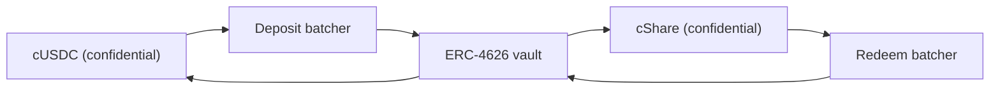

# 賞金の出どころ

賞金は利回りです。誰かの元本が賞金として支払われることはありません。それがこのプールを「損失のない」ものに
しています。このページでは、すべてのソースが実装する 1 つのインターフェース、いま Sepolia で動いているソース、
プールがソースの申告をいっさい信用しない理由、そしてメインネットで Zama 自身の Confidential Vault をつなぐ方法を
扱います。

## インターフェース

```solidity
interface IYieldSource {
    function harvest() external returns (euint64 transferred); // confidential transfer to the recipient
    function harvestable() external view returns (uint64);      // display only
}
```

関数は 2 つです。`harvest` は積み上がった利回りを機密送金として賞金プールに動かし、実際に動いた暗号化された額を
返します。`harvestable` はアプリの表示用で、プールがこれを会計に使うことはありません。

`harvest` が同期的なのは意図した設計です。その瞬間にソースが用意できている分を動かすだけであり、非同期に稼ぐ
ソースは、プールを待たせるのではなく、あらかじめその額を用意しておくことが期待されます。

ソースの差し替えはプールに対するオーナーの呼び出し 1 回、`setYieldSource` で、`YieldSourceSet` を出します。
システムの他のどの部分も、どのソースが付いているかを知りませんし、気にしません。

失敗するソースが抽選を止めることはありません。プールは失敗を捕捉し、その抽選のハーベストを自明な暗号化ゼロとして
扱い、`HarvestFailed` を出します。クローズは成功し、抽選は各ティアがすでに持っている流動性の上で走り、動かせなかった
利回りは後のハーベストで回収されます。壊れた、あるいは配線を間違えたソースは賞金の側を枯らしますが、時計を止める
ことはできません。

ハーベストが着地すると、それはその抽選の授与で計上され、次のクローズで差し出されます。つまり期間 `p` の利回りは
抽選 `p` ではなく抽選 `p+1` の賞金を賄います。それが、賞の金額をシードの存在より前に確定できる理由です。

## Sepolia: スポンサー方式のソース

`SponsoredYieldSource` が稼働中の全プールで動いており、プールごとに 1 インスタンスなので、7 つのソースは 7 種類の
異なるトークンの 7 つの別々の残高です。USDC プールのものは `0xCC49DF69eAB6884fD8DD9260902B8A0Abc9D6b91` にあり、
残り 6 つは[プールとトークン](pools-and-tokens.md)にあります。

スポンサーは、そのプールの公開トークンを使ってソース自身の `sponsor` 関数を呼びます。ソースはそれを機密トークンに
ラップし、スポンサーが要求した額ではなく、ラッパーが実際に発行した額を計上します。そこから残高は `ratePerSecond` で
垂れていきます。USDC プールでは `1 秒あたり 5,555 基本単位、つまり 1 期間あたり 19.998 USDC` です。そして `harvest` が
積み上がった分をプールに送ります。各プールの速度は 1 時間あたりの整数トークン数で設定してあるので、別の時計で動く
2 つのプールを一目で比べられます。そしてどのスポンサー額も 80 回を超える抽選を賄える大きさです。

スポンサーは寄付です。スポンサーが取り戻す経路はなく、垂らす速度を変えられるのはソースのオーナーだけで、それは
`RateChanged` を出します。

スポンサー額、垂らす速度、そしてすべてのハーベストは公開です。これは妥協ではありません。PoolTogether でもボールトが
拠出する利回りの額は公開であり、賞の金額はすべてそこから決まります。Hearth で機密なのは、誰がいくら貯め、誰が
当てたかであって、プールがいくら稼いだかではありません。

しばらくプールに預入者がいなくても、利回りは積み上がり続け、預入者がいる最初の抽選に支払われます。空のプールで
取り残されるものはありません。

### そもそもなぜモックなのか

モックのソースは、その仕組みと本物のつなぎ方をドキュメントが述べて初めて誠実になります。どちらも以下に書きます。
私たちはまず本物を探しましたが、Zama のモックトークンに利回りを払うものは Sepolia に存在しません。

| 場所 | なぜ使えないか |
| --- | --- |
| Aave | Sepolia で USDC の預け入れを拒否します。供給上限を超過しています |
| Compound | Zama のモックではなく Circle 自身の USDC を要求します |
| Zama の Confidential Vault | Sepolia のボールトはイールドアダプタのない待機専用の VaultV2 です。これは Zama 自身の説明です |

つまり誠実な選択肢は、増えていくだけの偽の数値か、チェーン上に本当に存在して本当に垂れるスポンサー資金の残高か、
どちらかでした。私たちは後者を取りました。稼働中の 7 つのプールすべてで、賞金は 1 単位残らず、本当にラップされ、
本当に送金され、本当に検証されたものです。

## プールは申告された数値を計上しない

これが、スポンサー方式のソースを弱点にしないためのルールです。

ソースはプールへ暗号化送金を行います。プールは受取人としてその暗号文に対する権限を持つので、送られた額を自分で
公開復号可能にできます。授与の時点で `FHE.checkSignatures` が鍵管理サービスの平文への署名を検証して初めて、プールは
各ティアに何かを計上します。

送った額について嘘をつくソースは何も得られません。プールが計上するのは届いた額であり、それがプールの見る唯一の額
だからです。

これは理屈の上での用心ではありません。私たちの旧設計では、プールは準備金への補充を呼び出し側が渡した額から計上して
いましたが、ラッパーが発行するのは `amount / rate()` です。稼働環境では `rate()` がたまたま 1 だったので両者は一致し、
バグは潜伏していました。ラッパーのレートが 1 兆になる 18 桁の原資産では、プールは存在する額の 1 兆倍の賞金を信じ込んだ
はずです。私たちは 2026 年 9 月 2 日に、18 桁のテストトークンに対してそれを実行し、実際に起きるのを見ました。損失の
ないプールにおける存在しない賞金原資は、いずれ誰かの元本から支払われます。それはこの製品が破ってはならない唯一の
約束です。送金を検証することで、この種類の問題がまるごと消えます。

## メインネット: Zama の Confidential Vault

Zama は、機密残高で利回りを稼ぐことだけを目的としたプロトコルを提供しており、これはメインネットのソースとして
自然な選択です。その設計におけるアダプタが `ConfidentialVaultYieldSource` です。以下はその仕様であって、この
リポジトリにあるコントラクトではありません。

他のすべてと同じくプールごとに 1 アダプタで、それぞれがそのトークン用のバッチャーとイールドボールトを必要とします。
Zama のメインネットのデプロイは現在 USDC を対象としているので、メインネットの Hearth なら USDC プールを
Confidential Vault の上に開き、他のトークンはそれぞれに存在するソースの上に、なければ開かないことになります。

設計は、機密トークンと通常の ERC-4626 イールドボールトの間に置かれたバッチャーです。ERC-4626 のボールトは公開の
送金しか受け付けないので、単独の預入者は自分の正確な額を公開してしまいます。バッチャーは代わりに多数の暗号化された
預け入れをまとめ、その合計だけを復号し、ボールトへの公開の預け入れを 1 回行い、機密のシェアを返します。Zama 自身の
言い方はこうです。「観察者には誰が参加したかは見えるが、誰がいくら拠出したかは見えない」



アダプタは、プールの機密トークンを持って預け入れバッチャーに参加し、機密のシェアを保有します。償還はハーベストに
先立って独自のスケジュールで走ります。キーパーが定期的に償還バッチャーに増加分を要求し、その要求を 4 つの段階に
沿って進めるので、プールが次に `harvest` を呼ぶころには、償還された機密 USDC がすでにアダプタの中にあり、ハーベストは
他と同じ 1 回の送金になります。これが、非同期の運用先を同期的なインターフェースに合わせる方法です。4 つの段階はどれも
パーミッションレスなので、Zama のオペレータの実行を待つ必要は誰にもありません。

### アドレス

Zama 自身のアドレス一覧より、2026 年 9 月 2 日に取得したものです。

**イーサリアムメインネット、チェーン ID 1。** 原資産は USDC。イールドソースは Morpho の
「Steakhouse Confidential Prime USDC」VaultV2 で、預け入れバッチャーだけがそのボールトの預入者になるよう
制限されています。

| コントラクト | アドレス |
| --- | --- |
| 預け入れバッチャー | `0x324EA89FD3784036673BfE6Ffee2334A088F40Cc` |
| 償還バッチャー | `0x96Cd3Faa7483783Ac2Eb715f6333361500F1eec9` |
| cUSDC ラッパー | `0xe978F22157048E5DB8E5d07971376e86671672B2` |
| cShare ラッパー | `0x66Bf74E96900D1a19c7070D939D124f2F565C458` |
| ERC-4626 ボールト | `0xbEEF00A59B577423653A1526c7009bdE103F542B` |
| USDC | `0xA0b86991c6218b36c1d19D4a2e9Eb0cE3606eB48` |

**Sepolia、チェーン ID 11155111。** ステージング環境です。USDC は誰でも呼べる `mint` を持つモックで、ボールトは
イールドアダプタのない待機専用です。

| コントラクト | アドレス |
| --- | --- |
| 預け入れバッチャー | `0x48758559c14d4d92b4C74A99660B6a8dbe85F53b` |
| 償還バッチャー | `0xe94E9afdDd43a19C2914739e9279cb6Fe287BEb0` |
| cUSDC ラッパー | `0x7c5BF43B851c1dff1a4feE8dB225b87f2C223639` |
| cShare ラッパー | `0x7E93d5c150A2178B1fCde0278582Acf59478eA5f` |
| ERC-4626 ボールト（待機） | `0x6AB54988261AEC573a2CA13cF802d3B1114f864C` |
| Mock USDC | `0x9b5Cd13b8eFbB58Dc25A05CF411D8056058aDFfF` |

Sepolia のボールトが待機状態なので、このアダプタは Zama が公開しているバッチャーのインターフェースに対する仕様と
してここに書かれているだけで、まだ実装していません。何も稼がないものを稼働中だと言えば、1 分で確かめられる嘘に
なります。

### 実際につなぐとはどういうことか

バッチャーは 4 つの段階で動きます。参加、送出、確定、受け取りです。バッチは最小の待ち時間に達するまで待ち、その
合計が復号され、ボールトが決済し、参加者が受け取ります。この 4 つはどれもパーミッションレスなので、プールが Zama の
オペレータを待って止まることはなく、受け取りの権利が失効することもありません。

このリズムはスポンサー方式のソースの即時の垂らしより遅く、だからキーパーは `harvest` の中ではなく前もって償還を
走らせます。プールのコントラクトが待つことはありません。すでに受け取り済みのものをアダプタに尋ねるだけです。これを
本番に持っていくうえで実際に残っている作業は、このリポジトリが仕様として書いているだけで実装していないアダプタの
コントラクト本体と、そのキーパー側、つまりどのくらいの頻度で償還を始め、ポジションのどれだけを償還するかという判断
です。後者は方針の選択であり、遅れてもチェーン上の帰結はありません。

### Hearth が引き受けることになるもの

これを正しく名指しすることが、この件について誠実であることの一部です。

- **ボールトのリスク、全面的に。** バッチャーはお金を第三者の ERC-4626 ボールトへ送ります。そのボールトが価値を
  失えば、プールの利回りを生む残高も一緒に価値を失います。ここは「損失がない」が他人のコントラクトに依存する唯一の
  場所であり、だからメインネットのデプロイはそこに利回りを生む部分だけを置くべきです。
- **プールの機密性ではなく、バッチの機密性。** バッチャーは共同参加者の中で金額を隠し、合計を復号します。もし
  Hearth がバッチの唯一の参加者なら、その預け入れ額は公開になります。Hearth のハーベストはどのみち公開されるので
  これは何の損にもなりませんが、バッチャーが実際以上に隠してくれると思い込む前に知っておく価値はあります。
- **限定されたオーナー権限。** バッチャーのオーナーは、最小バッチ待ち時間（上限 7 日）、コールバック期限（上限 30 日）、
  預け入れのスリッページ許容度を変更でき、参加と送出を停止できます。Zama のドキュメントは、オーナーがユーザーの資金を
  動かすことも凍結することもできず、結果を検閲できず、誰の金額も復号できず、コントラクトをアップグレードできないと
  述べています。償還のスリッページ保護はハードコードで無効にされており、ボールトの下落局面でも出口が機能します。

## このページが扱わないこと

イールドソースが漏洩の表に与える影響は扱いません。それは[何が秘密のままか](../security/what-stays-private.md)にあります。
Morpho のボールトの利回りをベンチマークすることもしません。それは他人の数値であり、日々変わります。そしてアダプタが
稼働しているとも主張しません。Sepolia で付いているのはスポンサー方式のソースであり、ダッシュボードの「いまのプール」
カードがそれを明記しています。
