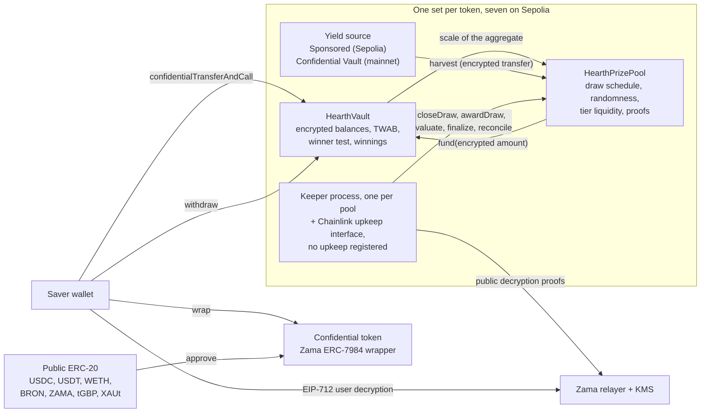

# Hearth とは

Hearth は、お金を失うことがなく、賞金が当たるかもしれない貯蓄プールです。Sepolia では機密トークン
ごとに 1 つ、合わせて 7 つが動いています。貯蓄口座を選ぶのと同じ感覚でトークンを選べます。

機密トークンを預け入れます。USDC、USDT、WETH、BRON、ZAMA、tGBP、XAUt のいずれかです。プールは
そのお金を運用して利回りを得ます。期間ごとに、プールが得た利回りが賞金として配られ、当選確率は
「いくら保有したか」と「どれだけの期間保有したか」に比例します。元本はいつでも全額引き出せます。
これが PoolTogether が生み出した「損失のない宝くじ」という発想で、Hearth はその機密版です。

PoolTogether との違いは、通常のブロックチェーンではすべてが公開されている点にあります。誰でも各
預入者の残高、各ウォレットの当選確率、各抽選の当選者を読めてしまいます。それは人々の資産額を公開
することであり、大口の参加者を標的にしてしまいます。Hearth は Zama のプロトコルを使い、この全体を
暗号化された数値の上で動かします。チェーンはあなたの残高を暗号文（鍵がなければ読めないデータ）と
して保持し、コントラクトはそのまま計算を行います。あなたの残高は、私たちを含め誰も見たことのない
数値でありながら、抽選は第三者が検証できます。

## 全体像を 1 枚の図で

仕事をするのは 2 つのコントラクトです。`HearthVault` は各預入者の暗号化された元本、暗号化された
当選金、何をどれだけの期間保有したかの記録を保持し、当選判定を実行します。`HearthPrizePool` は
時計を回し、乱数シードを引き、利回りを回収し、賞金をティアごとに保管します。キーパーのプロセスが
抽選を前に進めますが、その各ステップは誰でも代わりに実行できます。

図の中央の枠が 1 つのトークンのプールです。それが 7 つあり、互いに何も共有しません。あなたの USDC
のポジションと WETH のポジションは、別々のボールトにいる別々の預入者です。1 つのプールが止まって
も、残りは動き続けます。いま見ているプールはアドレスバーの先頭部分でわかります。`/app/usdc` や
`/app/weth` です。アドレス付きの全リストは[プールとトークン](../concepts/pools-and-tokens.md)に
あります。

## 4 つの操作

預入者が行うのは 4 つの操作です。それぞれが何をして、何を外に漏らすのかを示します。

### 1. 預け入れ

そのプールの機密トークンを、1 回のトランザクションでボールトに送ります。金額は暗号文ハンドルと
して移動します。ハンドルとは、値そのものではなく暗号化された値への参照です。ボールトはそれを
あなたの暗号化された元本に加算し、残高の推移の記録を更新します。何も復号せずに、です。

- 隠れるもの: 金額、累計残高、したがってプールに占めるあなたの割合。
- 公開されるもの: あなたのアドレス、実行したブロック、預け入れが起きたという事実。

継ぎ目が 1 か所あります。通常の公開トークンを機密トークンに変える処理は公開の ERC-20 送金なので、
ラップした金額は見えます。5,000 USDC をラップして 2 ブロック後に預け入れれば、観察者はかなり正確に
推測できます。Hearth がラップと預け入れを 2 つの別ステップのままにしているのは、まさにその間隔を
空けられるようにするためです。[ラップの継ぎ目](../security/what-stays-private.md)を参照してください。

### 2. 抽選

各期間の終わりに、プールはその期間の抽選をクローズします。1 回のトランザクションの中で、まず各
ティアの賞金額を確定し、次に Zama のコプロセッサ内部で暗号化された乱数シードを引き、次にボールト
にプールの規模を尋ね、最後にその期間の利回りを回収します。この順序に意味があります。賞金額は乱数
が存在する前に決まるので、シードを見てから当選額を並べ替えることは誰にもできません。

「プールの規模」という言い方はわざと曖昧にしています。それが設計です。ボールトは全預入者の時間加重
残高の合計を公開しません。公開するのは、その合計が入る 2 のべき乗の区分だけです。つまり世界が知る
のは、プールの正確な規模ではなくおおよその規模です。正確な数値を公開すれば、連続する 2 回の抽選の
差を取るだけで、単独の預入者の預入額をその差から読み取れてしまいます。

その後、4 つの小さな値が Zama の鍵管理サービスの署名付きで公開され、誰でも検証できます。シード、
区分、そもそもプールに誰かがいたかどうか、そして回収された利回りです。その数値が検証された瞬間に、
その抽選における各預入者の結果は確定します。

- 隠れるもの: 各預入者のウェイト、プールの正確な合計、そして個々の結果すべて。
- 公開されるもの: シード、区分、回収された利回り、各ティアの賞金額、そして 1 回あとの抽選で
  ティアが精算されたときに、そのティアが何件の賞を支払ったか。

### 3. 受け取り

受け取りのトランザクションは存在しません。そこが要点です。アプリには受け取りボタンがあり、「マイ
抽選」のその抽選のカードに、金額付きで表示されます。実体は、いま開示した当選金を通常どおり引き出す
だけの操作で、チェーン上では他のどの引き出しともまったく同じに見えます。

当選金は、抽選が評価される過程で、ボールト内の別の暗号化残高に加算されます。そのために何かをする
必要はなく、何をしてもそれが露見することはありません。当選したかどうかを知るには EIP-712 メッセージ
に署名します。これは自分がそのアドレスを管理していることを証明する、型付きのオフチェーン署名です。
Zama のリレイヤーが、あなた自身の当選金の平文をブラウザに返します。この署名はチェーンに触れないので、
費用はかからず、痕跡も残りません。ダッシュボードの残高と抽選結果にはそれぞれ目のアイコンがあり、
両方を同時に開けます。最初の署名は 2 つ目にもそのまま使えます。

- 隠れるもの: すべて。自分の当選金を読む操作はオフチェーンです。
- 公開されるもの: なし。

多くの賞金プロトコルでは、当選者は受け取りのトランザクションを送る必要があり、落選者にはその理由が
ありません。だからトランザクション一覧が当選者を静かに名指ししてしまいます。Hearth にはそのような
トランザクションがありません。賞金を加算する `evaluate` は自分に向けて実行できません。その抽選自身の
シードが決めた地点から預入者リストを巡回し、呼び出し側が指定できるのは何人分進めるかだけです。

### 4. 引き出し

お金を取り出す関数は 1 つ、`withdraw` です。まず当選金から、次に元本から支払い、あなたの保有額と
ボールトの保有額の小さいほうに丸めます。賞金を受け取るのでも、貯蓄を持ち帰るのでも、その両方でも、
同じ形の同じ呼び出しで、同じイベントと暗号化された金額が出ます。

丸めの後半があるのは、機密送金が「全額動くか、まったく動かないか」のどちらかだからです。要求額の
一部だけを送ることはありません。そこでボールトは、トークンに支払いを依頼する前に実際に支払える額を
計算します。あとから不足を修復しようとするのではなく、です。

- 隠れるもの: 金額、そのうち賞金が含まれていたかどうか。
- 公開されるもの: あなたのアドレス、ブロック、引き出しが起きたという事実。

元本がロックされることはありません。抽選の進行中も預け入れと引き出しは開いたままです。この分野の
他のいくつかの設計では、そうではありません。

## 公平性を支えるもの

2 つあり、どちらも特別な権限のない第三者が検証できます。

乱数シードは `FHE.randEuint64` から生まれます。Zama のコプロセッサ内部で、ネットワークの FHE 鍵の
もと、公開されたシードから生成されます。予測はできず、2 度引くこともできません。抽選のクローズは
ちょうど 1 回しか成功しないからです。期間が終わると、プールはそのシードと、プール合計が入った区分を
一緒に公開します。どちらもコントラクトがチェーン上で検証する証明を伴います。

この 2 つの公開値から、誰でも、どのアドレスがどのティアでどのしきい値を超える必要があったかを正確に
再計算できます。ボールトは同じ計算を view として公開しているので、再実装を信用する必要はありません。
できないのは、比較相手である暗号化されたウェイトを見ることです。つまりルールは公開され監査可能で、
秘密なのは入力だけです。詳細は[乱数と検証](../security/randomness-and-verification.md)にあります。

## Hearth が隠さないもの

短くまとめます。全文は[何が秘密のままか](../security/what-stays-private.md)にあります。

- 誰が預入者か、そして各人がいつ預け入れ、引き出し、評価されたか。
- 各期間にプール合計が入った区分、シード、回収された利回り。
- 各ティアの賞金額と、1 回あとの抽選で公開される支払い件数。
- 機密トークンにラップした金額、およびそこから戻した金額。
- 預入者が 1 人なら、公開された区分はその人のウェイトを 2 倍以内の精度で示します。2 人なら、互いに
  相手を絞り込めます。ここでのプライバシーには 3 人以上が必要で、アプリはそれを明記します。
- しきい値は公開されるので、あなたの残高を特定できる者は、以後すべての抽選での結果を計算できます。
  よくある特定経路は、ラップの数分後に同額を預け入れることです。だからアプリは 2 つを引き離します。
- 全額をラップして全額を戻すと、これまでに当てた総額の下限が公開されます。どちらの動きもトークン層
  では公開だからです。
- 当選した抽選の直後に必ず引き出す預入者は、自分の行動から統計的な手がかりを漏らします。これはどんな
  コントラクトでも直せません。
