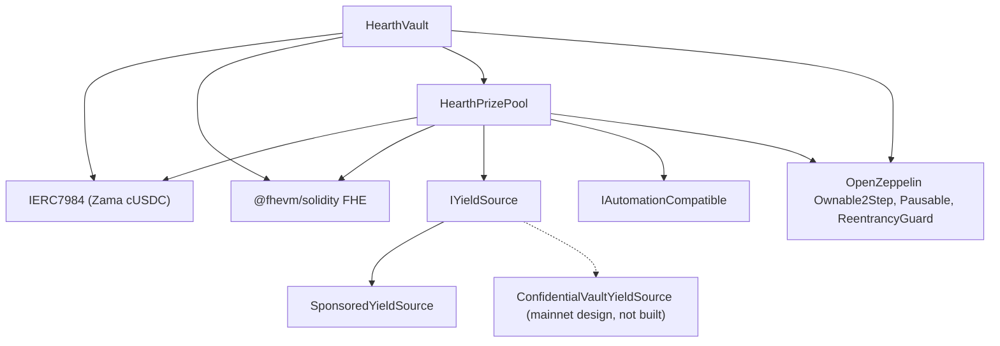

# デプロイ

繰り返し実行できるスクリプト 1 本で行い、手作業のクリックはしません。このページは、その順序、パラメータ、そして各パラメータの
意味です。レビュアーがデプロイされたコンストラクタ引数を読んで、それが一致していると分かるようにするためです。

Hearth は機密トークンごとに 1 プールをデプロイします。トークンごとにボールト、賞金プール、イールドソースが 1 つずつあり、他の
プールとは何も共有しません。1 回の実行で 1 つのプールを開きます。1 つのデプロイヤーの nonce が 1 つのデプロイを走らせるからです。
トークンは `HEARTH_TOKEN` で選びます。以降のタスクはすべて `--token` を取ります。

```
cd packages/contracts
HEARTH_TOKEN=weth npx hardhat deploy --network sepolia
npx hardhat hearth:verify  --network sepolia --token weth
npx hardhat hearth:seed    --network sepolia --token weth
npx hardhat hearth:status  --network sepolia --token weth
```

どちらも省くと、そのネットワークの既定のトークンである `usdc` になります。未知のスラッグは、そのネットワークに実在するプールの
一覧とともに失敗します。すべてのプールのパラメータは 1 つのファイル `packages/contracts/hearth.config.ts` にあります。資産のペア、
期間、ティアの構成、初期の区分、垂らす速度、スポンサー額、5 人のデモステーク、そしてそのキーパーが署名するアカウントインデックス
です。下の表と並べてそのファイルを読んでください。同じ数値です。

デプロイは、すでに保存されたデプロイ記録を持つコントラクトを置き換えるのではなく再利用するので、2 回目の実行は何もしません。
預入者のお金と何日ぶんもの抽選履歴を抱えた稼働中のプールが、スクリプトの再実行で新しいアドレスに移ることは決してありません。
意図的に置き換えたい場合は、先に `deployments/<network>/` の下のそのファイルを削除してください。

スクリプトは `deployments/sepolia/hearth.<slug>.json` を書きます。これがキーパーに `HEARTH_ADDRESSES_FILE` で指し示すファイルで
あり、アプリのプール一覧の生成元でもあります。

## 何が何に依存するか



実線はこのリポジトリにあるコントラクトです。破線のノードはメインネットの利回りの経路で、アダプタは Zama が公開したバッチャーの
インターフェースに対する仕様であり、ここにはアダプタのコントラクトを書いていないので、下でデプロイするのは
`SponsoredYieldSource` だけです。

ボールトとプールは互いを必要とするので、2 つのリンクのうち片方はコンストラクタではなくデプロイ後に張ります。だから下のステップは
3 つではなく 5 つです。

## 順序

| ステップ | 操作 | なぜここか |
| --- | --- | --- |
| 1 | `HearthVault` をデプロイ | 預入者のお金を保持し、必要なのはトークンが存在することだけです。 |
| 2 | ボールトを指す `HearthPrizePool` をデプロイ | プールはボールトの時計とスケールカウントを読み、ボールトに支払います。 |
| 3 | 配線: `vault.setPrizePool(pool)` | `PrizePoolSet` を出します。ボールトはこのアドレスからの資金供給しか受け付けません。 |
| 4 | プールを受取人とするイールドソースをデプロイ | ハーベストの送り先を知っている必要があります。 |
| 5 | 配線: `pool.setYieldSource(source)` | `YieldSourceSet` を出します。これが着地するまで、クローズは何もハーベストせず `HarvestFailed` を出します。 |

ステップ 5 のあと、プールに初期データを入れます。`hearth:seed --token <slug>` がイールドソースにスポンサー資金を入れて賞金を
存在させ、アカウント 2 から 6 を使って大きさの異なる 5 人のデモ預入者を配置するので、最初の訪問者は空ではなく中身のあるプールに
着地します。すべての手順がチェーンを見て何がすでに済んでいるかを確かめるので、リレイヤーの不調で中断した seed は再実行しても安全
です。

そのプールのキーパーにもそれ自身の Sepolia ETH が要りますし、5 人のデモ預入者にも要ります。

```
npx hardhat hearth:spread-gas --network sepolia --token weth
npx hardhat hearth:spread-gas --network sepolia --keepers 10,11,12,13,14,15 --savers false
```

1 つ目は 1 つのプールのキーパーと預入者に資金を入れます。2 つ目は複数のキーパーアカウントに一度で資金を入れるもので、6 つのプールを
まとめて開くときに必要になります。

そのうえで、デプロイしたものにアプリを向けます。

```
cd ../web
node scripts/sync-pools.mjs
```

## パラメータ

```
HearthVault(IERC7984 asset, uint256 periodLength, uint256 firstPeriodAt, address owner)
HearthPrizePool(IHearthVault vault, IERC7984 asset, Tier[3] tiers, uint8 initialScaleBits, address owner)
    Tier = { uint32 prizeCount; uint64 oddsNumerator; uint64 oddsDenominator; uint16 shares; uint16 reconcileEvery }
SponsoredYieldSource(IERC7984ERC20Wrapper asset, address recipient, uint64 ratePerSecond, address owner)
```

### HearthVault

| パラメータ | 意味 | 間違えるとどうなるか |
| --- | --- | --- |
| `asset` | 預入者が預け入れる ERC-7984 の機密トークン。Zama の 7 つのうちの 1 つです。 | どのラッパーも小数点以下 6 桁を返し、チェーンが設定と食い違えばデプロイは続行を拒否します。その下の公開トークンへのレートは、すべてのプールで 1 なわけではありません。18 桁の WETH モックでは 1 兆なので、公開トークンを読むものはすべてそれを適用しなければなりません。 |
| `periodLength`（`L`） | 1 期間の秒数。変更不能です。 | 預入者ごとの上限 `(2^64 - 1) / L` も決めます。`L` が小さすぎると上限は大きくなりますが抽選が荒くなり、大きすぎると上限が厳しくなります。 |
| `firstPeriodAt` | 期間 1 が始まるタイムスタンプ。変更不能で、デプロイ時点以前でなければなりません。 | 未来の値だと、その時刻が過ぎるまで `period(now)` が未定義になります。 |
| `owner` | 2 段階のオーナー。放棄は無効です。 | 権限は[脅威モデル](../security/threat-model.md)に列挙されています。 |

`maxPrincipal` は設定するものではなく `periodLength` から導かれます。1 時間ならおよそ 50 億トークン、6 時間ならおよそ 8 億 5,400 万、
1 日ならおよそ 2 億 1,300 万です。

時計はボールトが持ちます。プールはボールトのアドレスを取ってそこから期間を読むので、2 つのコントラクトが「いまが何期間目か」に
ついて食い違うことはありません。

### HearthPrizePool

| パラメータ | 意味 |
| --- | --- |
| `vault` | このプールが仕える相手のボールトであり、読み取る時計です。 |
| `asset` | ボールトが使うのと同じ機密トークン。一致していなければなりません。 |
| `prizeCount[t]` | ティア `t` の 1 抽選あたりの賞の件数。 |
| `oddsNumerator[t]`、`oddsDenominator[t]` | そのティアの確率を分数で。`oddsDenominator / oddsNumerator` 回の抽選に 1 回です。 |
| `shares[t]` | 各ハーベストにおけるそのティアの取り分。シェアは相対値なので、40/20/40 と 2/1/2 は同じ意味です。 |
| `reconcileEvery[t]` | そのティアの繰越額が公開されるまでに何回の抽選をはさむか。 |
| `initialScaleBits` | 最初の期間の合計ウェイトの想定ビット長。区分の追跡器の初期値です。 |
| `owner` | 上記と同じ。 |

`UTILISATION` は引数ではなく定数で、PoolTogether V5 にならって 50 パーセントです。各賞の金額を決めるのに使う、ティアの平文流動性の
割合です。

このうち 2 つには一言添える価値があります。

`reconcileEvery` はガスの設定ではなくプライバシーの設定であり、賞のポットの見え方とのトレードオフになります。ティアの繰越額を公開
することはそのティアの賞の件数を公開することであり、1 回の抽選についての件数は、その抽選で対象だった少数の預入者を指します。値を
高くすると、その件数はほぼ全員がどこかで対象だった期間全体に広がります。その代償は見えるジャックポットです。クローズはティアの
公開流動性を全額抽選に移し、それが戻るのは精算のときだけなので、頻度 24 のティアは 24 回のうち 23 回、1 回分のハーベストのシェアから
決まる賞を公開し、積み上がったポットが公開の場に現れるのは精算の回だけです。その間もお金は暗号化された繰越額の中で差し出され、
当てられる状態にあります。ただ見えないだけです。Sepolia が 3 つのティアすべてを 1 で動かしているのはそのためであり、抽選ごとの件数を
残余として明記しています。制約 14 を参照してください。

`initialScaleBits` は近ければ十分です。追跡器はクローズのたびに現在の推定値の周辺にある 5 つの 2 のべき乗と実際の合計を比べ、
1 抽選あたり最大 3 ビットずつ自分を修正するので、数ビットずれた推定値は 1、2 回の抽選で当選確率がわずかにずれるだけの代償で済み、
そのあと落ち着きます。

### SponsoredYieldSource

| パラメータ | 意味 |
| --- | --- |
| `asset` | 保有して送る ERC-7984 のラッパー。スポンサーが払い込む公開トークンはこのラッパー自身の原資産なので、別の引数にはなっていません。 |
| `recipient` | ハーベストを受け取る賞金プール。 |
| `ratePerSecond` | スポンサー資金の残高が利回りとして垂れる速さ。 |
| `owner` | 速度を設定し、`RateChanged` を出します。 |

スポンサーはコンストラクタの引数ではなく、デプロイ後の別の呼び出しです。スポンサーが要求した額ではなくラッパーが発行した額を
正確に計上し、取り消すことはできません。

## 3 つのパラメータ組

Sepolia はそのうち 2 つを使っています。プールが 2 つの時計で動いているからです。

| 設定 | Sepolia の `usdc` | Sepolia の他の 6 つ | メインネット候補 |
| --- | --- | --- | --- |
| 期間の長さ | 1 時間 | 6 時間 | 1 日 |
| ウィンドウ | 2 時間（2 期間） | 12 時間 | 2 日 |
| クローズの期限 | 期間終了の 1 時間 30 分後 | 9 時間後 | 1 日 12 時間後 |
| 預入者ごとの上限 | およそ 50 億トークン | およそ 8 億 5,400 万 | およそ 2 億 1,300 万 |
| グランドティア | 件数 1、確率 1/24、シェア 40、毎回の抽選で精算 | 件数 1、確率 1/4、シェア 40、毎回の抽選で精算 | 件数 1、確率 1/30、シェア 50、毎回の抽選で精算 |
| ミッドティア | 件数 1、確率 1/6、シェア 20、毎回の抽選で精算 | 件数 1、確率 1/2、シェア 20、毎回の抽選で精算 | 件数 1、確率 1/7、シェア 25、毎回の抽選で精算 |
| フリークエントティア | 件数 4、確率 1、シェア 40、毎回の抽選で精算 | 件数 4、確率 1、シェア 40、毎回の抽選で精算 | 件数 4、確率 1、シェア 25、毎回の抽選で精算 |
| 利用率 | 50 パーセント | 50 パーセント | 50 パーセント |
| イールドソース | `SponsoredYieldSource` | `SponsoredYieldSource` | Zama のバッチャー上の `ConfidentialVaultYieldSource` |
| グランド賞が出る頻度 | およそ 1 日 1 回 | およそ 1 日 1 回 | 選んだ確率次第 |

Sepolia の数値は、訪問者が 1 回座っている間に一巡を見られるようにするためのものです。毎回の抽選で小さな賞が 4 件、そしてどちらの
時計でもグランド賞がおよそ 1 日 1 回です。実運用のデプロイが使う数値ではありません。

なぜ 2 つの時計なのか。預入者 5 人での抽選は `8,456,388` ガスなので、7 つのプールが 1 時間ごとに抽選すれば Sepolia で 1 日およそ
`1.43 ETH` を使うことになり、公開フォーセットでは追いつけません。6 時間にすればプールあたり 1 日 4 回に減り、7 つ合わせて 1 日およそ
`0.41 ETH` です。確率は各プール自身の期間に対して設定され持ち越されないので、真ん中の列が 1/4 と 1/2 で、最初の列が 1/24 と 1/6 に
なっており、それでもグランド賞がどちらでもおよそ 1 日 1 回出ます。USDC プールが 1 時間の時計を保っているのは、最初にデプロイされ、
その抽選履歴がそこに紐付いているからです。

メインネットの列はデプロイではなく候補です。これを埋めるルールは、Sepolia の列を生んだのと同じものです。グランド賞と賞の間に何回の
抽選を挟みたいかを決めてグランドティアの確率をその逆数にし、次に、ソースが実際に稼ぐ利回りに対して賞の金額が妥当に読めるように
シェアを決め、最後に、誰も名指ししない賞の件数と、預入者が積み上がるのを見られるポットを天秤にかけて各ティアの精算頻度を決めます。
Sepolia は後者を取りました。メインネットのデプロイは前者を取るかもしれません。それぞれの代償は上の段落に書いたとおりです。1 日の
期間でグランドの確率を 365 分の 1 にすれば年 1 回のグランド賞になり、それが V5 の形です。

## デプロイ済みアドレス

Sepolia の 7 つのプールで、すべてのコントラクトが Etherscan で検証済みです。各プールが保有するトークンのペアは Zama のもので、
プールごとの初期ステークと垂らす速度とともに[プールとトークン](../concepts/pools-and-tokens.md)に一覧があります。

| プール | HearthVault | HearthPrizePool | SponsoredYieldSource | デプロイされたブロック |
| --- | --- | --- | --- | --- |
| `usdc` | `0x0F93e5db6027b4FB1C76566d24aA2D2E417fAF52` | `0xA0785AacF30B6FE46EDc53CD8A9db1d94FeF5Df2` | `0xCC49DF69eAB6884fD8DD9260902B8A0Abc9D6b91` | `11622398` |
| `usdt` | `0xe54F44dE64F8A7abc0647eaae547dD59ce0EFfac` | `0x6a83Beb2Dc3f258107Cad5e17BC57657fAd4fbd1` | `0x5bb1Cd5380Cb9f2B15569030fF0dB7a445cF54cA` | `11641314` |
| `weth` | `0x3D1A182782B68fE270A66294C9adaC7F005c4f14` | `0x1a11e7C689F244fA8Dd5f4abA8F2F3131090cc1C` | `0x40DF298f15c6136294eC651aD7b0c1C6F221DE8F` | `11641366` |
| `bron` | `0x18086DC8271f8A73c5Ea985fd519527Dbb991279` | `0x2Ed982979CD184494B947a1E38E597494a38ACe4` | `0x0cD1155D752bD81b3a437a6f0B3965CAA2A1C8e9` | `11641408` |
| `zama` | `0xEEC26386F273c6678cA538AcA18e1d9384eA9F09` | `0x873B285404199D46325a294Aa0EC7a79C30A7fF7` | `0xdD352D70311E834ab75307f53d5C276060081d23` | `11641447` |
| `tgbp` | `0xCe95dAa01f5354aA8887A5952E403D26d452c323` | `0xC531D54ee2c695e0eBfe8b8258e9Fd80fd507095` | `0xDEa2BD6351072F735B6ea83c357bF157d83c01af` | `11641484` |
| `xaut` | `0x77f701101d66FbD522A3bFdC2c00DB09a4F57daE` | `0x9a2888aca42c707A3BC0D561FdF6ff8Abfda5201` | `0x03fDdAA7C4323C53CE511CC49D4c33B26B492af7` | `11641523` |

最初の期間の開始は、`usdc` が `1788386400（2026 年 9 月 2 日 22:00:00 UTC）`、`usdt` が
`1788620400（2026 年 9 月 5 日 15:00:00 UTC）`、残り 5 つが
`1788624000（2026 年 9 月 5 日 16:00:00 UTC）` です。`firstPeriodAt` は変更不能でデプロイのブロック以前でなければならないので、
デプロイはマシンの時計ではなくチェーン自身の時計を読み、正時に切り下げます。

## 検証

検証はデプロイの一部であって、後回しの作業ではありません。デプロイされたソースを読めないレビュアーは、このドキュメント全体について
私たちの言葉を信じるしかなくなります。

1. そのプールの 3 つのコントラクトすべてを、デプロイスクリプトが記録したコンストラクタ引数で Etherscan に検証させます。
   `hearth:verify --token <slug>` がコントラクトごとに実行し、すでに検証済みのものがどれかを教えます。
2. 検証済みのコンストラクタ引数が上のパラメータ表と一致することを確認します。とくに、そのプールが自分のボールトと同じ `asset` を
   与えられていること、そしてティアの構成がそのプールの時計に対応する列と一致していることです。
3. `vault.prizePool()` がそのプールの賞金プールであり、`pool.yieldSource()` がそのプールのソースであること、そしてどちらも別の
   プールのコントラクトを指していないことを確認します。
4. トークンを確認します。`asset` は Zama が公開した Sepolia の一覧にある、そのプール用の機密ラッパーであるべきで、`underlying()` は
   その下の公開モックであるべきです。ラッパーの `rate()` が 1 になるのは、公開トークンも 6 桁を返す場合だけです。WETH プールでは
   1 兆であり、1 でないレートは、公開トークンに触れるすべてのものにとって基本単位の意味を変えます。
5. 数回の抽選のあとに `pool.scaleBits()` を読み、そのプールの実際の規模が示すビット長の近くに落ち着いていることを確認します。
   そこから大きく離れたまま止まっている追跡器は、初期の推定が大きくずれていて修正が追いついていないことを意味します。

## 秘密情報

機微なものをハードコードすることは決してありません。デプロイは `.env` ファイルから読み、`.env.example` がすべてのキーを、値の
出どころのコメント付きで列挙しています。デプロイヤーの鍵とキーパーの鍵は別のアカウントなので、キーパーのホットキーにオーナー権限は
ありません。

## アプリのホスティング

アプリはリポジトリのルートではなく Next.js のワークスペースパッケージです。ほとんどのホストが間違えるのはこの設定だけです。

| 設定 | 値 | なぜ |
| --- | --- | --- |
| フレームワークのプリセット | Next.js | `packages/web/package.json` から検出されます |
| ルートディレクトリ | `packages/web` | アプリは npm のワークスペースの中にあります |
| ルートディレクトリ外のソースファイルを含める | オン | 依存関係はリポジトリのルートに巻き上げられており、ビルドにはルートの `package.json` とロックファイルが要ります |
| インストールコマンド | 既定の `npm install` | リポジトリのルートで走り、ワークスペース全体をインストールします |
| ビルドコマンド | 既定の `next build` | ルートディレクトリを設定していれば `packages/web` の中で走ります |
| 出力ディレクトリ | 既定の `.next` | 下記の注意を参照してください |
| Node のバージョン | 20 以上 | ルートの `package.json` が `engines.node` を設定しています |

ホスティング環境で `NEXT_DIST_DIR` を設定しないでください。`packages/web/next.config.ts` がこれを読み、存在するとビルドの出力先を
移します。これは、ローカルの検証ビルドが稼働中の開発サーバーと同じ `.next` ディレクトリを取り合わないようにするためのものです。
ホストのビルドでは、ホストが探す場所から出力を移してしまい、原因の分かりにくい失敗になります。

### 環境変数

| 変数 | ブラウザで公開されるか | 値の出どころ |
| --- | --- | --- |
| `SEPOLIA_RPC_URL` | いいえ | あなた自身の Sepolia エンドポイント。ランディングページと `/api/activity` のルートはサーバー側でチェーンを読むので、これがブラウザに届くことはありません。ログの問い合わせにはこれが必要です。無料の公開ノードは `eth_getLogs` の範囲を 1 日ぶんのブロックよりはるかに小さく制限するからです |
| `NEXT_PUBLIC_SEPOLIA_RPC_URL` | はい | 任意です。ウォレットからの読み取りがこれを使い、未設定なら `https://ethereum-sepolia-rpc.publicnode.com` にフォールバックします。バンドルに現れるので、公開してよいものでなければなりません |
| `NEXT_PUBLIC_CHAIN_ID` | はい | イーサリアム Sepolia なら `11155111`。未設定ならアプリがこれを既定にします |
| `NEXT_PUBLIC_WALLETCONNECT_PROJECT_ID` | はい | 任意で、Reown のダッシュボード https://dashboard.reown.com から無料で取得できます。設定すると、どの接続画面でもブラウザ拡張の横に「スマートフォンで読み取る」が出ます。スマートフォンのウォレットや、拡張を入れられないマシンはここから入ります。空のままならコネクタ自体が組み込まれないので、読み取った瞬間に失敗するボタンを誰も見せられません |

コントラクトのアドレスはもう 1 つも環境変数ではありません。アプリはすべてのプールを `packages/web/src/lib/chain/pools.json` から
読み、それは `node scripts/sync-pools.mjs` がデプロイスクリプトの書いたアドレスファイルから生成します。だからアプリが表示する
アドレスは、誰かが入力したものではなく、常にデプロイの記録まで辿れます。デプロイのたびにそのスクリプトを実行し、結果をコミットして
ください。かつて 1 プールのボールト、賞金プール、イールドソースのアドレスを保持していた 3 つの公開変数はなくなりました。まだ設定して
いる環境からは削除してください。何もそれを読みません。

機密資産とその下の ERC-20 も、ボールトとラッパーからチェーン上で読むので、アプリがボールトの拒否するトークンとやり取りすることは
ありません。

### 初回デプロイのあとに

1. 本番の URL を携帯で開きます。すべてのページが横幅 375 ピクセルで動く必要があります。
2. Sepolia でウォレットを接続し、README の 2 分コースを localhost ではなくデプロイ済みのサイトに対して歩きます。
3. `/verify?pool=<slug>` を開いて預入者のアドレスを貼ります。しきい値はコントラクトの呼び出しから来るので、それが描画されれば
   デプロイ済みのアプリがそのプールのデプロイ済みボールトと会話しているということです。
4. プールピッカーを開き、すべてのスラッグが自分のダッシュボードを読み込むこと、そして制限付きトークンが壊れた画面ではなく拒否の
   ページを表示することを確認します。

---

## このページが扱わないこと

デプロイ後のプールの運用は扱いません。それは[キーパー](keeper.md)であり、プールごとに 1 つのキーパープロセスという話もそのページの
一部です。メインネットの運用準備も扱いません。Confidential Vault のアダプタは Zama が公開したバッチャーのインターフェースに対する
仕様であり、このリポジトリには実装されておらず、それを本番に持っていく話は
[イールドソース](../concepts/yield-source.md)にあります。
