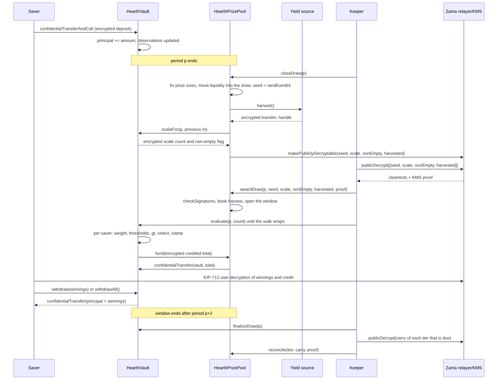

# 추첨은 어떻게 돌아가는가

추첨은 풀의 수익이 상금으로 바뀌는 순간입니다. 이 페이지는 그 전부를 평범한 말로 훑고, 같은
이야기를 도표로 한 번 더 보여 줍니다.

## 기간

시간은 `L`초짜리 동일한 기간으로 잘립니다. 기간 1은 `firstPeriodAt`에서 시작합니다. 배포 시점에
고정되고 그 뒤로 바뀌지 않는 타임스탬프입니다. 거기서부터는 그냥 나눗셈입니다.

```
period(t)      = (t - firstPeriodAt) / L + 1
periodStart(p) = firstPeriodAt + (p - 1) * L
periodEnd(p)   = periodStart(p + 1)
```

풀마다 자기 `L`이 있습니다. Sepolia에서 USDC 풀은 1시간, 나머지 여섯 개는 6시간이라, 방문자가 한
자리에서 한 주기 전체를 봅니다. 메인넷의 실제 배포라면 하루를 쓸 것이고, PoolTogether V5가 쓰는
값이 그것입니다. 기간은 생성자 인자이므로 같은 코드가 셋 모두를 감당하고, 각 풀의 티어 확률은
그 풀의 기간에 맞춰 설정됩니다. [풀과 토큰](pools-and-tokens.md)을 보십시오.

추첨 `p`는 기간 `p`를 다룹니다. 전적으로 기간 `p` 동안 보유한 잔액으로 결정됩니다. 기간 `p`가
끝난 뒤에 일어나는 어떤 일도 그 결과를 바꿀 수 없습니다.

## 윈도우, 그리고 마감 기한

추첨 `p`의 모든 단계는 기간 `p+1`과 `p+2` 동안에 일어납니다. 그것이 윈도우이고,
`periodEnd(p + 2)`에 끝납니다. USDC 풀에서는 두 시간, 나머지에서는 반나절입니다.

마감에는 나머지 윈도우보다 빠듯한 기한이 있습니다.

```
closeDeadline(p) = periodStart(p + 2) + L / 2
```

윈도우의 두 번째 기간 중간이고, 윈도우 전체의 4분의 3 지점입니다. 그 뒤의 마감은 거부됩니다.

이유는 마감과 확정이 한 블록을 공유할 수 없기 때문입니다. 마감은 값들을 체인 위에서 복호화
가능하게 표시하고, 평문은 오프체인으로 Zama 릴레이어에서 돌아오며, 확정이 그것을 체인 위에서
검증합니다. 윈도우의 마지막 몇 초에 마감하면 그 왕복이 내려앉을 곳이 없어지고, 추첨은 `Closed`
상태에 영원히 갇힙니다. 이 기한은 왕복과 확정과 모든 평가 배치에 최소 반 기간을 보장합니다.

윈도우는 볼트가 잔액을 얼마나 과거까지 기억해야 하는지도 제한하며, 그것이 저축자당 저장된 관측치
세 개로 충분한 이유입니다. [시간 가중 잔액](time-weighted-balance.md)을 보십시오.

## 다섯 단계

모든 단계는 무허가입니다. 앱에서 접속한 저축자를 포함해 누구든 어느 단계든 호출할 수 있습니다.
키퍼는 그저 대개 먼저 도착하는 주소일 뿐입니다.

### 1. 마감

`closeDraw(p)`입니다. 기간 `p`가 끝난 뒤, `closeDeadline(p)` 전에 호출합니다.

이 트랜잭션 하나 안에서 다섯 가지가 다음 순서로 일어납니다.

- **상금 크기가 확정됩니다.** 각 티어의 상금 크기와 그 티어가 이번 추첨에 내놓는 유동성이 지금
  그 티어가 보유한 돈에서 계산되고, 그 유동성이 추첨으로 옮겨 갑니다. 무작위 시드가 존재하기
  전에 일어납니다.
- **시드가 뽑힙니다.** `FHE.randEuint64()`가 Zama 코프로세서 안에서 돌아가므로, 그 숫자는 암호문
  으로만 존재하고 아무도 본 적이 없습니다.
- **볼트가 그 기간의 집계 가중치가 어디쯤 있는지 보고합니다.** 작은 암호화된 개수 하나와, 누군가
  잔액을 조금이라도 들고 있었는지를 말하는 암호화된 플래그 하나입니다. 집계값 자체도 아니고,
  아직 평문도 아닙니다. 다음 절을 보십시오.
- **수익원에서 수확합니다.** 풀로 가는 암호화된 전송 한 번입니다. 수익원이 실패해도 마감은
  성공합니다. 수확은 자명한 암호화된 0으로 처리되고 `HarvestFailed` 이벤트가 나갑니다. 고장 난
  수익원이 시계를 멈출 수는 없습니다.
- **네 개의 핸들이 공개 복호화 대상으로 표시됩니다.** 시드, 규모 개수, 비어 있지 않음 플래그,
  그리고 수확분입니다. Zama 접근 제어 목록에서 한 방향으로만 켜지는 플래그입니다. 그 순간부터
  누구든 릴레이어에 평문을 요청할 수 있고, 플래그는 되돌릴 수 없습니다. 추첨에 관한 다른 어떤
  것도 이렇게 표시되지 않습니다.

추첨 상태는 `Closed`로 넘어갑니다. 마감은 정확히 한 번만 성공하고, 그래서 아무도 시드를 다시
뽑을 수 없습니다.

트랜잭션 안의 순서가 핵심입니다. 시드가 존재하기 전에 상금 크기가 확정되므로, 시드가 나오는 것을
보고 자기가 당첨된 것을 알아낸 다음 풀의 돈을 옮겨 그 당첨을 더 값지게 만드는 일이 불가능합니다.

### 볼트가 총합 대신 공개하는 것

`W`라고 쓰는, 그 기간 풀의 시간 가중 잔액 총합은 결코 공개되지 않습니다. 2026년 9월 3일까지는
정확히 공개하는 것이 설계였고, 검토가 그것을 깨뜨렸습니다. `W`가 연속된 두 기간에 대해 공개되고
저축자 본인의 예치나 인출 타임스탬프가 공개되면, 어떤 기간에 돈을 움직인 사람이 자기 혼자였던
저축자는 산술만으로 정확한 금액이 복원됩니다. 범위가 좁혀지는 것이 아니라 복원됩니다. 그 내용은
[무엇이 비밀로 남는가](../security/what-stays-private.md)에 있습니다.

지금 공개되는 것은 `W`가 들어가는 구간입니다. `W` 이상인 가장 작은 2의 거듭제곱이고 `M = 2^m`
으로 씁니다. 볼트는 그것을 암호화 상태로 추적합니다. 마감 때마다 이전 추첨의 `m` 주변 2의
거듭제곱 다섯 개와 `W`를 비교하고, 그 결과를 더해 작은 암호화된 개수 하나로 만든 뒤 그 개수를
공개 복호화 대상으로 표시합니다. 풀은 검증된 개수로부터 새 `m`을 계산합니다. 1과의 별도 암호화
비교가 비어 있지 않음 플래그를 주고, 이는 누군가 잔액을 들고 있었는지를 말합니다.

그래서 관찰자가 추첨마다 알게 되는 것은 하나입니다. 풀이 2의 거듭제곱을 넘어섰는지 여부입니다.
넘어서는 사이에는 새로 알게 되는 것이 없습니다. 모든 추첨은 `W`가 아니라 `M`을 상대로 돌아가고,
그것이 아래에서 말하는 상금 횟수가 그렇게 맞아떨어지는 이유입니다.

### 2. 확정

`awardDraw(p, seed, scaleCount, nonEmpty, harvested, proof)`입니다.

호출하는 사람이 Zama 릴레이어에서 네 개의 평문을 가져오고, 릴레이어는 그것을 키 관리 서비스
(KMS), 즉 네트워크의 복호화 키를 나눠 가진 당사자들의 서명과 함께 돌려줍니다. 컨트랙트는 숫자
하나라도 믿기 전에 그 서명을 체인 위에서 `FHE.checkSignatures`로 검증합니다. 증명은
`[seed, scaleCount, nonEmpty, harvested]`라는 고정된 순서로 핸들에 묶여 있으므로, 네 값을 섞거나
다른 추첨에 재사용할 수 없습니다.

그다음에는 이렇습니다.

- 검증된 수확분이 지분 가중치에 따라 티어들에 적립됩니다. 상금이 들어오는 유일한 경로이고, 이번
  추첨이 아니라 티어들로 들어가므로 다음 마감에 내놓입니다. 풀은 수익원이 자기에 대해 보고한
  금액을 결코 장부에 올리지 않습니다.
- 비어 있지 않음 플래그가 기간 `p`에 아무도 잔액을 들고 있지 않았다고 말하면, 추첨은 `Empty`로
  표시되고 내놓았던 유동성은 곧장 티어들로 돌아갑니다.
- 그렇지 않으면 추첨이 열립니다. 시드와 구간 `M`은 이제 공개된 숫자입니다.
- 누군가 확정할 때 이미 윈도우가 닫혀 있었다면, 수확분은 그래도 적립되고, 내놓았던 유동성도
  그대로 티어들로 돌아가며, 추첨은 `Skipped`로 표시됩니다. 그 기간은 상금을 지급하지 않지만
  수익도 유동성도 잃지 않습니다.

추첨의 다섯 가지 상태는 `None`, `Closed`, `Awarded`, `Empty`, `Skipped`입니다.

**당첨자가 정해지는 순간이 바로 이 지점입니다.** 여기서부터 시드는 공개된 숫자, 구간도 공개된
숫자이고, 기간 `p`에 대한 각 저축자의 가중치는 더 이상 바뀔 수 없습니다. 각 저축자가 넘어야 할
임계값은 공개된 입력에 대한 산술입니다. 다음 단계인 평가는 아무것도 결정하지 않습니다. 이미
존재하는 결과를 받아 적을 뿐입니다.

### 3. 평가

볼트의 `evaluate(p, count)`를 윈도우가 열려 있는 동안 필요한 만큼 여러 번 호출합니다.

호출자는 저축자를 몇 명 진행할지 말합니다. 누구인지는 말하지 않습니다. 볼트는 `seed mod
saverCount`에서 시작해 목록 순서로 나아가는 추첨별 커서에서부터 저축자 목록을 순회하며, 최대
`count`명을 처리하되 암호화 작업이 필요한 사람은 최대 `4`명까지만 처리합니다. 기간 `p` 이전에
관측치가 없는 저축자는 가중치가 0이고, 평문 타임스탬프만 보고 암호화 비용 없이 건너뜁니다.

순회가 닿는 저축자마다 볼트는 기간 `p`에 대한 그 사람의 암호화된 가중치를 읽고, 공개된 임계값에
대해 당첨 판정을 돌리고, 그 결과를 그 사람의 암호화된 당첨금에 더합니다. 그리고 그 추첨에 대한
그 저축자의 암호화된 가중치와 암호화된 지급액을 저장하는데, 둘 다 그 저축자만 읽을 수 있으므로
앱이 "추첨 p에서 X를 땄습니다"라고 보여 주고 비교를 검증하게 해 줍니다. 그다음 그 배치가 적립한
암호화된 총액을 상금 풀에서 끌어옵니다.

누가 평가되는지, 어떤 순서로 평가되는지는 아무도 고르지 않습니다. 자기 결과를 원하는 저축자는
다른 모두가 진행시키는 그 순회를 똑같이 진행시키므로, evaluate 트랜잭션을 보내는 것은 당첨
여부에 대해 아무 말도 하지 않습니다. 시작점은 그 추첨의 시드에서 나오므로 추첨마다 옮겨 다니고,
따라서 줄 맨 뒤에 영구히 서는 주소는 없습니다.

`evaluate`는 `Empty`이거나 `Skipped`이거나 아직 확정되지 않은 추첨에 대해서는 실패합니다.

### 4. 종료

`finalizeDraw(p)`입니다. 윈도우가 닫힌 뒤에 호출합니다.

각 티어가 내놓았지만 지급하지 않은 것은 전부 그 티어의 암호화된 이월금으로 접혀 들어갑니다.
이월금은 암호화된 채로 남아 추첨에서 추첨으로 넘어가는 누적 합계입니다. 마감 때마다 그 티어가
내놓는 유동성에 더해지므로, 지급되지 않은 돈은 크기가 여전히 비밀인 채로 즉시 다시 판에
들어옵니다.

종료는 또한 풀이 지급하지 못한 금액을 담은 전역 암호화 카운터의 현재 핸들을 공개합니다. 수확을
검증하는 한 그 값은 언제나 0입니다.

### 5. 정산

풀의 `reconcile(tier, carry, proof)`를 티어 하나씩, 그 티어가 정산할 차례일 때만 호출합니다.

각 티어는 배포 시점에 `reconcileEvery[t]` 추첨으로 설정된 주기로 정산합니다. Sepolia에서는 모든
티어가 매 추첨마다 차례입니다. 어떤 티어가 차례가 되면 `finalizeDraw`가 그 이월금을 공개 복호화
대상으로 표시하고 `CarryPublished`를 내보냅니다. 누군가 평문을 가져와 KMS 증명과 함께
`reconcile`을 호출하면, 검증된 숫자가 그 티어의 평문 유동성으로 다시 장부에 올라갑니다. 볼트는
그사이 늘어났을 수도 있는 이월금에서 같은 숫자를 빼고, `TierReconciled`가 나갑니다.

정산은 그 티어의 상금 지급 횟수를 공개하는 일이기도 합니다. 이월금이 곧 내놓았지만 아무도 따지
못한 부분이기 때문입니다. 주기가 1이면 각 티어의 횟수는 해당 추첨의 한 추첨 뒤에 공개되고, 각
티어의 전체 상금 항아리는 앱이 커지는 모습을 보여 줄 수 있는 공개 상태로 돌아옵니다. 주기를
올리면 그만큼 여러 추첨 동안 횟수가 감춰지고, 커지는 항아리도 함께 감춰집니다. 그 절충은
[상금과 티어](prizes-and-tiers.md)에 정리되어 있습니다. 어느 쪽이든 증발하는 것은 없고, 어떤
주기에서도 누가 땄는지는 알 수 없습니다.

## 어떤 단계가 끝내 실행되지 않으면

- **마감이 실행되지 않는 경우.** 추첨은 `None`으로 남고 건너뜁니다. 유동성은 옮겨진 적이 없으므로
  티어에 남아 다음 추첨에 내놓입니다. 수확분은 다음 마감이 걷어 갑니다.
- **윈도우 안에 확정이 실행되지 않는 경우.** 늦은 확정도 수확분을 장부에 올리고, 내놓았던
  유동성을 티어로 돌려주며, 추첨을 `Skipped`로 표시합니다.
- **아무도 평가하지 않는 경우.** 각 티어가 내놓은 전부가 종료 시점에 이월금으로 접혀 들어가고
  다음 정산에서 돌아옵니다.

발이 묶이는 것도 없고 사라지는 것도 없습니다. 멈춘 키퍼는 풀에 추첨 한 번의 비용을 지울 뿐,
돈을 지우지 않습니다. [키퍼 페이지](../operations/keeper.md)를 보십시오.

## 돈은 보고를 근거로 움직이지 않습니다

회계를 속이기 어렵게 만드는 규칙이 두 개 있습니다.

수익은 절대 믿음으로 받지 않습니다. 수익원이 풀로 암호화된 전송을 수행하고, 풀은 수신자이므로
그 암호문에 대한 권한을 가지며, 그다음에야 풀이 그것을 공개하고 KMS로 검증된 평문을 장부에
올립니다. 버그가 있거나 악의적인 수익원은 주장한 것보다 적게 보낼 수 있을 뿐, 도착한 적 없는
상금이 있다고 풀을 믿게 만들 수는 없습니다. 유령 상금 유동성은 결국 누군가의 원금에서 지급될 것
이므로 이것이 중요합니다.

지급은 밀지 않고 당깁니다. 평가 배치가 끝날 때마다 볼트가 그 배치의 암호화된 총액에 대해 풀에게
짧은 수명의 허용량을 주고, 풀이 토큰에게 같은 것을 주며, 토큰이 정확히 그 금액을 풀에서 볼트로
옮깁니다. 풀이 모자라면 볼트는 그 차이를 전역 암호화 미지급 카운터에 기록하고, 그 값은 종료
시점에 누구나 확인하도록 공개됩니다. 수확을 검증하는 한 그 카운터는 언제나 0입니다.

## 추첨 전체, 처음부터 끝까지



## 이 페이지가 다루지 않는 것

한 기간 동안 저축자의 가중치가 어떻게 쌓이는지는 다루지 않습니다. 그것은
[시간 가중 잔액](time-weighted-balance.md)입니다. 당첨 판정의 산술도 다루지 않습니다. 그것은
[당첨자 선정](winner-selection.md)입니다. 각 상금이 얼마나 큰지도 다루지 않습니다. 그것은
[상금과 티어](prizes-and-tiers.md)입니다.
