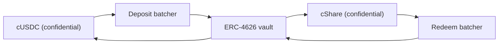

# 상금은 어디서 오는가

상금은 수익입니다. 누구의 원금도 상금으로 지급되지 않고, 그것이 이 풀을 무손실로 만듭니다. 이
페이지는 모든 수익원이 구현하는 단 하나의 인터페이스, 오늘 Sepolia에서 돌아가는 수익원, 풀이
수익원의 말을 어떤 것도 믿지 않는 이유, 그리고 메인넷에서 Zama의 Confidential Vault가 붙는 방식을
다룹니다.

## 인터페이스

```solidity
interface IYieldSource {
    function harvest() external returns (euint64 transferred); // confidential transfer to the recipient
    function harvestable() external view returns (uint64);      // display only
}
```

함수 두 개입니다. `harvest`는 쌓인 수익을 기밀 전송으로 상금 풀에 옮기고 실제로 옮겨진 암호화된
금액을 반환합니다. `harvestable`은 앱 표시용이고 풀은 그것을 회계에 쓰지 않습니다.

`harvest`가 동기인 것은 의도된 것입니다. 그 순간 수익원이 준비해 둔 것을 옮기며, 비동기로 버는
수익원이라면 풀을 기다리게 하는 대신 그 금액을 미리 준비해 두어야 합니다.

수익원 교체는 풀에 대한 소유자 호출 한 번, `setYieldSource`이고 `YieldSourceSet`을 내보냅니다.
시스템의 다른 어떤 부분도 어떤 수익원이 붙어 있는지 알지 못하고 상관하지 않습니다.

실패하는 수익원이 추첨을 멈추지는 않습니다. 풀은 그 실패를 잡아내 그 추첨의 수확분을 자명한
암호화된 0으로 처리하고 `HarvestFailed`를 내보냅니다. 마감은 성공하고, 추첨은 티어들이 이미 들고
있는 유동성으로 돌아가며, 옮겨지지 못한 수익은 나중의 수확이 걷어 갑니다. 고장 났거나 잘못 연결된
수익원은 상금 쪽을 굶길 뿐, 시계를 멈출 수는 없습니다.

수확이 실제로 내려앉으면 그 추첨의 확정 시점에 장부에 오르고 다음 마감에 내놓입니다. 그래서 기간
`p`의 수익은 추첨 `p`가 아니라 추첨 `p+1`의 상금을 댑니다. 그것이 시드가 존재하기 전에 상금
크기를 확정할 수 있게 해 주는 장치입니다.

## Sepolia: 후원 기반 수익원

`SponsoredYieldSource`가 모든 실제 풀에서 돌아가고 있고, 풀마다 인스턴스가 하나씩이므로 일곱 개의
수익원은 일곱 가지 토큰의 일곱 개 별도 잔액입니다. USDC 풀의 것은
`0xCC49DF69eAB6884fD8DD9260902B8A0Abc9D6b91`에 있고, 나머지 여섯은
[풀과 토큰](pools-and-tokens.md)에 있습니다.

후원자는 그 풀의 공개 토큰을 들고 수익원 자체의 `sponsor` 함수를 호출합니다. 수익원은 그것을 기밀
토큰으로 래핑하고, 후원자가 요청한 금액이 아니라 래퍼가 발행한 금액을 정확히 장부에 올립니다.
거기서부터 잔액은 `ratePerSecond`로 흘러나가는데, USDC 풀에서는
`5,555 base units a second, which is 19.998 USDC a period`이고,
`harvest`가 그동안 쌓인 것을 풀로 보냅니다. 각 풀의 비율은 시간당 정수 토큰으로 설정되어 있어서
시계가 다른 두 풀을 한눈에 비교할 수 있고, 모든 후원금은 추첨 여든 번 넘게 버티도록 규모를
잡았습니다.

후원은 기부입니다. 후원자가 그것을 되가져갈 경로는 없고, 방출 비율은 수익원의 소유자만 바꿀 수
있으며 그때 `RateChanged`가 나갑니다.

후원 금액, 방출 비율, 모든 수확은 공개입니다. 타협이 아닙니다. PoolTogether에서도 볼트가 기여하는
수익의 양은 공개이고 모든 상금 크기가 거기서 따라 나옵니다. Hearth에서 기밀인 것은 누가 얼마를
저축했고 누가 땄는지이지, 풀이 얼마를 벌었는지가 아닙니다.

한동안 풀에 저축자가 없어도 수익은 계속 쌓이고, 저축자가 있는 첫 추첨들에 지급됩니다. 빈 풀에서
발이 묶이는 것은 없습니다.

### 왜 목을 쓰는가

목 수익원이 정직하려면 그것이 어떻게 돌아가고 진짜 수익원이 어떻게 붙는지를 문서가 말해야 하고,
둘 다 아래에 있기 때문입니다. 진짜를 먼저 찾아보았고, Sepolia에서 Zama의 목 토큰에 수익을 주는
곳은 없습니다.

| 곳 | 안 되는 이유 |
| --- | --- |
| Aave | Sepolia에서 USDC 예치를 거부합니다. 공급 한도 초과 |
| Compound | Zama의 목이 아니라 Circle의 진짜 USDC를 원합니다 |
| Zama의 Confidential Vault | Sepolia 볼트는 수익 어댑터가 없는 유휴 전용 VaultV2입니다. Zama 자신의 설명입니다 |

그래서 정직한 선택지는 올라가기만 하는 가짜 숫자, 아니면 체인 위에 실제로 존재하고 실제로 흘러
나오는 후원 기반 잔액이었습니다. 저희는 두 번째를 택했습니다. 일곱 개 실제 풀의 모든 상금 단위는
실제로 래핑되었고, 실제로 전송되었으며, 실제로 검증되었습니다.

## 풀은 보고된 숫자를 장부에 올리지 않습니다

이것이 후원 기반 수익원이 약점이 되지 않게 하는 규칙입니다.

수익원은 풀로 암호화된 전송을 수행합니다. 풀은 수신자이므로 그 암호문에 대한 권한이 있고, 따라서
전송된 금액을 스스로 공개 복호화 대상으로 표시할 수 있습니다. 확정 시점에 `FHE.checkSignatures`가
평문에 대한 키 관리 서비스의 서명을 검증한 뒤에야 풀은 무언가를 티어들에 적립합니다.

얼마를 보냈는지 거짓말하는 수익원은 아무것도 얻지 못합니다. 풀은 도착한 금액을 장부에 올립니다.
풀이 들여다보는 유일한 금액이 그것이기 때문입니다.

이것은 이론적인 조심성이 아닙니다. 저희 이전 설계에서 풀은 준비금 충전액을 호출자가 넘긴 금액에서
장부에 올렸는데, 래퍼는 `amount / rate()`만큼 발행합니다. 실제 배포에서는 `rate()`가 마침 1이라
둘이 일치했고 버그는 잠복해 있었습니다. 래퍼 비율이 1조인 18자리 기초 토큰에서라면, 풀은 존재하는
것보다 1조 배 많은 상금이 있다고 믿었을 것입니다. 저희는 2026년 9월 2일에 소수점 18자리 테스트
토큰을 상대로 그것을 실행해 벌어지는 것을 지켜보았습니다. 무손실 풀에서 유령 상금 유동성은 결국
누군가의 원금에서 지급되고, 그것은 이 제품이 결코 어길 수 없는 단 하나의 약속입니다. 전송을
검증하면 이 부류 전체가 사라집니다.

## 메인넷: Zama의 Confidential Vault

Zama는 기밀 잔액으로 수익을 버는 것이 존재 이유인 프로토콜을 내놓았고, 그것이 자연스러운 메인넷
수익원입니다. 그 설계에서 어댑터가 `ConfidentialVaultYieldSource`입니다. 아래는 그 명세이고, 이
저장소에 있는 컨트랙트가 아닙니다.

여기 다른 모든 것과 마찬가지로 풀당 어댑터 하나이고, 각각은 자기 토큰을 위한 배처와 수익 볼트가
필요합니다. Zama의 메인넷 배포는 오늘 USDC를 다루므로, 메인넷 Hearth라면 USDC 풀을 Confidential
Vault 위에 열고 다른 토큰은 그것을 위해 존재하는 수익원 위에 열거나, 아예 열지 않을 것입니다.

설계는 기밀 토큰과 보통의 ERC-4626 수익 볼트 사이에 앉은 배처입니다. ERC-4626 볼트는 공개 전송만
받으므로 혼자 예치하는 사람은 자기 금액을 공개하게 됩니다. 배처는 대신 여러 암호화된 예치를 모아
합계만 복호화하고, 볼트에 공개 예치를 한 번 하고, 기밀 지분을 돌려줍니다. Zama 자신의 표현은
이렇습니다. "관찰자는 누가 참여했는지는 보지만 누가 얼마를 냈는지는 보지 못한다."



어댑터는 풀의 기밀 토큰으로 예치 배처에 참여하고 기밀 지분을 보유합니다. 상환은 수확보다 앞서
자기 일정으로 돌아갑니다. 키퍼가 주기적으로 상환 배처에 증가분을 요청하고 그 요청을 네 단계에
걸쳐 진행시키므로, 풀이 다음에 `harvest`를 호출할 때쯤이면 상환된 기밀 USDC가 이미 어댑터에 앉아
있고 수확은 다른 어떤 전송과도 같은 전송 한 번이 됩니다. 비동기 창구가 동기 인터페이스를 만나는
방법이 그것입니다. 네 단계 모두 무허가이므로 그것을 돌리기 위해 Zama 운영자를 기다릴 필요가
없습니다.

### 주소

Zama 자신의 주소 문서에서 2026년 9월 2일에 가져왔습니다.

**이더리움 메인넷, 체인 ID 1.** 기초 자산은 USDC입니다. 수익원은 Morpho의 "Steakhouse
Confidential Prime USDC" VaultV2이고, 예치 배처만 그 볼트의 예치자가 되도록 제한되어 있습니다.

| 컨트랙트 | 주소 |
| --- | --- |
| Deposit batcher | `0x324EA89FD3784036673BfE6Ffee2334A088F40Cc` |
| Redeem batcher | `0x96Cd3Faa7483783Ac2Eb715f6333361500F1eec9` |
| cUSDC wrapper | `0xe978F22157048E5DB8E5d07971376e86671672B2` |
| cShare wrapper | `0x66Bf74E96900D1a19c7070D939D124f2F565C458` |
| ERC-4626 vault | `0xbEEF00A59B577423653A1526c7009bdE103F542B` |
| USDC | `0xA0b86991c6218b36c1d19D4a2e9Eb0cE3606eB48` |

**Sepolia, 체인 ID 11155111.** 스테이징 환경입니다. USDC는 공개 `mint`을 가진 목이고 볼트는 수익
어댑터가 없는 유휴 전용입니다.

| 컨트랙트 | 주소 |
| --- | --- |
| Deposit batcher | `0x48758559c14d4d92b4C74A99660B6a8dbe85F53b` |
| Redeem batcher | `0xe94E9afdDd43a19C2914739e9279cb6Fe287BEb0` |
| cUSDC wrapper | `0x7c5BF43B851c1dff1a4feE8dB225b87f2C223639` |
| cShare wrapper | `0x7E93d5c150A2178B1fCde0278582Acf59478eA5f` |
| ERC-4626 vault (idle) | `0x6AB54988261AEC573a2CA13cF802d3B1114f864C` |
| Mock USDC | `0x9b5Cd13b8eFbB58Dc25A05CF411D8056058aDFfF` |

Sepolia 볼트가 유휴 상태이므로, 어댑터는 Zama가 공개한 배처 인터페이스를 상대로 여기에 명세만
되어 있고 아직 작성되지 않았습니다. 아무것도 벌지 못하는 것을 두고 실제로 돌아간다고 말하는 것은
누구든 1분이면 확인할 수 있는 거짓말입니다.

### 실제로 붙인다는 것이 뜻하는 일

배처는 네 단계로 움직입니다. 참여, 발송, 확정, 수령입니다. 배치는 최소 경과 시간에 도달할 때까지
기다렸다가 합계가 복호화되고, 볼트가 정산하며, 참여자들이 수령합니다. 모든 단계가 무허가이므로
풀이 Zama 운영자를 기다리며 멈추는 일은 없고, 수령은 만료되지 않습니다.

그 리듬은 후원 기반 수익원의 즉시 방출보다 느리고, 그래서 키퍼가 `harvest` 안이 아니라 미리
상환을 돌립니다. 풀의 컨트랙트는 결코 기다리지 않습니다. 이미 수령해 둔 것을 어댑터에 요청할
뿐입니다. 이것을 실제로 가동하는 데 남은 진짜 작업은 어댑터 컨트랙트 자체이고, 이 저장소는 그것을
명세하되 구현하지 않습니다. 그리고 키퍼 쪽 작업, 즉 얼마나 자주 상환을 시작할지와 보유분의 얼마를
상환할지를 정하는 일이 남는데, 이는 늦어도 온체인 결과가 없는 정책 선택입니다.

### Hearth가 물려받게 될 것

이것을 제대로 이름 붙이는 일도 신뢰의 일부입니다.

- **볼트 위험, 전부.** 배처는 돈을 제3자 ERC-4626 볼트로 넘깁니다. 그 볼트가 가치를 잃으면 풀의
  수익 자산도 함께 가치를 잃습니다. "무손실"이 남의 컨트랙트에 의존하게 되는 유일한 지점이고,
  메인넷 배포라면 수익을 내는 부분만 그곳에 두어야 하는 이유입니다.
- **풀 기밀성이 아니라 배치 기밀성.** 배처는 함께 참여한 사람들 사이에서 금액을 숨기고 합계를
  복호화합니다. Hearth가 어떤 배치의 유일한 참여자였다면 그 예치 금액은 공개됩니다. 저희에게는
  비용이 아닙니다. Hearth의 수확은 어차피 공개이기 때문입니다. 다만 배처가 실제보다 더 많이
  숨긴다고 가정하기 전에 알아 둘 가치가 있습니다.
- **제한된 소유자 권한.** 배처 소유자는 최소 배치 경과 시간(최대 7일), 콜백 기한(최대 30일),
  예치 슬리피지 허용치를 바꿀 수 있고, 참여와 발송을 일시 중지할 수 있습니다. Zama의 문서는
  소유자가 사용자 자금을 옮기거나 동결할 수 없고, 결과를 검열할 수 없으며, 누구의 금액도 복호화할
  수 없고, 컨트랙트를 업그레이드할 수 없다고 밝힙니다. 상환 슬리피지 보호는 코드에서 꺼져 있어서
  볼트가 손실을 겪는 중에도 출구가 작동합니다.

## 이 페이지가 다루지 않는 것

수익원이 유출 표에 미치는 영향은 다루지 않습니다. 그것은
[무엇이 비밀로 남는가](../security/what-stays-private.md)에 있습니다. Morpho 볼트의 수익률을
벤치마킹하지도 않습니다. 그것은 남의 숫자이고 날마다 바뀝니다. 그리고 어댑터가 돌아가고 있다고
주장하지 않습니다. Sepolia에 붙어 있는 것은 후원 기반 수익원이고, 대시보드의 "The pool right now"
카드가 그것을 이름으로 알려 줍니다.
