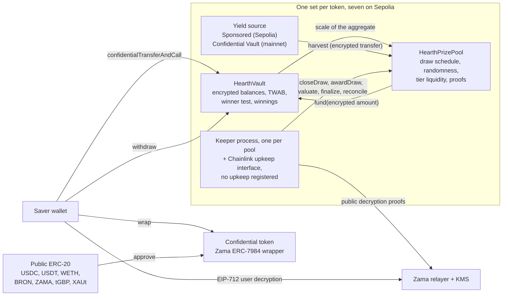

# Hearth란 무엇인가

Hearth는 돈을 잃을 수 없고 상금은 딸 수도 있는 저축 풀입니다. Sepolia에서 일곱 개가 돌아가고,
기밀 토큰마다 하나씩입니다. 저축 계좌를 고르듯 토큰을 고르면 됩니다.

기밀 토큰을 넣습니다. USDC, USDT, WETH, BRON, ZAMA, tGBP, XAUt 중 하나입니다. 풀은 그 돈을
굴려 수익을 냅니다. 매 기간마다 풀이 벌어들인 수익이 상금으로 나가고, 당첨 확률은 얼마를
얼마나 오래 들고 있었는지에 비례합니다. 원금은 언제든 전액 되찾을 수 있습니다. PoolTogether가
만들어 낸 "무손실 복권"이 바로 그것이고, Hearth는 그것의 기밀 버전입니다.

PoolTogether와 다른 점은 이렇습니다. 보통의 블록체인에서는 모든 것이 공개입니다. 저축자마다
얼마를 가졌는지, 지갑별 당첨 확률이 얼마인지, 추첨마다 누가 땄는지 누구나 읽을 수 있습니다.
사람들의 자산을 공개하는 셈이고, 규모가 큰 사람에게는 표적을 그려 주는 셈입니다. Hearth는
Zama 프로토콜을 써서 이 전부를 암호화된 숫자 위에서 처리합니다. 체인은 잔액을 암호문(키 없이는
읽을 수 없는 데이터)으로 들고 있고, 컨트랙트는 그 상태 그대로 계산을 합니다. 잔액은 저희를
포함해 아무도 본 적 없는 숫자이고, 추첨은 여전히 낯선 사람이 검증할 수 있습니다.

## 그림 한 장으로 보는 시스템

일은 컨트랙트 두 개가 합니다. `HearthVault`는 모든 저축자의 암호화된 원금, 암호화된 당첨금,
무엇을 얼마나 오래 들고 있었는지의 기록을 보관하고 당첨 판정을 돌립니다. `HearthPrizePool`은
시계를 돌리고, 무작위 시드를 뽑고, 수익을 걷고, 상금을 티어별로 보관합니다. 키퍼 프로세스가
추첨을 밀어 주지만, 키퍼가 하는 모든 단계는 다른 누구든 대신 할 수 있습니다.

가운데 상자가 토큰 하나의 풀입니다. 그런 풀이 일곱 개 있고, 서로 아무것도 공유하지 않습니다.
당신의 USDC 자리와 WETH 자리는 서로 다른 볼트에 있는 서로 다른 저축자이고, 한 풀이 조용해져도
나머지는 계속 돌아갑니다. 지금 보고 있는 풀이 무엇인지는 주소창의 첫 부분이 알려 줍니다.
`/app/usdc`나 `/app/weth` 같은 식입니다. 주소를 포함한 전체 목록은
[풀과 토큰](../concepts/pools-and-tokens.md)에 있습니다.

## 네 가지 동작

저축자가 하는 동작은 네 개입니다. 각각이 무엇을 하고 무엇을 내주는지 정리합니다.

### 1. 예치

그 풀의 기밀 토큰을 트랜잭션 한 번으로 볼트에 보냅니다. 금액은 암호문 핸들로 이동합니다. 값
자체가 아니라 암호화된 값을 가리키는 포인터입니다. 볼트는 그것을 당신의 암호화된 원금에 더하고
시간에 따른 잔액 기록을 갱신합니다. 아무것도 복호화하지 않고 말입니다.

- 숨겨지는 것: 금액, 누적 잔액, 따라서 풀에서 차지하는 몫.
- 공개되는 것: 당신의 주소, 실행한 블록, 그리고 예치가 있었다는 사실.

이음매가 하나 있습니다. 보통의 공개 토큰을 기밀 토큰으로 바꾸는 일은 공개 ERC-20 전송이라서
래핑한 금액이 보입니다. 5,000 USDC를 래핑하고 두 블록 뒤에 예치하면 관찰자는 아주 좋은 추측을
얻습니다. Hearth가 래핑과 예치를 두 단계로 계속 갈라 두는 이유가 바로 이것입니다. 둘 사이에
거리를 둘 수 있도록 말입니다. [래핑 이음매](../security/what-stays-private.md)를 보십시오.

### 2. 추첨

매 기간이 끝나면 풀은 그 기간의 추첨을 마감(close)합니다. 트랜잭션 하나 안에서 각 티어의 상금
크기를 확정하고, Zama 코프로세서 안에서 암호화된 무작위 시드를 뽑고, 볼트에 풀이 얼마나 컸는지
묻고, 그 기간의 수익을 걷습니다. 순서가 중요합니다. 무작위 숫자가 존재하기 전에 상금이 확정되므로,
시드를 보고 나서 당첨의 가치를 다시 짜맞추는 일이 불가능합니다.

"풀이 얼마나 컸는지"는 일부러 두루뭉술하게 두었고, 그것이 설계입니다. 볼트는 모든 저축자의
시간 가중 잔액을 더한 총합을 공개하지 않습니다. 그 총합이 들어가는 2의 거듭제곱 구간만
공개합니다. 그래서 세상이 알게 되는 것은 풀의 정확한 크기가 아니라 대략의 크기입니다. 정확한
숫자를 공개하면 연속된 두 추첨을 빼서 저축자 한 명의 예치액을 그 차이에서 읽어 낼 수 있습니다.

그다음 작은 값 네 개가 Zama 키 관리 서비스의 서명이 붙은 증명과 함께 나가고, 누구나 확인할 수
있습니다. 시드, 구간, 풀에 참여자가 하나라도 있었는지 여부, 그리고 걷힌 수익입니다. 그 숫자들이
검증되는 순간 그 추첨에서 각 저축자의 결과는 확정됩니다.

- 숨겨지는 것: 개별 저축자의 가중치, 풀의 정확한 총합, 그리고 개별 결과 전부.
- 공개되는 것: 시드, 구간, 걷힌 수익, 각 티어의 상금 크기, 그리고 한 추첨 뒤 티어가 정산될 때
  그 티어가 상금을 몇 번 지급했는지.

### 3. 수령

수령 트랜잭션은 없고, 그것이 요점입니다. 앱에는 수령 버튼이 있습니다. "내 추첨"의 해당 추첨
카드에 금액과 함께 붙어 있습니다. 그것은 방금 열어 본 당첨금을 꺼내는 평범한 인출이고, 체인
위에서는 다른 어떤 인출과도 똑같이 보입니다.

당첨금은 추첨이 평가되는 동안 볼트 안의 별도 암호화 잔액에 적립됩니다. 당신이 무엇을 해서
그렇게 되는 것도 아니고, 무엇을 해서 그것이 드러나는 것도 아닙니다. 당첨 여부를 알려면 EIP-712
메시지에 서명합니다. 당신이 그 주소를 통제한다는 것을 증명하는 오프체인 타입 서명이고, 그러면
Zama 릴레이어가 당신 당첨금의 평문을 브라우저로 돌려줍니다. 그 서명은 체인에 닿지 않으므로
비용이 들지 않고 흔적도 남지 않습니다. 대시보드의 잔액과 추첨 결과는 각자의 눈 아이콘을 가지고,
둘 다 동시에 열어 둘 수 있으며, 첫 번째 서명이 두 번째에도 쓰입니다.

- 숨겨지는 것: 전부. 자기 당첨금을 읽는 일은 오프체인 작업입니다.
- 공개되는 것: 없음.

대부분의 상금 프로토콜에서는 당첨자가 수령 트랜잭션을 보내야 하고 낙첨자는 보낼 이유가 없으므로,
트랜잭션 목록이 조용히 당첨자를 지목합니다. Hearth에는 보낼 그런 트랜잭션 자체가 없습니다.
상금을 적립하는 트랜잭션인 `evaluate`는 자기 자신을 겨냥할 수 없습니다. 그 추첨의 시드가 정한
지점부터 저축자 목록을 순회하고, 호출자는 얼마나 진행할지만 말합니다.

### 4. 인출

돈을 빼는 함수는 하나, `withdraw`입니다. 당첨금부터 지급하고 그다음 원금에서 지급하며, 당신이
가진 금액과 볼트가 가진 금액 중 작은 쪽으로 제한합니다. 상금을 챙기든, 저축을 집으로 가져가든,
둘을 한 번에 하든, 같은 모양과 같은 이벤트와 암호화된 금액을 가진 같은 호출입니다.

제한의 뒷부분이 있는 이유는 기밀 전송이 전액을 옮기거나 아무것도 옮기지 않기 때문입니다.
요청한 금액의 일부만 보내는 일은 없습니다. 그래서 볼트는 토큰에게 지급을 요청하기 전에 실제로
지급 가능한 금액을 먼저 계산합니다. 나중에 부족분을 메우려 하지 않고 말입니다.

- 숨겨지는 것: 금액, 그리고 그중 상금이 있었는지 여부.
- 공개되는 것: 당신의 주소, 블록, 그리고 인출이 있었다는 사실.

원금은 결코 묶이지 않습니다. 추첨이 진행되는 동안에도 예치와 인출은 열려 있습니다. 이 분야의
다른 여러 설계에서는 그렇지 않습니다.

## 무엇이 이것을 공정하게 만드는가

두 가지이고, 둘 다 특별한 권한 없는 낯선 사람이 검증할 수 있습니다.

무작위 시드는 `FHE.randEuint64`에서 나옵니다. 네트워크의 FHE 키 아래, 공개 시드로부터 Zama
코프로세서 안에서 생성됩니다. 아무도 예측할 수 없고 아무도 두 번 뽑을 수 없습니다. 추첨 마감은
정확히 한 번만 성공하기 때문입니다. 기간이 끝나면 풀은 그 시드와 풀 총합이 들어간 구간을 함께
공개하고, 둘 다 컨트랙트가 체인 위에서 검증하는 증명을 달고 나옵니다.

그 공개된 숫자 두 개만 있으면 누구든 어떤 주소가 어떤 티어에서 넘어야 했던 정확한 임계값을 다시
계산할 수 있고, 볼트는 같은 산술을 뷰 함수로 노출하므로 재구현을 믿어야 할 필요도 없습니다.
할 수 없는 일은 그 임계값과 비교된 암호화된 가중치를 보는 것입니다. 그래서 규칙은 공개이고
감사 가능하며, 오직 입력만 비공개입니다. 자세한 내용은
[무작위성과 검증](../security/randomness-and-verification.md)에 있습니다.

## Hearth가 숨기지 않는 것

짧은 요약입니다. 전문은 [무엇이 비밀로 남는가](../security/what-stays-private.md)에 있습니다.

- 저축자가 누구인지, 각자가 언제 예치하고 인출하고 평가되었는지.
- 매 기간 풀 총합이 들어간 구간, 시드, 그리고 걷힌 수익.
- 각 티어의 상금 크기, 그리고 한 추첨 뒤에 공개되는 지급 횟수.
- 기밀 토큰으로 래핑해 넣거나 밖으로 꺼낸 금액.
- 저축자가 한 명이면 공개된 구간은 그 저축자의 가중치를 두 배 이내로 좁힙니다. 두 명이면 서로
  상대를 범위로 묶을 수 있습니다. 여기서 프라이버시에는 저축자가 세 명 이상 필요하고, 앱은
  그 사실을 알립니다.
- 임계값이 공개이므로, 당신의 잔액을 특정할 수 있는 사람은 이후 모든 추첨에서 당신의 결과를
  계산할 수 있습니다. 그런 일이 벌어지는 흔한 경로는 래핑한 뒤 몇 분 만에 같은 금액을 예치하는
  것이고, 앱이 둘을 떼어 놓는 이유가 그것입니다.
- 래핑해 넣고 전액을 언래핑해 나가면, 지금까지 딴 모든 금액의 하한이 공개됩니다. 두 이동 모두
  토큰 계층에서 공개이기 때문입니다.
- 당첨된 추첨 직후마다 인출하는 저축자는 자기 행동으로 통계적 힌트를 흘립니다. 이것만은 어떤
  컨트랙트도 고칠 수 없습니다.
