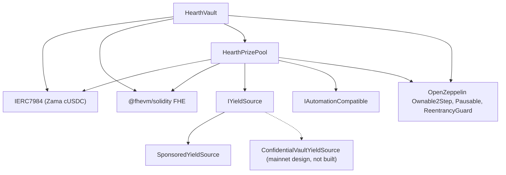

# 배포

재현 가능한 스크립트 하나이고, 손으로 클릭하는 일은 없습니다. 이 페이지는 순서와 파라미터와 각
파라미터의 의미입니다. 검토자가 배포된 생성자 인자를 읽고 그것이 일치한다는 것을 알 수 있도록
말입니다.

Hearth는 기밀 토큰마다 풀 하나를 배포합니다. 토큰당 볼트 하나, 상금 풀 하나, 수익원 하나이고 다른
어떤 풀과도 아무것도 공유하지 않습니다. 한 번의 실행이 한 풀을 열고, 배포자 논스 하나가 배포
하나를 돌리기 때문이며, 토큰은 `HEARTH_TOKEN`으로 고릅니다. 이후의 모든 태스크는 `--token`을
받습니다.

```
cd packages/contracts
HEARTH_TOKEN=weth npx hardhat deploy --network sepolia
npx hardhat hearth:verify  --network sepolia --token weth
npx hardhat hearth:seed    --network sepolia --token weth
npx hardhat hearth:status  --network sepolia --token weth
```

둘 다 빼면 그 네트워크의 기본 토큰인 `usdc`가 됩니다. 알 수 없는 슬러그는 그 네트워크에 실제로
있는 풀 목록과 함께 실패합니다. 모든 풀의 파라미터는 파일 하나,
`packages/contracts/hearth.config.ts`에 있습니다. 자산 쌍, 기간, 티어 세트, 초기 구간, 방출 비율,
후원금, 데모 저축자 다섯 명의 지분, 그리고 그 풀의 키퍼가 서명할 계정 인덱스입니다. 아래 표와
나란히 그 파일을 읽으십시오. 같은 숫자입니다.

배포는 이미 저장된 배포 기록이 있는 컨트랙트를 교체하지 않고 재사용하므로, 두 번째 실행은
아무것도 하지 않습니다. 저축자의 돈과 며칠치 추첨 기록을 들고 있는 실제 풀이 스크립트 재실행으로
새 주소로 옮겨지는 일은 결코 없습니다. 의도적으로 교체하려면 `deployments/<network>/` 아래의 그
파일을 먼저 지우십시오.

배포는 `deployments/sepolia/hearth.<slug>.json`을 씁니다. 키퍼가 `HEARTH_ADDRESSES_FILE`로 바라보는
파일이자 앱의 풀 목록이 생성되는 원본입니다.

## 무엇이 무엇에 의존하는가



실선은 이 저장소에 있는 컨트랙트입니다. 점선 노드는 메인넷 수익 경로입니다. 어댑터는 Zama가 공개한
배처 인터페이스를 상대로 명세되어 있고 여기에 어댑터 컨트랙트가 작성되어 있지 않으므로, 아래에서
배포되는 것은 `SponsoredYieldSource`뿐입니다.

볼트와 풀은 서로를 필요로 하므로, 둘 사이의 연결 하나는 생성자가 아니라 배포 후에 만들어집니다.
아래가 세 단계가 아니라 다섯 단계인 이유가 그것입니다.

## 순서

| 단계 | 작업 | 왜 여기인가 |
| --- | --- | --- |
| 1 | `HearthVault` 배포 | 저축자의 돈을 보관하고, 토큰이 존재하는 것 말고는 아무것도 필요 없습니다. |
| 2 | 볼트를 가리키는 `HearthPrizePool` 배포 | 풀은 볼트의 시계와 규모 개수를 읽고 볼트에 지급합니다. |
| 3 | 연결: `vault.setPrizePool(pool)` | `PrizePoolSet`을 내보냅니다. 볼트는 이 주소에서 오는 자금만 받습니다. |
| 4 | 풀을 수신자로 가리키는 수익원 배포 | 수확분을 어디로 보낼지 알아야 합니다. |
| 5 | 연결: `pool.setYieldSource(source)` | `YieldSourceSet`을 내보냅니다. 이것이 내려앉기 전까지 마감은 아무것도 수확하지 못하고 `HarvestFailed`를 내보냅니다. |

5단계 뒤에 풀을 시드하십시오. `hearth:seed --token <slug>`가 수익원을 후원해 상금이 존재하게 하고,
계정 2번부터 6번까지에서 크기가 다른 데모 저축자 다섯 명을 넣어, 첫 방문자가 빈 풀이 아니라 사람이
있는 풀에 도착하게 합니다. 모든 단계가 체인에서 이미 끝난 일을 확인하므로, 릴레이어가 딸꾹질해
중단된 시드는 다시 실행해도 안전합니다.

그 풀의 키퍼도 자기 Sepolia ETH가 필요하고, 데모 저축자 다섯 명도 마찬가지입니다.

```
npx hardhat hearth:spread-gas --network sepolia --token weth
npx hardhat hearth:spread-gas --network sepolia --keepers 10,11,12,13,14,15 --savers false
```

첫 번째는 풀 하나의 키퍼와 저축자들에게 자금을 대고, 두 번째는 여러 키퍼 계정에 한 번에 자금을
댑니다. 여섯 개 풀을 한꺼번에 열 때 필요한 것이 그것입니다.

그다음 앱이 배포된 것을 가리키게 하십시오.

```
cd ../web
node scripts/sync-pools.mjs
```

## 파라미터

```
HearthVault(IERC7984 asset, uint256 periodLength, uint256 firstPeriodAt, address owner)
HearthPrizePool(IHearthVault vault, IERC7984 asset, Tier[3] tiers, uint8 initialScaleBits, address owner)
    Tier = { uint32 prizeCount; uint64 oddsNumerator; uint64 oddsDenominator; uint16 shares; uint16 reconcileEvery }
SponsoredYieldSource(IERC7984ERC20Wrapper asset, address recipient, uint64 ratePerSecond, address owner)
```

### HearthVault

| 파라미터 | 의미 | 잘못 두면 |
| --- | --- | --- |
| `asset` | 저축자가 예치하는 ERC-7984 기밀 토큰, Zama의 일곱 개 중 하나. | 모든 래퍼는 소수점 6자리로 읽히고, 체인이 설정과 다르면 배포가 계속하기를 거부합니다. 아래 공개 토큰과의 비율이 모든 풀에서 1인 것은 아닙니다. 18자리 WETH 목에서는 1조이므로, 공개 토큰을 읽는 모든 것이 그것을 적용해야 합니다. |
| `periodLength` (`L`) | 한 기간의 초. 불변입니다. | 저축자당 상한 `(2^64 - 1) / L`도 함께 정합니다. `L`이 너무 작으면 상한은 커지지만 추첨이 시끄러워지고, 너무 크면 상한이 조여집니다. |
| `firstPeriodAt` | 기간 1이 시작하는 타임스탬프. 불변이고 배포 시점 이전이어야 합니다. | 미래 값은 그 시점이 지날 때까지 `period(now)`를 정의되지 않게 만듭니다. |
| `owner` | 2단계 소유자. 포기는 비활성화되어 있습니다. | 권한은 [위협 모델](../security/threat-model.md)에 나열되어 있습니다. |

`maxPrincipal`은 설정하는 값이 아니라 `periodLength`에서 유도됩니다. 1시간이면 약 50억 토큰,
6시간이면 약 8억 5,400만, 하루면 약 2억 1,300만입니다.

시계는 볼트가 가집니다. 풀은 볼트 주소를 받아 거기서 기간을 읽으므로, 두 컨트랙트가 지금이 몇 번째
기간인지를 두고 어긋날 방법이 없습니다.

### HearthPrizePool

| 파라미터 | 의미 |
| --- | --- |
| `vault` | 이 풀이 담당하는 볼트이자 그것이 읽는 시계. |
| `asset` | 볼트가 쓰는 것과 같은 기밀 토큰. 일치해야 합니다. |
| `prizeCount[t]` | 티어 `t`의 추첨당 상금 개수. |
| `oddsNumerator[t]`, `oddsDenominator[t]` | 티어의 확률을 분수로. `oddsDenominator / oddsNumerator`회의 추첨 중 한 번입니다. |
| `shares[t]` | 모든 수확분에서 그 티어가 가져가는 몫. 지분은 상대적이므로 40/20/40과 2/1/2는 같은 뜻입니다. |
| `reconcileEvery[t]` | 그 티어의 이월금을 공개하는 사이에 지나는 추첨 수. |
| `initialScaleBits` | 첫 기간 총 가중치의 예상 비트 길이, 구간 추적기의 시작 추정값. |
| `owner` | 위와 같습니다. |

`UTILISATION`은 인자가 아니라 상수입니다. PoolTogether V5를 따라 50퍼센트이고, 각 상금의 크기를
정하는 데 쓰이는 티어 평문 유동성의 비율입니다.

그중 둘은 한마디 할 가치가 있습니다.

`reconcileEvery`는 가스 설정이 아니라 프라이버시 설정이고, 상금 항아리가 어떻게 보이는지와
맞바꿉니다. 티어의 이월금을 공개하면 그 티어의 상금 횟수가 공개되고, 한 추첨에 대한 횟수는 그
추첨에서 자격이 있던 작은 집합을 가리킵니다. 값을 올리면 그 횟수가 거의 모두가 어느 시점엔가
자격이 있었던 구간에 퍼집니다. 그 대가는 눈에 보이는 잭팟입니다. 마감은 티어의 공개 유동성 전부를
추첨으로 옮기고 그 돈은 정산에서만 돌아오므로, 주기 24인 티어는 24번 중 23번의 추첨에서 한 추첨의
수확분 몫으로 크기를 잰 상금을 공개하고, 쌓인 항아리는 정산이 있는 추첨에서만 공개적으로
드러납니다. 그동안에도 돈은 암호화된 이월금 안에서 내놓여 있고 딸 수 있습니다. 보이지 않을
뿐입니다. Sepolia가 세 티어를 모두 1로 돌리고 추첨당 횟수를 잔여 위험으로 밝히는 이유가 그것입니다.
한계 14번을 보십시오.

`initialScaleBits`는 가깝기만 하면 됩니다. 추적기는 마감마다 현재 추정값 주변 2의 거듭제곱 다섯
개와 실제 총합을 비교하고 추첨당 최대 세 비트씩 스스로 바로잡으므로, 몇 비트 어긋난 추정값은
확률이 살짝 어긋난 추첨 한두 번의 비용을 치른 뒤 자리를 잡습니다.

### SponsoredYieldSource

| 파라미터 | 의미 |
| --- | --- |
| `asset` | 보유하고 전송하는 ERC-7984 래퍼. 후원자가 내는 공개 토큰은 그 래퍼 자신의 기초 토큰이므로 별도 인자가 아닙니다. |
| `recipient` | 수확분을 받는 상금 풀. |
| `ratePerSecond` | 후원된 잔액이 수익으로 흘러나가는 속도. |
| `owner` | 비율을 설정하고 `RateChanged`를 내보냅니다. |

후원은 생성자 인자가 아니라 배포 후의 별도 호출입니다. 후원자가 요청한 금액이 아니라 래퍼가 발행한
금액을 정확히 장부에 올리고, 되돌릴 수 없습니다.

## 세 가지 파라미터 세트

Sepolia는 그중 둘을 돌립니다. 풀들이 두 개의 시계로 돌기 때문입니다.

| 설정 | Sepolia `usdc` | Sepolia, 나머지 여섯 | 메인넷 후보 |
| --- | --- | --- | --- |
| 기간 길이 | 1시간 | 6시간 | 1일 |
| 윈도우 | 2시간 (두 기간) | 12시간 | 2일 |
| 마감 기한 | 기간 종료 후 1시간 30분 | 종료 후 9시간 | 종료 후 1일 12시간 |
| 저축자당 상한 | 약 50억 토큰 | 약 8억 5,400만 | 약 2억 1,300만 |
| 최고 티어 | 개수 1, 확률 1/24, 지분 40, 매 추첨 정산 | 개수 1, 확률 1/4, 지분 40, 매 추첨 정산 | 개수 1, 확률 1/30, 지분 50, 매 추첨 정산 |
| 중간 티어 | 개수 1, 확률 1/6, 지분 20, 매 추첨 정산 | 개수 1, 확률 1/2, 지분 20, 매 추첨 정산 | 개수 1, 확률 1/7, 지분 25, 매 추첨 정산 |
| 상시 티어 | 개수 4, 확률 1, 지분 40, 매 추첨 정산 | 개수 4, 확률 1, 지분 40, 매 추첨 정산 | 개수 4, 확률 1, 지분 25, 매 추첨 정산 |
| 활용률 | 50퍼센트 | 50퍼센트 | 50퍼센트 |
| 수익원 | `SponsoredYieldSource` | `SponsoredYieldSource` | Zama 배처 위의 `ConfidentialVaultYieldSource` |
| 최고 상금 발생 | 하루 한 번쯤 | 하루 한 번쯤 | 선택한 확률에 따라 |

Sepolia 숫자는 방문자가 한 자리에서 전체 주기를 보도록 존재합니다. 추첨마다 작은 상금 네 개, 그리고
어느 시계에서든 하루 한 번쯤의 최고 상금입니다. 실제 배포가 쓸 값은 아닙니다.

시계가 둘인 이유. 저축자 다섯 명일 때 추첨 하나가 `8,456,388` 가스이므로, 일곱 개 풀이 매시간
추첨하면 Sepolia에서 하루 약 `1.43 ETH`를 쓰게 되고 공개 파우셋이 감당하지 못합니다. 6시간이면
풀당 하루 네 번으로 줄어 일곱 개 전부 하루 약 `0.41 ETH`입니다. 확률은 그대로 옮겨 오지 않고 각
풀의 기간에 맞춰 설정되므로, 첫 열이 1/24와 1/6인 자리에서 가운데 열은 1/4와 1/2이고, 그래서 최고
상금이 양쪽에서 여전히 하루 한 번쯤 나옵니다. USDC 풀이 매시간 시계를 유지한 이유는 먼저 배포되었고
그 추첨 기록이 그 아래에 정리되어 있기 때문입니다.

메인넷 열은 후보이지 배포가 아닙니다. 그것을 채우는 규칙은 Sepolia 열을 만든 것과 같습니다. 최고
상금 사이에 추첨을 몇 번 두고 싶은지 정하고 최고 티어의 확률을 그 수의 역수로 두십시오. 그다음
수익원이 실제로 버는 수익에 견주어 상금 크기가 말이 되도록 지분을 정하십시오. 그다음 아무도
지목하지 않는 상금 횟수와 저축자가 쌓이는 것을 지켜볼 수 있는 항아리를 저울질해 각 티어의 정산
주기를 정하십시오. Sepolia는 두 번째를 택했고, 메인넷 배포는 첫 번째를 택할 수도 있으며, 위
문단이 각 선택의 대가를 말합니다. 하루 기간에 최고 확률 365분의 1이면 연간 최고 상금이 되고,
V5가 쓰는 모양이 그것입니다.

## 배포된 주소

Sepolia에 일곱 개 풀, 모든 컨트랙트가 Etherscan에서 검증되어 있습니다. 각 풀이 보유한 토큰 쌍은
Zama의 것이고 시드된 지분과 방출 비율과 함께
[풀과 토큰](../concepts/pools-and-tokens.md)에 정리되어 있습니다.

| 풀 | HearthVault | HearthPrizePool | SponsoredYieldSource | 배포 블록 |
| --- | --- | --- | --- | --- |
| `usdc` | `0x0F93e5db6027b4FB1C76566d24aA2D2E417fAF52` | `0xA0785AacF30B6FE46EDc53CD8A9db1d94FeF5Df2` | `0xCC49DF69eAB6884fD8DD9260902B8A0Abc9D6b91` | `11622398` |
| `usdt` | `0xe54F44dE64F8A7abc0647eaae547dD59ce0EFfac` | `0x6a83Beb2Dc3f258107Cad5e17BC57657fAd4fbd1` | `0x5bb1Cd5380Cb9f2B15569030fF0dB7a445cF54cA` | `11641314` |
| `weth` | `0x3D1A182782B68fE270A66294C9adaC7F005c4f14` | `0x1a11e7C689F244fA8Dd5f4abA8F2F3131090cc1C` | `0x40DF298f15c6136294eC651aD7b0c1C6F221DE8F` | `11641366` |
| `bron` | `0x18086DC8271f8A73c5Ea985fd519527Dbb991279` | `0x2Ed982979CD184494B947a1E38E597494a38ACe4` | `0x0cD1155D752bD81b3a437a6f0B3965CAA2A1C8e9` | `11641408` |
| `zama` | `0xEEC26386F273c6678cA538AcA18e1d9384eA9F09` | `0x873B285404199D46325a294Aa0EC7a79C30A7fF7` | `0xdD352D70311E834ab75307f53d5C276060081d23` | `11641447` |
| `tgbp` | `0xCe95dAa01f5354aA8887A5952E403D26d452c323` | `0xC531D54ee2c695e0eBfe8b8258e9Fd80fd507095` | `0xDEa2BD6351072F735B6ea83c357bF157d83c01af` | `11641484` |
| `xaut` | `0x77f701101d66FbD522A3bFdC2c00DB09a4F57daE` | `0x9a2888aca42c707A3BC0D561FdF6ff8Abfda5201` | `0x03fDdAA7C4323C53CE511CC49D4c33B26B492af7` | `11641523` |

첫 기간 시작은 `usdc`가 `1788386400 (2 September 2026, 22:00:00 UTC)`,
`usdt`가 `1788620400 (5 September 2026, 15:00:00 UTC)`,
나머지 다섯이 `1788624000 (5 September 2026, 16:00:00 UTC)`입니다. `firstPeriodAt`은 불변이고 배포
블록 이전이어야 하므로, 배포는 머신의 시계가 아니라 체인 자신의 시계를 읽어 정시로 내림합니다.

## 검증

검증은 배포의 일부이지 나중 일이 아닙니다. 배포된 소스를 읽을 수 없는 검토자는 이 문서 전체를
저희 말만 듣고 받아들여야 합니다.

1. 배포 스크립트가 기록한 생성자 인자로 그 풀의 세 컨트랙트를 모두 Etherscan에서 검증하십시오.
   `hearth:verify --token <slug>`가 컨트랙트 하나씩 그것을 하고 어느 것이 이미 검증되어 있었는지
   알려 줍니다.
2. 검증된 생성자 인자가 위 파라미터 표와 맞는지 확인하십시오. 특히 그 풀에 자기 볼트와 같은
   `asset`이 주어졌는지, 티어 세트가 그 풀의 시계에 해당하는 열과 맞는지 확인하십시오.
3. `vault.prizePool()`이 그 풀의 상금 풀이고 `pool.yieldSource()`가 그 풀의 수익원인지, 어느 쪽도
   다른 풀의 컨트랙트를 가리키지 않는지 확인하십시오.
4. 토큰을 확인하십시오. `asset`은 Zama가 공개한 Sepolia 목록에서 그 풀에 해당하는 기밀 래퍼여야
   하고, `underlying()`은 그 아래의 공개 목이어야 합니다. 래퍼의 `rate()`가 1인 것은 공개 토큰도
   소수점 6자리로 읽히는 곳뿐입니다. WETH 풀에서는 1조이고, 1이 아닌 비율은 공개 토큰을 건드리는
   모든 것에 대해 기본 단위의 의미를 바꿉니다.
5. 추첨을 몇 번 돌린 뒤 `pool.scaleBits()`를 읽어, 풀의 실제 크기가 함의하는 비트 길이 근처에서
   자리를 잡았는지 확인하십시오. 추적기가 거기서 한참 떨어져 있다면 초기 추정값이 크게 어긋났고
   보정이 아직 따라잡지 못한 것입니다.

## 비밀

민감한 것은 결코 코드에 박아 넣지 않습니다. 배포는 `.env` 파일에서 읽고, `.env.example`이 모든
키를 그 값이 어디서 오는지에 대한 주석과 함께 나열합니다. 배포자의 키와 키퍼의 키는 별개 계정
이므로, 키퍼의 상시 온라인 키에는 소유자 권한이 없습니다.

## 앱 호스팅

앱은 저장소 최상위가 아니라 Next.js 워크스페이스 패키지이고, 대부분의 호스트가 잘못 설정하는
유일한 지점이 그것입니다.

| 설정 | 값 | 이유 |
| --- | --- | --- |
| 프레임워크 프리셋 | Next.js | `packages/web/package.json`에서 감지됩니다 |
| 루트 디렉터리 | `packages/web` | 앱이 npm 워크스페이스 안에 있습니다 |
| 루트 디렉터리 밖의 소스 파일 포함 | 켜기 | 의존성이 저장소 최상위로 끌어올려지고, 빌드가 최상위 `package.json`과 잠금 파일을 필요로 합니다 |
| 설치 명령 | 기본값 `npm install` | 저장소 최상위에서 실행되어 워크스페이스 전체를 설치합니다 |
| 빌드 명령 | 기본값 `next build` | 루트 디렉터리가 설정되어 있으면 `packages/web` 안에서 실행됩니다 |
| 출력 디렉터리 | 기본값 `.next` | 아래 경고를 보십시오 |
| Node 버전 | 20 이상 | 최상위 `package.json`이 `engines.node`를 설정합니다 |

호스팅 환경에서는 `NEXT_DIST_DIR`을 설정하지 마십시오. `packages/web/next.config.ts`가 그것을 읽고
값이 있으면 빌드 출력을 옮깁니다. 로컬 검증 빌드가 돌아가는 개발 서버와 같은 `.next` 디렉터리를
두고 다투지 않게 하려고 존재하는 것입니다. 호스팅 빌드에서는 호스트가 찾는 곳에서 출력을 옮겨
버리고, 배포는 무엇을 가리켜야 할지도 분명하지 않은 채 실패합니다.

### 환경 변수

| 변수 | 브라우저에 공개 | 값이 어디서 오는가 |
| --- | --- | --- |
| `SEPOLIA_RPC_URL` | 아니요 | 당신 자신의 Sepolia 엔드포인트. 랜딩 페이지와 `/api/activity` 경로가 서버에서 체인을 읽으므로 이것은 브라우저에 결코 닿지 않습니다. 로그 조회에 필요합니다. 무료 공개 노드는 `eth_getLogs` 범위를 하루치 블록보다 훨씬 아래로 제한하기 때문입니다 |
| `NEXT_PUBLIC_SEPOLIA_RPC_URL` | 예 | 선택 사항. 지갑 읽기가 이것을 쓰고, 설정되지 않으면 `https://ethereum-sepolia-rpc.publicnode.com`으로 물러납니다. 번들에 보이므로 공개해도 괜찮은 것이어야 합니다 |
| `NEXT_PUBLIC_CHAIN_ID` | 예 | 이더리움 Sepolia는 `11155111`입니다. 설정되지 않으면 앱이 그 값을 기본으로 씁니다 |
| `NEXT_PUBLIC_WALLETCONNECT_PROJECT_ID` | 예 | 선택 사항이고, Reown 대시보드 https://dashboard.reown.com 에서 무료로 받습니다. 설정하면 모든 연결 화면이 브라우저 확장 프로그램 옆에 "Scan with a phone"을 함께 내놓고, 휴대폰 지갑과 확장 프로그램을 깔 수 없는 컴퓨터가 그 길로 들어옵니다. 비워 두면 커넥터가 아예 만들어지지 않으므로, 스캔하는 순간 실패할 버튼을 누구에게도 내밀지 않습니다 |

이제 어떤 컨트랙트 주소도 환경 변수가 아닙니다. 앱은 모든 풀을
`packages/web/src/lib/chain/pools.json`에서 읽고, 그 파일은 배포 스크립트가 쓴 주소 파일들로부터
`node scripts/sync-pools.mjs`가 생성하므로, 앱이 보여 주는 주소는 언제나 누군가 입력한 것이 아니라
배포 기록으로 거슬러 올라갈 수 있습니다. 배포할 때마다 그 스크립트를 실행하고 결과를 커밋하십시오.
풀 하나의 볼트와 상금 풀과 수익원 주소를 담던 공개 변수 세 개는 사라졌습니다. 아직 그것들을
설정하는 환경이 있다면 지우십시오. 아무것도 그것들을 읽지 않습니다.

기밀 자산과 그 기초 ERC-20도 체인에서 볼트와 래퍼로부터 읽으므로, 앱은 볼트가 거부할 토큰과
이야기할 수 없습니다.

### 첫 배포 이후

1. 프로덕션 URL을 휴대폰에서 여십시오. 모든 페이지가 375픽셀 폭에서 작동해야 합니다.
2. Sepolia에 지갑을 연결하고, localhost가 아니라 배포된 사이트를 상대로 README의 2분 경로를 걸어
   보십시오.
3. `/verify?pool=<slug>`를 열고 저축자 주소를 붙여 넣으십시오. 임계값은 컨트랙트 호출에서 나오므로,
   그것이 그려진다면 배포된 앱이 그 풀의 배포된 볼트와 이야기하고 있는 것입니다.
4. 풀 선택기를 열고 모든 슬러그가 자기 대시보드를 불러오는지, 제한된 토큰이 망가진 화면이 아니라
   거부 페이지를 보여 주는지 확인하십시오.

---

## 이 페이지가 다루지 않는 것

배포 이후 풀을 운영하는 일은 다루지 않습니다. 그것은 [키퍼](keeper.md)이고, 풀당 키퍼 프로세스
하나도 그 페이지의 일부입니다. 메인넷 운영 준비도 다루지 않습니다. Confidential Vault 어댑터는
Zama가 공개한 배처 인터페이스를 상대로 명세되어 있고 이 저장소에 구현되어 있지 않으며, 그것을
가동하는 일은 [수익원](../concepts/yield-source.md)에 설명되어 있습니다.
