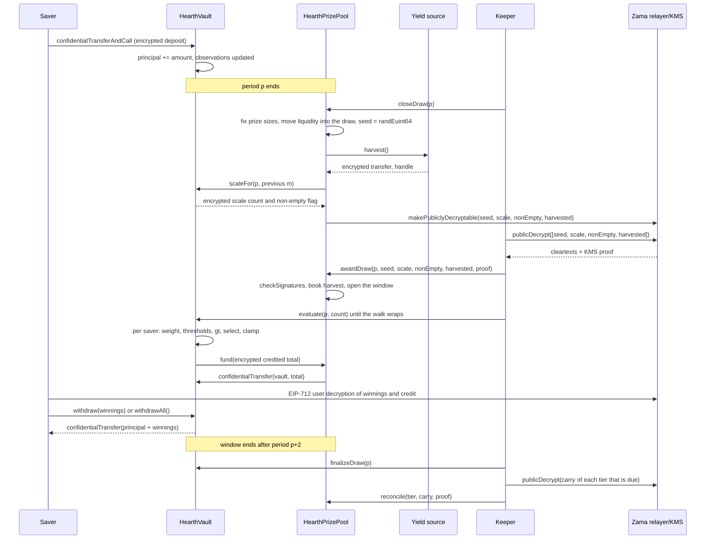

# Como funciona um sorteio

Um sorteio é o momento em que o rendimento do pool vira prêmio. Esta página percorre a coisa
inteira em palavras simples e depois mostra a mesma história como um diagrama.

## Períodos

O tempo é cortado em períodos iguais de `L` segundos. O período 1 começa em `firstPeriodAt`,
um carimbo de tempo fixado na implantação e nunca mais alterado. Daí em diante a aritmética é
só divisão:

```
period(t)      = (t - firstPeriodAt) / L + 1
periodStart(p) = firstPeriodAt + (p - 1) * L
periodEnd(p)   = periodStart(p + 1)
```

Cada pool tem o seu próprio `L`. Na Sepolia o pool de USDC roda uma hora e os outros seis
rodam seis horas, para que um visitante veja um ciclo completo em uma sentada. Na mainnet uma
implantação real usaria um dia, que é o que o PoolTogether V5 usa. O período é um argumento
de construtor, então o mesmo código serve aos três, e as chances de cada nível são definidas
contra o período do próprio pool. Veja [pools e tokens](pools-and-tokens.md).

O sorteio `p` cobre o período `p`. Ele é decidido inteiramente pelos saldos mantidos durante
o período `p`. Nada que aconteça depois que o período `p` termina pode mudar o resultado.

## A janela, e o prazo para fechar

Todo passo do sorteio `p` acontece durante os períodos `p+1` e `p+2`. Essa é a janela, e ela
termina em `periodEnd(p + 2)`. São duas horas no pool de USDC e meio dia nos outros.

Fechar tem um prazo mais apertado do que o resto da janela:

```
closeDeadline(p) = periodStart(p + 2) + L / 2
```

É o meio do segundo período da janela, três quartos do caminho pela janela. Um fechamento
depois disso é recusado.

O motivo é que fechar e premiar não podem dividir um bloco. Fechar marca valores como
decifráveis na blockchain, os textos claros voltam do relayer da Zama fora da blockchain, e
premiar os verifica na blockchain. Um fechamento nos últimos segundos da janela deixaria essa
ida e volta sem onde pousar, e o sorteio ficaria preso para sempre em `Closed`. O prazo
garante pelo menos meio período para a ida e volta, a premiação e cada lote de avaliação.

A janela também limita o quão para trás o cofre precisa lembrar dos saldos, que é o que faz
três observações guardadas por poupador serem suficientes. Veja
[saldo ponderado pelo tempo](time-weighted-balance.md).

## Os cinco passos

Todo passo é aberto a qualquer pessoa. Qualquer um pode chamar qualquer um deles, inclusive
um poupador pelo aplicativo. O keeper é só o endereço que normalmente chega primeiro.

### 1. Fechar

`closeDraw(p)`, depois que o período `p` terminou e antes de `closeDeadline(p)`.

Cinco coisas acontecem nessa única transação, nesta ordem:

- **Os tamanhos dos prêmios são fixados.** O tamanho do prêmio de cada nível e a liquidez que
  ele está colocando neste sorteio são calculados a partir do dinheiro que aquele nível
  guarda naquele instante, e essa liquidez entra no sorteio. Isso acontece antes de a semente
  aleatória existir.
- **A semente é sorteada.** `FHE.randEuint64()` roda dentro do coprocessador da Zama, então o
  número existe apenas como texto cifrado e ninguém o viu.
- **O cofre informa onde está o peso agregado do período**, como uma pequena contagem cifrada
  mais um sinalizador cifrado dizendo se alguém tinha saldo. Não o agregado em si, e ainda
  não em claro. Veja a próxima seção.
- **A fonte de rendimento é colhida**, como uma transferência cifrada para o pool. Se a fonte
  reverter, o fechamento ainda dá certo: a colheita é tratada como um zero cifrado trivial e
  um evento `HarvestFailed` é emitido. Uma fonte de rendimento quebrada não pode parar o
  relógio.
- **Quatro handles são marcados como publicamente decifráveis:** a semente, a contagem de
  escala, o sinalizador de não vazio e a colheita. Esse é um sinalizador de mão única na
  lista de controle de acesso da Zama. A partir daquele momento qualquer um pode pedir o
  texto claro ao relayer, e o sinalizador não pode ser revogado. Nada mais sobre o sorteio é
  jamais marcado assim.

O estado do sorteio passa para `Closed`. Fechar dá certo exatamente uma vez, e é por isso que
ninguém pode sortear a semente de novo.

A ordem dentro da transação é o ponto. Os tamanhos dos prêmios são fixados antes de a semente
existir, então ninguém pode ver uma semente aparecer, descobrir que ganhou e depois rearranjar
o dinheiro do pool para fazer aquele ganho valer mais.

### O que o cofre publica no lugar do total

O saldo total ponderado pelo tempo do pool no período, escrito `W`, nunca é publicado.
Publicá-lo exatamente foi o projeto até 3 de setembro de 2026, e uma revisão o quebrou: com
`W` público em dois períodos consecutivos, e o carimbo de tempo público do depósito ou saque
de um poupador, um poupador que foi o único a mover dinheiro em um período tem o valor exato
recuperado por aritmética. Não limitado, recuperado. Isso está descrito em
[o que permanece privado](../security/what-stays-private.md).

O que se publica hoje é a faixa em que `W` cai: a menor potência de dois igual ou acima dele,
escrita `M = 2^m`. O cofre a acompanha sob cifragem. A cada fechamento ele compara `W` contra
as cinco potências de dois em volta do `m` do sorteio anterior, soma os resultados em uma
pequena contagem cifrada e marca essa contagem como publicamente decifrável. O pool descobre
o novo `m` a partir da contagem verificada. Uma comparação cifrada separada contra 1 dá o
sinalizador de não vazio, que diz se alguém tinha saldo.

Então um observador aprende uma coisa por sorteio: se o pool cruzou uma potência de dois.
Entre cruzamentos ele não aprende nada de novo. Todo sorteio roda contra `M` em vez de `W`, e
é isso que faz as contagens de prêmios descritas abaixo fecharem do jeito que fecham.

### 2. Premiar

`awardDraw(p, seed, scaleCount, nonEmpty, harvested, proof)`.

Quem chama busca os quatro textos claros no relayer da Zama, que os devolve com uma assinatura
do serviço de gestão de chaves (KMS), o conjunto de partes que detém a chave de decifragem da
rede. O contrato verifica essa assinatura na blockchain com `FHE.checkSignatures` antes de
acreditar em um único número. A prova é amarrada aos handles em uma ordem fixa,
`[seed, scaleCount, nonEmpty, harvested]`, então os quatro valores não podem ser embaralhados
nem reaproveitados contra outro sorteio.

Então:

- A colheita verificada é creditada aos níveis pelas cotas deles. Essa é a única forma de
  entrar dinheiro de prêmio, e ele cai nos níveis em vez de neste sorteio, então é oferecido
  no próximo fechamento. O pool nunca contabiliza um valor que a fonte de rendimento declarou
  sobre si mesma.
- Se o sinalizador de não vazio disser que ninguém tinha saldo no período `p`, o sorteio é
  marcado como `Empty` e a liquidez que ele estava oferecendo volta direto para os níveis.
- Caso contrário o sorteio abre. A semente e a faixa `M` agora são números públicos.
- Se a janela já tiver fechado quando alguém premiar, a colheita ainda é contabilizada, a
  liquidez oferecida ainda volta para os níveis, e o sorteio é marcado como `Skipped`. Aquele
  período não paga prêmio, e nenhum rendimento nem liquidez se perde.

Os cinco estados de um sorteio são `None`, `Closed`, `Awarded`, `Empty` e `Skipped`.

**Este é o momento em que os vencedores são decididos.** Daqui em diante a semente é um
número público, a faixa é um número público, e o peso de cada poupador no período `p` não
pode mais mudar. Os limiares que cada poupador tem que superar são aritmética sobre entradas
públicas. A avaliação, a seguir, não decide nada. Ela anota um resultado que já existe.

### 3. Avaliar

`evaluate(p, count)` no cofre, quantas vezes forem necessárias, enquanto a janela estiver
aberta.

Quem chama diz quantos poupadores avançar. Não diz quais. O cofre percorre a lista de
poupadores a partir de um cursor por sorteio que começa em `seed mod saverCount` e avança na
ordem da lista, processando até `count` poupadores e no máximo `4` que precisem de trabalho
cifrado. Poupadores sem observação em ou antes do período `p` têm peso zero, e são pulados a
partir dos carimbos de tempo em texto claro, sem nenhum custo cifrado.

Para cada poupador que a varredura alcança, o cofre lê o peso cifrado dele para o período
`p`, roda o teste do vencedor contra os limiares públicos, e soma o resultado aos ganhos
cifrados dele. Ele guarda o peso cifrado e o crédito cifrado daquele poupador no sorteio,
ambos legíveis só por aquele poupador, para que o aplicativo possa mostrar "você ganhou X no
sorteio p" e deixar a pessoa conferir a comparação. Depois ele puxa do pool de prêmios o
total cifrado creditado por aquele lote.

Ninguém escolhe quem é avaliado nem em que ordem. Um poupador que quer o próprio resultado
avança a mesma varredura que todo mundo avança, então enviar uma transação de avaliação não
diz nada sobre se você ganhou. O ponto de partida muda a cada sorteio, porque vem da semente
daquele sorteio, então nenhum endereço fica permanentemente por último na fila.

`evaluate` reverte para um sorteio que esteja `Empty`, `Skipped`, ou ainda não premiado.

### 4. Finalizar

`finalizeDraw(p)`, depois que a janela fechou.

O que cada nível ofereceu e não pagou é dobrado no remanescente cifrado daquele nível. O
remanescente é um total corrente que fica cifrado e viaja de sorteio em sorteio. Ele é somado
à liquidez oferecida daquele nível a cada fechamento, então o dinheiro não ganho volta ao
jogo imediatamente, mesmo com o tamanho dele ainda secreto.

Finalizar também publica o handle atual de um contador cifrado global de tudo que o pool
deixou de financiar. Com colheitas verificadas ele é sempre zero.

### 5. Reconciliar

`reconcile(tier, carry, proof)` no pool, um nível de cada vez, e só quando aquele nível está
na vez.

Cada nível reconcilia na cadência definida na implantação como `reconcileEvery[t]` sorteios.
Na Sepolia todo nível está na vez a cada sorteio. Quando um nível está na vez, `finalizeDraw`
marca o remanescente dele como publicamente decifrável e emite `CarryPublished`. Qualquer um
busca o texto claro, chama `reconcile` com a prova do KMS, e o número verificado é lançado de
volta na liquidez em texto claro daquele nível. O cofre subtrai esse mesmo número do
remanescente, que pode ter crescido nesse meio tempo, e `TierReconciled` é emitido.

Reconciliar é o que torna a contagem de prêmios daquele nível pública, porque o remanescente
é exatamente a parte do que foi oferecido que ninguém ganhou. Com uma cadência de um, a
contagem de cada nível se torna pública um sorteio depois do sorteio a que pertence, e todo o
bolo de cada nível volta a ficar à vista onde o aplicativo pode mostrá-lo crescendo. Aumentar
a cadência esconde a contagem por aquela quantidade de sorteios e esconde o bolo crescente
junto, que é a troca exposta em
[prêmios e níveis](prizes-and-tiers.md). Nada evapora de um jeito nem do outro, e em qualquer
cadência você nunca fica sabendo quem ganhou.

## O que acontece se um passo nunca acontece

- **O fechamento nunca acontece.** O sorteio fica em `None` e é pulado. A liquidez dele nunca
  foi movida, então fica nos níveis e é oferecida no próximo sorteio. A colheita é recolhida
  pelo próximo fechamento.
- **A premiação nunca acontece dentro da janela.** Uma premiação atrasada ainda contabiliza a
  colheita, ainda devolve a liquidez oferecida aos níveis, e marca o sorteio como `Skipped`.
- **Ninguém avalia.** Toda a oferta de cada nível é dobrada no remanescente dele na
  finalização e volta na próxima reconciliação.

Nada fica encalhado e nada se perde. Um keeper travado custa ao pool um sorteio, não dinheiro.
Veja [a página do keeper](../operations/keeper.md).

## O dinheiro nunca se move por declaração

Duas regras tornam a contabilidade difícil de enganar.

O rendimento nunca é aceito na confiança. A fonte faz uma transferência cifrada para o pool,
o pool é o destinatário e portanto tem permissão sobre aquele texto cifrado, e só então o
pool o publica e contabiliza o texto claro verificado pelo KMS. Uma fonte de rendimento
bugada ou hostil pode enviar menos do que declara; ela não pode fazer o pool acreditar em
dinheiro de prêmio que nunca chegou. Isso importa porque liquidez de prêmio fantasma acabaria
sendo paga com o principal de alguém.

Os pagamentos são puxados, não empurrados. Depois de cada lote de avaliação o cofre concede
ao pool uma permissão de vida curta sobre o total cifrado do lote, o pool concede a mesma
coisa ao token, e o token move exatamente aquele valor do pool para o cofre. Se o pool ficar
devendo, o cofre registra a diferença no contador cifrado global de não financiado, que é
publicado na finalização para qualquer um conferir. Com colheitas verificadas esse contador é
sempre zero.

## O sorteio inteiro, de ponta a ponta



## O que esta página não cobre

Ela não cobre como o peso de um poupador é construído ao longo de um período, que é
[saldo ponderado pelo tempo](time-weighted-balance.md), nem a aritmética do teste do
vencedor, que é [seleção do vencedor](winner-selection.md), nem o tamanho de cada prêmio, que
é [prêmios e níveis](prizes-and-tiers.md).
