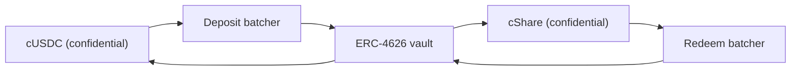

# De onde vem o dinheiro dos prêmios

Prêmios são rendimento. O principal de ninguém jamais é pago como prêmio, e é isso que torna o
pool sem perdas. Esta página cobre a única interface que toda fonte implementa, a fonte que
roda na Sepolia hoje, por que o pool se recusa a aceitar a palavra de uma fonte sobre qualquer
coisa, e como o próprio Confidential Vault da Zama se encaixa na mainnet.

## A interface

```solidity
interface IYieldSource {
    function harvest() external returns (euint64 transferred); // confidential transfer to the recipient
    function harvestable() external view returns (uint64);      // display only
}
```

Duas funções. `harvest` move o rendimento acumulado para o pool de prêmios como uma
transferência confidencial e devolve o valor cifrado que de fato se moveu. `harvestable` é
para a exibição no aplicativo e o pool nunca a usa para contabilidade.

`harvest` é síncrona de propósito. Ela move o que a fonte tiver pronto naquele momento, e
espera-se que uma fonte que ganha de forma assíncrona tenha preparado esse valor com
antecedência em vez de fazer o pool esperar.

Trocar a fonte é uma única chamada do dono no pool, `setYieldSource`, e ela emite
`YieldSourceSet`. Nada mais no sistema sabe ou se importa com qual fonte está conectada.

Uma fonte que reverte não para um sorteio. O pool captura a falha, trata a colheita daquele
sorteio como um zero cifrado trivial, e emite `HarvestFailed`. O fechamento dá certo, o
sorteio roda sobre a liquidez que os níveis já têm, e o rendimento que não conseguiu se mover
é recolhido por uma colheita posterior. Uma fonte quebrada ou mal ligada esfomeia o lado dos
prêmios; ela não pode parar o relógio.

Quando uma colheita chega, ela é contabilizada na premiação daquele sorteio e oferecida no
fechamento seguinte. Então o rendimento do período `p` financia os prêmios do sorteio `p+1`,
não os do sorteio `p`. É isso que permite fixar os tamanhos dos prêmios antes de a semente
existir.

## Sepolia: a fonte patrocinada

`SponsoredYieldSource` é o que roda em todo pool ao vivo, uma instância cada, então as sete
fontes são sete saldos separados de sete tokens diferentes. A do pool de USDC está em
`0xCC49DF69eAB6884fD8DD9260902B8A0Abc9D6b91`; as outras seis estão em
[pools e tokens](pools-and-tokens.md).

Um patrocinador chama a função `sponsor` da própria fonte com o token público do pool. A fonte
o empacota no token confidencial e contabiliza exatamente o que o wrapper cunhou, não o que o
patrocinador pediu. A partir daí o saldo pinga a `ratePerSecond`, que no pool de USDC é
`5,555 base units a second, which is 19.998 USDC a period`,
e `harvest` envia ao pool o que tiver acumulado. A taxa de cada pool é definida em tokens
inteiros por hora para que dois pools em relógios diferentes possam ser comparados de relance,
e todo patrocínio é dimensionado para cobrir mais de oitenta sorteios.

Um patrocínio é uma doação. Não existe caminho para um patrocinador pegá-lo de volta, e só o
dono da fonte pode mudar a taxa de pingo, o que emite `RateChanged`.

Os valores de patrocínio, a taxa de pingo e cada colheita são públicos. Isso não é uma
concessão: no PoolTogether o quanto de rendimento um cofre contribui também é público, e todo
tamanho de prêmio decorre disso. O que é confidencial no Hearth é quem poupou quanto e quem
ganhou, nunca quanto dinheiro o pool gerou.

Se o pool ficar sem poupadores por um tempo, o rendimento continua acumulando e é pago aos
primeiros sorteios que tiverem poupadores. Nada fica encalhado em um pool vazio.

### Por que um mock afinal

Porque uma fonte mock só é honesta se a documentação disser como ela funciona e como uma fonte
real se encaixa, e as duas coisas estão abaixo. Procuramos uma fonte real primeiro e não há
nenhuma na Sepolia que pague rendimento sobre os tokens mock da Zama:

| Lugar | Por que não |
| --- | --- |
| Aave | Recusa depósitos de USDC na Sepolia, teto de fornecimento excedido |
| Compound | Quer o USDC da própria Circle, não o mock da Zama |
| Confidential Vault da Zama | O cofre na Sepolia é um VaultV2 apenas ocioso, sem adaptador de rendimento, que é a descrição da própria Zama |

Então as opções honestas eram um número falso que sobe, ou um saldo financiado por
patrocinador que realmente existe na blockchain e realmente pinga. Ficamos com a segunda. Cada
unidade de dinheiro de prêmio em cada um dos sete pools ao vivo foi realmente empacotada,
realmente transferida e realmente verificada.

## O pool nunca contabiliza um número declarado

Esta é a regra que impede a fonte patrocinada de ser um ponto fraco.

A fonte faz uma transferência cifrada para o pool. O pool, como destinatário, tem permissão
sobre aquele texto cifrado, então ele mesmo pode marcar o valor transferido como publicamente
decifrável. Só na hora da premiação, depois que `FHE.checkSignatures` verifica a assinatura do
serviço de gestão de chaves sobre o texto claro, é que o pool credita algo aos níveis.

Uma fonte que mente sobre quanto enviou não chega a lugar nenhum. O pool contabiliza o valor
que chegou, porque esse é o único valor que ele olha.

Isso não é cautela teórica. No nosso projeto anterior o pool contabilizava as recargas da
reserva pelo valor que quem chamou passou, enquanto o wrapper cunha `amount / rate()`. Na
implantação ao vivo o `rate()` por acaso era 1, então os dois batiam e o bug ficou latente. Em
um subjacente de 18 casas decimais, onde a taxa do wrapper é um milhão de milhões, o pool
teria acreditado em um milhão de milhões de vezes mais dinheiro de prêmio do que existia. Nós
executamos isso em 2 de setembro de 2026 contra um token de teste com 18 casas decimais e
vimos acontecer. Liquidez de prêmio fantasma em um pool sem perdas acaba sendo paga com o
principal de alguém, que é a única promessa que o produto não pode quebrar. Verificar a
transferência remove a classe inteira.

## Mainnet: o Confidential Vault da Zama

A Zama entrega um protocolo cuja função inteira é gerar rendimento sobre saldos confidenciais,
e ele é a fonte natural na mainnet. `ConfidentialVaultYieldSource` é o adaptador nesse
projeto. O que segue é a especificação dele, não um contrato deste repositório.

É um adaptador por pool, como tudo aqui, e cada um precisa de um batcher e de um cofre de
rendimento para o próprio token. A implantação da Zama na mainnet cobre USDC hoje, então um
Hearth de mainnet abriria o pool de USDC sobre o Confidential Vault e qualquer outro token
sobre a fonte que existir para ele, ou sobre nenhuma.

O projeto é um batcher entre os tokens confidenciais e um cofre de rendimento ERC-4626 comum.
Um cofre ERC-4626 só aceita transferências públicas, então um depositante solitário publicaria
o valor exato dele. Em vez disso, o batcher junta muitos depósitos cifrados, decifra apenas a
soma, faz um único depósito público no cofre, e devolve cotas confidenciais. Nas palavras da
própria Zama: "Os observadores veem quem participou, mas não quanto cada um contribuiu."



O adaptador entra no batcher de depósito com o token confidencial do pool e guarda cotas
confidenciais. O resgate roda no próprio cronograma, à frente da colheita: o keeper pede
periodicamente ao batcher de resgate o crescimento e conduz esse pedido pelos quatro estágios
dele, para que, quando o pool chamar `harvest` da próxima vez, o USDC confidencial resgatado
já esteja parado no adaptador e a colheita seja uma única transferência como qualquer outra.
É assim que um lugar assíncrono encontra uma interface síncrona. Cada um dos quatro estágios é
aberto a qualquer pessoa, então ninguém precisa esperar o operador da Zama para rodá-los.

### Os endereços

Da própria referência de endereços da Zama, obtida em 2 de setembro de 2026.

**Mainnet do Ethereum, chain id 1.** Ativo subjacente USDC. Fonte de rendimento: VaultV2 da
Morpho "Steakhouse Confidential Prime USDC", com acesso restrito para que o batcher de
depósito seja o único depositante do cofre.

| Contrato | Endereço |
| --- | --- |
| Batcher de depósito | `0x324EA89FD3784036673BfE6Ffee2334A088F40Cc` |
| Batcher de resgate | `0x96Cd3Faa7483783Ac2Eb715f6333361500F1eec9` |
| Wrapper cUSDC | `0xe978F22157048E5DB8E5d07971376e86671672B2` |
| Wrapper cShare | `0x66Bf74E96900D1a19c7070D939D124f2F565C458` |
| Cofre ERC-4626 | `0xbEEF00A59B577423653A1526c7009bdE103F542B` |
| USDC | `0xA0b86991c6218b36c1d19D4a2e9Eb0cE3606eB48` |

**Sepolia, chain id 11155111.** Um ambiente de teste: o USDC é um mock com `mint` público e o
cofre é apenas ocioso, sem adaptador de rendimento.

| Contrato | Endereço |
| --- | --- |
| Batcher de depósito | `0x48758559c14d4d92b4C74A99660B6a8dbe85F53b` |
| Batcher de resgate | `0xe94E9afdDd43a19C2914739e9279cb6Fe287BEb0` |
| Wrapper cUSDC | `0x7c5BF43B851c1dff1a4feE8dB225b87f2C223639` |
| Wrapper cShare | `0x7E93d5c150A2178B1fCde0278582Acf59478eA5f` |
| Cofre ERC-4626 (ocioso) | `0x6AB54988261AEC573a2CA13cF802d3B1114f864C` |
| Mock USDC | `0x9b5Cd13b8eFbB58Dc25A05CF411D8056058aDFfF` |

Como o cofre da Sepolia é ocioso, o adaptador está especificado aqui contra a interface de
batcher publicada pela Zama e ainda não foi escrito. Dizer que ele está no ar quando não ganha
nada seria uma mentira que qualquer um checa em um minuto.

### O que encaixá-lo significa na prática

O batcher se move em quatro estágios: entrar, despachar, finalizar, reivindicar. Um lote
espera até atingir uma idade mínima, depois o total dele é decifrado, depois o cofre liquida,
depois os participantes reivindicam. Cada um desses estágios é aberto a qualquer pessoa, então
o pool nunca fica preso esperando o operador da Zama, e as reivindicações nunca expiram.

Esse ritmo é mais lento que o pingo instantâneo da fonte patrocinada, e é por isso que o keeper
roda o resgate com antecedência em vez de dentro do `harvest`. O contrato do pool nunca espera:
ele pede ao adaptador o que já foi reivindicado de volta. O que sobra de trabalho real para
colocar isso no ar é o contrato do adaptador em si, que este repositório especifica mas não
implementa, e o lado do keeper, decidir com que frequência começar um resgate e quanto da
posição resgatar, que é uma escolha de política sem consequência na blockchain se atrasar.

### O que o Hearth herdaria

Nomear isso direito faz parte de ser confiável a respeito.

- **Risco do cofre, por inteiro.** O batcher encaminha dinheiro para um cofre ERC-4626 de
  terceiros. Se aquele cofre perder valor, o saldo rendendo do pool perde valor junto. Este é
  o único lugar em que "sem perdas" dependeria do contrato de outra pessoa, e é por isso que
  uma implantação de mainnet deveria manter lá apenas a parcela que rende.
- **Confidencialidade do lote, não do pool.** O batcher esconde valores entre coparticipantes
  e decifra a soma. Se o Hearth fosse o único participante de um lote, o valor do depósito
  dele seria público. Isso não nos custa nada, porque as colheitas do Hearth são publicadas de
  qualquer jeito, mas vale saber antes de supor que o batcher esconde mais do que esconde.
- **Poderes limitados do dono.** O dono do batcher pode mudar a idade mínima do lote (com teto
  de 7 dias), o prazo do callback (com teto de 30 dias), a tolerância de deslize do depósito, e
  pode pausar entradas e despachos. A documentação da Zama afirma que o dono não pode mover
  nem congelar fundos de usuários, não pode censurar um resultado, não pode decifrar os valores
  de ninguém, e não pode atualizar o contrato. A proteção contra deslize no resgate é
  desligada de forma fixa para que as saídas funcionem mesmo durante uma queda do cofre.

## O que esta página não cobre

Ela não cobre o efeito da fonte de rendimento na tabela de vazamentos, que está em
[o que permanece privado](../security/what-stays-private.md). Não faz benchmark do rendimento
do cofre da Morpho, que é número de outra pessoa e muda todo dia. E não afirma que o adaptador
está rodando: na Sepolia a fonte patrocinada é o que está conectado, e o cartão "O pool agora"
no painel diz isso.
