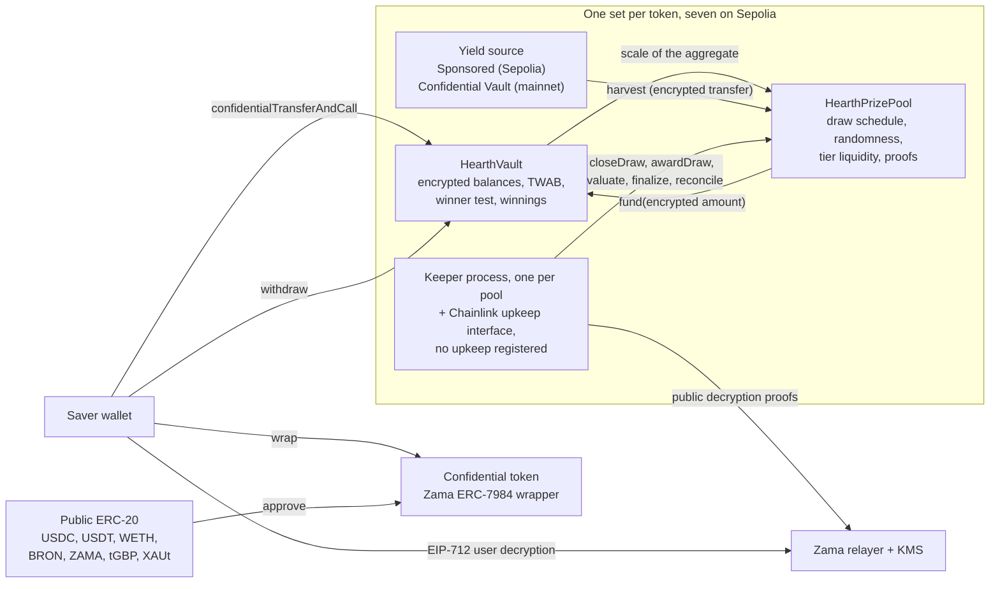

# O que é o Hearth

O Hearth é um pool de poupança onde você não pode perder seu dinheiro e pode ganhar um
prêmio. Sete deles rodam na Sepolia, um por token confidencial, e você escolhe um token do
mesmo jeito que escolheria uma conta poupança.

Você coloca um token confidencial: USDC, USDT, WETH, BRON, ZAMA, tGBP ou XAUt. O pool põe
esse dinheiro para trabalhar e gera rendimento. A cada
período o rendimento que o pool gerou é distribuído como prêmios, e a sua chance de ganhar
é proporcional a quanto você manteve e por quanto tempo manteve. Você pode pegar seu
principal de volta a qualquer momento, integralmente. Essa é a ideia da "loteria sem
perdas" que o PoolTogether inventou, e o Hearth é uma versão confidencial dela.

A diferença em relação ao PoolTogether é que, numa blockchain comum, tudo é público.
Qualquer pessoa pode ler quanto cada poupador tem, quais são as chances de cada carteira e
quem ganhou cada sorteio. Isso publica o patrimônio das pessoas e pinta um alvo nas costas
de quem tem muito. O Hearth roda a coisa inteira sobre números cifrados usando o Protocolo
da Zama, então a blockchain guarda o seu saldo como texto cifrado (dados ilegíveis sem uma
chave) e o contrato ainda assim faz as contas em cima dele. Seu saldo é um número que
ninguém jamais viu, nós inclusive, e o sorteio continua verificável por um estranho.

## O sistema em uma imagem

Dois contratos fazem o trabalho. O `HearthVault` guarda o principal cifrado de cada
poupador, os ganhos cifrados, o registro de quanto tempo cada um manteve o quê, e roda o
teste do vencedor. O `HearthPrizePool` toca o relógio, sorteia a semente aleatória, recolhe
o rendimento e mantém o dinheiro dos prêmios separado por níveis. Um processo keeper empurra
o sorteio adiante, e cada passo que ele dá pode ser dado por qualquer outra pessoa.

A caixa no meio é o pool de um token. São sete deles e não compartilham nada: sua posição em
USDC e sua posição em WETH são poupadores separados em cofres separados, e um pool que fica
quieto deixa os outros rodando. Qual pool você está vendo é a primeira parte da barra de
endereço, `/app/usdc` ou `/app/weth`. A lista completa, com endereços, está em
[pools e tokens](../concepts/pools-and-tokens.md).

## Os quatro movimentos

Um poupador faz quatro movimentos. Aqui está o que cada um faz e o que cada um entrega.

### 1. Depositar

Você envia o token confidencial daquele pool para o cofre dele com uma transação. O valor
viaja como um
handle de texto cifrado, que é um ponteiro para um valor cifrado em vez do valor em si. O
cofre soma esse valor ao seu principal cifrado e atualiza o registro do seu saldo ao longo
do tempo, tudo sem decifrar nada.

- Escondido: o valor, seu saldo corrente e, portanto, sua fatia do pool.
- Público: seu endereço, o bloco em que você fez isso e o fato de que houve um depósito.

Há uma costura. Transformar o token público comum no token confidencial é uma transferência
ERC-20 pública, então o valor empacotado fica visível. Se você empacota 5.000 USDC e
deposita dois blocos depois, um observador tem um palpite muito bom. O Hearth mantém
empacotar e depositar como dois passos separados justamente para que você possa colocar
distância entre eles. Veja
[a costura do empacotamento](../security/what-stays-private.md).

### 2. Sortear

No fim de cada período o pool fecha o sorteio daquele período. Em uma transação ele fixa o
tamanho do prêmio de cada nível, depois sorteia uma semente aleatória cifrada dentro do
coprocessador da Zama, depois pergunta ao cofre qual era o tamanho do pool e por fim recolhe
o rendimento do período. A ordem importa: os prêmios são dimensionados antes de o número
aleatório existir, então ninguém consegue ver uma semente e depois rearranjar quanto vale
ganhar.

"Qual era o tamanho do pool" é deliberadamente vago, e isso é o projeto. O cofre não publica
o saldo total ponderado pelo tempo de todos os poupadores somados. Ele publica apenas a
faixa de potência de dois em que esse total cai, então o que o mundo aprende é o tamanho
aproximado do pool, não o tamanho exato. Publicar o número exato deixaria alguém subtrair
dois sorteios consecutivos e ler o depósito de um poupador solitário na diferença.

Quatro valores pequenos então saem com uma prova assinada pelo serviço de gestão de chaves
da Zama, para que qualquer um possa conferi-los: a semente, a faixa, se havia alguém no pool
e o rendimento recolhido. O resultado de cada poupador naquele sorteio fica fixado no
momento em que esses números são verificados.

- Escondido: o peso individual de cada poupador, o total exato do pool e cada resultado
  individual.
- Público: a semente, a faixa, o rendimento recolhido, o tamanho do prêmio de cada nível e,
  um sorteio depois, quando o nível reconcilia, quantos prêmios ele pagou.

### 3. Resgatar

Não existe transação de resgate, e esse é o ponto. O aplicativo tem sim um botão de resgate,
no cartão daquele sorteio em "Meus sorteios", e ele carrega o valor: é um saque comum dos
ganhos que você acabou de abrir, e na blockchain ele parece exatamente qualquer outro saque.

Os ganhos são creditados em um saldo cifrado separado dentro do cofre enquanto o sorteio é
avaliado. Nada que você faça provoca isso e nada que você faça revela isso. Para descobrir
se você ganhou, você assina uma mensagem EIP-712, uma assinatura tipada fora da blockchain
que prova que você controla o seu endereço, e o relayer da Zama devolve o texto claro dos
seus próprios ganhos para o seu navegador. Essa assinatura nunca toca a blockchain, então
não custa nada e não deixa rastro. Seu saldo no painel e o resultado de um sorteio têm cada
um o seu próprio olho, os dois podem estar abertos ao mesmo tempo, e a assinatura do primeiro
serve para o segundo.

- Escondido: tudo. Ler os próprios ganhos é uma operação fora da blockchain.
- Público: nada.

Na maioria dos protocolos de prêmio o vencedor precisa enviar uma transação de resgate e o
perdedor não tem motivo para isso, então a lista de transações silenciosamente nomeia os
vencedores. O Hearth não tem essa transação para enviar. A transação que credita os prêmios,
`evaluate`, não pode ser apontada para você mesmo: ela percorre a lista de poupadores a
partir de um ponto que a própria semente do sorteio decide, e quem chama só diz o quanto
avançar.

### 4. Sacar

Uma função tira dinheiro: `withdraw`. Ela paga primeiro dos seus ganhos, depois do seu
principal, e limita ao menor valor entre o que você tem e o que o cofre tem. Se você está
recolhendo um prêmio, levando sua poupança para casa, ou as duas coisas de uma vez, é a mesma
chamada com o mesmo formato, o mesmo evento e um valor cifrado.

A segunda metade desse limite existe porque uma transferência confidencial move o valor
inteiro ou nada. Ela nunca envia parte do que foi pedido. Então o cofre calcula o que
realmente consegue pagar antes de pedir ao token que pague, em vez de tentar consertar uma
falta depois.

- Escondido: o valor, e se alguma parte dele era dinheiro de prêmio.
- Público: seu endereço, o bloco e o fato de que houve um saque.

Seu principal nunca fica travado. Depósitos e saques seguem abertos enquanto um sorteio está
rodando, o que não é verdade em vários outros projetos desta área.

## O que torna o sorteio justo

Duas coisas, e as duas podem ser conferidas por um estranho sem nenhum acesso especial.

A semente aleatória vem de `FHE.randEuint64`, gerada dentro do coprocessador da Zama a
partir de uma semente pública sob a chave FHE da rede. Ninguém pode prevê-la e ninguém pode
sorteá-la duas vezes: fechar um sorteio dá certo exatamente uma vez. Assim que o período
termina, o pool publica essa semente junto com a faixa em que o total do pool caiu, ambas
carregando uma prova que o contrato verifica na blockchain.

A partir desses dois números públicos, qualquer pessoa pode recalcular o limiar exato que
qualquer endereço tinha que superar em qualquer nível, e o cofre expõe a mesma aritmética
como uma função de leitura para que ninguém precise confiar em uma reimplementação. O que
essas pessoas não conseguem é ver o peso cifrado com que a comparação foi feita. Então a
regra é pública e auditável, e só a entrada é privada. Detalhes em
[aleatoriedade e verificação](../security/randomness-and-verification.md).

## O que o Hearth não esconde

Versão curta, completa em [o que permanece privado](../security/what-stays-private.md):

- Quem são os poupadores, e quando cada um depositou, sacou ou foi avaliado.
- A faixa em que o total do pool caiu em cada período, a semente e o rendimento recolhido.
- O tamanho do prêmio de cada nível, e quantos prêmios ele pagou, publicado um sorteio
  depois.
- O valor que você empacotou para dentro ou para fora do token confidencial.
- Com um único poupador, a faixa publicada é o peso desse poupador com margem de um fator
  dois. Com dois, cada um consegue limitar o outro. A privacidade aqui precisa de três ou
  mais poupadores, e o aplicativo diz isso.
- Os limiares são públicos, então qualquer um que consiga fixar o seu saldo pode calcular o
  seu resultado em todo sorteio. O jeito mais comum de isso acontecer é empacotar e depois
  depositar o mesmo valor minutos depois, e é por isso que o aplicativo mantém os dois
  separados.
- Empacotar para dentro e desempacotar para fora integralmente publica um piso de tudo que
  você já ganhou, porque os dois movimentos são públicos na camada do token.
- Um poupador que saca imediatamente depois de todo sorteio que ganhou vaza uma pista
  estatística pelo próprio comportamento. Nenhum contrato conserta essa.
