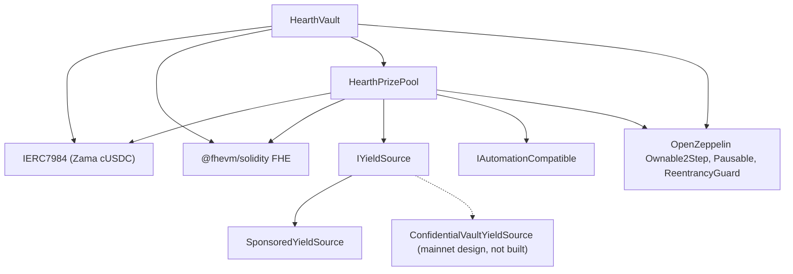

# Implantação

Um script repetível, nunca cliques manuais. Esta página é a ordem, os parâmetros e o que cada um
deles significa, para que um revisor possa ler os argumentos de construtor implantados e saber
que eles batem.

O Hearth implanta um pool por token confidencial: um cofre, um pool de prêmios e uma fonte de
rendimento por token, sem compartilhar nada com nenhum outro pool. Uma execução abre um pool,
porque um nonce de implantador roda uma implantação, e o token é escolhido com `HEARTH_TOKEN`.
Toda tarefa depois disso recebe `--token`:

```
cd packages/contracts
HEARTH_TOKEN=weth npx hardhat deploy --network sepolia
npx hardhat hearth:verify  --network sepolia --token weth
npx hardhat hearth:seed    --network sepolia --token weth
npx hardhat hearth:status  --network sepolia --token weth
```

Deixe os dois de fora e você recebe `usdc`, o token padrão da rede. Um slug desconhecido falha
com a lista de pools que aquela rede de fato tem. Os parâmetros de cada pool ficam em um arquivo,
`packages/contracts/hearth.config.ts`: o par de ativos, o período, o conjunto de níveis, a faixa
inicial, a taxa de pingo, o patrocínio, as cinco posições de demonstração e o índice de conta com
que o keeper dele assina. Leia esse arquivo ao lado das tabelas abaixo; são os mesmos números.

A implantação reaproveita qualquer contrato que já tenha um registro salvo em vez de substituí-lo,
então uma segunda execução não faz nada. Um pool ao vivo com dinheiro de poupadores e dias de
histórico de sorteios nunca pode ser movido para um endereço novo ao rodar o script de novo. Para
substituir um deliberadamente, apague o arquivo dele em `deployments/<network>/` primeiro.

Ela escreve `deployments/sepolia/hearth.<slug>.json`, que é para onde um keeper é apontado com
`HEARTH_ADDRESSES_FILE` e a partir do qual a lista de pools do aplicativo é gerada.

## O que depende do quê



As arestas sólidas são contratos deste repositório. O nó pontilhado é o caminho de rendimento da
mainnet: o adaptador está especificado contra a interface de batcher publicada pela Zama e
nenhum contrato de adaptador está escrito aqui, então só o `SponsoredYieldSource` é implantado
abaixo.

O cofre e o pool precisam um do outro, então um dos dois vínculos é feito depois da implantação
em vez de em um construtor. É por isso que há cinco passos abaixo e não três.

## A ordem

| Passo | Ação | Por que aqui |
| --- | --- | --- |
| 1 | Implantar o `HearthVault` | Ele guarda o dinheiro dos poupadores e não precisa de nada além do token existir. |
| 2 | Implantar o `HearthPrizePool`, apontando para o cofre | O pool lê o relógio do cofre e a contagem de escala dele, e paga o cofre. |
| 3 | Ligar: `vault.setPrizePool(pool)` | Emite `PrizePoolSet`. O cofre só aceitará financiamento deste endereço. |
| 4 | Implantar a fonte de rendimento, apontando para o pool como destinatário | Ela precisa saber para onde enviar as colheitas. |
| 5 | Ligar: `pool.setYieldSource(source)` | Emite `YieldSourceSet`. Até isso acontecer, um fechamento não colhe nada e emite `HarvestFailed`. |

Depois do passo 5, semeie o pool: `hearth:seed --token <slug>` patrocina a fonte de rendimento
para que existam prêmios e coloca cinco poupadores de demonstração de tamanhos diferentes, das
contas 2 a 6, para que um primeiro visitante chegue em um pool povoado em vez de vazio. Cada
passo confere na blockchain o que já foi feito, então uma semeadura interrompida por um soluço do
relayer pode ser rodada de novo com segurança.

O keeper daquele pool também precisa do próprio ETH da Sepolia, e os cinco poupadores de
demonstração também:

```
npx hardhat hearth:spread-gas --network sepolia --token weth
npx hardhat hearth:spread-gas --network sepolia --keepers 10,11,12,13,14,15 --savers false
```

O primeiro financia o keeper de um pool e os poupadores; o segundo financia várias contas de
keeper em uma passada, que é o que abrir seis pools de uma vez precisa.

Depois aponte o aplicativo para o que foi implantado:

```
cd ../web
node scripts/sync-pools.mjs
```

## Os parâmetros

```
HearthVault(IERC7984 asset, uint256 periodLength, uint256 firstPeriodAt, address owner)
HearthPrizePool(IHearthVault vault, IERC7984 asset, Tier[3] tiers, uint8 initialScaleBits, address owner)
    Tier = { uint32 prizeCount; uint64 oddsNumerator; uint64 oddsDenominator; uint16 shares; uint16 reconcileEvery }
SponsoredYieldSource(IERC7984ERC20Wrapper asset, address recipient, uint64 ratePerSecond, address owner)
```

### HearthVault

| Parâmetro | Significado | Se errar |
| --- | --- | --- |
| `asset` | O token confidencial ERC-7984 que os poupadores depositam, um dos sete da Zama. | Todo wrapper lê seis casas decimais, e a implantação se recusa a continuar se a blockchain discordar da configuração. A taxa para o token público por baixo não é 1 em todo pool: no mock de WETH, de 18 casas decimais, ela é um milhão de milhões, então qualquer coisa que leia o token público tem que aplicá-la. |
| `periodLength` (`L`) | Segundos em um período. Imutável. | Também define o teto por poupador, `(2^64 - 1) / L`. Um `L` pequeno demais e o teto é enorme mas os sorteios ficam ruidosos; grande demais e o teto aperta. |
| `firstPeriodAt` | Carimbo de tempo em que o período 1 começa. Imutável, e tem que ser igual ou anterior à implantação. | Um valor futuro deixa `period(now)` indefinido até ele passar. |
| `owner` | Dono em dois passos. Renunciar está desabilitado. | Os poderes estão listados no [modelo de ameaças](../security/threat-model.md). |

`maxPrincipal` é derivado de `periodLength`, não definido. Em uma hora dá cerca de 5 bilhões de
tokens, em seis horas cerca de 854 milhões, e em um dia cerca de 213 milhões.

O cofre é dono do relógio. O pool recebe o endereço do cofre e lê os períodos dele, então não há
como os dois contratos discordarem sobre qual período é.

### HearthPrizePool

| Parâmetro | Significado |
| --- | --- |
| `vault` | O cofre que este pool atende, e o relógio que ele lê. |
| `asset` | O mesmo token confidencial que o cofre usa. Eles têm que bater. |
| `prizeCount[t]` | Prêmios por sorteio no nível `t`. |
| `oddsNumerator[t]`, `oddsDenominator[t]` | As chances do nível como fração, um sorteio em `oddsDenominator / oddsNumerator`. |
| `shares[t]` | A fatia do nível em cada colheita. As cotas são relativas, então 40/20/40 e 2/1/2 significam a mesma coisa. |
| `reconcileEvery[t]` | Quantos sorteios passam entre publicações do remanescente daquele nível. |
| `initialScaleBits` | O comprimento em bits esperado do peso total do primeiro período, o palpite inicial do rastreador de faixa. |
| `owner` | Como acima. |

`UTILISATION` é uma constante e não um argumento: 50 por cento, seguindo o PoolTogether V5. É a
fração da liquidez em texto claro de um nível usada para dimensionar cada prêmio.

Dois deles merecem uma palavra.

`reconcileEvery` é uma configuração de privacidade, não de gás, e ela troca contra a aparência do
bolo de prêmios. Publicar o remanescente de um nível torna a contagem de prêmios daquele nível
pública, e uma contagem sobre um sorteio aponta para o conjunto pequeno de poupadores elegíveis
naquele sorteio. Colocá-lo mais alto espalha a contagem por um intervalo em que quase todo mundo
foi elegível em algum momento.
O que isso custa é o prêmio grande visível: um fechamento move toda a liquidez pública de um
nível para dentro do sorteio e ela só volta em uma reconciliação, então um nível com cadência 24
publica um prêmio dimensionado a partir da cota de colheita de um sorteio em 23 de cada 24, com o
bolo acumulado aparecendo à vista apenas no sorteio da reconciliação. O dinheiro fica oferecido e
ganhável o tempo todo dentro do remanescente cifrado; ele só é invisível. A Sepolia roda os três
níveis em 1 por essa razão e declara a contagem por sorteio como um resíduo. Veja a limitação 14.

`initialScaleBits` só precisa estar perto. O rastreador compara o total real contra cinco
potências de dois em volta do palpite atual a cada fechamento e se corrige em até três bits por
sorteio, então um palpite errado por alguns bits custa um ou dois sorteios com chances
ligeiramente mal escaladas e depois se acomoda.

### SponsoredYieldSource

| Parâmetro | Significado |
| --- | --- |
| `asset` | O wrapper ERC-7984 que ela guarda e envia. O token público em que os patrocinadores pagam é o próprio subjacente do wrapper, então não é um argumento separado. |
| `recipient` | O pool de prêmios que recebe as colheitas. |
| `ratePerSecond` | Com que velocidade o saldo patrocinado pinga como rendimento. |
| `owner` | Define a taxa, emitindo `RateChanged`. |

Patrocinar é uma chamada separada depois da implantação, não um argumento de construtor. Ela
contabiliza exatamente o que o wrapper cunhou em vez do que o patrocinador pediu, e não pode ser
desfeita.

## Três conjuntos de parâmetros

A Sepolia roda dois deles, porque os pools rodam em dois relógios.

| Configuração | Sepolia `usdc` | Sepolia, os outros seis | Mainnet, candidato |
| --- | --- | --- | --- |
| Duração do período | 1 hora | 6 horas | 1 dia |
| Janela | 2 horas (dois períodos) | 12 horas | 2 dias |
| Prazo de fechamento | 1 hora e 30 minutos depois do fim do período | 9 horas depois | 1 dia e 12 horas depois |
| Teto por poupador | Cerca de 5 bilhões de tokens | Cerca de 854 milhões | Cerca de 213 milhões |
| Nível grande | quantidade 1, chances 1/24, cotas 40, reconcilia a cada sorteio | quantidade 1, chances 1/4, cotas 40, reconcilia a cada sorteio | quantidade 1, chances 1/30, cotas 50, reconcilia a cada sorteio |
| Nível médio | quantidade 1, chances 1/6, cotas 20, reconcilia a cada sorteio | quantidade 1, chances 1/2, cotas 20, reconcilia a cada sorteio | quantidade 1, chances 1/7, cotas 25, reconcilia a cada sorteio |
| Nível frequente | quantidade 4, chances 1, cotas 40, reconcilia a cada sorteio | quantidade 4, chances 1, cotas 40, reconcilia a cada sorteio | quantidade 4, chances 1, cotas 25, reconcilia a cada sorteio |
| Utilização | 50 por cento | 50 por cento | 50 por cento |
| Fonte de rendimento | `SponsoredYieldSource` | `SponsoredYieldSource` | `ConfidentialVaultYieldSource` sobre o batcher da Zama |
| O prêmio grande dispara | Cerca de uma vez por dia | Cerca de uma vez por dia | Definido pelas chances escolhidas |

Os números da Sepolia existem para que um visitante veja um ciclo completo em uma sentada:
quatro prêmios pequenos a cada sorteio e um prêmio grande cerca de uma vez por dia nos dois
relógios. Eles não são o que uma implantação real usaria.

Por que dois relógios. Um sorteio com cinco poupadores custa `8,456,388` de gás, então sete pools
sorteando de hora em hora gastariam cerca de `1.43 ETH` por dia na Sepolia, que os faucets
públicos não conseguem acompanhar. Seis horas corta isso para quatro sorteios por dia por pool,
cerca de `0.41 ETH` por dia para os sete. As chances são definidas contra o período de cada pool
em vez de transportadas, que é por que a coluna do meio lê 1/4 e 1/2 onde a primeira lê 1/24 e
1/6, e por que o prêmio grande ainda cai cerca de uma vez por dia nos dois. O pool de USDC
manteve o relógio de uma hora porque foi implantado primeiro e o histórico de sorteios dele está
arquivado ali.

A coluna da mainnet é um candidato, não uma implantação. A regra para preenchê-la é a mesma que
produziu a coluna da Sepolia: escolha quantos sorteios você quer entre prêmios grandes e defina
as chances do nível grande em um sobre esse número, depois defina as cotas para que os tamanhos
de prêmio resultantes façam sentido contra o rendimento que a fonte de fato ganha, depois decida
a cadência de reconciliação de cada nível pesando uma contagem de prêmios que não nomeia ninguém
contra um bolo que os poupadores podem ver crescer. A Sepolia escolheu a segunda; uma implantação
de mainnet pode escolher a primeira, e o parágrafo acima diz o que cada lado custa. Um período
diário com chances de 1 em 365 no nível grande dá um prêmio grande anual, que é o formato que o
V5 usa.

## Endereços implantados

Sete pools na Sepolia, todo contrato verificado no Etherscan. O par de tokens que cada um guarda
é da Zama e está listado em [pools e tokens](../concepts/pools-and-tokens.md), junto com as
posições semeadas e a taxa de pingo por pool.

| Pool | HearthVault | HearthPrizePool | SponsoredYieldSource | Implantado no bloco |
| --- | --- | --- | --- | --- |
| `usdc` | `0x0F93e5db6027b4FB1C76566d24aA2D2E417fAF52` | `0xA0785AacF30B6FE46EDc53CD8A9db1d94FeF5Df2` | `0xCC49DF69eAB6884fD8DD9260902B8A0Abc9D6b91` | `11622398` |
| `usdt` | `0xe54F44dE64F8A7abc0647eaae547dD59ce0EFfac` | `0x6a83Beb2Dc3f258107Cad5e17BC57657fAd4fbd1` | `0x5bb1Cd5380Cb9f2B15569030fF0dB7a445cF54cA` | `11641314` |
| `weth` | `0x3D1A182782B68fE270A66294C9adaC7F005c4f14` | `0x1a11e7C689F244fA8Dd5f4abA8F2F3131090cc1C` | `0x40DF298f15c6136294eC651aD7b0c1C6F221DE8F` | `11641366` |
| `bron` | `0x18086DC8271f8A73c5Ea985fd519527Dbb991279` | `0x2Ed982979CD184494B947a1E38E597494a38ACe4` | `0x0cD1155D752bD81b3a437a6f0B3965CAA2A1C8e9` | `11641408` |
| `zama` | `0xEEC26386F273c6678cA538AcA18e1d9384eA9F09` | `0x873B285404199D46325a294Aa0EC7a79C30A7fF7` | `0xdD352D70311E834ab75307f53d5C276060081d23` | `11641447` |
| `tgbp` | `0xCe95dAa01f5354aA8887A5952E403D26d452c323` | `0xC531D54ee2c695e0eBfe8b8258e9Fd80fd507095` | `0xDEa2BD6351072F735B6ea83c357bF157d83c01af` | `11641484` |
| `xaut` | `0x77f701101d66FbD522A3bFdC2c00DB09a4F57daE` | `0x9a2888aca42c707A3BC0D561FdF6ff8Abfda5201` | `0x03fDdAA7C4323C53CE511CC49D4c33B26B492af7` | `11641523` |

Início do primeiro período: `1788386400 (2 September 2026, 22:00:00 UTC)` para `usdc`,
`1788620400 (5 September 2026, 15:00:00 UTC)` para `usdt`, e
`1788624000 (5 September 2026, 16:00:00 UTC)` para os cinco restantes. `firstPeriodAt` é imutável
e tem que ser igual ou anterior ao bloco da implantação, então a implantação lê o relógio da
própria blockchain e arredonda para baixo até o topo da hora, nunca o relógio da máquina.

## Verificação

A verificação faz parte da implantação, não é uma coisa para depois. Um revisor que não consegue
ler o código-fonte implantado tem que acreditar na nossa palavra sobre esta documentação inteira.

1. Verifique os três contratos daquele pool no Etherscan com os argumentos de construtor
   registrados pelo script de implantação: `hearth:verify --token <slug>` faz isso, contrato por
   contrato, e diz quais já estavam verificados.
2. Confira que os argumentos de construtor verificados batem com as tabelas de parâmetros acima.
   Em particular que o pool recebeu o próprio cofre dele e o mesmo `asset`, e que o conjunto de
   níveis bate com a coluna do relógio daquele pool.
3. Confira que `vault.prizePool()` é o pool de prêmios daquele pool e que `pool.yieldSource()` é
   a fonte daquele pool, e que nenhum dos dois aponta para contratos de outro pool.
4. Confira o token: `asset` deve ser o wrapper confidencial daquele pool na lista publicada da
   Zama para a Sepolia, e `underlying()` deve ser o mock público por baixo dele. O `rate()` do
   wrapper é 1 apenas onde o token público também lê seis casas decimais; no pool de WETH ele é
   um milhão de milhões, e uma taxa diferente de 1 muda o que uma unidade base significa para
   qualquer coisa que toque o token público.
5. Leia `pool.scaleBits()` depois de alguns sorteios e confira se ele se acomodou perto do
   comprimento em bits que o tamanho real do pool implica. Um rastreador preso longe disso
   significaria que o palpite inicial estava absurdamente errado e a correção ainda não alcançou.

## Segredos

Nada sensível é jamais escrito no código. A implantação lê de um arquivo `.env`, e o
`.env.example` lista toda chave com um comentário sobre de onde vem o valor dela. A chave do
implantador e a chave do keeper são contas separadas, então a chave quente do keeper não tem
poderes de dono.

## Hospedando o aplicativo

O aplicativo é um pacote de workspace Next.js, não a raiz do repositório, que é a configuração
que a maioria dos hosts erra.

| Configuração | Valor | Por quê |
| --- | --- | --- |
| Preset de framework | Next.js | Detectado de `packages/web/package.json` |
| Diretório raiz | `packages/web` | O aplicativo vive em um workspace npm |
| Incluir arquivos-fonte fora do diretório raiz | Ligado | As dependências são içadas para a raiz do repositório, e a build precisa do `package.json` e do lockfile da raiz |
| Comando de instalação | o padrão, `npm install` | Roda na raiz do repositório e instala o workspace inteiro |
| Comando de build | o padrão, `next build` | Com o diretório raiz definido, ele roda dentro de `packages/web` |
| Diretório de saída | o padrão, `.next` | Veja o aviso abaixo |
| Versão do Node | 20 ou mais nova | O `package.json` da raiz define `engines.node` |

Não defina `NEXT_DIST_DIR` em um ambiente hospedado. O `packages/web/next.config.ts` o lê e move
a saída da build quando ele está presente. Ele existe para que uma build local de verificação não
brigue com um servidor de desenvolvimento rodando pelo mesmo diretório `.next`. Em uma build
hospedada ele moveria a saída para longe de onde o host procura, e a implantação falharia sem
nada óbvio para apontar.

### Variáveis de ambiente

| Variável | Pública no navegador | De onde vem o valor |
| --- | --- | --- |
| `SEPOLIA_RPC_URL` | Não | Seu próprio endpoint da Sepolia. A landing page e a rota `/api/activity` leem a blockchain no servidor, então esta nunca chega a um navegador. Consultas de log precisam dela, porque o nó público gratuito limita as faixas de `eth_getLogs` a muito menos que um dia de blocos |
| `NEXT_PUBLIC_SEPOLIA_RPC_URL` | Sim | Opcional. As leituras da carteira a usam e caem para `https://ethereum-sepolia-rpc.publicnode.com` quando ela não está definida. Visível no bundle, então tem que ser uma que você aceite publicar |
| `NEXT_PUBLIC_CHAIN_ID` | Sim | `11155111` para a Sepolia do Ethereum. O aplicativo assume esse valor se não estiver definida |
| `NEXT_PUBLIC_WALLETCONNECT_PROJECT_ID` | Sim | Opcional, e gratuita no painel da Reown em https://dashboard.reown.com. Defina-a e toda tela de conexão passa a oferecer "Escanear com o celular" ao lado da extensão do navegador, que é como entram uma carteira de celular e uma máquina sem extensão. Em branco, o conector nem chega a ser construído, então ninguém recebe um botão que falha na hora de escanear |

Nenhum endereço de contrato é mais uma variável de ambiente. O aplicativo lê todo pool de
`packages/web/src/lib/chain/pools.json`, que o `node scripts/sync-pools.mjs` gera a partir dos
arquivos de endereços que o script de implantação escreveu, então um endereço que o aplicativo
mostra sempre pode ser rastreado até um registro de implantação em vez de até algo que alguém
digitou. Rode esse script depois de toda implantação e comite o resultado. As três variáveis
públicas que guardavam o cofre, o pool de prêmios e a fonte de rendimento de um pool não existem
mais; apague-as de qualquer ambiente que ainda as defina, porque nada as lê.

O ativo confidencial e o ERC-20 subjacente dele também são lidos do cofre e do wrapper na
blockchain, então o aplicativo não consegue falar com um token que o cofre recusaria.

### Depois da primeira implantação

1. Abra a URL de produção em um celular. Toda página tem que funcionar com 375 pixels de largura.
2. Conecte uma carteira na Sepolia e percorra o caminho de dois minutos do README contra o site
   implantado em vez do localhost.
3. Abra `/verify?pool=<slug>` e cole o endereço de um poupador. Os limiares vêm de uma chamada de
   contrato, então se eles aparecerem, o aplicativo implantado está falando com o cofre implantado
   daquele pool.
4. Abra o seletor de pools e confira que todo slug carrega o próprio painel, e que o token
   restrito mostra a página de recusa dele em vez de uma tela quebrada.

---

## O que esta página não cobre

Ela não cobre rodar os pools depois da implantação, que é
[o keeper](keeper.md), e um processo keeper por pool faz parte daquela página. Não cobre a
prontidão operacional na mainnet: o adaptador do Confidential Vault está especificado contra a
interface de batcher publicada pela Zama e não está implementado neste repositório, e colocá-lo no
ar está descrito em
[fonte de rendimento](../concepts/yield-source.md).
