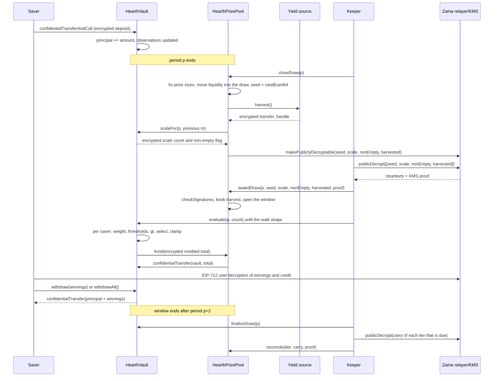

# Как проходит розыгрыш

Розыгрыш: это момент, когда доходность пула превращается в призы. Эта страница разбирает
весь процесс простыми словами, а затем показывает ту же историю схемой.

## Периоды

Время нарезано на равные периоды по `L` секунд. Период 1 начинается в `firstPeriodAt`,
метке времени, зафиксированной при развёртывании и больше никогда не менявшейся. Дальше
арифметика сводится к делению:

```
period(t)      = (t - firstPeriodAt) / L + 1
periodStart(p) = firstPeriodAt + (p - 1) * L
periodEnd(p)   = periodStart(p + 1)
```

У каждого пула свой `L`. На Sepolia пул USDC работает с периодом в один час, а остальные
шесть с периодом в шесть часов, чтобы посетитель увидел полный цикл за один заход. На
основной сети настоящее развёртывание использовало бы сутки, как это делает PoolTogether V5.
Период является аргументом конструктора, поэтому один и тот же код обслуживает все три
варианта, а шансы уровней каждого пула заданы относительно его собственного периода.
Смотрите [пулы и токены](pools-and-tokens.md).

Розыгрыш `p` относится к периоду `p`. Он полностью определяется балансами, которые
удерживались в течение периода `p`. Ничто из происходящего после конца периода `p` не может
изменить его исход.

## Окно и крайний срок закрытия

Каждый шаг розыгрыша `p` происходит в течение периодов `p+1` и `p+2`. Это и есть окно, и оно
заканчивается в `periodEnd(p + 2)`. Это два часа в пуле USDC и полсуток в остальных.

У закрытия срок жёстче, чем у остального окна:

```
closeDeadline(p) = periodStart(p + 2) + L / 2
```

Это середина второго периода окна, три четверти пути по окну. Закрытие после этой отметки
отклоняется.

Причина в том, что закрытие и присуждение не могут быть в одном блоке. Закрытие помечает
значения расшифровываемыми в блокчейне, открытые значения возвращаются от релеера Zama вне
блокчейна, а присуждение проверяет их в блокчейне. Закрытие в последние секунды окна не
оставило бы этому обходу места, куда приземлиться, и розыгрыш навсегда застрял бы в
состоянии `Closed`. Крайний срок гарантирует минимум полпериода на обход, присуждение и все
партии оценки.

Окно также ограничивает то, как далеко назад хранилище обязано помнить балансы, и именно это
позволяет обойтись тремя сохранёнными наблюдениями на вкладчика. Смотрите
[баланс, взвешенный по времени](time-weighted-balance.md).

## Пять шагов

Каждый шаг доступен всем. Любой может вызвать любой из них, включая вкладчика из приложения.
Кипер: это просто адрес, который обычно успевает первым.

### 1. Закрытие

`closeDraw(p)`, после того как период `p` закончился, и до `closeDeadline(p)`.

В одной этой транзакции происходят пять вещей, именно в таком порядке:

- **Фиксируются размеры призов.** Размер приза каждого уровня и ликвидность, которую он
  выставляет на этот розыгрыш, вычисляются из тех денег, которые уровень держит прямо
  сейчас, и эта ликвидность переходит в розыгрыш. Это происходит до того, как появится
  случайное зерно.
- **Вытягивается зерно.** `FHE.randEuint64()` выполняется внутри сопроцессора Zama, поэтому
  число существует только как шифротекст и его никто не видел.
- **Хранилище сообщает, где находится совокупный вес периода**, в виде одного маленького
  зашифрованного счётчика плюс зашифрованного флага о том, держал ли хоть кто-нибудь баланс
  вообще. Не сам совокупный вес и пока не в открытом виде. Смотрите следующий раздел.
- **С источника доходности собирается доход**, одним зашифрованным переводом в пул. Если
  источник откатывается, закрытие всё равно проходит: сбор считается тривиальным
  зашифрованным нулём и выпускается событие `HarvestFailed`. Сломанный источник доходности
  не может остановить часы.
- **Четыре хендла помечаются публично расшифровываемыми:** зерно, счётчик масштаба, флаг
  непустоты и сбор дохода. Это односторонний флаг в списке контроля доступа Zama. С этого
  момента любой может запросить у релеера их открытые значения, и флаг нельзя отозвать.
  Ничто другое в розыгрыше так не помечается никогда.

Состояние розыгрыша переходит в `Closed`. Закрытие проходит ровно один раз, и именно поэтому
перебросить зерно не может никто.

Порядок внутри транзакции и есть суть. Размеры призов фиксируются до того, как появится
зерно, поэтому никто не может увидеть появившееся зерно, понять, что выиграл, и затем
переставить деньги пула, чтобы этот выигрыш стоил больше.

### Что хранилище публикует вместо суммы

Суммарный баланс пула за период, взвешенный по времени, обозначаемый `W`, не публикуется
никогда. Публиковать его точно было замыслом до 3 сентября 2026 года, и разбор этот замысел
сломал: при публичном `W` за два подряд идущих периода и публичной метке времени
собственного депозита или вывода вкладчика точная сумма вкладчика, который единственный
двигал деньги в этом периоде, восстанавливается арифметикой. Не ограничивается, а
восстанавливается. Это описано в разделе
[что остаётся приватным](../security/what-stays-private.md).

Сейчас публикуется диапазон, в который попадает `W`: ближайшая степень двойки, равная ему или
превышающая его, обозначаемая `M = 2^m`. Хранилище отслеживает её под шифрованием. При каждом
закрытии оно сравнивает `W` с пятью степенями двойки вокруг `m` предыдущего розыгрыша,
складывает результаты в один маленький зашифрованный счётчик и помечает этот счётчик публично
расшифровываемым. Новое `m` пул вычисляет из проверенного счётчика. Отдельное зашифрованное
сравнение с единицей даёт флаг непустоты, который говорит, держал ли баланс хоть кто-нибудь.

Значит наблюдатель узнаёт из каждого розыгрыша ровно одно: пересёк ли пул степень двойки.
Между пересечениями он не узнаёт ничего нового. Каждый розыгрыш идёт против `M`, а не против
`W`, и именно поэтому описанные ниже количества призов складываются так, как складываются.

### 2. Присуждение

`awardDraw(p, seed, scaleCount, nonEmpty, harvested, proof)`.

Тот, кто вызывает эту функцию, забирает четыре открытых значения у релеера Zama, а тот
возвращает их с подписью службы управления ключами (KMS), то есть набора участников, которые
держат ключ расшифровки сети. Контракт проверяет эту подпись в блокчейне через
`FHE.checkSignatures`, прежде чем поверить хотя бы одному числу. Доказательство привязано к
хендлам в фиксированном порядке, `[seed, scaleCount, nonEmpty, harvested]`, поэтому четыре
значения нельзя перемешать или переиграть против другого розыгрыша.

Затем:

- Проверенный сбор дохода начисляется уровням по их долевым весам. Это единственный путь, по
  которому в систему попадают призовые деньги, и они попадают на уровни, а не в этот
  розыгрыш, поэтому предлагаются на следующем закрытии. Пул никогда не учитывает сумму, о
  которой источник доходности сообщил сам.
- Если флаг непустоты говорит, что в периоде `p` баланс не держал никто, розыгрыш помечается
  как `Empty`, а выставленная им ликвидность сразу возвращается на уровни.
- Иначе розыгрыш открывается. Зерно и диапазон `M` теперь являются публичными числами.
- Если к моменту присуждения окно уже закрылось, сбор дохода всё равно учитывается,
  выставленная ликвидность всё равно возвращается на уровни, а розыгрыш помечается как
  `Skipped`. Этот период не платит приз, при этом ни доходность, ни ликвидность не теряются.

Пять состояний розыгрыша: `None`, `Closed`, `Awarded`, `Empty` и `Skipped`.

**Именно в этот момент определяются победители.** С этого места зерно является публичным
числом, диапазон является публичным числом, и вес каждого вкладчика за период `p` больше
измениться не может. Пороги, которые должен превзойти каждый вкладчик, являются арифметикой
на публичных входных данных. Оценка, которая идёт следующей, ничего не решает. Она записывает
результат, который уже существует.

### 3. Оценка

`evaluate(p, count)` на хранилище, столько раз, сколько нужно, пока окно открыто.

Вызывающий говорит, на сколько вкладчиков продвинуться. Он не говорит, на каких. Хранилище
идёт по списку вкладчиков от курсора этого розыгрыша, который начинается с
`seed mod saverCount` и движется вперёд в порядке списка, обрабатывая до `count` вкладчиков и
не более `4` из тех, кто требует зашифрованной работы. Вкладчики, у которых нет наблюдения на
период `p` или раньше, имеют нулевой вес, и они пропускаются по своим открытым меткам времени
вообще без затрат на шифрование.

Для каждого вкладчика, до которого доходит обход, хранилище читает его зашифрованный вес за
период `p`, проводит проверку победителя против публичных порогов и прибавляет результат к
его зашифрованным выигрышам. Оно сохраняет зашифрованный вес и зашифрованное начисление этого
вкладчика за розыгрыш, и оба доступны только самому вкладчику, чтобы приложение могло
показать «вы выиграли X в розыгрыше p» и дать проверить сравнение. Затем оно вытягивает из
призового пула зашифрованную сумму, начисленную этой партией.

Никто не выбирает, кого оценивать и в каком порядке. Вкладчик, которому нужен собственный
результат, продвигает тот же самый обход, который продвигают все остальные, поэтому отправка
транзакции оценки не говорит ничего о том, выиграли ли вы. Точка старта смещается каждый
розыгрыш, потому что она берётся из зерна этого розыгрыша, так что ни один адрес не остаётся
в очереди последним навсегда.

`evaluate` откатывается для розыгрыша в состоянии `Empty`, `Skipped` или ещё не присуждённого.

### 4. Завершение

`finalizeDraw(p)`, после того как окно закрылось.

Всё, что уровень выставил и не выплатил, сворачивается в зашифрованный перенос этого уровня.
Перенос является накопительной суммой, которая остаётся зашифрованной и едет от розыгрыша к
розыгрышу. Он добавляется к выставленной ликвидности уровня при каждом закрытии, поэтому
невыплаченные деньги сразу снова в игре, хотя их размер по-прежнему секретен.

Завершение также публикует текущий хендл одного глобального зашифрованного счётчика всего,
что пул не смог профинансировать. При проверенных сборах дохода он всегда равен нулю.

### 5. Сверка

`reconcile(tier, carry, proof)` на пуле, по одному уровню за раз и только тогда, когда для
уровня подошёл срок.

Каждый уровень сверяется с частотой, заданной при развёртывании как `reconcileEvery[t]`
розыгрышей. На Sepolia срок наступает у каждого уровня каждый розыгрыш. Когда срок подошёл,
`finalizeDraw` помечает перенос уровня публично расшифровываемым и выпускает событие
`CarryPublished`. Любой забирает открытое значение, вызывает `reconcile` с доказательством
KMS, и проверенное число зачисляется обратно в открытую ликвидность этого уровня. Хранилище
вычитает то же число из переноса, который к этому моменту мог вырасти, и выпускается событие
`TierReconciled`.

Именно сверка делает публичным количество призов этого уровня, потому что перенос: это та
часть выставленного, которую никто не выиграл. При частоте, равной единице, количество по
каждому уровню становится публичным через один розыгрыш после того, к которому оно относится,
и весь котёл каждого уровня снова на виду, где приложение может показать, как он растёт.
Увеличение интервала прячет количество на соответствующее число розыгрышей, а вместе с ним
прячет и растущий котёл, и это тот самый компромисс, который разобран в разделе
[призы и уровни](prizes-and-tiers.md). Ни при каком варианте ничего не испаряется, и ни при
какой частоте вы не узнаете, кто выиграл.

## Что будет, если шаг так и не состоится

- **Закрытие так и не состоялось.** Розыгрыш остаётся в состоянии `None` и пропускается. Его
  ликвидность никуда не двигалась, поэтому остаётся на уровнях и выставляется в следующем
  розыгрыше. Сбор дохода забирает следующее закрытие.
- **Присуждение не состоялось внутри окна.** Позднее присуждение всё равно учитывает сбор
  дохода, всё равно возвращает выставленную ликвидность на уровни и помечает розыгрыш как
  `Skipped`.
- **Никто не проводит оценку.** Всё, что выставил каждый уровень, сворачивается в его перенос
  при завершении и возвращается на следующей сверке.

Ничто не застревает и ничто не теряется. Зависший кипер стоит пулу розыгрыша, а не денег.
Смотрите [страницу кипера](../operations/keeper.md).

## Деньги никогда не двигаются по отчёту

Обмануть учёт мешают два правила.

Доходность никогда не принимается на веру. Источник выполняет зашифрованный перевод в пул,
пул является получателем и поэтому имеет доступ к этому шифротексту, и только после этого пул
публикует его и учитывает открытое значение, проверенное KMS. Ошибочный или враждебный
источник доходности может отправить меньше, чем заявляет, но не может заставить пул поверить
в призовые деньги, которые так и не пришли. Это важно, потому что фантомная призовая
ликвидность в итоге была бы выплачена из чьей-то основной суммы.

Выплаты вытягиваются, а не проталкиваются. После каждой партии оценки хранилище выдаёт пулу
краткосрочное разрешение на зашифрованную сумму партии, пул выдаёт такое же разрешение
токену, и токен переводит ровно эту сумму из пула в хранилище. Если пулу не хватает,
хранилище записывает нехватку в глобальный зашифрованный счётчик непрофинансированного,
который публикуется при завершении, чтобы любой мог проверить. При проверенных сборах дохода
этот счётчик всегда равен нулю.

## Весь розыгрыш от начала до конца



## Что эта страница не разбирает

Она не разбирает, как складывается вес вкладчика за период, это
[баланс, взвешенный по времени](time-weighted-balance.md), ни арифметику проверки победителя,
это [выбор победителя](winner-selection.md), ни то, насколько велик каждый приз, это
[призы и уровни](prizes-and-tiers.md).
