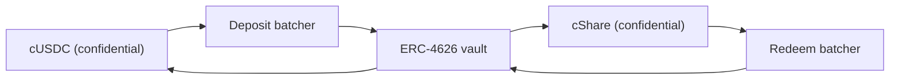

# Откуда берутся призовые деньги

Призы: это доходность. Ничья основная сумма никогда не выплачивается как приз, и именно это
делает пул беспроигрышным. Эта страница разбирает единственный интерфейс, который реализует
любой источник, источник, работающий сегодня на Sepolia, причину, по которой пул не верит
источнику на слово ни в чём, и то, как на основной сети подключается собственный
Confidential Vault от Zama.

## Интерфейс

```solidity
interface IYieldSource {
    function harvest() external returns (euint64 transferred); // confidential transfer to the recipient
    function harvestable() external view returns (uint64);      // display only
}
```

Две функции. `harvest` переводит накопленную доходность в призовой пул конфиденциальным
переводом и возвращает зашифрованную сумму, которая действительно перешла. `harvestable`
нужна для отображения в приложении, и пул никогда не использует её для учёта.

`harvest` синхронна намеренно. Она переводит то, что у источника готово в этот момент, и от
источника, зарабатывающего асинхронно, ожидается, что он подготовит эту сумму заранее, а не
заставит пул ждать.

Замена источника выполняется одним вызовом владельца на пуле, `setYieldSource`, и выпускает
событие `YieldSourceSet`. Больше ничто в системе не знает и не интересуется, какой источник
подключён.

Источник, который откатывается, розыгрыш не останавливает. Пул перехватывает сбой, считает
сбор этого розыгрыша тривиальным зашифрованным нулём и выпускает `HarvestFailed`. Закрытие
проходит, розыгрыш идёт на той ликвидности, которая уже есть на уровнях, а доходность, которая
не смогла перейти, забирается более поздним сбором. Сломанный или неверно подключённый
источник морит голодом призовую сторону, но не может остановить часы.

Когда сбор всё-таки состоялся, он учитывается при присуждении этого розыгрыша и выставляется
на следующем закрытии. Значит доходность периода `p` финансирует призы розыгрыша `p+1`, а не
розыгрыша `p`. Именно это позволяет фиксировать размеры призов до появления зерна.

## Sepolia: спонсируемый источник

`SponsoredYieldSource` работает на каждом живом пуле, по одному экземпляру, поэтому семь
источников являются семью отдельными балансами семи разных токенов. У пула USDC он находится
по адресу `0xCC49DF69eAB6884fD8DD9260902B8A0Abc9D6b91`; остальные шесть перечислены в разделе
[пулы и токены](pools-and-tokens.md).

Спонсор вызывает у источника его собственную функцию `sponsor` с публичным токеном пула.
Источник оборачивает его в конфиденциальный и учитывает ровно то, что выпустила обёртка, а не
то, что запросил спонсор. Дальше баланс поступает равномерно со скоростью `ratePerSecond`,
которая на пуле USDC равна `5,555 base units a second, which is 19.998 USDC a period`,
а `harvest` отправляет в пул всё, что накопилось. Скорость каждого пула задана в целых
токенах в час, чтобы два пула на разных часах можно было сравнить с одного взгляда, и каждое
спонсирование рассчитано более чем на восемьдесят розыгрышей.

Спонсирование является пожертвованием. Пути забрать его обратно у спонсора нет, а менять
скорость поступления может только владелец источника, и это выпускает событие `RateChanged`.

Суммы спонсирования, скорость поступления и каждый сбор дохода публичны. Это не уступка: в
PoolTogether объём доходности, который вносит хранилище, тоже публичен, и из него следует
каждый размер приза. Конфиденциальным в Hearth является то, кто сколько отложил и кто
выиграл, но никогда не то, сколько заработал пул.

Если у пула какое-то время нет вкладчиков, доходность всё равно накапливается и выплачивается
в первых же розыгрышах, где вкладчики есть. В пустом пуле ничто не застревает.

### Зачем вообще тестовый источник

Потому что тестовый источник честен только тогда, когда в документации сказано, как он
работает и как подключается настоящий, и то и другое ниже. Сначала мы искали настоящий, и на
Sepolia нет площадки, которая платит доходность на тестовые токены Zama:

| Площадка | Почему нет |
| --- | --- |
| Aave | Отказывает в депозитах USDC на Sepolia, превышен лимит предложения |
| Compound | Хочет собственный USDC от Circle, а не тестовый токен Zama |
| Confidential Vault от Zama | Хранилище на Sepolia является VaultV2 только для простоя, без адаптера доходности, и это собственное описание Zama |

Значит честными вариантами были выдуманное число, которое растёт, или спонсируемый баланс,
который действительно существует в блокчейне и действительно поступает равномерно. Мы взяли
второй. Каждая единица призовых денег на каждом из семи живых пулов была по-настоящему
обёрнута, по-настоящему переведена и по-настоящему проверена.

## Пул никогда не учитывает заявленное число

Это то правило, которое не даёт спонсируемому источнику стать слабым местом.

Источник выполняет зашифрованный перевод в пул. Пул как получатель имеет доступ к этому
шифротексту, поэтому может сам пометить переведённую сумму публично расшифровываемой. И
только в момент присуждения, после того как `FHE.checkSignatures` проверит подпись службы
управления ключами над открытым значением, пул начисляет что-либо уровням.

Источник, который лжёт о том, сколько отправил, не добьётся ничего. Пул учитывает ту сумму,
которая пришла, потому что только на неё он и смотрит.

Это не теоретическая осторожность. В нашей прежней схеме пул учитывал пополнения резерва по
той сумме, которую передал вызывающий, тогда как обёртка выпускает `amount / rate()`. На
живом развёртывании `rate()` случайно был равен 1, поэтому две величины совпадали и ошибка
дремала. На базовом токене с 18 знаками, где курс обёртки равен миллиону миллионов, пул
поверил бы в призовые деньги, которых в миллион миллионов раз больше, чем существует. Мы
выполнили это 2 сентября 2026 года против тестового токена с 18 знаками и увидели, как это
происходит. Фантомная призовая ликвидность в беспроигрышном пуле рано или поздно
выплачивается из чьей-то основной суммы, а это единственное обещание, которое продукт
нарушить не может. Проверка перевода снимает весь этот класс ошибок.

## Основная сеть: Confidential Vault от Zama

Zama выпускает протокол, вся работа которого состоит в зарабатывании доходности на
конфиденциальных балансах, и он является естественным источником для основной сети.
`ConfidentialVaultYieldSource` является адаптером в этой схеме. Далее идёт его спецификация,
а не контракт из этого репозитория.

Это один адаптер на пул, как и всё остальное здесь, и каждому нужны батчер и доходное
хранилище для его собственного токена. Развёртывание Zama в основной сети сегодня покрывает
USDC, поэтому Hearth в основной сети открыл бы пул USDC на Confidential Vault, а любой другой
токен на том источнике, который для него существует, или ни на каком.

Схема представляет собой батчер, стоящий между конфиденциальными токенами и обычным доходным
хранилищем ERC-4626. Хранилище ERC-4626 принимает только публичные переводы, поэтому
одинокий вкладчик опубликовал бы свою точную сумму. Батчер вместо этого собирает вместе много
зашифрованных депозитов, расшифровывает только сумму, делает один публичный депозит в
хранилище и раздаёт обратно конфиденциальные доли. Собственная формулировка Zama:
«Наблюдатели видят, кто участвовал, но не видят, сколько кто внёс».



Адаптер входит в батчер депозитов с конфиденциальным токеном пула и держит конфиденциальные
доли. Погашение идёт по своему расписанию, с опережением сбора: кипер периодически просит у
батчера погашения прирост и проводит этот запрос через его четыре стадии, чтобы к моменту,
когда пул в следующий раз вызовет `harvest`, погашенный конфиденциальный USDC уже лежал в
адаптере и сбор был обычным одиночным переводом. Так асинхронная площадка встречается с
синхронным интерфейсом. Каждая из четырёх стадий доступна всем, поэтому ждать оператора Zama,
чтобы их выполнить, никому не приходится.

### Адреса

Из собственного справочника адресов Zama, получено 2 сентября 2026 года.

**Основная сеть Ethereum, chain id 1.** Базовый актив USDC. Источник доходности: Morpho
«Steakhouse Confidential Prime USDC» VaultV2, ограниченный так, что батчер депозитов является
единственным вкладчиком хранилища.

| Контракт | Адрес |
| --- | --- |
| Батчер депозитов | `0x324EA89FD3784036673BfE6Ffee2334A088F40Cc` |
| Батчер погашения | `0x96Cd3Faa7483783Ac2Eb715f6333361500F1eec9` |
| Обёртка cUSDC | `0xe978F22157048E5DB8E5d07971376e86671672B2` |
| Обёртка cShare | `0x66Bf74E96900D1a19c7070D939D124f2F565C458` |
| Хранилище ERC-4626 | `0xbEEF00A59B577423653A1526c7009bdE103F542B` |
| USDC | `0xA0b86991c6218b36c1d19D4a2e9Eb0cE3606eB48` |

**Sepolia, chain id 11155111.** Тестовая среда: USDC является моком с публичной функцией
`mint`, а хранилище работает только на простой, без адаптера доходности.

| Контракт | Адрес |
| --- | --- |
| Батчер депозитов | `0x48758559c14d4d92b4C74A99660B6a8dbe85F53b` |
| Батчер погашения | `0xe94E9afdDd43a19C2914739e9279cb6Fe287BEb0` |
| Обёртка cUSDC | `0x7c5BF43B851c1dff1a4feE8dB225b87f2C223639` |
| Обёртка cShare | `0x7E93d5c150A2178B1fCde0278582Acf59478eA5f` |
| Хранилище ERC-4626 (простой) | `0x6AB54988261AEC573a2CA13cF802d3B1114f864C` |
| Mock USDC | `0x9b5Cd13b8eFbB58Dc25A05CF411D8056058aDFfF` |

Поскольку хранилище на Sepolia простаивает, адаптер здесь описан против опубликованного
интерфейса батчера Zama и пока не написан. Заявить, что он работает, когда он ничего не
зарабатывает, значило бы солгать, и любой проверил бы это за минуту.

### Что подключение означает на практике

Батчер движется четырьмя стадиями: вход, отправка, завершение, получение. Партия ждёт, пока
не достигнет минимального возраста, затем её сумма расшифровывается, затем хранилище
рассчитывается, затем участники забирают своё. Каждая из этих стадий доступна всем, поэтому
пул никогда не застревает в ожидании оператора Zama, а срок получения не истекает.

Этот ритм медленнее мгновенного поступления у спонсируемого источника, и поэтому кипер
проводит погашение заранее, а не внутри `harvest`. Контракт пула не ждёт никогда: он просит у
адаптера то, что уже забрано обратно. Настоящей работой для запуска этого в бой остаются сам
контракт адаптера, который этот репозиторий описывает, но не реализует, и сторона кипера:
решение о том, как часто начинать погашение и какую часть позиции гасить, а это вопрос
политики, не имеющий последствий в блокчейне, даже если решение запоздает.

### Что Hearth унаследовал бы

Назвать это как есть является частью честного отношения к вопросу.

- **Риск хранилища, целиком.** Батчер направляет деньги в стороннее хранилище ERC-4626. Если
  это хранилище потеряет в стоимости, доходный баланс пула потеряет вместе с ним. Это
  единственное место, где «отсутствие потерь» зависело бы от чужого контракта, и поэтому
  развёртывание в основной сети должно держать там только доходную часть.
- **Конфиденциальность партии, а не пула.** Батчер прячет суммы среди соучастников и
  расшифровывает итог. Если бы Hearth оказался единственным участником партии, сумма его
  депозита стала бы публичной. Нам это ничего не стоит, потому что сборы Hearth и так
  публикуются, но знать об этом стоит, прежде чем считать, что батчер прячет больше, чем на
  самом деле.
- **Ограниченные полномочия владельца.** Владелец батчера может менять минимальный возраст
  партии (не более 7 суток), крайний срок обратного вызова (не более 30 суток), допуск
  проскальзывания при депозите, а также ставить на паузу входы и отправки. Документация Zama
  утверждает, что владелец не может ни двигать, ни замораживать средства пользователей, не
  может подвергнуть исход цензуре, не может расшифровать чьи-либо суммы и не может обновить
  контракт. Защита от проскальзывания при погашении жёстко выключена, чтобы выходы работали
  даже во время просадки хранилища.

## Что эта страница не разбирает

Она не разбирает влияние источника доходности на таблицу утечек, это в разделе
[что остаётся приватным](../security/what-stays-private.md). Она не измеряет доходность
хранилища Morpho, это чужое число, и оно меняется ежедневно. И она не утверждает, что адаптер
работает: на Sepolia подключён спонсируемый источник, и карточка «Пул прямо сейчас» на панели
называет его.
