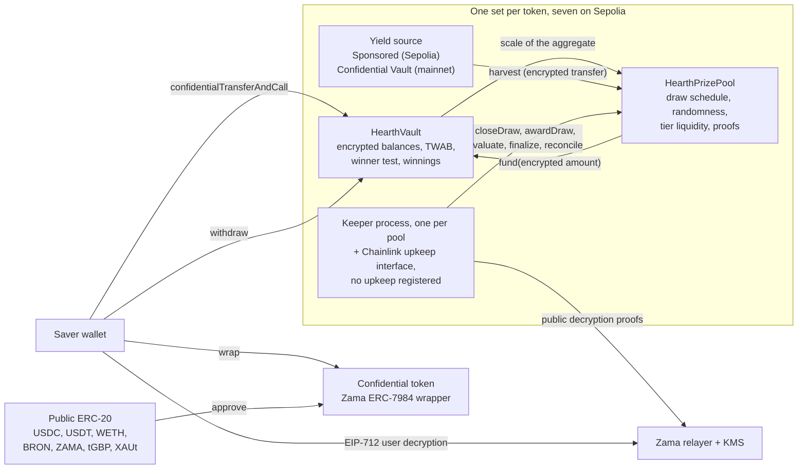

# Что такое Hearth

Hearth: это сберегательный пул, в котором нельзя потерять свои деньги и можно выиграть приз.
На Sepolia их работает семь, по одному на конфиденциальный токен, и токен вы выбираете так
же, как выбирали бы сберегательный счёт.

Вы кладёте конфиденциальный токен: USDC, USDT, WETH, BRON, ZAMA, tGBP или XAUt. Пул пускает
эти деньги в работу и зарабатывает доходность. Каждый
период заработанная пулом доходность раздаётся в виде призов, а ваш шанс на выигрыш
пропорционален тому, сколько вы держали и как долго. Основную сумму можно забрать в любой
момент и целиком. Это и есть идея «беспроигрышной лотереи», придуманная PoolTogether, а
Hearth: её конфиденциальная версия.

Отличие от PoolTogether в том, что в обычном блокчейне всё публично. Любой может прочитать,
сколько есть у каждого вкладчика, какие шансы у каждого кошелька и кто выиграл в каждом
розыгрыше. Это публикует чужое состояние и рисует мишень на любом крупном участнике. Hearth
проводит всю эту работу над зашифрованными числами с помощью протокола Zama, поэтому
блокчейн хранит ваш баланс как шифротекст (данные, нечитаемые без ключа), а контракт
всё равно выполняет над ним арифметику. Ваш баланс: число, которого никто никогда не видел,
включая нас, и при этом розыгрыш по-прежнему может проверить посторонний.

## Система на одной картинке

Работу делают два контракта. `HearthVault` хранит зашифрованную основную сумму каждого
вкладчика, его зашифрованные выигрыши, запись о том, сколько и как долго он держал, и
проводит проверку победителя. `HearthPrizePool` ведёт часы, вытягивает случайное зерно,
собирает доходность и держит призовые деньги на уровнях. Процесс кипера продвигает розыгрыш
вперёд, и любой его шаг вместо кипера может сделать кто угодно другой.

Блок в середине: это пул одного токена. Их семь, и они не делят между собой ничего: ваша
позиция в USDC и ваша позиция в WETH являются разными вкладчиками в разных хранилищах, а
если один пул затихнет, остальные продолжат работать. Какой пул перед вами, видно в первой
части адресной строки: `/app/usdc` или `/app/weth`. Полный список с адресами приведён в
разделе [пулы и токены](../concepts/pools-and-tokens.md).

## Четыре действия

Вкладчик делает четыре действия. Вот что делает каждое из них и что оно выдаёт.

### 1. Депозит

Вы отправляете конфиденциальный токен этого пула в его хранилище одной транзакцией. Сумма
передаётся как
хендл шифротекста, то есть как указатель на зашифрованное значение, а не само значение.
Хранилище прибавляет её к вашей зашифрованной основной сумме и обновляет запись о вашем
балансе во времени, ничего при этом не расшифровывая.

- Скрыто: сумма, ваш текущий баланс и, следовательно, ваша доля в пуле.
- Публично: ваш адрес, блок, в котором вы это сделали, и сам факт депозита.

Есть один шов. Превращение обычного публичного токена в конфиденциальный является публичным
переводом ERC-20, поэтому обёрнутая сумма видна. Если вы обернули 5 000 USDC и внесли
депозит двумя блоками позже, у наблюдателя есть очень хорошая догадка. Hearth держит
оборачивание и депозит двумя отдельными шагами именно для того, чтобы вы могли развести их
во времени. Смотрите [шов обёртки](../security/what-stays-private.md).

### 2. Розыгрыш

В конце каждого периода пул закрывает розыгрыш этого периода. В одной транзакции он
фиксирует размер приза на каждом уровне, затем вытягивает зашифрованное случайное зерно
внутри сопроцессора Zama, затем спрашивает у хранилища, насколько велик был пул, а затем
собирает доходность периода. Порядок важен: размеры призов фиксируются до того, как случайное
число появится, поэтому никто не может увидеть зерно и после этого переставить, сколько стоит
выигрыш.

«Насколько велик был пул» звучит нарочито расплывчато, и в этом весь замысел. Хранилище не
публикует суммарный баланс всех вкладчиков, взвешенный по времени. Оно публикует только
диапазон степени двойки, в который эта сумма попадает, поэтому мир узнаёт примерный размер
пула, а не точный. Публикация точного числа позволила бы вычесть один розыгрыш из соседнего и
прочитать в разнице депозит одинокого вкладчика.

Затем наружу выходят четыре небольших значения с доказательством, подписанным службой
управления ключами Zama, так что проверить их может любой: зерно, диапазон, был ли в пуле
вообще хоть кто-то, и собранная доходность. Результат каждого вкладчика в этом розыгрыше
зафиксирован в тот момент, когда эти числа проверены.

- Скрыто: вес каждого отдельного вкладчика, точная сумма пула и каждый отдельный результат.
- Публично: зерно, диапазон, собранная доходность, размер приза на каждом уровне и, одним
  розыгрышем позже, когда уровень сверяется, сколько призов он выплатил.

### 3. Получение приза

Транзакции получения приза не существует, и в этом весь смысл. Кнопка получения приза в
приложении есть: она на карточке розыгрыша во вкладке «Мои розыгрыши», и она несёт в себе
сумму. Это обычный вывод выигрышей, которые вы только что открыли, и в блокчейне он выглядит
ровно так же, как любой другой вывод.

Выигрыши начисляются на отдельный зашифрованный баланс внутри хранилища, пока идёт оценка
розыгрыша. Никакое ваше действие этого не запускает и никакое ваше действие этого не
раскрывает. Чтобы узнать, выиграли ли вы, вы подписываете сообщение EIP-712, то есть
типизированную подпись вне блокчейна, доказывающую, что адрес ваш, и релеер Zama возвращает в
ваш браузер открытое значение ваших собственных выигрышей. Эта подпись никогда не попадает в
блокчейн, поэтому она ничего не стоит и не оставляет следа. У баланса на панели и у
результата розыгрыша свои глазки, оба могут быть открыты одновременно, и подпись, сделанная
для первого, годится и для второго.

- Скрыто: всё. Чтение собственных выигрышей происходит вне блокчейна.
- Публично: ничего.

В большинстве призовых протоколов победитель обязан отправить транзакцию получения приза, а
проигравшему это не нужно, поэтому список транзакций тихо называет победителей. В Hearth
такой транзакции просто нет. Транзакцию, которая начисляет призы, `evaluate`, нельзя навести
на себя: она проходит по списку вкладчиков с точки, которую задаёт зерно самого розыгрыша, а
вызывающий указывает только то, насколько далеко её продвинуть.

### 4. Вывод

Деньги выводит одна функция: `withdraw`. Она платит сначала из ваших выигрышей, затем из
основной суммы, и ограничивает выплату меньшим из того, что есть у вас, и того, что есть у
хранилища. Забираете ли вы приз, уносите ли домой сбережения или делаете и то и другое сразу,
это один и тот же вызов той же формы, то же событие и зашифрованная сумма.

Вторая половина этого ограничения нужна потому, что конфиденциальный перевод переводит либо
всю сумму, либо ничего. Он никогда не отправляет часть запрошенного. Поэтому хранилище
считает, сколько оно на самом деле может заплатить, до того как просит токен заплатить, а не
пытается залатать нехватку задним числом.

- Скрыто: сумма и то, была ли какая-то её часть призовыми деньгами.
- Публично: ваш адрес, блок и сам факт вывода.

Ваша основная сумма никогда не заблокирована. Депозиты и выводы остаются открытыми, пока идёт
розыгрыш, чего нельзя сказать о нескольких других схемах в этой области.

## Что делает всё честным

Две вещи, и обе может проверить посторонний без всякого особого доступа.

Случайное зерно приходит из `FHE.randEuint64` и генерируется внутри сопроцессора Zama из
публичного зерна под ключом FHE сети. Его нельзя предсказать и нельзя вытянуть дважды:
закрытие розыгрыша проходит ровно один раз. Как только период закончился, пул публикует это
зерно вместе с диапазоном, в который попала сумма пула, и оба несут доказательство, которое
контракт проверяет в блокчейне.

Из этих двух публичных чисел любой может пересчитать точный порог, который любой адрес должен
был превзойти на любом уровне, а хранилище выставляет ту же арифметику как view, чтобы никому
не приходилось доверять чужой перереализации. Чего сделать нельзя, так это увидеть
зашифрованный вес, с которым порог сравнивали. Правило публично и проверяемо, приватен только
вход. Подробности в разделе
[случайность и проверка](../security/randomness-and-verification.md).

## Что Hearth не скрывает

Коротко, а полностью в разделе [что остаётся приватным](../security/what-stays-private.md):

- Кто такие вкладчики и когда каждый из них внёс депозит, вывел деньги или был оценён.
- Диапазон, в который попала сумма пула в каждом периоде, зерно и собранную доходность.
- Размер приза на каждом уровне и число выплаченных призов, публикуемое одним розыгрышем
  позже.
- Сумму, которую вы обернули в конфиденциальный токен или развернули обратно.
- При одном вкладчике опубликованный диапазон равен весу этого вкладчика с точностью до
  двух раз. При двух каждый может ограничить другого. Приватности здесь нужны три вкладчика
  или больше, и приложение об этом говорит.
- Пороги публичны, поэтому любой, кто может закрепить ваш баланс, может вычислить ваш
  результат в каждом розыгрыше. Обычно это происходит через оборачивание и депозит той же
  суммы несколькими минутами позже, и именно поэтому приложение держит эти шаги порознь.
- Полное оборачивание на входе и разворачивание на выходе публикуют нижнюю границу всего, что
  вы когда-либо выиграли, потому что оба движения публичны на уровне токена.
- Вкладчик, который выводит деньги сразу после каждого выигранного розыгрыша, своим
  поведением создаёт статистическую подсказку. Этого не исправит никакой контракт.
