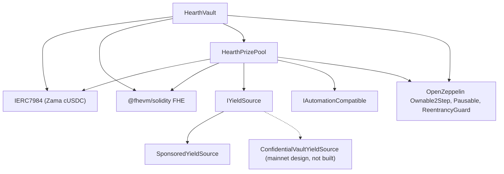

# Развёртывание

Один повторяемый скрипт, никаких ручных нажатий. Эта страница описывает порядок, параметры и
смысл каждого из них, чтобы проверяющий мог прочитать аргументы конструктора в развёрнутом
контракте и убедиться, что они сходятся.

Hearth разворачивает по одному пулу на конфиденциальный токен: хранилище, призовой пул и
источник доходности на каждый токен, и ни один из них не делит ничего с другими пулами. Один
прогон открывает один пул, потому что один nonce развёртывающего проводит одно развёртывание, а
токен выбирается переменной `HEARTH_TOKEN`. Все последующие задачи принимают `--token`:

```
cd packages/contracts
HEARTH_TOKEN=weth npx hardhat deploy --network sepolia
npx hardhat hearth:verify  --network sepolia --token weth
npx hardhat hearth:seed    --network sepolia --token weth
npx hardhat hearth:status  --network sepolia --token weth
```

Опустите и то и другое, и вы получите `usdc`, токен сети по умолчанию. Неизвестный слаг даёт
ошибку со списком пулов, которые в этой сети действительно есть. Параметры каждого пула лежат в
одном файле, `packages/contracts/hearth.config.ts`: пара активов, период, набор уровней,
стартовый диапазон, скорость поступления, спонсирование, пять демонстрационных вкладов и индекс
аккаунта, с которого подписывает его кипер. Читайте этот файл рядом с таблицами ниже; там те же
числа.

Развёртывание переиспользует любой контракт, у которого уже есть сохранённая запись о
развёртывании, а не заменяет его, поэтому второй прогон ничего не делает. Живой пул, который
держит деньги вкладчиков и историю розыгрышей за несколько суток, невозможно перенести на новый
адрес повторным запуском скрипта. Чтобы заменить его намеренно, сначала удалите его файл в
`deployments/<network>/`.

Скрипт пишет `deployments/sepolia/hearth.<slug>.json`, и именно на этот файл направляют кипера
через `HEARTH_ADDRESSES_FILE` и именно из него порождается список пулов в приложении.

## Что от чего зависит



Сплошные линии ведут к контрактам из этого репозитория. Пунктирный узел является путём
доходности для основной сети: адаптер описан против опубликованного интерфейса батчера Zama, и
контракт адаптера здесь не написан, поэтому ниже разворачивается только
`SponsoredYieldSource`.

Хранилищу и пулу нужен каждый из них другому, поэтому одна из двух связей создаётся после
развёртывания, а не в конструкторе. Именно поэтому шагов ниже пять, а не три.

## Порядок

| Шаг | Действие | Почему здесь |
| --- | --- | --- |
| 1 | Развернуть `HearthVault` | Оно держит деньги вкладчиков, и для его существования нужен только токен. |
| 2 | Развернуть `HearthPrizePool` с указанием на хранилище | Пул читает часы хранилища и его счётчик масштаба, а также платит хранилищу. |
| 3 | Связать: `vault.setPrizePool(pool)` | Выпускает `PrizePoolSet`. Хранилище будет принимать финансирование только с этого адреса. |
| 4 | Развернуть источник доходности с указанием пула получателем | Он обязан знать, куда отправлять сборы дохода. |
| 5 | Связать: `pool.setYieldSource(source)` | Выпускает `YieldSourceSet`. Пока этого не произошло, закрытие ничего не собирает и выпускает `HarvestFailed`. |

После шага 5 наполните пул: `hearth:seed --token <slug>` спонсирует источник доходности, чтобы
призы существовали, и заводит пять демонстрационных вкладчиков разного размера с аккаунтов со
2 по 6, чтобы первый посетитель попадал в наполненный пул, а не в пустой. Каждый её шаг
сверяется с блокчейном на предмет уже сделанного, поэтому наполнение, прерванное сбоем
релеера, безопасно запустить снова.

Киперу этого пула тоже нужен собственный Sepolia ETH, как и пяти демонстрационным вкладчикам:

```
npx hardhat hearth:spread-gas --network sepolia --token weth
npx hardhat hearth:spread-gas --network sepolia --keepers 10,11,12,13,14,15 --savers false
```

Первая команда финансирует кипера одного пула и вкладчиков; вторая финансирует несколько
аккаунтов киперов за один проход, а это то, что нужно при открытии шести пулов сразу.

Затем направьте приложение на то, что было развёрнуто:

```
cd ../web
node scripts/sync-pools.mjs
```

## Параметры

```
HearthVault(IERC7984 asset, uint256 periodLength, uint256 firstPeriodAt, address owner)
HearthPrizePool(IHearthVault vault, IERC7984 asset, Tier[3] tiers, uint8 initialScaleBits, address owner)
    Tier = { uint32 prizeCount; uint64 oddsNumerator; uint64 oddsDenominator; uint16 shares; uint16 reconcileEvery }
SponsoredYieldSource(IERC7984ERC20Wrapper asset, address recipient, uint64 ratePerSecond, address owner)
```

### HearthVault

| Параметр | Смысл | Что будет при ошибке |
| --- | --- | --- |
| `asset` | Конфиденциальный токен ERC-7984, который вносят вкладчики, один из семи токенов Zama. | Каждая обёртка показывает шесть знаков после запятой, и развёртывание отказывается продолжать, если блокчейн расходится с конфигурацией. Курс к публичному токену под ней равен 1 не в каждом пуле: на моке WETH с 18 знаками он равен миллиону миллионов, поэтому всё, что читает публичный токен, обязано его применять. |
| `periodLength` (`L`) | Секунд в периоде. Неизменяемо. | Задаёт также предел на вкладчика, `(2^64 - 1) / L`. Слишком маленькое `L`, и предел огромен, но розыгрыши шумные; слишком большое, и предел сжимается. |
| `firstPeriodAt` | Метка времени начала периода 1. Неизменяемо и должно быть не позже развёртывания. | Значение в будущем делает `period(now)` неопределённым, пока оно не наступит. |
| `owner` | Владелец с передачей в два шага. Отказ от владения отключён. | Полномочия перечислены в [модели угроз](../security/threat-model.md). |

`maxPrincipal` выводится из `periodLength`, а не задаётся. При часе это примерно 5 миллиардов
токенов, при шести часах примерно 854 миллиона, при сутках примерно 213 миллионов.

Хранилище владеет часами. Пул принимает адрес хранилища и читает периоды из него, поэтому у
двух контрактов нет никакой возможности разойтись во мнении о том, какой сейчас период.

### HearthPrizePool

| Параметр | Смысл |
| --- | --- |
| `vault` | Хранилище, которое обслуживает этот пул, и часы, которые он читает. |
| `asset` | Тот же конфиденциальный токен, который использует хранилище. Они обязаны совпадать. |
| `prizeCount[t]` | Призов за розыгрыш на уровне `t`. |
| `oddsNumerator[t]`, `oddsDenominator[t]` | Шансы уровня в виде дроби, один розыгрыш из `oddsDenominator / oddsNumerator`. |
| `shares[t]` | Доля уровня в каждом сборе дохода. Доли относительны, поэтому 40/20/40 и 2/1/2 означают одно и то же. |
| `reconcileEvery[t]` | Сколько розыгрышей проходит между публикациями переноса этого уровня. |
| `initialScaleBits` | Ожидаемая битовая длина суммарного веса первого периода, стартовая догадка для трекера диапазона. |
| `owner` | Как выше. |

`UTILISATION` является константой, а не аргументом: 50 процентов, вслед за PoolTogether V5.
Это та доля открытой ликвидности уровня, из которой считается размер каждого приза.

Два из этих параметров заслуживают отдельного слова.

`reconcileEvery` является настройкой приватности, а не газа, и торгуется против того, как
выглядит призовой котёл. Публикация переноса уровня делает публичным количество призов этого
уровня, а количество за один розыгрыш указывает на небольшой набор вкладчиков, имевших право в
этом розыгрыше. Более высокое значение размазывает количество по промежутку, в котором право
имели почти все хоть в какой-то момент. Ценой этого является видимый джекпот: закрытие
переносит всю публичную ликвидность уровня в розыгрыш, и она возвращается только на сверке,
поэтому уровень с частотой 24 в 23 розыгрышах из 24 публикует приз, рассчитанный от доли сбора
одного розыгрыша, а накопленный котёл виден только в розыгрыше со сверкой. Деньги всё это время
выставлены и могут быть выиграны, лёжа в зашифрованном переносе; они просто невидимы. Sepolia
по этой причине держит все три уровня на 1 и заявляет количество за розыгрыш как остаток.
Смотрите ограничение 14.

`initialScaleBits` достаточно задать примерно. Трекер сравнивает настоящую сумму с пятью
степенями двойки вокруг текущей догадки при каждом закрытии и исправляет себя со скоростью до
трёх бит за розыгрыш, поэтому догадка, ошибающаяся на несколько бит, стоит одного или двух
розыгрышей со слегка сбитым масштабом шансов, а затем всё устаканивается.

### SponsoredYieldSource

| Параметр | Смысл |
| --- | --- |
| `asset` | Обёртка ERC-7984, которую он держит и отправляет. Публичный токен, которым платят спонсоры, является базовым токеном самой обёртки, поэтому отдельным аргументом он не идёт. |
| `recipient` | Призовой пул, который получает сборы дохода. |
| `ratePerSecond` | Насколько быстро спонсируемый баланс поступает наружу как доходность. |
| `owner` | Задаёт скорость, выпуская `RateChanged`. |

Спонсирование является отдельным вызовом после развёртывания, а не аргументом конструктора. Оно
учитывает ровно то, что выпустила обёртка, а не то, что запросил спонсор, и его нельзя
отменить.

## Три набора параметров

Sepolia использует два из них, потому что пулы работают на двух часах.

| Настройка | Sepolia `usdc` | Sepolia, остальные шесть | Основная сеть, кандидат |
| --- | --- | --- | --- |
| Длина периода | 1 час | 6 часов | 1 сутки |
| Окно | 2 часа (два периода) | 12 часов | 2 суток |
| Крайний срок закрытия | Через 1 час 30 минут после конца периода | Через 9 часов | Через 1 сутки 12 часов |
| Предел на вкладчика | Около 5 миллиардов токенов | Около 854 миллионов | Около 213 миллионов |
| Главный уровень | число 1, шансы 1/24, доли 40, сверка каждый розыгрыш | число 1, шансы 1/4, доли 40, сверка каждый розыгрыш | число 1, шансы 1/30, доли 50, сверка каждый розыгрыш |
| Средний уровень | число 1, шансы 1/6, доли 20, сверка каждый розыгрыш | число 1, шансы 1/2, доли 20, сверка каждый розыгрыш | число 1, шансы 1/7, доли 25, сверка каждый розыгрыш |
| Частый уровень | число 4, шансы 1, доли 40, сверка каждый розыгрыш | число 4, шансы 1, доли 40, сверка каждый розыгрыш | число 4, шансы 1, доли 25, сверка каждый розыгрыш |
| Использование | 50 процентов | 50 процентов | 50 процентов |
| Источник доходности | `SponsoredYieldSource` | `SponsoredYieldSource` | `ConfidentialVaultYieldSource` поверх батчера Zama |
| Главный приз срабатывает | Примерно раз в сутки | Примерно раз в сутки | Определяется выбранными шансами |

Числа для Sepolia существуют для того, чтобы посетитель увидел полный цикл за один заход:
четыре мелких приза в каждом розыгрыше и главный приз примерно раз в сутки на обоих часах. Это
не то, что использовало бы настоящее развёртывание.

Почему двое часов. Розыгрыш при пяти вкладчиках стоит `8,456,388` газа, поэтому семь пулов с
ежечасным розыгрышем тратили бы на Sepolia около `1.43 ETH` в сутки, а публичные краны за этим
не поспевают. Шесть часов сокращают это до четырёх розыгрышей в сутки на пул, примерно
`0.41 ETH` в сутки на все семь. Шансы заданы относительно собственного периода каждого пула, а
не перенесены как есть, и поэтому в среднем столбце стоят 1/4 и 1/2 там, где в первом стоят
1/24 и 1/6, и поэтому главный приз в обоих случаях выпадает примерно раз в сутки. Пул USDC
сохранил свои часовые часы, потому что был развёрнут первым и его история розыгрышей записана
под ними.

Столбец для основной сети является кандидатом, а не развёртыванием. Правило его заполнения то
же, по которому получился столбец Sepolia: выберите, сколько розыгрышей должно проходить между
главными призами, и задайте шансы главного уровня как единицу, делённую на это число, затем
задайте доли так, чтобы получившиеся размеры призов выглядели разумно против доходности,
которую источник действительно зарабатывает, а затем определите частоту сверок каждого уровня,
взвесив количество призов, которое никого не называет, против котла, за ростом которого
вкладчики могут наблюдать. Sepolia выбрала второе; развёртывание в основной сети может выбрать
первое, а абзац выше говорит, чего стоит каждая сторона. Суточный период
с шансами главного уровня 1 к 365 даёт годовой главный приз, а это та форма, которую
использует V5.

## Развёрнутые адреса

Семь пулов на Sepolia, каждый контракт верифицирован на Etherscan. Пара токенов, которую
держит каждый из них, принадлежит Zama и перечислена в разделе
[пулы и токены](../concepts/pools-and-tokens.md) вместе со стартовыми вкладами и скоростью
поступления по каждому пулу.

| Пул | HearthVault | HearthPrizePool | SponsoredYieldSource | Развёрнут в блоке |
| --- | --- | --- | --- | --- |
| `usdc` | `0x0F93e5db6027b4FB1C76566d24aA2D2E417fAF52` | `0xA0785AacF30B6FE46EDc53CD8A9db1d94FeF5Df2` | `0xCC49DF69eAB6884fD8DD9260902B8A0Abc9D6b91` | `11622398` |
| `usdt` | `0xe54F44dE64F8A7abc0647eaae547dD59ce0EFfac` | `0x6a83Beb2Dc3f258107Cad5e17BC57657fAd4fbd1` | `0x5bb1Cd5380Cb9f2B15569030fF0dB7a445cF54cA` | `11641314` |
| `weth` | `0x3D1A182782B68fE270A66294C9adaC7F005c4f14` | `0x1a11e7C689F244fA8Dd5f4abA8F2F3131090cc1C` | `0x40DF298f15c6136294eC651aD7b0c1C6F221DE8F` | `11641366` |
| `bron` | `0x18086DC8271f8A73c5Ea985fd519527Dbb991279` | `0x2Ed982979CD184494B947a1E38E597494a38ACe4` | `0x0cD1155D752bD81b3a437a6f0B3965CAA2A1C8e9` | `11641408` |
| `zama` | `0xEEC26386F273c6678cA538AcA18e1d9384eA9F09` | `0x873B285404199D46325a294Aa0EC7a79C30A7fF7` | `0xdD352D70311E834ab75307f53d5C276060081d23` | `11641447` |
| `tgbp` | `0xCe95dAa01f5354aA8887A5952E403D26d452c323` | `0xC531D54ee2c695e0eBfe8b8258e9Fd80fd507095` | `0xDEa2BD6351072F735B6ea83c357bF157d83c01af` | `11641484` |
| `xaut` | `0x77f701101d66FbD522A3bFdC2c00DB09a4F57daE` | `0x9a2888aca42c707A3BC0D561FdF6ff8Abfda5201` | `0x03fDdAA7C4323C53CE511CC49D4c33B26B492af7` | `11641523` |

Начало первого периода: `1788386400 (2 September 2026, 22:00:00 UTC)` для `usdc`,
`1788620400 (5 September 2026, 15:00:00 UTC)` для `usdt` и
`1788624000 (5 September 2026, 16:00:00 UTC)` для остальных пяти. `firstPeriodAt` неизменяемо
и должно быть не позже блока развёртывания, поэтому развёртывание читает собственные часы
блокчейна и округляет вниз до начала часа, а не берёт часы машины.

## Верификация

Верификация является частью развёртывания, а не запоздалой мыслью. Проверяющему, который не
может прочитать развёрнутый исходный код, приходится верить нам на слово во всей этой
документации.

1. Верифицируйте все три контракта этого пула на Etherscan с аргументами конструктора,
   записанными скриптом развёртывания: `hearth:verify --token <slug>` делает это контракт за
   контрактом и сообщает, какие уже были верифицированы.
2. Проверьте, что верифицированные аргументы конструктора сходятся с таблицами параметров
   выше. В частности, что пулу передали его собственное хранилище и тот же `asset` и что набор
   уровней совпадает со столбцом для часов этого пула.
3. Проверьте, что `vault.prizePool()` является призовым пулом этого пула, а
   `pool.yieldSource()` является его источником, и что ни один из них не указывает на
   контракты другого пула.
4. Проверьте токен: `asset` должен быть конфиденциальной обёрткой этого пула из
   опубликованного списка Zama для Sepolia, а `underlying()` должен быть публичным моком под
   ней. `rate()` обёртки равен 1 только там, где у публичного токена тоже шесть знаков после
   запятой; на пуле WETH он равен миллиону миллионов, а курс, отличный от 1, меняет смысл
   базовой единицы для всего, что касается публичного токена.
5. Прочитайте `pool.scaleBits()` после нескольких розыгрышей и проверьте, что значение
   устоялось рядом с битовой длиной, которую подразумевает настоящий размер пула. Трекер,
   застрявший далеко от неё, означал бы, что стартовая догадка была дико неверной и коррекция
   ещё не догнала.

## Секреты

Ничто чувствительное никогда не зашивается в код. Развёртывание читает из файла `.env`, а
`.env.example` перечисляет каждый ключ с комментарием о том, откуда берётся его значение. Ключ
развёртывающего и ключ кипера являются разными аккаунтами, поэтому у горячего ключа кипера нет
никаких полномочий владельца.

## Хостинг приложения

Приложение является пакетом Next.js внутри рабочего пространства, а не корнем репозитория, и
именно эту настройку большинство хостингов делает неправильно.

| Настройка | Значение | Почему |
| --- | --- | --- |
| Пресет фреймворка | Next.js | Определяется из `packages/web/package.json` |
| Корневая директория | `packages/web` | Приложение живёт в рабочем пространстве npm |
| Включать исходники за пределами корневой директории | Включено | Зависимости подняты в корень репозитория, и сборке нужны корневой `package.json` и файл блокировки |
| Команда установки | по умолчанию, `npm install` | Выполняется в корне репозитория и ставит всё рабочее пространство |
| Команда сборки | по умолчанию, `next build` | При заданной корневой директории она выполняется внутри `packages/web` |
| Директория вывода | по умолчанию, `.next` | Смотрите предупреждение ниже |
| Версия Node | 20 или новее | Корневой `package.json` задаёт `engines.node` |

Не задавайте `NEXT_DIST_DIR` в среде хостинга. `packages/web/next.config.ts` читает эту
переменную и переносит вывод сборки, когда она задана. Она существует для того, чтобы локальная
проверочная сборка не дралась с работающим сервером разработки за одну и ту же директорию
`.next`. В сборке на хостинге она унесла бы вывод оттуда, где его ищет хостинг, и
развёртывание упало бы без всякой очевидной причины.

### Переменные окружения

| Переменная | Публична в браузере | Откуда берётся значение |
| --- | --- | --- |
| `SEPOLIA_RPC_URL` | Нет | Ваша собственная точка доступа Sepolia. Лендинг и маршрут `/api/activity` читают блокчейн на сервере, поэтому эта переменная никогда не попадает в браузер. Запросам логов она нужна, потому что бесплатный публичный узел ограничивает диапазоны `eth_getLogs` намного ниже суток блоков |
| `NEXT_PUBLIC_SEPOLIA_RPC_URL` | Да | Необязательная. Чтения кошелька используют её, а при её отсутствии откатываются на `https://ethereum-sepolia-rpc.publicnode.com`. Она видна в бандле, поэтому должна быть такой, которую вам не жалко опубликовать |
| `NEXT_PUBLIC_CHAIN_ID` | Да | `11155111` для Ethereum Sepolia. Приложение подставляет это значение по умолчанию |
| `NEXT_PUBLIC_WALLETCONNECT_PROJECT_ID` | Да | Необязательная и бесплатная в панели Reown по адресу https://dashboard.reown.com. Задайте её, и на каждом экране подключения рядом с браузерным расширением появится «Сканировать телефоном», а это и есть вход для кошелька на телефоне и для машины без расширения. Если оставить пустой, коннектор вообще не собирается, поэтому никому не предлагают кнопку, которая падает ровно в тот момент, когда он сканирует |

Ни один адрес контракта больше не является переменной окружения. Приложение читает каждый пул
из `packages/web/src/lib/chain/pools.json`, который `node scripts/sync-pools.mjs` порождает из
файлов адресов, записанных скриптом развёртывания, поэтому адрес, который показывает
приложение, всегда прослеживается до записи о развёртывании, а не до чего-то, что кто-то
набрал руками. Запускайте этот скрипт после каждого развёртывания и коммитьте результат. Трёх
публичных переменных, которые раньше держали адреса хранилища, призового пула и источника
доходности одного пула, больше нет; удалите их из любой среды, где они ещё заданы, потому что
их никто не читает.

Конфиденциальный актив и его базовый ERC-20 тоже читаются из хранилища и обёртки в блокчейне,
поэтому приложение не может общаться с токеном, который хранилище отвергло бы.

### После первого развёртывания

1. Откройте боевой адрес на телефоне. Каждая страница обязана работать при ширине 375
   пикселей.
2. Подключите кошелёк в сети Sepolia и пройдите двухминутный маршрут из README на
   развёрнутом сайте, а не на localhost.
3. Откройте `/verify?pool=<slug>` и вставьте адрес вкладчика. Пороги приходят из вызова
   контракта, поэтому если они отрисовались, значит развёрнутое приложение разговаривает с
   развёрнутым хранилищем этого пула.
4. Откройте список выбора пула и проверьте, что каждый слаг загружает свою панель и что токен
   с ограничением показывает страницу отказа, а не сломанный экран.

---

## Что эта страница не разбирает

Она не разбирает работу пулов после развёртывания, это [кипер](keeper.md), и один процесс
кипера на пул относится к той же странице. Она не разбирает операционную готовность для
основной сети: адаптер Confidential Vault описан против опубликованного интерфейса батчера
Zama и в этом репозитории не реализован, а его запуск в бой описан в разделе
[источник доходности](../concepts/yield-source.md).
