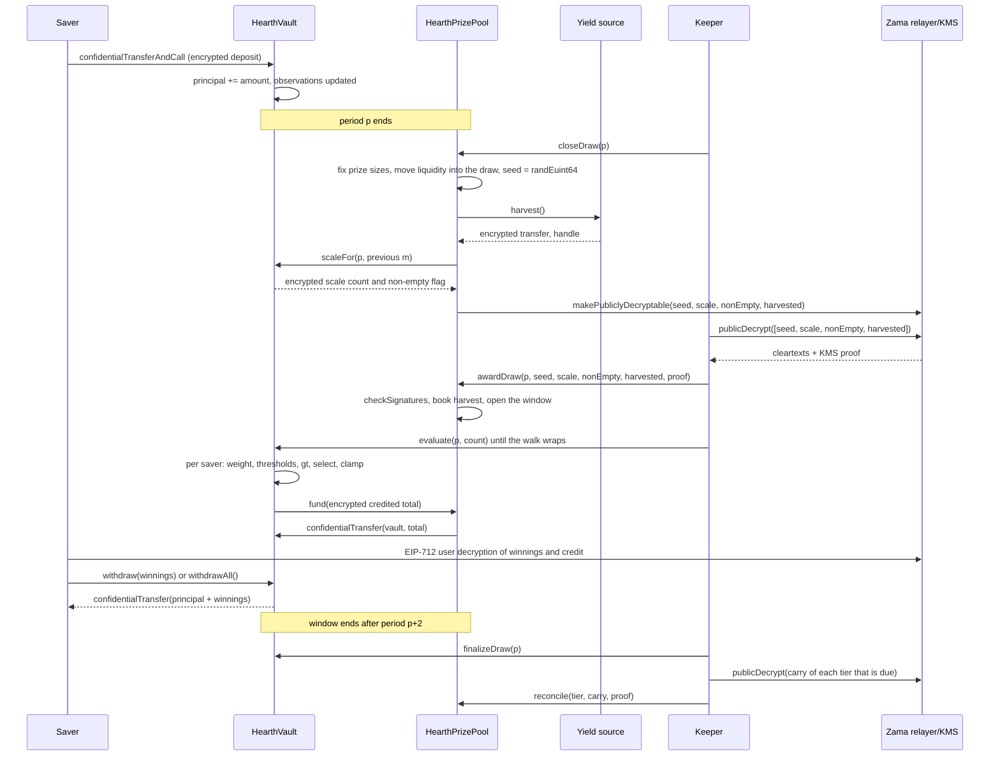

# ஒரு குலுக்கல் எப்படி நடக்கிறது

பூலின் வருவாய் பரிசுகளாக மாறும் தருணமே ஒரு குலுக்கல். இந்தப் பக்கம் முழுச் செயல்பாட்டையும் எளிய
வார்த்தைகளில் நடத்திக் காட்டுகிறது, பிறகு அதே கதையை ஒரு படமாகவும் காட்டுகிறது.

## காலகட்டங்கள்

நேரம் `L` வினாடிகள் கொண்ட சமமான காலகட்டங்களாக வெட்டப்படுகிறது. காலகட்டம் 1, `firstPeriodAt` இல்
தொடங்குகிறது. அது டெப்ளாய்மென்ட்டில் நிர்ணயிக்கப்பட்டு அதன்பிறகு ஒருபோதும் மாற்றப்படாத ஒரு நேர முத்திரை.
அங்கிருந்து கணக்கீடு வெறும் வகுத்தல்:

```
period(t)      = (t - firstPeriodAt) / L + 1
periodStart(p) = firstPeriodAt + (p - 1) * L
periodEnd(p)   = periodStart(p + 1)
```

ஒவ்வொரு பூலுக்கும் அதற்கே உரிய `L` உண்டு. Sepolia இல் USDC பூல் ஒரு மணி நேரமும் மற்ற ஆறும் ஆறு மணி
நேரமும் இயங்குகின்றன, அதனால் ஒரு பார்வையாளர் ஒரே அமர்வில் முழுச் சுழற்சியைப் பார்க்கிறார். மெயின்நெட்டில்
ஒரு நிஜமான டெப்ளாய்மென்ட் ஒரு நாளைப் பயன்படுத்தும், PoolTogether V5 பயன்படுத்துவதும் அதுவே. காலகட்டம்
ஒரு கன்ஸ்ட்ரக்டர் வாதம், எனவே ஒரே குறியீடே மூன்றுக்கும் பயன்படுகிறது, ஒவ்வொரு பூலின் அடுக்கு வாய்ப்புகளும்
அதன் சொந்தக் காலகட்டத்துக்கு எதிராக நிர்ணயிக்கப்படுகின்றன. [பூல்களும் டோக்கன்களும்](pools-and-tokens.md)
பார்க்கவும்.

குலுக்கல் `p` என்பது காலகட்டம் `p` ஐ உள்ளடக்கியது. காலகட்டம் `p` இல் வைத்திருந்த இருப்புகளால் மட்டுமே
அது முழுமையாகத் தீர்மானிக்கப்படுகிறது. காலகட்டம் `p` முடிந்த பிறகு நடப்பது எதுவும் அதன் முடிவை மாற்ற
முடியாது.

## சாளரமும், மூடுவதற்கான கெடுவும்

குலுக்கல் `p` இன் ஒவ்வொரு படியும் காலகட்டங்கள் `p+1` மற்றும் `p+2` இல் நடக்கிறது. அதுதான் கால சாளரம், அது
`periodEnd(p + 2)` இல் முடிகிறது. USDC பூலில் அது இரு மணி நேரம், மற்றவற்றில் அரை நாள்.

மற்ற சாளரத்தை விட மூடுவதற்கு இறுக்கமான ஒரு கெடு உண்டு:

```
closeDeadline(p) = periodStart(p + 2) + L / 2
```

அது சாளரத்தின் இரண்டாவது காலகட்டத்தின் நடுப்பகுதி, சாளரத்தின் நான்கில் மூன்று பங்கு கடந்த இடம். அதற்குப்
பிறகு வரும் ஒரு மூடுதல் மறுக்கப்படுகிறது.

காரணம், மூடுதலும் வழங்கலும் ஒரே பிளாக்கைப் பகிர முடியாது. மூடுதல் மதிப்புகளை செயினில் மறைநீக்கம்
செய்யக்கூடியவையாகக் குறிக்கிறது, வெளிப்படை மதிப்புகள் Zama இன் ரிலேயரிடமிருந்து செயினுக்கு வெளியே
திரும்பி வருகின்றன, வழங்கல் அவற்றைச் செயினில் சரிபார்க்கிறது. சாளரத்தின் கடைசி வினாடிகளில் நடக்கும் ஒரு
மூடுதல், அந்தப் போக்குவரவுக்கு இடம் இல்லாமல் விட்டுவிடும், குலுக்கல் `Closed` நிலையில் என்றென்றும்
சிக்கிக்கொள்ளும். போக்குவரவுக்கும், வழங்கலுக்கும், ஒவ்வொரு மதிப்பீட்டுத் தொகுதிக்கும் குறைந்தது அரைக்
காலகட்டமாவது இருக்கும் என்பதை அந்தக் கெடு உறுதி செய்கிறது.

வால்ட் எவ்வளவு பின்னால் வரையிலான இருப்புகளை நினைவில் வைத்திருக்க வேண்டும் என்பதையும் சாளரம்
வரையறுக்கிறது, அதுதான் ஒரு சேமிப்பாளருக்கு மூன்று நிலைப்பதிவுகள் போதும் என்று வைக்கிறது.
[கால எடையிட்ட இருப்பு](time-weighted-balance.md) பார்க்கவும்.

## ஐந்து படிகள்

ஒவ்வொரு படிக்கும் அனுமதி தேவையில்லை. செயலியில் இருந்து ஒரு சேமிப்பாளர் உட்பட, யார் வேண்டுமானாலும்
எதையும் அழைக்கலாம். கீப்பர் என்பது வழக்கமாக முதலில் வந்துசேரும் முகவரி, அவ்வளவே.

### 1. மூடுதல்

`closeDraw(p)`, காலகட்டம் `p` முடிந்த பிறகு, `closeDeadline(p)` க்கு முன்.

இந்த ஒரே பரிவர்த்தனையில் ஐந்து விஷயங்கள், இந்த வரிசையில் நடக்கின்றன:

- **பரிசு அளவுகள் நிர்ணயிக்கப்படுகின்றன.** ஒவ்வொரு அடுக்கின் பரிசு அளவும், இந்தக் குலுக்கலுக்கு அது
  முன்வைக்கும் நிதி இருப்பும், அந்த அடுக்கு இப்போது வைத்திருக்கும் பணத்திலிருந்து கணக்கிடப்படுகின்றன,
  அந்த நிதி இருப்பு குலுக்கலுக்குள் நகர்கிறது. இது தற்செயல் சீட் இருப்பதற்கு முன்பே நடக்கிறது.
- **சீட் எடுக்கப்படுகிறது.** `FHE.randEuint64()` Zama இன் கோ-ப்ராசஸருக்குள் இயங்குகிறது, எனவே அந்த
  எண் சைஃபர்டெக்ஸ்ட்டாக மட்டுமே இருக்கிறது, யாரும் அதைப் பார்த்ததில்லை.
- **அந்தக் காலகட்டத்தின் மொத்த எடை எங்கே இருக்கிறது என்று வால்ட் அறிவிக்கிறது**, ஒரு சிறிய
  மறையாக்கப்பட்ட எண்ணிக்கையாக, யாராவது இருப்பு வைத்திருந்தார்களா என்று சொல்லும் ஒரு மறையாக்கப்பட்ட
  கொடியுடன். மொத்தத்தை அல்ல, இன்னும் வெளிப்படையாகவும் அல்ல. அடுத்த பகுதியைப் பார்க்கவும்.
- **வருவாய் மூலம் அறுவடை செய்யப்படுகிறது**, பூலுக்கு ஒரே மறையாக்கப்பட்ட பரிமாற்றமாக. மூலம் ரிவர்ட்
  ஆனாலும் மூடுதல் வெற்றி பெறும்: அறுவடை ஒரு சாதாரண மறையாக்கப்பட்ட பூஜ்ஜியமாகக் கருதப்பட்டு ஒரு
  `HarvestFailed` நிகழ்வு வெளியிடப்படுகிறது. உடைந்த ஒரு வருவாய் மூலத்தால் கடிகாரத்தை நிறுத்த முடியாது.
- **நான்கு ஹேண்டில்கள் பொதுவாக மறைநீக்கம் செய்யக்கூடியவையாகக் குறிக்கப்படுகின்றன:** சீட், அளவு
  எண்ணிக்கை, காலியல்ல கொடி, அறுவடை. அது Zama இன் அணுகல் கட்டுப்பாட்டுப் பட்டியலில் ஒரு வழிக் கொடி.
  அந்தத் தருணத்திலிருந்து யார் வேண்டுமானாலும் அவற்றின் வெளிப்படை மதிப்பை ரிலேயரிடம் கேட்கலாம், அந்தக்
  கொடியைத் திரும்பப் பெற முடியாது. குலுக்கலைப் பற்றி வேறு எதுவும் இப்படிக் குறிக்கப்படுவதே இல்லை.

குலுக்கல் நிலை `Closed` க்கு நகர்கிறது. மூடுதல் சரியாக ஒரே ஒரு முறை வெற்றி பெறுகிறது, அதனால்தான் யாரும்
சீட்டை மறுபடி உருட்ட முடியாது.

பரிவர்த்தனைக்குள் இருக்கும் வரிசைதான் விஷயம். சீட் இருப்பதற்கு முன்பே பரிசு அளவுகள் நிர்ணயிக்கப்படுகின்றன,
எனவே ஒரு சீட் தோன்றுவதைப் பார்த்து, தான் வென்றதைக் கண்டுபிடித்து, அந்த வெற்றியின் மதிப்பை உயர்த்த பூலின்
பணத்தை யாரும் மறுசீரமைக்க முடியாது.

### மொத்தத்துக்குப் பதிலாக வால்ட் எதை வெளியிடுகிறது

அந்தக் காலகட்டத்துக்கான பூலின் மொத்தக் கால எடையிட்ட இருப்பு, `W` என எழுதப்படுவது, ஒருபோதும்
வெளியிடப்படுவதில்லை. அதைச் சரியாக வெளியிடுவதே 3 செப்டம்பர் 2026 வரையிலான வடிவமைப்பாக இருந்தது, ஒரு
மறுஆய்வு அதை உடைத்தது: `W` தொடர்ச்சியான இரு காலகட்டங்களுக்குப் பொதுவாக இருந்தால், ஒரு சேமிப்பாளரின்
சொந்த டெபாசிட் அல்லது திரும்பப் பெறுதலின் பொது நேர முத்திரையுடன் சேர்ந்து, அந்தக் காலகட்டத்தில் பணத்தை
நகர்த்திய ஒரே நபரின் சரியான தொகை கணக்கீட்டால் மீட்கப்படுகிறது. வரையறுக்கப்படுவதில்லை, மீட்கப்படுகிறது.
அது [எது ரகசியமாக இருக்கிறது](../security/what-stays-private.md) பக்கத்தில் விவரிக்கப்பட்டுள்ளது.

இப்போது வெளியிடப்படுவது `W` விழும் அளவுக் கட்டம்: அதற்குச் சமமான அல்லது அதற்கு மேலுள்ள மிகச் சிறிய
இரண்டின் அடுக்கு, `M = 2^m` என எழுதப்படுவது. வால்ட் அதை மறையாக்கத்தின் கீழ் கண்காணிக்கிறது. ஒவ்வொரு
மூடுதலிலும் முந்தைய குலுக்கலின் `m` ஐச் சுற்றியிருக்கும் ஐந்து இரண்டின் அடுக்குகளுடன் `W` ஐ ஒப்பிட்டு,
முடிவுகளை ஒரே சிறிய மறையாக்கப்பட்ட எண்ணிக்கையாகக் கூட்டி, அந்த எண்ணிக்கையைப் பொதுவாக மறைநீக்கம்
செய்யக்கூடியதாகக் குறிக்கிறது. சரிபார்க்கப்பட்ட எண்ணிக்கையிலிருந்து பூல் புதிய `m` ஐக் கணக்கிடுகிறது.
1 உடன் ஒரு தனி மறையாக்கப்பட்ட ஒப்பீடு காலியல்ல கொடியைத் தருகிறது, அது யாராவது இருப்பு வைத்திருந்தார்களா
என்று சொல்கிறது.

எனவே ஒரு கவனிப்பாளர் ஒரு குலுக்கலுக்கு ஒரே ஒரு விஷயத்தைத்தான் அறிகிறார்: பூல் இரண்டின் ஓர் அடுக்கைத்
தாண்டியதா என்பது. தாண்டல்களுக்கு இடையில் அவர் புதிதாக எதுவும் அறிவதில்லை. ஒவ்வொரு குலுக்கலும் `W` க்குப்
பதிலாக `M` க்கு எதிராக இயங்குகிறது, கீழே விவரிக்கப்படும் பரிசு எண்ணிக்கைகள் அப்படிக் கூடுவதற்கு அதுவே
காரணம்.

### 2. வழங்கல்

`awardDraw(p, seed, scaleCount, nonEmpty, harvested, proof)`.

அதை அழைப்பவர் நான்கு வெளிப்படை மதிப்புகளையும் Zama இன் ரிலேயரிடமிருந்து பெறுகிறார். நெட்வொர்க்கின்
மறைநீக்கச் சாவியை வைத்திருக்கும் தரப்புகளின் தொகுப்பான சாவி மேலாண்மைச் சேவையின் (KMS) கையொப்பத்துடன்
ரிலேயர் அவற்றைத் திருப்புகிறது. ஒரே ஒரு எண்ணை நம்புவதற்கு முன்பே ஒப்பந்தம் அந்தக் கையொப்பத்தை
`FHE.checkSignatures` மூலம் செயினில் சரிபார்க்கிறது. ஆதாரம் ஹேண்டில்களுடன் ஒரு நிலையான வரிசையில்
பிணைக்கப்பட்டிருக்கிறது, `[seed, scaleCount, nonEmpty, harvested]`, எனவே அந்த நான்கு மதிப்புகளையும்
கலைக்கவோ வேறொரு குலுக்கலுக்கு எதிராக மீண்டும் பயன்படுத்தவோ முடியாது.

பிறகு:

- சரிபார்க்கப்பட்ட அறுவடை அடுக்குகளின் பங்கு எடைகளின்படி அவற்றுக்கு வரவு வைக்கப்படுகிறது. பரிசுப் பணம்
  உள்ளே வரும் ஒரே வழி இதுதான், அது இந்தக் குலுக்கலுக்குள் அல்லாமல் அடுக்குகளுக்குள் விழுகிறது, எனவே
  அடுத்த மூடுதலில் அது முன்வைக்கப்படுகிறது. வருவாய் மூலம் தன்னைப் பற்றி அறிவித்த தொகையை பூல்
  ஒருபோதும் பதிவு செய்வதில்லை.
- காலகட்டம் `p` இல் யாரும் இருப்பு வைத்திருக்கவில்லை என்று காலியல்ல கொடி சொன்னால், குலுக்கல் `Empty`
  எனக் குறிக்கப்பட்டு, அது முன்வைத்திருந்த நிதி இருப்பு நேராக அடுக்குகளுக்குத் திரும்புகிறது.
- இல்லையென்றால் குலுக்கல் திறக்கிறது. சீட்டும் அளவுக் கட்டம் `M` உம் இப்போது பொது எண்கள்.
- யாராவது வழங்கும்போது சாளரம் ஏற்கெனவே மூடியிருந்தால், அறுவடை இன்னும் வரவு வைக்கப்படும், முன்வைக்கப்பட்ட
  நிதி இருப்பு இன்னும் அடுக்குகளுக்குத் திரும்பும், குலுக்கல் `Skipped` எனக் குறிக்கப்படும். அந்தக்
  காலகட்டம் எந்தப் பரிசையும் தராது, ஆனால் எந்த வருவாயும் நிதி இருப்பும் இழக்கப்படுவதில்லை.

ஐந்து குலுக்கல் நிலைகள்: `None`, `Closed`, `Awarded`, `Empty`, `Skipped`.

**வென்றவர்கள் தீர்மானிக்கப்படும் தருணம் இதுதான்.** இங்கிருந்து சீட் ஒரு பொது எண், அளவுக் கட்டம் ஒரு
பொது எண், காலகட்டம் `p` க்கான ஒவ்வொரு சேமிப்பாளரின் எடையும் இனி மாற முடியாது. ஒவ்வொரு சேமிப்பாளரும்
தாண்ட வேண்டிய வரம்புகள் பொது உள்ளீடுகள் மீதான கணக்கீடு. அடுத்து வரும் மதிப்பீடு எதையும் தீர்மானிப்பதில்லை.
ஏற்கெனவே இருக்கும் ஒரு முடிவை அது எழுதி வைக்கிறது.

### 3. மதிப்பீடு

வால்ட்டில் `evaluate(p, count)`, தேவையான அளவு முறை, சாளரம் திறந்திருக்கும் வரை.

எத்தனை சேமிப்பாளர்களை முன்னேற்ற வேண்டும் என்று அழைப்பவர் சொல்கிறார். யாரை என்று அவர் சொல்வதில்லை.
`seed mod saverCount` இல் தொடங்கும் ஒரு குலுக்கல் வாரியான கர்சரிலிருந்து வால்ட் சேமிப்பாளர் பட்டியலில்
பட்டியல் வரிசையில் முன்னோக்கி நடக்கிறது, `count` சேமிப்பாளர்கள் வரை, மறையாக்க வேலை தேவைப்படுபவர்கள்
அதிகபட்சம் `4` பேர். காலகட்டம் `p` இல் அல்லது அதற்கு முன் எந்த நிலைப்பதிவும் இல்லாத சேமிப்பாளர்களின்
எடை பூஜ்ஜியம், அவர்கள் தங்கள் வெளிப்படை நேர முத்திரைகளிலிருந்து எந்த மறையாக்கச் செலவும் இல்லாமல்
தவிர்க்கப்படுகிறார்கள்.

நடை அடையும் ஒவ்வொரு சேமிப்பாளருக்கும், காலகட்டம் `p` க்கான அவர்களின் மறையாக்கப்பட்ட எடையை வால்ட்
படித்து, பொது வரம்புகளுக்கு எதிராக வெற்றிச் சோதனையை நடத்தி, முடிவை அவர்களின் மறையாக்கப்பட்ட வென்ற
தொகையுடன் சேர்க்கிறது. அந்தக் குலுக்கலுக்கான அந்தச் சேமிப்பாளரின் மறையாக்கப்பட்ட எடையையும்
மறையாக்கப்பட்ட வரவையும் அது சேமிக்கிறது, இரண்டையும் அந்தச் சேமிப்பாளர் மட்டுமே படிக்க முடியும். எனவே
"குலுக்கல் p இல் நீங்கள் X வென்றீர்கள்" என்று செயலி காட்ட முடியும், ஒப்பீட்டை அவர்கள் சரிபார்க்கவும்
முடியும். பிறகு அந்தத் தொகுதி வரவு வைத்த மறையாக்கப்பட்ட மொத்தத்தைப் பரிசுப் பூலிலிருந்து அது இழுக்கிறது.

யார் மதிப்பிடப்படுகிறார்கள், எந்த வரிசையில் என்பதை யாரும் தேர்வு செய்வதில்லை. தன் சொந்த முடிவை விரும்பும்
ஒரு சேமிப்பாளர், மற்ற எல்லாரும் முன்னேற்றும் அதே நடையையே முன்னேற்றுகிறார். எனவே ஓர் evaluate
பரிவர்த்தனையை அனுப்புவது நீங்கள் வென்றீர்களா என்பது பற்றி எதுவும் சொல்வதில்லை. தொடக்கப் புள்ளி ஒவ்வொரு
குலுக்கலிலும் நகர்கிறது, ஏனெனில் அது அந்தக் குலுக்கலின் சீட்டிலிருந்து வருகிறது, எனவே எந்த முகவரியும்
வரிசையில் நிரந்தரமாகக் கடைசியில் இருப்பதில்லை.

`Empty` ஆக, `Skipped` ஆக, அல்லது இன்னும் வழங்கப்படாத ஒரு குலுக்கலுக்கு `evaluate` ரிவர்ட் ஆகிறது.

### 4. இறுதிசெய்தல்

`finalizeDraw(p)`, சாளரம் மூடிய பிறகு.

ஒவ்வொரு அடுக்கும் முன்வைத்து வழங்காமல் விட்டதெல்லாம் அந்த அடுக்கின் மறையாக்கப்பட்ட கேரியில் மடிக்கப்படுகிறது.
கேரி என்பது மறையாக்கப்பட்டே இருந்து குலுக்கலிலிருந்து குலுக்கலுக்குப் பயணிக்கும் ஒரு நடப்பு மொத்தம்.
ஒவ்வொரு மூடுதலிலும் அது அந்த அடுக்கு முன்வைக்கும் நிதி இருப்புடன் சேர்க்கப்படுகிறது, எனவே வழங்கப்படாத
பணம் அதன் அளவு இன்னும் ரகசியமாக இருந்தாலும் உடனடியாக மீண்டும் விளையாட்டுக்கு வந்துவிடுகிறது.

பூல் நிதியளிக்கத் தவறிய எதற்குமான ஒரு உலகளாவிய மறையாக்கப்பட்ட எண்ணியின் நடப்பு ஹேண்டிலையும்
இறுதிசெய்தல் வெளியிடுகிறது. சரிபார்க்கப்பட்ட அறுவடைகளுடன் அது எப்போதும் பூஜ்ஜியம்.

### 5. சரிக்கட்டல்

பூலில் `reconcile(tier, carry, proof)`, ஒரு நேரத்தில் ஓர் அடுக்கு, அந்த அடுக்குக்குத் தவணை வந்தால்
மட்டுமே.

ஒவ்வொரு அடுக்கும் `reconcileEvery[t]` குலுக்கல்கள் என்று டெப்ளாய்மென்ட்டில் நிர்ணயிக்கப்பட்ட இடைவெளியில்
சரிக்கட்டப்படுகிறது. Sepolia இல் ஒவ்வொரு அடுக்குக்கும் ஒவ்வொரு குலுக்கலிலும் தவணை வருகிறது. ஓர்
அடுக்குக்குத் தவணை வரும்போது, `finalizeDraw` அதன் கேரியைப் பொதுவாக மறைநீக்கம் செய்யக்கூடியதாகக்
குறித்து `CarryPublished` ஐ வெளியிடுகிறது. யார் வேண்டுமானாலும் வெளிப்படை மதிப்பைப் பெற்று, KMS ஆதாரத்துடன்
`reconcile` ஐ அழைக்கிறார்கள், சரிபார்க்கப்பட்ட எண் அந்த அடுக்கின் வெளிப்படை நிதி இருப்பில் மீண்டும்
பதிவு செய்யப்படுகிறது. இதற்கிடையில் வளர்ந்திருக்கக்கூடிய கேரியிலிருந்து வால்ட் அதே எண்ணைக் கழிக்கிறது,
`TierReconciled` வெளியிடப்படுகிறது.

அந்த அடுக்குக்கான பரிசு எண்ணிக்கையைப் பொதுவாக்குவது சரிக்கட்டல்தான், ஏனெனில் முன்வைக்கப்பட்டதில் யாரும்
வெல்லாத பகுதிதான் கேரி. இடைவெளி ஒன்று என்றால், ஒவ்வொரு அடுக்கின் எண்ணிக்கையும் அது சேர்ந்த குலுக்கலுக்கு
ஒரு குலுக்கல் கழித்துப் பொதுவாகிறது, ஒவ்வொரு அடுக்கின் முழுக் குவியலும் செயலி வளர்வதைக் காட்டக்கூடிய
வெளிச்சத்துக்குத் திரும்புகிறது. இடைவெளியை உயர்த்தினால் அத்தனை குலுக்கல்களுக்கு எண்ணிக்கை மறைகிறது,
அத்துடன் வளரும் குவியலும் மறைகிறது. அந்த ஈடுகொடுப்பு [பரிசுகளும் அடுக்குகளும்](prizes-and-tiers.md)
பக்கத்தில் விவரிக்கப்பட்டுள்ளது. எப்படியிருந்தாலும் எதுவும் ஆவியாகிப் போவதில்லை, எந்த இடைவெளியிலும் யார்
வென்றார்கள் என்பது உங்களுக்குத் தெரிவதில்லை.

## ஒரு படி ஒருபோதும் நிகழவில்லை என்றால் என்ன ஆகும்

- **மூடுதல் ஒருபோதும் நிகழவில்லை.** குலுக்கல் `None` ஆகவே இருந்து தவிர்க்கப்படுகிறது. அதன் நிதி இருப்பு
  நகர்த்தப்படவே இல்லை, எனவே அது அடுக்குகளிலேயே இருந்து அடுத்த குலுக்கலில் முன்வைக்கப்படுகிறது. அறுவடை
  அடுத்த மூடுதலால் சேகரிக்கப்படுகிறது.
- **சாளரத்துக்குள் வழங்கல் நிகழவில்லை.** தாமதமான ஒரு வழங்கலும் அறுவடையைப் பதிவு செய்கிறது, முன்வைக்கப்பட்ட
  நிதி இருப்பை அடுக்குகளுக்குத் திருப்புகிறது, குலுக்கலை `Skipped` எனக் குறிக்கிறது.
- **யாரும் மதிப்பிடவில்லை.** இறுதிசெய்யும்போது ஒவ்வொரு அடுக்கின் முழு முன்வைப்பும் அதன் கேரியில் மடிந்து,
  அடுத்த சரிக்கட்டலில் திரும்பி வருகிறது.

எதுவும் சிக்கிக்கொள்வதில்லை, எதுவும் இழக்கப்படுவதில்லை. நின்றுபோன ஒரு கீப்பர் பூலுக்கு ஒரு குலுக்கலைச்
செலவழிக்கிறது, பணத்தை அல்ல. [கீப்பர் பக்கம்](../operations/keeper.md) பார்க்கவும்.

## அறிவிப்பின் அடிப்படையில் பணம் ஒருபோதும் நகர்வதில்லை

இரு விதிகள் கணக்கை ஏமாற்றுவதைக் கடினமாக்குகின்றன.

வருவாய் ஒருபோதும் நம்பிக்கையின் பேரில் எடுக்கப்படுவதில்லை. மூலம் பூலுக்கு ஒரு மறையாக்கப்பட்ட பரிமாற்றத்தைச்
செய்கிறது, பூல்தான் பெறுநர், எனவே அந்தச் சைஃபர்டெக்ஸ்ட் மீது அதற்கு அனுமதி இருக்கிறது, அதன்பிறகுதான்
பூல் அதை வெளியிட்டு, KMS சரிபார்த்த வெளிப்படை மதிப்பைப் பதிவு செய்கிறது. பிழையான அல்லது விரோதமான ஒரு
வருவாய் மூலம் அது சொல்வதை விடக் குறைவாக அனுப்பலாம்; ஆனால் வந்தே சேராத பரிசுப் பணத்தை பூல் நம்பச் செய்ய
முடியாது. இது முக்கியம், ஏனெனில் இல்லாத பரிசு நிதி இருப்பு இறுதியில் யாரோ ஒருவரின் அசலிலிருந்தே
செலுத்தப்படும்.

வழங்கல்கள் இழுக்கப்படுகின்றன, தள்ளப்படுவதில்லை. ஒவ்வொரு மதிப்பீட்டுத் தொகுதிக்குப் பிறகும், தொகுதியின்
மறையாக்கப்பட்ட மொத்தம் மீது வால்ட் பூலுக்கு ஒரு குறுகிய கால அனுமதியைத் தருகிறது, பூல் டோக்கனுக்கு அதே
அனுமதியைத் தருகிறது, டோக்கன் சரியாக அந்தத் தொகையைப் பூலிலிருந்து வால்ட்டுக்கு நகர்த்துகிறது. பூலிடம்
பற்றாக்குறை இருந்தால், அந்த இடைவெளியை உலகளாவிய மறையாக்கப்பட்ட நிதியளிக்கப்படாத எண்ணியில் வால்ட் பதிவு
செய்கிறது, அது இறுதிசெய்யும்போது யார் வேண்டுமானாலும் சரிபார்க்க வெளியிடப்படுகிறது. சரிபார்க்கப்பட்ட
அறுவடைகளுடன் அந்த எண்ணி எப்போதும் பூஜ்ஜியம்.

## முழுக் குலுக்கலும், தொடக்கம் முதல் இறுதி வரை



## இந்தப் பக்கம் எதை உள்ளடக்கவில்லை

ஒரு காலகட்டத்தில் ஒரு சேமிப்பாளரின் எடை எப்படிக் கட்டப்படுகிறது என்பதை இது உள்ளடக்கவில்லை, அது
[கால எடையிட்ட இருப்பு](time-weighted-balance.md); வெற்றிச் சோதனையின் கணக்கீட்டையும் இல்லை, அது
[வெற்றியாளர் தேர்வு](winner-selection.md); ஒவ்வொரு பரிசும் எவ்வளவு பெரியது என்பதையும் இல்லை, அது
[பரிசுகளும் அடுக்குகளும்](prizes-and-tiers.md).
