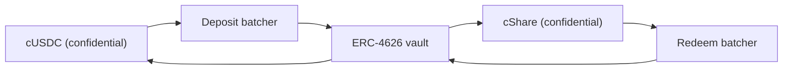

# பரிசுப் பணம் எங்கிருந்து வருகிறது

பரிசுகள் என்பது வருவாய். யாருடைய அசலும் ஒருபோதும் பரிசாகச் செலுத்தப்படுவதில்லை, அதுதான் பூலை இழப்பில்லாததாக
ஆக்குகிறது. ஒவ்வொரு மூலமும் அமல்படுத்தும் ஒரே இடைமுகம், இன்று Sepolia இல் இயங்கும் மூலம், ஒரு மூலம்
சொல்வதை பூல் ஏன் நம்ப மறுக்கிறது, மெயின்நெட்டில் Zama இன் சொந்த Confidential Vault எப்படிப் பொருந்துகிறது
என்பவற்றை இந்தப் பக்கம் விவரிக்கிறது.

## இடைமுகம்

```solidity
interface IYieldSource {
    function harvest() external returns (euint64 transferred); // confidential transfer to the recipient
    function harvestable() external view returns (uint64);      // display only
}
```

இரு செயல்பாடுகள். `harvest` திரண்ட வருவாயை ஒரு ரகசியப் பரிமாற்றமாகப் பரிசுப் பூலுக்கு நகர்த்தி, உண்மையில்
நகர்ந்த மறையாக்கப்பட்ட தொகையைத் திருப்புகிறது. `harvestable` செயலியின் காட்சிக்கானது, பூல் அதைக் கணக்குக்கு
ஒருபோதும் பயன்படுத்துவதில்லை.

`harvest` வேண்டுமென்றே ஒத்திசைவானது. அந்தத் தருணத்தில் மூலத்திடம் தயாராக இருப்பதை அது நகர்த்துகிறது,
ஒத்திசைவற்ற முறையில் ஈட்டும் ஒரு மூலம், பூலைக் காக்க வைக்காமல் அந்தத் தொகையை முன்கூட்டியே தயார்
செய்திருக்க வேண்டும் என எதிர்பார்க்கப்படுகிறது.

மூலத்தை மாற்றுவது பூலில் ஒரே ஓர் உரிமையாளர் அழைப்பு, `setYieldSource`, அது `YieldSourceSet` ஐ
வெளியிடுகிறது. எந்த மூலம் இணைக்கப்பட்டிருக்கிறது என்பது அமைப்பில் வேறு எதற்கும் தெரியாது, தேவையும் இல்லை.

ரிவர்ட் ஆகும் ஒரு மூலம் ஒரு குலுக்கலை நிறுத்துவதில்லை. பூல் அந்தத் தோல்வியைப் பிடித்து, அந்தக்
குலுக்கலின் அறுவடையை ஒரு சாதாரண மறையாக்கப்பட்ட பூஜ்ஜியமாகக் கருதி, `HarvestFailed` ஐ வெளியிடுகிறது.
மூடுதல் வெற்றி பெறுகிறது, அடுக்குகள் ஏற்கெனவே வைத்திருக்கும் நிதி இருப்பின் மீது குலுக்கல் இயங்குகிறது,
நகரத் தவறிய வருவாய் ஒரு பிற்பட்ட அறுவடையால் சேகரிக்கப்படுகிறது. உடைந்த அல்லது தவறாக இணைக்கப்பட்ட ஒரு
மூலம் பரிசுப் பக்கத்தைப் பட்டினி போடுகிறது; கடிகாரத்தை அதனால் நிறுத்த முடியாது.

ஓர் அறுவடை வந்து சேரும்போது, அது அந்தக் குலுக்கலின் வழங்கலில் பதிவு செய்யப்பட்டு, அடுத்த மூடுதலில்
முன்வைக்கப்படுகிறது. எனவே காலகட்டம் `p` இன் வருவாய், குலுக்கல் `p` இன் அல்ல, குலுக்கல் `p+1` இன்
பரிசுகளுக்கு நிதியளிக்கிறது. சீட் இருப்பதற்கு முன்பே பரிசு அளவுகளை நிர்ணயிக்க அதுவே வழிவகுக்கிறது.

## Sepolia: நிதியுதவி மூலம்

ஒவ்வொரு நேரடிப் பூலிலும் இயங்குவது `SponsoredYieldSource`, ஒவ்வொன்றுக்கும் ஓர் நிகழ்வு, எனவே ஏழு
மூலங்கள் என்பது ஏழு வெவ்வேறு டோக்கன்களின் ஏழு தனித்தனி இருப்புகள். USDC பூலினுடையது
`0xCC49DF69eAB6884fD8DD9260902B8A0Abc9D6b91` இல்; மற்ற ஆறும்
[பூல்களும் டோக்கன்களும்](pools-and-tokens.md) பக்கத்தில்.

ஒரு நிதியுதவியாளர் பூலின் பொது டோக்கனுடன் மூலத்தின் சொந்த `sponsor` செயல்பாட்டை அழைக்கிறார். மூலம்
அதை ரகசியமானதாக ரேப் செய்து, நிதியுதவியாளர் கேட்டதை அல்ல, ரேப்பர் மின்ட் செய்ததைச் சரியாகப் பதிவு
செய்கிறது. அங்கிருந்து இருப்பு `ratePerSecond` இல் சொட்டுகிறது, USDC பூலில் அது
`5,555 base units a second, which is 19.998 USDC a period`,
திரண்டதை `harvest` பூலுக்கு அனுப்புகிறது. ஒவ்வொரு பூலின் விகிதமும் மணிக்கு முழு டோக்கன்களில்
நிர்ணயிக்கப்படுகிறது, அதனால் வெவ்வேறு கடிகாரங்களில் இயங்கும் இரு பூல்களை ஒரே பார்வையில் ஒப்பிட முடியும்.
ஒவ்வொரு நிதியுதவியும் எண்பது குலுக்கல்களுக்கு மேல் தாங்கும் அளவுக்குத் தயாரிக்கப்பட்டது.

ஒரு நிதியுதவி என்பது ஒரு நன்கொடை. நிதியுதவியாளர் அதைத் திரும்பப் பெறும் வழி இல்லை, சொட்டு விகிதத்தை
மூலத்தின் உரிமையாளர் மட்டுமே மாற்ற முடியும், அது `RateChanged` ஐ வெளியிடுகிறது.

நிதியுதவித் தொகைகளும், சொட்டு விகிதமும், ஒவ்வொரு அறுவடையும் பொதுவானவை. அது ஒரு சமரசம் அல்ல: PoolTogether
இலும் ஒரு வால்ட் பங்களிக்கும் வருவாயின் அளவு பொதுவானதே, ஒவ்வொரு பரிசு அளவும் அதிலிருந்தே வருகிறது.
Hearth இல் ரகசியமாக இருப்பது யார் எவ்வளவு சேமித்தார்கள், யார் வென்றார்கள் என்பதுதான், பூல் எவ்வளவு பணம்
ஈட்டியது என்பது ஒருபோதும் அல்ல.

பூலில் சிறிது காலம் சேமிப்பாளர்களே இல்லாவிட்டாலும் வருவாய் திரண்டு, சேமிப்பாளர்கள் இருக்கும் முதல்
குலுக்கல்களுக்குச் செலுத்தப்படுகிறது. காலியான ஒரு பூலில் எதுவும் சிக்கிக்கொள்வதில்லை.

### ஏன் ஒரு மாக்

ஏனெனில் ஒரு மாக் மூலம், அது எப்படி இயங்குகிறது, ஒரு நிஜமான மூலம் எப்படிப் பொருந்தும் என்பதை ஆவணங்கள்
சொன்னால் மட்டுமே நேர்மையானது; இரண்டும் கீழே இருக்கின்றன. முதலில் நிஜமான ஒன்றைத் தேடினோம், Zama இன் மாக்
டோக்கன்கள் மீது வருவாய் தரும் ஒன்று Sepolia இல் இல்லை:

| இடம் | ஏன் இல்லை |
| --- | --- |
| Aave | Sepolia இல் USDC டெபாசிட்களை மறுக்கிறது, வழங்கல் உச்சவரம்பு தாண்டப்பட்டது |
| Compound | Zama இன் மாக் அல்ல, Circle இன் சொந்த USDC ஐ விரும்புகிறது |
| Zama இன் Confidential Vault | Sepolia வால்ட் என்பது வருவாய் அடாப்டர் இல்லாத, செயலற்ற நிலைக்கு மட்டுமான VaultV2, அது Zama இன் சொந்த விவரிப்பு |

எனவே நேர்மையான வழிகள் இரண்டு: உயர்ந்துகொண்டே போகும் ஒரு போலி எண், அல்லது செயினில் உண்மையிலேயே இருக்கும்,
உண்மையிலேயே சொட்டும், நிதியுதவியாளர் நிதியளித்த ஒரு இருப்பு. இரண்டாவதை எடுத்தோம். ஏழு நேரடிப் பூல்கள்
ஒவ்வொன்றிலும் இருக்கும் பரிசுப் பணத்தின் ஒவ்வொரு அலகும் உண்மையிலேயே ரேப் செய்யப்பட்டு, உண்மையிலேயே
பரிமாற்றப்பட்டு, உண்மையிலேயே சரிபார்க்கப்பட்டது.

## அறிவிக்கப்பட்ட ஓர் எண்ணை பூல் ஒருபோதும் பதிவு செய்வதில்லை

நிதியுதவி மூலம் ஒரு பலவீனமான இடமாக ஆகாமல் காக்கும் விதி இதுதான்.

மூலம் பூலுக்கு ஒரு மறையாக்கப்பட்ட பரிமாற்றத்தைச் செய்கிறது. பெறுநர் என்ற முறையில் அந்தச் சைஃபர்டெக்ஸ்ட்
மீது பூலுக்கு அனுமதி இருக்கிறது, எனவே பரிமாற்றப்பட்ட தொகையைப் பொதுவாக மறைநீக்கம் செய்யக்கூடியதாக அதுவே
குறிக்க முடியும். வழங்கல் நேரத்தில், வெளிப்படை மதிப்பின் மீதான சாவி மேலாண்மைச் சேவையின் கையொப்பத்தை
`FHE.checkSignatures` சரிபார்த்த பிறகே பூல் அடுக்குகளுக்கு எதையும் வரவு வைக்கிறது.

எவ்வளவு அனுப்பியது என்று பொய் சொல்லும் ஒரு மூலத்துக்கு எதுவும் கிடைக்காது. வந்து சேர்ந்த தொகையையே பூல்
பதிவு செய்கிறது, ஏனெனில் அது பார்க்கும் ஒரே தொகை அதுதான்.

இது கோட்பாட்டு எச்சரிக்கை அல்ல. எங்கள் முந்தைய வடிவமைப்பில், அழைப்பவர் கொடுத்த தொகையிலிருந்து பூல்
கையிருப்பு நிரப்பல்களைப் பதிவு செய்தது, ஆனால் ரேப்பர் மின்ட் செய்வது `amount / rate()`. நேரடி
டெப்ளாய்மென்ட்டில் `rate()` தற்செயலாக 1 ஆக இருந்ததால் இரண்டும் ஒத்துப்போயின, பிழை மறைந்திருந்தது. 18
தசம இட அடிப்படை டோக்கனில், ரேப்பரின் விகிதம் ஒரு மில்லியன் மில்லியனாக இருக்கும் இடத்தில், இருப்பதை விட
ஒரு மில்லியன் மில்லியன் மடங்கு பரிசுப் பணம் இருப்பதாக பூல் நம்பியிருக்கும். 2 செப்டம்பர் 2026 அன்று 18
தசம இடங்கள் கொண்ட ஒரு சோதனை டோக்கனுக்கு எதிராக அதை நடத்தி, அது நடப்பதைப் பார்த்தோம். ஓர் இழப்பில்லா
பூலில் இல்லாத பரிசு நிதி இருப்பு இறுதியில் யாரோ ஒருவரின் அசலிலிருந்தே செலுத்தப்படும், தயாரிப்பால் மீற
முடியாத ஒரே வாக்குறுதி அதுதான். பரிமாற்றத்தைச் சரிபார்ப்பது இந்த வகை முழுவதையும் நீக்குகிறது.

## மெயின்நெட்: Zama இன் Confidential Vault

ரகசிய இருப்புகள் மீது வருவாய் ஈட்டுவதையே முழு வேலையாகக் கொண்ட ஒரு நெறிமுறையை Zama அனுப்புகிறது, அதுவே
இயல்பான மெயின்நெட் மூலம். அந்த வடிவமைப்பில் `ConfidentialVaultYieldSource` தான் அடாப்டர். கீழே வருவது
அதன் விவரக்குறிப்பு, இந்தக் களஞ்சியத்தில் இருக்கும் ஒரு ஒப்பந்தம் அல்ல.

இங்கே மற்ற எல்லாவற்றையும் போலவே, ஒரு பூலுக்கு ஓர் அடாப்டர், ஒவ்வொன்றுக்கும் அதன் சொந்த டோக்கனுக்கான ஒரு
பேட்ச்சரும் ஒரு வருவாய் வால்ட்டும் தேவை. Zama இன் மெயின்நெட் டெப்ளாய்மென்ட் இன்று USDC ஐ உள்ளடக்குகிறது,
எனவே ஒரு மெயின்நெட் Hearth, USDC பூலை Confidential Vault மீது திறக்கும், வேறெந்தத் டோக்கனையும் அதற்கு
இருக்கும் மூலத்தின் மீது, அல்லது எதன் மீதும் இல்லாமல்.

வடிவமைப்பு என்பது, ரகசிய டோக்கன்களுக்கும் ஒரு சாதாரண ERC-4626 வருவாய் வால்ட்டுக்கும் இடையில் அமரும் ஒரு
பேட்ச்சர். ஓர் ERC-4626 வால்ட் பொதுப் பரிமாற்றங்களை மட்டுமே ஏற்கிறது, எனவே தனியாக டெபாசிட் செய்பவர் தன்
சரியான தொகையை வெளியிட்டுவிடுவார். அதற்குப் பதிலாக பேட்ச்சர் பல மறையாக்கப்பட்ட டெபாசிட்களைச் சேர்த்து,
கூட்டுத்தொகையை மட்டும் மறைநீக்கம் செய்து, வால்ட்டுக்குள் ஒரே பொது டெபாசிட்டைச் செய்து, ரகசியப் பங்குகளைத்
திருப்பித் தருகிறது. Zama இன் சொந்த வார்த்தைகள்: "யார் பங்கேற்றார்கள் என்பதைக் கவனிப்பாளர்கள்
பார்க்கிறார்கள், ஆனால் யார் எவ்வளவு பங்களித்தார்கள் என்பதை அல்ல."



அடாப்டர், டெபாசிட் பேட்ச்சரை பூலின் ரகசிய டோக்கனுடன் இணைத்து, ரகசியப் பங்குகளை வைத்திருக்கிறது. மீட்பு
அறுவடைக்கு முன், தன் சொந்த அட்டவணையில் இயங்குகிறது: கீப்பர் அவ்வப்போது மீட்புப் பேட்ச்சரிடம் வளர்ச்சியைக்
கேட்டு, அந்தக் கோரிக்கையை அதன் நான்கு நிலைகள் வழியாக நடத்திச் செல்கிறது. எனவே பூல் அடுத்த முறை `harvest`
ஐ அழைக்கும்போது, மீட்கப்பட்ட ரகசிய USDC ஏற்கெனவே அடாப்டரில் அமர்ந்திருக்கும், அறுவடை வேறெந்தப்
பரிமாற்றத்தையும் போல ஒரே பரிமாற்றமாக இருக்கும். ஒரு ஒத்திசைவற்ற இடம் ஒரு ஒத்திசைவான இடைமுகத்தைச்
சந்திப்பது அப்படித்தான். அந்த நான்கு நிலைகளுக்கும் அனுமதி தேவையில்லை, எனவே அவற்றை இயக்க Zama இன்
இயக்குநருக்காக யாரும் காத்திருக்க வேண்டியதில்லை.

### முகவரிகள்

Zama இன் சொந்த முகவரிப் பட்டியலிலிருந்து, 2 செப்டம்பர் 2026 அன்று பெறப்பட்டது.

**Ethereum மெயின்நெட், சங்கிலி எண் 1.** அடிப்படைச் சொத்து USDC. வருவாய் மூலம்: Morpho
"Steakhouse Confidential Prime USDC" VaultV2, டெபாசிட் பேட்ச்சர் மட்டுமே வால்ட்டின் டெபாசிட்டராக
இருக்கும்படி கட்டுப்படுத்தப்பட்டது.

| ஒப்பந்தம் | முகவரி |
| --- | --- |
| Deposit batcher | `0x324EA89FD3784036673BfE6Ffee2334A088F40Cc` |
| Redeem batcher | `0x96Cd3Faa7483783Ac2Eb715f6333361500F1eec9` |
| cUSDC wrapper | `0xe978F22157048E5DB8E5d07971376e86671672B2` |
| cShare wrapper | `0x66Bf74E96900D1a19c7070D939D124f2F565C458` |
| ERC-4626 vault | `0xbEEF00A59B577423653A1526c7009bdE103F542B` |
| USDC | `0xA0b86991c6218b36c1d19D4a2e9Eb0cE3606eB48` |

**Sepolia, சங்கிலி எண் 11155111.** ஒரு நிலைப்படுத்தல் சூழல்: USDC என்பது பொது `mint` கொண்ட ஒரு மாக்,
வால்ட் வருவாய் அடாப்டர் இல்லாத செயலற்ற நிலைக்கு மட்டுமானது.

| ஒப்பந்தம் | முகவரி |
| --- | --- |
| Deposit batcher | `0x48758559c14d4d92b4C74A99660B6a8dbe85F53b` |
| Redeem batcher | `0xe94E9afdDd43a19C2914739e9279cb6Fe287BEb0` |
| cUSDC wrapper | `0x7c5BF43B851c1dff1a4feE8dB225b87f2C223639` |
| cShare wrapper | `0x7E93d5c150A2178B1fCde0278582Acf59478eA5f` |
| ERC-4626 vault (idle) | `0x6AB54988261AEC573a2CA13cF802d3B1114f864C` |
| Mock USDC | `0x9b5Cd13b8eFbB58Dc25A05CF411D8056058aDFfF` |

Sepolia வால்ட் செயலற்றதாக இருப்பதால், அடாப்டர் இங்கே Zama இன் வெளியிடப்பட்ட பேட்ச்சர் இடைமுகத்துக்கு
எதிராக விவரிக்கப்பட்டுள்ளது, இன்னும் எழுதப்படவில்லை. எதுவும் ஈட்டாத ஒன்றை நேரடியாக இயங்குகிறது என்று
சொல்வது, யார் வேண்டுமானாலும் ஒரு நிமிடத்தில் சரிபார்க்கக்கூடிய ஒரு பொய்யாக இருக்கும்.

### அதை இணைப்பது நடைமுறையில் என்ன

பேட்ச்சர் நான்கு நிலைகளில் நகர்கிறது: இணைதல், அனுப்புதல், இறுதிசெய்தல், கோருதல். ஒரு தொகுதி ஒரு
குறைந்தபட்ச வயதை எட்டும் வரை காத்திருக்கிறது, பிறகு அதன் மொத்தம் மறைநீக்கம் செய்யப்படுகிறது, பிறகு வால்ட்
தீர்வு செய்கிறது, பிறகு பங்கேற்பாளர்கள் கோருகிறார்கள். அந்த நிலைகள் ஒவ்வொன்றுக்கும் அனுமதி தேவையில்லை,
எனவே Zama இன் இயக்குநருக்காக பூல் ஒருபோதும் காத்திருப்பதில்லை, கோரிக்கைகள் ஒருபோதும் காலாவதியாவதில்லை.

அந்தத் தாளம் நிதியுதவி மூலத்தின் உடனடிச் சொட்டை விட மெதுவானது, அதனால்தான் கீப்பர் மீட்பை `harvest` க்குள்
அல்ல, முன்கூட்டியே நடத்துகிறது. பூலின் ஒப்பந்தம் ஒருபோதும் காத்திருப்பதில்லை: ஏற்கெனவே கோரப்பட்டு
வந்ததை மட்டுமே அது அடாப்டரிடம் கேட்கிறது. இதை நேரடியாகக் கொண்டுவர மீதமிருக்கும் நிஜமான வேலை, அடாப்டர்
ஒப்பந்தமே, இந்தக் களஞ்சியம் அதை விவரிக்கிறது ஆனால் அமல்படுத்தவில்லை. அத்துடன் அதன் கீப்பர் பக்கம்,
அதாவது எத்தனை முறை மீட்பைத் தொடங்குவது, நிலையில் எவ்வளவு மீட்பது என்பதைத் தீர்மானிப்பது, அது தாமதமானாலும்
செயினில் எந்த விளைவும் இல்லாத ஒரு கொள்கைத் தேர்வு.

### Hearth எதைப் பரம்பரையாகப் பெறும்

இதைச் சரியாகப் பெயரிடுவது, இதைப் பற்றி நம்பகமாக இருப்பதன் ஒரு பகுதி.

- **வால்ட் ரிஸ்க், முழுமையாக.** பேட்ச்சர் பணத்தை ஒரு மூன்றாம் தரப்பு ERC-4626 வால்ட்டுக்கு அனுப்புகிறது.
  அந்த வால்ட் மதிப்பை இழந்தால், பூலின் வருவாய் ஈட்டும் இருப்பும் அதனுடன் மதிப்பை இழக்கும். "இழப்பில்லை"
  என்பது வேறொருவரின் ஒப்பந்தத்தைச் சார்ந்திருக்கும் ஒரே இடம் இதுதான், அதனால்தான் ஒரு மெயின்நெட்
  டெப்ளாய்மென்ட் வருவாய் ஈட்டும் பகுதியை மட்டுமே அங்கே வைத்திருக்க வேண்டும்.
- **தொகுதி ரகசியத்தன்மை, பூல் ரகசியத்தன்மை அல்ல.** உடன் பங்கேற்பாளர்களுக்கு நடுவே பேட்ச்சர் தொகைகளை
  மறைத்து, கூட்டுத்தொகையை மறைநீக்கம் செய்கிறது. ஒரு தொகுதியில் Hearth மட்டுமே பங்கேற்பாளராக இருந்தால்,
  அதன் டெபாசிட் தொகை பொதுவாகிவிடும். அதனால் நமக்கு எந்த இழப்பும் இல்லை, ஏனெனில் Hearth இன் அறுவடைகள்
  எப்படியும் வெளியிடப்படுகின்றன. ஆனால் பேட்ச்சர் இதை விட அதிகம் மறைக்கிறது என்று கருதுவதற்கு முன்
  இதைத் தெரிந்துகொள்வது நல்லது.
- **வரையறுக்கப்பட்ட உரிமையாளர் அதிகாரங்கள்.** பேட்ச்சரின் உரிமையாளர் குறைந்தபட்சத் தொகுதி வயதை (7 நாட்கள்
  உச்சவரம்பு), கால்பேக் கெடுவை (30 நாட்கள் உச்சவரம்பு), டெபாசிட் சறுக்கல் சகிப்புத்தன்மையை மாற்றலாம்,
  இணைதலையும் அனுப்புதலையும் இடைநிறுத்தலாம். உரிமையாளரால் பயனர் நிதியை நகர்த்தவோ முடக்கவோ முடியாது, ஒரு
  முடிவைத் தணிக்கை செய்ய முடியாது, யாருடைய தொகைகளையும் மறைநீக்கம் செய்ய முடியாது, ஒப்பந்தத்தை
  மேம்படுத்தவும் முடியாது என்று Zama இன் ஆவணங்கள் கூறுகின்றன. ஒரு வால்ட் இறக்கத்தின்போதும் வெளியேறல்
  வேலை செய்ய, மீட்புச் சறுக்கல் பாதுகாப்பு நிரந்தரமாக அணைக்கப்பட்டிருக்கிறது.

## இந்தப் பக்கம் எதை உள்ளடக்கவில்லை

கசிவு அட்டவணையின் மீது வருவாய் மூலத்தின் விளைவை இது உள்ளடக்கவில்லை, அது
[எது ரகசியமாக இருக்கிறது](../security/what-stays-private.md) பக்கத்தில். Morpho வால்ட்டின் வருவாயை இது
அளக்கவில்லை, அது வேறொருவரின் எண், தினமும் மாறுவது. அடாப்டர் இயங்குகிறது என்றும் இது கூறவில்லை: Sepolia
இல் இணைக்கப்பட்டிருப்பது நிதியுதவி மூலம், டாஷ்போர்டில் இருக்கும் "The pool right now" அட்டை அதைப்
பெயரிட்டுச் சொல்கிறது.
